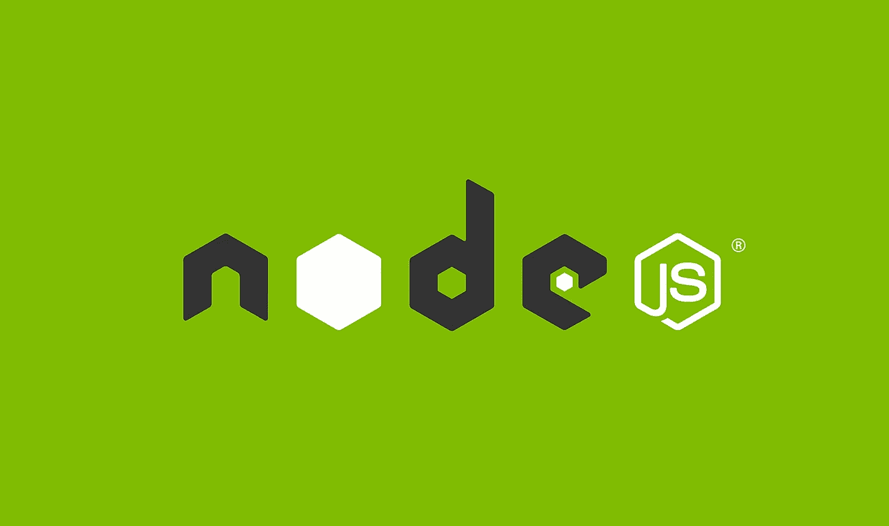
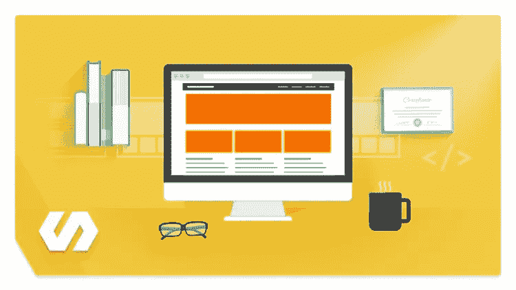
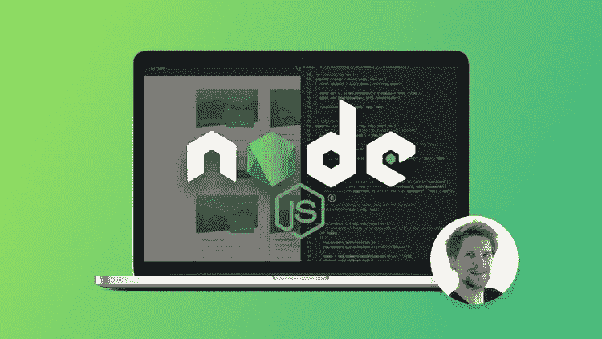
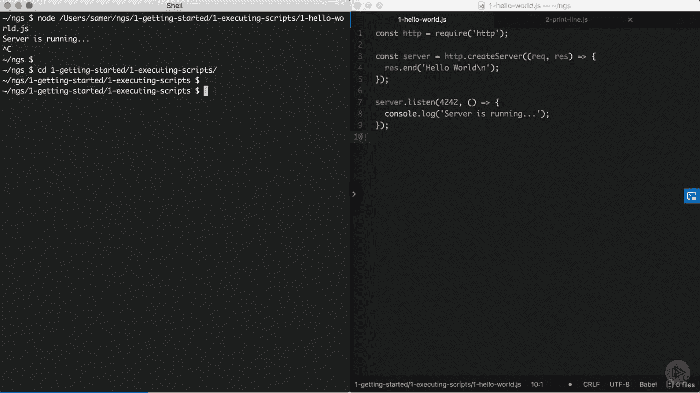
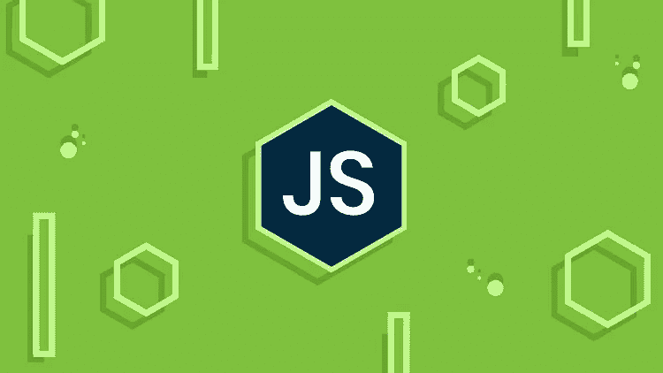
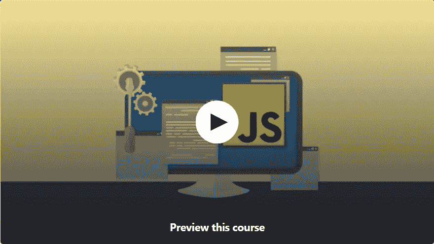
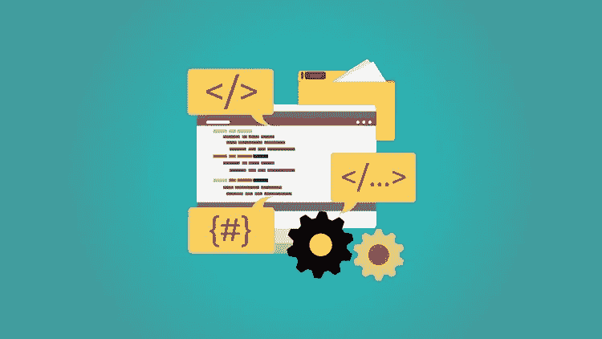
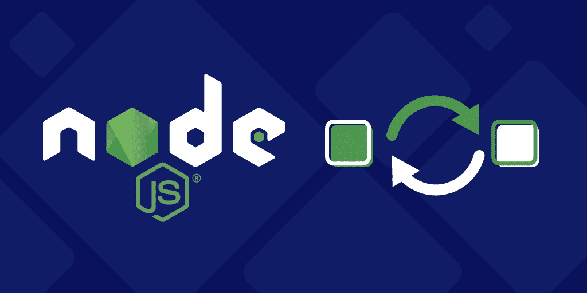
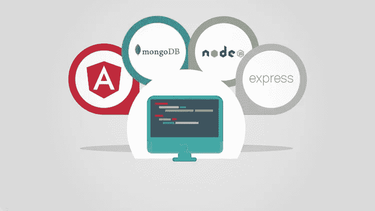

# 2023 年面向初学者和有经验的 Web 开发人员的 10 大 Node.js 课程

> 原文：<https://medium.com/javarevisited/top-10-online-courses-to-learn-node-js-in-depth-8ef0e31ca139?source=collection_archive---------0----------------------->

毫无疑问，JavaScript 是世界上排名第一的编程语言， **Node.js** 是最大的原因之一。最初，JavaScript 被认为只是一种客户端脚本语言，但 Node.js 允许开发人员使用 JavaScript 在服务器端创建动态网页，从而改变了这一切。它还被评为最受全栈开发人员欢迎的 JavaScript 框架。

Node.js 最重要的好处是它允许你只基于一种语言 [JavaScript](http://javarevisited.blogspot.sg/2017/02/top-5-javascript-books-to-learn-best-of-lot-must-read.html) 构建一个全栈应用。这对于那些非常强调能够早期和经常迭代的初创公司来说尤其有用。如果你是一名 web 开发人员，并渴望成为一名全栈 web 开发人员，那么你应该尽早考虑学习 Node.js，2023 年可能正是时候。这也是我列出的 2023 年 Java 和 Web 开发人员应该学习的十大框架之一。幸运的是，网上有很多好的 Node.js 资源，比如书籍、电子书和在线课程，你可以利用它们按照自己的进度自学 Node.js。

过去，我已经分享了一些免费的 Node.js 课程，但是你们中的许多人要求更完整和更高级的课程，这就是为什么我创建了这个列表。我个人喜欢从 Udemy 或 Pluralsight 的在线课程开始。一旦我对这项技术有了基本的了解，我就会求助于这本书来获得更全面的知识。在这篇文章中，我将从 [Udemy](https://click.linksynergy.com/fs-bin/click?id=JVFxdTr9V80&offerid=323058.9410&type=3&subid=0) 和 [Pluralsight](https://pluralsight.pxf.io/c/1193463/424552/7490?u=https%3A%2F%2Fwww.pluralsight.com%2Flearn) 分享一些学习 Node.js 的最佳在线课程。

无论如何，这个列表也包括一些免费的课程，所以你也可以从那里开始，但是 Udemy 提供终身访问他们的课程，如果你喜欢任何课程，你也可以购买以后学习。

# 2023 年在线学习 Node JS 的 10 大课程

这里是我列出的一些学习 Node.js 的最佳在线课程，但在浏览这些课程之前，让我告诉你什么是 Node.js 以及你为什么应该学习它？

> Nodejs 是一个开源的跨平台环境，用于使用 JavaScript 创建服务器端和网络应用程序。

它建立在 Chrome 的 JavaScript 运行时之上，可以用来快速构建大规模的 web 应用。它使用非阻塞 I/O 甚至驱动模型来创建轻量级和高度可伸缩的 web 应用程序。这允许开发人员使用 JavaScript 构建端到端的客户端-服务器应用程序。

## [**1。Node.js 开发者教程(第三版)**](https://click.linksynergy.com/fs-bin/click?id=JVFxdTr9V80&subid=0&offerid=323058.1&type=10&tmpid=14538&RD_PARM1=https%3A%2F%2Fwww.udemy.com%2Fthe-complete-nodejs-developer-course-2%2F)

这是 Node.js 上最全面的课程之一。在深入研究 Express JS、Mongoose 和 MongoDB 等优秀工具之前，它涵盖了 Node 的基础知识。

整个课程都基于一个目标:将你变成一名能够开发、测试和部署真实生产应用程序的专业节点开发人员，Andrew Mead 在这方面做得非常好。

简而言之，对于任何希望学习 Node JS、转行或作为 Node 开发者的自由职业者来说，这都是一门伟大的课程。

**此处是加入本课程的链接**—[node . js 开发人员完整课程(第三版)](https://click.linksynergy.com/fs-bin/click?id=JVFxdTr9V80&subid=0&offerid=323058.1&type=10&tmpid=14538&RD_PARM1=https%3A%2F%2Fwww.udemy.com%2Fthe-complete-nodejs-developer-course-2%2F)

## 2. [**NodeJS —完整指南(MVC、REST APIs、GraphQL、Deno)**](https://click.linksynergy.com/deeplink?id=JVFxdTr9V80&mid=39197&murl=https%3A%2F%2Fwww.udemy.com%2Fcourse%2Fnodejs-the-complete-guide%2F)

这是在 Udemy 上学习 Node.js 的又一个很棒的课程。这个课程是由我最喜欢的 Udemy 导师之一、AcadMind 的 Maximilian Schwarmuller 创建的。

参加了他的[反应课程](https://click.linksynergy.com/deeplink?id=JVFxdTr9V80&mid=39197&murl=https%3A%2F%2Fwww.udemy.com%2Fcourse%2Freact-the-complete-guide-incl-redux%2F)和[角度完全指南](https://click.linksynergy.com/deeplink?id=JVFxdTr9V80&mid=39197&murl=https%3A%2F%2Fwww.udemy.com%2Fcourse%2Fthe-complete-guide-to-angular-2%2F)，我确信这个课程将是另一个宝石，我没有失望。在本课程中，您不仅将学习 Node.js，还将学习许多相关技术，如 Deno.js、REST APIs with Node.js、GraphQL APIs、身份验证、MongoDB、SQL &等等！

以下是您将在本课程中学到的主要内容:

*   详细介绍 NodeJS 的基础知识和高级概念
*   如何用 NodeJS、数据库如 [SQL](/javarevisited/7-free-courses-to-learn-database-and-sql-for-programmers-and-data-scientist-e7ae19514ed2) 或 MongoDB 等构建现代、快速、可伸缩的服务器端 web 应用程序
*   了解 NodeJS 生态系统并构建服务器端呈现的应用程序、REST APIs 和 GraphQL APIs
*   Node.js creator 推出的基于 Typescript 的新运行时 Deno.js。

总的来说，这是一个在线学习 Node.js 的很好的课程，受到了全世界超过 80K 名开发人员的信任。

**这里是加入本课程的链接** — [NodeJS —完整指南(MVC、REST APIs、GraphQL、Deno)](https://click.linksynergy.com/deeplink?id=JVFxdTr9V80&mid=39197&murl=https%3A%2F%2Fwww.udemy.com%2Fcourse%2Fnodejs-the-complete-guide%2F)

## 3.[节点 JS:高级概念](https://click.linksynergy.com/deeplink?id=JVFxdTr9V80&mid=39197&murl=https%3A%2F%2Fwww.udemy.com%2Fcourse%2Fadvanced-node-for-developers%2F)

这是一门学习 Node.js 的高级课程，重点是如何使用 Redis 进行缓存，通过集群加速，以及使用 S3 和 Node 添加图片上传！

这个课程是由另一位牛逼的 Udemy 导师，同时也是 Udemy 上[**Modern React with Redux**](https://click.linksynergy.com/deeplink?id=JVFxdTr9V80&mid=39197&murl=https%3A%2F%2Fwww.udemy.com%2Fcourse%2Freact-redux%2F)课程的作者 Stephen Grider 创建的，这可能是 Udemy 上最好的 React 和 Redx 课程了。如果你能与斯蒂芬联系起来，你会爱上这门课的。

以下是您将在本课程中学到的主要内容:

*   理解事件循环及其每个阶段
*   了解如何利用工作线程和集群来显著提高节点服务器的性能
*   如何用 Redis 支持的 MongoDB 的缓存来加速数据库查询
*   如何将自动化浏览器测试添加到您的节点服务器，并完成持续集成管道设置
*   如何利用 AWS S3 将可缩放图像和文件上传应用到您的应用程序

如果你已经知道 Node.js 并且正在寻找一门高级课程来将你的 Nodejs 技能提升到一个新的水平，那么你会喜欢这门课程的。

**这里是加入本课程**——[节点 JS:高级概念](https://click.linksynergy.com/deeplink?id=JVFxdTr9V80&mid=39197&murl=https%3A%2F%2Fwww.udemy.com%2Fcourse%2Fadvanced-node-for-developers%2F)的链接

## 4. [Node.js，Express，MongoDB &更多:完整训练营 2023](https://click.linksynergy.com/deeplink?id=JVFxdTr9V80&mid=39197&murl=https%3A%2F%2Fwww.udemy.com%2Fcourse%2Fnodejs-express-mongodb-bootcamp%2F)

Udemy 有很多精彩的 Node.js 课程，我不得不提到另一个在线课程，通过构建真实世界的 RESTful API 和 web 应用程序来学习 Node(具有身份验证、Node.js 安全性、支付等)。

本课程由 Jonas Schmedtmann 创建，他是《完整的 JavaScript 课程 2023:构建真正的项目课程 的作者——Udemy 上最好的 JavaScript 课程之一，也是我最喜欢的 Udemy 导师之一。这门课程也和他的其他课程不相上下。

以下是您将在本课程中学到的重要内容:

*   学习整个现代后端堆栈:Node、Express、MongoDB 和 mongose(MongoDB JS 驱动程序)
*   如何从头开始构建一个完整、漂亮且真实的应用程序
*   如何构建一个快速、可伸缩、功能丰富的 RESTful API(包括过滤器、排序、分页等等)
*   理解 Node 在幕后真正是如何工作的:事件循环、阻塞与非阻塞代码、流、模块等。
*   安全性:加密、净化、速率限制等。
*   如何将最终应用程序部署到生产环境中(包括 Git 速成班)

如果你喜欢基于项目的在线课程和实践学习，那么我强烈推荐这门课程，它受到了全球超过 25K 名开发人员的信任。

**以下是加入本课程的链接** — [Node.js，Express，MongoDB &更多:完整的训练营 2023](https://click.linksynergy.com/deeplink?id=JVFxdTr9V80&mid=39197&murl=https%3A%2F%2Fwww.udemy.com%2Fcourse%2Fnodejs-express-mongodb-bootcamp%2F)

## [**5。Node.js 简介**](https://pluralsight.pxf.io/c/1193463/424552/7490?u=https%3A%2F%2Fwww.pluralsight.com%2Fcourses%2Fnode-intro) **【复数视线】**

这是初学者在 Pluralsight 上学习 Node.js 的最佳课程之一，也是这个列表中第一个也是唯一一个不是来自 Udemy 的课程。

在本课程中，您将了解 Node.js 的背景，以及使用回调和流编写异步代码的概念和策略。它还解释了如何用 NPM 和 `require()`来模块化你的应用程序。最后，您将学习用于构建和扩展 web 应用程序的内置 API 以及一些关键的第三方模块。这个课程是由萨梅尔·布纳创建的，他是我在 Pluralsight 上最喜欢的老师之一，也是一名 JavaScript 专家。

**这里是加入本课程**—[node . js 简介](https://pluralsight.pxf.io/c/1193463/424552/7490?u=https%3A%2F%2Fwww.pluralsight.com%2Fcourses%2Fnode-intro)的链接

顺便说一下，你需要一个 [Pluralsight 会员](https://pluralsight.pxf.io/c/1193463/424552/7490?u=https%3A%2F%2Fwww.pluralsight.com%2Flearn)才能进入这门课程，费用大约为每月 29 美元或每年 299 美元(14%的折扣)，尽管这完全值得，因为你将获得 7000 多门关于最新技术的在线课程。

或者，您也可以通过与 Pluralsight 签署 [10 天免费试用协议来免费获得该课程。你不需要支付一分钱，但是的，你需要先注册，你将获得 200 分钟观看他们的任何课程。](http://pluralsight.pxf.io/c/1193463/424552/7490?u=https%3A%2F%2Fwww.pluralsight.com%2Flearn)

<https://pluralsight.pxf.io/c/1193463/424552/7490?u=https%3A%2F%2Fwww.pluralsight.com%2Fpricing%2Ffree-trial>  

## 6 [**。学习和理解节点 JS**](https://click.linksynergy.com/fs-bin/click?id=JVFxdTr9V80&subid=0&offerid=323058.1&type=10&tmpid=14538&RD_PARM1=https%3A%2F%2Fwww.udemy.com%2Funderstand-nodejs%2F)

这是从 Udemy 学习和理解 Node.js 的又一个好课程。您不仅将学习缓冲区、流和管道等基本概念，还将学习 Node.js 是如何工作的。您还将学习如何在 Node 中构建 Web 服务器，并了解它的实际工作原理。

您还将了解异步代码如何在节点和节点事件循环中工作，以及如何使用事件发射器、流、缓冲区、管道和文件。

总之是初学者和中级 web 开发人员学习 Node.js 的最佳课程之一。本课程由[艾丽西娅·安东尼](https://medium.com/u/4e4921936af1?source=post_page-----8ef0e31ca139--------------------------------)创建

**这里是加入本课程** — [学习和理解节点 JS](https://click.linksynergy.com/fs-bin/click?id=JVFxdTr9V80&subid=0&offerid=323058.1&type=10&tmpid=14538&RD_PARM1=https%3A%2F%2Fwww.udemy.com%2Funderstand-nodejs%2F) 的链接

## [**7。快递 JS 基础**](https://click.linksynergy.com/fs-bin/click?id=JVFxdTr9V80&subid=0&offerid=323058.1&type=10&tmpid=14538&RD_PARM1=https%3A%2F%2Fwww.udemy.com%2Fexpressjs-fundamentals%2F)

这是 Udemy 上的免费课程，将教你用 NodeJS 和 Express JS 框架开发 RESTful Web 应用。节点和快递齐头并进。在任何类型的 web 或移动应用程序上使用这种编程范式的能力使得这种技能非常有价值。

尽管这是一门初级课程，但只针对不熟悉 Express.js 的程序员。

如果你已经理解了 Common.js 模块模式，你就可以参加这门课程了。否则，你应该先学习 Node.js 的基础知识。

**这里是免费加入本课程的链接**——[快递 JS 基础](https://click.linksynergy.com/fs-bin/click?id=JVFxdTr9V80&subid=0&offerid=323058.1&type=10&tmpid=14538&RD_PARM1=https%3A%2F%2Fwww.udemy.com%2Fexpressjs-fundamentals%2F)

## [**8。通过构建 12 个项目**](https://click.linksynergy.com/fs-bin/click?id=JVFxdTr9V80&subid=0&offerid=323058.1&type=10&tmpid=14538&RD_PARM1=https%3A%2F%2Fwww.udemy.com%2Flearn-nodejs-by-building-10-projects%2F) 来学习 Nodejs

对于那些来自其他服务器端语言的人来说，本课程非常适合使用服务器端 JavaScript Node 构建 web 应用程序。

在本课程中，您将学习 JavaScript 服务器编程、节点和 NPM 模块，以及在构建 12 个项目时其他相关技术和框架的使用。

本课程还涵盖了 HTML/CSS 前端技术、Nodejs NPM、NoSQL 数据库、列数据库、数据库 ORM、Express 框架、异步编程、北海巨妖层、干墙用户管理、Bcrypt 加密、Socket IO 和[REST API](http://javarevisited.blogspot.sg/2017/02/top-5-books-to-learn-rest-and-restful-web-services-in-java.html)。如果你不知道 Node.js 和 Express JS，那么这个课程是一个很好的起点。

**这里是加入本课程的链接**——[打造 12 个项目学习节点](https://click.linksynergy.com/fs-bin/click?id=JVFxdTr9V80&subid=0&offerid=323058.1&type=10&tmpid=14538&RD_PARM1=https%3A%2F%2Fwww.udemy.com%2Flearn-nodejs-by-building-10-projects%2F)

## 9.[2023 年完成 Node.js 开发者:零到精通](https://academy.zerotomastery.io/p/learn-node-js?affcode=441520_zytgk2dn)【ZTM】

这是 2023 年在线学习 Node.js 的又一个牛逼全面的课程。这个课程是由 Andrei Negaoie 创建的，他是最好的 web 开发讲师之一。

听过他的《JavaScript Web 项目:构建你的作品集的 20 个项目》课程后，我非常喜欢他的教学风格和课程质量，这次也不例外。

这是 2023 年学习 Node.js 最新的项目化课程之一。这门课程是为了提高效率而设计的。你再也不会把时间花在令人困惑、过时、不完整的教程上了。

相反，您将学习基础知识以外的知识，以便能够使用最新版本的 Node 构建专业的现代应用程序，并成为后端或全栈开发人员。

这也是一个基于项目的课程，您将使用 Node.js、Express Framework、RESTful APIs(包括 SpaceX API)、GraphQL 等构建一个大型 NASA 太空发射应用程序。这是一个大型的全栈 MERN 栈项目。如果你喜欢建筑项目，那么你会喜欢这门课程。

**以下是加入本课程的链接**——[2023 年完成 Node.js 开发者:零到精通](https://academy.zerotomastery.io/p/learn-node-js?affcode=441520_zytgk2dn)

顺便说一句，你需要一个 [ZTM 会员](https://academy.zerotomastery.io/p/academy?affcode=441520_zytgk2dn)才能观看这个课程，这个课程每月花费约 23 美元，但也提供了许多超级吸引人和有用的课程，如他的 Python 和 JavaScript 课程。您还可以使用我的代码朋友 10 获得您选择的任何订阅的 10%的折扣。

<https://academy.zerotomastery.io/p/academy?affcode=441520_zytgk2dn>  

## 10. [Learn Node.js:初学者完全教程](https://www.educative.io/courses/learn-nodejs-complete-course-for-beginners?affiliate_id=5073518643380224)【教育性】

如果你正在寻找一个学习 Node.js 的互动课程，那么你会喜欢这个课程，它是一个基于文本的互动学习平台，允许你在浏览器中运行代码，这样你就可以学习新的技术技能，而无需下载任何软件或在设置环境时陷入困境。

在这个交互式 Node.js 课程中，您将了解 Node.js 的内部工作方式。您还将了解它的基本特性，如事件循环如何工作，以及多线程如何工作。

之后，您将学习 Node.js 的基础知识，如文件系统、全局对象和 Buffer 类。在课程的后半部分，您将探索更高级的概念，如模块、事件和包。

在本课程结束时，您将实际操作 Node.js 并创建自己的食品配送 web 应用程序。完成本课程后，您将具备将 Node.js 放入简历的良好知识。

**这里是加入本课程的链接** — [Learn Node.js:初学者的完整课程](https://www.educative.io/courses/learn-nodejs-complete-course-for-beginners?affiliate_id=5073518643380224)

而且，如果你觉得教育平台和他们的互动课程很有用，那么考虑购买 [**教育订阅**](https://www.educative.io/subscription?affiliate_id=5073518643380224) ，每月只需 14.9 美元就能获得他们的 100 多门课程。它非常划算，非常适合准备编码面试和学习新的技术技能。

<https://www.educative.io/subscription?affiliate_id=5073518643380224>  

## 11.[node . js API master class With Express&MongoDB](https://click.linksynergy.com/deeplink?id=JVFxdTr9V80&mid=39197&murl=https%3A%2F%2Fwww.udemy.com%2Fcourse%2Fnodejs-api-masterclass%2F)【Udemy】

这是在 Udemy 上学习 Node.js、Express 和 MongoDB 的又一个牛逼课程。本课程由 Udemy 最佳讲师之一的 Brad Traversy 创建，将通过创建一个 bootcamp 目录应用程序的真实后端来教您 Node.js

以下是您将在本课程中学到的主要内容:

*   HTTP 基础(请求/请求周期、状态代码等)
*   高级猫鼬查询
*   JWT/Cookie 身份验证
*   Express 和 Mongoose 中间件(地理编码、身份验证、错误处理等)
*   API 安全(NoSQL 注入、XSS 保护、速率限制)
*   API 文档和部署

您还将为 Bootcamp 目录应用程序构建一个全功能的真实世界后端 RESTful API

**这里是加入本课程**—[node . js API master class With Express&MongoDB](https://click.linksynergy.com/deeplink?id=JVFxdTr9V80&mid=39197&murl=https%3A%2F%2Fwww.udemy.com%2Fcourse%2Fnodejs-api-masterclass%2F)的链接

## 12. [Angular & NodeJS —平均堆栈指南【2023 版】](https://click.linksynergy.com/deeplink?id=JVFxdTr9V80&mid=39197&murl=https%3A%2F%2Fwww.udemy.com%2Fcourse%2Fangular-2-and-nodejs-the-practical-guide%2F)

这是我最喜欢的 node.js 课程，适合任何想成为 Fullstack web 开发人员的人，因为这门课程不仅会教你创建后端的 Node.js，还会教你创建前端的 Angular。

在这个基于项目的课程中，您还将学习如何通过构建一个真实的应用程序将 Angular 前端连接到 NodeJS & Express & MongoDB 后端

以下是您将在本课程中学到的主要内容:

*   如何构建真正的 Angular + NodeJS 应用
*   了解 Angular 如何工作，以及它如何与后端交互
*   如何连接任意角度前端和节点后端
*   如何使用 MongoDB 和 Mongoose 与后端的数据进行交互
*   如何将 ExpressJS 作为 NodeJS 框架

如果你喜欢动手和基于项目的课程，那么你会喜欢这门课程。我向任何想成为全栈 JavaScript 开发人员的人强烈推荐这门课程。

**以下是加入本课程** — [Angular & NodeJS —均值叠加指南【2023 版】](https://click.linksynergy.com/deeplink?id=JVFxdTr9V80&mid=39197&murl=https%3A%2F%2Fwww.udemy.com%2Fcourse%2Fangular-2-and-nodejs-the-practical-guide%2F)的链接

以上就是 web 开发者学习 Node.js 和 Express JS 的一些**免费课程。根据 StackOverflow 的调查，Node.js 是最受欢迎的框架之一，这些课程将帮助您更好地学习它。这些培训课程强调 Node.js 的实际应用，将教你使用真实世界的应用开发进行 Node.js 开发。

其他 **Web 开发资源**您可能喜欢:**

*   [柯尔特·斯蒂尔的网络开发者训练营](https://click.linksynergy.com/deeplink?id=JVFxdTr9V80&mid=39197&murl=https%3A%2F%2Fwww.udemy.com%2Fthe-web-developer-bootcamp%2F)
*   [学习 Web 开发的五大课程](/javarevisited/top-10-free-courses-to-learn-html-5-css-3-and-web-development-872d62d97a97)
*   [学习 React 框架的前 5 门课程](https://javarevisited.blogspot.com/2019/04/10-free-angular-and-react-courses-for.html)
*   [如何在 2023 年成为一名网页开发者](https://hackernoon.com/the-2019-web-developer-roadmap-ab89ac3c380e)
*   [初学者学习棱角的 10 门免费课程](/javarevisited/top-10-free-courses-to-learn-angular-framework-in-2020-bb62148c73d3)
*   [2023 年 React 开发者路线图](https://javarevisited.blogspot.com/2018/10/the-2018-react-developer-roadmap.html)
*   [40 多岁能学编码和 Web 开发吗？](/javarevisited/can-you-learn-programming-and-become-a-web-developer-in-the-40s-and-50s-f9e117f32721)
*   [2023 年学会反应的 10 门免费课程](/javarevisited/top-10-free-courses-to-learn-react-js-c14edbd3b35f)
*   [网络开发者路线图(前端+后端)](https://dev.to/javinpaul/the-2019-web-development-frontend-backend-roadmap-4le2)
*   [5 为网络开发者提供的免费 HTML 和 CSS 课程](http://www.java67.com/2018/02/5-free-html-and-css-courses-to-learn-web-development.html)
*   [10 门面向程序员的 Java 和 Web 开发课程](https://javarevisited.blogspot.com/2018/01/top-10-udemy-courses-for-java-and-web-developers.html)
*   每个软件工程师都应该学习的 10 件事
*   [2023 年 Java 和 Web 开发者可以学习的 10 个框架](https://dev.to/javinpaul/10-frameworks-java-and-web-developers-can-learn-in-2019-17ke)

感谢阅读这篇文章。如果你喜欢这些最好的 Node.js 课程，请与你的朋友和同事分享。如果您有任何反馈或意见，请留言。

**P. S. —** 如果你热衷于学习 Node.js，但正在寻找免费的在线培训课程，那么你也可以在 Udemy 上查看[**Node:边做边学**](https://click.linksynergy.com/deeplink?id=JVFxdTr9V80&mid=39197&murl=https%3A%2F%2Fwww.udemy.com%2Fcourse%2Fcode-with-node%2F) 的代码，这是一门 19 小时的免费课程，用于学习 Node.js。这个课程是完全免费的，你只需要一个免费的 Udemy 帐户就可以参加这个课程。超过 24，000 名开发人员已经加入了这一课程。

<https://click.linksynergy.com/deeplink?id=JVFxdTr9V80&mid=39197&murl=https%3A%2F%2Fwww.udemy.com%2Fcourse%2Fcode-with-node%2F> 