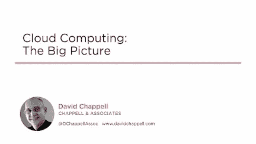
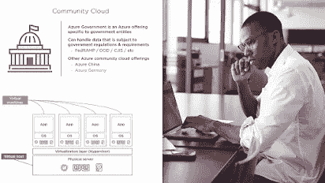
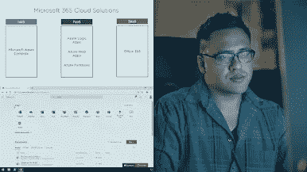
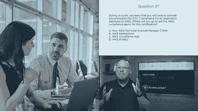
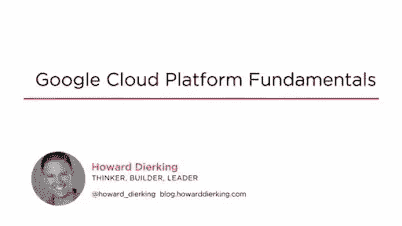
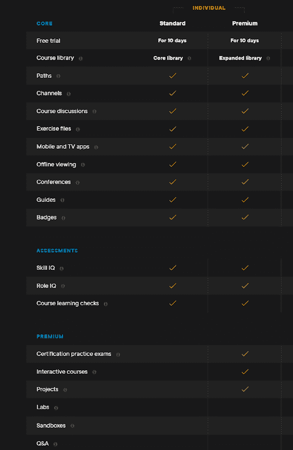

# 2022 年学习 AWS、Azure 和 GCP 云计算的 10 大 Pluralsight 课程

> 原文：<https://medium.com/javarevisited/top-10-pluralsight-courses-to-learn-cloud-computing-with-aws-azure-and-gcp-in-2022-6c7e030367ef?source=collection_archive---------0----------------------->

大家好，如果你正在寻找最好的 Pluralsight 课程来学习 2022 年的云计算，如 AWS、Azure 和谷歌云平台，那么你来对地方了。

过去，我曾分享过[面向 Java 开发人员的最佳 plur sight 课程](https://javarevisited.blogspot.com/2017/12/top-10-pluralsight-courses-java-and-web-developers.html#axzz7DP5DDtxT)，以及学习 [JavaScript](https://www.java67.com/2020/08/top-10-pluralsight-courses-to-learn-JavaScript.html) 、 [React.js](https://javarevisited.blogspot.com/2020/08/top-10-pluralsight-courses-to-learn-React.js.html) 和[网络安全](https://javarevisited.blogspot.com/2022/04/best-cyber-security-and-information-security-courses-pluralsight.html)的最佳 plur sight 课程，今天，我将与大家分享来自 plur sight 的最佳云计算课程。

如果你有 [Pluralsight 会员资格](https://pluralsight.pxf.io/c/1193463/424552/7490?u=https%3A%2F%2Fwww.pluralsight.com%2Fpricing%2Fskills) p，按月、按年或高级会员资格，或者来自你的公司，那么这些确实是 2022 年开始云计算的最佳资源。但是，在我们开始教授你关于云计算的 10 门最佳课程之前，让我告诉你云计算这个术语的真正含义。

[云计算](https://javarevisited.blogspot.com/2019/07/top-5-online-courses-to-learn-cloud-computing-aws.html)是通过云交付计算服务的过程，如存储和处理能力，按使用量付费。云计算对公司特别有用，因为他们不需要拥有自己的计算基础设施或数据中心，可以从云服务提供商那里租用任何东西，如应用程序和存储。

公司通常使用云计算，这样他们可以避免拥有和维护自己的 IT 基础架构的前期成本和复杂性。这些云服务的提供商也获得了很好的交易，因为他们可以通过向不同的客户提供相同的服务集而受益匪浅。

如今，云计算平台，如 AWS、T2、微软 Azure、T4、谷歌云平台为他们的客户提供了广泛的选择。这些从存储、网络和处理能力的基础开始，以及像自然语言处理和人工智能这样的功能。这意味着任何不需要你在物理上靠近计算机的服务都可以通过云交付。

# 2022 年 Pluralsight 的 10 个最佳云计算课程

在这里，我们从 Pluralsight 收集了 10 个最好的云计算课程。继续阅读，了解更多适合自己的课程。我已经确保课程不仅包括学习云计算基础知识，还包括流行的公共云平台，如 AWS、Azure 和 Google 云平台。

## 1.[云计算:大图](https://pluralsight.pxf.io/c/1193463/424552/7490?u=https%3A%2F%2Fwww.pluralsight.com%2Fcourses%2Fcloud-computing-big-picture) [Pluralsight]

如果您不熟悉云计算，并且刚刚开始接触云计算，那么这是您应该参加的第一个在线课程之一。这个奇妙的 Pluralsight 课程将为您提供云计算所有方面的广泛介绍。

不管你在公司的角色是什么，如果你从事技术工作，你就会明白云计算正在影响着你。

以下是加入本课程的链接— [云计算:大图](https://pluralsight.pxf.io/c/1193463/424552/7490?u=https%3A%2F%2Fwww.pluralsight.com%2Fcourses%2Fcloud-computing-big-picture)

## 2.[微软 Azure 云概念](https://pluralsight.pxf.io/c/1193463/424552/7490?u=https%3A%2F%2Fwww.pluralsight.com%2Fcourses%2Fmicrosoft-azure-cloud-concepts)【plural sight】

你可能知道云计算是每个公司 IT 战略的核心，微软是顶尖的云服务提供商之一。这个精彩的课程将教你云计算的所有基础知识和好处。

以下是加入本课程的链接— [微软 Azure 云概念](https://pluralsight.pxf.io/c/1193463/424552/7490?u=https%3A%2F%2Fwww.pluralsight.com%2Fcourses%2Fmicrosoft-azure-cloud-concepts)

## 3.[微软云服务简介](https://pluralsight.pxf.io/c/1193463/424552/7490?u=https%3A%2F%2Fwww.pluralsight.com%2Fcourses%2Fintroduction-microsoft-cloud-services)【plural sight】

本课程开始时，您将学习什么是云以及它为什么重要。然后你会发现不同类型的云计算。你也将了解微软 365 是什么，以及它所提供的不同服务。

本课程结束时，您将了解什么是云，以及云对当今企业的重要性。

**这里是加入本课程的链接**——[微软云服务介绍](https://pluralsight.pxf.io/c/1193463/424552/7490?u=https%3A%2F%2Fwww.pluralsight.com%2Fcourses%2Fintroduction-microsoft-cloud-services)

## 4.[计算机基础:虚拟化和云计算](https://pluralsight.pxf.io/c/1193463/424552/7490?u=https%3A%2F%2Fwww.pluralsight.com%2Fcourses%2Fcomputer-fundamentals-virtualization-cloud-computing)

本课程开始时，您将学习什么是虚拟化以及虚拟化能够带来哪些好处。然后你会探索什么是云计算，为什么越来越多的公司在使用它。

您还将了解不同类型的可用云部署模型，并了解哪种模型最适合每个场景。

**这是参加本课程** — [计算机基础:虚拟化和云计算](https://pluralsight.pxf.io/c/1193463/424552/7490?u=https%3A%2F%2Fwww.pluralsight.com%2Fcourses%2Fcomputer-fundamentals-virtualization-cloud-computing)的链接

## 5. [AWS 基础:AWS 云基础入门](https://pluralsight.pxf.io/c/1193463/424552/7490?u=https%3A%2F%2Fwww.pluralsight.com%2Fcourses%2Faws-foundations-getting-started-aws-cloud-essentials)

本课程将向您介绍 AWS 云架构以及计算、存储、数据库、网络和安全类别中的服务。您还将学习如何建立和验证对 AWS 云以及关键术语的整体理解。

**以下是参加本课程的链接** — [AWS 基础:AWS 云基础入门](https://pluralsight.pxf.io/c/1193463/424552/7490?u=https%3A%2F%2Fwww.pluralsight.com%2Fcourses%2Faws-foundations-getting-started-aws-cloud-essentials)

## 6.[谷歌云平台基础:核心基础设施](https://pluralsight.pxf.io/c/1193463/424552/7490?u=https%3A%2F%2Fwww.pluralsight.com%2Fcourses%2Fgoogle-cloud-platform-fundamentals-core-infrastructure)

这门精彩的课程将让你对谷歌云平台的产品和服务有一个大致的了解。该课程由许多演示、演示和动手实验组成，因此您将了解 Google 云平台的价值以及如何将基于云的解决方案集成到业务战略中。

**课程时长:4 小时**

**球场评分:4.7 星(满分 5 分)**

**课程讲师:谷歌云**

**课程价格:每月 20 美元**

**这里是加入本课程的链接**——[谷歌云平台基础](https://pluralsight.pxf.io/c/1193463/424552/7490?u=https%3A%2F%2Fwww.pluralsight.com%2Fcourses%2Fgoogle-cloud-platform-fundamentals-core-infrastructure)

## 7.[云计算基础:云概念](https://pluralsight.pxf.io/c/1193463/424552/7490?u=https%3A%2F%2Fwww.pluralsight.com%2Fcourses%2Fcloud-computing-fundamentals-cloud-concepts)【plural sight】

在这个伟大的课程中，您将学习云计算的基础知识，重点关注云技术的核心功能，包括云部署模型、网络概念、存储类型和云设计。

**课程时长:2 小时**

**课程评分:4.6 星(满分 5 分)**

课程导师:爱德华多·弗雷塔斯

**课程价格:每月 20 美元**

**以下是加入本课程的链接—** [云计算基础知识:云概念](https://pluralsight.pxf.io/c/1193463/424552/7490?u=https%3A%2F%2Fwww.pluralsight.com%2Fcourses%2Fcloud-computing-fundamentals-cloud-concepts)

## 8.[在谷歌云中管理安全](https://pluralsight.pxf.io/c/1193463/424552/7490?u=https%3A%2F%2Fwww.pluralsight.com%2Fcourses%2Fmanaging-security-google-cloud-3)【plural sight】

本课程是谷歌云安全系列的第一部分。完成本课程后，您可以报名参加 Google Cloud 安全最佳实践课程。

**课程时长:3 小时**

**课程评分:4.5 星(满分 5 分)**

**课程讲师:谷歌云**

课程价格:每月 20 美元

**以下是参加本课程的链接—** [在谷歌云中管理安全性](https://pluralsight.pxf.io/c/1193463/424552/7490?u=https%3A%2F%2Fwww.pluralsight.com%2Fcourses%2Fmanaging-security-google-cloud-3)

## 9.[AWS 的基础云概念](https://pluralsight.pxf.io/c/1193463/424552/7490?u=https%3A%2F%2Fwww.pluralsight.com%2Fcourses%2Ffundamental-cloud-concepts-aws)【plural sight】

这门出色的课程将介绍 AWS 上的云计算，并涵盖云基础知识，这是获得 AWS 认证云从业者考试所需知识的第一步。

**课程时长:2 小时**

**课程评分:4.9 星(满分 5 分)**

**课程讲师:大卫·塔克**

**课程价格:每月 20 美元**

**这是加入本课程的链接—**[AWS 的基础云概念](https://pluralsight.pxf.io/c/1193463/424552/7490?u=https%3A%2F%2Fwww.pluralsight.com%2Fcourses%2Ffundamental-cloud-concepts-aws)

## 10.[云计算基础](https://pluralsight.pxf.io/c/1193463/424552/7490?u=https%3A%2F%2Fwww.pluralsight.com%2Fcourses%2Fcloud-computing-fundamentals)【plural sight】

您可以通过本课程了解什么是云计算、云计算的多种形式以及云计算是如何工作的。

**课程时长:3 小时**

**课程评分:4.6 星(满分 5 分)**

课程讲师:大卫·戴维斯

课程价格:每月 20 美元

**这里是加入本课程的链接——**[云计算基础](https://pluralsight.pxf.io/c/1193463/424552/7490?u=https%3A%2F%2Fwww.pluralsight.com%2Fcourses%2Fcloud-computing-fundamentals)

# 关于学习复数视觉的常见问题

现在，我们已经看到了 2022 年学习云计算的最佳 Pluralsight 课程，您可能对 Pluralsight 平台以及如何加入 Pluralsight 并访问这些在线云计算课程有疑问。

我整理了一份关于 Pluralsight 平台、不同的 Pluralsight 计划和在 Pluralsight 学习的常见问题列表。如果你的问题不在这里，你可以在评论区提问。

**1。Pluralsight 值得吗？**

Pluralsight 是一个在线学习和劳动力发展平台，帮助企业和个人适应不断变化的技术。如果你想学习热门的技术技能，Pluralsight 是最好的平台之一。它提供了 7000 多门课程、项目和测验，每年只需 499 美元，非常值得。我已经分享了我加入 plur sight 的理由，并详细回顾了我之前关于[加入 plur sight](https://javarevisited.blogspot.com/2021/12/10-reasons-to-join-pluralsight-in-2022.html)的 10 个理由的文章，如果你还不相信，那么你可以查看那篇文章。

**2。复视课程是免费的吗？**

不，Pluralsight 课程不是免费的，但他们经常运行像 Pluralsight 免费周末这样的程序，他们为每个人开放 Pluralsight 平台，你可以免费使用他们的所有课程，只有 3 天。这是一个检查 Pluralsight 课程是否适合你的好机会。事实上，我已经多次使用这个窗口在一个周末学习关键技能，比如 React、Spring Boot 或 Python 的 Web Scrapping。

**3。Pluralsight 提供免费试用吗？**

是的，Pluralsight 提供了一个 [10 天的免费试用期](https://pluralsight.pxf.io/c/1193463/424552/7490?u=https%3A%2F%2Fwww.pluralsight.com%2Fpricing%2Ffree-trial)，你可以免费查看各种 Pluralsight 课程，但你需要记住，你只能观看 200 分钟的课程。免费试用有助于在购买 Pluralsight 年度或高级计划之前检查 Pluralsight 课程及其课程库的质量。

**4。Pluralsight 年度计划和高级计划有什么区别？**

Pluralsight 高级计划实际上是 Pluralsight 上最高级或最昂贵的计划，因为它提供了 Pluralsight 提供的所有内容，如在线课程、项目、职业道路、练习测试、互动课程等。它每年的费用约为 499 美元，而 Pluralsight 年度计划的费用为 299 美元。

以下是对 [Pluralsight standard 和 premium plan](https://pluralsight.pxf.io/c/1193463/424552/7490?u=https%3A%2F%2Fwww.pluralsight.com%2Fpricing%2Fskills) s 的详细比较，它们在 20 多个参数上进行了比较

以上就是 2022 年**学习云计算的最佳 Pluralsight 课程**。毫无疑问，这些是最好的课程，可以教会你关于云计算的所有知识。我精心选择了不同的课程来学习 AWS、Azure、Google 云平台。所以不管你想学哪个云平台，Pluralsight 都有适合你的课程。

不过，你需要一个 [**Pluralsight 会员**](https://pluralsight.pxf.io/c/1193463/424552/7490?u=https%3A%2F%2Fwww.pluralsight.com%2Fpricing%2Fskills) 才能加入这个课程，费用约为每月 29 美元或每年 299 美元(14%的折扣)。我向所有程序员强烈推荐这个订阅，因为它提供了超过 7000 个在线课程的即时访问，以学习任何技术技能。或者，你也可以使用他们的 [**10 天免费通行证**](https://pluralsight.pxf.io/c/1193463/424552/7490?u=https%3A%2F%2Fwww.pluralsight.com%2Fpricing%2Ffree-trial) 免费观看这个课程。

 [## Pluralsight |个人免费试用

### 立即开始免费试用 Pluralsight！查看我们为个人和团队提供的服务，如果您不确定…

pluralsight.pxf.io](https://pluralsight.pxf.io/c/1193463/424552/7490?u=https%3A%2F%2Fwww.pluralsight.com%2Fpricing%2Ffree-trial) 

如果你喜欢 Pluralsight 的 10 个最佳云计算课程列表，请随意与你的朋友和家人分享。如果您对云计算有任何疑问，您也可以发表评论，我们会立即回复您。

您可能喜欢的 Pluralsight 和 Udemy 的其他**在线课程**

*   [面向 Java 开发者的 5 门免费 Spring 框架课程](http://www.java67.com/2017/11/top-5-free-core-spring-mvc-courses-learn-online.html)
*   [2022 年学习 Web 开发的五大课程](https://javarevisited.blogspot.com/2018/02/top-5-online-courses-to-learn-web-development.html)
*   [学习 Angular 和 React.js 的 10 门免费课程](https://javarevisited.blogspot.com/2019/04/10-free-angular-and-react-courses-for.html)
*   [2022 年最值得学习的 5 本书 react . js](https://www.java67.com/2020/03/top-5-books-to-learn-reactjs-for-beginners.html)
*   [学习大数据和 Apache Spark 的 5 门课程](http://javarevisited.blogspot.com/2017/12/top-5-courses-to-learn-big-data-and.html)
*   [面向 Web 开发人员的十大 JavaScript 教程和课程](https://javarevisited.blogspot.com/2018/06/top-10-courses-to-learn-javascript-in.html)
*   [2022 年学习 Spring Boot 的 5 大课程](https://javarevisited.blogspot.com/2018/05/top-5-courses-to-learn-spring-boot-in.html)
*   [2022 年学习 React Native 的 5 门课程](http://javarevisited.blogspot.sg/2018/02/5-react-native-courses-to-learn-mobile-development-using-JavaScript.html)
*   [Web 开发人员学习 TypeScript 的五大课程](https://javarevisited.blogspot.com/2018/07/top-5-courses-to-learn-typescript.html)
*   [学习 React.js 和 Redux 的 5 大课程](https://javarevisited.blogspot.com/2018/08/top-5-react-js-and-redux-courses-to-learn-online.html#axzz5r06B3egD)
*   [最佳阿帕奇卡夫卡课程— 2022 年](https://javarevisited.blogspot.com/2018/04/top-5-apache-kafka-course-to-learn.html)
*   [2022 年 React JS 开发者路线图](https://hackernoon.com/the-2018-react-js-roadmap-4d0a43814c02)
*   [程序员和开发人员的 10 个最佳 edX 课程](https://javarevisited.blogspot.com/2021/05/top-10-edx-courses-and-certificates-for.html)
*   [面向 Java 开发人员的 10 门最佳 LinkedIn 学习课程](https://javarevisited.blogspot.com/2021/01/top-10-linkedin-learning-courses-for-java-spring-developers.html)
*   [Python 开发者的 10 门最佳 Udemy 课程](https://javarevisited.blogspot.com/2020/05/top-10-udemy-courses-to-learn-python-programming.html)

**附言**——如果你错过了免费周末观光，你也可以试试这些课程中的几门，使用他们一直开着的****10 天免费通行证。学习这个列表中的第一门课程有助于快速入门 React.js。****

**** [## Pluralsight |个人免费试用

### 立即开始免费试用 Pluralsight！查看我们为个人和团队提供的服务，如果您不确定…

pluralsight.pxf.io](https://pluralsight.pxf.io/c/1193463/424552/7490?u=https%3A%2F%2Fwww.pluralsight.com%2Fpricing%2Ffree-trial)****