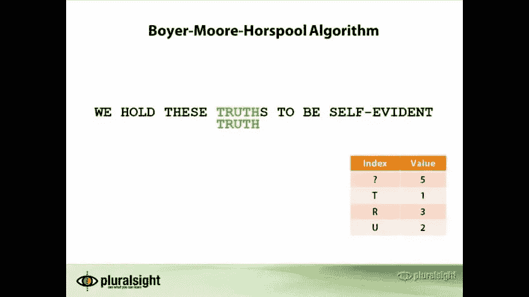
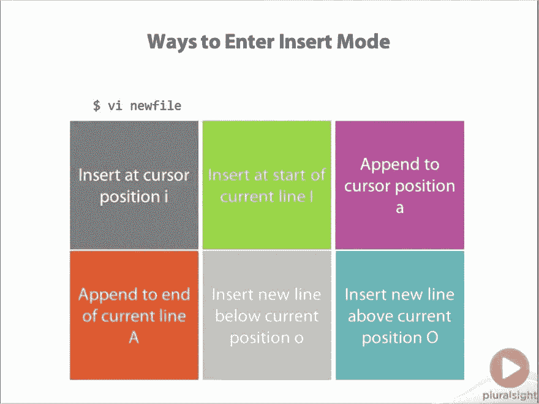
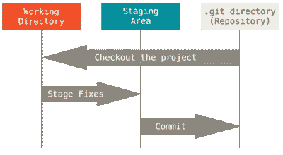
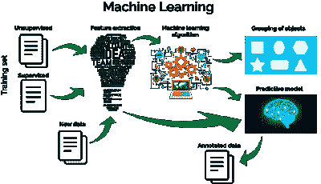
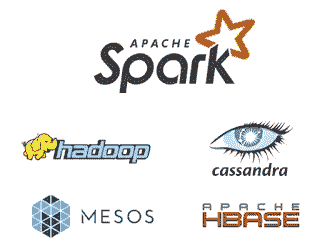
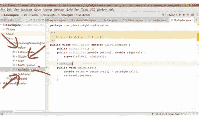

# 2023 年学习程序员和开发人员基本技能的 10 大 Pluralsight 课程——最好的

> 原文：<https://medium.com/javarevisited/top-10-pluralsight-courses-to-learn-programming-and-software-development-during-covid-19-stay-at-30b7d8a4f88f?source=collection_archive---------0----------------------->

## 10+最佳 Pluralsight 课程，帮助程序员学习 Python、React.js、算法、Linux、Git 和其他技术技能

你好，伙计们，如果你想学习技术技能成为一名开发人员，或者想通过学习新技术和寻找最好的 Pluralsight 课程来提升自己，因为你有 Pluralsight 会员资格或想加入 Pluralsight，那么你来对地方了。

早些时候，我已经分享了 [**面向开发人员的最佳 Udemy 课程**](/javarevisited/top-10-best-udemy-courses-for-web-development-in-2020-9263f13ee4be)[面向开发人员的最佳 Coursera 课程](/javarevisited/10-best-coursera-courses-for-web-development-and-web-design-9ec54ed92dd9)[面向 Java 开发人员的最佳 LinkedIn 学习课程](/javarevisited/10-best-linkedin-learning-courses-for-java-programmers-fd5ae9ff1358)和[面向开发人员的最佳教育课程](https://javinpaul.medium.com/10-best-educative-courses-for-system-design-and-oop-design-interviews-b9e5b3216c4b)，在这篇文章中，我将分享面向程序员和开发人员的最佳 Pluralsight 在线学习课程。

但是，说实话，在线学习并不容易，你很容易被这么多的资源和这么多的东西淹没。你需要变得聪明，只从最好的资源中学习，并建立有助于你找到工作或为工作做好准备的技能。

2023 年每个人都应该学习的一些基本技能是:

*   Java、Python 和数据科学
*   计算机科学概念、算法、数据结构和数据库
*   像 React 和 Angular 这样的前端框架
*   还有命令行工具，比如 Linux、Git 和 Bash

所以，你需要挑选一些你一直想检查的最好的课程，并坚持下去，即使你完成了一两门，这也是一个完美利用的周末。

# 10+为程序员学习技术技能的最佳 Pluralsight 课程

所以，这里有一些 [Pluralsight](http://pluralsight.pxf.io/c/1193463/424552/7490?u=https%3A%2F%2Fwww.pluralsight.com%2Flearn) 课程，你可以在家参加或观看。我尝试过包括来自不同垂直领域的课程，这些课程涵盖了上述技能，如 [Java](/javarevisited/10-free-courses-to-learn-java-in-2019-22d1f33a3915) 、 [Web 开发](https://dev.to/javinpaul/top-6-courses-to-learn-web-development-best-of-lot-2fae)、[数据结构、算法](https://javarevisited.blogspot.com/2018/11/top-5-data-structures-and-algorithm-online-courses.html)、 [Python](/swlh/5-free-python-courses-for-beginners-to-learn-online-e1ca90687caf) 、[数据科学、机器学习](https://becominghuman.ai/9-data-science-and-machine-learning-courses-by-harvard-ibm-udemy-and-others-12a0c7c23ec1)、[大数据](https://dev.to/javinpaul/top-5-courses-to-learn-big-data-and-hadoop-for-beginners-6g8)、[云计算](/javarevisited/top-10-courses-to-learn-amazon-web-services-aws-cloud-in-2020-best-and-free-317f10d7c21d)、 [SQL](https://javarevisited.blogspot.com/2020/02/top-5-courses-to-learn-microsoft-sql-server-mssql.html) 、 [Linux](/javarevisited/top-10-courses-to-learn-linux-command-line-in-2020-best-and-free-f3ee4a78d0c0?source=collection_home---4------0-----------------------) 等，但并不全面。

面向程序员的最佳多视角课程

您还可以在评论中分享您最喜欢的课程，来这里寻求建议的程序员可以从中受益。所以，不要再浪费你的时间了，这里有一些[最好的多视球场](https://javarevisited.blogspot.com/2017/12/top-10-pluralsight-courses-java-and-web-developers.html)，这个周末你可以去看看:

## 1.Python 基础

Python 基础让你从 Python 开始，Python 是一种流行于 web 开发、大数据、科学和脚本的动态语言。导师是[奥斯汀·宾汉姆](/@austin.bingham)和@罗伯特·斯莫尔郡

**下面是加入本课程的链接:** [**Python 基础**](https://pluralsight.pxf.io/c/1193463/424552/7490?u=https%3A%2F%2Fwww.pluralsight.com%2Fcourses%2Fpython-fundamentals)

## 2.React.js:入门

我最近开始做一个使用 React.js 创建视图的项目，现在我必须学习 React.js。

我对它有一些想法，就像它的类似框架，像[角框架](https://javarevisited.blogspot.com/2018/06/5-best-courses-to-learn-angular.html)，但由脸书支持，但还没有深入研究，这就是为什么我选择在 2023 年参加这个多视野课程。

链接加入— [**React.js:入门**](https://pluralsight.pxf.io/c/1193463/424552/7490?u=https%3A%2F%2Fwww.pluralsight.com%2Fcourses%2Freact-js-getting-started) **by** [**萨梅尔布纳**](https://medium.com/u/c64c4b529a5d?source=post_page-----30b7d8a4f88f--------------------------------)

本课程涵盖了 [React.js](https://javarevisited.blogspot.com/2018/08/top-5-react-js-and-redux-courses-to-learn-online.html) 的基础知识，为学生开始使用该库开发 web 应用程序做准备。

它还解释了 React.js 的基本概念，使用一个示例 web 应用程序来演示数学技能儿童游戏。

## 3.算法和数据结构— —罗伯特·霍维克的第一和第二部分

在[这门课](https://pluralsight.pxf.io/c/1193463/424552/7490?u=https%3A%2F%2Fwww.pluralsight.com%2Fcourses%2Fads-part1)中，你将学习日常应用中使用的核心数据结构和算法。您将了解选择每种数据结构所涉及的权衡，以及遍历、检索和更新算法。

这是包含算法和数据结构的两部分系列课程的第 1 部分。第一部分介绍了链表、栈、队列、二叉树和哈希表，第二部分介绍了图形和字符串算法。

**链接加入:** [**算法与数据结构— —第一部分**](https://pluralsight.pxf.io/c/1193463/424552/7490?u=https%3A%2F%2Fwww.pluralsight.com%2Fcourses%2Fads-part1)

## 4.Linux 命令行界面(CLI)基础知识

在 AndrewMallette 的这门课程中，你将学会掌握 Linux 和 Unix 中的命令行 shell。这是为 LPIC-1 和 CompTIA Linux+认证做准备的 4 门课程中的第 2 门。

链接加入: [**Linux 命令行界面(CLI)基础**](https://pluralsight.pxf.io/c/1193463/424552/7490?u=https%3A%2F%2Fwww.pluralsight.com%2Fcourses%2Flinux-cli-fundamentals)

## 5.Git 基础

Git 是一个流行的分布式版本控制系统(DVCS)。这是 Pluralsight 的顶级课程之一，它教您如何创建本地存储库、提交文件、将更改推送到远程存储库、修复提交中的错误，以及 Git 的许多其他功能。

**链接加入:——**[**Git 基础**](https://pluralsight.pxf.io/c/1193463/424552/7490?u=https%3A%2F%2Fwww.pluralsight.com%2Fcourses%2Fgit-fundamentals)

它还将帮助您理解工作副本、暂存区域和存储库本身之间的区别。我的目标之一是 2023 年掌握 Git。

尽管我知道 Git 和我已经从 Github 下载了几个项目，但是通过在 Eclipse 中使用 Git 客户端。我还没有使用过 Git 命令行，这就是这个 Pluralsight 课程要帮助我的地方。来学习 Git 的力量吧。

## 6.大数据:大图景

这是我今年将要探索的新事物之一。Spark 和 Hadoop 等大数据技术是我的重点，但我会花一些时间了解更大的情况，这就是这个 Pluralsight 课程将帮助我的地方。

链接加入— [**大数据:大局**](https://pluralsight.pxf.io/c/1193463/424552/7490?u=https%3A%2F%2Fwww.pluralsight.com%2Fcourses%2Fbigdata-bigpicture)

在本课程中，ZDNet 的大数据记者 Andrew Brust 将向您介绍构成大数据世界的概念、公司和技术，并为在您的组织中采用大数据制定战略。

## 7.理解机器学习

除了大数据技术，2023 年我还想探索的一件事就是机器学习。它越来越受欢迎，2023 年似乎是学习机器学习算法的正确时间。

链接加入— [**了解机器学习**](https://pluralsight.pxf.io/c/1193463/424552/7490?u=https%3A%2F%2Fwww.pluralsight.com%2Fcourses%2Funderstanding-machine-learning)

如果你现在从事技术工作，你至少需要了解[机器学习](https://javarevisited.blogspot.com/2018/10/data-science-and-machine-learning-courses-using-python-and-R-programming.html)的基础知识，这是最好的 Pluralsight 课程之一，它提供了对这个主题的简短介绍，假设只有基本的 IT 背景。

如果你一直在寻找机器学习的简单概述，这是你应该参加的课程。

## 8.[火花基础](https://pluralsight.pxf.io/c/1193463/424552/7490?u=https%3A%2F%2Fwww.pluralsight.com%2Fcourses%2Fapache-spark-fundamentals)

Apache Spark 是流行的大数据框架之一，也是我打算在 2023 年探索的新框架之一。

我已经在我之前的文章中列出了一些 [*最佳 Apache Spark 在线课程*](/javarevisited/5-best-apache-spark-courses-for-java-and-python-developers-bbd9d63eb76c) 表单 plur sight，其中之一是来自 plur sight 的 Apache Spark 基础课程。

链接加入— [*火花基础*](https://pluralsight.pxf.io/c/1193463/424552/7490?u=https%3A%2F%2Fwww.pluralsight.com%2Fcourses%2Fapache-spark-fundamentals)

本课程将教你如何使用 Apache Spark 以闪电般的速度分析你的大数据；将 Hadoop 远远甩在身后！。如果你需要更多的课程，那么在这里查看我的完整的 Apache spark 课程列表。

## 9.[Android 开发简介](https://pluralsight.pxf.io/c/1193463/424552/7490?u=https%3A%2F%2Fwww.pluralsight.com%2Fcourses%2Fandroid-intro)

这是一个从初学者的角度学习 Android 的很好的课程，由 John Sonmez 教授，他是 Pluralsight 上最好的讲师之一。我在上一篇文章中已经列出了 Pluarsight 的一些最佳 Android 课程。

链接加入— [***安卓开发入门***](https://pluralsight.pxf.io/c/1193463/424552/7490?u=https%3A%2F%2Fwww.pluralsight.com%2Fcourses%2Fandroid-intro)

这包括 Android 的初级和中级课程。如果你也在学习 Android 或者在 2023 年提高你的 Android 技能，你可以在这里看看我的 Java 程序员 Android 课程的完整名单[。](http://javarevisited.blogspot.com/2017/12/top-5-android-online-training-courses-for-Java-developers.html)

## 10.[角度:入门](https://pluralsight.pxf.io/c/1193463/424552/7490?u=https%3A%2F%2Fwww.pluralsight.com%2Fcourses%2Fangular-2-getting-started-update)

这是 Pluralsight 的另一个顶级 Angular 2 球场。本课程将教你使用 Angular 框架创建可测试的、MVC 风格的单页应用程序所需的 Angular 基础知识。

特别是，你将学习如何引导你的角度应用；使用角度标记和表达式；创建和使用控制器；使用内置服务并创建自定义服务。

链接加入— [*棱角分明:入门*](https://pluralsight.pxf.io/c/1193463/424552/7490?u=https%3A%2F%2Fwww.pluralsight.com%2Fcourses%2Fangular-2-getting-started-update)

您还将学习使用 [Angular](http://www.java67.com/2018/01/top-5-free-angular-js-online-courses-for-web-developers.html) 和 MVC 模式的测试驱动开发，并学习使用路由将您的应用程序变成 SPA，创建您自己的定制元素并使用指令处理事件。

你可以在 2023 年参加《Angular 入门》之后参加这个课程，以便更好地学习 Angular。

## 11。Java 基础:Java 语言

这是一个很棒的 Java 课程，适合 Pluralsight 的初学者。它不是最新的，最后一次更新是在 2015 年 12 月，但它教授的所有内容仍然相关。

您将学习 Java 的基础知识，类、对象、数据类型、[线程](https://javarevisited.blogspot.com/2016/06/5-books-to-learn-concurrent-programming-multithreading-java.html)、文件、错误处理以及其他核心 Java 概念。讲师 Jim Wilson 是一名经验丰富的软件工程师，拥有 30 多年的丰富经验。

链接加入— [***Java 基础:Java 语言***](https://pluralsight.pxf.io/c/1193463/424552/7490?u=https%3A%2F%2Fwww.pluralsight.com%2Fcourses%2Fjava-fundamentals-language)

总之是一门以初学者的角度学习 Java 的好课程。它提供了 Java 编程语言和服务器的完整覆盖，适用于所有基于 Java 的开发工作，如服务器端开发和客户端开发，包括 Android 应用程序。

顺便说一句，你需要一个 [**多重视野会员**](http://pluralsight.pxf.io/c/1193463/424552/7490?u=https%3A%2F%2Fwww.pluralsight.com%2Flearn) 才能进入这个课程。每月订阅费用约为 29 美元，但也可以访问 500 多个课程，这是值得的。

<http://pluralsight.pxf.io/c/1193463/424552/7490?u=https%3A%2F%2Fwww.pluralsight.com%2Flearn>  

但是，如果您没有会员资格，您仍然可以通过注册 [**10 天免费试用**](http://pluralsight.pxf.io/c/1193463/424552/7490?u=https%3A%2F%2Fwww.pluralsight.com%2Flearn) 来访问该课程，该课程免费提供 200 分钟的观看时间，没有任何承诺。

<http://pluralsight.pxf.io/c/1193463/424552/7490?u=https%3A%2F%2Fwww.pluralsight.com%2Flearn>  

如果你需要一些免费资源来补充你的学习， 这里有更多的**免费在线课程**您可能想探索一下
[5 门免费课程学习 Git 和 Github](http://javarevisited.blogspot.sg/2018/01/5-free-git-courses-for-programmers-to-learn-online.html#axzz568Oo1Jao)
[完整的 DevOps 开发人员路线图](https://hackernoon.com/the-2018-devops-roadmap-31588d8670cb?gi=1490c6cb9f25)
[前 5 门课程学习 Jenkins](https://javarevisited.blogspot.com/2018/09/top-5-jenkins-courses-for-java-and-DevOps-Programmers.html)
[5 门免费 Eclipse 和 JUnit 课程面向 Java 开发人员](http://www.java67.com/2018/02/5-free-eclipse-and-junit-online-courses-java-developers.html)
[10 门 DevOps 课程面向有经验的开发人员](https://javarevisited.blogspot.com/2018/09/10-devops-courses-for-experienced-java-developers.html)
[5 门在线培训课程免费学习 Angular](http://www.java67.com/2018/01/top-5-free-angular-js-online-courses-for-web-developers.html)

这就是所有的家伙，享受这些课程在 Pluralsight。祝你的学习黑客马拉松一切顺利，保持安全、积极和健康。

> **更新:大家好，**[**plural sight**](https://pluralsight.pxf.io/c/1193463/424552/7490?u=https%3A%2F%2Fwww.pluralsight.com%2Flearn)**刚刚宣布，他们图书馆上的所有课程(7000+)都是免费的——4 月份不需要信用卡。这是学习编程技巧的绝好机会，大大感谢**[**plural sight**](https://pluralsight.pxf.io/c/1193463/424552/7490?u=https%3A%2F%2Fwww.pluralsight.com%2Flearn)

