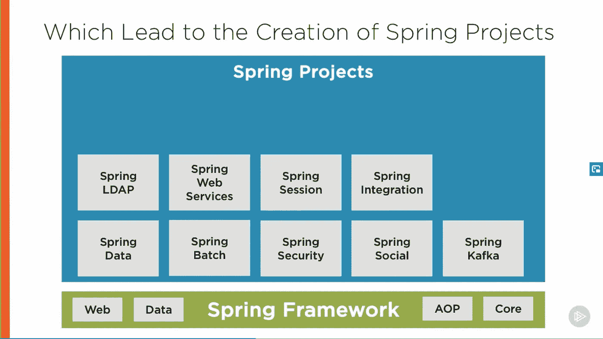
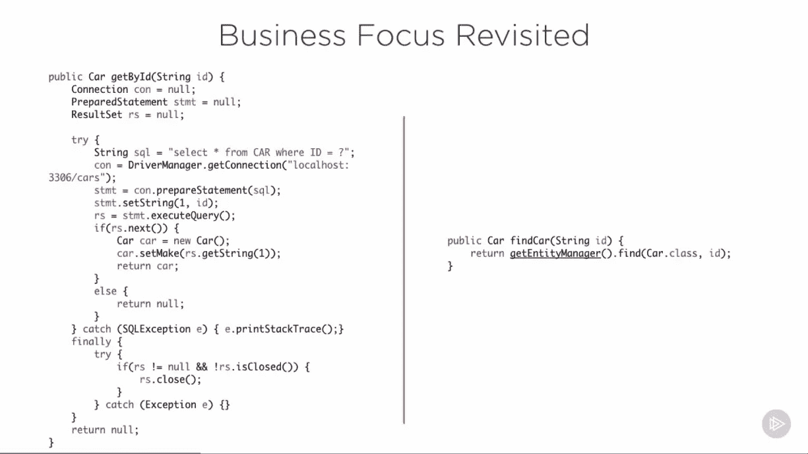
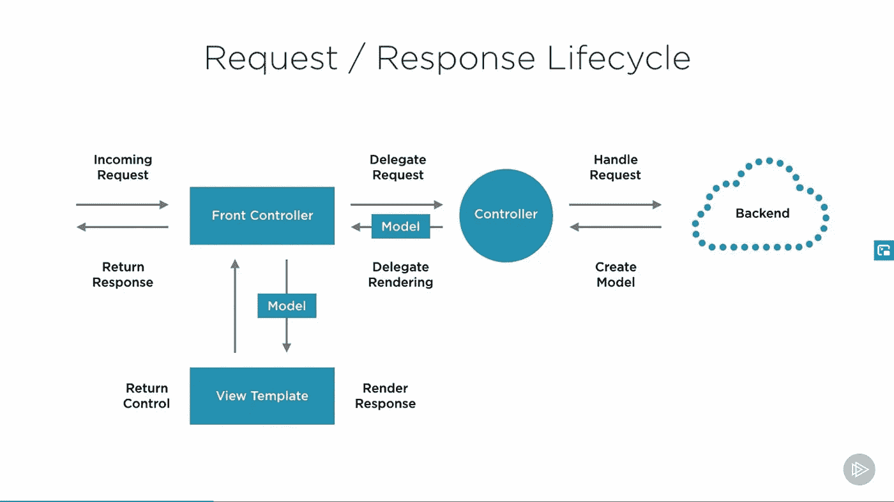
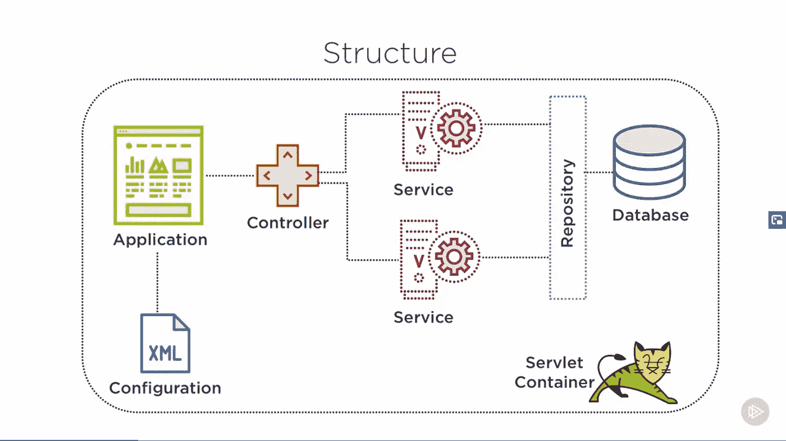

# 2023 年 Java 开发人员的 10 门最佳 Pluralsight 课程

> 原文：<https://medium.com/javarevisited/top-10-pluralsight-courses-to-learn-spring-framework-for-java-developers-3d35c4a1dc2?source=collection_archive---------0----------------------->

## 这些是 Java 开发人员学习 Spring 框架、Spring Boot、Spring MVC、Spring Security 和 Spring Cloud 的最佳 Pluralsight 课程。

大家好，如果你正在 Pluralsight 上寻找最好的 Java 课程，那么你来对地方了。此前，我已经分享了[面向 Java 开发者的最佳 Udemy 课程](/javarevisited/15-best-udemy-courses-programmers-can-buy-on-black-friday-and-cyber-monday-2020-a803874f41d9)、[最佳 edX 课程](/javarevisited/10-free-best-edx-certifications-and-courses-to-learn-online-3473d466f968)和[面向 Java 开发者的最佳 LinkedIn 学习课程](/javarevisited/10-best-linkedin-learning-courses-for-java-programmers-fd5ae9ff1358)，今天，我将分享 2023 年面向 Java 开发者的最佳 Pluralsight 课程。

我喜欢 Pluralsight 在线学习平台的高质量 Java 课程，这些课程是由 Java 冠军和专家 Jose Paumard 和 Bryan Hansen 创建的。

它们也是最新的，既不短也不长，这使得学习变得容易和有趣，但同时它们也有相当旧的课程，如果你不小心，你可能会迷失在多视课程的海洋中。

这就是为什么我为 Java 开发人员分享了*最佳 Pluralsight 课程*，在这一部分，我将重点放在了 [Spring 框架](/javarevisited/10-best-online-courses-to-learn-spring-framework-in-2020-f7f73599c2fd)上。该列表包含学习 Spring 框架的最佳 Pluralsight 课程，包括 Spring MVC、Spring Boot、Spring Security、Spring Cloud 和高级 Spring boot 概念，如 actuator、deployment 等。

您可以使用单个 [*Pluralsight 会员*](https://pluralsight.pxf.io/c/1193463/424552/7490?u=https%3A%2F%2Fwww.pluralsight.com%2Fpricing) 访问所有这些课程，每年仅需 299 美元即可访问 7000 多门课程，这是您在学习上所能做的最佳投资。

您可能还知道，这个周末是 [**Pluralsight 免费周末**](https://pluralsight.pxf.io/c/1193463/871467/7490) ，Pluralsight 免费提供他们所有的 7000 多门在线课程、40 多门互动课程和 20 多个指导项目。这是一个免费学习像 Spring Framework 这样的热门技能的好机会。

如果你好奇加入她的是链接— [**Pluralsight 免费周末**](https://pluralsight.pxf.io/c/1193463/871467/7490)

<https://pluralsight.pxf.io/c/1193463/871467/7490>  

如果你正在寻找学习 Spring 框架的最佳课程，那么你来对地方了。在本文中，我将为 Java 开发人员分享来自 Pluralsight 的最佳 Spring 框架课程。

该列表包括学习 Spring 框架核心、Spring MVC、Spring 安全、Spring Boot 和其他 Spring 相关技术的 Pluralsight 课程。虽然你可以在这个周末免费查看这些课程，但你也可以在之后使用它们，特别是如果你想深入学习 Spring framework 的话。

顺便说一句，你需要一个 [Pluralsight 会员](https://pluralsight.pxf.io/c/1193463/424552/7490?u=https%3A%2F%2Fwww.pluralsight.com%2Fpricing)才能加入这个课程，费用大约是每月 29 美元或每年 299 美元(14%的折扣)。我向所有程序员强烈推荐这个订阅，因为它提供了超过 7000 个在线课程的即时访问，以学习任何技术技能。

> 或者，你也可以使用他们的 [**10 天免费通行证**](https://pluralsight.pxf.io/c/1193463/424552/7490?u=https%3A%2F%2Fwww.pluralsight.com%2Flearn) 免费观看任何课程。

<https://pluralsight.pxf.io/c/1193463/424552/7490?u=https%3A%2F%2Fwww.pluralsight.com%2Fpricing>  

# 2023 年 Java 开发者学习 Spring 和 Spring Boot 的 10 个最佳 Pluralsight 课程

这里是学习 Spring Framework、Spring Security 和 plural sight Spring Boot 的最佳在线课程，不要再浪费你的时间了。您可以在本周末使用 [**Pluralsight 免费周末**](/javarevisited/pluralsight-free-weekend-2020-3e0ff26e7a31) 免费查看这些课程。

无论如何，让我们深入了解 Pluralsight 为 Java 开发人员提供的最佳 Spring 框架课程。

## 1.[春天:大局](https://pluralsight.pxf.io/c/1193463/424552/7490?u=https%3A%2F%2Fwww.pluralsight.com%2Fcourses%2Fspring-big-picture)

这是从零开始学习 Spring 框架的最佳 Pluralsight 课程之一。如果你完全不知道什么是 Spring 框架，为什么 Java 开发人员应该使用它，那么你可以加入这个课程。

本课程通过对 [Spring](/javarevisited/top-10-free-courses-to-learn-spring-framework-for-java-developers-639db9348d25) 的高层次概述，提供了 Spring 框架、Spring Boot 和其他 Spring 相关项目的良好概述。

完成本课程后，您将知道 Spring 是否适合您、您的组织或您的下一个项目。您还将获得 Spring 的基础知识，这将有助于您继续进行企业 Java 开发。

**这里是加入本课程的链接**——[春天:大图](https://pluralsight.pxf.io/c/1193463/424552/7490?u=https%3A%2F%2Fwww.pluralsight.com%2Fcourses%2Fspring-big-picture)

## 2. [**弹簧框架:弹簧基础**](https://pluralsight.pxf.io/c/1193463/424552/7490?u=https%3A%2F%2Fwww.pluralsight.com%2Fcourses%2Fspring-framework-spring-fundamentals)

这是从 Pluralsight 的 Spring 框架开始的最佳课程之一。作者 Bryan Hansen 是盐湖城一家咨询公司 Software Technology Group 的董事，他编写并教授了大量 Java 和 Spring 课程。

在本课程中，您将通过浏览 Spring-like 中可用的各种配置方法来学习 Spring 开发的基础知识:
1。XML 配置
2。使用注释的 XML 配置
3。Java 配置
4。以及如何读取属性文件。

学完本课程后，您就可以探索其他 Spring 项目了，比如 Spring MVC、Spring Boot 和 Spring 微服务。参加本课程不需要任何 Spring 经验，但是您应该熟悉 Java。

**这里是加入本课程** — [Spring 框架:Spring 基础](https://pluralsight.pxf.io/c/1193463/424552/7490?u=https%3A%2F%2Fwww.pluralsight.com%2Fcourses%2Fspring-framework-spring-fundamentals)的链接

## 3. [Spring 框架:Spring MVC 基础](https://pluralsight.pxf.io/c/1193463/424552/7490?u=https%3A%2F%2Fwww.pluralsight.com%2Fcourses%2Fspring-framework-spring-mvc-fundamentals)

Spring MVC 可能是 Java 程序员在过去十年开始学习和探索 Spring 框架的最重要原因。它仍然是使用 MVC 设计模式开发 Java web 应用程序的最流行的框架。

这门 Pluralsight spring MVC 课程旨在给你一个坚实的 [Spring MVC](/javarevisited/my-favorite-spring-mvc-courses-for-java-developers-5ede7f85dd88) 基础。本课程涵盖了使用包含和导出 WAR 部署的最新方法。所有的配置都是使用 Java 方法而不是 XML 来完成的。

**这里是加入本课程**——[Spring 框架:Spring MVC 基础](https://pluralsight.pxf.io/c/1193463/424552/7490?u=https%3A%2F%2Fwww.pluralsight.com%2Fcourses%2Fspring-framework-spring-mvc-fundamentals)的链接

## 4. [Spring Boot 基本面](https://pluralsight.pxf.io/c/1193463/424552/7490?u=https%3A%2F%2Fwww.pluralsight.com%2Fcourses%2Fspring-boot-fundamentals)

这是学习 Spring Boot 的最佳入门课程之一。本课程由凯莎·威廉姆斯创建，对 Spring boot 进行了很好的概述，并解释了它如何帮助创建基于 Spring 的 Java 应用程序。

[Spring Boot](/javarevisited/10-advanced-spring-boot-courses-for-experienced-java-developers-5e57606816bd) ，Spring 框架的扩展，通过移除 Spring 特有的大量样板代码和配置，帮助开发者用更少的代码快速构建应用

**这里是加入本课程的链接** — [Spring Boot 基础](https://pluralsight.pxf.io/c/1193463/424552/7490?u=https%3A%2F%2Fwww.pluralsight.com%2Fcourses%2Fspring-boot-fundamentals)

## 5.[春云基础](https://pluralsight.pxf.io/c/1193463/424552/7490?u=https%3A%2F%2Fwww.pluralsight.com%2Fcourses%2Fspring-cloud-fundamentals)

这是 Pluralsight 上的另一个基础级别的 Spring 课程，但它涵盖了 Spring Cloud，这是 Spring 项目上最新添加的用 Java 编程语言创建微服务的内容。

[Spring Cloud](/javarevisited/5-best-courses-to-learn-spring-cloud-and-microservices-1ddea1af7012) 帮助你充分利用在云端开发微服务。了解如何开发利用服务发现、分布式配置、客户端负载平衡、智能路由和容错的云原生应用。

**这里是加入本课程**——[春云基础](https://pluralsight.pxf.io/c/1193463/424552/7490?u=https%3A%2F%2Fwww.pluralsight.com%2Fcourses%2Fspring-cloud-fundamentals)的链接

## [6。Spring Boot:高效的开发、配置和部署](https://pluralsight.pxf.io/c/1193463/424552/7490?u=https%3A%2F%2Fwww.pluralsight.com%2Fcourses%2Fspring-boot-efficient-development-configuration-deployment)

这是另一个高级 Spring Boot 课程，将教你如何编写自己的自定义自动配置，外部化你的配置，并将你的应用程序部署到云。首先，您将学习如何使用 Spring Initializr 以及 IntelliJ 和 Eclipse 中的 IDE 支持来加快开发速度。

然后，您将通过编写自己的自动配置来了解 [@EnableAutoConfiguration](https://www.java67.com/2018/05/difference-between-springbootapplication-vs-EnableAutoConfiguration-annotations-Spring-Boot.html) 背后的细节。您也将开始理解使用`@ConfigurationProperties`来具体化您的应用程序配置的力量。

最后，您将了解如何利用 Docker 作为一种与云无关的方式，使用 Amazon Web Services 和 Amazon EC2 容器服务将应用程序部署到云中。

以下是加入课程的链接: [**Spring Boot:高效开发、配置、部署**](https://pluralsight.pxf.io/c/1193463/424552/7490?u=https%3A%2F%2Fwww.pluralsight.com%2Fcourses%2Fspring-boot-efficient-development-configuration-deployment)

## 7.[弹簧框架:Spring Boot 执行器](https://pluralsight.pxf.io/c/1193463/424552/7490?u=https%3A%2F%2Fwww.pluralsight.com%2Fcourses%2Fspring-framework-spring-boot-actuator)

您刚刚完成了一款 Spring Boot 应用的开发。下一步:生产！但它值得生产吗？有了 Spring Boot 执行器，就是这样！

在这个高级 Spring 启动课程中，您将学习如何使用 [Spring Boot 执行器](https://www.java67.com/2021/02/spring-boot-actuator-interview-questions-answers-java.html)轻松管理您在生产中运行的 Spring Boot 应用。非常感谢达斯汀·舒尔茨创造了这个令人敬畏的课程。

下面是加入课程**的链接:** [**弹簧框架:Spring Boot 执行器**](https://pluralsight.pxf.io/c/1193463/424552/7490?u=https%3A%2F%2Fwww.pluralsight.com%2Fcourses%2Fspring-framework-spring-boot-actuator)

## 8.[春季安全基础](https://pluralsight.pxf.io/c/1193463/424552/7490?u=https%3A%2F%2Fwww.pluralsight.com%2Fcourses%2Fspring-security-fundamentals) —多视

这是 Bryan Hansen 和 Pluralsight 的另一个关于 Spring 框架的优秀课程。这个课程也是 4 个小时，你会学到 [Spring 安全框架](https://javarevisited.blogspot.com/2021/02/spring-security-interview-questions-answers-java.html)的基础知识。

本课程将教你如何开发第一个安全的应用程序，用户在内存和数据库中的存储，客户端与标签库的集成，密码存储，自定义用户界面，方法级安全以及方法级权限，基本的 LDAP 配置，以及通过 HTTPS 强制连接。

**这里是加入本课程** — [春季安全基础](https://pluralsight.pxf.io/c/1193463/424552/7490?u=https%3A%2F%2Fwww.pluralsight.com%2Fcourses%2Fspring-security-fundamentals)的链接

## 9. [Spring Security:认证/授权—构建有效的防御层](https://pluralsight.pxf.io/c/1193463/424552/7490?u=https%3A%2F%2Fwww.pluralsight.com%2Fcourses%2Fspring-security-authentication-authorization-layers-of-defense)

这是在 Pluralsight 上学习基本 Spring 安全的最新课程之一。该课程由 Wojciech Lesniak 创建，是与 Spring Boot 一起学习春季安全的最佳课程之一。

您将开始学习如何在 Spring Boot 内配置 Spring 安全，并使用[基本](https://javarevisited.blogspot.com/2018/01/how-http-basic-authentication-works-in.html)、摘要、 [HTTPs](https://javarevisited.blogspot.com/2018/01/how-to-enable-http-basic-authentication-spring-security-java-xml-configuration.html) 、2FA、附加安全问题和电子邮件验证来添加多因素授权。

之后，您将了解错误配置安全性的影响，以及如何保护您的机密和用户凭证。

最后，您将学习如何使用 OAuth2 社交登录外包授权，以及如何使用安全配置、表达式和注释向页面、URL、方法和域对象添加授权。

**这里是报名本课程的链接—**[Spring Security:authentic ation/Authorization—构建有效的防御层](https://pluralsight.pxf.io/c/1193463/424552/7490?u=https%3A%2F%2Fwww.pluralsight.com%2Fcourses%2Fspring-security-authentication-authorization-layers-of-defense)

## 10.[有效 Oauth2 与春天安全和 Spring Boot 由沃伊切赫莱斯尼克](https://pluralsight.pxf.io/c/1193463/424552/7490?u=https%3A%2F%2Fwww.pluralsight.com%2Fcourses%2Foauth2-spring-security-spring-boot)

这是 Pluralsight 上的另一门高级春季安全课程，由前一门课程的作者 Wojciech Lesniak 创建。本课程与“春天安全”和“Spring Boot”一起在 OAuth 2 上进行深度潜水。

在本课程中，您将学习如何利用 Spring Boot 的 Spring Security 来快速有效地为您完成所有繁重的工作。

本课程首先解释 OAuth2、OpenID Connect 和 JSON Web Token 标准的基本概念，以便您能够正确地利用 Spring Security 将社交登录添加到您现有的应用程序中。

**这里是报名本课程的链接—** [**有效 Oauth2 带春安**](https://pluralsight.pxf.io/c/1193463/424552/7490?u=https%3A%2F%2Fwww.pluralsight.com%2Fcourses%2Foauth2-spring-security-spring-boot)

以上是 Java 开发人员学习 Spring、Hibernate 和其他 Java 技能的**最佳 Pluralsight 课程。一旦你完成了这些，你就学会了构建一些严肃的 Java 和 Spring Boot 应用程序。**

因此，这些课程的某种组合将使您处于开始开发基于 Spring 的 Java 应用程序的正确位置。你不会成为一名专家，但是你将能够开发应用程序，并且你能够理解事物是如何内在地工作的。

顺便说一句，如果你错过了 Pluralsight 免费周末，那么你需要一个 Pluralsight 会员才能参加这个课程，费用大约是每月 29 美元或每年 299 美元(14%的折扣)。

如果你还没有 [**Pluralsight 会员资格**](https://pluralsight.pxf.io/c/1193463/424552/7490?u=https%3A%2F%2Fwww.pluralsight.com%2Flearn) ，我鼓励你去办一个，因为它可以让你访问他们的 7000 多门在线课程，涉及前端和后端开发、机器学习等所有最新主题。它还包括交互式测验、练习和最新的认证材料

<https://pluralsight.pxf.io/c/1193463/424552/7490?u=https%3A%2F%2Fwww.pluralsight.com%2Flearn>  

其他**有用的 Spring 资源**面向 Java 开发者
[面向 Java 开发者学习 Spring 和 Hibernate 的 5 门课程](http://javarevisited.blogspot.sg/2016/12/top-5-spring-and-hibernate-training-courses-java-jee-programmers.html)
[面向初学者的 5 大免费核心 Java 课程](http://javarevisited.blogspot.sg/2017/11/top-5-free-java-courses-for-beginners.html)
[面向 Java 开发者的 Spring 认证常见问题](http://javarevisited.blogspot.sg/2017/10/spring-certification-faq-frequently-asked-questions-answers.html)
[如何准备 Spring 认证？](http://javarevisited.blogspot.sg/2017/06/how-to-prepare-for-spring-framework-certifications.html)
[Spring 认证对工作和事业有帮助吗？](http://javarevisited.blogspot.sg/2017/07/does-spring-certification-help-in-job-and-career.html)
[不参加培训班如何通过 Spring 认证？](http://javarevisited.blogspot.sg/2017/05/can-you-take-spring-certification-without-training-course.html)
[10 门面向 Java 开发者的 Spring Boot 高级课程](/javarevisited/10-advanced-spring-boot-courses-for-experienced-java-developers-5e57606816bd)
[10 门免费课程学习 Spring Boot 2023 年](/javarevisited/10-free-spring-boot-tutorials-and-courses-for-java-developers-53dfe084587e)
[7 门课程学习 Java 中的微服务与 Spring Boot](/javarevisited/top-5-courses-to-learn-microservices-in-java-and-spring-framework-e9fed1ba804d?source=collection_home---4------2-----------------------)
[我最喜欢的课程学习 Spring Boot](/javarevisited/top-10-courses-to-learn-spring-boot-in-2020-best-of-lot-6ffce88a1b6e)
[10 门面向 Java 开发者的免费 Spring 课程](/javarevisited/top-10-free-courses-to-learn-spring-framework-for-java-developers-639db9348d25)
[10 门面向 Java 开发者的高级 Spring 安全课程](/javarevisited/top-10-courses-to-learn-spring-security-and-oauth2-with-spring-boot-for-java-developers-8f0222d6066d)
[前 5 门课程](/javarevisited/top-5-books-and-courses-to-learn-restful-web-services-in-java-using-spring-mvc-and-spring-boot-79ec4b351d12?source=---------17------------------)

感谢你阅读这篇文章，如果你喜欢这些课程，请与你的朋友和同事分享。如果您有任何问题或反馈，请留言。

**附言——**如果您看不到他们的 [**免费周末**](https://pluralsight.pxf.io/c/1193463/871467/7490) 优惠或面临任何其他问题，请在此回复，我们也许能在某些方面帮助或指导您。这又是一个链接:

<https://pluralsight.pxf.io/c/1193463/871467/7490> 