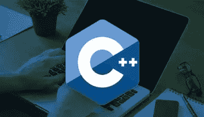
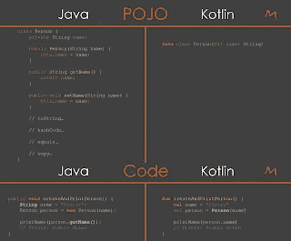
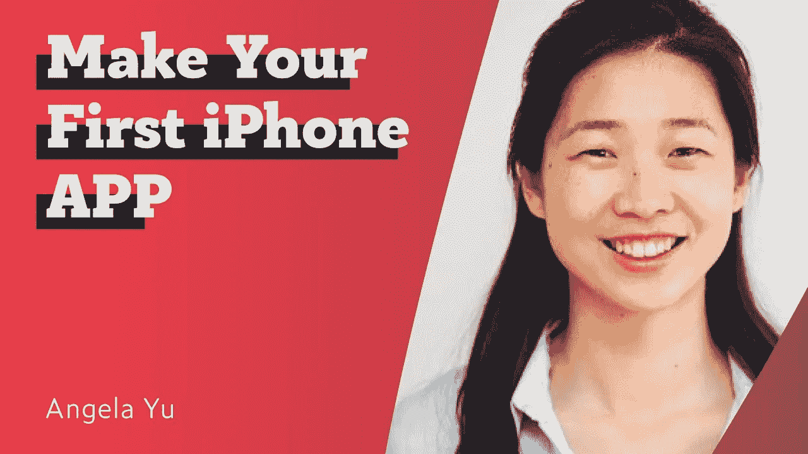
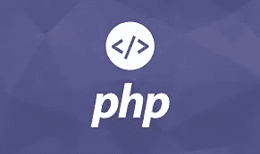

# 2023 年成为软件开发人员可以学习的 10 大编程语言

> 原文：<https://medium.com/javarevisited/top-10-programming-languages-you-can-learn-for-jobs-and-career-in-technology-491e611c22bc?source=collection_archive---------0----------------------->

## 这些是软件开发的最佳编程语言，未来，找一份技术方面的工作，有相关链接可以在线学习。

在 [Unsplash](https://unsplash.com?utm_source=medium&utm_medium=referral) 上由 [Austin Distel](https://unsplash.com/@austindistel?utm_source=medium&utm_medium=referral) 拍摄的照片

几个月前，我在 HackerNews 上读到一篇有趣的文章，文章认为**即使你现在不需要编程语言，也应该学习它们**，我不得不说我同意这一观点。

由于每种编程语言都适合某些特定的东西，但对其他人来说就不那么好了，所以程序员和高级开发人员了解多种语言是有意义的，这样您就可以为工作选择正确的工具。

但是应该学习哪些编程语言呢？因为有许多编程语言，从三大巨头如 [Java](/javarevisited/top-5-java-online-courses-for-beginners-best-of-lot-1e1e240a758) 、 [JavaScript](/hackernoon/10-websites-to-learn-javascript-for-beginners-31e13bbdbb5c) 和 [Python](/better-programming/top-5-courses-to-learn-python-in-2018-best-of-lot-26644a99e7ec) 到不太知名的如 [Julia](/javarevisited/top-5-julia-programming-books-courses-and-tutorials-for-beginners-e5b4bd7067ec) 、 [Rust](/javarevisited/7-best-rust-programming-courses-and-books-for-beginners-in-2021-2ed2311af46c) 或 [R](https://hackernoon.com/5-free-r-programming-courses-for-data-scientists-and-ml-programmers-5732cb9e10) 。

> 最大的问题是哪种语言会给你带来最大的回报？

这完全取决于你想要什么？例如，如果你在高盛、摩根士丹利或花旗等大型投资银行找工作，那么 Java 是最好的编程语言，其次是 C++ 和 C# 。

但是，如果你想在谷歌、脸书和微软这样的科技公司找到工作，那么 Python 和 JavaScript 可能比 Java 更好。

尽管 [Java](https://dzone.com/articles/best-of-dzone-java-tutorials-for-beginners-and-exp) 是我最喜欢的语言，我也知道一点点 [C](https://dev.to/javinpaul/10-things-every-software-developer-should-know-39pe) 和 [C++](https://dzone.com/articles/5-free-courses-to-learn-c-programming-in-depth) ，我还是努力在今年之后扩展。我对 [Python](https://hackernoon.com/top-5-courses-to-learn-python-in-2018-best-of-lot-26644a99e7ec) 和 [JavaScript](https://javarevisited.blogspot.com/2018/06/top-10-courses-to-learn-javascript-in.html) 特别感兴趣，但你可能对其他东西感兴趣。

> 注意:即使这很诱人，也不要试图一次学习太多的编程语言；先选一个，掌握了，再去下一个。

# 2023 年你可以学习的 10 种最佳编程语言

这里是在 Stack Overflow 的年度开发者调查的帮助下汇编的十大编程语言的列表，我自己的经验应该能给你一些帮助。

特别是如果你想在高盛、花旗、摩根、摩根大通、巴克莱等大型投资银行找工作，或者在 Infosys、Wipro、Cognizant、Luxsoft 等服务行业公司找工作，这些公司主要为这些大型金融机构工作。

## 1.Java[后端开发的最佳编程语言]

Java 是投资银行中使用最广泛的语言。去 Monster.com 或 eFinancialCareer.com 等任何求职网站，你会发现高盛、摩根、花旗等银行的大部分招聘信息都需要 Java 技能。

Java 在银行的任何地方和不同部门都有使用，但主要用于创建运行在 Linux 上的服务器端应用程序。

投资银行偏爱 Java 的一个主要原因是它的并发特性。Java 内置了对多线程的支持，这是银行中性能密集型的关键任务应用程序所需要的。所以，确保你花了大量的时间[掌握 Java 中的并发性](https://javarevisited.blogspot.com/2018/06/top-5-java-multithreading-and-concurrency-courses-experienced-programmers.html)。

如果你真的想在华尔街的公司找份工作，Java 应该是第一个要掌握的语言，如果你需要一个好的资源来开始，那就去看看 Udemy 网站上的 [**完整的 Java 大师班**](https://click.linksynergy.com/fs-bin/click?id=JVFxdTr9V80&subid=0&offerid=323058.1&type=10&tmpid=14538&RD_PARM1=https%3A%2F%2Fwww.udemy.com%2Fjava-the-complete-java-developer-course%2F) 。

如果你不介意从免费资源中学习，那么你也可以看看[的免费 Java 编程课程列表](https://javarevisited.blogspot.com/2018/05/top-5-java-courses-for-beginners-to-learn-online.html)。

## 2.c-Sharp[GUI 开发的最佳编程语言]

C#和。NET 在投资银行中也很受欢迎，尤其是用于创建客户端 GUI。早先是 Java Swing 但是 [C#](https://javarevisited.blogspot.com/2019/11/top-5-courses-to-learn-c-sharp-in.html) 和[。NET](https://javarevisited.blogspot.com/2019/10/top-5-courses-to-learn-asp-net-in-2019.html) 现在是任何基于 windows 的 GUI 应用程序的首选。

如果你正在考虑为 PC 和 Web 开发 GUI，C# 是一个很好的选择。它也是用于[的编程语言。NET framework](https://javarevisited.blogspot.com/2019/10/top-5-courses-to-learn-asp-net-in-2019.html) ，更不用说在 PC 和主机的游戏开发中大量使用。

如果你对以上任何一个领域感兴趣，可以看看 Udemy 的 [**通过制作游戏学习编码— —完整的 C# Unity 开发者**](https://click.linksynergy.com/fs-bin/click?id=JVFxdTr9V80&subid=0&offerid=323058.1&type=10&tmpid=14538&RD_PARM1=https%3A%2F%2Fwww.udemy.com%2Funitycourse%2F) 。我看到有超过 20 万的学生注册了这门课程，这说明了它的受欢迎程度。

同样，如果你不介意从免费课程中学习，这里列出了一些针对初学者的免费 C#编程课程。

## 3.C/c++[嵌入式系统的最佳编程语言]

C++是投资银行和其他买方公司使用的另一种主要语言。它主要用于创建低延迟的交易应用程序，在这些应用程序中，性能至关重要。

C 和 C++都是常青树语言，你们中的许多人可能从学校里就知道它们。但是如果你是在 C++里做一些严肃的工作，我可以保证你的学术经验会不够。

你需要参加一个全面的在线课程，比如 C++的 [**:从初学者到专家**](https://click.linksynergy.com/deeplink?id=JVFxdTr9V80&mid=39197&murl=https%3A%2F%2Fwww.udemy.com%2Fvideo-course-c-from-beginner-to-expert%2F) ，为行业做好准备。

而对于想要一些免费课程学习 C++的朋友来说，这里有一个[免费 C++编程初学者课程](https://dzone.com/articles/5-free-courses-to-learn-c-programming-in-depth)的列表。

## 4.JavaScript[web 开发的最佳编程语言]

不管你相不相信，JavaScript 是网络的头号语言。像 [jQuery](https://dzone.com/articles/5-free-courses-to-learn-for-web-developers) 、 [Angular](https://dzone.com/articles/top-5-angular-2-courses-for-web-developers) 和 [React JS](https://dzone.com/articles/how-to-learn-react-js-the-react-roadmap-for-modern) 这样的框架的兴起使得 JavaScript 更加流行。因为你就是离不开网络，所以学习 JavaScript 越早越好。

它也是客户端验证的头号语言，这确实使它能够学习 JavaScript。

深信不疑？那么这个[**JavaScript master class**](https://click.linksynergy.com/fs-bin/click?id=JVFxdTr9V80&subid=0&offerid=323058.1&type=10&tmpid=14538&RD_PARM1=https%3A%2F%2Fwww.udemy.com%2Fthe-complete-javascript-course%2F)就是一个很好的开始。想要更便宜的选择，看看这个免费 JavaScript 课程列表。

## 5.python[数据科学的最佳编程语言]

Python 现在已经取代 Java 成为大学和学术界教授最多的编程语言。

这是一种非常强大的语言，非常适合生成脚本。你会发现你能想到的所有东西都有一个 python 模块。

例如，我在 Linux 中寻找一个命令来监听 UDP 流量，但是什么也找不到。所以，我在 10 分钟内写了一个 Python 脚本来做同样的事情。

如果你想学习 Python，【Pluralsight】的 [**Python 基础**](https://pluralsight.pxf.io/c/1193463/424552/7490?u=https%3A%2F%2Fwww.pluralsight.com%2Fcourses%2Fpython-fundamentals) 是最好的在线课程之一。你需要一个 [Pluralsight 会员](https://pluralsight.pxf.io/c/1193463/424552/7490?u=https%3A%2F%2Fwww.pluralsight.com%2Fpricing)才能进入这个课程，费用大约是每月 29 美元或每年 299 美元。你也可以使用他们的[免费试用](http://pluralsight.pxf.io/c/1193463/424552/7490?u=https%3A%2F%2Fwww.pluralsight.com%2Flearn)来访问它。

而且，如果你需要多一个选择，那么 Udemy 上的 [**完整的 Python Bootcamp:从零到英雄 Python 3**](https://click.linksynergy.com/deeplink?id=JVFxdTr9V80&mid=39197&murl=https%3A%2F%2Fwww.udemy.com%2Fcomplete-python-bootcamp%2F) 是另一个适合初学者的牛逼课程。

如果你正在寻找一些免费的替代品，你可以在这里找到一个列表。

## 6.kot Lin[Android 应用程序开发的最佳编程语言]

如果你正在认真思考 Android 应用程序开发，那么 [Kotlin](https://dzone.com/articles/want-to-get-a-job-at-google-learn-kotlin) 是今年要学习的编程语言。这绝对是 Android 世界发生的下一件大事。

尽管 Java 是我的首选语言，但 Kotlin 已经得到了原生支持，许多 ide，如 IntelliJ IDEA 和 Android Studio 都支持 Android 开发。

如果你想在今年学习 Kotlin，那么完整的 Android Kotlin 开发者课程可能是最好的在线课程。

## 7.golang[服务器端开发的最佳编程语言]

这是你今年可能想学的另一门编程语言。我知道它目前不是很受欢迎，同时也很难学习，但我觉得它的使用将在 2023 年增加。

现在也没有多少 Go 开发者，所以你可能真的想要勇往直前，咬紧牙关，尤其是如果你想创建[框架](https://hackernoon.com/10-java-big-data-and-web-development-frameworks-programmers-should-learn-in-2019-399692efb4d5)之类的东西。如果你能花些时间成为围棋专家，你将会大受欢迎。

而且，如果你想在今年学习 Golang，那么[**Go:Udemy 的完整开发者指南**](https://click.linksynergy.com/fs-bin/click?id=JVFxdTr9V80&subid=0&offerid=323058.1&type=10&tmpid=14538&RD_PARM1=https%3A%2F%2Fwww.udemy.com%2Fgo-the-complete-developers-guide%2F) 是在线课程，可能是最好的起点

## 8.swift[iOS 应用开发最佳编程语言]

如果你正在考虑像为 iPhone 和 iPad 制作应用程序一样进行 iOS 开发，那么你应该在 2023 年认真考虑[学习 Swift](/javarevisited/top-5-online-courses-to-learn-ios-12-swift-in-2019-a35ae1be7b2b) 。

它取代 Objective C 成为开发 iOS 应用程序的首选语言。因为我是 Android 的家伙，所以我对 Swift 没有目标，但是如果*你*有，你可以从 [**iOS 和 Swift 5 开始——完整的 iOS 应用程序开发训练营**](https://click.linksynergy.com/deeplink?id=JVFxdTr9V80&mid=39197&murl=https%3A%2F%2Fwww.udemy.com%2Fcourse%2Fios-13-app-development-bootcamp%2F) 。

如果你不介意从免费资源中学习，那么你也可以查看这份免费 iOS 课程列表[以获得更多选择。还有这个漂亮的教程](https://javarevisited.blogspot.com/2018/11/5-free-ios-app-development-courses-for.html)。

## 9.实时系统开发的最佳编程语言

老实说，我对 Rust 不太了解，因为我从未使用过它，但它确实在 Stack Overflow 开发者调查中获得了“最受欢迎的编程语言”奖，所以这里显然有值得学习的东西。

那里没有很多免费的 Rust 课程，但是为本科生开设的<https://click.linksynergy.com/deeplink?id=JVFxdTr9V80&mid=39197&murl=https%3A%2F%2Fwww.udemy.com%2Frust-for-undergrads%2F>**Rust 是一个不错的开始。**

****

## **10.PHP[网站开发的最佳编程语言]**

**如果你认为 PHP 已经死了，那么你就*死了*错了。它仍然非常活跃。百分之五十(50%)的互联网网站是使用 PHP 建立的，即使它不在我个人今年要学习的语言清单上，如果你还不知道它，它仍然是一个很好的选择。**

**而且，如果你想从头学起， [**PHP for 初学者— —成为 PHP 高手 Udemy 上的 CMS Project**](https://click.linksynergy.com/deeplink?id=JVFxdTr9V80&mid=39197&murl=https%3A%2F%2Fwww.udemy.com%2Fphp-for-complete-beginners-includes-msql-object-oriented%2F) 是很棒的课程。**

****

**而且，如果你喜欢免费的东西来学习 PHP，看看[Hackernoon]上的免费 PHP 和 MySQL 课程清单 T11**

## **结论**

**这些是你在 2023 年可以学习的一些最好的编程语言。这些编程语言中的大部分足以让你在高盛、摩根、巴克莱或汇丰等大型投资银行找到软件开发工作。**

**是的，它有那些常见的嫌疑，但是在这些大型金融巨头中，Java 和 C++是获得开发人员职位的前两种语言。**

**即使除了你日常使用的语言之外，你只学习一门编程语言，你也会为你的职业发展做好准备。现在最重要的是确立你的目标，并尽你最大的努力坚持下去。快乐学习！**

**如果你喜欢这篇文章，这里有几篇你可能会喜欢的我的文章:**

1.  **[完整的 Web 开发者路线图](https://hackernoon.com/the-2019-web-developer-roadmap-ab89ac3c380e)**
2.  **[50+数据结构与算法面试题](https://hackernoon.com/50-data-structure-and-algorithms-interview-questions-for-programmers-b4b1ac61f5b0)**
3.  **[每个软件开发人员都应该知道的 10 件事](https://dev.to/javinpaul/10-things-every-software-developer-should-know-39pe)**
4.  **[2023 年学习 Python 的 10 个理由](https://hackernoon.com/10-reasons-to-learn-python-in-2018-f473dc35e2ee)**
5.  **[面向初学者的 10 门数据科学和机器学习课程](https://dev.to/javinpaul/10-data-science-and-machine-learning-courses-for-programmers-looking-to-switch-career-57kd)**
6.  **[10 门数据结构课程破解编码面试](https://dev.to/javinpaul/10-data-science-and-machine-learning-courses-for-programmers-looking-to-switch-career-57kd)**
7.  **[完整的 DevOps 路线图](https://hackernoon.com/the-2018-devops-roadmap-31588d8670cb?gi=8829080e6d7d)**
8.  **[Java 和 Web 开发者可以学习的 10 个框架](https://dev.to/javinpaul/10-frameworks-java-and-web-developers-can-learn-in-2019-17ke)**
9.  **[2023 年 Java 开发者路线图](https://javarevisited.blogspot.com/2019/10/the-java-developer-roadmap.html)**

**祝您的编程测试之旅好运！当然**不会很容易**，但是通过遵循这个列表，你离成为你一直想成为的软件开发者更近了一步**

**如果你喜欢这篇文章，那么请考虑在 Twitter 上关注我。如果你想得到每一个新帖子的通知，别忘了在 Twitter 上关注[**javarevited**](https://twitter.com/javarevisited)！**

**<https://javarevisited.blogspot.com/2020/05/top-10-udemy-courses-to-learn-python-programming.html>  <https://javarevisited.blogspot.com/2018/02/top-5-online-courses-to-learn-web-development.html> **