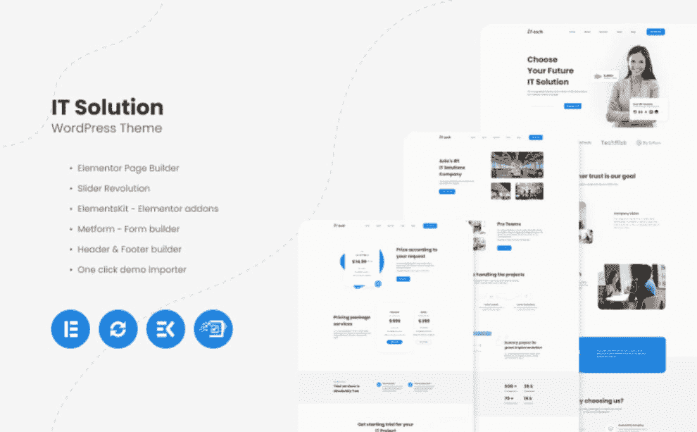
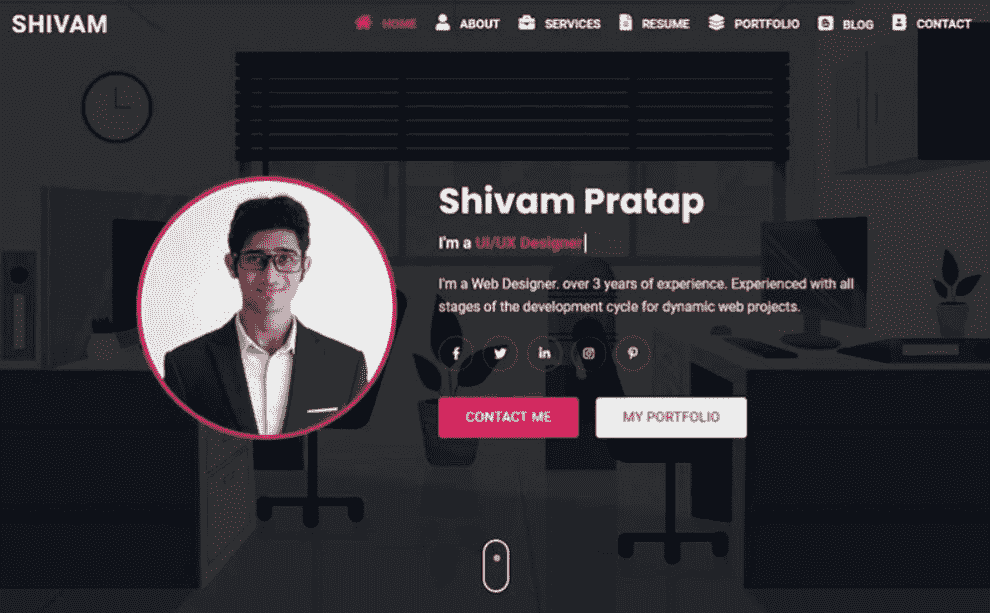
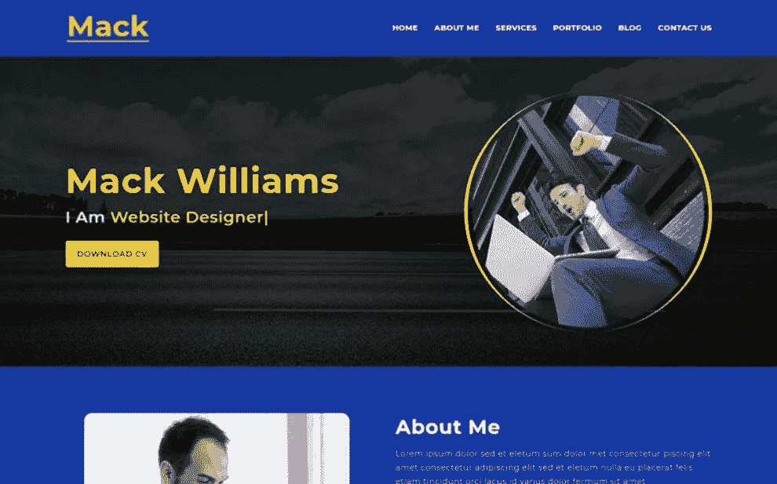
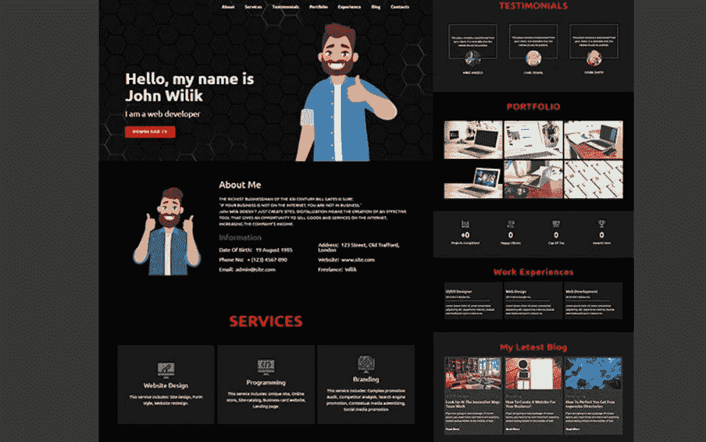

# 开始新博客的 10 大编程网站模板

> 原文：<https://medium.com/javarevisited/top-10-programming-website-templates-to-start-your-new-blog-4792caa8536d?source=collection_archive---------1----------------------->

## 是时候发明和编码新的博客了

作为一名 IT 专家，你可能意识到如果你的公司要繁荣发展，拥有一个功能齐全的网站是多么的重要。你的地位、收入和客户名单都严重依赖于你的互联网存在。

因此，投资一个可靠的网站是必不可少的。幸运的是，有许多优秀的[编程网站模板](https://www.templatemonster.com/category/web-development-website-templates?aff=javarevisited&utm_campaign=programmingtemplates&utm_source=javarevisited&utm_medium=referral)可以帮助你创建一个出色的 IT 网站。它们可以为您提供以下优势:

*   与可视页面生成器的兼容性(使用拖放功能，无需接触代码)；
*   页眉和页脚生成器，用于修改顶部和底部元素；
*   预制风格(以及创造自己风格的机会)；
*   流畅的动画使网站更加生动和复杂；
*   [全响应设计](/javarevisited/8-best-responsive-design-courses-for-web-developers-e507f7952774)(所有包含的元素在不同的设备上出现并正常运行)。

你想了解更多关于不同的编程网站模板变种吗？我们选择了设计最精美、功能最强大的解决方案。

# 用这 10 个编程网站模板选项感受编码和创造力的力量！

## 1. [IT-tech — IT 解决方案 WordPress 主题](https://www.templatemonster.com/monsterone/tm-membership/?id=225788&?aff=javarevisited&utm_campaign=programmingtemplates&utm_source=javarevisited&utm_medium=referral)

IT-tech 是由专业人士为专业人士精心制作的概念新颖、引人注目的主题。由于提供了用户友好的 Elementor 页面生成器，因此可以节省时间和精力。您可以尽可能快地使用拖放功能自由定制页眉、页脚和页面。

除此之外，它还提供了一键式安装过程。所以你不需要一个接一个的安装所有的组件。该软件包还包括一个令人难以置信的旋转滑块，以创建一个持久的视觉内容的印象。

主要特点:

*   全响应设计；
*   巨型菜单；
*   视差效应；
*   谷歌地图；
*   表单生成器。

[**立即购买**](https://www.templatemonster.com/wordpress-themes/it-tech-it-solution-wordpress-theme-225788.html?aff=javarevisited&utm_campaign=programmingtemplates&utm_source=javarevisited&utm_medium=referral) **|** [**在 MonsterONE**](https://www.templatemonster.com/monsterone/tm-membership/?id=225788&?aff=javarevisited&utm_campaign=programmingtemplates&utm_source=javarevisited&utm_medium=referral) 免费下载

## 2.艾娃—自由职业和网络开发登录页面模板

艾娃是一个为自由职业者和网络开发者设计的极简风格的登陆页面模板。它的工具包将是那些需要一个轻松快捷的网站建设过程的完美匹配。

这个包里有所有必要的部分来讲述你的技能、教育、经验和其他细节。你也可以自由展示评论，添加倒计时，并通过联系方式进行交流。毫无疑问，它有一个完全响应的设计。

因此，您的观众可以使用所有设备查看网站，无论他们的屏幕分辨率如何。

主要特点:

*   漂亮的头球；
*   定价；
*   证明；
*   谷歌地图；
*   博客功能。

[立即购买](https://www.templatemonster.com/landing-page-template/ava-personal-portfolio-landing-page-template-190638.html?aff=javarevisited&utm_campaign=programmingtemplates&utm_source=javarevisited&utm_medium=referral) | [在 MonsterONE](https://www.templatemonster.com/monsterone/tm-membership/?id=190638&?aff=javarevisited&utm_campaign=programmingtemplates&utm_source=javarevisited&utm_medium=referral) 免费下载

## 3.Gru —个人投资组合登录页面模板

如果你一直梦想着一个艺术化的、卓越的作品集编程模板，这是你理想的选择。您将获得大量的功能，以获得一个符合您需求的美学网站。

首先，有一个完全响应的设计，确保您的在线项目将适应多种设备。此外，您将获得一份令人惊叹的联系表格，可以在一瞬间联系到您的团队。

还有几个预先制作的页面，如项目或博客，将展示您的最佳活动。不要忘记谷歌字体的可用性。

主要特点:

*   视差效应；
*   图库功能；
*   全响应设计；
*   独特的效果；
*   证明。

[立即购买](https://www.templatemonster.com/landing-page-template/gru-personal-portfolio-landing-page-template-237487.html?aff=javarevisited&utm_campaign=programmingtemplates&utm_source=javarevisited&utm_medium=referral) | [试玩](https://www.templatemonsterpreview.com/demo/237487.html?aff=javarevisited&utm_campaign=programmingtemplates&utm_source=javarevisited&utm_medium=referral)

# Shivam —个人投资组合和简历/履历登录页面模板

Shivam 是一个令人惊叹的编程网站模板，适合那些需要个人作品集或简历的人。由于大量有用的选择，它能够让你朝着正确的方向前进。例如，该软件包有 3 个以上的主页变体，每个变体都会立即引起注意。你也将得到一个浅色和深色版本的演示。其他必要的功能包括作品集过滤和博客功能。还有一个联系方式，会成为想和你交流的人的助手。

主要特点:

*   易于定制的性质；
*   社交媒体图标；
*   全响应设计；
*   谷歌字体；
*   谷歌地图。

[立即购买](https://www.templatemonster.com/landing-page-template/shivam-personal-portfolio-and-resume-cv-landing-page-template-236682.html?aff=javarevisited&utm_campaign=programmingtemplates&utm_source=javarevisited&utm_medium=referral) | [在 MonsterONE](https://www.templatemonster.com/monsterone/tm-membership/?id=236682&?aff=javarevisited&utm_campaign=programmingtemplates&utm_source=javarevisited&utm_medium=referral) 免费下载

# Kufx —创意个人和投资组合登录页面模板

适合不同目标的清晰创新的登录页面模板。它不仅是一个专家编程网站模板，也是一个理想的现成的解决方案，为其他专业人士。这些人包括摄影师、软件工程师、自由职业者等等。它提供了一个易于定制的特性，不会让你花费数周或数月来个性化你梦想的网站。此外，它有一个完全响应的设计，如果人们使用智能手机而不是笔记本电脑，他们不会离开你的在线项目。流畅的滚动会使浏览内容更加愉快。

主要特点:

*   联系方式；
*   谷歌字体；
*   视差效应；
*   图库功能；
*   社交媒体整合。

[立即购买](https://www.templatemonster.com/landing-page-template/kufx-creative-personal-amp-portfolio-landing-page-template-230189.html?aff=javarevisited&utm_campaign=programmingtemplates&utm_source=javarevisited&utm_medium=referral) | [在 MonsterONE 免费下载](https://www.templatemonster.com/monsterone/tm-membership/?id=230189&?aff=javarevisited&utm_campaign=programmingtemplates&utm_source=javarevisited&utm_medium=referral)

# Mack —个人投资组合登录页面模板

你需要一种可靠的方式来尽可能好地展示你的技能和经验吗？在这种情况下，利用这个不可思议的编程网站模板将是明智的。它提供了一个直观和无障碍的网站建设过程，允许尽快发布网站。该工具包提供了广泛的选项，将为您简化所有步骤。它有开发人员友好的代码和多种不同类型信息的预设计页面。你将准备好谈论所提供的服务和体验。由于有了推荐部分，传播你的职业精神也不会有什么困难。

主要特点:

*   博客功能；
*   联系方式；
*   谷歌字体；
*   全响应设计；
*   易于定制。

[立即购买](https://www.templatemonster.com/landing-page-template/mack-is-a-personal-portfolio-landing-page-template-220438.html?aff=javarevisited&utm_campaign=programmingtemplates&utm_source=javarevisited&utm_medium=referral) | [在 MonsterONE](https://www.templatemonster.com/monsterone/tm-membership/?id=220438&?aff=javarevisited&utm_campaign=programmingtemplates&utm_source=javarevisited&utm_medium=referral) 免费下载

# Portfo —完全响应的工作登录页面模板

Portfo 是一个吸引人的编程网站模板，适合任何相关的专业。开发人员、设计人员和 web 工作室会发现这个登录页面模板非常有吸引力。你将有机会给你的潜在客户留下独特的印象。这个包有许多块，包括关于我，服务，工作经验，以及许多其他内容。其时尚和现代的投资组合将确保您的项目值得关注。这里还有一个博客功能，可以通过分享一些有价值的帖子来拉近与受众的距离。

主要特点:

*   联系方式；
*   Ajax 技术；
*   评论；
*   包括图像；
*   深色系。

[立即购买](https://www.templatemonster.com/landing-page-template/portfo-fully-responsive-working-landing-page-template-209737.html?aff=javarevisited&utm_campaign=programmingtemplates&utm_source=javarevisited&utm_medium=referral) | [在 MonsterONE 免费下载](https://www.templatemonster.com/monsterone/tm-membership/?id=209737&?aff=javarevisited&utm_campaign=programmingtemplates&utm_source=javarevisited&utm_medium=referral)

# Oring —响应式个人 HTML 登录页面模板

Oring 是一个复杂的编程网站模板，具有多种用途。它的各种各样的工具将帮助你推进你的个人项目。您可以根据自己的喜好自由选择不同的多页演示。可以根据你的设想来定制它们中的每一个。还有平滑的动画效果会装饰你的网站。不要忘了一份联系表，它可以与你的听众建立更好的关系。

主要特点:

*   全响应设计；
*   动态博客功能；
*   易于定制的性质；
*   Ajax
*   投资组合功能。

[立即购买](https://www.templatemonster.com/landing-page-template/oring-responsive-personal-html-landing-page-template-201670.html?aff=javarevisited&utm_campaign=programmingtemplates&utm_source=javarevisited&utm_medium=referral) | [在 MonsterONE](https://www.templatemonster.com/monsterone/tm-membership/?id=201670&?aff=javarevisited&utm_campaign=programmingtemplates&utm_source=javarevisited&utm_medium=referral) 免费下载

# 创意简历主题

这是一个强大的、功能齐全的简历和编程网站模板。由于其独特的颜色组合，它将在网络上单独描绘你。一个强大的元素或页面生成器允许你定制每个元素。它还提供了一键虚拟安装选项，以节省您的时间和精力。

你可以从四个主页选项中选择，让人们爱上这个网站。你可以自由分享最新消息，创建引人注目的作品集。

主要特点:

*   谷歌字体；
*   下拉菜单；
*   谷歌地图；
*   博客功能；
*   页眉和页脚变体。

[立即购买](https://www.templatemonster.com/wordpress-themes/bittanto-creative-resume-wordpress-theme-189483.htmlhttps://www.templatemonster.com/monsterone/tm-membership/?id=201670&?aff=javarevisited&utm_campaign=programmingtemplates&utm_source=javarevisited&utm_medium=referral) | [在 MonsterONE 免费下载](https://www.templatemonster.com/monsterone/tm-membership/?id=189483&https://www.templatemonster.com/monsterone/tm-membership/?id=201670&?aff=javarevisited&utm_campaign=programmingtemplates&utm_source=javarevisited&utm_medium=referral)

# 几句话作为结论

科技网站和博客在科技进步的时代很有用。新设备、设计公司和咨询机构、广告公司和应用程序每天都在发展，这并不奇怪。每个 IT 公司都努力以最好的方式推广其产品和服务。所以你的机构需要一些独特的东西。

这些可能是一种与众不同的优势，一种将继续让您的客户和专业竞争对手感到惊讶的与众不同的特征。加上不同的[网站模板组合](https://www.templatemonster.com/html5-website-templateshttps://www.templatemonster.com/monsterone/tm-membership/?id=201670&?aff=javarevisited&utm_campaign=programmingtemplates&utm_source=javarevisited&utm_medium=referral)，你可以自由获得想要的专业性、灵活性和力量。

顺便说一下，你也可以使用我的折扣代码“javaregistered”，在 TemplateMonster 上购买所有 [web 开发网站模板](https://www.templatemonster.com/category/web-development-website-templateshttps://www.templatemonster.com/monsterone/tm-membership/?id=201670&?aff=javarevisited&utm_campaign=programmingtemplates&utm_source=javarevisited&utm_medium=referral)可以获得 5%的折扣。感谢阅读！