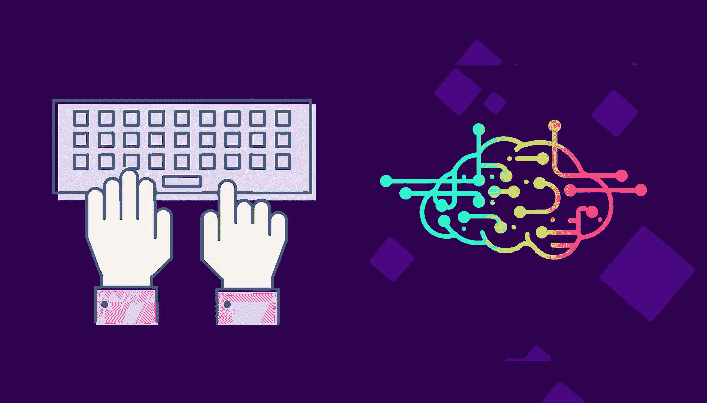
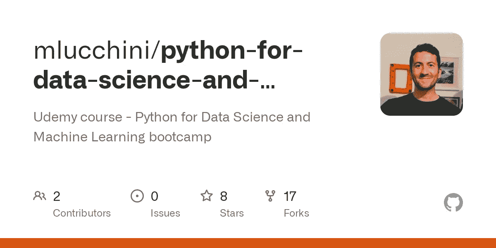
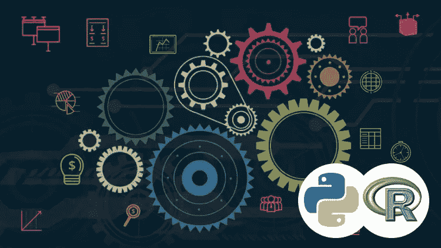
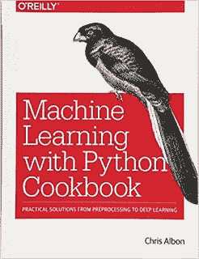
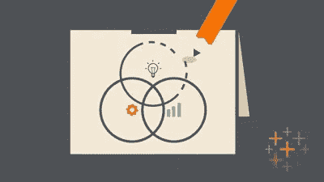
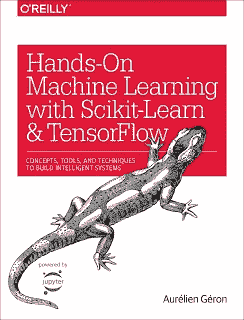

# 2023 年用 Python 和 R 学习的 12 本最佳数据科学和机器学习书籍和课程

> 原文：<https://medium.com/javarevisited/top-10-resources-to-learn-data-science-and-machine-learning-best-of-lot-f153e1f44e89?source=collection_archive---------1----------------------->

## 这些是用 Python 和 R 学习数据科学和机器学习的最佳书籍、教程和交互式课程

image credit — [通过 Educative 成为机器学习工程师](https://www.educative.io/track/become-ml-engineer?affiliate_id=5073518643380224)

许多程序员正转向数据科学和机器学习，希望获得更好的薪酬和职业机会——这是有原因的。在过去的几年里，[的数据科学家](http://javarevisited.blogspot.sg/2018/02/top-10-highest-paying-technical-jobs-programmers-software-developers.html#axzz58Gi5STbU)一直是 Glassdoor 的**头号工作，根据 Indeed 的数据，一名数据科学家在美国的平均工资超过**12 万美元**。**

数据科学不仅在金钱方面是一个有回报的职业，而且它还为你解决一些世界上最有趣的问题提供了机会。依我看，这是许多优秀程序员走向[数据科学](https://javarevisited.blogspot.sg/2018/03/top-5-data-science-and-machine-learning-online-courses-to-learn-online.html)、[机器学习](https://javarevisited.blogspot.com/2018/08/top-5-tensorflow-and-machine-learning-courses-online-programmers.html)和[人工智能](https://javarevisited.blogspot.com/2019/10/top-5-courses-to-learn-artificial-intelligence-AI.html)的主要动机。

如果你也在同一条船上，想着在 2023 年成为一名数据科学家，那么你来对地方了。在本文中，我将分享一些**最佳在线课程，通过学习数据科学、机器学习和人工智能，你可以在 2023 年**成为一名数据科学家。

说到编程语言和库， [Python](http://javarevisited.blogspot.sg/2018/03/top-5-courses-to-learn-python-in-2018.html) 和 [R](http://www.java67.com/2017/12/10-programming-languages-to-learn-in.html) 显然是机器学习、[数据分析](https://javarevisited.blogspot.com/2019/10/top-5-courses-to-learn-pandas-for-data-analysis-python.html)和[人工智能](https://javarevisited.blogspot.com/2019/10/top-5-courses-to-learn-artificial-intelligence-AI.html)领域的两种领先编程语言。这些语言正在发生许多令人兴奋的发展，而且它们已经有了一些有用的库。

如果你有一些编程或脚本编写经验，这些课程将教你科技行业中真正的数据科学家和机器学习从业者使用的技术，并为你进入这一热门而有利可图的职业道路做准备。

# 学习数据科学和机器学习的 12 个最佳课程、书籍、教程和班级

以下是我列出的五大在线课程，你可以参加这些课程来学习数据科学和机器学习，并成为一名数据科学家。

这些课程将为您提供宝贵的见解、建议、技巧和推荐，让您的数据科学职业生涯更上一层楼。

它包含了关于 Python 和 R 的课程，这两种语言是数据科学家最流行的编程语言。

## 1.[数据科学 A-Z:包括现实生活中的数据科学练习](https://click.linksynergy.com/deeplink?id=JVFxdTr9V80&mid=39197&murl=https%3A%2F%2Fwww.udemy.com%2Fcourse%2Fdatascience%2F)

如果你对数据分析和机器学习感兴趣，并想知道如何成为顶级数据科学家，那么这是适合你的课程。

在[这门课程](https://click.linksynergy.com/deeplink?id=JVFxdTr9V80&mid=39197&murl=https%3A%2F%2Fwww.udemy.com%2Fcourse%2Fdatascience%2F)中，您不仅将学习如何成为一名数据科学家的基本步骤，还将学习让您的数据科学职业生涯更上一层楼的实际技巧和诀窍。

> 这不是那种每件事情都按照它应该的方式进行，你的训练一帆风顺的轻松课程。这门课程会让你陷入困境。

它非常实用…难以置信的实用…难以置信的真实！

以下是加入课程的链接— [**基里尔·叶列缅科**的数据科学](https://click.linksynergy.com/deeplink?id=JVFxdTr9V80&mid=39197&murl=https%3A%2F%2Fwww.udemy.com%2Fcourse%2Fdatascience%2F)

## 2. [Python 进行数据分析](https://www.amazon.com/gp/product/1491957662?tag=javamysqlanta-20)【书】

这是第一本关于数据分析和数据科学的专门 Python 书籍。这本书将涵盖数据科学家或数据工程师应该知道的所有基础知识，如数据聚合和时间序列。

同时，它还通过基本的 python 练习，教你如何将 Pandas 应用到实际问题中。这是我经常看的书和在线课程之一，因为我们学到了更多的解决实际问题和使用我们的技能。

> 这可能是用 Python 操作、处理、清理和处理数据以及学习熊猫进行实际工作的最佳书籍。

这里是购买这本书的链接— [**Python 进行数据分析**](https://www.amazon.com/gp/product/1491957662?tag=javamysqlanta-20)

## [3。用于数据科学和机器学习的 Python 训练营](https://click.linksynergy.com/fs-bin/click?id=JVFxdTr9V80&subid=0&offerid=323058.1&type=10&tmpid=14538&RD_PARM1=https%3A%2F%2Fwww.udemy.com%2Fpython-for-data-science-and-machine-learning-bootcamp%2F)

我的许多已经转向数据科学的朋友和同事已经选择 Python 作为他们的语言选择。一个原因是 Python 可能是最流行的语言，它提供了一切。

他们已经在使用 [Python](http://www.java67.com/2018/02/5-free-python-online-courses-for-beginners.html) 编写脚本和[面向对象编程](http://www.java67.com/2018/02/5-free-object-oriented-programming-online-courses.html)，如果你已经知道这门语言，学习数据科学会比学习像 r 这样的新语言更容易。

这是掌握数据科学和机器学习 python 库的最佳课程之一。

以下是加入本课程的链接— [**Python for Data Science 训练营**](https://click.linksynergy.com/fs-bin/click?id=JVFxdTr9V80&subid=0&offerid=323058.1&type=10&tmpid=14538&RD_PARM1=https%3A%2F%2Fwww.udemy.com%2Fpython-for-data-science-and-machine-learning-bootcamp%2F)

您将学习如何使用大多数流行的 Python 机器学习和深度学习库，如 [NumPy](http://bit.ly/2CwoE3b) 、 [Pandas](http://bit.ly/2Ml6Kpa) 、Seaborn、Matplotlib、Plotly、 [Scikit-learn](http://bit.ly/2CwoOYl) 、 [Meeshkan](http://bit.ly/2CxzExs) 、 [TensorFlow](https://hackernoon.com/top-5-tensorflow-and-ml-courses-for-programmers-8b30111cad2c) 、 [Keras](http://bit.ly/2CwDyXt) 等等！

本课程是为有一些编程经验的初学者和希望向数据科学迈进的有经验的开发人员设计的！

它可以与通常花费数千美元的其他数据科学训练营相媲美，但现在，你可以以很少的成本了解所有信息——如果你幸运地在 [**Udemy 的**](https://click.linksynergy.com/fs-bin/click?id=JVFxdTr9V80&subid=0&offerid=323058.1&type=10&tmpid=14538&RD_PARM1=https%3A%2F%2Fwww.udemy.com%2Fpython-for-data-science-and-machine-learning-bootcamp%2F) 闪购期间买到，只需 **$9.99** 。

## [4。用 Python 进行数据科学、深度学习和机器学习](https://click.linksynergy.com/fs-bin/click?id=JVFxdTr9V80&subid=0&offerid=323058.1&type=10&tmpid=14538&RD_PARM1=https%3A%2F%2Fwww.udemy.com%2Fdata-science-and-machine-learning-with-python-hands-on%2F)

这是一门难得的实践课程，学习雇主正在寻求的神经网络、人工智能和机器学习技术。

这门课程是通过分析最大的科技雇主对数据科学家职位清单的真实要求而设计的，这意味着它涵盖了真实雇主正在寻找的机器学习和数据挖掘技术。

以下是加入本课程的链接— [**数据科学与 Python**](https://click.linksynergy.com/fs-bin/click?id=JVFxdTr9V80&subid=0&offerid=323058.1&type=10&tmpid=14538&RD_PARM1=https%3A%2F%2Fwww.udemy.com%2Fdata-science-and-machine-learning-with-python-hands-on%2F)

## 5.[吴恩达的机器学习](https://coursera.pxf.io/c/3294490/1164545/14726?u=https%3A%2F%2Fwww.coursera.org%2Flearn%2Fmachine-learning)【最佳免费 Coursera 课程】

这大概是斯坦福大学和 [**Coursera**](https://coursera.pxf.io/c/3294490/1164545/14726?u=https%3A%2F%2Fwww.coursera.org%2F) 提供的最受欢迎的学习机器学习的课程，也提供认证。您将在本课程中学习的每一个主题上接受测试，根据完成情况和您获得的最终分数，您还将获得证书。

这门课程是**免费的**，但是如果你想要的话*需要支付证书费用。尽管如此，它确实为作为开发者的你提供了价值，让你很好地理解你提出的所有机器学习[算法](https://hackernoon.com/10-data-structure-algorithms-and-programming-courses-to-crack-any-coding-interview-e1c50b30b927)背后的数学原理。*

我个人真的很喜欢这个。 [**吴恩达**](https://coursera.pxf.io/c/3294490/1164545/14726?u=https%3A%2F%2Fwww.coursera.org%2Finstructor%2Fandrewng) 带你浏览使用 Octave 的课程，Octave 是一个很好的工具，可以在你的项目上线之前测试你的算法。

**这里是加入这个课程的链接免费课程**——[吴恩达的机器学习](https://coursera.pxf.io/c/3294490/1164545/14726?u=https%3A%2F%2Fwww.coursera.org%2Flearn%2Fmachine-learning)

如果你发现 Coursera 的课程很有用，因为它们是由知名公司如谷歌、IBM 和世界上最好的大学创建的，我建议你加入 Coursera 的订阅计划

<https://coursera.pxf.io/c/3294490/1164545/14726?u=https%3A%2F%2Fwww.coursera.org%2Fcourseraplus>  

这种单次订阅可以让你无限制地访问他们最受欢迎的**课程**、**专业**、**专业证书**和**指导项目**。它每年花费大约 399 美元，但是它完全物有所值，因为你可以获得无限证书。

## 6.[用 Python 学习机器食谱](https://www.amazon.com/gp/product/1491989386?tag=javamysqlanta-20)

这是另一本专注于数据科学、机器学习和深度学习的 Python 书籍。它从一些常见的话题开始，如线性回归和 KNN，然后进入更深入的学习概念，如神经网络。

如果你愿意，可以结合 Udemy 上何塞·波尔蒂利亚的*[***Python for Data Science 和 Machine Learning boot camp***](https://click.linksynergy.com/deeplink?id=JVFxdTr9V80&mid=39197&murl=https%3A%2F%2Fwww.udemy.com%2Fpython-for-data-science-and-machine-learning-bootcamp%2F)这样的在线课程，也是用现实世界的问题来教 Python，达到两全其美的效果。*

**

## *7。Tableau 10 A-Z:数据科学实践 Tableau 培训！*

*Tableau 是数据科学家中最受欢迎的工具之一，这是因为对了解 Tableau 的数据科学家有很大的需求。*

*本课程将循序渐进地教你 Tableau 10 for data science。**它包含现实生活中的数据分析练习和测验，为您提供 Tableau 的第一手经验**。*

*您将学习 [Tableau](https://javarevisited.blogspot.com/2019/07/top-5-tableau-online-courses-and-certifications-for-data-science-engineers.html) 中的所有功能，这些功能允许您轻松、快速、漂亮地探索、试验、修复、准备和呈现数据。*

**

## *[8。R 编程 A-Z: R 为数据科学配真实练习！](https://click.linksynergy.com/fs-bin/click?id=JVFxdTr9V80&subid=0&offerid=323058.1&type=10&tmpid=14538&RD_PARM1=https%3A%2F%2Fwww.udemy.com%2Fr-programming%2F)*

*R 是另一种流行的数据科学编程语言，本课程从数据科学的角度对 R 进行了很好的概述。那里有很多课程和讲座。*

*然而， **R 有一个非常陡峭的学习曲线**，学生经常不知所措。*

*这门课程确实是循序渐进的。在每一个新的教程中，我们都建立在已经学过的基础上，并向前迈进了一步。*

**

## ***9。** [**数据科学用 R by Pluralsight**](https://pluralsight.pxf.io/c/1193463/424552/7490?u=https%3A%2F%2Fwww.pluralsight.com%2Fcourses%2Fr-data-science)*

*数据科学是将数据转化为知识的实践，而 [R](https://hackernoon.com/5-free-r-programming-courses-for-data-scientists-and-ml-programmers-5732cb9e10) 是数据科学家使用的最流行的编程语言之一。*

*在本[课程](https://pluralsight.pxf.io/c/1193463/424552/7490?u=https%3A%2F%2Fwww.pluralsight.com%2Fcourses%2Fr-data-science)中，您将首先了解数据科学的实践、R 编程语言，以及如何使用它们将数据转化为可操作的洞察力。*

*接下来，您将学习如何转换和清理数据，创建和解释描述性统计数据、数据可视化和统计模型。*

*最后，您将学习如何处理[大数据](http://www.java67.com/2018/05/top-5-free-big-data-courses-to-learn-Hadoop-Apache-Spark.html)，使用机器学习算法进行预测，并将 R 部署到生产中。*

*顺便说一句，你需要一个 [**Pluralsight 会员**](https://pluralsight.pxf.io/c/1193463/424552/7490?u=https%3A%2F%2Fwww.pluralsight.com%2Fpricing) 才能加入这个课程，这个课程的费用大约是每月 29 美元，每年 299 美元(14%的折扣)，但是完全值得。另类。你也可以使用他们的 [**10 天免费试用**](https://pluralsight.pxf.io/c/1193463/424552/7490?u=https%3A%2F%2Fwww.pluralsight.com%2Flearn) 来免费观看这个课程。*

**

## *10.[使用 Scikit-Learn 和 TensorFlow 进行机器实践学习](https://www.amazon.com/gp/product/1491962291?tag=javamysqlanta-20)*

*如果你更喜欢学习 Tensorflow，那么这是目前市场上最好的 Python 书籍之一。

尽管它在机器学习上稍微轻一点但本书的后半部分完全致力于神经网络。

它还涵盖了卷积神经网络、自动编码器、辍学和其他重要问题等主题[深度学习](https://www.java67.com/2019/01/5-free-courses-to-learn-machine-and-deep-learning-in-2019.html)和 [Tensorflow](https://hackernoon.com/top-5-tensorflow-and-ml-courses-for-programmers-8b30111cad2c) 。*

**

## *[11。钻研数据科学](https://www.educative.io/courses/grokking-data-science?affiliate_id=5073518643380224)【互动课程】*

*这是 Samia Khalid 在教育团队中学习数据科学的一门优秀课程。我非常喜欢 Educative 的高度互动和结构良好的课程，如[探索系统设计面试](https://www.educative.io/collection/5668639101419520/5649050225344512?affiliate_id=5073518643380224)和[探索编码面试](https://www.educative.io/collection/5668639101419520/5671464854355968?affiliate_id=5073518643380224)，这门课程也是类似的。*

*该课程由微软人工智能专家 Samia Khalid 教授，将教你在 2023 年成为数据科学家所需的一切。*

*本课程是您开始成为数据科学家的全面指南。在一个地方对所有基本主题进行简单易懂、动手操作且有趣的解释非常容易，因此您可以快速有效地了解成为一名成功的数据科学家所需的知识。*

*<https://www.educative.io/courses/grokking-data-science?affiliate_id=5073518643380224> * 

## *12.[*Python 中的数据可视化*](https://gumroad.com/a/502068339)*

*如果你爱书胜过在线课程，并且正在寻找一些严肃的书来学习 Python 中的数据可视化，那么这是最适合你的书。*

*这本书由丹尼尔·尼尔森创作，适合初级和中级 Python 开发人员，通过使用 Pandas 进行简单的数据操作来教你关键的可视化技能，涵盖 Matplotlib 和 Seaborn 等核心绘图库，并向你展示如何利用 Altair 等声明性和实验性库。*

*以下是你将在本书中学到的关键技能:*

*我们将涵盖:*

*   *基于 Matplotlib 的库*
*   *JavaScript 库*
*   *JSON 库*
*   *WebGL 库*

*这本书有 11 章，涵盖了所有基本的机器学习 python 库，如 Pandas、Matplotlib、Seaborn、Bokeh、Altair、Plotly、GGPlot、GeoPandas 和 VisPy。*

***这里是购买这本书的链接**——[Python 中的数据可视化](https://gumroad.com/a/502068339)*

**

*以上是关于**2023 年学习数据科学和机器学习的一些最好的资源、书籍和课程**。正如我在第一段中所说的，数据科学是一个非常赚钱的职业，有很多令人兴奋的机会来解决世界上一些最有趣的问题。*

*如果你对数据分析和解决问题有热情，并希望在你的职业生涯和世界上有所作为，这是你行动的正确时机。*

*随着我在这些领域知识的增长，我将为 [Python](https://hackernoon.com/top-5-courses-to-learn-python-in-2018-best-of-lot-26644a99e7ec) 和 [Java](https://javarevisited.blogspot.com/2017/12/10-things-java-programmers-should-learn.html#axzz53ENLS1RB) 开发者写更多关于数据科学和机器学习的文章。*

*我的许多读者询问了关于用于机器学习的 Java 和 Python 的库、框架和书籍，这也是我今年要做的事情。这些在线课程是一个很好的起点。*

*顺便说一下，这里有一些你可能想在 2023 年探索的其他编程和开发课程:*

*   *[面向 Java 开发人员的 5 门大数据和 Apache Spark 课程](http://javarevisited.blogspot.sg/2017/12/top-5-courses-to-learn-big-data-and.html)*
*   *[面向 Java 开发者的 5 门春季微服务课程](http://javarevisited.blogspot.sg/2018/02/top-5-spring-microservices-courses-with-spring-boot-and-spring-cloud.html)*
*   *[5 门可以帮助你成为 Scrum 大师的课程](http://javarevisited.blogspot.sg/2018/01/top-5-free-agile-courses-for-programmers.html)*
*   *[2023 年学习 Python 的 5 门课程](http://javarevisited.blogspot.sg/2018/03/top-5-courses-to-learn-python-in-2018.html)*
*   *面向 JavaScript 开发者的 5 门 React 本地课程*
*   *[5 门免费课程学习 Spring Boot 和 Spring MVC](http://www.java67.com/2017/11/top-5-free-core-spring-mvc-courses-learn-online.html)*
*   *【Java 开发者学习 DevOps 的 10 门免费 Docker 课程*
*   *[面向 Java 开发者的 5 门免费 Jenkins 和 Maven 课程](http://www.java67.com/2018/02/6-free-maven-and-jenkins-online-courses-for-java-developers.html)*

## *结束语*

*谢谢，你坚持到了文章的结尾…祝你的数据科学和机器学习之旅好运！这当然不容易，但是通过遵循这个路线图和指南，你离成为[数据科学家](http://bit.ly/2CJb3pv)更近了一步。*

*如果你喜欢这些数据科学和机器学习课程，那么请分享给你的朋友和同事，别忘了在 Twitter 上关注 [javinpaul](https://twitter.com/javinpaul) ！*

***P.S. —** 如果需要一些免费资源，可以查看[深度学习必备:Python 中的 Numpy 栈](http://bit.ly/2CwoE3b)开始你的旅程。*

*<http://bit.ly/2CwoE3b> *