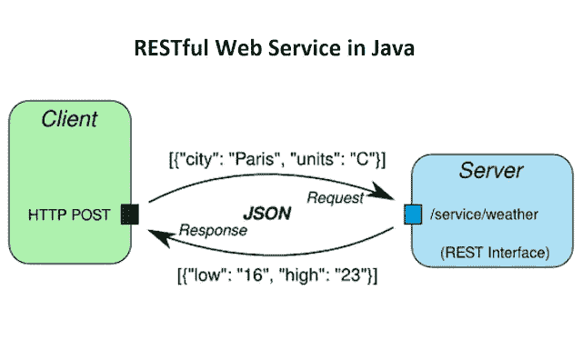
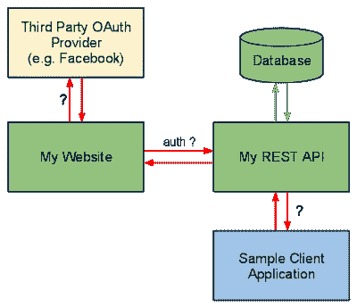

# Java 和 Spring 开发人员的 10 大 REST 面试问题

> 原文：<https://medium.com/javarevisited/top-10-rest-interview-questions-for-java-and-spring-developers-1611e3b78029?source=collection_archive---------0----------------------->

## 这些是 Java 和 Spring 开发者快速准备的最好的 REST 面试问题

大家好，如果你正在准备 Java 和 Spring 开发者面试，并且在寻找最好的 Spring REST 面试问题，那么你来对地方了。

前面我已经分享了 [**13 个 Spring 开发者访谈的必备话题**](/javarevisited/13-topics-you-should-prepare-for-your-next-spring-boot-interview-5f2993a04ff5) 以及很多关于 [Spring 框架](http://www.java67.com/2012/08/spring-interview-questions-answers.html)[Spring MVC](/javarevisited/21-spring-mvc-rest-interview-questions-answers-for-beginners-and-experienced-developers-21ad3d4c9b82)[Spring Security](https://javarevisited.blogspot.com/2021/02/spring-security-interview-questions-answers-java.html)[Spring Data JPA](https://www.java67.com/2021/01/spring-data-jpa-interview-questions-answers-java.html)[Spring AOP](https://javarevisited.blogspot.com/2021/03/spring-aop-interview-questions-answers.html#axzz6nwXUSoGH)[Spring Boo](https://javarevisited.blogspot.com/2020/05/top-20-spring-boot-interview-questions-answers.html)【t】[Spring Test](https://javarevisited.blogspot.com/2021/02/-spring-boot-testing-interview-questions-answers-java.html)[Hibernate](https://www.java67.com/2016/02/top-20-hibernate-interview-questions.html)[Spring Boot 执行器](https://www.java67.com/2021/02/spring-boot-actuator-interview-questions-answers-java.html)

虽然这不是一个全面的列表，但它涵盖了来自[Spring Professional certification guide](/javarevisited/spring-professional-certification-vmware-edu-1202-the-ultimate-guide-to-pass-spring-11dab8d311c3)的所有与 REST 相关的问题，并触及了重要且基本的 REST 概念。

如果你急着参加面试，你可以快速浏览一下剩下的问题，阅读和理解不会超过 5 分钟。

如果你有更多的时间，你也可以经常看看我的书 [**寻找春天的采访**](https://javinpaul.gumroad.com/l/hrUXKY?offer_code=friends20) ，在那里我讨论了 200 多个关于不同春天话题的问题。你也可以使用我的代码**朋友 20** 来获得 Java 面试书 20%的折扣。

顺便说一下，如果你是 spring 新手，并且正在寻找最好的 spring 课程来建立你的 Spring 概念，那么我强烈推荐你 Udemy 上的 [**Spring and Hibernate for 初学者(包括 Spring Boot)**](https://click.linksynergy.com/link?id=JVFxdTr9V80&offerid=323058.647428&type=2&murl=https%3A%2F%2Fwww.udemy.com%2Fspring-hibernate-tutorial%2F) 课程。这一门课程涵盖了春季、冬季和 Spring Boot 这三个季节。

# Java 和 Spring 开发人员的 11 个 REST 面试问题

为了不浪费更多的时间，这里列出了 Java 和 Spring 开发人员面试中常见的 REST 面试问题。这些问题测试您关于 REST API、REST 概念和 REST 架构知识。

到目前为止，我们已经看了关注于 Spring MVC 的 Spring 面试问题，现在我们将看到一些基于 REST 概念的问题，以及如何使用 Spring MVC 框架实现 RESTful web 服务。

## 1.休息代表什么？

REST 代表表述性状态传输，它使用 HTTP 协议将数据从客户机发送到服务器。服务器中的一本书可以使用 JSON 或 XML 交付给客户端。不过，如果你对 REST 不熟悉，建议你先查阅一下 [REST API 设计与开发](http://bit.ly/2zIGzWK)来更好地理解它。

## 2.什么是资源？

资源是数据在 REST 架构中的表示方式。通过将实体公开为资源，它允许客户端使用 HTTP 方法来读取、写入、修改和创建资源，例如， [GET](http://javarevisited.blogspot.sg/2012/03/get-post-method-in-http-and-https.html) ， [POST](http://www.java67.com/2014/08/difference-between-post-and-get-request.html) ， [PUT](http://www.java67.com/2016/09/when-to-use-put-or-post-in-restful-web-services.html) ，DELETE 等。

## 3.什么是安全休息操作？

REST API 使用 HTTP 方法来执行操作。一些不修改服务器端资源的 HTTP 操作被称为安全操作，包括 GET 和 HEAD。另一方面， [PUT](http://javarevisited.blogspot.sg/2016/10/difference-between-put-and-post-in-restful-web-service.html) ，POST 和 DELETE 是不安全的，因为它们修改了服务器上的资源。

## 4.什么是幂等运算？幂等性为什么重要？

有一些 HTTP 方法——比如 GET——不管使用多少次都会产生相同的响应，向同一个 [URI](http://www.java67.com/2013/01/difference-between-url-uri-and-urn.html) 发送多个 GET 请求会产生相同的响应，而没有任何副作用。因此，这被称为等幂。

另一方面， [POST 不是幂等的](http://javarevisited.blogspot.sg/2016/05/what-are-idempotent-and-safe-methods-of-HTTP-and-REST.html)，因为如果您发送多个 POST 请求，它将导致在服务器上创建多个资源，但是，同样，如果您使用 PUT 来更新资源，它也是幂等的。

甚至可以使用多个 PUT 请求来更新服务器上的资源，并且将给出相同的最终结果。你可以参加 Pluralsight 的[**HTTP Fundamentals**](http://pluralsight.pxf.io/c/1193463/424552/7490?u=https%3A%2F%2Fwww.pluralsight.com%2Fcourses%2Fxhttp-fund)课程，学习更多关于 HTTP 协议和一般 HTTP 的幂等方法。

<http://pluralsight.pxf.io/c/1193463/424552/7490?u=https%3A%2F%2Fwww.pluralsight.com%2Fcourses%2Fxhttp-fund>  

## 5.REST 是可伸缩的和/或可互操作的吗？

是的， [REST](http://javarevisited.blogspot.sg/2015/08/difference-between-soap-and-restfull-webservice-java.html) 具有可伸缩性和互操作性。它不要求在客户端或服务器端选择特定的技术。您可以使用 [Java](http://javarevisited.blogspot.sg/2017/11/top-5-free-java-courses-for-beginners.html) 、 [C++](http://www.java67.com/2018/02/5-free-cpp-courses-to-learn-programming.html) 、 [Python](http://www.java67.com/2018/02/5-free-python-online-courses-for-beginners.html) 或 [JavaScript](http://www.java67.com/2018/04/top-5-free-javascript-courses-to-learn.html) 来创建 RESTful web 服务，并在客户端消费它们。我建议你读一本关于 REST API 的好书，比如 [RESTful Web Services](http://javarevisited.blogspot.sg/2017/02/top-5-books-to-learn-rest-and-restful-web-services-in-java.html) 来学习更多关于 REST 的知识。

## 6.REST 使用了哪些 HTTP 方法？

REST 可以使用任何 HTTP 方法，但是最流行的方法是 GET 用于检索资源，POST 用于创建资源， [PUT 用于更新资源](http://javarevisited.blogspot.sg/2016/04/what-is-purpose-of-http-request-types-in-RESTful-web-service.html#axzz56WGunSwy)，DELETE 用于从服务器移除资源。

## 7.REST 通常是无状态的吗？([回答](http://javarevisited.blogspot.sg/2015/08/difference-between-soap-and-restfull-webservice-java.html))

是的，REST API 应该是无状态的，因为它是基于 HTTP 的，HTTP 也是无状态的。REST API 中的请求应该包含处理它所需的所有细节。

它不应该依赖于前一个或下一个请求或者服务器端维护的一些数据，比如会话。

REST 规范设置了一个约束，使其成为无状态的，在设计 REST API 时，您应该记住这一点。

## 8.成功删除语句的 HTTP 状态返回代码是什么？([回答](http://www.java67.com/2015/09/top-10-restful-web-service-interview-questions-answers.html))

成功删除后，REST API 应该返回什么状态代码并没有严格的规则。它可以返回 200 Ok 或 204 No Content。

一般来说，如果删除操作成功，响应体为空，返回 204。如果删除请求成功，并且响应正文不为空，则返回 200。

如果你想了解更多关于 REST API 的概念和标准，那么你也可以查看 Udemy 上的 [**REST API 设计、开发&管理** t](https://click.linksynergy.com/fs-bin/click?id=JVFxdTr9V80&subid=0&offerid=323058.1&type=10&tmpid=14538&RD_PARM1=https%3A%2F%2Fwww.udemy.com%2Frest-api%2F) 课程。

## 9.CRUD 是什么意思？(回答)

CRUD 是创建、读取、更新和删除的简称。在 REST API 中，POST 用于创建一个资源，GET 用于读取一个资源， [PUT](http://javarevisited.blogspot.sg/2016/10/difference-between-put-and-post-in-restful-web-service.html) 用于更新一个资源，DELETE 用于从服务器上删除一个资源。这是另一个[初级 Spring MVC 问题](https://javarevisited.blogspot.com/2018/11/top-20-spring-mvc-interview-questions-answers-for-java-developers.html)，在 1 到 3 年的经验丰富的程序员中很常见。

## 10.休息安全吗？你能做些什么来保护它？([回答](http://www.java67.com/2017/04/3-great-books-to-learn-java-web-services-soap-and-restful.html))

这个问题主要是由有 2 到 5 年 REST 和 Spring 经验的 Java 程序员提出的。安全是一个宽泛的术语；它可能意味着消息的安全性，这是通过使用身份验证和授权提供的加密或访问限制来提供的。

REST 通常是不安全的，但是您可以使用 Spring Security 来保护它。至少，您可以通过在 Spring 安全配置文件中使用 HTTP 来启用 HTTP 基本认证。类似地，如果底层服务器支持 HTTPS，您可以使用 [HTTPS](http://javarevisited.blogspot.sg/2013/07/how-ssl-https-and-certificates-works-in-java-web-application.html) 来公开您的 REST API。

## 11.REST 与传输层安全性(TLS)一起工作吗？([回答](http://javarevisited.blogspot.sg/2012/01/rest-web-services-framework-interview.html))

传输层安全性(TLS)用于客户端和服务器之间的安全通信。它是 SSL(安全套接字层)的后继者。由于 HTTPS 可以处理 SSL 和 TLS，REST 也可以处理 TLS。

实际上，在 REST 中，由服务器来实现安全协议。如果服务器支持 [SSL](http://javarevisited.blogspot.sg/2013/07/how-to-configure-https-ssl-in-tomcat-6-7-web-server-java.html#axzz56WXxxAC0) ，同样的 RESTful web 服务可以使用 HTTP 和 HTTPS 访问。

如果您正在使用 Tomcat，您可以了解更多关于如何在 Tomcat 中启用 SSL 的信息。

对于初学者和有经验的 Java JEE 开发人员来说，以上是一些常见的 Spring REST 面试问题。如果你要参加 VMware 的[Spring Professional Certification](http://javarevisited.blogspot.sg/2017/06/how-to-prepare-for-spring-framework-certifications.html)，这些问题对于复习关于 Spring REST 的知识也非常有用。

你可能喜欢的其他**春季教程和面试问题**

*   [Spring Boot +卡夫卡给初学者的例子](https://javarevisited.blogspot.com/2022/03/spring-boot-kafka-example-single-and-multiple-consumers.html)
*   [Java 中的 Spring Boot + Hibernate 示例](https://javarevisited.blogspot.com/2022/03/spring-boot-hibernate-example-for-java.html)
*   [如何在 Spring 中@Autowired 标注工作](https://javarevisited.blogspot.com/2022/03/how-autowiring-of-beans-works-in-spring.html)
*   [15 春季数据 JPA 面试问题及答案](https://www.java67.com/2021/01/spring-data-jpa-interview-questions-answers-java.html)
*   [Spring MVC 内部是如何工作的？](http://javarevisited.blogspot.sg/2017/06/how-spring-mvc-framework-works-web-flow.html)
*   [与 Spring Boot 一起学习微服务的 10 大课程](/javarevisited/10-best-java-microservices-courses-with-spring-boot-and-spring-cloud-6d04556bdfed)
*   [如何用 Spring Boot 记录 SQL 语句？](https://javarevisited.blogspot.com/2022/02/how-to-log-sql-statements-in-spring.html)
*   [初学者的 10 个最佳 Spring 框架课程](/javarevisited/10-best-online-courses-to-learn-spring-framework-in-2020-f7f73599c2fd)
*   [Java 开发人员 20+ Spring Boot 面试问题](https://javarevisited.blogspot.com/2020/05/top-20-spring-boot-interview-questions-answers.html)
*   [Java 中的 Spring Boot + REST API 示例](https://javarevisited.blogspot.com/2022/02/spring-boot-restful-web-service-example-tutorial.html)
*   [15 大微服务面试问题及答案](https://www.java67.com/2021/02/microservices-interview-questions-answers-java-spring.html)
*   如何在 Java web 应用程序中启用 Spring 安全性？
*   [13 Spring Boot 致动器面试问题](https://www.java67.com/2021/02/spring-boot-actuator-interview-questions-answers-java.html)
*   [如何修复春季没有资格比恩的错误](https://javarevisited.blogspot.com/2022/02/how-to-fix-autowired-no-qualifying-bean.html)
*   [15 春云面试问题与答案](https://www.java67.com/2021/01/spring-cloud-interview-questions-with-answers-java.html)
*   [20 道 Spring Boot 测试面试问题及答案](https://javarevisited.blogspot.com/2020/05/top-20-spring-boot-interview-questions-answers.html)
*   [为有经验的开发人员开设的 10 门高级 Spring Boot 课程](/javarevisited/10-advanced-spring-boot-courses-for-experienced-java-developers-5e57606816bd)
*   [学习 Spring Batch for Java 的 5 门最佳课程](https://javarevisited.blogspot.com/2022/02/top-5-courses-to-learn-spring-batch-for.html)
*   [17 春季 AOP 面试问题及答案](https://javarevisited.blogspot.com/2021/03/spring-aop-interview-questions-answers.html#axzz6nwXUSoGH)
*   [如何在 Spring 控制器中获取 ServletContext 对象](http://javarevisited.blogspot.sg/2012/03/how-to-get-servletcontext-in-servlet.html)
*   [Spring MVC 中@RestController 和@Controller 的区别？](http://javarevisited.blogspot.sg/2017/08/difference-between-restcontroller-and-controller-annotations-spring-mvc-rest.html)

感谢您阅读本文。如果你喜欢这些春假面试问题，那么请与你的朋友和同事分享。如果您有任何问题或疑问，请随时提问。很乐意回答你的任何问题。

**附言——**如果你是春天的新手，正在寻找最好的春天课程来建立你的春天概念，那么我强烈推荐你 Udemy 上的 [**初学春天和冬眠(包括 Spring Boot)**](https://click.linksynergy.com/link?id=JVFxdTr9V80&offerid=323058.647428&type=2&murl=https%3A%2F%2Fwww.udemy.com%2Fspring-hibernate-tutorial%2F) 课程。这一门课程涵盖了春季、冬季和 Spring Boot 这三个季节。

</javarevisited/8-best-spring-and-hibernate-training-courses-for-java-developers-acf09aa0e244> 