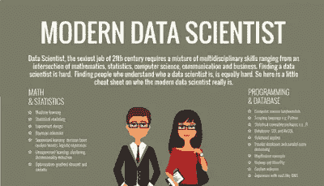
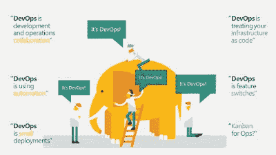
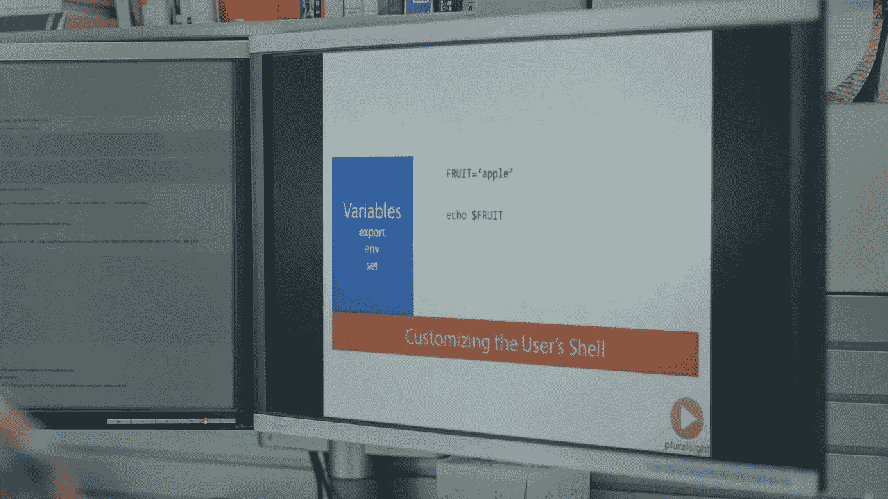

# 2023 年你可以瞄准更高薪水的 10 个高薪技术工作

> 原文：<https://medium.com/javarevisited/top-10-technology-jobs-for-programmers-and-it-professionals-c10784090031?source=collection_archive---------1----------------------->

## 这些是你可以在 2023 年瞄准的工作，可以提高你的工资，给你的职业生涯一个推动。

在 [Unsplash](https://unsplash.com?utm_source=medium&utm_medium=referral) 上由 [Austin Distel](https://unsplash.com/@austindistel?utm_source=medium&utm_medium=referral) 拍摄的照片

如果你是一名计算机科学毕业生，或者是想在软件开发领域发展的人，或者是一名有经验的程序员，正在考虑他的下一步职业发展，但不确定你应该去哪个领域，那么你来对地方了。在这篇文章中，我将告诉你你可以瞄准的**十大高薪技术工作**。

你所需要的只是一些编程经验和学习热情。尤其是机器学习和数据科学领域，对于初学者和有经验的程序员来说都非常有前途。

平均而言，机器学习专家和数据科学家的收入在 11 万到 12 万美元之间，对他们的需求很大，如果你对解决现实世界的问题感兴趣，他们会提供一个令人兴奋的机会。

> 作为人类，我们总是对程序员和技术人员的工资感到好奇。开发人员抱怨 QA 的薪水比他们高，QA 的人说开发人员的薪水比他们高。

也有可能坐在你旁边的程序员会比你得到更多，即使他经验更少。软件开发行业就是这样，工资没有标准规则。

事实上，有更多的例外，但一些技术专家比其他人支付更多也是事实。

我过去常常在与招聘人员和招聘经理进行谈判之前查看 Glassdoor，了解特定技术领域特定职位的平均工资，但老实说，他们并不像你想象的那么准确。他们充其量提供了一个好的基线和一个想法，仅此而已。

相反，我比任何人都更信任 StackOverflow 开发人员调查数据。我一直在查看他们上周的结果，我已经了解了很多关于当前世界流行的[技术](http://www.java67.com/2018/01/top-10-web-mobile-and-big-data-framework-libraries-technologies-programmers-should-learn-in-2018.html)、[框架](http://javarevisited.blogspot.sg/2018/01/10-frameworks-java-and-web-developers-should-learn.html)、[库](http://javarevisited.blogspot.sg/2018/01/top-20-libraries-and-apis-for-java-programmers.html)和[编程语言](http://javarevisited.blogspot.sg/2015/07/5-programming-language-every-programmer-learn.html)的事情，这篇文章将关注你可以将职业生涯提升到一个新水平的高薪工作。

# 程序员和软件工程师的 10 大高薪技术工作

这是我列出的薪酬最高的技术工作，包括机器学习专家、 [DevOps 专家、](http://www.java67.com/2018/02/5-free-docker-courses-for-java-and-DevOps-engineers.html)、 [Web 开发人员、](http://javarevisited.blogspot.sg/2018/01/10-frameworks-java-and-web-developers-should-learn.html)、[数据库管理员、](https://javarevisited.blogspot.com/2018/05/top-5-sql-and-database-courses-to-learn-online.html)、系统管理员、移动开发人员、图形设计师、QA 工程师和其他软件技术专业人员。

## 1.机器学习专家

在美国，机器学习专家的平均工资约为 108，000 美元，是各种技术工作中最高的。

许多初创公司，如优步和大型科技公司，如[谷歌](https://javarevisited.blogspot.com/2012/01/google-interview-questions-answers-top.html)和[微软](https://javarevisited.blogspot.com/2015/12/30-microsoft-interview-questions-for-software-development-engineers.html)正在寻找机器学习专家来支持最新的创新，如无人驾驶汽车。

老实说，这是一个研究和编程完美结合的领域，我将在这方面花很多时间。

如果你想成为机器学习专家，建议你通过 [**机器学习使用 Python 和 R 课程**](https://click.linksynergy.com/fs-bin/click?id=JVFxdTr9V80&subid=0&offerid=323058.1&type=10&tmpid=14538&RD_PARM1=https%3A%2F%2Fwww.udemy.com%2Fmachinelearning%2F) **。**它全面概述了机器学习技术。

## 2.具有统计学和数学背景的开发人员

在当今以数据为导向的世界中，具有良好的统计和数学背景的人将会很受欢迎，这一点在本次调查中也很明显。

这是美国收入第二高的工作。具有统计或数学背景的开发人员的平均工资约为 101，000 美元，我相信在未来几年这一数字还会增长。

如果你从事数据分析行业，那么提高你的统计和数学技能也会对你的职业生涯有很大帮助。如果你想提高你的统计和数学以获得这份工作，我建议你加入 Coursera 和 Pluralsight 上的 [**数据科学和商业分析统计**](https://click.linksynergy.com/deeplink?id=JVFxdTr9V80&mid=39197&murl=https%3A%2F%2Fwww.udemy.com%2Fcourse%2Fstatistics-for-data-science-and-business-analysis%2F) **和** [**统计基础:理解概率和分布。**](https://pluralsight.pxf.io/c/1193463/424552/7490?u=https%3A%2F%2Fwww.pluralsight.com%2Fcourses%2Fstatistics-foundations-probability-distributions)

<https://click.linksynergy.com/deeplink?id=JVFxdTr9V80&mid=39197&murl=https%3A%2F%2Fwww.udemy.com%2Fcourse%2Fstatistics-for-data-science-and-business-analysis%2F>  <https://pluralsight.pxf.io/c/1193463/424552/7490?u=https%3A%2F%2Fwww.pluralsight.com%2Fcourses%2Fstatistics-foundations-probability-distributions>  

## 3.数据科学家

被大肆宣传的数据科学工作在高薪工作中排名第三。它被吹捧为这十年来最令人兴奋的工作之一，既有令人兴奋的工作，又有令人难以置信的报酬。

数据科学家的平均工资约为 100，000 美元，如果你与应用程序开发人员(如 Java 开发人员)相比，这是非常不错的，这也是我的许多朋友从在线课程学习数据科学以转向更有回报的数据科学家职业的原因。

如果你也有同样的情况，我建议你查看 Udemy 上的 [**数据科学课程**](https://click.linksynergy.com/fs-bin/click?id=JVFxdTr9V80&subid=0&offerid=323058.1&type=10&tmpid=14538&RD_PARM1=https%3A%2F%2Fwww.udemy.com%2Fdatascience%2F) ，了解如何成为一名数据科学家。它还很好地概述了学习数据科学并在这个利润丰厚的领域找到工作需要什么。

如果你需要更多的选择，如果你不介意从免费资源中学习，那么你也可以查看这个[数据科学和机器学习课程](https://javarevisited.blogspot.com/2018/03/top-5-data-science-and-machine-learning-online-courses-to-learn-online.html)的列表。

## 4.DevOps 专家

这是另一个令人兴奋的职业，尤其是对有经验的程序员来说。非常需要更加注重自动化的 DevOps 专家。

DevOps 运动的主要特征是强烈提倡从集成、测试到部署的软件开发的所有步骤的自动化和监控。

全球 DevOps 专家的平均工资约为 10 万美元，是各种编程工作中最高的。

如果你想成为一名 DevOps 专家，那么使用管道和 Udemy 上的 Docker 与 Jenkins 一起学习 DevOps: CI/CD 是一个很好的起点。Udemy 现在也在销售，你只需花 10.99 美元就可以获得这门课程，几乎是免费的。

如果你需要更多的选择，你也可以看看我列出的 [10 个 DevOps 课程给有经验的开发者](https://javarevisited.blogspot.com/2018/09/10-devops-courses-for-experienced-java-developers.html)。

## 5.嵌入式应用开发人员

这是一个非常专业的工作，但似乎对在嵌入式 Linux 和嵌入式 c 语言方面有丰富开发经验的程序员有很好的需求。

在美国，嵌入式应用/设备开发人员的平均工资是 10 万美元，这是第四高工资的工作。

如果你对嵌入式软件开发有兴趣，我建议你通过 [**掌握微控制器与嵌入式驱动开发**](https://click.linksynergy.com/fs-bin/click?id=JVFxdTr9V80&subid=0&offerid=323058.1&type=10&tmpid=14538&RD_PARM1=https%3A%2F%2Fwww.udemy.com%2Fmastering-microcontroller-with-peripheral-driver-development%2F) 课程来了解更多关于这个领域的知识。

## 6.移动应用开发者

在美国，移动开发人员的平均工资约为 95，000 美元，高于网络开发人员，但低于数据科学家和开发专家。

如果你想成为一名移动开发者，那么根据你的背景，你可以学习 Android 或者 iOS。我建议 Java 开发者用 Android，C/C++开发者用 iOS。

如果你决定学习 Android，你可以在 Udemy 上查看[**完整的 Android N 开发者课程**](https://click.linksynergy.com/fs-bin/click?id=JVFxdTr9V80&subid=0&offerid=323058.1&type=10&tmpid=14538&RD_PARM1=https%3A%2F%2Fwww.udemy.com%2Fcomplete-android-n-developer-course%2F) 如果你想成为世界级的 iOS 开发者，我建议你看看 Udemy 的这个 [**iOS 13 和 Swift 5 大师班**](https://click.linksynergy.com/deeplink?id=JVFxdTr9V80&mid=39197&murl=https%3A%2F%2Fwww.udemy.com%2Fcourse%2Fios-13-app-development-bootcamp%2F) 课程。

## 7.图形编程

这是你在技术领域能找到的最安全的工作之一，因为你的团队总是需要一个图形程序员。

美国一个图形程序员的平均工资在 93000 美元左右，相比 [Java](https://javarevisited.blogspot.com/2017/12/10-things-java-programmers-should-learn.html#axzz53ENLS1RB) 或者 [Web 开发者](https://hackernoon.com/12-frameworks-java-web-developers-should-learn-in-2018-edae59315244)已经很不错了。

不幸的是，学习图形编程需要付出大量的努力:需要积累大量的背景知识(尤其是数学知识)，需要投入大量的编程实践时间，还需要学习大量的图形技术，这每年都会增加新的、更为复杂的层次。

无论如何，如果你想成为一名图形程序员，那么你可以加入图形编程大师班。

## 8.桌面应用开发人员

如果你认为 Web 已经扼杀了桌面应用程序的开发，那你就错了，它们仍然生机勃勃。

在美国，一名桌面应用程序开发人员的平均收入约为 92，000 美元，高于网络开发人员的平均工资。

如果你热爱桌面应用编程，想成为一名桌面应用开发者，我建议你加入这个课程。

## 9.系统管理员

我一直认为系统管理员或系统管理员的工资比应用程序开发人员高，但事实并非如此。

根据这项调查，系统管理员和网站开发人员的收入是一样的。

美国一个系统管理员的平均工资在 9 万美元左右，和一个 Web 开发人员差不多。

如果你有兴趣成为一名系统管理员，尤其是 Linux 系统管理员，那么我建议你参加 Pluralsight 网站上的 [**Linux 系统管理基础**](https://pluralsight.pxf.io/c/1193463/424552/7490?u=https%3A%2F%2Fwww.pluralsight.com%2Fcourses%2Flinux-system-administration-fundamentals) 课程。从 Linux 中的系统管理开始是一门极好的课程。

顺便说一句，你需要一个 [**Pluralsight 会员**](https://pluralsight.pxf.io/c/1193463/424552/7490?u=https%3A%2F%2Fwww.pluralsight.com%2Fpricing) 才能加入这个课程，费用大约是每月 29 美元，每年 299 美元(14%的折扣)，但它完全值得。另类。你也可以使用他们的 [**10 天免费试用**](https://pluralsight.pxf.io/c/1193463/424552/7490?u=https%3A%2F%2Fwww.pluralsight.com%2Flearn) 免费观看本课程。

## 10.Web 开发人员

最后，使用最新技术如 [Angular](http://www.java67.com/2018/01/top-5-free-angular-js-online-courses-for-web-developers.html) 、 [React](https://javarevisited.blogspot.com/2018/08/top-5-react-js-and-redux-courses-to-learn-online.html) 以及古老技术如 [Ruby](http://www.java67.com/2018/02/5-free-ruby-and-rails-courses-to-learn-online.html) 和 [PHP](http://www.java67.com/2018/02/5-free-php-and-mysql-courses-for-web-developers.html) 的 Web 开发人员。

在美国，网页开发人员的平均工资约为 90，000 美元，高于数据库管理员、质量保证员和图形设计师，但低于 Linux 和 Windows 系统管理员和数据科学家。

如果你想学习网页开发并成为一名网页开发者，那么 [**网页开发者训练营**](https://click.linksynergy.com/fs-bin/click?id=JVFxdTr9V80&subid=0&offerid=323058.1&type=10&tmpid=14538&RD_PARM1=https%3A%2F%2Fwww.udemy.com%2Fthe-web-developer-bootcamp%2F) 是一个很好的地方。

## 11.数据库管理员或 DBA

DBA 是传统的工作之一，有很多工作保障，没有太多学习挑战。

在美国，数据库管理员的平均工资约为 85，000 美元，预计低于 Web 开发人员，但高于 QA 工程师和图形设计师。

如果你想了解更多关于数据库管理的知识，建议你通过 [**Oracle DBA 11g/12c —初级 DBA 数据库管理**](https://click.linksynergy.com/fs-bin/click?id=JVFxdTr9V80&subid=0&offerid=323058.1&type=10&tmpid=14538&RD_PARM1=https%3A%2F%2Fwww.udemy.com%2Foracledbatraining%2F) **。**

这将教你如何在 6 周内成为一名 Oracle 数据库管理员(DBA)，并作为初级 DBA 获得一份高薪工作。

## 12.质量保证工程师(QA)

QA 工程师的平均工资约为 85，000 美元，在许多地理位置高于平面设计师和移动开发人员，但在美国，他们仅高于平面设计师。

同样是开发人员的 QA 工程师往往比那些只做手工测试的人挣得更多。

我认识几个 QA 人员，他们有一些自动化测试经验，知道他们的工具，比如 Selenium 和 making good money。

因此，如果你是一名 QA 工程师，我强烈建议你转向自动化测试，至少学习 Selenium，**[**Selenium master class**](https://click.linksynergy.com/fs-bin/click?id=JVFxdTr9V80&subid=0&offerid=323058.1&type=10&tmpid=14538&RD_PARM1=https%3A%2F%2Fwww.udemy.com%2Fselenium-with-c%2F)是一个很好的起点。**

****

## **13.美术设计员**

**美国图形设计师的平均工资约为 70，00 美元，与数据科学家和 DevOps 专家相比并不算高，但对图形设计师的需求总是存在的。**

**如果你有一些平面设计技能，那么你也可以做很多报酬不错的在线工作。**

**如果你想成为一名平面设计师，那么我建议你参加 Udemy 上的 [**成为一名专业平面设计师**](https://click.linksynergy.com/fs-bin/click?id=JVFxdTr9V80&subid=0&offerid=323058.1&type=10&tmpid=14538&RD_PARM1=https%3A%2F%2Fwww.udemy.com%2Fbecome-a-professional-graphic-designer-udemy%2F) 课程。它会教你如何打入平面设计的世界。**

****

**该列表的灵感来自于 [Stack Overflow 的开发者调查](https://insights.stackoverflow.com/survey/2019)，该调查提供了对软件行业总体情况的深刻见解，我强烈建议您参与 Stack Overflow 调查并提供您的意见。通过这种方式，我们不仅可以帮助他人，还可以了解哪些因素有助于做出正确的职业决策。**

**以上是关于**薪酬最高的编程工作**的全部内容。对于那些正在考虑跳槽并希望探索更多令人兴奋的领域(如 [DevOps](https://javarevisited.blogspot.com/2018/09/the-2018-devops-roadmap-your-guide-to-become-DevOps-Engineer.html) 、[机器学习](https://dev.to/javinpaul/10-data-science-and-machine-learning-courses-for-programmers-looking-to-switch-career-57kd)和[数据科学](https://dev.to/javinpaul/top-online-courses-to-learn-data-science-and-machine-learning-for-beginners-best-of-lot-37k8))的程序员来说，这是一个很好的列表。**

**DevOps 和机器学习专家以及数据科学家往往拥有全球最高的薪酬，如果你今年考虑薪酬，这些可能是你应该瞄准的工作。**

**其他**编程文章**你可能喜欢的
[2023 年 Java 开发者路线图](https://javarevisited.blogspot.com/2019/10/the-java-developer-roadmap.html#123)
[2023 年学习 Python 的 10 个理由](https://javarevisited.blogspot.com/2018/05/10-reasons-to-learn-python-programming.html)
[2023 年你可以学习的 10 种编程语言](http://www.java67.com/2017/12/10-programming-languages-to-learn-in.html)
[10 个工具每个 Java 开发者都应该知道的](http://www.java67.com/2018/04/10-tools-java-developers-should-learn.html)
[学习 Java 编程语言的 10 个理由](http://javarevisited.blogspot.sg/2013/04/10-reasons-to-learn-java-programming.html)
[Java 和 Web 开发者应该学习的 10 个框架](http://javarevisited.blogspot.sg/2018/01/10-frameworks-java-and-web-developers-should-learn.html)

[2023 年要学习的 5 大 Java 框架](http://javarevisited.blogspot.sg/2018/04/top-5-java-frameworks-to-learn-in-2018_27.html)
[每个 Java 开发者都应该知道的 10 个测试库](https://javarevisited.blogspot.sg/2018/01/10-unit-testing-and-integration-tools-for-java-programmers.html)**

**感谢您阅读本文。如果你喜欢这篇文章，请与你的朋友和同事分享。如果您有任何问题或反馈，请留言。**

**</javarevisited/what-java-programmers-should-learn-in-2020-648050533c83> **