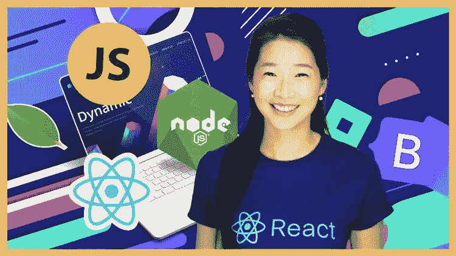
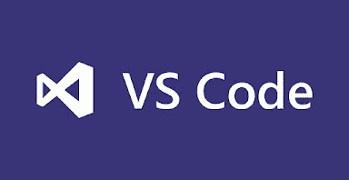
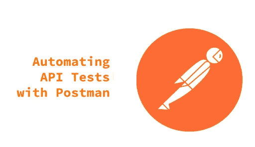
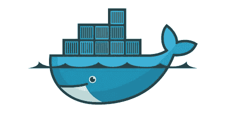
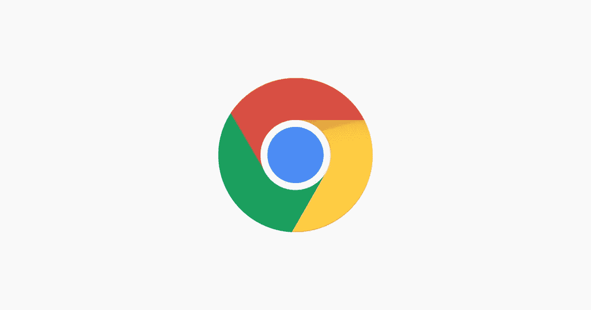
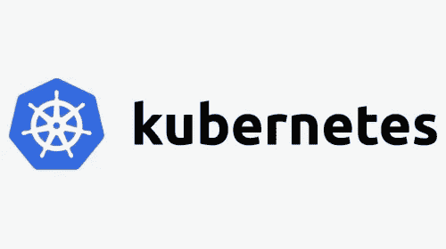
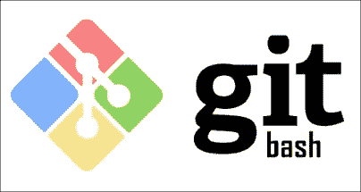

# Fullstack Web 开发人员 2023 年应该学习的 10 大工具

> 原文：<https://medium.com/javarevisited/top-10-tools-fullstack-web-developer-should-learn-14635386be63?source=collection_archive---------0----------------------->

## 这些是每个 web 开发人员在 2023 年可以学习的最好的工具，以便成为更好、更有能力的开发人员。该列表包括面向全栈开发人员的更好的设计、编码和调试工具。

image_creit — Educative.io

大家好，如果你正在寻找学习 web 开发的最佳工具，那么你来对地方了。前面我已经分享了 [**最佳 web 开发课程**](/javarevisited/10-best-java-full-stack-web-development-courses-to-join-in-2020-6cd6cd2e5868) 和 [**最佳 web 开发框架**](/javarevisited/10-of-the-most-popular-javascript-frameworks-libraries-for-web-development-in-2019-a2c8cea68094) 在这篇文章中，我准备分享 2023 年每个开发者可以学习的最佳 web 开发工具。

有一句很流行的话，工匠和他的工具一样好，这同样适用于 Web 开发人员。如果你不知道你的工具，你会在日常工作中挣扎。同时，很好地了解你的工具可以提高你的生产力，帮助你成为团队中的明星开发者。

这就是为什么我总是在寻找能让我的开发者生活变得简单的新工具。早些时候，我已经分享了 Java 开发人员的最佳工具，在这篇文章中，我将分享一些对 Web 开发人员最重要的工具，包括前端和后端开发人员。

这些是我在日常生活中使用的工具，很有可能你已经熟悉了其中的大部分，这很好。

这里的要点是学习更多关于这些工具的知识，这样你就可以有效地使用它们，并把你的 Web 开发技能提高到一个新的水平。网上也有很多关于 web 开发工具和技术的文章，但是大部分都是像 [JavaScript 框架](https://javarevisited.blogspot.com/2019/01/10-web-development-frameworks-fullstack-developer-should-learn.html)和[库](https://www.java67.com/2019/01/top-10-javascript-frameworks-and-libraries-for-web-developers.html)这样的非实用信息，日常生活中并不需要。

在当今世界，我们真的很幸运拥有这些强大的工具，它们可以在开发、测试、调试、部署甚至扩展您的应用程序时节省大量时间。

我来的时候，IE 浏览器上的“查看源代码”和“T2”是我们基于浏览器调试的唯一来源。今天，你有强大的工具，如 Chrome Developer Tool 和 Firebug。

如果你想在 2023 年成为一名更好的 **Fullstack Web 开发人员**，并准备提升你的技能，学习这些工具将对提高你的技能和生产力大有帮助。我还分享了学习这些工具的最佳资源和在线课程，您可以使用它们进行进一步的学习。

顺便说一句，如果你刚开始学习 web 开发，并且需要一门综合课程，在这门课程中，你不仅可以学习这些工具，还可以以一种有指导和结构化的方式学习整个 web 开发，那么我强烈推荐你参加 Udemy 上 Angela Yu 的 2023 Web 开发训练营 课程。这确实是一门在 2023 年学习 web 开发的专业课，但也是一门负担得起的课程。

# 2023 年，每个前端和后端开发人员都应该学习的 10 多种工具

我最初计划只分享 10 个工具，但是列表变大了，我又在列表中添加了两个工具。老实说，有更多的工具和每种工具的替代品可用，但学习所有这些工具是不可能的，这根本不实际，因此从每个类别中只学习一种工具，如 [IDE](https://javarevisited.blogspot.com/2018/09/top-5-courses-to-learn-intellij-idea-java-and-android-development.html#axzz6A8Vy1sea) 、[测试工具](https://javarevisited.blogspot.com/2018/01/10-unit-testing-and-integration-tools-for-java-programmers.html#axzz6j8KhisSX)、调试工具和[容器](https://javarevisited.blogspot.com/2020/11/why-devops-engineer-learn-docker-kubernetes.html#axzz6dXsEfLvJ)就足够了。

无论如何，如果你遇到任何其他方便的工具，可以真正提高 Web 开发人员的生产力，请随时与我们分享，我会把它添加到这个列表中。

不再浪费你的时间，这里是我列出的前端和后端开发人员在 2023 年需要学习的一些最重要的工具:

## 1.VS Code[web 开发人员的最佳编码工具+IDE]

这是 2023 年网络开发者最重要的工具。我从事 web 开发已经很长时间了，并且使用过很多 ide 和编辑器，比如 Atom、Sublime、 [Eclipse](/javarevisited/6-free-best-eclipse-ide-courses-for-java-programmers-1229ee9e5d87) 和 [IntelliJ IDEA](/javarevisited/7-best-courses-to-learn-intellij-idea-for-beginners-and-experienced-java-programmers-2e9aa9bb0c05) ，但是 VS 代码是另外一回事。

它既轻便又强大。最初，它有一个基本的特性，但是你可以通过下载扩展来定制它。

有如此多的 VS 扩展可用，从调试、连接到 git、部署到云中，比如 Azure 和 AWS，等等。

你很有可能已经熟悉 VS 代码，但如果你不熟悉，我强烈建议你在 2023 年学习 VS 代码，如果你需要教程或课程，我建议你查看 Udemy 上的 [**Visual Studio 代码教程——VS 代码入门**](https://click.linksynergy.com/deeplink?id=CuIbQrBnhiw&mid=39197&murl=https%3A%2F%2Fwww.udemy.com%2Fcourse%2Fvisual-studio-code-tutorial%2F) 课程了解更多细节。

## 2.postman[web 开发人员的最佳 API 测试工具]

现代 Web 开发都是关于 API 的，而 Postman 是与这些 API 进行交互的一个很好的工具。在开发过程中，如果您想熟悉第三方库，您可以使用 Postman 与它进行交互，就像您可以发送 get 和 POST 请求、设置请求头、检查响应头和其他 HTTP 元数据一样。

Postman 对于 REST API 测试也非常有用，这就是为什么它是前端和后端开发人员的必备工具。我强烈建议你在 2023 年学习 Postman，如果你需要资源，我会建议你查看 Valentine Despa 的这本[**Postman:The Complete Guide—REST API Testing on Udemy**](https://click.linksynergy.com/deeplink?id=CuIbQrBnhiw&mid=39197&murl=https%3A%2F%2Fwww.udemy.com%2Fcourse%2Fpostman-the-complete-guide%2F)。

## 3.docker[web 开发者的最佳开发工具]

容器对于现代 web 开发人员来说是必不可少的。容器不仅使开发更容易，而且使部署更顺畅。您不用单独部署应用程序及其依赖项，而是部署一个容器，这样更易于管理和扩展。

而且，如果不谈论 Docker，任何关于容器的讨论都是不完整的。

它是最受开发人员欢迎的容器平台之一，也是 Web 开发人员的必备工具。

无论你是前端开发人员还是后端极客，我强烈建议你在 2023 年学习 Docker，如果你需要资源，Udemy 上 AcadMind 的马克西米利安·施瓦茨穆勒的《Docker & Kubernetes:实用指南 是最好的开始课程。

## 4.Chrome 开发者工具 web 开发者的最佳调试工具]

这是 Web 开发人员的另一个重要工具。它让您看到浏览器中正在发生什么。通过使用 Chrome 开发工具，你可以检查不同的 HTML 元素，可以使用 CSS，也可以检查 JavaScript。

它还可以让您看到更多关于下载脚本、网络连接等的详细信息。对于基于浏览器的调试来说，这是一个很好的工具，特别是对于前端开发人员，你应该在 2023 年学习它。

如果您需要教程或课程，请查看 Udemy 上的 [**DevTools 课程以了解更多信息。如果你需要一个替代品，Firebox 有 firebug，这也是一个在浏览器中调试网页的好工具。**](https://click.linksynergy.com/deeplink?id=CuIbQrBnhiw&mid=39197&murl=https%3A%2F%2Fwww.udemy.com%2Fcourse%2Fmaster-google-chrome-developer-tools%2F)

## 5.NPM —节点包管理器 web 开发人员的最佳构建工具]

NPM 代表节点包管理器，它是网络开发者最重要的工具。在进行 web 开发项目时，您需要使用和导入许多其他 JavaScript 框架和库，如用于 UI 的 [React.js](https://javarevisited.blogspot.com/2018/08/top-5-react-js-and-redux-courses-to-learn-online.html#axzz5r06B3egD) ，用于前端的 [Vue.js](https://javarevisited.blogspot.com/2019/08/top-5-online-courses-to-learn-vue.js-best.html#axzz6gKWXwaTQ) ，用于单元测试的 Jest 库等等。NPM 可以为你做这些。

它将模块放在适当的位置，以便节点可以找到它们，并智能地管理依赖冲突。最常见的是，它用于发布、发现、安装和开发节点程序。运行 npm 帮助以获取可用命令的列表。

如果想进一步了解 NPM，还可以在 Udemy 上查看波格丹一世·斯塔什丘克的 [**了解 NPM — Node.js 包经理课程**](https://javarevisited.blogspot.com/2021/06/Understanding NPM - Node.js Package Manager) 。这是一门很好的课程，可以详细了解 NPM 或节点包管理器。

## 6.kubernetes[web 开发者的最佳部署工具]

当我们谈到容器和 Docker 时，Kubernetes 也参与进来，因为它可以帮助您管理容器。

最初部署一个或两个容器很容易，但是当应用程序增长并且需要更多实例时，手动部署数百个容器就变得很困难。

创建新的容器和去掉不用的容器也变得令人头疼，这时 Kubernetes 来拯救你了。这是一个容器管理工具，可以为您创建、扩展和管理容器。

除了 Docker，我强烈建议你学习 Kubernetes，如果你需要资源，我会推荐 Udemy 上 Stephen Grider 的 [**Docker 和 Kubernetes 完全指南**](https://click.linksynergy.com/deeplink?id=CuIbQrBnhiw&mid=39197&murl=https%3A%2F%2Fwww.udemy.com%2Fcourse%2Fdocker-and-kubernetes-the-complete-guide%2F) 课程。

## 7.git bash[web 开发人员的最佳 git 工具]

网上有很多 git 客户端，包括 GUI 和命令行，但是如果你使用 Windows 并且喜欢命令行，那么没有比 Gitbash 更好的了。

尽管 [VS Code](https://javarevisited.blogspot.com/2021/05/favorite-courses-to-learn-visual-studio-code-f.html#axzz6uq12fuKh) 和其他 ide 已经提供了 Github 集成，但有时您更喜欢在命令行中工作，尤其是当您提交大量代码或者合并来自不同分支的变更时。

在 Linux 中，执行所有这些 git 命令很容易，但在 Windows 中，这有点挑战性，这就是 Gitbash 的帮助所在。如果你想了解更多关于 Git 和 Github 的知识，那么你也可以看看 Udemy 上我最喜欢的导师之一柯尔特·斯蒂尔教授的新的 Git boot camp 课程。

## 8.web pack[web 开发者的最佳打包工具]

Webpack 是一个构建工具，它将您的所有资产，包括 Javascript、图像、字体和 [CSS](/javarevisited/10-best-css-online-courses-for-beginners-and-experienced-developers-54aa2e8c0253) 放在一个依赖图中。

Webpack 允许您在源代码中使用 `require()`来指向本地文件，比如图像，并决定如何在最终的 Javascript 包中处理它们，比如用指向 CDN 的 URL 替换路径。

如果你正在构建一个复杂的前端应用程序，包含许多非代码静态资产，如 CSS、图像、字体等，那么是的，Webpack 会给你带来很大的好处。

如果你想了解更多，我建议你在 Udemy 上查看一下 [**Webpack 5:初学者完全指南**](https://click.linksynergy.com/deeplink?id=CuIbQrBnhiw&mid=39197&murl=https%3A%2F%2Fwww.udemy.com%2Fcourse%2Fwebpack-from-beginner-to-advanced%2F) 。这是一个学习 WebPack、Bable、NPM 和 Node 的好课程。

## 9.jasmine[web 开发人员的最佳测试工具]

Jasmine 是一个用户行为模仿器，允许你在你的网站上执行类似用户行为的测试用例。Jasmine 对于测试不同分辨率下 UI 的可见性、点击清晰度以及响应性非常有用。

Jasmine 允许通过海关延迟和等待时间来模拟实际的用户行为，从而实现用户行为的自动化。如果你想了解更多，请查看 Udemy 上的这个精彩的 [**单元，用 Jasmine**](https://click.linksynergy.com/deeplink?id=CuIbQrBnhiw&mid=39197&murl=https%3A%2F%2Fwww.udemy.com%2Fcourse%2Funit-testing-your-javascript-with-jasmine%2F) 测试你的 Javascript。

## 10.[Jenkins](https://www.jenkins.io/)【web 开发者最佳 CI/CD 工具】

如今，几乎没有任何公司或组织在其软件开发生命周期( [SDLC](/javarevisited/6-best-sdlc-courses-for-beginners-and-experienced-programmers-devops-and-project-managers-b8242c04d761) )过程中不使用 DevOps 和 CI/CD，而 Jenkins 就是 CI/CD 工具之王。

作为一名 Web 开发人员，熟悉 Jenkins 并了解 Jenkins 管道的工作原理以及如何为您的项目建立管道是非常重要的。

如果你想更多地了解詹金斯和 DevOps，我建议你看看 Udemy 上的这个 [**詹金斯，从零到英雄:成为 DevOps 詹金斯大师**](https://click.linksynergy.com/deeplink?id=CuIbQrBnhiw&mid=39197&murl=https%3A%2F%2Fwww.udemy.com%2Fcourse%2Fjenkins-from-zero-to-hero%2F) 课程。对于想要深入了解 Jenkins 的 web 开发人员和 DevOps 工程师来说，这都是一门很棒的课程。

## 11.云(AWS、Azure 或 GCP)[web 开发人员的最佳云工具

你们中的许多人已经熟悉云和云计算平台，如 [AWS](https://javarevisited.blogspot.com/2020/05/top-5-amazon-web-services-aws-courses-for-beginners-and-experienced-programmers.html) (亚马逊网络服务)[微软的 Azure](https://javarevisited.blogspot.com/2020/02/top-5-AZ-900-exam-Azure-Fundamentals-certification-practice-tests-and-mock-exams-to.html#axzz6iNNhKZui) 和 GCP ( [谷歌云平台](https://javarevisited.blogspot.com/2019/07/top-5-google-cloud-platform-gcp-courses-certifications-online.html))，如果你不熟悉，请确保学习其中的一种。

理想情况下，你应该了解你的公司正在采用的方法。例如，如果你的公司正在投资微软 Azure，你应该通过率先将你的项目迁移到云中来学会在你的团队和公司中脱颖而出。

同样，如果你的公司正在迁移到 GCP 或谷歌云平台，那么你应该花些时间学习 GCP。这是一个很好的云平台，特别是对于机器学习、人工智能和大数据公司来说。如果你的工作与 Python 熊猫，TensorFlow，神经网络等有任何关系，学习 GCP。

如果你是一名自由职业者，或者你的公司没有推动任何云，学习 AWS，它是最好的通用云平台，我相信，每个 web 开发人员都应该学习它。如果你需要资源，我建议你去看看 Neal Davis 在 Udemy 上的 [**亚马逊 AWS 上面向初学者的云计算入门**](https://click.linksynergy.com/deeplink?id=CuIbQrBnhiw&mid=39197&murl=https%3A%2F%2Fwww.udemy.com%2Fcourse%2Fintroduction-to-cloud-computing-on-amazon-aws-for-beginners%2F) 课程。

## 12.sass[web 开发人员的最佳编码工具]

我们已经有 10 个工具了，对吗？是的，我们完成了，但是如果你想再学习一个工具，我会建议让它 SASS。你们中的许多人不知道什么是 SAAS，你们中的一些人可能会想，它与微软 365 一样是“SaaS”(软件即服务)吗？

嗯，不，Sass 是一个 CSS 预处理器，它在常规的 [CSS](https://javarevisited.blogspot.com/2020/09/top-5-css-cascading-style-sheet-courses-for-beginners.html) 中添加了特殊的功能，如变量、嵌套规则和混合(有时也称为语法糖)。

我们都知道写 CSS 很乱。当审查别人写的代码时更是如此。我发现 SASS 是这个问题的答案。它帮助你写出清晰易读的代码。

我强烈建议 Web 设计师和前端开发人员看看 2023 年的 Saas，如果你需要学习 SAAS 的资源，我推荐 [**高级 CSS 和 Sass: Flexbox、Grid、Animations 等等！**](https://click.linksynergy.com/deeplink?id=CuIbQrBnhiw&mid=39197&murl=https%3A%2F%2Fwww.udemy.com%2Fcourse%2Fadvanced-css-and-sass%2F)Udemy 上 Jonas Schmedtmann 的课程。

以上是所有全栈 web 开发人员在 2023 年可以学习的一些**最佳工具**，以提高他们的生产力并享受他们的 web 开发之旅。这些工具不仅通过提供连接性和易用性使你更有效率，还能帮助你成为你一直想成为的更好的 web 开发人员。

请记住，工匠和他们的工具一样好，所以总是努力学习更好、更先进的工具，以便您可以在更短的时间内交付更多。

您可能喜欢的其他**编程文章**

*   [2023 年 Java 开发者路线图](https://javarevisited.blogspot.com/2019/10/the-java-developer-roadmap.html)
*   [2023 年面向 Java 和 Web 开发人员的 10 个框架](http://javarevisited.blogspot.sg/2018/01/10-frameworks-java-and-web-developers-should-learn.html)
*   [Java 开发人员应该知道的 20 个库](http://javarevisited.blogspot.sg/2018/01/top-20-libraries-and-apis-for-java-programmers.html)
*   [学习 Maven、Jenkins 和 Docker 的 10 门免费课程](/javarevisited/top-10-free-courses-to-learn-maven-jenkins-and-docker-for-java-developers-51fa7a1e66f6)
*   [每位软件开发人员必备的 11 项技能](https://dev.to/javinpaul/11-essential-skills-software-developers-should-learn-in-2020-1bio)
*   [成为更好的 Java 开发人员的 10 个技巧](https://javarevisited.blogspot.com/2018/05/10-tips-to-become-better-java-developer.html)
*   [我最喜欢的深入学习 Java 的免费课程](/javarevisited/10-free-courses-to-learn-java-in-2019-22d1f33a3915)
*   [深入学习 Spring 框架的前 5 门课程](https://javarevisited.blogspot.com/2018/06/top-6-spring-framework-online-courses-Java-programmers.html)
*   [2023 年每个 Java 开发人员都要学习的 10 种工具](https://www.java67.com/2018/04/10-tools-java-developers-should-learn.html)
*   [2023 年学习 Spring Boot 的 5 大课程](https://www.java67.com/2018/06/5-best-courses-to-learn-spring-boot-in.html)
*   [2023 年要学的 10 种编程语言](http://www.java67.com/2017/12/10-programming-languages-to-learn-in.html)
*   [2023 年 Java 开发人员应该读的 10 本书](http://www.java67.com/2018/02/10-books-java-developers-should-read-in.html)
*   [2023 年将获得 10 项 AWS 和云认证](https://www.java67.com/2020/09/top-10-cloud-certification-you-can-aim.html)

感谢您阅读本文。如果你觉得这些 *web 开发工具*有用，请分享给你的朋友和同事。如果您有任何问题或反馈，请留言。

**p . s .**——如果你想在 2023 年成为前端和后端开发人员，那么你也可以查看[**Web 开发人员路线图**](https://javarevisited.blogspot.com/2019/02/the-2019-web-developer-roadmap.html#axzz63HbZbxLC) ，其中也包含了成为专业 Web 开发人员所需的所有技术和资源。

 [## 2023 年 Fullstack Web 开发者路线图[更新]

### 2023 年成为网页开发者的图解指南，并附有相关课程的链接

medium.com](/javarevisited/the-2019-web-developer-roadmap-ab89ac3c380e)