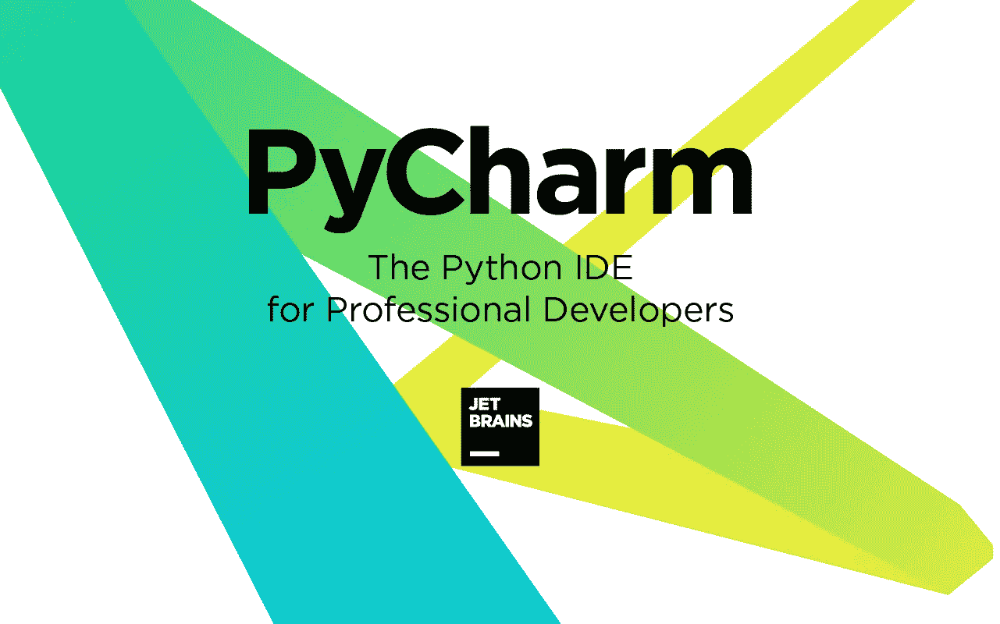
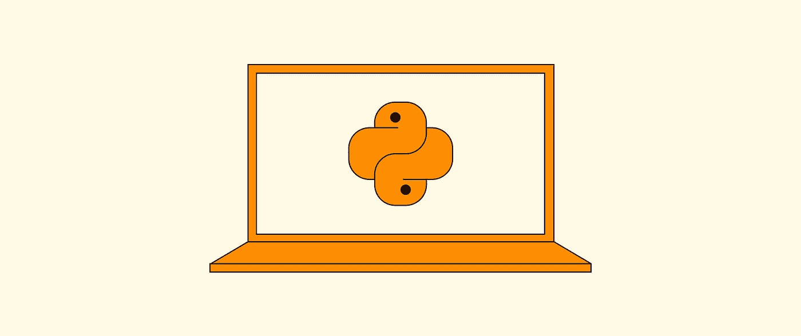
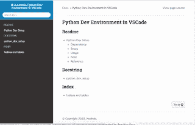
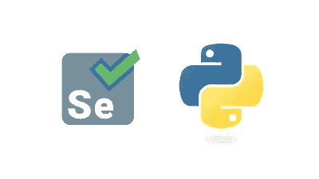
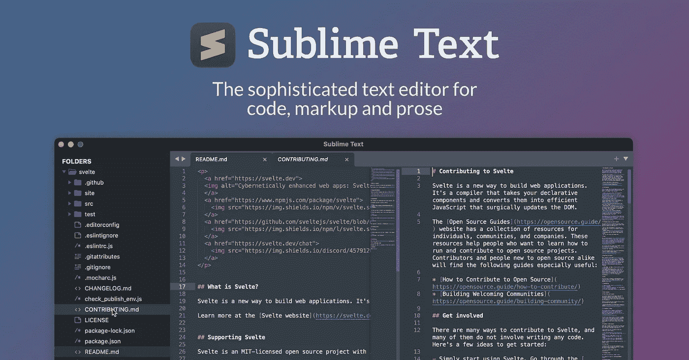

# Python 开发者应该在 2023 年学习的 10 种工具

> 原文：<https://medium.com/javarevisited/top-10-tools-python-programmers-should-learn-cb9c2535f57?source=collection_archive---------0----------------------->

## 这些是最好的 Python IDEs、工具和库，每个 Python 程序员都可以在 2023 年学习，成为更好、更有能力的开发人员

image_credit- JetBrains

大家好，如果你想在 2023 年成为一名更好的 Python 开发者，并寻找最好的 Python 工具和库，那么你来对地方了。

之前我已经分享过 [**最佳 Python 3 课程**](/javarevisited/10-best-python-3-courses-on-udemy-ddd4e3ec5dbf)[**最佳 Python 书籍、**](https://javinpaul.medium.com/best-python-books-a93d1a0d842d) [网站](/javarevisited/10-free-python-tutorials-and-courses-from-google-microsoft-and-coursera-for-beginners-96b9ad20b4e6)、[项目](/javarevisited/8-projects-you-can-buil-to-learn-python-in-2020-251dd5350d56?source=collection_home---4------5-----------------------)、 [*Python 框架*](/javarevisited/top-5-python-frameworks-for-web-development-e034ebe85574) ，今天我要分享的是 2023 年你能学到的最好的 Python 工具。Python 现在被认为是最流行和最强大的编程语言之一，被广泛使用。

Python 在过去几年变得非常流行，因为它的简单性和成千上万的所谓库，使它成为多用途的编程语言，如创建[数据可视化](/javarevisited/8-best-data-visualization-tools-and-libraries-data-analysts-and-scientists-can-learn-d2734371df16)、 [GUI 开发](/javarevisited/6-best-courses-to-learn-tkinter-and-pyqt-for-gui-development-in-python-664976674114)、 [web 应用程序](/javarevisited/top-10-courses-to-learn-python-for-web-development-in-2020-best-of-lot-efe11fb6d212)、[人工智能](https://becominghuman.ai/5-best-artificial-intelligence-courses-for-beginners-in-2020-38db08617b12)、[深度学习](/javarevisited/coursera-deep-learning-specialization-by-andrew-ng-review-is-it-worth-it-in-2021-e3d11d7687d1)等等。

python 如此受欢迎有很多原因，比如它用几行代码创建复杂代码的简单性，另一个原因是 python 如此受欢迎，它是一种高级编程语言，所以你需要担心内存管理，比如 [C/C++](https://javarevisited.blogspot.com/2020/07/top-10-courses-to-learn-c-in-depth-best.html) 以及支持 Python 的巨大社区，所以如果你遇到困难，你会找到人来帮助你。

因为它的简单，许多开发人员已经改变了他们的职业，成为了 [python 开发人员](/javarevisited/8-advanced-python-programming-courses-for-intermediate-programmer-cc3bd47a4d19)，而且因为它是一种开源编程语言，许多程序员已经创建了工具来促进这种语言的使用。

在本文中，我们将看到许多有用的 **python 工具**，每个开发人员在日常生活中使用这种奇妙的语言时都应该知道和使用。

这是关于 [Python](https://javarevisited.blogspot.com/2019/07/top-5-books-to-learn-python-in-2019.html) 及其功能的一个小介绍，现在你将看到一些开发工具来帮助你创建更高效的代码，简化编程过程，以及帮助你发现语法中的错误。

顺便说一下，如果你是 Python 编程世界的新手，想从头开始，那么我强烈推荐你加入这些 [**最好的 Python 课程**](/better-programming/top-5-courses-to-learn-python-in-2018-best-of-lot-26644a99e7ec) 。它们价格实惠，是最新的，而且非常吸引人来在线学习 Python。

<https://becominghuman.ai/7-best-python-online-courses-for-beginners-to-learn-programming-abe12cecb1ad>  

# 2023 年每个 Python 开发者都应该学习的 10 个工具

毫无疑问，python 现在不仅是软件工程师中发展最快的编程语言，也是数据科学家 web 开发人员中发展最快的语言，这只是举几个例子，因为与其他语言如 [C++](/javarevisited/top-10-courses-to-learn-c-for-beginners-best-and-free-4afc262a544e) 或 [JavaScript](https://javarevisited.blogspot.com/2018/06/top-10-courses-to-learn-javascript-in.html) 等相比，它是最适合初学者的编程语言。

但要成为一名 Python 高手，你不仅需要掌握 [*Python 编程语言*](https://www.java67.com/2020/05/top-5-courses-to-learn-python-in-depth.html) ，还需要掌握 Python 开发者必备的工具和库。

> 有一句谚语说，工匠和他们的工具一样好，Python 开发者也不例外。

了解这些工具将使你在编码生活中更有效率，并帮助你在 2023 年成为更好的 Python 开发者。不浪费你更多的时间，这里是 Python 开发者在 2023 年应该学习的工具列表。

## 1.py charm IDE[最好的 Python IDE

这个集成开发环境(IDE)可能是由 JetBrains 公司创建的 python 开发人员可以在线获得的最好的环境，JetBrains 公司是为许多编程语言(不仅仅是 python)创建 IDE 的最好的公司之一。

这个 IDE 可以让你高效地创建你的代码，并且通过一个叫做自动完成的特性来节省你的时间，当你写代码的时候，这个特性会在 python 中建议可用的关键字，当你写一些关键字的时候，它知道你的代码链接的一切，比如“if”语句，并且突出你的代码语法以及更多你可以探索的。

此外，当您在程序中输入错误或忘记某些东西时，它会告诉您错误在哪里，并且当您考虑使用 PyCharm 作为默认 ide 时，软件包的安装会变得很容易。

如果你想学习使用 PyCharm 进行 Python 开发，那么我强烈推荐你参加 Andrei Negaoie 的[**2023:零到精通课程**](https://academy.zerotomastery.io/p/complete-python-developer-zero-to-mastery?affcode=441520_zytgk2dn) ，该课程将教你如何使用 Jupyter 笔记本、PyCharm、VS 代码等等来建立你的专业工作空间。

顺便说一句，你需要一个 [**ZTM 会员**](https://academy.zerotomastery.io/a/aff_c0gnlvf7/external?affcode=441520_zytgk2dn) 来观看这个课程，这个课程每月花费大约 39 美元，但是也提供了许多超级吸引人和有用的课程，比如这个 Python 课程。您还可以使用我的代码朋友 10 获得您选择的任何订阅的 10%的折扣。

<https://academy.zerotomastery.io/a/aff_c0gnlvf7/external?affcode=441520_zytgk2dn>  

简而言之，JetBrains 的 PyCharm 是 python 开发人员最常用和最喜欢的集成开发环境(IDE ),因为它有许多工具可以帮助您编写干净的代码，并且自动完成功能使它成为开发人员的最佳选择。

此外，如果您想掌握 PyCharm，您还可以查看以下两个在线课程:

1.  [精通 Pycharm IDE |成为一名高效的 Python 开发人员](https://click.linksynergy.com/deeplink?id=JVFxdTr9V80&mid=39197&murl=https%3A%2F%2Fwww.udemy.com%2Fcourse%2Fmaster-pycharm-ide-become-a-productive-python-developer%2F)
2.  [PyCharm 生产力和调试技术](https://click.linksynergy.com/deeplink?id=JVFxdTr9V80&mid=39197&murl=https%3A%2F%2Fwww.udemy.com%2Fcourse%2Fpycharm-python%2F)

## 2.Pip 包[安装 Python 包的最佳工具]

假设你已经学习了 Python 编程语言，你想成为某个领域的专家，比如[数据科学](/javarevisited/my-favorite-data-science-and-machine-learning-courses-from-coursera-udemy-and-pluralsight-eafc73acc73f)、[人工智能](/javarevisited/7-best-courses-to-learn-artificial-intelligence-in-2020-26d59d62f6fe)或[数据分析](/javarevisited/11-best-coursera-certifications-and-courses-for-data-science-and-analysis-in-2021-65ce1ac810a5)。那时你必须安装一些软件包来完成这个任务，这时一个叫做 Pip 的智能工具出现了。

Pip 是最有用的 **python 工具**之一，每个开发人员都应该拥有，因为它用于安装任何您想在 python 程序中使用的 python 包。

你所要做的就是输入 pip，然后输入软件包的名称，这个智能工具就会下载并为你安装它，所以它需要一个互联网连接，而且你必须保持更新，以确保它以一种更有效的方式工作。

如果你想了解更多关于 Pip 包以及如何使用 Pip 来安装和卸载 python 模块和包，那么你也可以查看 Udemy 上的 [**学习用 Python 编码**](https://click.linksynergy.com/deeplink?id=JVFxdTr9V80&mid=39197&murl=https%3A%2F%2Fwww.udemy.com%2Fcourse%2Flearn-to-code-with-python%2F) 课程，其中有一些关于 Pip 的讲座。

## 3.Python Anywhere[在线运行 Python 代码的最佳工具]

假设你读了一篇关于 python 的文章，你想尝试一下，但是你也不想下载 python 并尝试不同的想法来看看哪一个是最好的。相反，您可以在名为 python anywhere 的在线服务上托管和运行您的代码。因此，如果你是新手，还没有决定 python 是否适合你，你可以通过这个服务在浏览器之外创建一个代码。他们给你免费访问他们的平台，但如果你需要更多的权力，你必须升级你的计划，这将代码你每个月 5 美元。

或者，你也可以参加一个互动课程，比如 CodeCademy 的 [**学习 Python 3**](https://bit.ly/learnpython3codecademy) ，这样你就可以在浏览器上练习 Python 了。对于刚接触编程的初学者来说，这是学习 Python 的最佳资源之一。

顺便说一句，你需要一个 [**CodeCademy PRO**](https://bit.ly/codecademypro) 才能加入这个课程。它的年费大约是每月 15.99 美元，提供所有 CodeCademy 的内容、课程、测验和项目。你可以用这个来赚取、练习&
应用现成的技能。

<https://bit.ly/codecademypro>  

## 4. [Scikit-Learn](https://scikit-learn.org/stable/) 【数据科学最佳 Python 库】

Scikit-Learn 是一个开源的机器学习库，建立在许多其他库的基础上，如用于数据可视化的 matplotlib、用于数学计算的 NumPy 和用于科学计算的 scipy，以及许多其他库，使 Scikit-Learn 更加强大。

让我们假设你对 python 有所了解，并且你想成为数据科学或机器学习的专家，你可以使用一个简单有效的工具 Scikit-learn。

这个工具有一些内置的 is 包，用于对你的数据执行机器学习算法，比如分类和线性回归等等。您还可以使用它们的内置数据在它们上执行您的数据科学或分析库，而无需搜索 web 和下载这些数据。

如果你想了解更多关于 Scikit-Learn 和其他 Python 数据科学库，如 NumPy、Pandas、Seaborn、Matplotlib、Plotly、Tensorflow 等，那么我推荐你参加由何塞·波尔蒂利亚在 Udemy 上举办的[**Python for Data Science and Machine Learning boot camp**](https://click.linksynergy.com/deeplink?id=JVFxdTr9V80&mid=39197&murl=https%3A%2F%2Fwww.udemy.com%2Fcourse%2Fpython-for-data-science-and-machine-learning-bootcamp%2F)课程。

简而言之，这是数据科学家和机器学习工程师执行许多与数据分析和机器学习相关的任务(如分类、回归和聚类等)的绝佳工具。这是一个应该在 Python 开发者工具集中的 Python 库

## 5.狮身人面像

Python 如此成功的一个原因是你可以在网上找到各种各样的代码，比如说在 GitHub 或其他托管代码网站上。许多开发人员构建自己的开源程序，并让其他人使用它们，为了做到这一点，您必须为您的代码生成文档，这就是 Sphinx 的好处。Sphinx 是为你的程序生成文档的最有用的工具，它在 windows 的终端或 cmd 上工作，它开始问你一堆关于你的名字、你的代码做什么、代码名、发布日期以及更多的问题。

之后，它会生成许多不同的文件，比如可以在网站上发布为网页的 HTML 文件，或者可以与开源代码一起发布的 pdf 文件，以及在这种情况下有用的许多格式。

## 6. [Keras](https://keras.io/)

Keras 是一个人工智能工具或内置在 TensorFlow 和许多其他库(如 Theano 和 CNTK)顶部的 API，用于创建深度神经网络，并以某种方式模仿人脑，并简化这些深度神经网络的创建。

由于 Keras 是开源的，它吸引了更多的贡献者来开发它，并使神经网络的创建像键入一些命令和堆叠层一样简单。

如果你想了解更多关于 Keras 和其他深度学习概念的知识，我强烈推荐你在 Udemy 上查看何塞·波尔蒂利亚的 [**用 Python 和 Keras**](https://click.linksynergy.com/deeplink?id=JVFxdTr9V80&mid=39197&murl=https%3A%2F%2Fwww.udemy.com%2Fcourse%2Fdeep-learning-with-python-and-keras%2F) 进行深度学习课程。

## 7.[硒](https://www.selenium.dev/)

Selenium 是一个工具或框架，可以在各种各样的浏览器上试验 web 应用程序，比如 WordPress。Python 也可以用来设计简单的脚本或自动化测试，以及许多其他语言，例如 java。

这个工具流行的原因有很多，例如可以用于许多编程语言，如 C#、Java、Ruby 等等，它还支持多种平台，如 Linux Mac Windows，以及许多浏览器，如 chrome、Firefox 和 safari。

如果你想从基础到高级学习 Python 自动化，那么我强烈推荐你去 Udemy 上的[**Selenium web driver with Python from Scratch+Frameworks**](https://click.linksynergy.com/deeplink?id=JVFxdTr9V80&mid=39197&murl=https%3A%2F%2Fwww.udemy.com%2Fcourse%2Flearn-selenium-automation-in-easy-python-language%2F)课程。这个长达 18 小时的课程非常适合在 2023 年学习 Python 和 Selenium 的自动化。

## 7.[升华文本](https://www.sublimetext.com/)【Python 开发者的最佳文本编辑器】

本文中的最后一个开发工具是一个名为 sublime 的 lite 文本编辑器，它可以用来创建干净漂亮的 python 代码，就像之前的 PyCharm 和 Jupyter notebook 一样，但是速度非常快，支持许多语言，不仅仅是 python。

这个代码编辑器有一个叫做插件的东西，它是一个小软件，可以添加到你的编辑器中，增加一些功能，比如自动完成功能等等。

我建议你花些时间学习你最喜欢的编辑器和键盘快捷键，生产力提示是你可以学习的。如果你喜欢崇高那么 [**崇高文字快速网页开发**](https://click.linksynergy.com/fs-bin/click?id=JVFxdTr9V80&subid=0&offerid=634352.1&type=10&tmpid=14538&RD_PARM1=https%3A%2F%2Fwww.udemy.com%2Fsublime-text-for-rapid-web-development%2F) 是学习这类东西的好课程

## 9.beautiful soup[web 报废的最佳 Python 工具]

Beautiful-soup 是一个工具或 python 模块，用于解析来自网站的 HTML 文档以及 XML，它还可以用于从 HTML 文件中提取数据，因此您可以创建一个 python 脚本来轻松完成这项工作。

这个工具被数据科学家广泛用于创建简单的脚本，可以从网站中提取大量数据，然后应用可视化或将数据传递给机器学习程序进行人工智能研究。

如果你想学习更多关于使用 python 的 BeautifulSoup 和 Web Scraping 的知识，那么使用 Python 的[**Web Scraping:beautiful soup，Requests & Selenium**](https://click.linksynergy.com/deeplink?id=JVFxdTr9V80&mid=39197&murl=https%3A%2F%2Fwww.udemy.com%2Fcourse%2Fweb-scraping-with-python-beautifulsoup%2F) 课程 eon Udemy 是一个不错的入门课程。

## 10. [Jupyter 笔记本](https://jupyter.org/)【最佳协作 Python 工具】

Jupyter notebook 是一个在数据科学家和机器学习工程师中很有名的 IDE，因为它方便了代码的创建和执行，并且您只需执行一个单元来测试代码，而不是像其他 IDE 一样运行整个程序。

IDE 在浏览器上工作，您可以向代码和标题添加注释，并将其导出为 pdf 或。ipynp 文件也是一个很好的选择，如果你打算做三维可视化。

简而言之，代码协作的最佳 Python 工具之一。如果你想用 Jupytor 笔记本学习 Python 编码，Udemy 上 Andrei Negaoi 的[**2023 年完整 Python 开发者:零到精通**](https://click.linksynergy.com/deeplink?id=JVFxdTr9V80&mid=39197&murl=https%3A%2F%2Fwww.udemy.com%2Fcourse%2Fcomplete-python-developer-zero-to-mastery%2F) 课程是很棒的资源。

这就是 Python 开发人员的**基本工具、ide 和库。**如果你正在学习 Python 或者已经了解 Python，那么学习这些工具可以提高你的技能和生产力，让你成为更好的 Python 开发者。

许多 Python 开发人员正在使用这些工具来使他们的代码比以往任何时候都更快、更干净，并且可以使您的工作更容易，例如自动完成您的代码或下载大量数据并为您的研究或开发进行组织。

您可能喜欢的其他 **Python 文章和教程**:

*   [5 个免费学习 Python 的网站](https://javarevisited.blogspot.com/2019/09/5-websites-to-learn-python-for-free.html)
*   [Python vs Java？从哪个开始比较好？](https://hackernoon.com/java-vs-python-which-is-better-to-learn-for-beginners-in-2020-yq1t3y58)
*   [2023 年学习 Python 的 10 个理由](https://javarevisited.blogspot.com/2018/05/10-reasons-to-learn-python-programming.html)
*   [5 Python 中的数据科学与机器学习课程](https://javarevisited.blogspot.com/2018/03/top-5-data-science-and-machine-learning-online-courses-to-learn-online.html)
*   [初学 Python 的 5 大课程](https://hackernoon.com/top-5-courses-to-learn-python-in-2018-best-of-lot-26644a99e7ec)
*   [Python 开发者的五大 Web 开发框架](https://javarevisited.blogspot.com/2019/04/top-5-python-web-development-frameworks.html)
*   Python 和 JavaScript，从哪个开始比较好？
*   [深入学习 Python 的 10 门免费在线课程](https://javarevisited.blogspot.com/2018/12/10-free-python-courses-for-programmers.html)
*   [哈佛和 IBM 的 9 门数据科学课程](https://becominghuman.ai/9-data-science-and-machine-learning-courses-by-harvard-ibm-udemy-and-others-12a0c7c23ec1)
*   [面向数据科学和机器学习的 8 大 Python 库](https://javarevisited.blogspot.com/2018/10/top-8-python-libraries-for-data-science-machine-learning.html)
*   [Python vs . Java——初学者应该学习哪种编程语言？](https://javarevisited.blogspot.com/2018/06/java-vs-python-which-programming-language-to-learn-first.html)
*   [2023 年学习数据科学 Python 的前 5 本书](https://javarevisited.blogspot.com/2019/08/top-5-python-books-for-data-science-and-machine-learning.html)
*   [面向程序员的 10 本免费 Python 编程书籍](http://www.java67.com/2017/05/top-7-free-python-programming-books-pdf-online-download.html)
*   [深入学习 Python 的 10 门免费课程](https://hackernoon.com/10-free-python-programming-courses-for-beginners-to-learn-online-38312f3b9912)
*   [为什么 Python 是数据科学的最佳编程语言](https://javarevisited.blogspot.com/2020/05/why-python-is-best-programming-language.html)

感谢您阅读本文。如果你觉得这些 Python 工具有用，那么请与你的朋友和同事分享。如果您有任何问题或反馈，请留言。

**P. S. —** 如果你是 Python 新手，并且正在寻找一门全面的课程来深入学习 Python，那么我也推荐你在 Udemy 上查看一下由何塞·波尔蒂利亚教授的 [**完整的 Python 训练营**](http://bit.ly/2BY5LJC) 课程。该课程受到超过 100 万 python 开发人员的信任，是在线学习 Python 的最佳课程之一。

<https://javarevisited.blogspot.com/2018/03/top-5-courses-to-learn-python-in-2018.html> 