# 2023 年 IT 专业人员 15 大免费 Coursera 课程和认证

> 原文：<https://medium.com/javarevisited/top-15-free-coursera-courses-and-certifications-for-it-professionals-384207d56f45?source=collection_archive---------0----------------------->

## 我最喜欢的 Coursera 免费在线课程、专业和认证，帮助你开始编程、云计算、数据科学等职业生涯。

[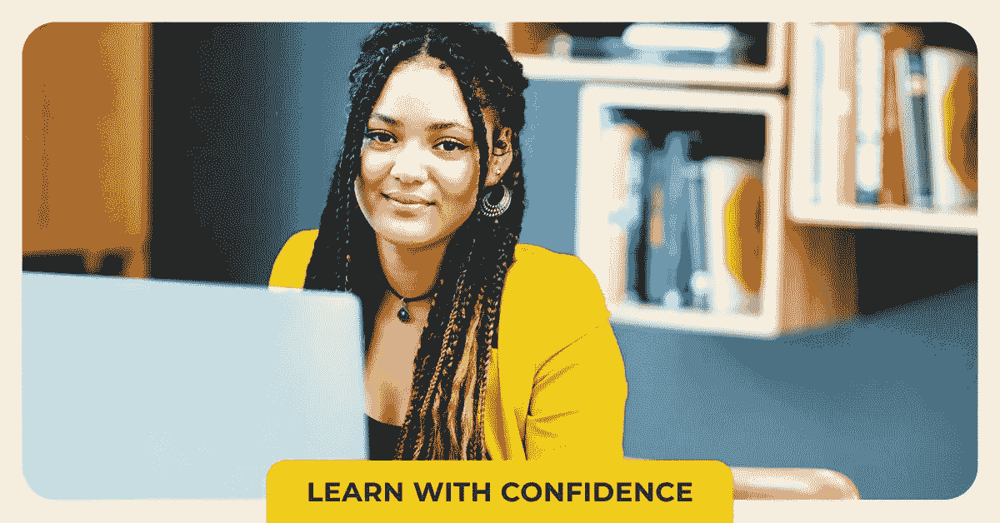](https://coursera.pxf.io/c/3294490/1164545/14726?u=https%3A%2F%2Fwww.coursera.org%2F)

image_credit — Coursera

大家好，如果你正在寻找免费的在线 Coursera 课程来学习新的技术技能，如云计算、AWS、谷歌云、网络、编程、android 应用程序开发和机器学习，那么你来对地方了。

之前，我已经分享了最好的 Coursera 课程来学习</javarevisited/10-best-software-development-courses-certifications-from-coursera-4ccc59aae201>**[**云计算**](/javarevisited/10-best-aws-google-cloud-and-azure-courses-and-certification-from-coursera-to-join-in-2021-5c5e2029a8e7)[**商业&**](/javarevisited/10-best-courses-courses-and-certifications-for-business-finance-and-entrepreneurship-616b80cbd0e6)和 [**Web 开发**](/javarevisited/10-best-coursera-courses-for-web-development-and-web-design-9ec54ed92dd9) ，在这篇文章中，我将分享最好的在线课程，在这篇文章中，我将分享你可以加入的最好的免费 Coursera 课程来学习按需技能。**

**列表中既有永久免费的课程，我指的是从一开始就免费的课程，也有一些*在有限的时间内*为印度的学习者提供的免费课程，比如这个月底，但是他们也提供免费的 Coursera 证书**

**来自印度的学习者可以参加这些免费课程直到六月，他们不仅可以学到新的技能，还可以获得一张免费的证书。但是你需要小心，因为你只能参加这个列表中的一个课程。**

**我还打算让这篇文章成为免费技术相关和编程 Coursera 课程的主要资源，你可以加入这些课程来学习云计算和数据科学等关键技术技能。**

**我还在 Coursera 上添加了许多受欢迎的免费课程，如吴恩达的 [**机器学习课程，全球有超过 400 万人加入，还有普林斯顿大学罗伯特·塞奇威克的算法免费课程。**](https://coursera.pxf.io/c/3294490/1164545/14726?u=https%3A%2F%2Fwww.coursera.org%2Flearn%2Fmachine-learning)**

**这些课程由爱丁堡大学、斯坦福大学、多伦多大学、普林斯顿大学等顶级大学以及亚马逊网络服务、T2、微软 Azure、Vmware、Atlassian 和谷歌云等公司提供。**

**我也在考虑不时地添加新的免费 Coursera 课程，我认为这对程序员、开发人员和 IT 专业人员会很有用。所以，你可以将这篇文章加入书签，或者订阅更新，这样每当我们添加新的免费 Coursera 课程时，你都会收到通知。**

# **2023 年，针对编码、数据科学和云计算的 15 门以上免费 Coursera 课程**

**在不浪费你更多时间的情况下，这里列出了学习编程、算法、机器学习、Git、AWS 云计算、Google Cloud 和 Azure 的最佳免费 Coursera 课程，以及学习 Android 应用开发的课程。**

## **1.[吴恩达的机器学习](https://coursera.pxf.io/c/3294490/1164545/14726?u=https%3A%2F%2Fwww.coursera.org%2Flearn%2Fmachine-learning)【免费】**

**这可能是这个星球上最受欢迎的机器学习课程，包括我自己在内的许多人都从这门课程中学到了机器学习。**

**这是由吴恩达创建的，他是教授[机器学习](/javarevisited/10-free-machine-learning-courses-for-beginners-181f83b4c816)和[人工智能](/javarevisited/10-best-coursera-certifications-courses-for-machine-learning-and-artificial-intelligence-256d9a125822)的先驱之一，也是 Coursera 的创始人之一。400 多万人已经加入了这一课程。**

**以下是您将在本课程中学到的内容:**

*   **监督学习**
*   **无监督学习(聚类、降维、推荐系统、深度学习)。**
*   **机器学习的最佳实践**
*   **个案研究**

**本课程广泛介绍了[机器学习、](https://javarevisited.blogspot.com/2020/05/why-python-is-best-programming-language.html)数据挖掘和统计模式识别。它还分享了许多案例研究和应用，因此您还将学习如何将学习算法应用于构建智能机器人、文本理解、计算机视觉、数据库挖掘和其他领域。**

****这里是加入本课程的链接**——[吴恩达的机器学习](https://coursera.pxf.io/c/3294490/1164545/14726?u=https%3A%2F%2Fwww.coursera.org%2Flearn%2Fmachine-learning)**

**[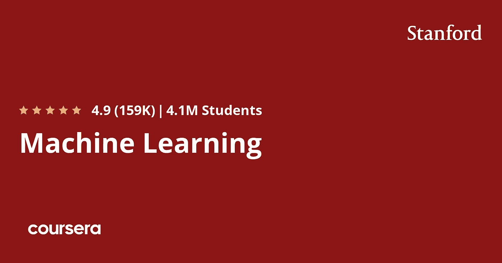](https://coursera.pxf.io/c/3294490/1164545/14726?u=https%3A%2F%2Fwww.coursera.org%2Flearn%2Fmachine-learning)**

**这个课程最好的一点是，它完全免费，你可以随时加入，从机器学习开始。**

## **2.[计算机科学:有目的的编程](https://coursera.pxf.io/c/3294490/1164545/14726?u=https%3A%2F%2Fwww.coursera.org%2Flearn%2Fcs-programming-java)【免费】**

**如果你正在寻找一个免费的 Coursera 课程来学习 Java 编程，那么这个课程就是为你准备的。这门长达 88 小时的课程的授课老师不是别人，正是著名算法书籍的作者罗伯特·塞奇威克和凯文·韦恩，也是非常著名的老师。**

**本课程从非常基础的变量、条件、循环、数组和 I/O 开始学习 Java 编程。之后，您将学习函数、递归、模块化编程和代码重用，最后是面向对象编程的介绍。**

**这门课程涵盖了他们的书《计算机科学:跨学科方法》的前半部分(后半部分涵盖在他们的 Coursera 课程 [*计算机科学:算法、理论和机器*](https://coursera.pxf.io/c/3294490/1164545/14726?u=https%3A%2F%2Fwww.coursera.org%2Flearn%2Fcs-algorithms-theory-machines%3FranMID%3D40328%26ranEAID%3DCuIbQrBnhiw%26ranSiteID%3DCuIbQrBnhiw-VAA49Vs9Vr.3NdZaU0dPNw%26siteID%3DCuIbQrBnhiw-VAA49Vs9Vr.3NdZaU0dPNw%26utm_content%3D10%26utm_medium%3Dpartners%26utm_source%3Dlinkshare%26utm_campaign%3DCuIbQrBnhiw) )中)。**

**该课程的所有功能都是免费的，但它不提供结业证书。**

****这里是加入本课程的链接—** [计算机科学:有目的的编程【免费】](https://coursera.pxf.io/c/3294490/1164545/14726?u=https%3A%2F%2Fwww.coursera.org%2Flearn%2Fcs-programming-java)**

**[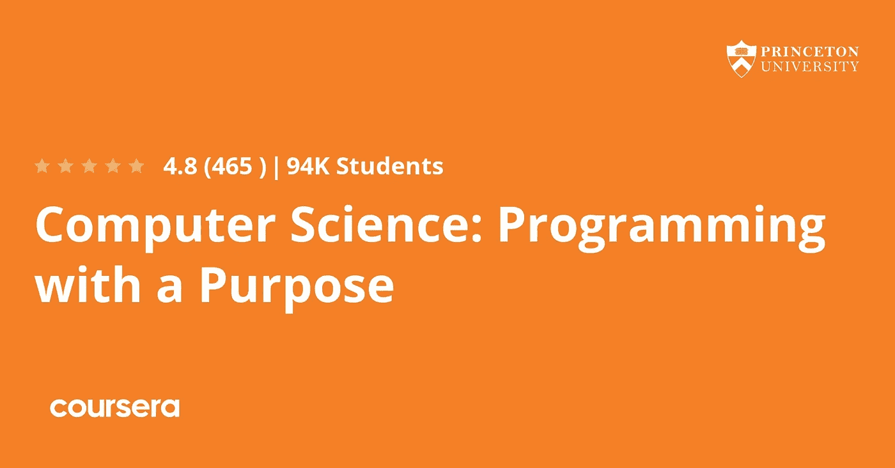](https://coursera.pxf.io/c/3294490/1164545/14726?u=https%3A%2F%2Fwww.coursera.org%2Flearn%2Fcs-programming-java)**

## **3.[算法第一部分和第二部分](https://coursera.pxf.io/c/3294490/1164545/14726?u=https%3A%2F%2Fwww.coursera.org%2Flearn%2Falgorithms-part1)【免费】**

**这是另一个非常棒的免费 Coursera 课程，面向 Java 程序员和其他想从普林斯顿大学的课程材料中学习数据结构和算法的人。本课程涵盖了每个严肃的程序员需要了解的关于[算法和数据结构](/hackernoon/10-data-structure-algorithms-and-programming-courses-to-crack-any-coding-interview-e1c50b30b927)的基本信息，重点是 Java 实现的应用和科学性能分析。**

**这是一门由两部分组成的课程，第一部分涵盖了基本的数据结构、排序和搜索算法以及它们在 Java 中的实现。与之前的课程类似，本课程完全免费，但不提供任何结业证书。**

**Coursera 免费算法课程的第二部分涵盖了图形和字符串处理算法。这门课程也由罗伯特·塞奇威克和凯文·韦恩教授，在 Coursera 上完全免费。**

**如果你想提高你的数据结构和算法技能，那么你可以加入这个免费的课程，并从今天开始在家里或办公室学习。**

****这是加入本课程**——[算法第一部分和第二部分](https://coursera.pxf.io/c/3294490/1164545/14726?u=https%3A%2F%2Fwww.coursera.org%2Flearn%2Falgorithms-part1)的链接**

**[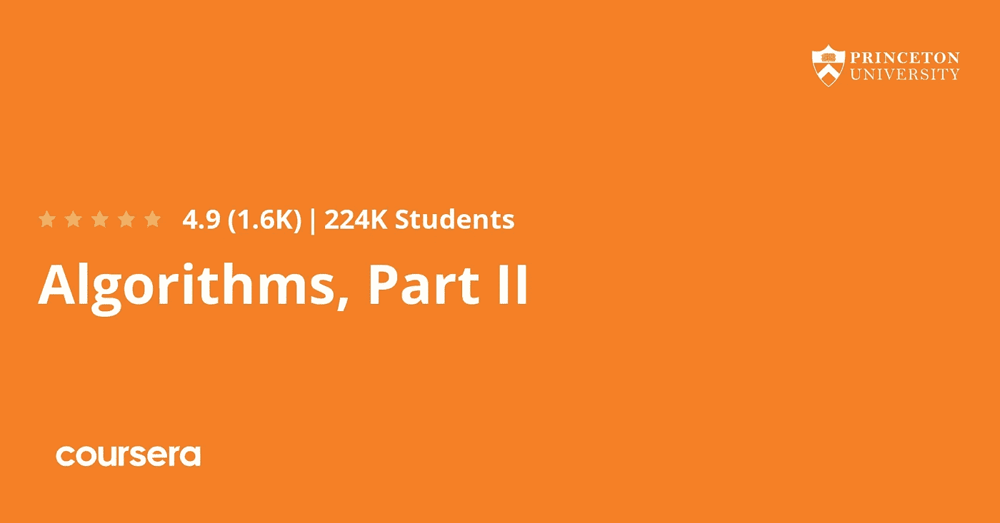](https://coursera.pxf.io/c/3294490/1164545/14726?u=https%3A%2F%2Fwww.coursera.org%2Flearn%2Falgorithms-part1)**

**谈到结果，超过 26%的人在完成这些课程后开始了新的职业生涯，28%的人从这门课程中获得了切实的职业利益。14%的人还获得了加薪或升职。**

## **4.[用 Git 进行版本控制](https://coursera.pxf.io/c/3294490/1164545/14726?u=https%3A%2F%2Fwww.coursera.org%2Flearn%2Fversion-control-with-git)**

**如果你正在寻找一个 Coursera 课程来学习 Git 版本控制，这是最强大和最流行的版本控制工具，那么这个课程就是为你准备的。这门课程是由 Atlassian 提供的，Atlassian 是 JIRA 的幕后公司，Confluence 等，这门课程对印度的学习者也是免费的。他们可以在下个月底之前注册这门课程，以获得免费证书。**

**在本课程中，你不会学到关于 git 的所有知识，但是你会对 Git 的工作原理有一个很强的概念理解，之后你将能够自信地深入挖掘任何你感兴趣的话题。**

**本课程不需要之前的 git 知识，但是如果您以前使用过 Git，您会发现本课程既有用又有挑战性。**

**这门课程有两条路径。两者都非常依赖动手实验室。一种方法假设您有使用命令行界面的经验，另一种方法使用 Sourcetree GUI 客户端**

**如果您不熟悉命令行，我建议您浏览 Sourcetree 路径。最终，您可能希望经历这两种途径，这样您就可以决定使用哪种工具来完成特定的任务。另外，重复对学习有好处:)**

****这是加入本课程**——[Git 版本控制](https://coursera.pxf.io/c/3294490/1164545/14726?u=https%3A%2F%2Fwww.coursera.org%2Flearn%2Fversion-control-with-git)的链接**

**[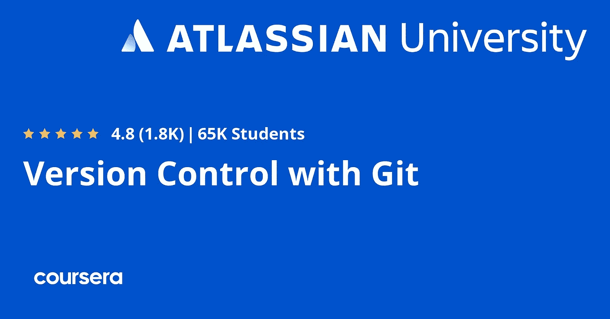](https://coursera.pxf.io/c/3294490/1164545/14726?u=https%3A%2F%2Fwww.coursera.org%2Flearn%2Fversion-control-with-git)**

## **5.[打造你的第一款 Android 应用(以项目为中心的课程)](https://coursera.pxf.io/c/3294490/1164545/14726?u=https%3A%2F%2Fwww.coursera.org%2Flearn%2Fandroid-app%3Fedocomorp%3Dfree-certificate-courses-in)**

**如果你想学习 Android 应用程序开发并寻找 Coursera 课程，那么这个课程适合你。在这个以项目为中心的课程中，您将学习如何在 Android 移动平台上设计、构建和分发应用程序。**

**本课程为您提供了一套可定制的构建模块，您可以组装这些模块来创建许多不同类型的应用程序。**

**完成这个项目后，除了拥有一个可以使用和分享的个性化应用程序，你还将拥有继续学习 [Android 开发](/hackernoon/top-5-courses-to-learn-android-for-java-programmers-667e03d995b4)中更高级课程所需的技能和背景。**

**我向任何想学习 Android 应用程序开发的人强烈推荐这门课程，它目前对印度的学习者是免费的。**

****这里是加入这个免费课程的链接**——[构建你的第一个 Android 应用(以项目为中心的课程)](https://coursera.pxf.io/c/3294490/1164545/14726?u=https%3A%2F%2Fwww.coursera.org%2Flearn%2Fandroid-app%3Fedocomorp%3Dfree-certificate-courses-in)**

**[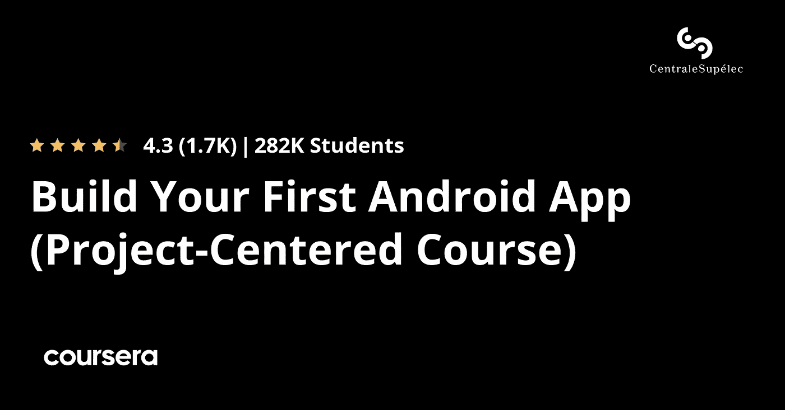](https://coursera.pxf.io/c/3294490/1164545/14726?u=https%3A%2F%2Fwww.coursera.org%2Flearn%2Fandroid-app%3Fedocomorp%3Dfree-certificate-courses-in)**

## **6.[学习编程:多伦多大学基础课程](https://coursera.pxf.io/c/3294490/1164545/14726?u=https%3A%2F%2Fwww.coursera.org%2Flearn%2Flearn-to-program%3Fedocomorp%3Dfree-certificate-courses-in)**

**如果你想免费学习如何在 Coursera 上编程，那么你应该加入这个课程。本课程介绍了编程的基本构件，并教你如何使用 Python 语言编写有趣而有用的程序。**

**本课程由多伦多大学提供，您将在本课程中学到以下内容:**

*   **Python 语法和语义**
*   **计算机编程**
*   **[Python 编程](/javarevisited/8-advanced-python-programming-courses-for-intermediate-programmer-cc3bd47a4d19)**

**总的来说，这是一门很好的课程，可以让你重新掌握 python 基础知识，也适合任何希望学习 Python 编程的初学者。在完成本课程和一些作业练习后，你将处于一个舒适的位置。**

****这里是加入本课程的链接—** [学习编程:基础知识](https://coursera.pxf.io/c/3294490/1164545/14726?u=https%3A%2F%2Fwww.coursera.org%2Flearn%2Flearn-to-program%3Fedocomorp%3Dfree-certificate-courses-in)**

**[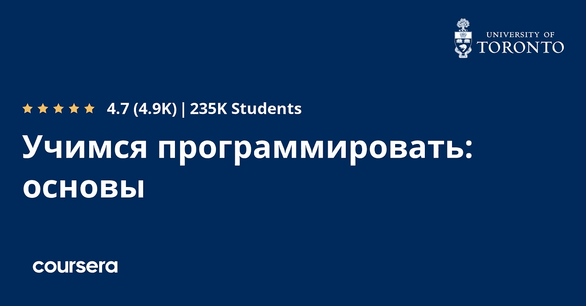](https://coursera.pxf.io/c/3294490/1164545/14726?u=https%3A%2F%2Fwww.coursera.org%2Flearn%2Flearn-to-program%3Fedocomorp%3Dfree-certificate-courses-in)**

## **7.[迁移到谷歌云](https://coursera.pxf.io/c/3294490/1164545/14726?u=https%3A%2F%2Fwww.coursera.org%2Flearn%2Fmigrating-to-gcp%3Fedocomorp%3Dfree-certificate-courses-in)**

**这是谷歌云平台的另一个关于云计算的很棒的课程，这个课程对印度的学习者也是免费的，如果他们在六月底注册，就有机会获得免费证书。**

**如果你正在将你的应用程序迁移到云，特别是谷歌云平台，并且需要一门基础课程，那么这是为你准备的。在这里，您将学习从源环境迁移到 [Google Cloud](/javarevisited/5-best-courses-to-learn-google-cloud-platform-gcp-in-2021-169093a3771a) 的策略。**

**在此过程中，您将了解基本的谷歌云概念和高级的东西，如创建虚拟机、配置网络、管理访问和身份。**

**本课程还涵盖了 Migrate for Compute Engine 的安装和迁移流程，包括测试克隆和波形迁移等特殊功能。完成本课程大约需要 20 个小时，并且完全在线。**

****这里是加入本课程** — [迁移到谷歌云](https://coursera.pxf.io/c/3294490/1164545/14726?u=https%3A%2F%2Fwww.coursera.org%2Flearn%2Fmigrating-to-gcp%3Fedocomorp%3Dfree-certificate-courses-in)的链接**

****

## **8.[云身份简介](https://coursera.pxf.io/c/3294490/1164545/14726?u=https%3A%2F%2Fwww.coursera.org%2Flearn%2Fcloud-identity)**

**这是 Coursera 和谷歌云平台的另一个令人惊叹的云计算课程，对印度的学习者免费，直到下个月底。**

**本课程将向您传授有关云身份、身份和访问管理的基本概念，管理员可以使用这些概念开始为其组织管理和建立安全和访问管理最佳实践的旅程。**

**以下是您将在本课程中学到的内容**

*   **如何为他们的组织或个人域建立云身份域。**
*   **如何添加用户以实践用户生命周期管理？**
*   **如何修改用户权限以了解核心云身份功能。**
*   **如何在谷歌移动管理模块中添加移动设备？**
*   **如何修改移动管理策略集以熟悉产品选项。**
*   **如何导航报告模块，并练习运行报告。**
*   **如何探索不同的安全协议并将其应用到域中。**

**总的来说，这是一门很棒的课程，适合想学习 Google 云平台上的访问控制和安全性的管理员。**

****以下是参加本课程的链接** — [云身份介绍](https://coursera.pxf.io/c/3294490/1164545/14726?u=https%3A%2F%2Fwww.coursera.org%2Flearn%2Fcloud-identity)**

**[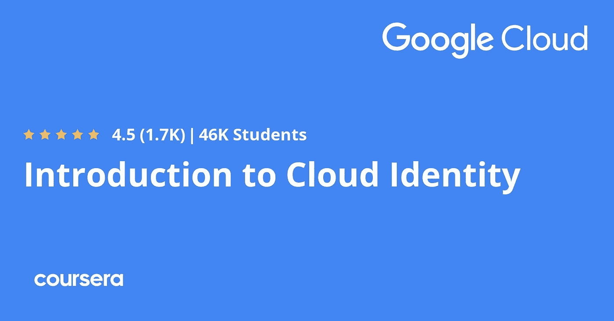](https://coursera.pxf.io/c/3294490/1164545/14726?u=https%3A%2F%2Fwww.coursera.org%2Flearn%2Fcloud-identity)**

## **9.[自己编码！编程入门](https://coursera.pxf.io/c/3294490/1164545/14726?u=https%3A%2F%2Fwww.coursera.org%2Flearn%2Fintro-programming)**

**如果你一直想学习如何编程和编码，并寻找免费资源，那么这个 Coursera 课程就是为你准备的。这门课程由爱丁堡大学提供，下个月之前印度的学生可以免费学习。**

**如果你一直想学习如何编程，但不知道从哪里开始，不要担心，这门课程将教你如何在 Scratch(一种简单易用的可视化编程语言)中编程。**

**更重要的是，它将向你介绍计算的基本原理，并帮助你像软件工程师一样思考。**

****这里是加入本课程的链接** — [自己编码！编程入门](https://coursera.pxf.io/c/3294490/1164545/14726?u=https%3A%2F%2Fwww.coursera.org%2Flearn%2Fintro-programming)**

**[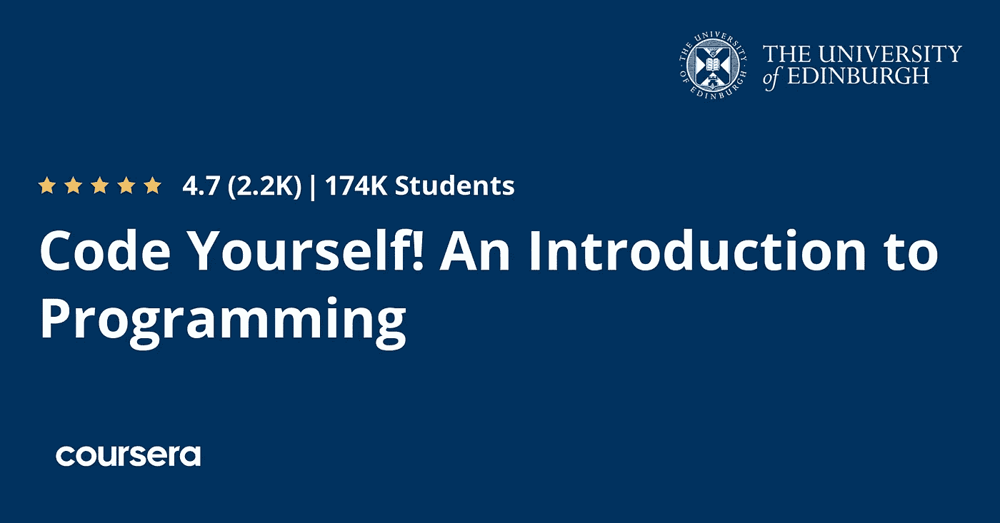](https://coursera.pxf.io/c/3294490/1164545/14726?u=https%3A%2F%2Fwww.coursera.org%2Flearn%2Fintro-programming)**

## **10.[AWS 身份和访问管理简介](https://coursera.pxf.io/c/3294490/1164545/14726?u=https%3A%2F%2Fwww.coursera.org%2Flearn%2Fintroduction-to-aws-identity-and-access-management)**

**这是另一个令人惊叹的 Coursera 课程，由科技巨头之一亚马逊网络服务本身提供。如果您想学习 AWS 中的身份和访问管理，那么本课程非常适合您。**

**已经有超过 8800 人加入了这个课程，对于来自印度的学习者来说也是免费的，他们可以在下个月底之前获得免费证书。**

**这是一门初级课程，需要将近 11 个小时才能完成。我们还希望您熟悉 AWS 的基本概念和核心服务，如什么是区域和可用性区域？还有什么是亚马逊 EC2，一个 [WS S3](/javarevisited/7-best-aws-s3-and-dynamodb-courses-for-beginners-in-2021-a8a44b6066da) ，VPC 等？**

**本课程的目标是向您传授基础知识和技能，使您能够在使用 AWS IAM 和 AWS 生态系统的其他方面有所提高。**

**在整个课程中，重点将是理解 IAM 功能所需的基础知识，以及实现其使用的简单方法。**

****以下是参加本课程的链接**——[AWS 身份和访问管理简介](https://coursera.pxf.io/c/3294490/1164545/14726?u=https%3A%2F%2Fwww.coursera.org%2Flearn%2Fintroduction-to-aws-identity-and-access-management)**

****

## **11.[面向 Azure 专业人员的谷歌云基础:核心基础设施](https://coursera.pxf.io/c/3294490/1164545/14726?u=https%3A%2F%2Fwww.coursera.org%2Flearn%2Fgcp-fundamentals-azure)**

**这是谷歌云平台为想要学习谷歌云平台(GCP)的 Azure 专业人员提供的另一个很棒的课程，这个课程对印度的学习者也是免费的，它还提供 Coursera 的免费证书。**

**本课程将教你使用谷歌云平台(GCP)的重要概念和术语。您可以了解并比较[谷歌云平台](/javarevisited/7-free-courses-to-learn-google-cloud-platform-for-beginners-cbb260fbd8e4)中提供的许多计算和存储服务，包括谷歌应用引擎、谷歌计算引擎、谷歌云存储、谷歌云 SQL、BigQuery 和谷歌 Kubernetes 引擎。**

**您还将了解重要的资源和策略管理工具，如 Google Cloud 资源管理器层次结构和 Google Cloud 身份和访问管理。**

**本课程还有动手实验，为你提供与 GCP 打交道的基本技能。**

****这是加入本课程的链接** — [面向 Azure 专业人员的谷歌云基础:核心基础设施](https://coursera.pxf.io/c/3294490/1164545/14726?u=https%3A%2F%2Fwww.coursera.org%2Flearn%2Fgcp-fundamentals-azure)**

****

## **12.[VMware NSX 的网络和安全架构](https://coursera.pxf.io/c/3294490/1164545/14726?u=https%3A%2F%2Fwww.coursera.org%2Flearn%2Fnetworking-security-architecture-vmware-nsx)**

**如果您正在寻找学习 VMware 网络和安全体系结构的在线课程，那么本课程非常适合您。该课程由 Vmware 自己提供，在下个月底之前对印度的学习者也是免费的。**

**这是一门为期 8 周的在线课程，旨在让学员掌握 VMware NSX 网络虚拟化的基础知识。**

**本课程包括以下内容:**

*   **网络虚拟化基础知识**
*   **NSX 商业价值和使用案例**
*   **NSX 与传统网络有何不同**
*   **了解 VMware NSX 公司的网络和安全解决方案体系结构**

**为了充分利用本课程，您应该熟悉路由、交换、防火墙、灾难恢复、业务连续性、云和安全性等一般 IT 概念。**

****这是参加本课程的链接**—[VMware NSX 分公司的网络和安全架构](https://coursera.pxf.io/c/3294490/1164545/14726?u=https%3A%2F%2Fwww.coursera.org%2Flearn%2Fnetworking-security-architecture-vmware-nsx)**

**[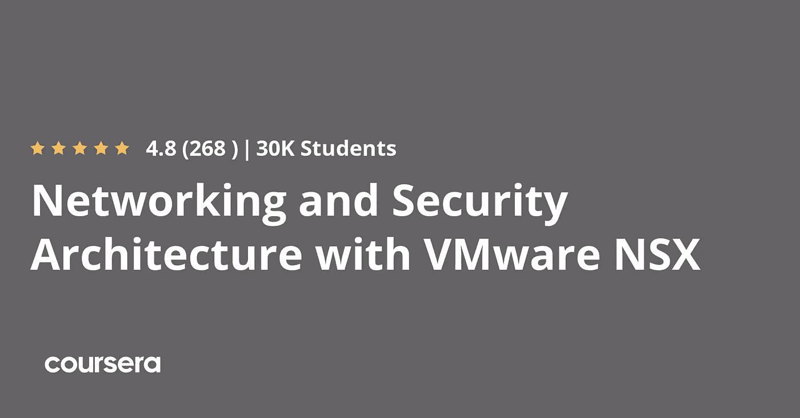](https://coursera.pxf.io/c/3294490/1164545/14726?u=https%3A%2F%2Fwww.coursera.org%2Flearn%2Fnetworking-security-architecture-vmware-nsx)**

## **13.[面向 AWS 专业人员的谷歌云平台基础知识](https://coursera.pxf.io/c/3294490/1164545/14726?u=https%3A%2F%2Fwww.coursera.org%2Flearn%2Fgcp-fundamentals-aws)**

**如果你是一名 AWS 用户，想要学习另一个有前途的公共云平台 Google Cloud Platform，特别是在机器学习和大数据方面，那么这门课程就是为你准备的。**

**在这门实践课程中，您将学习四大技术支柱的[谷歌云平台](/javarevisited/10-best-free-google-cloud-professional-architect-certification-courses-practice-tests-943e75f03929) (GCP):网络、计算、存储和数据库。它还有许多 It 演示和动手实验，参与者可以快速获得相似性、差异和初始操作方法的详细信息。**

**以下是本课程中涉及的主要内容:**

*   **如何识别亚马逊 VPC、子网、路线、亚马逊 EC2、亚马逊 EBS、自动扩展、弹性负载平衡、[亚马逊 S3](/javarevisited/7-best-aws-s3-and-dynamodb-courses-for-beginners-in-2021-a8a44b6066da) 、亚马逊 RDS、亚马逊红移、AWS IAM 等的 GCP 对应方**
*   **如何配置帐户、计费、项目、网络、子网、防火墙、虚拟机、磁盘、自动扩展、负载平衡、存储、[数据库](/hackernoon/top-5-sql-and-database-courses-to-learn-online-48424533ac61)、IAM 等**
*   **如何管理和监控应用程序**
*   **如何解释功能和定价模式的差异**
*   **如何找到文档和培训。**

**本课程是专门为熟悉 AWS 功能和设置并希望立即获得配置 GCP 产品经验的 [AWS 解决方案架构师](/javarevisited/how-to-prepare-for-aws-solution-architect-associate-certification-saa-c01-saa-c02-exam-in-2021-a6e7e7e771fc)和 [SysOps 管理员](/javarevisited/7-best-aws-sysops-administrator-associate-certification-practice-test-mock-exams-and-dumps-3578d07e4f5b)设计的。**

****这里是参加 GCP 课程的链接**——[面向 AWS 专业人员的谷歌云平台基础](https://coursera.pxf.io/c/3294490/1164545/14726?u=https%3A%2F%2Fwww.coursera.org%2Flearn%2Fgcp-fundamentals-aws)**

****

## **14.[MATLAB 编程入门](https://coursera.pxf.io/c/3294490/1164545/14726?u=https%3A%2F%2Fwww.coursera.org%2Flearn%2Fmatlab)**

**如果你是编程新手，想学习用 MATLAB(一种特殊用途的编程语言)编程，那么这门课程就是为你准备的。该课程由范德比尔特大学提供，完全免费加入，事实上已经有近 40 万人加入了该课程。**

**MATLAB 是一种特殊用途的语言，是编写解决涉及数字操作问题的中等规模程序的绝佳选择。**

**以下是您将在本课程中学到的关键技能:**

*   **基本的计算机编程概念，如变量、控制结构、函数等。**
*   **各种数据类型以及如何在 MATLAB 中处理它们。**
*   **如何在 MATLAB 中处理矩阵**
*   **如何在 MATLAB 中进行文件输入/输出？**

**这门课程向那些几乎没有经验的人教授计算机编程。它使用称为 MATLAB 的编程系统和语言来这样做，因为它简单易学，功能多样，对工程师和其他专业人员非常有用。**

**以下是加入本课程的链接—[MATLAB 编程简介](https://coursera.pxf.io/c/3294490/1164545/14726?u=https%3A%2F%2Fwww.coursera.org%2Flearn%2Fmatlab)**

****

## **15.[AWS 机器学习入门](https://coursera.pxf.io/c/3294490/1164545/14726?u=https%3A%2F%2Fwww.coursera.org%2Flearn%2Faws-machine-learning)**

**这是另一个 Coursera 课程，对印度的学习者是免费的，由亚马逊网络服务提供。你可以用这个课程来学习 AWS 云平台上的机器学习。机器学习(ML)是技术领域发展最快的领域之一，也是当今就业市场非常抢手的技能。**

**本课程将教你如何入门 AWS 机器学习。你将学习 AWS 上的机器学习、[AWS 上的计算机视觉](https://javarevisited.blogspot.com/2020/09/top-5-computer-vision-and-open-cv-courses-projects.html)和[AWS 上的自然语言处理](https://javarevisited.blogspot.com/2020/07/top-5-courses-to-learn-natural-language-processing.html#axzz6oFIa7Pmh) (NLP)。**

**每个主题由几个模块组成，深入探讨各种 ML 概念、AWS 服务以及专家将概念付诸实践的见解。**

**在像 AWS 这样的公共云平台上拥有良好的机器学习知识是一项非常受欢迎的技能，这也是你将在这里学到的。**

****以下是加入本课程**—[AWS 机器学习入门](https://coursera.pxf.io/c/3294490/1164545/14726?u=https%3A%2F%2Fwww.coursera.org%2Flearn%2Faws-machine-learning)的链接**

**[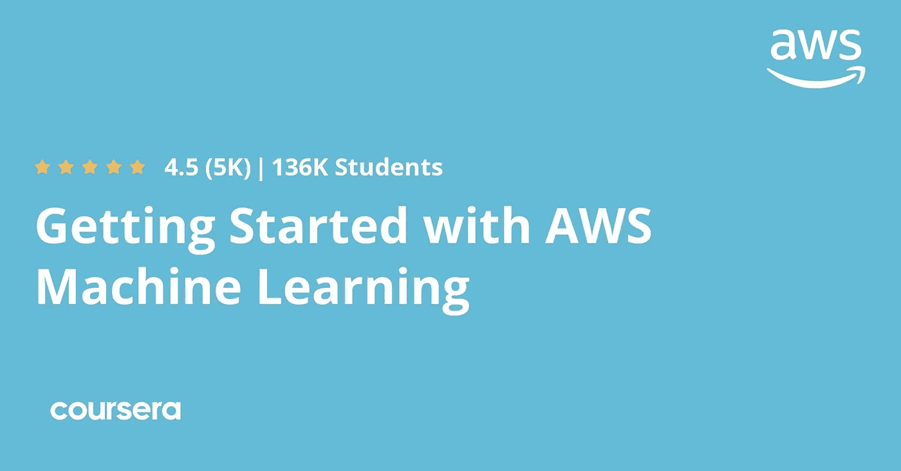](https://coursera.pxf.io/c/3294490/1164545/14726?u=https%3A%2F%2Fwww.coursera.org%2Flearn%2Faws-machine-learning)**

**顺便说一句，如果你发现 Coursera 的课程很有用，因为它们是由世界各地的知名公司和大学创建的，我建议你加入 Coursera Plus 的[课程，这是 Coursera 的一个订阅计划，让你可以无限制地访问他们最受欢迎的课程、专业、专业证书和指导项目。](https://coursera.pxf.io/c/3294490/1164545/14726?u=https%3A%2F%2Fwww.coursera.org%2Fcourseraplus)**

**<https://coursera.pxf.io/c/3294490/1164545/14726?u=https%3A%2F%2Fwww.coursera.org%2Fcourseraplus>  

**还有，你在 Coursera 的** [**第一周是免费的**](https://coursera.pxf.io/c/3294490/1164545/14726?u=https%3A%2F%2Fwww.coursera.org%2Fcourseraplus) **，也就是说你可以报名参加任何课程，免费完成 7 天。**

这就是关于程序员、开发人员和 IT 专业人员的**最佳免费 Coursera 课程和认证的全部内容**。你可以免费注册这些 Coursera 课程，来自印度的学习者甚至可以获得这些课程的免费证书，但仅限于 6 月份。

Coursera 还通过免费提供高质量的课程和证书来支持印度的学习者。

其他课程是免费的，但你可能无法在那里获得免费证书，但你可以用它们来学习急需的技术技能，如[机器学习](/javarevisited/top-10-machine-learning-and-data-science-certifications-and-training-courses-for-beginners-and-a6308497b764?source=---------43----------------------------)、[算法](/javarevisited/7-best-courses-to-learn-data-structure-and-algorithms-d5379ae2588?source=---------18------------------)、 [Java](/javarevisited/10-free-courses-to-learn-java-in-2019-22d1f33a3915?source=collection_home---4------8-----------------------) 、[编程](/javarevisited/top-10-free-interactive-programming-courses-from-educative-for-beginners-to-learn-in-2021-713cbf96d4eb)、[云计算](/javarevisited/10-free-courses-to-learn-cloud-computing-for-beginners-4f3cd984ddb1)、[安卓应用开发](/javarevisited/5-free-courses-to-become-an-android-developer-d4d207f53675)等等。

你可能喜欢的其他课程和编程文章

*   [开始职业生涯的十大 Coursera 认证](/javarevisited/top-10-coursera-certificates-to-start-your-career-in-cloud-data-science-ai-mainframe-and-it-558690c83587)
*   [向顶级科技公司学习的 18 门 Coursera 课程](/javarevisited/18-coursera-courses-you-can-join-in-2020-to-learn-from-the-worlds-top-tech-companies-google-74af46967d1e?source=collection_home---4------0-----------------------)
*   [面向程序员和开发者的 Coursera 十大项目](https://javarevisited.blogspot.com/2020/08/top-10-coursera-projects-to-learn-essential-programming-skills.html)
*   [Udemy vs CodeCademy vs OneMonth？](https://javarevisited.blogspot.com/2019/09/codecademy-vs-udemy-vs-onemonth-which-is-better-for-learning-code.html#axzz6VYKcmyZz)
*   Udemy vs Educative vs Codecademy？新手用哪个比较好
*   [学习 Python 的 10 个 Coursera 专业和认证](https://javarevisited.blogspot.com/2020/02/10-best-coursera-courses--for-python.html)
*   [5 个最佳 Coursera 程序员职业证书](https://javarevisited.blogspot.com/2019/10/top-5-coursera-professional-certificates-for-programmers-IT-professionals.html)
*   [2023 年学习 Python 可以做的 8 个项目](/javarevisited/8-projects-you-can-buil-to-learn-python-in-2020-251dd5350d56)
*   [2023 年程序员十大课程](https://javarevisited.blogspot.com/2020/08/top-10-coursera-courses-specilizations-and-certifications.html)
*   [Udemy vs Coursera？学理工和编程哪个好](https://javarevisited.blogspot.com/2020/01/coursera-vs-udemy-which-is-better-for-programming-tech.html)
*   [Coursera 证书对工作和事业有帮助吗](https://javarevisited.blogspot.com/2020/02/does-udemy-coursera-edx-educative-or.html)？
*   [2023 年学习人工智能的 7 门最佳课程](/javarevisited/7-best-courses-to-learn-artificial-intelligence-in-2020-26d59d62f6fe)
*   [Udemy vs 复数视线？哪个学习平台比较好？](https://javarevisited.blogspot.com/2019/10/udemy-vs-pluralsight-review-which-is-better-to-learn-code.html)
*   [Coursera 的 10 项数据科学和机器学习认证](/javarevisited/top-10-machine-learning-and-data-science-certifications-and-training-courses-for-beginners-and-a6308497b764)

感谢您阅读本文。如果你喜欢这个*最好的免费 Coursera 课程和证书*，那么请与你的朋友和同事分享。如果您有任何问题或反馈，请留言。

**附言——**如果你喜欢 Udemy 课程，那么你也可以看看这个 [**免费 Udemy 课程列表**](https://click.linksynergy.com/deeplink?id=CuIbQrBnhiw&mid=39197&murl=https%3A%2F%2Fwww.udemy.com%2Fcourses%2Ffree%2F) 免费学习新的技术技能。这份清单包括免费的编程、编码、云计算和在线数据科学。

<https://click.linksynergy.com/deeplink?id=CuIbQrBnhiw&mid=39197&murl=https%3A%2F%2Fwww.udemy.com%2Fcourses%2Ffree%2F> **