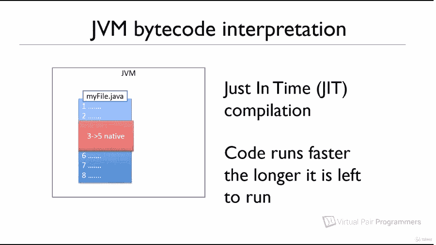
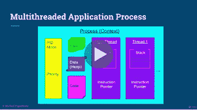
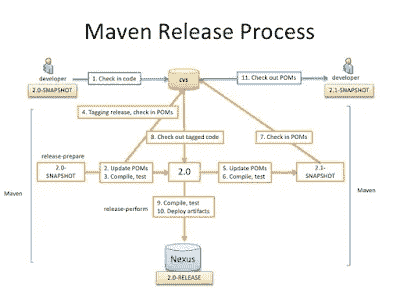
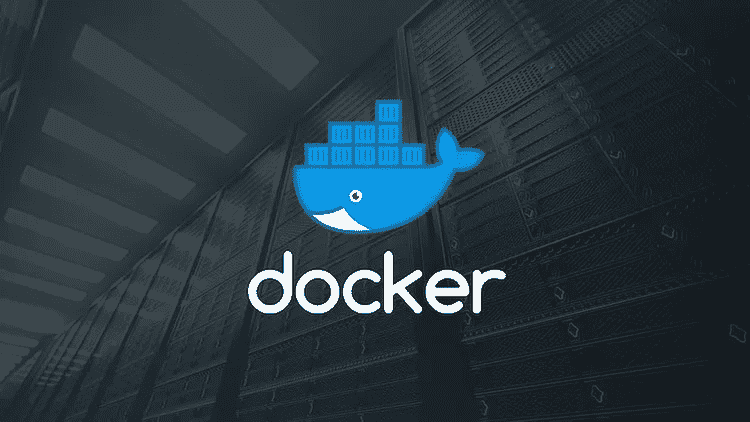
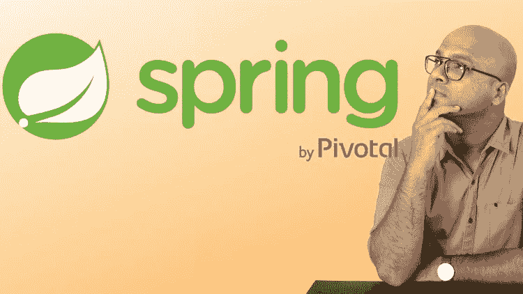

# 2023 年面向 Java 和 Spring 开发者的 17 门最佳 Udemy 课程

> 原文：<https://medium.com/javarevisited/top-15-java-and-spring-framework-courses-from-udemy-best-of-lot-d7b965b62a9f?source=collection_archive---------0----------------------->

## 这些是 Java 开发人员可以在 Udemy sales 上买到的最好的 Java、反应式 Spring、Performance 和 Spring 课程。

大家好，你可能知道 Udemy 现在正在进行他们最大的销售<https://click.linksynergy.com/deeplink?id=JVFxdTr9V80&mid=39197&murl=https%3A%2F%2Fwww.udemy.com%2F>**，其中每门课程的价格仅为 9.99 美元，是的，你没听错，仅为 9.99 美元，即使是原价为 200 美元的课程。这是我通常等待的事件，我可以批量购买课程，然后稍后使用。过去我通过这样做节省了很多钱，就像他们在新年销售时那样，当时我疯狂购物，一口气买了 20 道菜。**

**今天我还购买了一些课程来学习[反应式 Spring](/javarevisited/top-10-free-courses-to-learn-spring-framework-for-java-developers-639db9348d25) 、 [Java 性能](/javarevisited/7-best-courses-to-learn-jvm-garbage-collection-and-performance-tuning-for-experienced-java-331705180686)、 [Spring Boot](/javarevisited/10-free-spring-boot-tutorials-and-courses-for-java-developers-53dfe084587e?source=---------7------------------) 、 [Spring Cloud](/javarevisited/5-best-courses-to-learn-spring-cloud-and-microservices-1ddea1af7012) 、[函数式编程](/javarevisited/7-best-java-tutorials-and-books-to-learn-lambda-expression-and-stream-api-and-other-features-3083e6038e14)、[微服务](/javarevisited/top-5-courses-to-learn-microservices-in-java-and-spring-framework-e9fed1ba804d)以及其他高级 Java 主题。**

**我认为这对 Java 开发人员来说是一个提升技能的绝好机会，但是和其他人一样，如果你也对该买什么感到困惑，那么这里是你可以在 Udemy 上买到的最好的 Java 和 Spring 课程列表。在这个列表中，我为 Java 和 Web 开发人员整理了一些最好的课程。尽管在过去的几个月里，我已经从 Udemy 购买了超过 30 门课程，但我只收录了 10 门最好的课程，我认为这对 Java 开发人员来说是必不可少的。**

**顺便说一句，如果你找到合适的课程想和我们分享，请随意。**

# **2023 年 Udemy 的 17 门最佳 Java 和 Spring 框架课程**

**无论如何，这里是我从 Udemy 为 Java 和 Web 开发人员列出的一些最好的课程。这包括 Java 11、Spring 5、Spring Boot 2、Git、Maven、Jenkins、Docker、REST API、微服务和一般 web 开发内容的课程。这应该是 2023 年要学习和更新的一个很好的技能列表。**

## **1.[使用 Spring 框架 5 进行反应式编程](https://click.linksynergy.com/fs-bin/click?id=JVFxdTr9V80&subid=0&offerid=323058.1&type=10&tmpid=14538&RD_PARM1=https%3A%2F%2Fwww.udemy.com%2Freactive-programming-with-spring-framework-5%2F)**

**约翰·汤姆逊教授的另一门优秀的高级课程，它特别关注 Spring 5 的反应式编程。本课程提供了构建反应式应用程序的实践经验，以利用反应式数据类型和 [WebFlux](/javarevisited/7-best-webflux-and-reactive-spring-boot-courses-for-java-programmers-33b7c6fa8995) (两者都是 Spring Framework 5 的新特性)来流式传输“电影事件”。**

**以下是加入本课程的链接— [用 Spring Framework 5 进行反应式编程](https://click.linksynergy.com/fs-bin/click?id=JVFxdTr9V80&subid=0&offerid=323058.1&type=10&tmpid=14538&RD_PARM1=https%3A%2F%2Fwww.udemy.com%2Freactive-programming-with-spring-framework-5%2F)**

****

## **2. [Java 应用性能和内存管理](https://click.linksynergy.com/deeplink?id=JVFxdTr9V80&mid=39197&murl=https%3A%2F%2Fwww.udemy.com%2Fcourse%2Fjava-application-performance-and-memory-management%2F)**

**如果您是一名高级 Java 开发人员，并且希望提高您的 Java 应用程序性能技能，那么这可能是开始学习的最佳课程。在本课程中，您将首先了解哪些因素会导致 Java 应用程序中的性能问题，如线程、内存、垃圾收集，以及如何解决这些问题。

您将了解到**配置 Java 虚拟机以在运行时提供更好性能的各种方法**。我们将深入探讨虚拟机如何管理内存和垃圾收集过程。**

****以下是参加本课程的链接** — [Java 应用性能和内存管理](https://click.linksynergy.com/deeplink?id=JVFxdTr9V80&mid=39197&murl=https%3A%2F%2Fwww.udemy.com%2Fcourse%2Fjava-application-performance-and-memory-management%2F)**

****

## **3. [Java 多线程、并发&性能优化](https://click.linksynergy.com/deeplink?id=JVFxdTr9V80&mid=39197&murl=https%3A%2F%2Fwww.udemy.com%2Fcourse%2Fjava-multithreading-concurrency-performance-optimization%2F)**

**这是另一门优秀的课程，面向希望成为 Java 多线程、并发并行编程专家的有经验的 JAva 开发人员，重点强调高性能

在这门课程中，您将学习到排除性能和内存相关问题、线程相关问题和 JVM 特定问题所需的所有[基本工具](https://www.java67.com/2018/04/10-tools-java-developers-should-learn.html)。**

**正如我以前说过的，工具真的很重要，因为一个 Java 开发者和他的工具一样优秀。如果您不知道如何分析您的 Java 应用程序，那么您永远也不会知道哪个对象占用了所有的内存，代码的瓶颈在哪里。

类似地，如果你不能读取线程转储，那么你就不知道你的程序到底在哪里卡住了，它们是在等待数据库响应还是另一个服务器，还是在等待某个文件锁定。如果您知道正确的工具，您可以快速有效地排除故障。**

****这里是加入本课程** — [Java 多线程、并发&性能优化](https://click.linksynergy.com/deeplink?id=JVFxdTr9V80&mid=39197&murl=https%3A%2F%2Fwww.udemy.com%2Fcourse%2Fjava-multithreading-concurrency-performance-optimization%2F)的链接**

****

## **4.[全叠加:角度和 Spring Boot](https://click.linksynergy.com/deeplink?id=JVFxdTr9V80&mid=39197&murl=https%3A%2F%2Fwww.udemy.com%2Fcourse%2Ffull-stack-angular-spring-boot-tutorial%2F)**

**这是一个学习如何用 Angular 和 Spring Boot 构建全栈应用的好课程。在本课程中，您将开发一个具有 [Angular](/javarevisited/10-courses-to-learn-angular-for-web-development-6da1bd2856dc) 前端和 Spring Boot 后端的全栈应用。这门课程最大的优点是它的实时编码格式。**

**您将在视频中与讲师一起输入每一行代码，他将解释每一行代码来帮助您学习！听起来很棒，不是吗？**

****以下是参加课程的链接:****

**[*满栈:棱角分明*和 Spring Boot](https://click.linksynergy.com/deeplink?id=JVFxdTr9V80&mid=39197&murl=https%3A%2F%2Fwww.udemy.com%2Fcourse%2Ffull-stack-angular-spring-boot-tutorial%2F)**

**<https://click.linksynergy.com/deeplink?id=JVFxdTr9V80&mid=39197&murl=https%3A%2F%2Fwww.udemy.com%2Fcourse%2Ffull-stack-angular-spring-boot-tutorial%2F> ** 

## **5.[微服务软件架构:模式和技术](https://click.linksynergy.com/deeplink?id=JVFxdTr9V80&mid=39197&murl=https%3A%2F%2Fwww.udemy.com%2Fcourse%2Fmicroservices-software-architecture-patterns-and-techniques%2F)**

**这是少有的学习和了解微服务背后的解决方案架构的课程之一。在[这门课程](https://click.linksynergy.com/deeplink?id=JVFxdTr9V80&mid=39197&murl=https%3A%2F%2Fwww.udemy.com%2Fcourse%2Fmicroservices-software-architecture-patterns-and-techniques%2F)中，您将详细学习软件架构模式和技术，以开发健壮且可扩展的微服务**

**我们将介绍企业架构中所需的技术和设计模式，包括:**

*   **事件来源模式**
*   **传奇模式**
*   **微服务注册**
*   **断路器模式**
*   **API 成分**
*   **两阶段提交**
*   **微服务发现**

**本课程围绕解释不同技术和架构模式的视频教程和(可选)帮助确保您理解我们所学内容的作业进行组织**

**以下是加入本课程的链接— [**微服务软件架构:模式和技术**](https://click.linksynergy.com/deeplink?id=JVFxdTr9V80&mid=39197&murl=https%3A%2F%2Fwww.udemy.com%2Fcourse%2Fmicroservices-software-architecture-patterns-and-techniques%2F)**

****

## **6.[学习 AWS —将 Java Spring Boot 部署到 AWS Elastic Beanstalk](https://click.linksynergy.com/deeplink?id=JVFxdTr9V80&mid=39197&murl=https%3A%2F%2Fwww.udemy.com%2Fcourse%2Fdeploy-java-spring-boot-to-aws-amazon-web-service%2F)**

**对于 Spring Boot 开发者来说，这是一门极好的课程，特别是如果你想学习如何在亚马逊网络服务云上部署 Spring boot 应用程序。**

**在本课程中，您将把 Java Spring Boot 应用程序部署到 AWS Elastic Beanstalk。把 Java Spring Boot REST API &全栈带到 AWS。非常感谢 28 分钟官方制作了这个实用的课程。**

****以下是加入课程的链接:** [***学习 AWS —将 Java Spring Boot 部署到 AWS 弹性豆茎***](https://click.linksynergy.com/deeplink?id=JVFxdTr9V80&mid=39197&murl=https%3A%2F%2Fwww.udemy.com%2Fcourse%2Fdeploy-java-spring-boot-to-aws-amazon-web-service%2F)**

**<https://click.linksynergy.com/deeplink?id=JVFxdTr9V80&mid=39197&murl=https%3A%2F%2Fwww.udemy.com%2Fcourse%2Fdeploy-java-spring-boot-to-aws-amazon-web-service%2F> ** 

## **7.[测试 Spring Boot:从初学者到大师](https://click.linksynergy.com/deeplink?id=JVFxdTr9V80&mid=39197&murl=https%3A%2F%2Fwww.udemy.com%2Fcourse%2Ftesting-spring-boot-beginner-to-guru%2F)**

**如果你想成为一名专业的 Spring Boot 开发者，那么你也需要掌握测试 Spring Boot 应用程序的艺术。约翰·汤姆森教授的这门课程将帮助你成为使用 JUnit 5、Mockito、Spring Boot 等测试 Java 和 Spring Boot 应用的专家！**

****以下是加入课程的链接:** [*测试 Spring Boot:从初学者到大师*](https://click.linksynergy.com/deeplink?id=JVFxdTr9V80&mid=39197&murl=https%3A%2F%2Fwww.udemy.com%2Fcourse%2Ftesting-spring-boot-beginner-to-guru%2F)**

**<https://click.linksynergy.com/deeplink?id=JVFxdTr9V80&mid=39197&murl=https%3A%2F%2Fwww.udemy.com%2Fcourse%2Ftesting-spring-boot-beginner-to-guru%2F> ** 

## **8.[使用 Spring Boot 的 Java 全栈并做出反应](https://click.linksynergy.com/deeplink?id=JVFxdTr9V80&mid=39197&murl=https%3A%2F%2Fwww.udemy.com%2Fcourse%2Ffull-stack-application-with-spring-boot-and-react%2F)**

**如果你想在 2023 年成为一名全栈 Java 开发人员，那么这是一门很好的课程。**

**在本课程中，您将学习全栈 web 开发的基础知识，使用 [React](/@javinpaul/top-5-courses-to-learn-react-js-in-2019-best-of-lot-fa02cd96cdf0) 、Spring Boot 和 Spring 安全框架开发一个基本的待办事项管理应用程序。**

**您将逐步构建 Todo 管理应用程序**——分 100 多个步骤。****

****以下是加入课程的链接: [**用 Spring Boot Go Java 全栈和 React**](https://click.linksynergy.com/deeplink?id=JVFxdTr9V80&mid=39197&murl=https%3A%2F%2Fwww.udemy.com%2Fcourse%2Ffull-stack-application-with-spring-boot-and-react%2F)****

****<https://click.linksynergy.com/deeplink?id=JVFxdTr9V80&mid=39197&murl=https%3A%2F%2Fwww.udemy.com%2Fcourse%2Ffull-stack-application-with-spring-boot-and-react%2F> **** 

## ****9.[完整的 Java Masterclass](https://click.linksynergy.com/fs-bin/click?id=JVFxdTr9V80&subid=0&offerid=323058.1&type=10&tmpid=14538&RD_PARM1=https%3A%2F%2Fwww.udemy.com%2Fjava-the-complete-java-developer-course%2F)****

****首先，如果你是一名专业的 Java 开发人员，你必须学习最新的 Java 版本，比如 Java 9、10、11 和 17。****

****即使你不使用 Jigsaw，Java 9 中也有一些值得一看的 API 增强，比如在 JDK 11 中创建一个[地图](http://javarevisited.blogspot.sg/2017/08/how-to-remove-key-value-pairs-from-hashmap-java8-example.html)或[列表](http://www.java67.com/2017/10/java-8-convert-arraylist-to-hashmap-or.html)对于 JDK 9 中引入的新工厂方法要舒服得多。****

****本课程最近进行了更新，涵盖了 Java 11，并很好地概述了 JDK 9、JDK 10 和 JDK 17 的所有新功能。****

****这里是加入本课程的链接— [完整的 Java 大师班](https://click.linksynergy.com/fs-bin/click?id=JVFxdTr9V80&subid=0&offerid=323058.1&type=10&tmpid=14538&RD_PARM1=https%3A%2F%2Fwww.udemy.com%2Fjava-the-complete-java-developer-course%2F)****

********

## ****10. [Spring 框架 5:初学者到大师](https://click.linksynergy.com/fs-bin/click?id=JVFxdTr9V80&subid=0&offerid=323058.1&type=10&tmpid=14538&RD_PARM1=https%3A%2F%2Fwww.udemy.com%2Fspring-framework-5-beginner-to-guru%2F)****

****这是目前在 Spring framework 5 和 Spring Boot 2 上可用的最现代和最全面的 Spring Framework 课程之一。****

****作者约翰·汤姆逊是 Spring world 的权威，之前作为 Spring Source 顾问为 Pivotal 客户工作，也在 Spring One 上发表过演讲。****

****如果你真的想学习 Spring 5 的新特性，比如。反应式编程，那么这就是适合你的课程。****

******这里是加入本课程的链接** — [Spring Framework 5:初学者到大师](https://click.linksynergy.com/fs-bin/click?id=JVFxdTr9V80&subid=0&offerid=323058.1&type=10&tmpid=14538&RD_PARM1=https%3A%2F%2Fwww.udemy.com%2Fspring-framework-5-beginner-to-guru%2F)****

********

## ****11.[面向 Java 开发人员的 Docker](https://click.linksynergy.com/fs-bin/click?id=JVFxdTr9V80&subid=0&offerid=323058.1&type=10&tmpid=14538&RD_PARM1=https%3A%2F%2Fwww.udemy.com%2Fdocker-for-java-developers%2F)****

****顾名思义，这门课程是专门为 Java 开发者设计的。您将了解如何使用 Docker 来增强您的企业 Java 开发。****

****一旦您对 Docker 及其在软件开发和部署方面的价值有了基本的了解，您就可以学习本课程。****

******这是加入本课程的链接**——[面向 Java 开发者的 Docker](https://click.linksynergy.com/fs-bin/click?id=JVFxdTr9V80&subid=0&offerid=323058.1&type=10&tmpid=14538&RD_PARM1=https%3A%2F%2Fwww.udemy.com%2Fdocker-for-java-developers%2F)****

********

## ****12.[主微服务与 Spring Boot 和春云](https://click.linksynergy.com/fs-bin/click?id=JVFxdTr9V80&subid=0&offerid=323058.1&type=10&tmpid=14538&RD_PARM1=https%3A%2F%2Fwww.udemy.com%2Fmicroservices-with-spring-boot-and-spring-cloud%2F)****

****开发 RESTful web 服务和微服务很有趣，Spring Boot、Spring Web MVC、Spring Web Services 和 JPA 的结合让这变得更加有趣。****

****在本课程中，您将学习如何使用 Spring Cloud 实现微服务。****

****本课程分为两部分:RESTful web 服务和微服务。在课程的第一部分，您将学习 RESTful web 服务的基础知识，第二部分重点介绍微服务。****

******以下是加入本课程的链接**—[Spring Boot 和春云的微服务大师](https://click.linksynergy.com/fs-bin/click?id=JVFxdTr9V80&subid=0&offerid=323058.1&type=10&tmpid=14538&RD_PARM1=https%3A%2F%2Fwww.udemy.com%2Fmicroservices-with-spring-boot-and-spring-cloud%2F)****

********

## ****13.[詹金斯，从零到英雄:成为 DevOps 詹金斯大师](https://click.linksynergy.com/deeplink?id=JVFxdTr9V80&mid=39197&murl=https%3A%2F%2Fwww.udemy.com%2Fcourse%2Fjenkins-from-zero-to-hero%2F)****

****如果你想在 2023 年让你的 DevOps 技能更上一层楼，这是适合你的课程。在本课程中，您将学习如何与 Jenkins 一起构建自动化持续集成管道。****

****您还将理解持续检查、持续集成和持续部署的基本概念，以及它们之间的区别。****

******以下是加入本课程的链接**——[詹金斯，从零到英雄:成为 DevOps 詹金斯大师](https://click.linksynergy.com/deeplink?id=JVFxdTr9V80&mid=39197&murl=https%3A%2F%2Fwww.udemy.com%2Fcourse%2Fjenkins-from-zero-to-hero%2F)****

********

## ****14.[Git Complete:Git 的权威分步指南](https://click.linksynergy.com/fs-bin/click?id=JVFxdTr9V80&subid=0&offerid=323058.1&type=10&tmpid=14538&RD_PARM1=https%3A%2F%2Fwww.udemy.com%2Fgit-complete%2F)****

****Git 是目前最流行的版本控制系统。它不同于 SVN 或 CVS，因为它是一个分布式版本控制系统，这意味着你可以在本地存储库提交更改，然后你可以立即将其推送到 Github 或远程存储库。****

****本课程提供了 Git 的完整概述，包括安装、[分支](http://javarevisited.blogspot.sg/2013/04/difference-between-trunk-tags-and-branch-svn-cvs-git-scm-subversion.html#axzz538VTwUNp)，以及合并、从 Github 下载项目、重置基础、存储、在命令行上使用 Git bash，以及标记重要的里程碑。****

******这里是加入本课程的链接**—[Git Complete:Git 的权威分步指南](https://click.linksynergy.com/fs-bin/click?id=JVFxdTr9V80&subid=0&offerid=323058.1&type=10&tmpid=14538&RD_PARM1=https%3A%2F%2Fwww.udemy.com%2Fgit-complete%2F)****

********

## ****15. [Maven 速成班](https://click.linksynergy.com/fs-bin/click?id=JVFxdTr9V80&subid=0&offerid=323058.1&type=10&tmpid=14538&RD_PARM1=https%3A%2F%2Fwww.udemy.com%2Fmavencrashcourse%2F)****

****这是给不了解 Maven 的 Java 开发者用的，Maven 是 Java 程序员必备的技能之一。理想情况下，你应该早点学会，但如果你没有，现在还不晚。你可以通过这个速成课程在几天内学会 Maven。****

****由于 Maven 是 Java 项目最受欢迎的构建工具，也使依赖管理更加舒适，我强烈建议每个 Java 开发人员在 2023 年学习 Maven，如果他们还没有的话。****

******这里是加入本课程**——[Maven 速成班](https://click.linksynergy.com/fs-bin/click?id=JVFxdTr9V80&subid=0&offerid=323058.1&type=10&tmpid=14538&RD_PARM1=https%3A%2F%2Fwww.udemy.com%2Fmavencrashcourse%2F)的链接****

********

## ****16.[Docker Mastery:Docker 船长的全套工具集](https://click.linksynergy.com/fs-bin/click?id=JVFxdTr9V80&subid=0&offerid=323058.1&type=10&tmpid=14538&RD_PARM1=https%3A%2F%2Fwww.udemy.com%2Fdocker-mastery%2F)****

****Docker 是 2023 年 Java 开发者需要学习的另一项必备技能。Docker 为您的移动和 web 应用程序提供了一种新的开发和部署方式。在当前的分布式开发和实现世界中，它越来越成为一项基本技能。****

****本课程不仅介绍了 Docker 的概况，还提供了不同 Docker 工具的完整概述。****

******这是加入本课程的链接**——[码头工人掌握:码头工人船长的全套工具](https://click.linksynergy.com/fs-bin/click?id=JVFxdTr9V80&subid=0&offerid=323058.1&type=10&tmpid=14538&RD_PARM1=https%3A%2F%2Fwww.udemy.com%2Fdocker-mastery%2F)****

********

## ****17.[初学 Spring Boot 的 Spring 框架](https://click.linksynergy.com/deeplink?id=JVFxdTr9V80&mid=39197&murl=https%3A%2F%2Fwww.udemy.com%2Fcourse%2Fjava-spring-framework-masterclass%2F)****

****这是另一个面向初学者的引人入胜的 Spring 框架课程，由 Telusko 的 Naveen Reddy 创建。在本课程中，您将学习企业高度要求的框架:Spring Boot 的 Spring Framework 5****

****纳文不需要老师，他对教学的热情在他的 Youtube 频道上广为人知，Telusko 和我喜欢他的这门课。通过学习本课程，您将掌握使用 Spring 框架构建实际应用程序所需的最新技能。****

****以下是您将在本课程中学到的内容:****

*   ****Spring Core — IoC****
*   ****Spring MVC****
*   ****春季 AOP****
*   ****Spring Boot****
*   ****春季数据 JPA****
*   ****弹簧支架****
*   ****春天安全****

****这个学习 Spring 框架的最佳 Udemy 课程提供了使用 Spring Boot 构建 Spring 框架应用程序的实践经验。这个课程将是互动和有趣的，因为我将从头开始编码所有的项目。****

******这里是加入本课程的链接** — [Spring Framework for 初学者用 Spring Boot](https://click.linksynergy.com/deeplink?id=JVFxdTr9V80&mid=39197&murl=https%3A%2F%2Fwww.udemy.com%2Fcourse%2Fjava-spring-framework-masterclass%2F)****

********

****以上是针对 Java 和 Web 开发人员的一些顶级 Udemy 课程。正如我所说的，目前，Udemy 正在进行新年促销，每门课程只需 10 美元，这是一个购买你喜欢的课程的绝佳机会，然后你可以根据自己的方便选择课程。Udemy 让你可以终身使用你购买的课程，这意味着你可以随时制作。

其他**编程文章**你可能喜欢****

*   ****[2023 年 Java 开发者路线图](https://javarevisited.blogspot.com/2019/10/the-java-developer-roadmap.html)****
*   ****[2023 年 Java 程序员应该学会的 10 件事](https://javarevisited.blogspot.com/2017/12/10-things-java-programmers-should-learn.html#axzz5atl0BngO)****
*   ****[2023 年前端和后端开发者路线图](https://javarevisited.blogspot.com/2019/02/the-2019-web-developer-roadmap.html)****
*   ****[2023 年你可以学会的 10 种编程语言](http://www.java67.com/2017/12/10-programming-languages-to-learn-in.html)****
*   ****每个 Java 开发人员都应该知道的 10 个工具****
*   ****[学习 Java 编程语言的 10 个理由](http://javarevisited.blogspot.sg/2013/04/10-reasons-to-learn-java-programming.html)****
*   ****[Java 和 Web 开发人员应该学习的 10 个框架](http://javarevisited.blogspot.sg/2018/01/10-frameworks-java-and-web-developers-should-learn.html)****
*   ****[Udemy 与 plural sight——哪个对编码员更好](https://javarevisited.blogspot.com/2019/10/udemy-vs-pluralsight-review-which-is-better-to-learn-code.html)****
*   ****[2023 年成为更好的 Java 开发人员的 10 个技巧](http://javarevisited.blogspot.sg/2018/05/10-tips-to-become-better-java-developer.html)****
*   ****[2023 年需要学习的 5 大 Java 框架](http://javarevisited.blogspot.sg/2018/04/top-5-java-frameworks-to-learn-in-2018_27.html)****
*   ****[2023 年学习 Python 的 10 个理由](https://javarevisited.blogspot.com/2018/05/10-reasons-to-learn-python-programming.html)****
*   ****每个 Java 开发人员都应该知道的 10 个测试库****

****感谢您阅读本文。如果你喜欢 Udemy 的这些*最好的 Java 和 Web 开发课程，那么请与你的朋友分享。如果您有任何问题或反馈，请留言。

**P.S.** —如果你需要更多的课程推荐，还可以查看这份[最佳 Spring Boot](/javarevisited/10-advanced-spring-boot-courses-for-experienced-java-developers-5e57606816bd?source=collection_home---4------0-----------------------) 、[春保](/javarevisited/top-10-courses-to-learn-spring-security-and-oauth2-with-spring-boot-for-java-developers-8f0222d6066d?source=---------5-----------------------)、[春云](/javarevisited/5-best-courses-to-learn-spring-cloud-and-microservices-1ddea1af7012)、[春框架](/javarevisited/10-best-online-courses-to-learn-spring-framework-in-2020-f7f73599c2fd)课程的列表，获得一些思路。我通常会提到一些 Udemy 课程，你可以在这次促销中买到。*****

****</javarevisited/10-advanced-spring-boot-courses-for-experienced-java-developers-5e57606816bd> ****