# 2023 年美国前 15 大 NFT 市场开发公司[更新的美国评论]

> 原文：<https://medium.com/javarevisited/top-15-nft-marketplace-development-firms-in-usa-2023-updated-us-review-e201499356dc?source=collection_archive---------5----------------------->

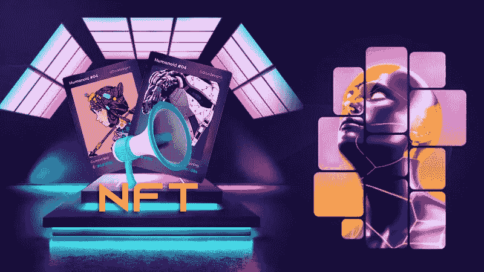

金融时报市场是制作加密条目最安全的地方。他们为未来创造了独特的可能性，这一点很容易在他们如何帮助销售数字艺术品中表达出来。但是，进入秘密城镇的人很困惑。为什么是他们？答案是，他们仍在决定自己对未来的最终选择。

只有少数人能接受 NFT 市场是成功未来的关键。此外，那些想要一个交易平台的人无法前进。为什么？他们需要了解美国最好的 NFT 市场开发商。现在，我们在这里帮助他们列出使 NFT 市场发展与众不同的公司。现在让我们来看看它们。

## **15 强**最佳**NFT 市场发展公司**美国**美国**

**1。Chaincella
2。区块链 App 工厂
3。INORU
4。Appdupe
5。Turnkeytown
6。无限块技术
7。防腐蚀溶液
8。李维赫兹
9。Arateg
10。Maticz
11。我们总是
12。unisoft
13。上升最大值
14。常见解决方案
15。代码零点**

## [**# 1 chain cella**](https://www.chaincella.com/whitelabel-nft-marketplace-development?utm_source=medium&utm_medium=javarevisited&utm_campaign=Dishan)**(推荐)**

****

**NFT 市场发展**

**首先使用区块链的是 Chaincella。然而，为了满足客户的需求，该机构提供全面的端到端解决方案。音乐、房地产、体育、艺术、在线游戏和迷因的 NFT 是该机构的一些最佳服务，使人们以时尚的方式进入加密市场。Chaincella 知识渊博的员工可以帮助你开发一个清晰而富有想象力的想法&将其转化为吸引目标市场的视觉资产。**

**他们享受的服务:**

**🚀白牌 NFT 市场开发
🚀NFT 市场发展
🚀NFT 聚合器市场开发
🚀NFT 营销服务部
🚀NFT 代币开发
🚀NFT 艺术市场发展
🚀NFT 游戏平台开发服务
🚀NFT 赌注平台开发服务**

**为了产生最好的结果，Chaincella 还按照行业的要求和标准运作。为了让你的期望在市场上达到正确的位置，请利用顶级的 [**NFT 市场发展公司**](https://www.chaincella.com/?utm_source=medium&utm_medium=javarevisited&utm_campaign=Dishan) 、ChainCella 的服务。**

**对于许多选择该公司的人来说，服务成本总是成为决定性因素。这是因为它的专家以可承受的价格提供尖端的解决方案。所以，现在就行动吧，因为时间紧迫！**

## **[**#2 区块链 App 工厂**](https://www.blockchainappfactory.com/)**

**[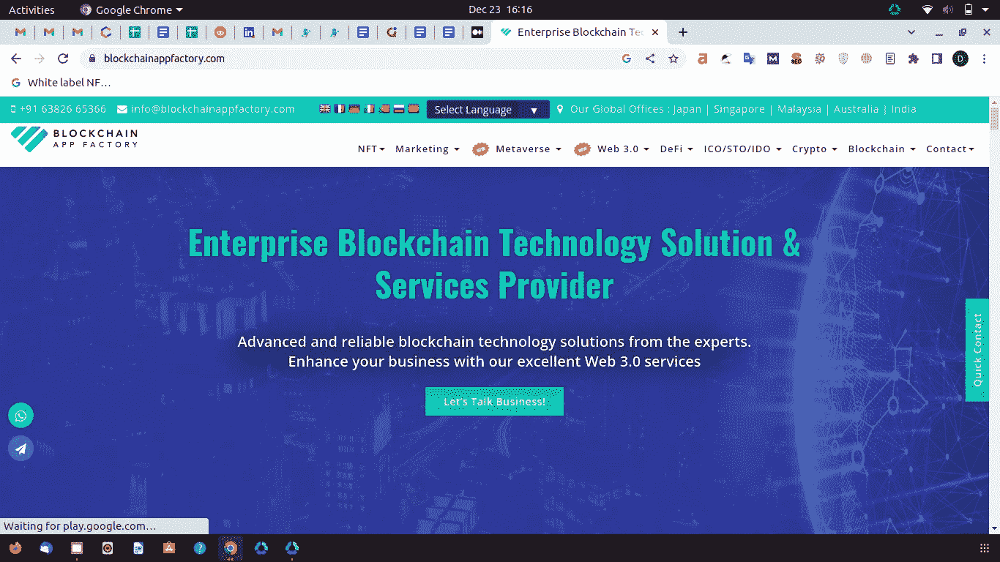](https://www.java67.com/2018/02/5-free-blockchain-technology-courses.html)**

**NFT 顶级市场开发机构之一 Blockchain App Factory 提供的不仅仅是开发。该业务为客户的密码和 NFT 创意提供简化的开发、生产和研究服务。**

**区块链 App 工厂已经完成了很多国内外的项目。该机构提供巧妙的建议，通过创新的数字营销活动成功打入您的目标市场并强化您的品牌。它帮助你跨越时间线移动你的业务，抓住全球观众。如果你心中有一个基于 Web3 的商业提案，那么区块链应用工厂是你正确的选择。**

## **[**#3 INORU**](https://www.inoru.com/)**

**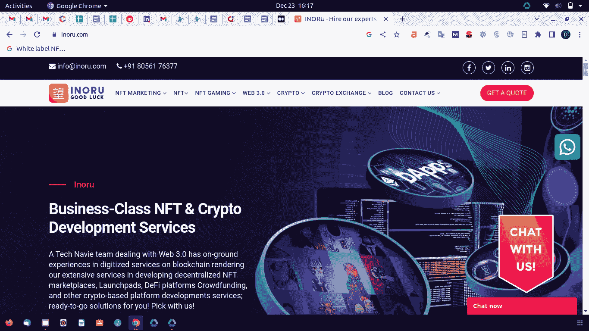**

**INORU 是一家在全球范围内开发 [NFT 平台](/javarevisited/5-best-websites-to-learn-nft-non-fungible-tokens-305a0570729a)的公司。其高度定制的解决方案是他们最好的资产。然而，通过大力强调三个关键要素——积极的分析方法、全渠道运营和不懈的战略执行——INORU 成为了市场领导者。**

**此外，为了确保您的成功，该机构会进行彻底的市场分析，并密切关注每个细节。其专家根据其业务的确切要求，精心打造市场上最好的药物。所以，试着用 INORU 令人兴奋的市场开发服务来吸引观众。**

## **[**#4 AppDupe**](https://www.appdupe.com/)**

**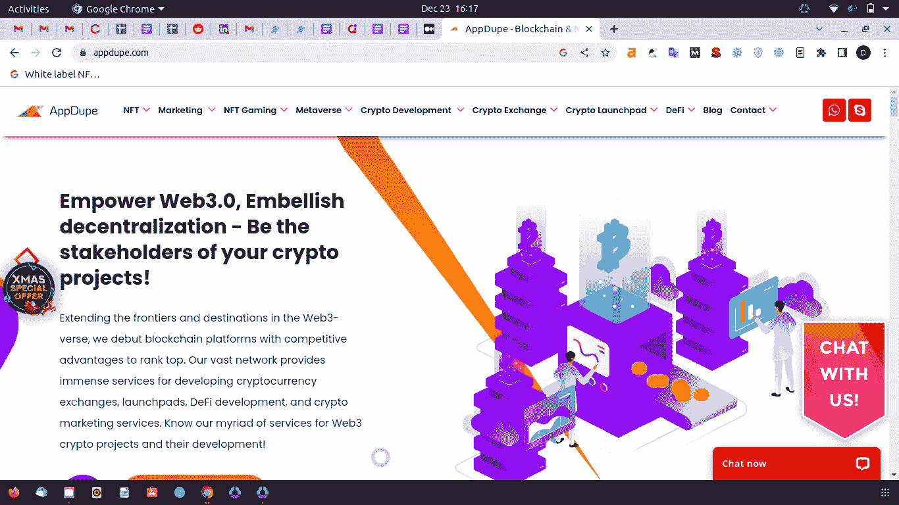**

**AppDupe 是一个不断努力创造杰出的 NFT，将无形和有形资产结合在一起的公司。为了帮助您的 NFTs 推进和目标客户，该机构提供专门的 NFT 市场开发服务。**

**在交易平台上市之前，该机构还为创作者提供服务，在区块链网络上标记他们的作品。此外，AppDupe 在知识渊博的专家团队的协助下创建创新的营销策略，以提高您的作品的价值。他们创造市场的方式帮助你占据上风。因此，用他们有效的服务来发展你的业务。**

## **[**#5 交钥匙小镇**](https://www.turnkeytown.com/)**

**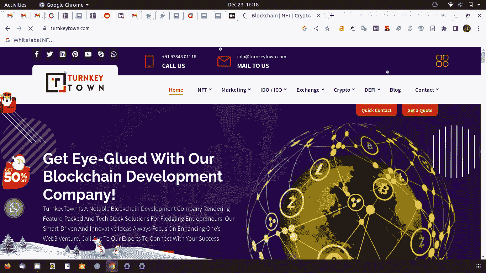**

**全球众多品牌选择 Turnkey Town 作为其首选的 [**NFT 市场开发**](https://www.chaincella.com/) 合作伙伴。其熟练的开发人员团队使用最新的区块链和令牌化标准构建独特的 NFT 市场。**

**该公司的一些尖端服务包括端到端的设计和开发、支持和维护，以及智能合同的开发和审计。选择交钥匙城镇，以激动人心的方式进入市场。**

## **[**#6 无限街区理工【IBT】**](https://www.infiniteblocktech.com/)**

**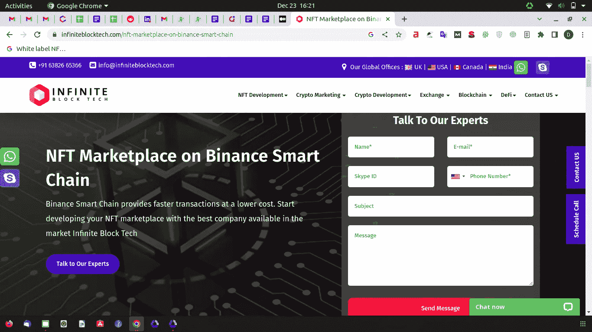**

**一家名为 Infinite Block Tech 的公司帮助美国领先的 NFT 平台开发公司获得 NFT 行业的尖端服务。**

**在其 NFT 开发创新的帮助下，它现在可以为各种行业提供 NFT 软件解决方案，包括媒体、网站、录制内容会员、服装、体育赛事、职业体育、投资管理、基础设施投资、P2P 贸易等。选择 IBT 有效服务的秘密成功之路。**

## **[**【7 号安特溶液】**](https://www.antiersolutions.com/)**

**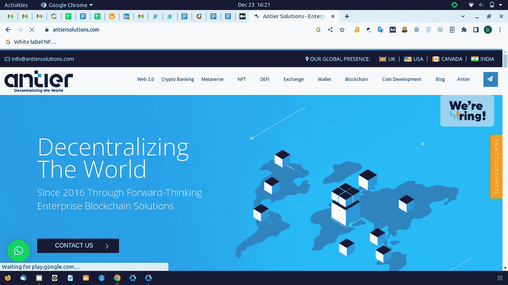**

**Antier 是一家领先的 NFT 市场开发商，在去中心化应用方面有着强大的影响力。它帮助公司创建自己的 NFT 市场，以协调由不可替代令牌支持的资产的提供、购买和交易。**

**该公司为各种资产类型提供按需定制的平台。不同的资产类别是艺术、音乐、房地产、域名、游戏、NFT 支持的贷款、数字内容、投资和抵押品。NFT 发展服务提供商提供了创建知名和成功的市场平台的克隆以复制其成功的能力。**

## **[**# 8 LeewayHertz**](https://www.leewayhertz.co)**

**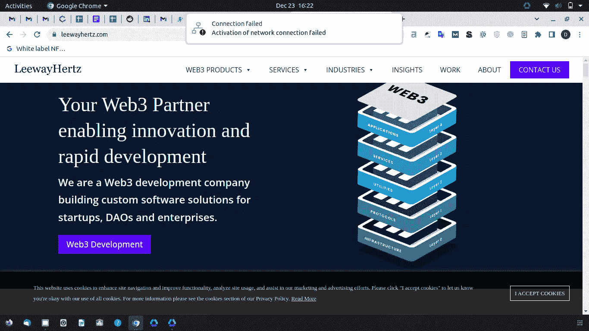**

**LeewayHertz 是一家经营了 10 年的公司，它创建的 100 多个企业级数字平台被全球数百万人使用。数百万用户有一个平台来展示他们的 NFT，这要归功于它的现成的 NFT 市场，这也帮助 NFT 爱好者推出他们自己的 NFT 市场。其 NFT 市场服务于一系列市场，包括艺术、游戏、音乐、数字收藏品、体育和房地产市场。它是最有声誉的 NFT 发展公司之一。**

## **[**# 9 Arateg**](https://arateg.co)**

**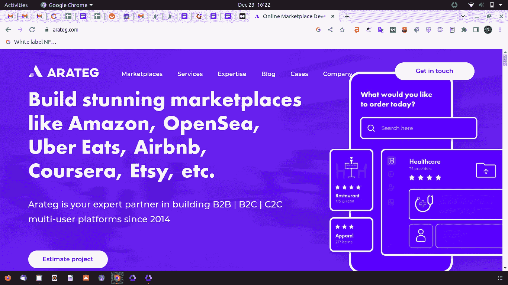**

**Arateg 是世界上最著名的区块链开发公司之一。一群有多年经验的专家管理着它。它们提供了出色的用户界面和改进的安全性来保证平台的安全。Arateg 为个人、创业公司和组织提供端到端的服务，并拥有一个团队来顺利、高效地实施复杂的项目。选择你的 NFT 平台，与他们的团队一起统治加密的未来。**

## **[**#10 马蒂奇**](https://maticz.com/)**

**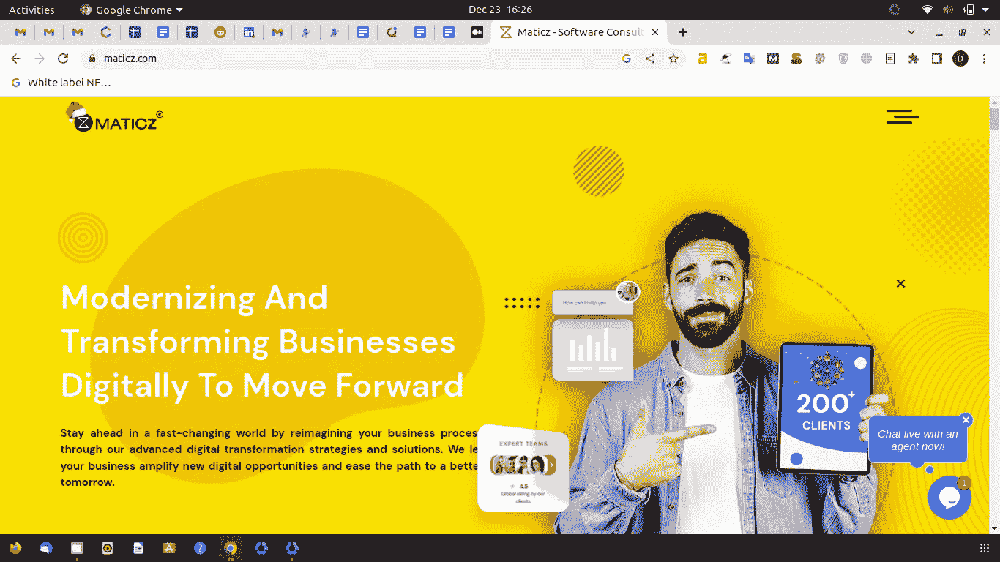**

**Maticz 已经存在了五年多，雇佣了 50 多名员工。该公司为艺术、音乐、游戏、房地产和其他数字收藏品提供特定领域的 [**NFT 市场开发解决方案**](https://www.chaincella.com/) 。**

**众所周知，该公司为客户开发的每一款应用都包含了在一周内推出的关键功能。该公司克隆的最著名的应用程序是 Rarible、OpenSea、Axie Infinity、分散式土地、金恩和 Xeno。**

## **[**# 11**](https://www.alwin.in)**

**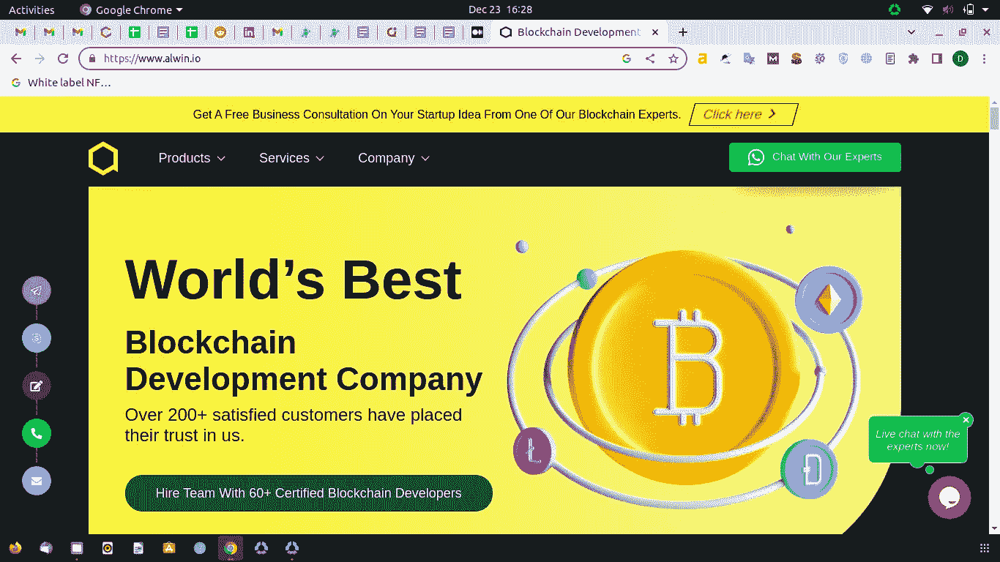**

**最著名的 NFT 市场开发公司 Alwin Technologies 提供专业服务来满足客户需求。它有一个由区块链和以太坊专家组成的独立团队，为组织和个人开发一流的、面向市场的 NFT 平台。**

## **[**# 12 unisoft**](https://unicsoft.io)**

****

**凭借超过 15 年的电子商务经验和超过 5 年的区块链经验，Unicsoft 可以提供您所需的一切，以创建用户友好、开放和功能丰富的 NFT 市场，或将 NFT 技术集成到您当前的市场。它的团队打造最适合您需求的平台。所以，选择他们以终极的准确性进入市场。**

## **[**#13 瑞星 max**](https://risingmax.in)**

****

**RisingMax 是一家顶级的 NFT 市场开发公司，为希望创建最佳 NFT 市场的个人、企业和初创公司提供全面的服务。鉴于 RisingMax 在帮助企业适应现代技术方面的良好声誉，它在各种领域发挥作用，并为创建独特的市场提供支持，这并不奇怪。选择他们来拓展你的全球业务。**

## **[**#14 Suffescom 解决方案**](https://www.suffescoms.in)**

**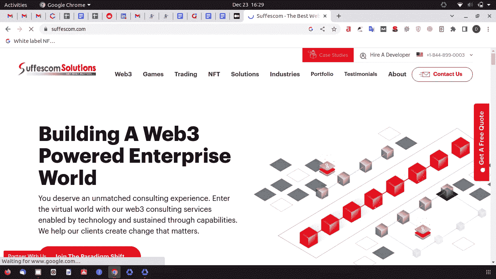**

**Suffescom Solutions 是一家著名的 NFT 代币开发服务提供商，正在帮助许多需要 NFT 市场开发帮助的企业主。该公司的网站强调高质量的可交付成果、以客户为中心的战略、诚实和透明。Suffescom 提供广泛的综合服务来构建 NFT 市场，从 Rarible、SuperRare 或 OpenSea 开始。**

## **[**#15 代码零点**](https://www.codezeros.io)**

**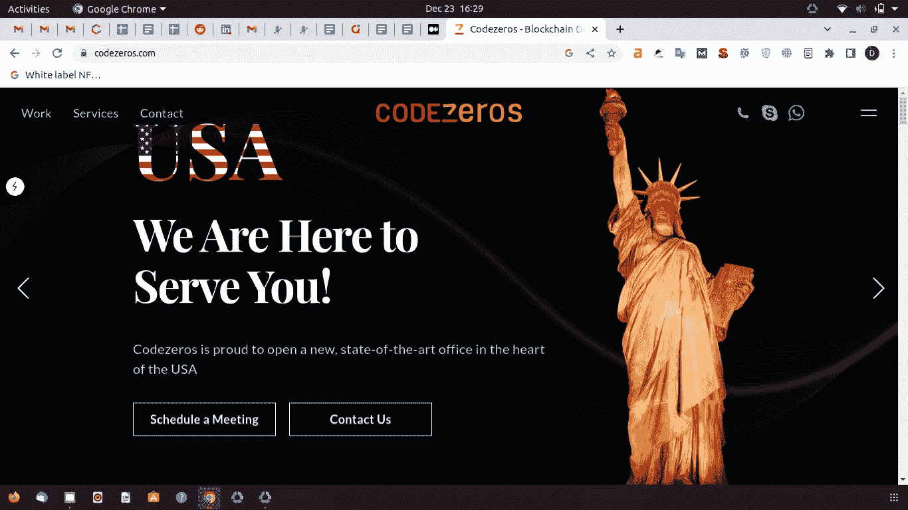**

**有了 Codezeros，你可以开始一个专门的或包罗万象的 NFT 代币市场。他们是最好的 NFT 市场开发服务提供商和领先的 NFT 市场开发公司。为了销售特定的利基数字资产，从游戏库存到娱乐业，Codezeros 可以帮助您创建和推出 NFT 市场。它的开发人员擅长提供基于加密的业务解决方案，可以帮助您在合理的时间内创建安全、独立的 NFT。**

## ****包装完毕！****

**NFT 市场平台开发可能是一项难以置信的任务，启动你在 Web3 领域的风险投资。为了使平台完美地被不同地雕刻，你需要市场开发公司的帮助。因此，从上面的列表中了解美国不同的 NFT 市场发展公司，并开始你的跨行业业务。**