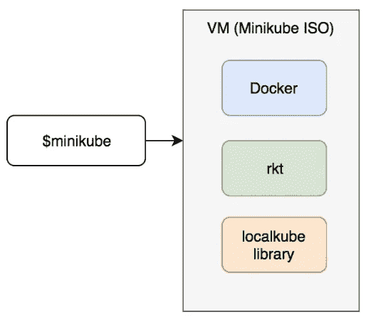
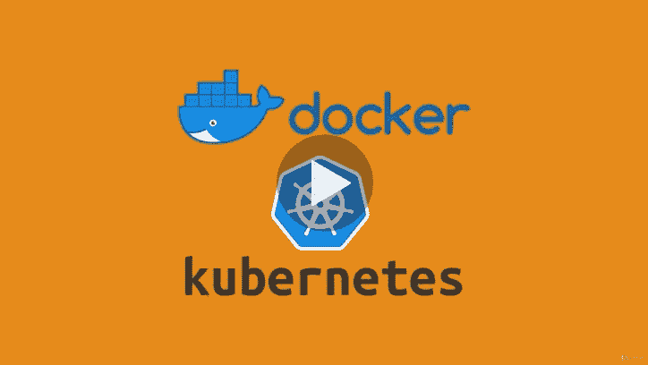
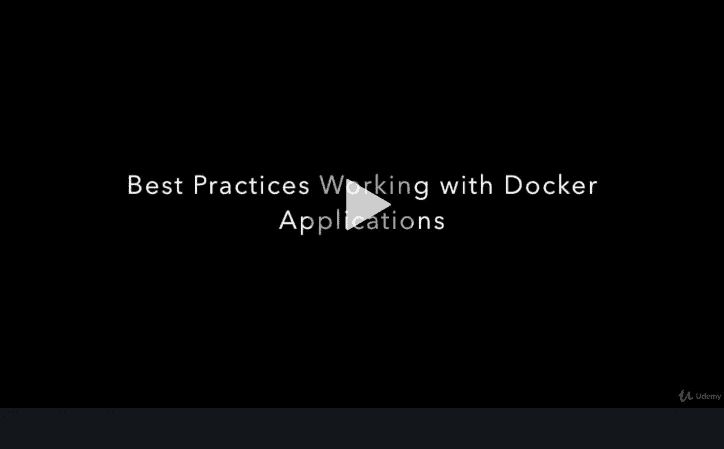
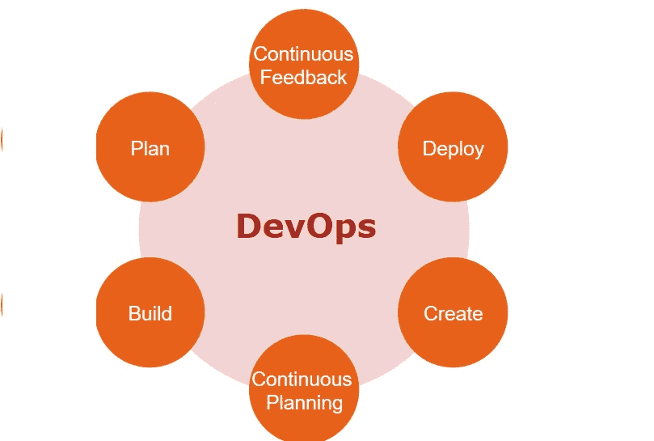
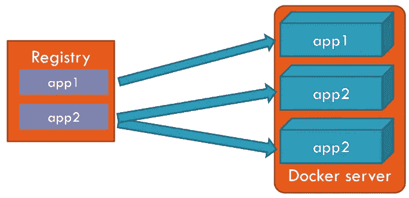
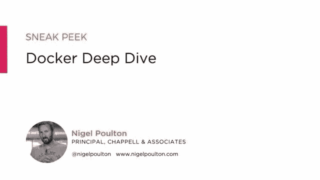
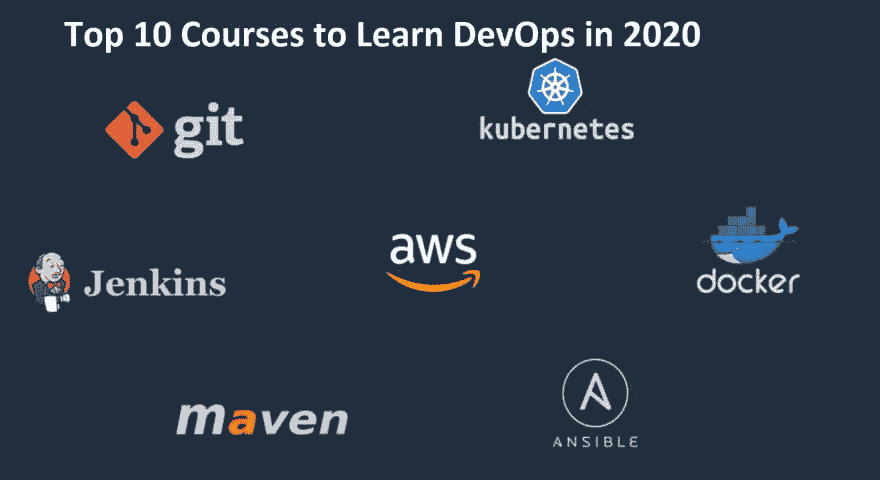
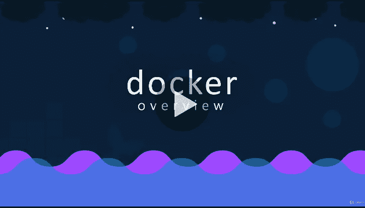
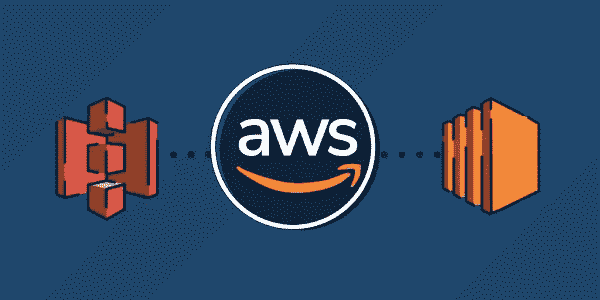
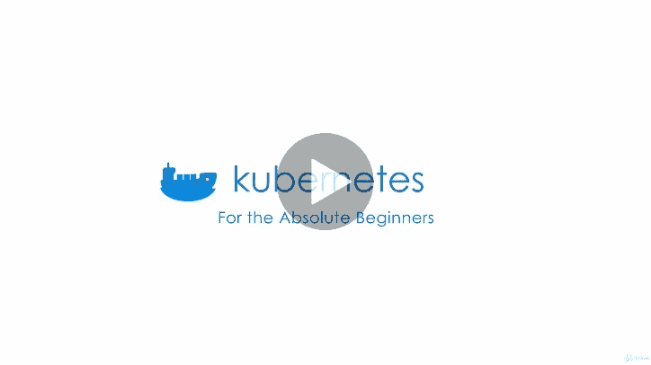

# 2023 年学习 Docker、Kubernetes 和 AWS 的 15 大在线课程

> 原文：<https://medium.com/javarevisited/top-15-online-courses-to-learn-docker-kubernetes-and-aws-for-fullstack-developers-and-devops-d8cc4f16e773?source=collection_archive---------0----------------------->

大家好，你可能听说过 Docker 和 Kubernetes 周围的嗡嗡声。它们从根本上改变了开发和部署过程，并被各种规模的软件团队所采用，这是有充分理由的。

Docker 使得使用容器来创建、部署和运行应用程序变得相当容易，Kubernetes 通过为您管理容器并在需要时扩展您的应用程序，将它推向了一个新的高度。

我今年的目标之一是掌握 Docker 和 Kubernetes，你呢？我相信你在今年开始的时候已经制定了目标，但是如果没有，你仍然可以看看[2023 年 Java 开发人员可以学习的 10 件事](https://javarevisited.blogspot.com/2017/12/10-things-java-programmers-should-learn.html#axzz5atl0BngO)。

永远不会太晚。根据我与许多软件开发人员交流的经验，DevOps 似乎是许多程序员的头等大事。我收到了很多关于如何学习两个最流行的 DevOps 工具 [Docker](https://javarevisited.blogspot.com/2018/02/10-free-docker-container-courses-for-Java-Developers.html) 和 [Kubernetes](https://javarevisited.blogspot.com/2019/01/top-5-free-kubernetes-courses-for-DevOps-Engineer.html) 的询问、邮件和聊天。

说到学习，没有什么能打败个人训练，但这并不总是可行的；因此，我们需要依靠书本和在线课程的自学，这也是我在这篇文章中向你建议的。

直到几年前，我还是一个书迷，但是现在，我使用越来越多的在线课程来跟上新技术。它们似乎更好地涵盖了技术中 20%的重要部分，这部分技术在 80%的时间里都在使用。

不管怎样，如果你不知道 Docker 和 Kubernetes 是什么，在我建议你 2023 年学习 Docker 和 Kubernetes 的一些在线课程之前，我先给你简单总结一下。

简而言之， [Docker](http://www.java67.com/2018/02/5-free-docker-courses-for-java-and-DevOps-engineers.html) 是一个容器，您可以在其中运行您的应用程序，而无需担心硬件和操作系统版本，这使得您可以轻松地剥离新环境，而无需担心配置细节。它提供了容器和命令行工具来管理这些容器，而 Kubernetes 是一个容器编排系统，可以有效地管理您的容器。

Kubernetes 可以说是世界上最重要的容器管理技术，在有许多容器需要管理的真实生产环境中被大量使用。

从可伸缩性的角度来看，有效地管理您的资源是必不可少的。即使它不是来自谷歌，它的起源是。它是由在谷歌从事类似工具工作的工程师作为开源软件开发的。你可以理解，如果它能在谷歌的规模上工作，它肯定经过了很好的尝试和测试。

在这篇文章中，我将分享一些来自 Udemy 的最好的在线课程，以学习 Docker 和 Kubernetes，但如果你很着急，只想参加一门课，那么斯蒂芬·格里德(Stephen Grider)的 [**Docker 和 Kubernetes:完全指南**](https://click.linksynergy.com/deeplink?id=JVFxdTr9V80&mid=39197&murl=https%3A%2F%2Fwww.udemy.com%2Fdocker-and-kubernetes-the-complete-guide%2F) 是最好的开始。

# 学习 Docker、AWS 和 Kubernetes 的 15 个最佳在线课程

在不浪费你更多时间的情况下，这里是我列出的 2023 年学习 Docker 和 Kubernetes 的一些最佳课程。这些课程是由 DevOps 领域的一位专家创建的，他拥有使用这些工具的实际经验。

## [1。Docker 和 Kubernetes:完全指南](https://click.linksynergy.com/deeplink?id=JVFxdTr9V80&mid=39197&murl=https%3A%2F%2Fwww.udemy.com%2Fdocker-and-kubernetes-the-complete-guide%2F)

这是与 Docker 和 Kubernetes 一起学习 DevOps 的综合课程之一。在本课程中，您将学习如何使用 Kubernetes 构建、测试和部署 Docker 应用程序。

课程从零开始，也就是说，不需要以前使用 Docker 或 Kubernetes 的经验。在这个过程中，您将使用 [Github](https://javarevisited.blogspot.com/2018/01/5-free-git-courses-for-programmers-to-learn-online.html) 、Travis CI 和 [AWS](https://javarevisited.blogspot.com/2019/05/top-5-courses-to-crack-aws-solutions-architect-associate-certification-exam-SAA-C01.html) 从头开始构建 CI + CD 管道。

通过构建一个复杂的应用程序，您不仅会理解 Kubernetes 的目的和理论，还会掌握 Docker CLI 来检查和调试运行中的容器。

## 2. [Docker 速成班，面向忙碌的开发人员和开发者](https://click.linksynergy.com/deeplink?id=JVFxdTr9V80&mid=39197&murl=https%3A%2F%2Fwww.udemy.com%2Fdocker-tutorial-for-devops-run-docker-containers%2F)

这是在 Pluralsight 上学习 Docker 的另一个很棒的课程。在本课程中，你不仅会学到 Docker 和 containers 的基础知识，还会学到一些高级功能，如群模式、服务和堆栈。

您将从在最常见的开发和生产平台上安装 Docker 开始——Windows 和 Mac 笔记本电脑、Windows Server 和 [Linux](http://www.java67.com/2018/02/5-free-linux-unix-courses-for-programmers-learn-online.html) 。

本课程结束后，您将对 [Docker](https://hackernoon.com/10-free-courses-to-learn-docker-for-programmers-and-devops-engineers-7ff2781fd6e0) 的基础知识以及一些改变游戏规则的功能有一个坚实的理解。

## 3.[Docker(plural sight)入门](https://pluralsight.pxf.io/c/1193463/424552/7490?u=https%3A%2F%2Fwww.pluralsight.com%2Fcourses%2Fdocker-getting-started)

这是一个伟大的在线课程，学习从零开始由奈杰尔波尔顿 Docker。如果你不认识 Nigel，他是一名 Docker 船长和流行的技术作者。他以关于云原生技术(如 Docker 和 Kubernetes)的精彩视频和书籍而闻名。

在本课程中，您将学习如何在最常见的开发和生产平台上安装 Docker，包括 Windows 和 Mac 笔记本电脑、Windows Server 2016 和 Linux。
之后，您将了解容器和图像的一些基本概念，包括如何执行常见的管理任务。

您还将花费大量时间介绍 Docker 1.12 引入的所有新内容，包括群模式、服务、伸缩、滚动更新、堆栈和分布式应用程序包。

完成本课程后，您将开始使用 Docker 1.12 中宣布的一些改变游戏规则的改进，并对 Docker 的基础有一个坚实的理解。

## 4. [Docker for Developers(教育性)](https://www.educative.io/courses/docker-for-developers?affiliate_id=5073518643380224)

对于 Educative Team 的 Docker 程序员和开发人员来说，这是一个非常好的课程，Educative Team 是一个交互式编码平台，提供基于文本和图像的课程，可以加快学习速度。

如果你更喜欢基于文本的课程，那么这是 2023 年学习 Docker 的一个很好的课程，特别是对程序员和开发人员来说。

## 5.[Kubernetes 实用指南(教育性)](https://www.educative.io/courses/practical-guide-to-kubernetes?affiliate_id=5073518643380224)

这是 Educative 的另一门课程，你可以和上一门课程一起学习 Docker 和 Kubernetes。正如我所说的，如果你喜欢基于文本的、边做边学的方法，这个网站很棒。

阅读总是比观看更快，如果你厌倦了观看视频，你应该在 2023 年尝试这个平台进行在线学习。

在本课程中，您将从 Kubernetes 的基础知识和集群的主要组件开始。然后，您将学习如何使用这些组件来构建、测试、部署和升级应用程序，以及如何在部署应用程序后实现状态持久性。

作为一个平台，Educative 也有一些最好的课程来准备编码面试，比如[寻找编码面试:编码问题的模式](https://www.educative.io/collection/5668639101419520/5671464854355968?affiliate_id=5073518643380224)和[寻找系统设计面试](https://www.educative.io/collection/5668639101419520/5649050225344512?affiliate_id=5073518643380224)。

它还有很多免费资源，比如这个[免费 JavaScript 教程](https://www.educative.io/courses/introduction-to-javascript-first-steps?affiliate_id=5073518643380224)来学习基本技术。你可以免费注册这门课程，但如果你喜欢充分利用这个平台，我建议你去参加 [**教育订阅**](https://www.educative.io/subscription?affiliate_id=5073518643380224) ，每月花费**18 美元(现在有 50%的折扣)**，对于需要不断学习的程序员和软件工程师来说完全值得。

您还将学习如何保护您的部署和管理资源，这是开发运维的关键技能。

## 6. [Docker 深潜(Pluralsight)](https://pluralsight.pxf.io/c/1193463/424552/7490?u=https%3A%2F%2Fwww.pluralsight.com%2Fcourses%2Fdocker-deep-dive-update)

这是奈杰尔学习 Docker 的另一个奇妙的课程，尤其是如果你想深入学习 Docker。

在 Docker Deep Dive 中，你将从零到 Docker，学习你需要知道的一切，使你的职业生涯更上一层楼，并给你开始使用容器的信心。

如果您正在准备 Docker 认证助理考试</javarevisited/10-best-courses-and-practice-tests-to-crack-docker-certified-associate-dca-certification-exam-b0b21648df4e>**，本课程也是不错的选择，因为完成本课程后，您将为 Docker 认证助理考试中出现的大多数主题做好准备，并准备好使用容器。**

****

## **7.【Kubernetes 入门**

**对于希望在 2023 年学习 Kubernetes 的人来说，这是另一个很好的课程。这是前两个 Docker 课程的作者 Nigel Poulton 的另一个杰作。**

**在本课程中，您将学习 Kubernetes 的基础知识和“Kubernetes 之道”。首先，您将深入了解 [Kubernetes 架构](/javarevisited/10-best-kubernetes-courses-for-developers-and-devops-engineers-94c35cd3a2fd)，它的主要组件和服务是什么，以及它们是如何一起构建生产级容器基础设施的。**

**之后，您将学习如何在几个云平台上安装和部署 Kubernetes。最后，您将深入研究如何使用 pod、部署和服务。**

**本课程结束时，您将对 Kubernetes 及其工作原理有一个扎实的了解，并掌握部署 Kubernetes 集群和简单应用程序的技能。**

****

**顺便说一句，你需要一个 [**Pluralsight 会员**](https://pluralsight.pxf.io/c/1193463/424552/7490?u=https%3A%2F%2Fwww.pluralsight.com%2Fpricing) 才能进入这个课程，费用大约是每月 29 美元或每年 299 美元(14%的折扣)。**

**如果你没有 Pluralsight 会员资格，我鼓励你申请一个，因为它可以让你访问他们 5000 多门关于所有最新主题的在线课程，如前端和后端开发、机器学习等。它还包括交互式测验、练习和最新的认证材料。**

**这更像是软件开发人员的网飞，因为学习是我们工作的一个重要部分，Pluralsight 会员资格是在竞争中保持领先的一个很好的方式。**

**Pluralsight 还有一个 [**10 天的免费试用期**](http://pluralsight.pxf.io/c/1193463/424552/7490?u=https%3A%2F%2Fwww.pluralsight.com%2Flearn) 没有任何承诺，这是一个很好的方式，不仅可以免费参加这个课程，还可以在加入 Pluralsight 之前检查课程的质量。**

**<http://pluralsight.pxf.io/c/1193463/424552/7490?u=https%3A%2F%2Fwww.pluralsight.com%2Flearn> ** 

## **8.[学习 DevOps:完整的 Kubernetes 课程](https://click.linksynergy.com/deeplink?id=JVFxdTr9V80&mid=39197&murl=https%3A%2F%2Fwww.udemy.com%2Flearn-devops-the-complete-kubernetes-course%2F)**

**这是深入学习 Kubernetes 的最佳在线课程。正如您已经知道的，Kubernetes 可以运行和管理您的容器化应用程序。**

**本课程将教你如何构建、部署、使用和维护 Kubernetes。**

**您将学习如何安装和配置 Kubernetes(在您的笔记本电脑/台式机上或在 [AWS](http://www.java67.com/2018/05/top-5-amazon-web-services-or-aws-courses-to-learn-online.html) 上的生产级集群上)。**

**学完本课程后，你应该能够在 [Kubernetes](https://javarevisited.blogspot.com/2019/05/top-5-courses-to-learn-docker-and-kubernetes-for-devops.html) 上运行无状态和有状态应用程序。**

****

## **9.[面向绝对初学者的 Docker 动手——devo PS](https://click.linksynergy.com/deeplink?id=JVFxdTr9V80&mid=39197&murl=https%3A%2F%2Fwww.udemy.com%2Flearn-docker%2F)**

**本课程提供了最著名的 DevOps 工具 Docker 的初级介绍。这门课程完全是动手操作，所以你不只是学习或听，而是做大量的练习来实际练习你所学的东西。**

**首先，您将通过动手练习学习基本的 [Docker 命令](https://javarevisited.blogspot.com/2018/02/10-free-docker-container-courses-for-Java-Developers.html)，然后您将学习如何使用 Docker 文件构建 Docker 映像。**

**您还将学习 Docker Swarm 和 Docker Compose，并使用 Docker Compose 文件构建应用程序堆栈。**

**简而言之，一个完整的 Docker 课程，适合初学者，有大量的动手练习。**

****

## **10.[AWS 的优点:穿过杂乱的东西](https://www.educative.io/courses/good-parts-of-aws?affiliate_id=5073518643380224)**

**这是学习实用 AWS 的最佳课程之一，你可以在网上找到。这个课程是由一位有着 15 年 AWS 工作经验的前亚马逊工程师创建的。**

**这不是典型的 AWS 参考课程。你不会在 AWS 文档中找到这里分享的大部分知识。这里的目标是帮助你认识到不使用 AWS 的哪些功能是愚蠢的——这些功能已经通过了时间的考验，是互联网上大多数东西的支柱。**

**在本课程中，你将学习一种技术，这种技术可以帮助你做出可靠的技术选择，而不会在面对如此多的选择时手足无措。你将从浏览 AWS 提供的最基本的服务开始，比如 DynamoDB、S3、EC2。每一部分都详细说明了它的用法、优缺点、为什么应该(或不应该)使用它，等等。**

****这里是报名参加本课程的链接—**[**AWS 的好部分:穿越杂乱**](https://www.educative.io/courses/good-parts-of-aws?affiliate_id=5073518643380224)**

****

**你可以购买这门课程，也可以获得教育会员资格来学习这门课程。如果你问我，我建议你购买<https://www.educative.io/subscription?affiliate_id=5073518643380224>**教育订阅，每月花费**【17 美元】**(现在打五折)，对于需要不断学习的程序员和软件工程师来说完全值得。感谢[教育团队](https://medium.com/u/163aa84775f6?source=post_page-----d8cc4f16e773--------------------------------)提供了这个精彩的课程。****

****本课程在 Gumroad 上也有电子书，如果你喜欢看书，那么你也可以看看 AWS 电子书中的 [**好的部分。如果你用这个链接买书，有 20%的折扣。**](https://gumroad.com/a/703100019/MsVlG?offer_code=javinpaul)****

****<https://gumroad.com/a/703100019/MsVlG?offer_code=javinpaul> **** 

## ****11.[面向绝对初学者的 Kubernetes 动手操作](https://click.linksynergy.com/deeplink?id=JVFxdTr9V80&mid=39197&murl=https%3A%2F%2Fwww.udemy.com%2Fcourse%2Flearn-kubernetes%2F)****

****Docker 提供了容器，但是如果你不管理它们，它们会很快变得很乱。Kubernetes 提供了一种管理它们的方法。****

****Kubernetes 已经成为最重要和最令人兴奋的集装箱管理平台之一，在本课程中，您将学习 Kubernetes 的基本原理和“Kubernetes 之道”****

****首先，您将学习 Kubernetes 体系结构，理解主要组件和服务，以及它们如何组合起来构建生产级容器基础设施。****

****之后，你将学习如何在几个云平台上安装和部署 Kubernetes，比如 [GCP](https://javarevisited.blogspot.com/2019/07/top-5-google-cloud-platform-gcp-courses-certifications-online.html) 、 [AWS](https://hackernoon.com/top-5-amazon-web-services-or-aws-courses-to-learn-online-free-and-best-of-lot-d94e192054b7) 和 [Azure](https://javarevisited.blogspot.com/2020/02/top-5-AZ-900-exam-Azure-Fundamentals-certification-practice-tests-and-mock-exams-to.html) 。最后，您将学习如何使用 pod、部署和服务。****

********

****学完本课程后，您将对 Kubernetes 及其工作原理有一个扎实的了解，并掌握部署 Kubernetes 集群和简单应用程序的技能。****

****以上是关于 Docker 和 Kubernetes 的一些最好的课程，它们是 [DevOps 工程师的两个最重要的工具](https://hackernoon.com/the-2018-devops-roadmap-31588d8670cb?gi=1490c6cb9f25)。正如我所说的，Docker 提供了一个容器，它现在已经成为部署应用程序的标准方式，因为它抽象了许多设置内容。不需要担心 OS、DB 版本等不一致的问题。环境之间。****

****另一方面， [Kubernetes](https://dev.to/javinpaul/top-10-courses-to-learn-docker-and-kubernetes-for-programmers-4lg0) 是最好的容器管理技术，如果您打算在生产中使用容器，您肯定会需要它。****

****这些课程都很好，但你应该选择更适合你的课程。我非常关注老师的风格，以及我是否能和他交流，因此我建议你参加这个课程，在那里你可以和老师交流。如果你只需要一门课，那就去上 [**Docker 和 Kubernetes:完全指南**](https://click.linksynergy.com/deeplink?id=JVFxdTr9V80&mid=39197&murl=https%3A%2F%2Fwww.udemy.com%2Fdocker-and-kubernetes-the-complete-guide%2F) **，仅仅是**学习 Docker 和 Kubernetes 的最好课程。****

****<https://click.linksynergy.com/deeplink?id=JVFxdTr9V80&mid=39197&murl=https%3A%2F%2Fwww.udemy.com%2Fdocker-and-kubernetes-the-complete-guide%2F>  

您可能喜欢的其他**编程资源**

*   [完整的 DevOps 开发者路线图](https://javarevisited.blogspot.com/2018/09/the-2018-devops-roadmap-your-guide-to-become-DevOps-Engineer.html)
*   [学习 Jenkins 自动化和开发运维的五大课程](https://javarevisited.blogspot.com/2018/09/top-5-jenkins-courses-for-java-and-DevOps-Programmers.html)
*   [面向 Java 和 DevOps 专业人员的 10 门免费 Docker 课程](https://javarevisited.blogspot.sg/2018/02/10-free-docker-container-courses-for-Java-Developers.html)
*   [5 门免费硒课程学习自动化测试](https://javarevisited.blogspot.sg/2018/02/top-5-selenium-webdriver-with-java-courses-for-testers.html)
*   [面向 Java 开发人员的 6 门 Maven 课程](http://www.java67.com/2018/02/6-free-maven-and-jenkins-online-courses-for-java-developers.html)
*   [2023 年 Java 开发人员应该学会的 10 件事](http://javarevisited.blogspot.sg/2017/12/10-things-java-programmers-should-learn.html#axzz53ENLS1RB)
*   【Java 开发者可以从 Spring 框架中学到的 3 个最佳实践
*   [2023 年 Java 开发人员应该学习的 10 个工具](http://www.java67.com/2018/04/10-tools-java-developers-should-learn.html)
*   [5 个自由弹簧框架和 Spring Boot 课程](http://www.java67.com/2017/11/top-5-free-core-spring-mvc-courses-learn-online.html)
*   [面向 Java JEE 开发者的 5 大 Hibernate 和 JPA 课程](http://javarevisited.blogspot.sg/2018/01/top-5-hibernate-and-jpa-courses-for-java-programmers-learn-online.html)

感谢阅读到目前为止。如果你喜欢这些 Docker 和 Kubernetes 的课程，那么请分享给你的朋友和同事。如果您有任何问题或反馈，请留言。

**P. S.** —如果你正在寻找一些免费课程来开始你的 DevOps 之旅，并学习 Jenkins、Docker 和 Kubernetes 等基本工具，那么你应该看看这个为 DevOps 和程序员提供的免费 Jenkins、Docker 和 Kubernetes 课程 列表。

</javarevisited/top-10-free-courses-to-learn-maven-jenkins-and-docker-for-java-developers-51fa7a1e66f6> ****