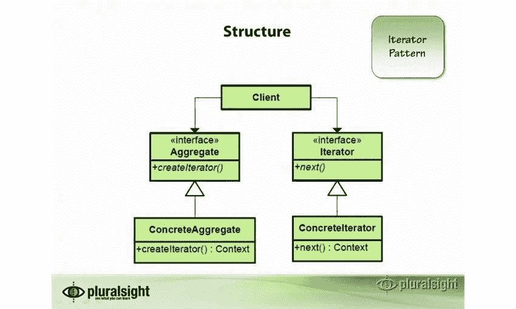
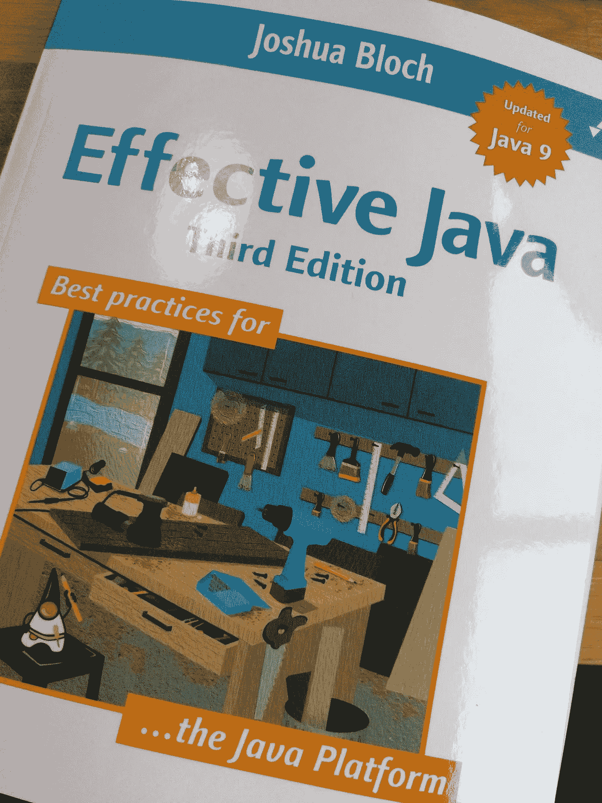
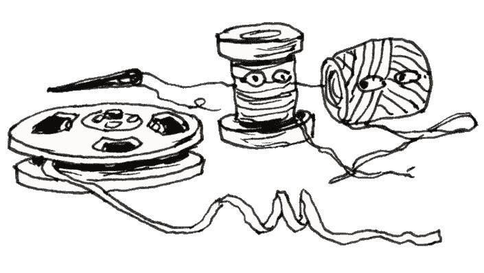
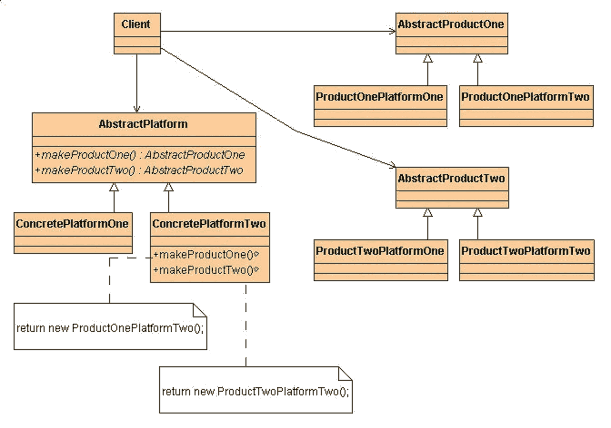
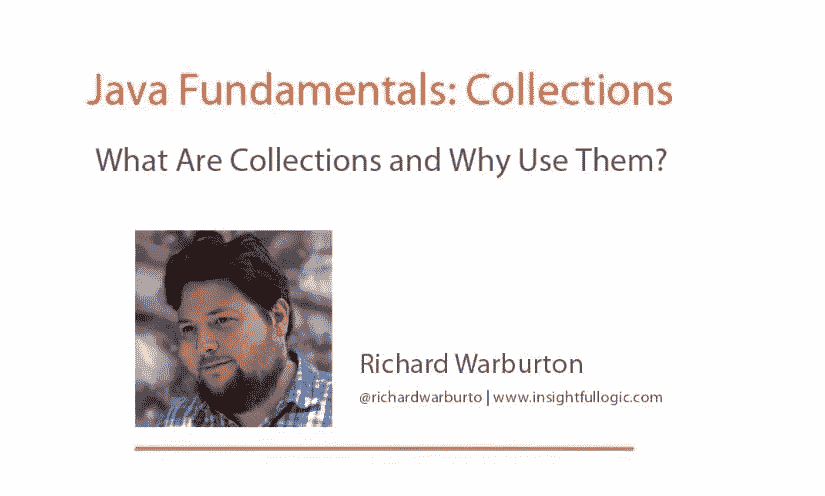
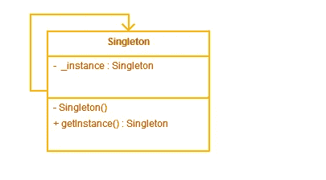
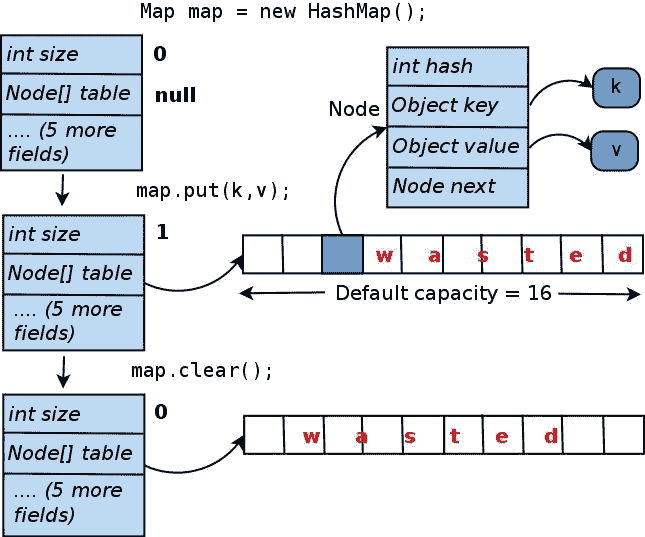
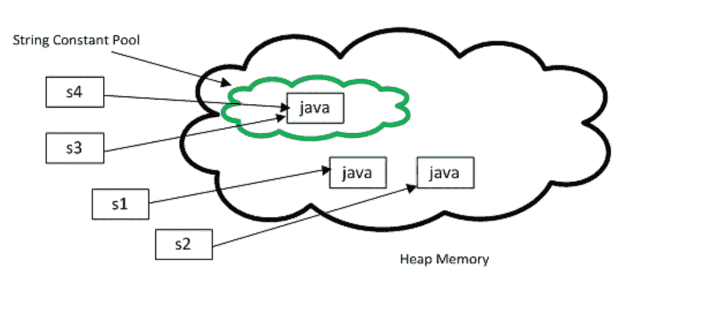

# 面向有经验开发人员的 20 大 Java 面试问题

> 原文：<https://medium.com/javarevisited/top-20-java-interview-questions-from-wall-street-banks-36ba58865681?source=collection_archive---------0----------------------->

## 为获得投资银行的工作准备 Java 面试？这里列出了 20 多个核心 Java 问题及其答案

[](http://bit.ly/2CupaSL)

有许多 Java 开发人员试图在巴克莱、瑞士瑞信银行、花旗银行等投资银行中担任 Java 开发职位。；尽管如此，他们中的许多人不知道在那里会遇到什么样的问题。

在本文中，我将分享投资银行和三年多经验的 Java 开发人员的一些常见问题。

是的，这些问题不适合[的大一新生](http://www.java67.com/2018/03/20-Java-Interview-Questions-Answers-freshers-1-2-3-YearsExperienced-Programmers.html)或 [1 到 2 年 Java 经验的专业人士，因为银行通常不会通过公开面试聘用他们；他们大多作为毕业实习生加入。](https://javarevisited.blogspot.com/2018/07/top-30-java-phone-interview-questions.html#axzz5N70xIF15)

**不保证你会得到这些问题；最有可能的是，你不会，但是这将会给你足够的想法，知道你会遇到什么样的问题。BTW，你准备的越多，你的准备就会越充分。**

顺便说一句，如果你认为 21 个还不够，你还需要看看这些额外的 [**40 个 Java 问题**](http://www.java67.com/2015/03/top-40-core-java-interview-questions-answers-telephonic-round.html) 用于电话面试，以及这些 [**200 多个 Java 问题**](http://bit.ly/2CupaSL) 来自过去五年。如果你喜欢看书，你也可以查看 [**搜索 Java 面试书**](http://Grokking the Java Interview) 我在那里分享了许多这样的问题，你甚至可以使用 friends20 代码获得 20%的折扣。

一旦你做到了这些，你就会更有信心参加任何 Java 面试，无论是电话面试还是面对面的面试。

无论如何，不浪费你更多的时间，让我们深入一些银行的标准 Java 面试问题，这些问题是我从一些参加这些银行面试的朋友和同事那里收集来的。

> 如果你不是媒体成员，我强烈推荐你加入媒体，阅读不同领域伟大作家的精彩故事。你可以**在这里加入介质**[](/@somasharma_81597/membership)

# **20 多个 Java 面试问题及答案**

**为了不浪费你更多的时间，我在这里列出了一些常见的核心 Java 面试问题。**

## **问题 1:在多线程环境中使用 HashMap 有什么问题？get()方法什么时候进入无限循环？([回答](http://java67.blogspot.com/2013/06/how-get-method-of-hashmap-or-hashtable-works-internally.html))**

**回答:嗯，没什么问题；这取决于你如何使用。例如，如果你用一个线程初始化一个 HashMap，然后所有的线程都从它那里读取数据，那就很好了。**

**一个例子是包含配置属性的**映射。****

**当至少有一个线程在更新 HashMap 时，即添加、更改或删除任何键-值对时，真正的问题就开始了。**

**由于 put()操作会导致重新调整大小，进而导致无限循环，这就是为什么您应该使用[哈希表](http://javarevisited.blogspot.com/2012/01/java-hashtable-example-tutorial-code.html)或[并发哈希表](http://javarevisited.blogspot.com/2013/02/concurrenthashmap-in-java-example-tutorial-working.html)，后者更好。**

## **问题 2。重写 hashCode()方法对性能没有任何影响吗？([回答](http://java67.blogspot.com/2013/04/example-of-overriding-equals-hashcode-compareTo-java-method.html))**

**这是一个很好的问题，据我所知，一个糟糕的 hash 代码函数会导致 HashMap 中的[频繁冲突，最终会增加将对象添加到 HashMap 中的时间。](http://javarevisited.blogspot.sg/2016/01/how-does-java-hashmap-or-linkedhahsmap-handles.html)**

**从 [Java 8](https://javarevisited.blogspot.com/2018/08/top-5-java-8-courses-to-learn-online.html) 开始，尽管碰撞不会像在早期版本中那样影响性能，因为在一个阈值之后,[链表](http://javarevisited.blogspot.sg/2017/07/top-10-linked-list-coding-questions-and.html#axzz4xXS86IVo)将被一个[二叉树](http://www.java67.com/2016/08/binary-tree-inorder-traversal-in-java.html)所取代，与链表的 O(n)相比，这将在最坏的情况下给你 O(logN) 的性能。**

## **问题 3:在 Java 中，不可变对象的所有属性都需要是 final 吗？([回答](http://javarevisited.blogspot.com/2013/03/how-to-create-immutable-class-object-java-example-tutorial.html))**

**不需要，正如链接的回答文章中所说，你可以通过*使一个成员成为非 final 但私有的，并且除了在构造函数中不修改它们，来实现同样的功能。***

**不要为它们提供 setter 方法，如果它是一个可变对象，那么永远不要泄漏该成员的任何引用。**

**记住[使一个参考变量成为 final](https://javarevisited.blogspot.com/2016/09/21-java-final-modifier-keyword-interview-questions-answers.html) ，只是确保它不会被重新分配一个不同的值。但是，您仍然可以更改引用变量指向的对象的单个属性。**

**这是关键点之一；面试官喜欢听候选人的意见。如果你想了解更多关于 Java 中 final 变量的知识，我推荐你加入 Udemy 上的 [**完整的 Java master class**](https://click.linksynergy.com/fs-bin/click?id=JVFxdTr9V80&subid=0&offerid=323058.1&type=10&tmpid=14538&RD_PARM1=https%3A%2F%2Fwww.udemy.com%2Fjava-the-complete-java-developer-course%2F)**，这是最好的实践课程之一。****

****[](https://click.linksynergy.com/fs-bin/click?id=JVFxdTr9V80&subid=0&offerid=323058.1&type=10&tmpid=14538&RD_PARM1=https%3A%2F%2Fwww.udemy.com%2Fjava-the-complete-java-developer-course%2F) [## 完整的 Java Masterclass(针对 Java 17 进行了更新)

### 你刚刚在网上偶然发现了最完整、最深入的 Java 编程课程。拥有超过 560，000 名学生…

udemy.com](https://click.linksynergy.com/fs-bin/click?id=JVFxdTr9V80&subid=0&offerid=323058.1&type=10&tmpid=14538&RD_PARM1=https%3A%2F%2Fwww.udemy.com%2Fjava-the-complete-java-developer-course%2F)**** 

## ****问题 String 内部的 substring()是如何工作的？([回答](http://javarevisited.blogspot.sg/2011/10/how-substring-in-java-works.html))****

****另一个不错的 Java 面试问题，我认为答案并不充分，但在这里是，“ *Substring 通过取原字符串的一部分，在源字符串之外创建一个新的对象。”*****

****问这个问题主要是想看看开发人员是否熟悉子字符串可能造成的[内存泄漏](https://pluralsight.pxf.io/c/1193463/424552/7490?u=https%3A%2F%2Fwww.pluralsight.com%2Fcourses%2Fjava-understanding-solving-memory-problems)的风险。****

****在 Java 1.7 之前，substring 保存原始字符数组的引用，这意味着即使是一个扩展的 5 个字符的子字符串，*也可以通过包含一个强引用来防止 1GB 字符数组被垃圾收集*。****

****这个问题在 Java 1.7 中得到了修复，其中不再引用原始的字符数组，但是这一改变也使得创建 substring 在时间上有点昂贵。早先它在 O(1)的范围内，在 Java 7 以后的最坏情况下可能是 O(n)。****

****顺便说一句，如果你想学习更多关于 Java 内存管理的知识，我推荐你去看看 Pluralsight 上[凯文·琼斯](https://medium.com/u/b779125ee2cb?source=post_page-----36ba58865681--------------------------------)的[了解 Java 虚拟机:内存管理](https://pluralsight.pxf.io/c/1193463/424552/7490?u=https%3A%2F%2Fwww.pluralsight.com%2Fcourses%2Funderstanding-java-vm-memory-management)课程。****

****[](https://pluralsight.pxf.io/c/1193463/424552/7490?u=https%3A%2F%2Fwww.pluralsight.com%2Fcourses%2Funderstanding-java-vm-memory-management) [## 了解 Java 虚拟机:内存管理

### 本课程涵盖了 Java 中垃圾收集的所有方面，包括内存如何分成代和…

pluralsight.pxf.io](https://pluralsight.pxf.io/c/1193463/424552/7490?u=https%3A%2F%2Fwww.pluralsight.com%2Fcourses%2Funderstanding-java-vm-memory-management) 

顺便说一下，你需要一个 [**Pluralsight 会员**](https://pluralsight.pxf.io/c/1193463/424552/7490?u=https%3A%2F%2Fwww.pluralsight.com%2Fpricing) 才能加入这个课程，费用大约是每月 29 美元或每年 299 美元(14%的折扣)。如果你没有这个计划，我强烈推荐你加入，因为它能促进你的学习，而且作为一名程序员，你总是需要学习新的东西。

或者，你也可以使用他们的 **1** [**0 天免费试用**](https://pluralsight.pxf.io/c/1193463/424552/7490?u=https%3A%2F%2Fwww.pluralsight.com%2Flearn) 免费观看本课程。

[](https://pluralsight.pxf.io/c/1193463/424552/7490?u=https%3A%2F%2Fwww.pluralsight.com%2Flearn) [## 为个人培养更好的技术技能| Pluralsight

### 培养从网络安全到软件开发等各方面的技能。然后利用这些技能…

pluralsight.pxf.io](https://pluralsight.pxf.io/c/1193463/424552/7490?u=https%3A%2F%2Fwww.pluralsight.com%2Flearn) 

## 问题 5:你能为 singleton 写一个临界区代码吗？([回答](http://javarevisited.blogspot.sg/2014/05/double-checked-locking-on-singleton-in-java.html))

这个核心 Java 问题是另一个常见的问题，希望候选人使用[双重检查锁定](http://www.java67.com/2015/09/thread-safe-singleton-in-java-using-double-checked-locking-pattern.html)编写 Java singleton。

记得使用一个[可变变量](http://javarevisited.blogspot.sg/2011/06/volatile-keyword-java-example-tutorial.html)来使单例[线程安全](http://www.java67.com/2016/04/why-double-checked-locking-was-broken-before-java5.html)。

下面是使用双重检查锁定习语的线程安全单例模式的关键部分的代码:

```
public class Singleton {private static volatile Singleton _instance;/** * Double checked locking code on Singleton 
    * @return Singelton instance 
*/public static Singleton getInstance() {if (_instance == null) {synchronized (Singleton.class) {if (_instance == null) {_instance = new Singleton();}}}return _instance; }}
```

同样，了解经典的设计模式，如 Singleton、Factory、Decorator 等也很有好处。如果你对这个感兴趣，那么这个 [**设计模式库**](https://pluralsight.pxf.io/c/1193463/424552/7490?u=https%3A%2F%2Fwww.pluralsight.com%2Fcourses%2Fpatterns-library) 就是那个的绝佳收藏。

[](https://pluralsight.pxf.io/c/1193463/424552/7490?u=https%3A%2F%2Fwww.pluralsight.com%2Fcourses%2Fpatterns-library)

## **问题 6:在编写存储过程或从 java 访问存储过程时，如何处理错误情况？** ( [回答](http://javarevisited.blogspot.com/2013/04/spring-framework-tutorial-call-stored-procedures-from-java.html))

这是*难回答的 Java 面试问题之一，*再次向大家开放；我的朋友不知道答案，所以他不介意告诉我。

我的观点是，如果某个操作失败，存储过程应该返回一个错误代码，但是如果存储过程本身失败，那么捕获 [SQLException](http://www.java67.com/2016/06/javasqlsqlexception-no-suitable-driver-found-jdbc-mysql-localhost-3306.html) 是唯一的选择。

[**有效 Java 第三版**](https://www.amazon.com/Effective-Java-3rd-Joshua-Bloch/dp/0134685997/?tag=javamysqlanta-20) 也有一些处理 Java 中错误和异常的好建议，值得一读。

[](https://www.amazon.com/Effective-Java-3rd-Joshua-Bloch/dp/0134685997/?tag=javamysqlanta-20)

## **问题 Executor.submit()和 Executer.execute()方法有什么区别？** ( [答](http://java67.blogspot.com/2012/08/5-thread-interview-questions-answers-in.html))

这个 Java 面试问题来自我的[Java 多线程问题答案 50 强](http://javarevisited.blogspot.sg/2014/07/top-50-java-multithreading-interview-questions-answers.html#axzz4jaJmaqbE)列表；由于对一个具有良好并发技能的 Java 开发人员的巨大需求，它变得日益流行。

这个 Java 面试问题回答了前者返回一个 [Future](http://javarevisited.blogspot.sg/2015/06/how-to-use-callable-and-future-in-java.html#axzz4tUeeQOAU) 的对象，该对象可用于从一个工作线程中查找结果

在观察异常处理时有所不同。如果您的任务抛出一个异常，并且是在执行该异常时提交的，将转到未捕获的异常处理程序(如果您没有显式提供一个异常处理程序，默认处理程序将只把堆栈跟踪打印到 System.err)。

如果你用`submit()`方法提交任务，任何抛出的异常，[检查异常](http://javarevisited.blogspot.sg/2011/12/checked-vs-unchecked-exception-in-java.html)与否，都是任务返回状态的一部分。

对于使用 submitting 提交并以异常终止的任务，Future.get()将重新抛出这个异常，该异常包装在 ExecutionException 中。

如果您想了解更多关于未来、可调用和异步计算的知识，并将您的 Java 并发技能提升到一个新的水平，我建议您查看 Java 冠军 Heinz Kabutz 的 Bundle 课程中的 [**Java 并发实践。**](https://learning.javaspecialists.eu/courses/concurrency-in-practice-bundle?affcode=92815_johrd7r8)

[](https://learning.javaspecialists.eu/courses/concurrency-in-practice-bundle?affcode=92815_johrd7r8)

这是一门高级课程，基于经典的 [**Java 并发实践**](http://www.amazon.com/dp/0321349601/?tag=javamysqlanta-20) 一书，作者正是 [Brian Goetz](https://medium.com/u/9e6fd5717133?source=post_page-----80a2c405802----------------------) ，该书被认为是 Java 开发人员的圣经。这门课程绝对值得你花时间和金钱。由于并发性是一个强大而棘手的主题，所以将本书和课程结合起来是学习它的最佳方式。

## **问题 8:工厂和抽象工厂模式有什么区别？** ( [回答](http://javarevisited.blogspot.sg/2013/01/difference-between-factory-and-abstract-factory-design-pattern-java.html))

答:抽象工厂提供了一个更高层次的抽象。考虑不同的工厂，每个工厂从一个抽象工厂扩展而来，负责根据工厂的类型创建不同层次的对象。如由`AutomobileFactory`、`UserFactory`、`RoleFactory`等扩展的`AbstractFactory` 。每个工厂将负责创建该类型的对象。

如果您想了解更多关于抽象工厂设计模式的知识，那么我建议您查看 Java 课程中的[设计模式，它提供了优秀的、真实世界的示例来更好地理解模式。](https://click.linksynergy.com/fs-bin/click?id=JVFxdTr9V80&subid=0&offerid=323058.1&type=10&tmpid=14538&RD_PARM1=https%3A%2F%2Fwww.udemy.com%2Fdesign-patterns-java%2F)

下面是工厂和抽象工厂模式的 UML 图:

[](https://pluralsight.pxf.io/c/1193463/424552/7490?u=https%3A%2F%2Fwww.pluralsight.com%2Fcourses%2Fpatterns-library)

如果你需要更多的选择，那么你也可以看看我列出的[5 大 Java 设计模式](https://javarevisited.blogspot.com/2018/02/top-5-java-design-pattern-courses-for-developers.html)课程。

**问题 9:什么是独生子女？是让整个方法同步好还是只让临界段同步好？** ( [回答](http://javarevisited.blogspot.com/2012/12/how-to-create-thread-safe-singleton-in-java-example.html))
Java 中的 Singleton 是整个 Java 应用中只有一个实例的类，比如`java.lang.Runtime`就是一个 Singleton 类。

在 Java 4 之前，创建 Singleton 是一件棘手的事情，但是一旦 Java 5 引入了 [Enum](https://javarevisited.blogspot.com/2011/08/enum-in-java-example-tutorial.html) ，事情就简单了。

你可以阅读我的文章[如何在 Java 中创建线程安全的 Singleton](http://javarevisited.blogspot.sg/2012/12/how-to-create-thread-safe-singleton-in-java-example.html)以获得更多关于使用枚举和双重检查锁定编写 Singleton 的细节，这是这个 Java 面试问题的目的。

**问题 10:你能在 Java 4 和 Java 5 中编写代码来迭代 HashMap 吗？** ( [答](http://java67.blogspot.com/2014/05/3-examples-to-loop-map-in-java-foreach.html) )
棘手的一个，但他还是设法用了 while 和 a for 循环来写。在 Java 中，有四种方法可以迭代任何地图；一种涉及使用 essential [Set()](http://www.java67.com/2016/05/keyset-vs-entryset-vs-values-in-java-map-example.html) 并迭代一个键，然后使用 [get()](http://www.java67.com/2013/06/how-get-method-of-hashmap-or-hashtable-works-internally.html) 方法检索值，这有点昂贵。

第二种方法涉及使用 [entrySet()](http://www.java67.com/2013/08/best-way-to-iterate-over-each-entry-in.html) 并通过对每个循环应用[或使用 Iterator.hasNext()方法对它们进行迭代。](https://javarevisited.blogspot.com/2015/09/java-8-foreach-loop-example.html#axzz5HKqzQNyN)

这是一个更好的方法，因为在迭代过程中键和值对象都是可用的，并且您不需要调用 [get()](http://javarevisited.blogspot.sg/2011/02/how-hashmap-works-in-java.html) 方法来检索值，这可以在一个桶中有一个巨大的[链表](http://www.java67.com/2017/06/5-difference-between-array-and-linked.html)的情况下提供 O(n)性能。

你可以进一步查看我的帖子 Java 中迭代 Map 的四种方法[以获得详细的解释和代码示例。](http://javarevisited.blogspot.com/2011/12/how-to-traverse-or-loop-hashmap-in-java.html)

## 问题 11:什么时候重写 hashCode()和 equals()？([回答](http://javarevisited.blogspot.com/2013/08/10-equals-and-hashcode-interview.html))

必要时，尤其是当您希望基于业务逻辑而不是对象相等性进行相等性检查时，例如，如果两个 employee 对象具有相同的值，则它们是相等的，即使它们是由代码的不同部分创建的两个不同的对象。

另外，[如果你想在](http://www.java67.com/2013/04/example-of-overriding-equals-hashcode-compareTo-java-method.html) [HashMap](http://www.java67.com/2017/08/top-10-java-hashmap-interview-questions.html) 中使用这两个方法作为键，那么重写这两个方法是必须的。

现在，作为 Java 中 equals-hashcode 契约的一部分，当您覆盖 equals 时，您也必须覆盖 hashcode；否则，您的对象将不会破坏类的不变量，例如 Set，Map，它依赖于 [equals()](http://javarevisited.blogspot.sg/2013/08/10-equals-and-hashcode-interview.html) 方法来正确运行。

你也可以查看我在 Java 中关于 equals 的五个[技巧](http://javarevisited.blogspot.com/2011/02/how-to-write-equals-method-in-java.html)来理解在处理这两种方法时可能出现的微妙问题。

**问题 12:如果不重写 hashCode()方法会出现什么问题？** ( [回答](http://java67.blogspot.sg/2013/04/example-of-overriding-equals-hashcode-compareTo-java-method.html) )
如果不替换 equals 方法，那么 equals 和 hashcode 之间的契约就不起作用，根据这两个被 equals()相等的对象必然有**相同的 hashcode** 。

在这种情况下，另一个对象可能返回不同的 hashCode，并将存储在那个位置，这破坏了 [HashMap 类](http://www.java67.com/2013/02/10-examples-of-hashmap-in-java-programming-tutorial.html)的不变性，因为它们不允许重复的键。

当您使用 put()方法添加对象时，它会遍历所有 Map。条目对象，如果映射已经包含该键，则更新先前映射的值。如果 hashcode 没有被覆盖，这将不起作用。

如果你想了解更多关于 equals()和 hashCode()在 Map 和 Set 之类的 Java 集合中的作用，我建议你去读一下 [Java 基础:集合](https://pluralsight.pxf.io/c/1193463/424552/7490?u=https%3A%2F%2Fwww.pluralsight.com%2Fcourses%2Fjava-fundamentals-collections)课程，由 [Richard Warburton](https://medium.com/u/4ab46c1e2074?source=post_page-----36ba58865681--------------------------------) 教授

[](https://pluralsight.pxf.io/c/1193463/424552/7490?u=https%3A%2F%2Fwww.pluralsight.com%2Fcourses%2Fjava-fundamentals-collections)

**问题 13:同步 getInstance()方法的临界段好还是同步整个 getInstance()方法好？** ( [回答](http://javarevisited.blogspot.com/2014/05/double-checked-locking-on-singleton-in-java.html) )
答案是唯一的关键部分，因为如果我们锁定整个方法，那么每次有人调用这个方法时，它都必须等待，即使我们没有创建对象。

换句话说，[同步](http://javarevisited.blogspot.sg/2011/04/synchronization-in-java-synchronized.html#axzz4sZOoYUxv)只在你创建一个对象的时候需要，它只发生一次。

一旦创建了对象，就不需要任何同步。就性能而言，这是非常糟糕的编码，因为同步方法将生产减少了 10 到 20 倍。

这里是[单例设计模式](https://javarevisited.blogspot.com/2011/03/10-interview-questions-on-singleton.html)的 UML 图:

[](http://bit.ly/2xZnIDC)

顺便说一下，在 Java 中创建线程安全的 singleton 有几种方法，包括 [Enum](http://javarevisited.blogspot.sg/2012/07/why-enum-singleton-are-better-in-java.html#axzz4tzMEHSJw) ，你也可以在这个问题或任何后续中提到它。

如果你想了解更多，你也可以查看 [**学习 Java 中的创造性设计模式**](http://bit.ly/2xZnIDC)——Udemy 的#免费课程。

[](http://bit.ly/2xZnIDC) [## 免费设计模式教程——学习 Java 中的创造性设计模式

### 你需要学习创造性设计模式的唯一课程！—免费课程

bit.ly](http://bit.ly/2xZnIDC) 

## 问题 14:在 HashMap 上的 get()操作中，equals()和 hashCode()方法出现在图片中的什么位置？([回答](https://javarevisited.blogspot.com/2017/08/top-10-java-concurrenthashmap-interview.html#axzz5ITbIGRsU))

这个核心的 Java 面试问题是上一个 Java 问题的后续，考生应该知道，一旦你提到 hashCode，人们很可能会问，它们是如何在 HashMap 中使用的。

当你提供一个关键对象时，首先调用它的 hashcode 方法来计算桶的位置。因为一个桶可能包含不止一个条目作为一个链表，所以使用 equals()方法来评估每一个`Map.Entry`对象，以查看它们是否包含关键的实际对象。

我强烈建议你阅读我的帖子，[**HashMap 如何在 Java 中工作**](http://javarevisited.blogspot.sg/2011/02/how-hashmap-works-in-java.html) ，这是另一个采访的故事，以了解关于这个主题的更多信息。

[](https://medium.com/javarevisited/10-free-courses-to-learn-java-in-2019-22d1f33a3915)

## 问题 15:Java 中如何避免死锁？([回答](http://javarevisited.blogspot.sg/2015/10/133-java-interview-questions-answers-from-last-5-years.html))

如果您知道，当两个线程试图访问彼此持有的两个资源时，就会发生死锁，但是要发生死锁，需要满足以下四个条件:

1.  互斥
    至少有一个进程必须处于不可共享模式。
2.  持有并等待
    一定有一个进程持有一种资源并等待另一种资源。
3.  不可抢占
    资源不能被抢占。
4.  循环等待
    一定存在一套流程

您可以通过打破*循环等待条件*来避免死锁。为此，您可以在代码中做出安排，将**排序**强加到锁的获取和释放上。

如果按照逻辑顺序获取锁，并按照相反的顺序释放锁，就不会出现一个线程持有一个被其他线程接收的锁的情况，反之亦然。

可以进一步看我的帖子， [**如何在 Java 中避免死锁**](https://javarevisited.blogspot.com/2018/08/how-to-avoid-deadlock-in-java-threads.html) 为代码示例，以及更详细的解释。

我还推荐[**josépau mard在**](https://pluralsight.pxf.io/c/1193463/424552/7490?u=https%3A%2F%2Fwww.pluralsight.com%2Fcourses%2Fjava-patterns-concurrency-multi-threading) **[Pluralsight](https://medium.com/u/50a6c7ef7431?source=post_page-----36ba58865681--------------------------------) 上发表的《将并发和多线程应用于常见的 Java 模式** ，以便 Java 开发人员更好地理解并发模式。

[](https://pluralsight.pxf.io/c/1193463/424552/7490?u=https%3A%2F%2Fwww.pluralsight.com%2Fcourses%2Fjava-patterns-concurrency-multi-threading)

## 问题 16:创建 String as new()和 literal 有什么区别？([回答](http://javarevisited.blogspot.com/2012/10/10-java-string-interview-question-answers-top.html))

当我们在 Java 中用 new()操作符创建一个 String 对象时，它被内置在一个堆中，不会被添加到字符串池中，而使用[文字](http://www.java67.com/2014/08/difference-between-string-literal-and-new-String-object-Java.html)创建的字符串是在字符串池本身中创建的，它存在于堆的 PermGen 区域中。

`String str = new String(“Test”)`

没有把对象 str 放在字符串池中，我们需要调用[字符串。Intern ()](https://javarevisited.blogspot.com/2015/12/when-to-use-intern-method-of-string-in-java.html) 方法，用来将它们显式地放入字符串池。

只有当你创建一个 String 对象作为 String literal，例如`String s = “Test”`时，Java 才会自动把它放入 String 池。

顺便说一下，这里有一个问题，因为我们将参数作为字符串文字“Test”传递，它还将在[字符串池](http://javarevisited.blogspot.sg/2016/07/difference-in-string-pool-between-java6-java7.html)上创建另一个对象作为“Test”。

这是一个要点，它一直没有被注意到，直到[javarestived](http://javarevisited.blogspot.com/)博客的知识渊博的读者提出来。要了解更多关于字符串文字和字符串对象之间的区别，请参见这篇文章。

下面这张美丽的图片很好地展示了这种差异:

[](https://medium.freecodecamp.org/review-these-50-questions-to-crack-your-java-programming-interview-69d03d746b7f)

## 问题 17:什么是不可变对象？你能写不可变的类吗？([回答](http://javarevisited.blogspot.in/2013/03/how-to-create-immutable-class-object-java-example-tutorial.html))

不可变类是 Java 类，其对象一旦创建就不能修改。对不可变对象的任何修改都会产生新的目的；比如 [String 在 Java](http://javarevisited.blogspot.sg/2010/10/why-string-is-immutable-in-java.html) 中是不可变的。

在 Java 中，大多数不可变类也是最终的，以防止子类覆盖方法，这会损害不变性。

通过将成员设为非 final 但[私有](http://javarevisited.blogspot.sg/2012/10/difference-between-private-protected-public-package-access-java.html)，并且除了在构造函数中之外不修改它们，可以实现相同的功能。

除了显而易见之外，您还需要确保您不应该暴露不可变对象的内部，主要是如果它包含可变成员的话。

类似地，当您从客户端(例如`java.util.Date`)接受可变成员的值时，使用 [clone()方法](http://javarevisited.blogspot.sg/2013/09/how-clone-method-works-in-java.html)为自己保留一个单独的副本，以防止恶意客户端在设置可变引用后修改它的风险。

在返回可变成员的值时需要采取同样的预防措施，返回另一个单独的副本给客户端，不要返回不可变类持有的原始引用。你也可以看我的帖子[如何用 Java](http://javarevisited.blogspot.sg/2013/03/how-to-create-immutable-class-object-java-example-tutorial.html) 创建一个不可变的类，一步一步的指导和代码示例。

## 问题 18:给出一个不使用任何分析工具，找出一个方法执行时间的最简单方法？([回答](http://javarevisited.blogspot.com/2012/10/10-java-string-interview-question-answers-top.html))

在调用方法之前和方法返回之后立即读取系统时间。以时差为例，它会给你一个计划执行所需的时间。

请记住，如果执行所用的时间过短，可能会显示它的性能消耗为零毫秒。在一个足够大的方法上尝试一下，从某种意义上说，这个方法正在进行大量的处理

## 问题 19:在 HashMap 中使用任何对象作为键需要实现哪两种方法？([回答](http://javarevisited.blogspot.com/2013/01/difference-between-identityhashmap-and-hashmap-java.html))

要在 HashMap 或 Hashtable 中使用任何对象作为 Key，它必须在 Java 中实现 [equals](http://www.java67.com/2012/11/difference-between-operator-and-equals-method-in.html) 和 [hashcode](http://javarevisited.blogspot.sg/2015/01/why-override-equals-hashcode-or-tostring-java.html#axzz55oDxm8vv) 方法。

你也可以阅读[HashMap 如何在 Java 中工作](http://javarevisited.blogspot.sg/2011/02/how-hashmap-works-in-java.html)以获得 equals 和 hashcode 方法如何用于从 HashMap 中放入和获取对象的详细解释。

**问题 20:你如何阻止客户直接实例化你的具体类？例如，您有一个缓存接口和两个实现类 MemoryCache 和 DiskCache。如何确保没有这两个类的对象是客户端使用 new()关键字创建的？**
我把这个问题留给你练习思考后再回答。我相信你能找到正确的方法来做到这一点，因为这是将类控制在你手中的关键决定之一，从维护的角度来看这很好。

**继续学习**

1.  [完整的 Java Masterclass](https://click.linksynergy.com/fs-bin/click?id=JVFxdTr9V80&subid=0&offerid=323058.1&type=10&tmpid=14538&RD_PARM1=https%3A%2F%2Fwww.udemy.com%2Fjava-the-complete-java-developer-course%2F)
2.  [Java 基础:Java 语言](https://pluralsight.pxf.io/c/1193463/424552/7490?u=https%3A%2F%2Fwww.pluralsight.com%2Fcourses%2Fjava-fundamentals-language)
3.  [为不耐烦的人准备的核心 Java SE 9](https://www.amazon.com/Core-Java-SE-Impatient-2nd/dp/0134694724?tag=javamysqlanta-20)
4.  [**200+ Java 面试题**](http://bit.ly/2CupaSL)
5.  [**搜罗 Java 面试宝典**](http://Grokking the Java Interview) (使用 code friends20 获得八折优惠)

# 结束语

太好了！！，你坚持到了文章的结尾…祝你的 Java 编程面试好运！这当然不容易，但是通过遵循这些问题，你离实现你的目标更近了一步。

如果你想知道我的新帖子，请考虑在 Medium 上关注我([**【javinpaul**](/@javinpaul)),并且不要忘记在 [**Twitter**](https://twitter.com/javinpaul) **上关注我！**

您可能喜欢的其他 **Java 文章**探索
[完整的 Java 开发人员路线图](https://javarevisited.blogspot.com/2019/10/the-java-developer-roadmap.html)
[Java 和 Web 开发人员应该深入学习的 10 件事](http://javarevisited.blogspot.sg/2017/12/10-things-java-programmers-should-learn.html#axzz53ENLS1RB)
[Java 开发人员应该了解的 10 个测试工具](http://javarevisited.blogspot.sg/2018/01/10-unit-testing-and-integration-tools-for-java-programmers.html)
[5 个框架 Java 开发人员应该深入学习的 5 门课程](http://javarevisited.blogspot.sg/2018/04/top-5-java-frameworks-to-learn-in-2018_27.html)
[学习 Java 中的大数据和 Apache Spark](http://javarevisited.blogspot.sg/2017/12/top-5-courses-to-learn-big-data-and.html)
[Java 开发人员学习 DevOps 的 10 条途径](https://javarevisited.blogspot.com/2018/09/10-devops-courses-for-experienced-java-developers.html)
每一个 Java 程序员都应该阅读
[Java 开发人员在日常工作中使用的 10 个工具](http://javarevisited.blogspot.sg/2017/03/10-tools-used-by-java-programming-Developers.html#axzz55lrMRnNC)
[成为更好的 Java 开发人员的 10 个技巧](https://javarevisited.blogspot.com/2018/05/10-tips-to-become-better-java-developer.html)

[](/javarevisited/what-next-for-senior-developers-in-tech-project-manager-technical-architect-or-a-devops-engineer-b532a80c9ba1) [## 高科技领域的高级开发人员下一步会做什么？项目经理、技术架构师或 DevOps 工程师

### 是时候考虑职业生涯的下一个层次了。

medium.com](/javarevisited/what-next-for-senior-developers-in-tech-project-manager-technical-architect-or-a-devops-engineer-b532a80c9ba1) [](/javarevisited/these-are-the-highest-paying-tech-jobs-programmers-can-aim-to-increase-their-pay-c59e1eeb6904) [## 这些是薪酬最高的技术工作，程序员可以提高他们的薪酬

### 以及获得这些工作所需技能的资源链接

medium.com](/javarevisited/these-are-the-highest-paying-tech-jobs-programmers-can-aim-to-increase-their-pay-c59e1eeb6904) [](/javarevisited/top-10-courses-to-learn-devops-for-experienced-programmers-d93b666db151) [## 有经验的程序员学习 DevOps 的 10 大课程

### DevOps 引擎的平均利润从 12 万美元到 15 万美元不等；成为 DevOps 的最佳时机…

medium.com](/javarevisited/top-10-courses-to-learn-devops-for-experienced-programmers-d93b666db151) 

> 如果你不是媒体成员，我强烈推荐你加入媒体，阅读不同领域伟大作家的精彩故事。您可以在此 处**加入介质**[](/@somasharma_81597/membership)****