# 2023 年美国、英国和印度 20 大 NFT 营销机构[更新]

> 原文：<https://medium.com/javarevisited/top-20-nft-marketing-agencies-in-usa-uk-india-2023-updated-3a7c72734abe?source=collection_archive---------5----------------------->

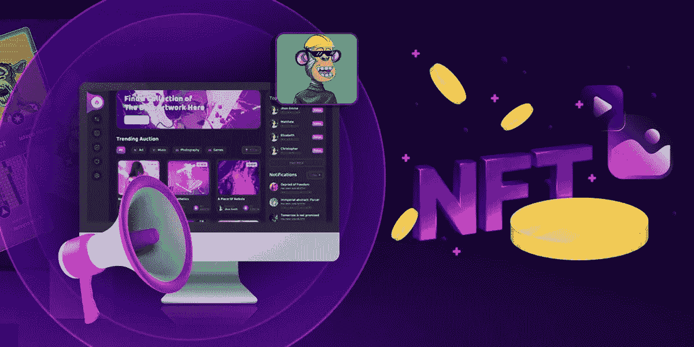

NFT 是在 NFT 市场交易的数字资产，web 3.0 的最新进展使它们成为加密世界的最佳顶点之一。从幼虫实验室的 CryptoPunks 到 Pak 的 Merge，我们已经看到不同的 NFT 在过去几年以破纪录的价格出售。当我们仔细分析历史上这些成功的非功能性交易时，我们会发现 NFT 营销在其声誉和成功中的独特作用。

因此，有效的 NFT 营销策略对 NFT 企业来说是至关重要的，以确保无缝和成功的商业旅程。也就是说，许多 NFT 营销机构已经跳入 NFT 营销圈，帮助加密企业家和企业主有效地推广和营销他们的项目。因此，在这篇博文中，让我们来看看 NFT 20 大营销机构，它们已经被证明能够提供最专业的 NFT 营销服务。

## **NFT 营销机构 20 强名单**

## **1。** [**INORU**](https://www.inoru.com/nft-marketing-services)

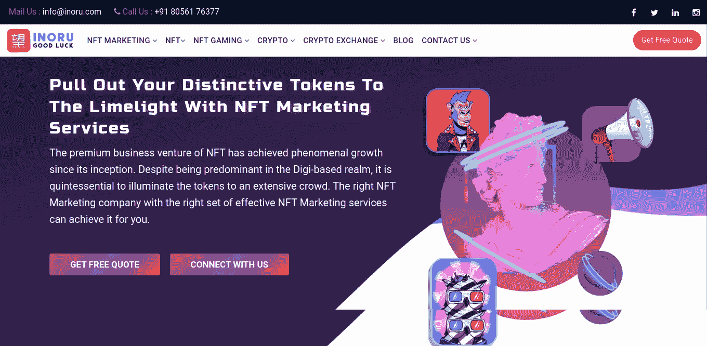

INORU 在处理与区块链技术、加密货币、分散平台开发和许多其他加密概念交织在一起的各种加密项目方面拥有超过 12 年的技术专长，是我们今天拥有的 NFT 顶级营销机构之一。他们专门为客户提供高度定制的营销服务，并在 250 多个独特的项目中有着出色的工作记录。

现在，让我们一起来看看 NFT 营销服务的清单。

**关键的 NFT 营销服务**

NFT 企业需要时尚和独特的营销策略，才能在 NFT 市场脱颖而出。了解这一现实后，Inoru 提供了一套独特的多功能 NFT 营销服务，从社交媒体营销到增长黑客战略。他们提供的一些最重要的营销服务如下:

**社交媒体营销服务**

Inoru 的社交媒体营销服务旨在提高品牌知名度和品牌认知度。他们进行彻底的营销分析，并提出一系列富有创意和机智的社交媒体内容和策略。这些服务是可定制的，并在 NFT 促销中证明是有效的。

**影响者 NFT 营销**

来自 Inoru 的影响者 NFT 营销服务旨在建立影响者与其客户的 NFT 项目之间的桥梁，并使他们在多个渠道上代表品牌。从做全面的市场分析到寻找有影响力的人，他们擅长迎合客户的需求。

**公关媒体营销**

他们的公关媒体营销解决方案专注于改善客户企业的品牌形象，并通过有效的工具协助他们进行公关营销。

**内容营销**

Inoru 的内容营销服务由训练有素的内容专家设计，总能与当前的 SEO 趋势产生共鸣，为客户带来可见性、有机流量和内容营销的其他好处。

**视频营销/创作**

视觉效果总是有可能左右目标观众。Inoru 的视频营销服务旨在帮助他们的客户为他们的目标观众创造有吸引力和信息丰富的视觉效果，并有效地推广他们的 NFTs。

**社区营销**

社区营销围绕着整合一个品牌和一个热情的社区。由于 Inoru 在围绕 NFT 项目创造必要的宣传和热情方面起着至关重要的作用，它提供了最好的社区营销服务之一。他们的社区营销服务侧重于帮助 NFT 品牌与最合适的社区和目标受众建立联系，并帮助他们赢得信誉。

也就是说，Inoru 其他一些卓越而有效的营销服务包括联盟营销、CRO 等。

因此，Inoru 的 NFT 营销解决方案融合了典型的 NFT 营销分析、全渠道运营和可靠的营销策略，带来了非凡的效果。

## **2。** [**AppDupe**](https://www.appdupe.com/nft-marketing-services)

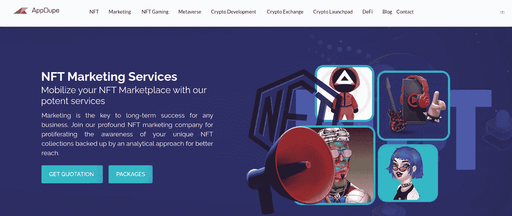

AppDupe 是美国最具创新性和最成功的 NFT 营销机构之一，其使命是在加密世界的各个领域开展工作。

这家 NFT 营销机构拥有一支由密码开发人员、设计人员和营销人员组成的庞大专业团队，他们在各种密码领域成功完成了 250 个项目。

Appdupe 成功推动了 40 多个 NFT 项目的 NFT 营销服务，以其为初创公司和企业主提供的经济高效、可定制的 NFT 推广服务而闻名。也就是说，Appdupe 提供的一些 NFT 营销服务包括 NFT 市场营销、加密艺术营销服务、NFT 社区营销等。

## 3.[切恩塞拉](https://www.chaincella.com/nft-marketing-service)

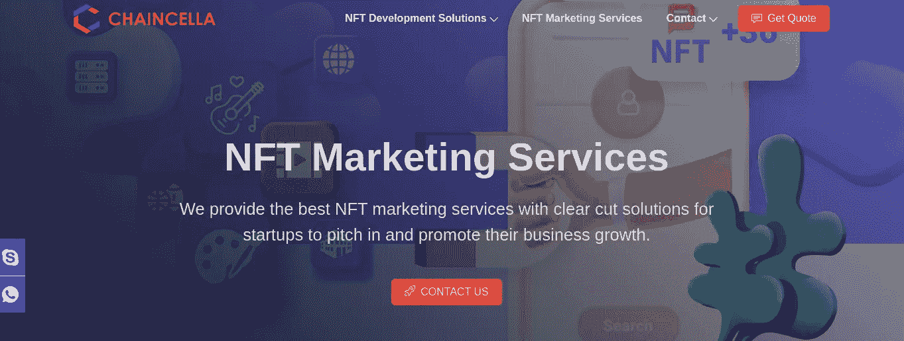

Chaincella 的使命是帮助 NFT 爱好者以独特的方式营销他们的 NFT，是世界上顶级的 NFT 营销机构之一。它拥有最优秀的专业团队，能够适应当前的营销趋势，为客户提供一流的 NFT 营销解决方案。

也就是说，这家 NFT 营销机构通过进行全面的营销分析来提供营销策略，然后使用尖端工具来改进客户的营销活动。他们专门从事一些最显著和最重要的 NFT 推广服务，包括电报营销、社会媒体营销、社区管理、电子邮件营销、视频营销等。,

## **4。交钥匙城镇**

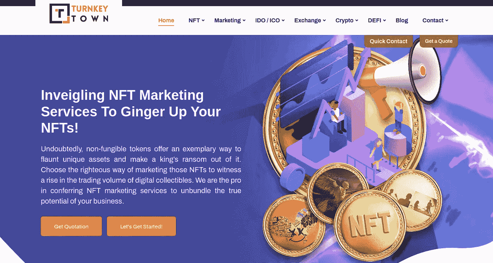

TurnkeyTown 是最好的 NFT 营销机构之一，他们专门提供加密，区块链和 NFT 营销领域的各种服务。凭借专业的专家团队，他们为 NFT 企业和初创企业提供高效的 NFT 营销服务，旨在设计最先进的工具来满足客户的需求。从营销分析到定制合适的 NFT 营销策略，他们提供轮廓分明的 NFT 促销活动。

也就是说，他们提供的一些最显著的 NFT 营销服务包括不和谐营销、社交媒体营销、NFT 收藏品营销、消息传递渠道、社区管理等。

## **5。区块链 App 工厂**

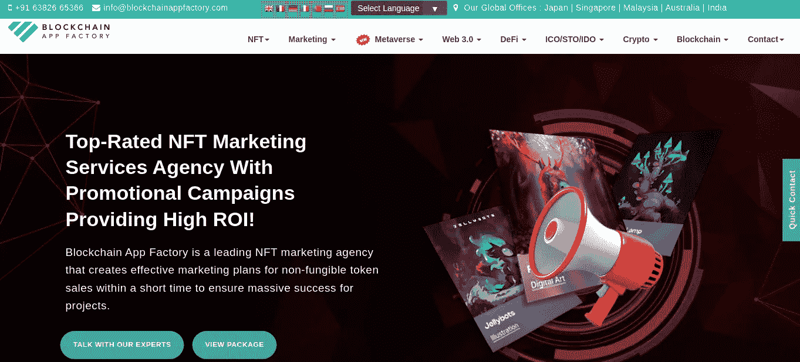

区块链应用工厂(Blockchain App Factory)的使命是追求由 web 3.0 推动的技术成熟，在处理 NFT 营销服务方面拥有超过 7 年的经验。它拥有在 200 多个不同的 NFT 项目中工作的记录，并且仍然是 NFT 最好的营销公司之一。

也就是说，区块链应用工厂拥有一支优秀的营销团队，为客户提供多样化的 NFT 营销服务。他们营销服务的专业知识可以从客户评价中找到。也就是说，唱片公司宣称他们的策略可以获得高投资回报率。他们提供的一些重要的 NFT 营销服务包括 NFT 内容营销、社交媒体营销、公关营销、CRO 等。

## **6。** [**无限闭塞技术**](https://www.infiniteblocktech.com/)

Infinite Block Tech 是一家区块链开发公司，提供一系列加密服务，并涉及区块链、NFTs、NFT 市场、DeFi、加密货币钱包开发等领域。

无限区块科技提供的 NFT 营销服务旨在整合营销的所有环节，并努力通过创新和有效的营销策略为客户实现营销成功。他们的 NFT 营销服务最初侧重于为其客户的 NFT 项目在 NFT 市场赢得知名度，然后，诱导他们的独特性。他们提供的一些最好的 NFT 推广服务如下:

✔ SEO 和内容营销
✔ NFT 营销
✔ Google 和 Facebook 广告
✔转化率优化等。,

## **7。月球战略**

Lunar Strategy 拥有经验丰富的营销专业人员，是一家以从事 web 3 和加密项目而闻名的加密数字营销机构。

也就是说，他们专注于通过竞争分析和定制营销解决方案为客户提供以结果为导向的 NFT 营销服务。

他们专门通过采用一系列 NFT 营销解决方案，如加密影响者营销、付费广告、社交媒体营销、影响者营销等，为客户建立强大的数字存在和品牌形象。

## **8。共装订**

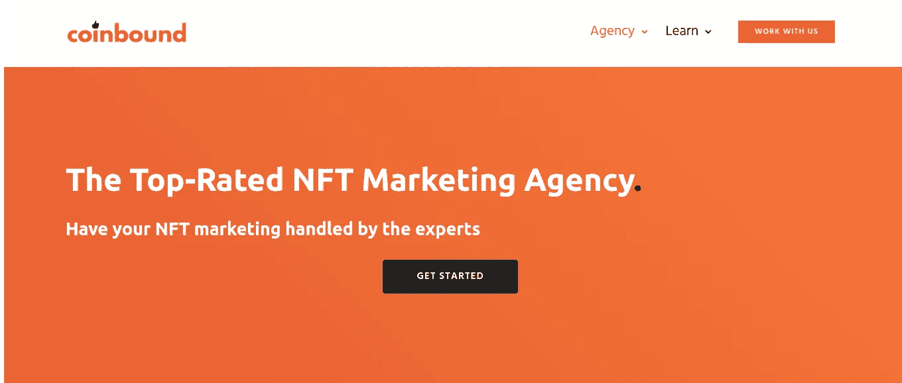

Coinbound 以围绕其客户的项目和 web 3 应用程序上的播客进行宣传而闻名，是加密界最著名和专业的 NFT 营销公司之一。这家机构成立于 2018 年，与 NFT 细分市场中一些最好、最大的出版商和有影响力的人有着密切的联系。

他们通过优秀的专业团队解决客户的营销问题，并帮助 NFT 品牌在 NFT 市场和其他加密平台上获得知名度

Coinbound 在帮助客户建立不和谐社区和其他平台方面拥有惊人的专业知识。

这家营销机构提供的一些最好的 NFT 推广服务围绕着 Twitter 管理、discord NFT 营销、影响者营销等。

## **9。众筹**

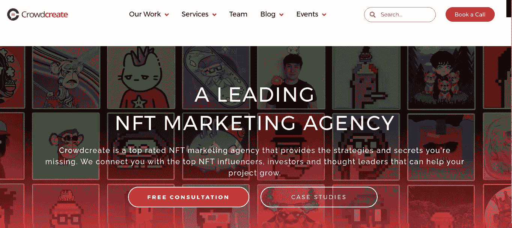

Crowdcreate 是最成功的 NFT 和加密营销机构之一。他们在区块链、NFT 和 web 3 应用程序中提供许多以结果为导向的营销服务。

也就是说，这家 NFT 营销机构以帮助客户寻找和联络加密领域的各种投资者、领导者和影响者而闻名。

一些最有效的 NFT 营销策略，他们设计给他们的客户带来成功，包括加密影响者营销，社区建设，付费广告，公关营销，加密投资者营销等。

## **10。单粒**

凭借在数字营销和 Web 3 营销策略方面超过 12 年的丰富经验，Single grain 是世界上最成功的 NFT 营销公司之一。

他们拥有一支优秀的营销团队，曾与亚马逊、Salesforce、优步等领先公司合作过，凭借深厚的知识和尖端的营销工具，他们提供最好的服务来满足客户的需求，并提供一流的 NFT 推广服务。

他们专注于数据驱动的 NFT 营销策略，他们使用的一些最佳策略包括 SEO 和内容营销、PPC(谷歌和 FaceBook 广告)、CRO 等。

也就是说，他们提供的一些最重要的 NFT 营销服务包括加密营销、NFT 公共广告和合作伙伴关系、社交媒体营销、NFT 影响者营销等。

## 11。Omni 机构

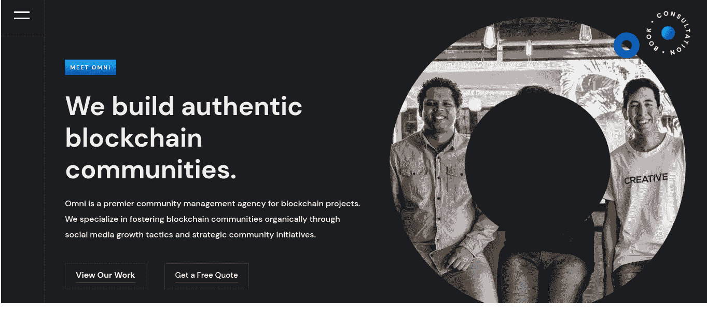

作为一家总部位于多伦多的公司，Omni NFT 机构是最专业的全栈数字营销机构之一。他们拥有一支在区块链、NFTs 等不同领域拥有 40 多年数字解决方案工作经验的专业团队，为 NFT 爱好者提供最好的 NFT 推广服务。

他们通过关注社区建设、社交媒体发展策略等来完成客户的 NFT 项目。

他们通过一系列步骤与客户合作来启动营销服务。。这些步骤包括入职培训、动员会、战略规划，以及最终创建一个供客户遵循的内容日历。

也就是说，他们提供的一些 NFT 营销服务包括:

☑市场调研
☑品牌开发
☑数字营销
☑ NFT 推广服务
☑ SEO 营销等，

## **12。CryptoPR**

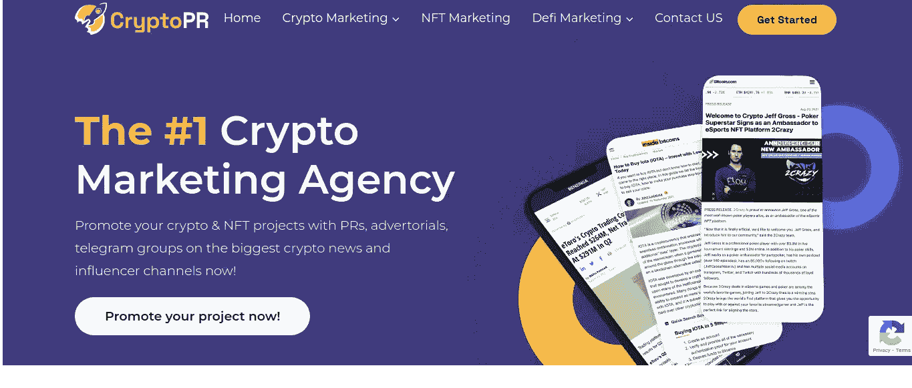

CryptoPR 是英国首批区块链、数字转型和 NFT 营销公司之一，他们专门为加密项目、企业和金融实体提供多种营销服务。

他们的客户组合中有许多著名的商业机构，如牛津大学、Avalanche、DukeDao、Coinsbank 等。

此外，凭借创新和专业的营销团队，他们总能帮助客户在 Telegram 投资者渠道中展示 NFT 项目，创造成功的活动，与著名的加密媒体机构、有影响力的人士等合作。

除此之外，他们的 NFT 营销和推广帮助他们的客户改善媒体关系，领导一代，并建立声誉。

通过这种方式，CryptoPR 在加密领域赢得了不容置疑的地位，可以提供多样化的 NFT 营销解决方案。

## 13。病毒国家

Viral Nation 成立于 2014 年，是一家屡获殊荣的数字营销机构，专门为区块链、NFTs、Web3 应用等客户提供多种营销解决方案。

他们拥有一支高度专业的团队，有能力在影响者营销、创意服务和内容营销、付费和绩效媒体、区块链和 web3 等领域提供最注重结果的服务。

## **14。NinjaPromo**

Ninja Promo 是一家专注于创业数字营销、金融科技营销和区块链营销的数字营销公司，拥有一支高度专业化和经验丰富的营销团队。

他们有与顶级公司如 Polkadot、Dash、TrustWallet 等合作的记录。他们通过一些创造性的和以结果为导向的 NFT 推广策略来帮助客户接触目标受众，如与博客和媒体合作在社交媒体上开展营销活动。他们提供的一些卓越的 NFT 营销和推广服务包括影响者营销、社交媒体营销、PPC 广告、品牌推广、公关和外联等。

## **15。X10 机构**

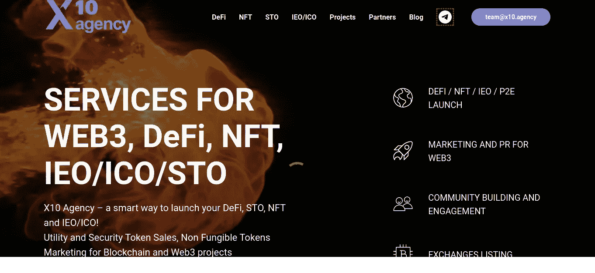

X10 agency 专门为加密和 NFT 项目提供多样化的营销服务。凭借经验丰富的专业营销团队和与多个品牌合作的良好记录，他们是最具潜力的 NFT 营销机构之一，他们帮助客户在领先的加密杂志(如 TechCrunch 和 VentureBeat)上展示他们的 NFT 项目。

从网站设计到 NFT 项目的社交媒体营销，他们为客户提供了一系列成熟、成功的 NFT 营销和推广服务。他们的一些卓越的 NFT 营销服务包括社区管理、增长黑客包、内容营销、数字广告等，

## 16。密码病毒

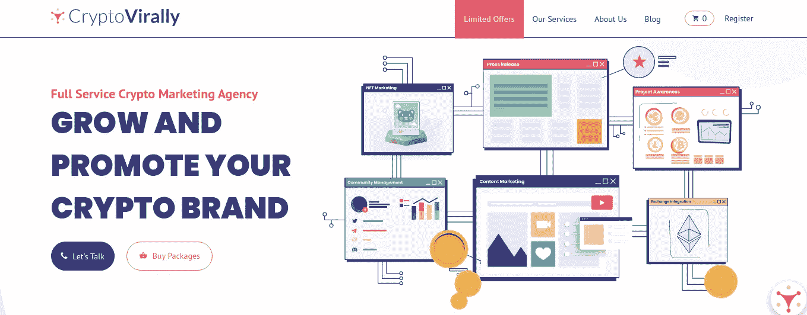

CryptoVirally 是一家总部位于罗马尼亚的数字营销机构。凭借出色的营销团队和有效的战略，他们提供的一些顶级营销服务包括影响者营销、公关营销、品牌开发包、社交媒体营销等。

也就是说，它是多家顶级媒体机构(如 CoinTelegraph)评选的 NFT 顶级营销机构之一，为 NFT 的各种项目提供以结果为导向的解决方案。

## **17。达像素**

DAPIXEL 是 NFT 最好的营销公司之一，围绕数字营销的当前趋势、变化和算法运用其 NFT 营销和推广服务。凭借一支拥有与谷歌、谷歌分析、脸书广告等合作经验的专业团队，他们旨在为客户推出 NFT 项目、加密项目和游戏项目提供最佳专业服务。

他们向客户概述他们的 NFT 营销服务，首先了解客户的目标、竞争对手，然后策划营销步骤，最终推出 NFT 项目。他们提供的一些最好的 NFT 营销服务包括社区建设、影响者营销和公关、付费广告、社交媒体营销等。

## **18。TokenMinds**

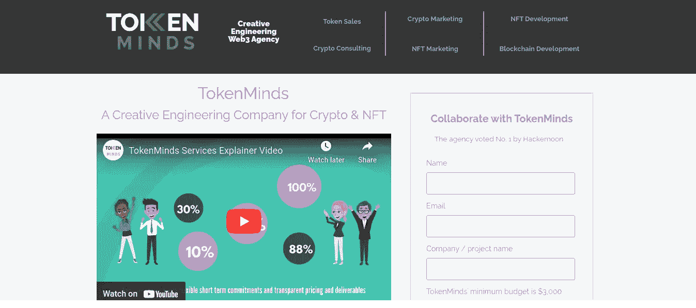

TokenMinds 成立于 2015 年，专门从事各种 NFT 项目、区块链开发、加密营销、钱包开发、代币销售等工作。凭借出色的营销团队和出色的业绩记录，他们提供多项 NFT 推广服务，重点是营销、社区建设、上市解决方案和资金筹集。

TokenMinds 是几家加密新闻出版机构(如 Hackernoon、NewsAffinity、CoinGape 等)的顶级加密和 NFT 营销机构之一。他们专门帮助他们的客户保持他们的 NFT 营销组织和良好的广告。他们提供的一些服务包括 NFT 不和谐管理，影响者 NFT 营销等，

## 19。ICODA

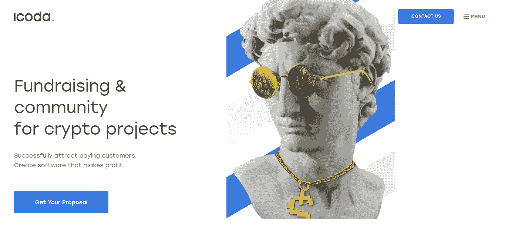

作为 NFT 顶级营销机构，ICODA 专门为 crypto、区块链、NFT 和金融科技项目提供营销服务。通过为不同加密领域的客户提供不同的服务，他们的 NFT 推广服务侧重于付费广告、SMM 战略、NFT 列表服务、公关活动、与博客作者和影响者的合作以及视频和内容营销。

利用这些服务，他们帮助客户接触到潜在的受众，并在 NFT 开展成功的业务。

## 20。NeoReach

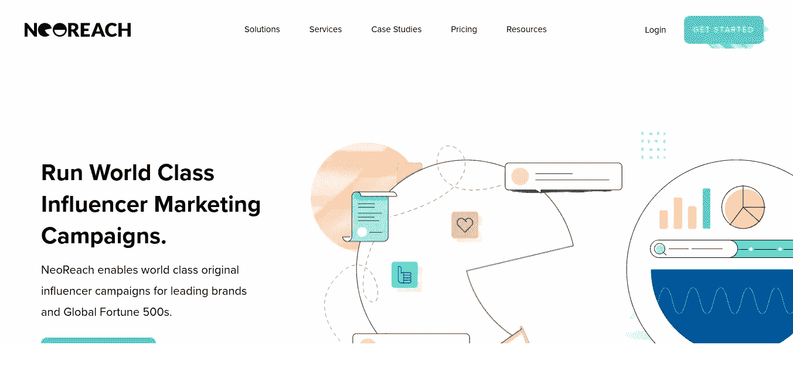

NeoReach 专门为其多样化的客户群提供几种数据支持的数字营销解决方案。凭借一支由营销专家和影响者组成的经验丰富的团队，他们通过多种策略推广 NFT 项目，如影响者 NFT 营销、营销活动、付费广告、社交媒体管理等。

他们还提供二级营销管理工具和其他尖端营销工具，以提高 Instagram、脸书、Snapchat 等社交媒体平台的可信度和参与度。也就是说，他们是英国最好的 NFT 营销公司之一。

现在，这些是英国、印度和美国的前 20 家营销机构。凭借在提供专业 NFT 营销和推广服务方面的出色记录，这些 NFT 营销公司从未失败过，为 NFT 和加密领域的企业家和企业主提供支持。

## **结论**

今天，NFT 的市场挤满了各种各样独特的非功能性食物。因此，要在这些市场日益激烈的竞争中脱颖而出，并通过有效的营销策略吸引目标受众，从 NFT 营销机构获得帮助将在许多方面受益。从为 NFT 企业主提供执行以结果为导向的 NFT 营销战略的路线图，到分析这些战略的影响，NFT 营销公司在 NFT 的推广活动中发挥着至关重要的作用。