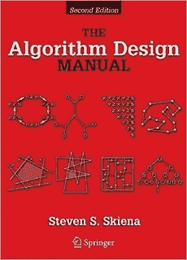
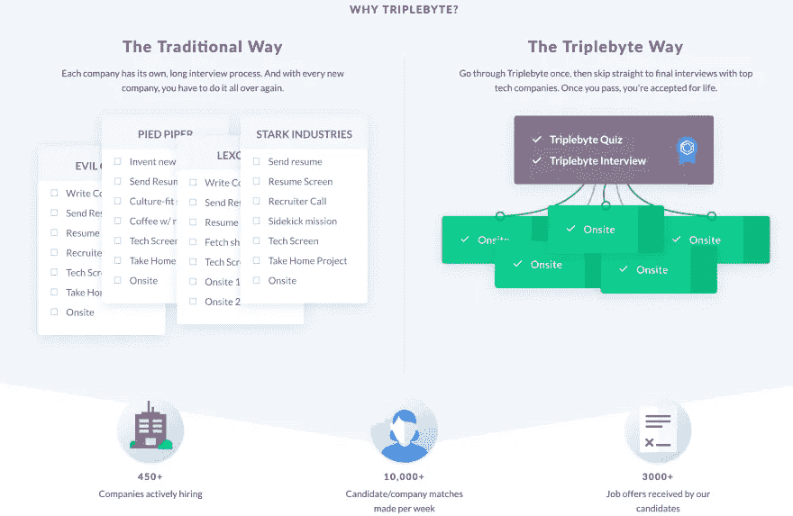

# 面向初学者和有经验的开发人员的 21 个字符串编程面试问题

> 原文：<https://medium.com/javarevisited/top-21-string-programming-interview-questions-for-beginners-and-experienced-developers-56037048de45?source=collection_archive---------0----------------------->

形象信用——教育

除了[数组](http://www.java67.com/2018/02/10-examples-of-array-in-java-tutorial.html)、[二叉树](https://javarevisited.blogspot.com/2015/10/how-to-implement-binary-search-tree-in-java-example.html)和[链表](https://javarevisited.blogspot.com/2017/07/top-10-linked-list-coding-questions-and.html)数据结构之外，**字符串**是编程工作面试中的另一个热门话题。我从未参加过没有[基于字符串的问题](http://www.java67.com/2018/04/21-string-programming-and-coding-interview-questions-answers.html)被问到的编码面试。

这是非常明显的，因为*我从来没有写过不使用单个字符串变量*的程序。在任何程序中，您都会发现字符串是最常用的数据类型或数据结构之一。

在这篇文章中，我将分享一些最常见的[基于字符串的编码问题](http://www.java67.com/2018/04/21-string-programming-and-coding-interview-questions-answers.html)，这些问题是我在许多编程面试中遇到的。我也有作为候选人和面试官的经验，所以我知道这些问题有多重要。

Btw，如果你没有[数据结构](https://www.java67.com/2019/07/top-10-online-courses-to-learn-data-structure-and-algorithms-in-java.html)的基础知识，或者最近一段时间没有刷新，解决这些问题是没有意义的。那样的话，我建议你先去读一本合适的数据结构和算法课程或书，来修改概念。

这将节省您在书本和 IDE 之间来回寻找每个问题的大量时间。

如果你需要资源，我建议跟随*在线课程学习数据结构和算法*，即使它们独立于任何编程语言，我也强烈建议你加入用你最熟悉的编程语言解释问题的课程。喜欢

1.  [**数据结构与算法:Java 开发人员深度学习使用 Java**](https://click.linksynergy.com/fs-bin/click?id=JVFxdTr9V80&subid=0&offerid=323058.1&type=10&tmpid=14538&RD_PARM1=https%3A%2F%2Fwww.udemy.com%2Fdata-structures-and-algorithms-deep-dive-using-java%2F)
2.  [**Python 中的算法和数据结构**](https://click.linksynergy.com/deeplink?id=JVFxdTr9V80&mid=39197&murl=https%3A%2F%2Fwww.udemy.com%2Falgorithms-and-data-structures-in-python%2F) 给热爱 Python 的人
3.  [**JavaScript 算法与数据结构大师班**](https://click.linksynergy.com/fs-bin/click?id=JVFxdTr9V80&subid=0&offerid=508237.1&type=10&tmpid=14538&RD_PARM1=https%3A%2F%2Fwww.udemy.com%2Fjs-algorithms-and-data-structures-masterclass%2F) 由柯尔特·斯蒂尔为 JavaScript 程序员开设
4.  [**掌握数据结构&使用 C 和 C++的算法**](https://click.linksynergy.com/deeplink?id=JVFxdTr9V80&mid=39197&murl=https%3A%2F%2Fwww.udemy.com%2Fdatastructurescncpp%2F) 对于擅长 C/C++的人

**5。** [**寻找编码面试:编码问题的模式**](https://www.educative.io/collection/5668639101419520/5671464854355968?affiliate_id=5073518643380224)
忘掉那几百个 Leetcode 问题吧。掌握这 15 个面试问题的基本模式，你就能应对面试中遇到的任何问题

 [## 探索编码面试:编码问题的模式

### 编码面试一天比一天难。几年前，我温习了关键数据结构并浏览了…

www.educative.io](https://www.educative.io/collection/5668639101419520/5671464854355968?affiliate_id=5073518643380224) 

# 如何解决基于字符串的编码问题

字符串数据结构的一个好处是，如果你知道数组数据结构，你可以很容易地解决基于字符串的问题，因为**字符串只不过是一个字符数组**。

> *所以你所知道的解决* [*基于数组的编码问题*](https://javarevisited.blogspot.com/2015/06/top-20-array-interview-questions-and-answers.html) *的所有技巧也可以用来解决字符串编程问题。*

以下是编程工作面试中一些常见的字符串编码问题:

1.  如何将一个给定的字符串反转？( [**解**](http://www.java67.com/2016/06/how-to-reverse-string-in-place-in-java.html) **)**
2.  如何从字符串中打印出重复的字符？( [**解**](http://java67.blogspot.sg/2014/03/how-to-find-duplicate-characters-in-String-Java-program.html) **)**
3.  **如何检查两个字符串是否互为变位词？(** [**)解**](http://javarevisited.blogspot.sg/2013/03/Anagram-how-to-check-if-two-string-are-anagrams-example-tutorial.html) **)**
4.  如何找到一个字符串的所有排列？(****)****
5.  **如何使用递归来反转给定的字符串？( [**解**](http://javarevisited.blogspot.sg/2012/01/how-to-reverse-string-in-java-using.html) **)****
6.  **如何检查一个字符串是否只包含数字？( [**解**](http://javarevisited.blogspot.sg/2012/10/regular-expression-example-in-java-to-check-String-number.html) **)****
7.  **如何在给定的字符串中找到重复的字符？( [**解**](http://java67.blogspot.sg/2014/03/how-to-find-duplicate-characters-in-String-Java-program.html) **)****
8.  **如何计算给定字符串中元音和辅音的数量？( [**解**](http://java67.blogspot.sg/2013/11/how-to-count-vowels-and-consonants-in-Java-String-word.html) **)****
9.  **如何计算一个给定字符在字符串中的出现次数？( [**解**](http://javarevisited.blogspot.sg/2012/12/how-to-count-occurrence-of-character-in-String.html) **)****
10.  **如何打印一个字符串中第一个不重复的字符？( [**解**](http://javarevisited.blogspot.sg/2014/03/3-ways-to-find-first-non-repeated-character-String-programming-problem.html) **)****
11.  **如何像 atoi() 一样把一个给定的字符串转换成 int？( [**解**](https://javarevisited.blogspot.com/2011/08/convert-string-to-integer-to-string.html) )**
12.  ****如何在不使用任何库方法的情况下反转给定句子中的单词？(** [**解**](http://java67.blogspot.com/2015/06/how-to-reverse-words-in-string-java.html) **)****
13.  ****怎么检查两个弦是不是互为旋转？(** [**解**](http://www.java67.com/2017/07/string-rotation-in-java-write-program.html) **)****
14.  **如何检查给定的字符串是否是回文？( [**解**](http://java67.blogspot.com/2015/06/how-to-check-is-string-is-palindrome-in.html) **)****
15.  ****没有重复字符的情况下，如何求最长子串的长度？【解决方案】****
16.  ****给定字符串 str，如何找到 str 中最长的回文子串？**(解决方案)**
17.  ****如何将字节数组转换成字符串？(** [**解**](https://javarevisited.blogspot.com/2014/08/2-examples-to-convert-byte-array-to-String-in-Java.html) **)****
18.  ****如何去除字符串中的重复字符？(** [**解**](https://javarevisited.blogspot.com/2016/06/how-to-remove-duplicate-characters-from-String-Java.html) **)****
19.  **如何找到给定字符串中出现次数最多的字符？( [**解**](http://javarevisited.blogspot.com/2012/12/how-to-count-occurrence-of-character-in-String.html) **)****
20.  **如何从字符串中删除给定的字符？( [**解**](http://java67.blogspot.com/2013/03/how-to-replace-string-in-java-character-example.html) **)****
21.  ****给定一个字符串数组，找出给定数组中出现频率最高的单词，我的意思是，在数组中出现次数最多的字符串。在出现平局的情况下，打印最小的字符串(按字典顺序)。(** [**解**](https://www.java67.com/2015/10/java-program-to-find-repeated-words-and-count.html) **)****

**这些问题有助于提高您对作为数据结构的字符串的了解。如果你能在没有任何帮助的情况下解决所有这些字符串问题，那么你的状态很好。**

**对于更难的问题，我建议你解决 Steven Skiena 的[**算法设计手册中给出的问题，这本书有最难的算法问题。**](http://www.amazon.com/Algorithm-Design-Manual-Steven-Skiena/dp/1849967202?tag=javamysqlanta-20)**

****

**如果您需要修改您的数据结构和算法概念，那么您还可以查看以下资源:**

1.  **[**数据结构和算法:Java 开发人员使用 Java 的深度探讨**](https://click.linksynergy.com/fs-bin/click?id=JVFxdTr9V80&subid=0&offerid=323058.1&type=10&tmpid=14538&RD_PARM1=https%3A%2F%2Fwww.udemy.com%2Fdata-structures-and-algorithms-deep-dive-using-java%2F)**
2.  **[**JavaScript 算法与数据结构大师班**](https://click.linksynergy.com/fs-bin/click?id=JVFxdTr9V80&subid=0&offerid=508237.1&type=10&tmpid=14538&RD_PARM1=https%3A%2F%2Fwww.udemy.com%2Fjs-algorithms-and-data-structures-masterclass%2F) 由柯尔特·斯蒂尔为 JavaScript 程序员开设**
3.  **[**掌握数据结构&使用 C 和 C++的算法**](https://click.linksynergy.com/deeplink?id=JVFxdTr9V80&mid=39197&murl=https%3A%2F%2Fwww.udemy.com%2Fdatastructurescncpp%2F) 对于擅长 C/C++的人**
4.  **[**钻研编码面试:编码题的模式**](https://www.educative.io/collection/5668639101419520/5671464854355968?affiliate_id=5073518643380224)
    忘了那几百个 Leetcode 题吧。掌握这 15 个面试问题的基本模式，你就能应对面试中遇到的任何问题。我非常感谢[教育性](https://medium.com/u/85b9909ed1cf?source=post_page-----56037048de45--------------------------------)和[教育性团队](https://medium.com/u/163aa84775f6?source=post_page-----56037048de45--------------------------------)创造了这么棒的课程。**

** [## 数据结构和算法:使用 Java 进行深入研究

### 所以你已经掌握了 Java(或另一种面向对象编程语言)中数据结构和算法的基础知识，但是…

click.linksynergy.com](https://click.linksynergy.com/fs-bin/click?id=JVFxdTr9V80&subid=0&offerid=323058.1&type=10&tmpid=14538&RD_PARM1=https%3A%2F%2Fwww.udemy.com%2Fdata-structures-and-algorithms-deep-dive-using-java%2F) 

这是一些最好的关于数据结构和算法的课程，你可以选择最适合你的课程。顺便说一句，如果你购买这些课程，我会收到付款

# 现在，您已经为编码面试做好了准备

这些是数据结构和算法之外的一些最常见的问题，有助于你在面试中表现出色。

我在我的 [javarevisited](http://javarevisited.blogspot.com/) 和 [java67](http://java67.com/) 上也分享了很多这样的问题，所以如果你真的感兴趣，你可以随时去那里搜索。

这些**常见的基于字符串的问题**是你需要知道的，以便成功地面试任何公司，无论是大公司还是小公司，任何级别的编程工作。

如果你正在寻找一份编程或软件开发的工作，你可以从这个编码问题列表开始准备，但是你还需要准备其他的主题，比如系统设计、并发性、面向对象编程、数据库设计以及其他数据结构和算法，比如动态编程。

令人欣慰的是，教育性的课程已经覆盖了你，他们有详细、深入的课程来涵盖这些话题，你可以在去面试之前参考它们，以下是我推荐的一些。

1.  [进行系统设计面试](https://www.educative.io/collection/5668639101419520/5649050225344512?affiliate_id=5073518643380224)进行系统设计
2.  [探寻面向对象设计面向对象编程与设计面试](https://www.educative.io/collection/5668639101419520/5692201761767424?affiliate_id=5073518643380224)。
3.  [探索编码的动态编程模式面试](https://www.educative.io/collection/5668639101419520/5633779737559040?affiliate_id=5073518643380224)擅长基于动态编程的编码问题。
4.  [Coderust:黑客编程面试](https://www.educative.io/courses/coderust-hacking-the-coding-interview?affiliate_id=5073518643380224)通过一步一步的可视化带你了解 80 多个示例问题及其解决方案——这样你就能真正地学习，而不是盲目地记忆解决方案
5.  [Java 多线程高级工程面试](https://www.educative.io/courses/java-multithreading-for-senior-engineering-interviews?affiliate_id=5073518643380224)回答基于并发的问题。

这份课程清单提供了很好的准备主题，也有助于评估你的准备情况，找出你的强项和弱项。您可以逐个购买这些课程，也可以购买 [**教育订阅**](https://www.educative.io/subscription?affiliate_id=5073518643380224) ，它允许访问所有这些课程和 100 多个其他软件开发课程。

Educative 现在还为他们的年度订阅提供高达 47%的折扣。作为一名程序员，有很多东西要学，有时你想简单地学习多门课程，而不用为每门课付费。有了这种订阅模式，你现在只需支付一次费用，就可以获得 Educative 上的所有课程。

最终，对这些主题的良好了解是成功编写面试代码的关键，这也是你应该集中大部分注意力的地方。

顺便说一句，如果你准备好了编码面试，那么你也可以参加 TripleByte 的测验，直接进入顶级科技公司的最后一轮面试，如 Coursera、Adobe Acrobat、Dropbox、Grammarly、优步、Quora、Evernote、Twitch 等等。

# 其他**面试问题文章**你可能喜欢:

以下是一些你可能想看的基于话题的面试问题:

[20+面试中的链表问题](https://hackernoon.com/top-20-linked-list-coding-problems-from-programming-job-interviews-756d4a2bf652)
[20+面试中的基础算法问题](https://hackernoon.com/top-20-searching-and-sorting-algorithms-interview-questions-5a476121fd0f)
[50+程序员的数据结构和编码问题](https://dev.to/javinpaul/50-data-structure-and-algorithms-problems-from-coding-interviews-4lh2)
[40+基于二叉树的面试问题](https://www.java67.com/2020/02/top-40-binary-tree-interview-questions.html)
[101 编码问题和破解你的编码的几个技巧面试](https://dev.to/javinpaul/101-coding-problems-and-few-tips-to-crack-your-next-programming-interviews-402a)
[130+ Java 面试问题](https://javarevisited.blogspot.com/2015/10/133-java-interview-questions-answers-from-last-5-years.html#axzz5ntvpdIs3)
[50+微软 SQL Server 面试问题](https://www.java67.com/2019/08/microsoft-sql-server-phone-interview-questions-answers.html)

# 结束语

谢谢，你坚持到了文章的结尾…祝你编程面试好运！这当然不会很容易，但练习完这些问题，你就离成功更近了一步。

如果你喜欢这篇文章，那么请分享给你的朋友和同事，别忘了在 Twitter 上关注 [javinpaul](https://twitter.com/javinpaul) ！

> *p . s .——如果你需要一些免费资源，可以查看这个* [***免费数据结构与算法课程***](http://javarevisited.blogspot.com/2018/01/top-5-free-data-structure-and-algorithm-courses-java--c-programmers.html)**列表，开始你的备考。****