# 2023 年 Java 开发人员可以学习的 25 大技术技能

> 原文：<https://medium.com/javarevisited/top-22-skills-professional-java-programmers-can-learn-in-2022-to-upgrade-themselves-bc3da73d7491?source=collection_archive---------1----------------------->

## 2023 年 Java 开发人员和架构师可以学习的 25 项技术技能，通过链接到在线学习资源来提升自己。

[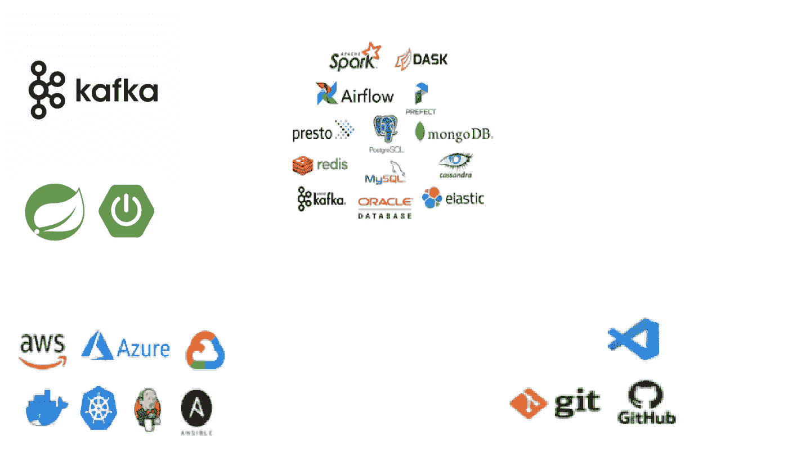](https://click.linksynergy.com/deeplink?id=CuIbQrBnhiw&mid=39197&murl=https%3A%2F%2Fwww.udemy.com%2Fcourse%2Fjava-the-complete-java-developer-course%2F)

你好，Java 程序员，如果你想提高技能成为一名更好的 Java 开发人员，想成为一名 Java 架构师，或者期待开始 Java 开发人员的职业生涯，但不确定在 2023 年要学习哪些技能，那么你来对地方了。

过去，我曾分享过 [**最佳 Java 课程和教程**](/javarevisited/top-5-java-online-courses-for-beginners-best-of-lot-1e1e240a758)[**学习 Java 的最佳地点**](/javarevisited/10-best-places-to-learn-java-online-for-free-ce5e713ab5b2)[**Java 开发人员路线图**](https://javarevisited.blogspot.com/2019/10/the-java-developer-roadmap.html) 和 [**基本 Java 开发框架**](/javarevisited/5-essential-frameworks-every-java-developer-should-learn-6ed83315f1fb) ，在这篇文章中，我将分享 25 项最受专业 Java 开发人员欢迎的技术技能。

你不需要学习所有的技能，但是这些都是需要的技能，可以帮助 Java 开发人员找到更好的工作。

最近我在做一些关于 Java 开发人员在 2023 年应该学习什么技能来成为一名更好的开发人员并促进他们的职业发展的研究，我发现了一些有趣的技能，如 [Kafka](https://javarevisited.blogspot.com/2018/04/top-5-apache-kafka-course-to-learn.html#axzz5aXrBEVUU) 和 Elastic Search，除了像 [Spring Boot](https://javarevisited.blogspot.com/2018/05/top-5-courses-to-learn-spring-boot-in.html) 和[微服务](https://javarevisited.blogspot.com/2018/02/top-5-spring-microservices-courses-with-spring-boot-and-spring-cloud.html)这样明显的技能。

我最喜欢做这种研究的地方之一是检查 LinkedIn 上来自不同公司的工作列表，如投资银行、服务型公司、初创公司和广泛使用 Java 的中型公司。

当我看到这些技能时，我可以立即看出它们真的很有用，值得与你们分享，因为我经常看到这些技能在招聘 Java 开发人员时发挥重要作用。

虽然基于不同的工作要求有更多的技能，但我从那些雇佣 Java 开发人员的顶级技术公司的工作列表中，为本文选择了 21 个最常见和最受欢迎的技能

这个列表并不全面，但它是一个不错的列表，你可以学习这些技能，不仅可以成为一名更好的 Java 开发人员，还可以为 2023 年的工作做好准备，或者促进你的职业发展。我还分享了一些资源，帮助 java 开发人员学习这些技术技能。

软件开发最大的挑战之一，也可能是最激动人心的方面

事业就是学习。技术在不断发展，今天的事情很快就过去了。

Java 已经存在了这么多年，但是随着 Java 5 和 Java 8 的出现，它也在不断变化。如今，Java 甚至每六个月就更新一次，很难跟上，但这就是编程生涯的挑战。

技能也是如此，90 年代你可以去硅谷学习 Applet 的日子已经一去不复返了。J2ME 和其他一些流行的 Java 框架 如 Struts 也是如此，Struts 在相当长的一段时间内都是找 Java 工作的必备技能。是时候为 Java 开发人员学习新的热门技术技能了。

顺便说一下，如果你是 Java 开发和 Java 编程语言本身的新手，那么我建议你在开始学习这些技能之前，先通过一个全面的 Java 课程来学习核心 Java。

如果你需要一个资源，那么 Udemy 上的这个 80 小时的 [**Java 编程大师班(涵盖 Java 11 & Java 17**](https://click.linksynergy.com/deeplink?id=CuIbQrBnhiw&mid=39197&murl=https%3A%2F%2Fwww.udemy.com%2Fcourse%2Fjava-the-complete-java-developer-course%2F) 课程是一个全面的最新课程。

[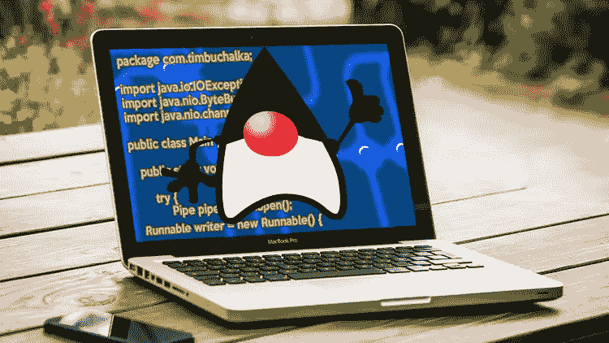](https://click.linksynergy.com/deeplink?id=CuIbQrBnhiw&mid=39197&murl=https%3A%2F%2Fwww.udemy.com%2Fcourse%2Fjava-the-complete-java-developer-course%2F)

# 2023 年 Java 程序员可以学习的 25 项技术技能

正如我所说的，今天的技术世界需要高级技能，这里是一些 Java 开发人员应该学习的现代技能，以便在 2023 年为他/她的职业生涯提供帮助。

该列表包括 Spring、Spring Boot 和 Hibernate 等基本框架，MySQL 等数据库，Spark 等大数据框架，Elastic Search，REST、SOA 和微服务等架构师，以及 SQL 等主干技术。

## 1.弹簧框架

毫无疑问，Spring 是 Java 栈之王。这不是一个选项，而是一个 Java 程序员的必备技能。最近，Spring Boot 也加入了主流，但至少，你需要春天。

它不仅提供了依赖注入，这使得编写可测试代码更加容易，甚至还提供了许多库和实用程序类，如`JdbcTemplate`，这使得日常的 Java 编程变得更好。

如果你不知道 Spring 框架，那么不要担心，现在是学习 Spring 的最佳时机，如果你需要资源，我强烈推荐 Udemy 上约翰·汤姆逊的 [**Spring 5.0:初学者到大师**](https://click.linksynergy.com/fs-bin/click?id=JVFxdTr9V80&subid=0&offerid=323058.1&type=10&tmpid=14538&RD_PARM1=https%3A%2F%2Fwww.udemy.com%2Fspring-framework-5-beginner-to-guru%2F) 开始学习。

[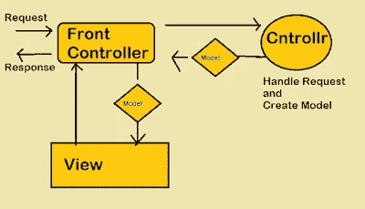](https://click.linksynergy.com/fs-bin/click?id=JVFxdTr9V80&subid=0&offerid=323058.1&type=10&tmpid=14538&RD_PARM1=https%3A%2F%2Fwww.udemy.com%2Fspring-framework-5-beginner-to-guru%2F)

## 2.Spring Boot

Spring Boot 是你应该学习的五大 Java 框架之一，它已经在我的清单上很长时间了。就像 Spring framework 通过删除样板代码并使用依赖注入使测试变得更容易来消除开发 Java 应用程序的痛苦一样。

[Spring Boot](/javarevisited/10-free-spring-boot-tutorials-and-courses-for-java-developers-53dfe084587e) 通过自动配置你需要的大部分东西，消除了使用 [Spring framework](/javarevisited/top-10-free-courses-to-learn-spring-framework-for-java-developers-639db9348d25) 的痛苦，这使得 Spring framework 更容易使用，也减少了你在启动 Java 项目上花费的时间。

如果你不知道 Spring Boot，我强烈建议你学习这个，因为大多数新的开发项目都使用 Spring boot，如果你需要资源，没有比 [**Learn Spring 更好的课程了:Eugen Paraschive 的认证课程**](https://courses.baeldung.com/p/ls-certification-class?utm_source=javarevisited&utm_medium=web&utm_campaign=lss&affcode=22136_bkwjs9xa) 是一个很好的开始课程。

[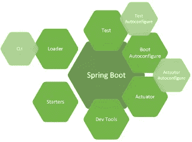](https://courses.baeldung.com/p/ls-certification-class?utm_source=javarevisited&utm_medium=web&utm_campaign=lss&affcode=22136_bkwjs9xa)

## 3.阿帕奇卡夫卡

如果你不知道， [Apache Kafka](/javarevisited/top-10-apache-kafka-online-training-courses-and-certifications-621f3c13b38c) 是一个分布式数据流平台，可以实时发布、订阅、存储和处理记录流。它由 LinkedIn 开发，用 [Scala](/javarevisited/5-best-scala-and-functional-programming-books-to-learn-in-2021-97ec9e56f2bd) 和 [Java](https://javarevisited.blogspot.com/2018/06/java-vs-python-which-programming-language-to-learn-first.html) 编写，捐赠给 Apache 软件基金会。

它旨在为实时处理数据馈送提供一个统一、高吞吐量、低延迟的平台，这是许多现代系统的要求。

这是在 Java 世界中越来越受欢迎的领先技术之一，在你的简历上写下这一点可以让你有资格获得一些令人兴奋的 Java 职业机会。如果你想学习卡夫卡，可以在 Udemy 上查看这份 [**最佳卡夫卡初学者课程列表**](https://javarevisited.blogspot.com/2018/04/top-5-apache-kafka-course-to-learn.html#axzz5aXrBEVUU) 。

[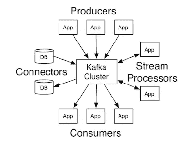](https://javarevisited.blogspot.com/2018/04/top-5-apache-kafka-course-to-learn.html)

## 4.微服务

在过去的几年里，你可能听说过这个流行词。当优步和网飞这样的初创公司开始使用微服务时，微服务就出名了，但它提供的远不止这些。微服务的关键[原则是简单。](https://javarevisited.blogspot.com/2021/09/microservices-design-patterns-principles.html)

与难以构建和维护的整体应用程序不同，微服务更容易编码、开发和维护，因为它们将应用程序分成一组更小的、可组合的片段。

Java world 对使用 Spring Boot 和 Spring Cloud 构建微服务有极好的支持，这也是为什么对了解和理解微服务的 Java 开发人员的需求每天都在上升的原因。

如果你想了解更多关于如何使用 Spring 框架在 Java 中构建微服务的知识，我建议你加入 Udemy 上的[**Spring Boot 主微服务和 Spring Cloud**](https://click.linksynergy.com/deeplink?id=JVFxdTr9V80&mid=39197&murl=https%3A%2F%2Fwww.udemy.com%2Fcourse%2Fmicroservices-with-spring-boot-and-spring-cloud%2F) 课程

[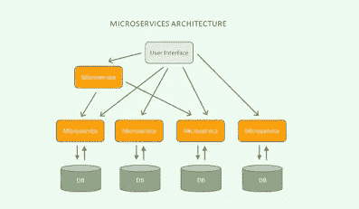](https://www.java67.com/2021/04/5-free-microservice-courses-for-java.html)

## 5.码头工人

DevOps 正在迅速改变我们开发和交付软件的方式，Docker 一直扮演着重要的角色。Docker 是一个容器，它抽象出运行代码所需的环境细节，如安装 Java、设置路径、放置库等。

[Docker](/javarevisited/5-best-docker-courses-for-java-and-spring-boot-developers-bbf01c5e6542) 使复制环境变得容易，无需设置服务器，这就是为什么它在软件开发和部署过程中非常有用。

我强烈建议每个 Java 开发人员学习 Docker 来尝试新事物，并将这项有用的技能添加到简历中。

如果你需要一门课程，没有比 Udemy 的 [**Docker & Kubernetes:实用指南**](https://click.linksynergy.com/deeplink?id=JVFxdTr9V80&mid=39197&murl=https%3A%2F%2Fwww.udemy.com%2Fcourse%2Fdocker-kubernetes-the-practical-guide%2F) 更好的了。我正在从这门课程中学习，它很棒。

[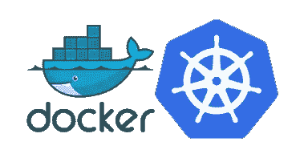](https://javarevisited.blogspot.com/2019/05/top-5-courses-to-learn-docker-and-kubernetes-for-devops.html)

## 6.休息

这对 Java 程序员来说是另一个有用的技能，因为现在几乎没有任何 web 应用程序不公开 API 或者不使用 REST API。 [GraphQL](/javarevisited/top-5-graphql-tutorials-and-courses-for-beginners-fb5543506fc2) 正在慢慢取代 REST，但在 Java 世界里，REST 依然是王者。

如果您需要一些学习 REST 的建议，那么可以查看 Udemy 上面向 Java 开发人员的这个 [**RESTful Web 服务、Java、Spring Boot、Spring MVC 和 JPA**](https://click.linksynergy.com/deeplink?id=JVFxdTr9V80&mid=39197&murl=https%3A%2F%2Fwww.udemy.com%2Fcourse%2Frestful-web-service-with-spring-boot-jpa-and-mysql%2F) 课程。

[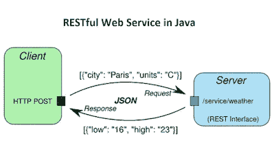](https://click.linksynergy.com/deeplink?id=JVFxdTr9V80&mid=39197&murl=https%3A%2F%2Fwww.udemy.com%2Fcourse%2Frestful-web-service-with-spring-boot-jpa-and-mysql%2F)

## 7.结构化查询语言

这是 Java 程序员，或者我说任何程序员的另一个核心技能。由于数据是任何程序员的真正国王，而 [SQL](/javarevisited/top-5-sql-and-database-courses-to-learn-online-48424533ac61) 是交互和分析数据的最关键的工具，你不能没有它。

如果你不知道 SQL，随着数据工程师需求的增长，这是学习 SQL 的最佳时机。如果需要推荐，Udemy 上何塞·波尔蒂利亚的[**SQL boot camp 2023:从零到英雄**](https://click.linksynergy.com/deeplink?id=JVFxdTr9V80&mid=39197&murl=https%3A%2F%2Fwww.udemy.com%2Fcourse%2Fthe-complete-sql-bootcamp%2F) 全集是学习 SQL 最好的课程。

[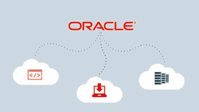](https://click.linksynergy.com/deeplink?id=JVFxdTr9V80&mid=39197&murl=https%3A%2F%2Fwww.udemy.com%2Fcourse%2Fthe-complete-sql-bootcamp%2F)

## 8.云计算

云正在慢慢接管整个技术世界。越来越多的公司正在向云迁移，随着主要云平台如 [AWS](/javarevisited/top-10-cloud-certification-to-aim-in-2022-aws-azure-and-google-cloud-platform-bd054fff0538) 、[谷歌云平台](/javarevisited/5-best-courses-to-learn-google-cloud-platform-gcp-in-2021-169093a3771a)、[微软 Azure](/javarevisited/10-best-microsoft-azure-courses-for-beginners-and-experienced-developers-d41a454834c0) 的进步和成熟，下一代 Java 应用将为云而构建。

如果你想从开发者的角度获得云计算的入门知识，Neal Davis 的[**AWS 上的云计算入门**](https://click.linksynergy.com/deeplink?id=JVFxdTr9V80&mid=39197&murl=https%3A%2F%2Fwww.udemy.com%2Fcourse%2Fintroduction-to-cloud-computing-on-amazon-aws-for-beginners%2F) 是我最近一段时间看到的最好的课程之一。它不仅教你如何为云开发 Java 应用程序，还教你所有正确的工具和实践。

## 9.专家

Maven 是我学过的最本质的 Java 工具。因为我来自 ANT 和批处理脚本的 Maven 之前的世界，所以我知道为一个 Java 应用程序组装和管理依赖关系是多么痛苦。

Maven 不仅解决了依赖管理的问题，还为 Java 项目提供了一个标准结构，这大大缩短了新开发人员的学习曲线。

这是 Java 程序员绝对必备的技能，如果你不知道，Maven 今天就来学习。如果你需要推荐，Udemy 上的约翰·汤姆逊[**Apache Maven:初学者到大师**](https://click.linksynergy.com/deeplink?id=JVFxdTr9V80&mid=39197&murl=https%3A%2F%2Fwww.udemy.com%2Fcourse%2Fapache-maven-beginner-to-guru%2F) 课程是最好的。

[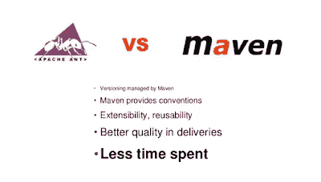](https://javarevisited.blogspot.com/2019/03/top-5-course-to-learn-apache-maven-for.html#axzz6ccm5KWKs)

## 10.自动警报系统

亚马逊网络服务是当今最流行的云平台，这也是它成为一项技能的原因。对知道如何使用 AWS 工具和环境(如 EC2、S3 和虚拟私有云)的人有巨大的需求。

我看到我的许多朋友也在近几年蜂拥着去获得 AWS 认证。如果你对 AWS 感兴趣，想了解更多，这里有一个免费的 AWS 课程**列表，你可以加入在线学习。**

**[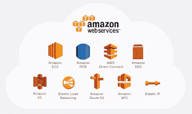](https://javarevisited.blogspot.com/2020/05/top-5-amazon-web-services-aws-courses-for-beginners-and-experienced-programmers.html#axzz6f4s58Ml9)**

## **11.CI(詹金斯、竹子、GitLab 等。)**

**除了 Maven，我认为 [Jenkins](/javarevisited/7-best-courses-to-learn-jenkins-and-ci-cd-for-devops-engineers-and-software-developers-df2de8fe38f3) 是当今 Java 开发人员的另一项必备技能。持续集成极大地提高了软件开发的质量和过程，现在大多数组织都有 CI 和 CD。**

**DevOps 的出现进一步推动了 Jenkins 的采用，这就是为什么我认为每个 Java 开发人员都应该学习 Jenkins。**

**如果你需要参考，那么我强烈推荐你去看看 Udemy 上的这个 [**詹金斯，从零到英雄:成为 DevOps 詹金斯大师**](https://click.linksynergy.com/deeplink?id=JVFxdTr9V80&mid=39197&murl=https%3A%2F%2Fwww.udemy.com%2Fcourse%2Fjenkins-from-zero-to-hero%2F) 课程。你可以在优购上花 9.9 美元买到这门课程。**

**[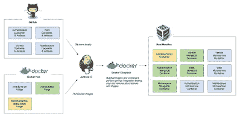](https://javarevisited.blogspot.com/2018/09/top-5-jenkins-courses-for-java-and-DevOps-Programmers.html)**

## **12.Hibernate + JPA**

**和 Spring 一样，Hibernate 是 Java 框架之王。它实际上是 Java 世界中最流行的持久性框架。由于数据是任何 Java 应用程序不可或缺的一部分， [Hibernate](/javarevisited/top-5-hibernate-online-training-courses-for-beginners-and-advance-java-programmers-469460596b2b) 也成为许多 Java 应用程序的基本框架。**

**它消除了 JDBC 与关系数据库等持久性技术交互的痛苦，并允许您专注于使用对象构建应用程序逻辑。**

**如果你想学习 Hibernate，我建议你加入 Udemy 上 Chad Darby 的[**Spring&Hibernate for 初学者(包括 Spring Boot)**](https://click.linksynergy.com/deeplink?id=JVFxdTr9V80&mid=39197&murl=https%3A%2F%2Fwww.udemy.com%2Fcourse%2Fspring-hibernate-tutorial%2F) 课程。**

**[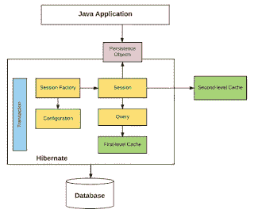](https://click.linksynergy.com/deeplink?id=JVFxdTr9V80&mid=39197&murl=https%3A%2F%2Fwww.udemy.com%2Fcourse%2Fspring-hibernate-tutorial%2F)**

## **13.饭桶**

**这是基本技能之一，不仅对于 Java 程序员，而且对于任何程序员都是如此，这就是为什么我把它列入了每个程序员都应该知道的事情清单中。**

**无论是 [Git](https://javarevisited.blogspot.com/2018/01/5-free-git-courses-for-programmers-to-learn-online.html) 还是 [Github](https://javarevisited.blogspot.com/2019/05/10-free-websites-to-learn-git-online.html) 都变得无处不在，无论是开源代码库还是封闭库，Git 都无处不在。**

**如果不知道这些 git 命令，不理解 push、pull、merge、branch、commit 和 rebase 等关键 git 概念，你就无法生存。**

**如果你是 git 新手，或者想提高自己的理解能力，我建议你浏览一下 Udemy 上的这个 [**最佳 Git 课程**](/javarevisited/7-best-courses-to-master-git-and-github-for-programmers-d671859a68b2) 列表。**

**[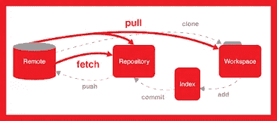](https://www.java67.com/2019/04/top-5-courses-to-learn-git-and-github.html)**

## **14.Java EE**

**你们中的一些人可能会对 Java EE 或 Jakarta EE 感到惊讶是 Java 开发人员最需要的技能之一。好吧，事实是 Java EE 仍然活得好好的。**

**许多在其 web 堆栈上使用 Java 组织使用 Java EE 来构建他们的应用程序。**

**Java EE 的最新版本是 Java EE 8，如果你想学习 Java EE，这份来自 Udemy，Pluralsight 和 LinkedIn Learning 的 [**最佳 Java EE 课程**](https://javarevisited.blogspot.com/2018/09/top-5-java-ee-courses-to-learn-online.html) 列表是最好的开始。**

**[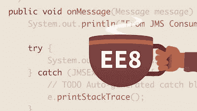](https://javarevisited.blogspot.com/2018/09/top-5-java-ee-courses-to-learn-online.html)**

## **15.前进速度**

**SOA 代表面向服务的架构。顾名思义，面向服务的体系结构是一种软件设计风格，其中服务由应用程序组件通过网络上的通信协议提供给其他组件。**

**面向服务架构的基本原则独立于供应商、产品和技术。这听起来非常类似于微服务，其中应用程序也被划分为多个服务，但关键的区别是大小，微服务，顾名思义，在大小和范围上要小得多。**

**由于现实世界的应用程序往往很复杂，它们通常遵循 SOA 架构，这就是为什么对 Java 开发人员的需求**

**拥有 SOA 的技能相当高。如果你想了解更多关于 SOA 的知识并获得这一技能，请看这张 [**最佳 SOA 课程**](https://javarevisited.blogspot.com/2019/09/top-5-courses-to-learn-soa-service-oriented-architecture-microservices.html#axzz6iYmMFnsA) 的列表。**

**[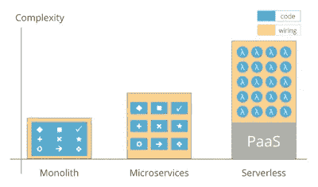](https://medium.com/javarevisited/8-best-online-courses-to-learn-service-oriented-soa-and-microservices-architecture-94c01d6b94e6)**

## **16.弹性搜索**

**[ElasticSearch](https://javarevisited.blogspot.com/2022/02/top-5-courses-to-learn-elasticsearch.html) 是另一个用 Java 开发的很棒的软件。这是一个基于 Lucene 库的搜索引擎，允许你可靠地搜索、分析和可视化你的数据。Elasticsearch 经常和 [Kibana](https://javarevisited.blogspot.com/2022/01/top-5-courses-to-learn-kibana-for.html) 、Beats、Logstash 一起使用，组成了 Elastic Stack。**

**由于越来越多的应用程序现在提供了一种向用户分析和可视化其数据的方式，弹性搜索变得越来越重要，这就是为什么需要具有弹性搜索技能的 Java 开发人员。**

**它有许多应用程序，比如像 Splunk 那样搜索和分析日志文件。如果你想了解更多，Udemy 上的这个 [**完全弹性搜索指南**](https://click.linksynergy.com/deeplink?id=JVFxdTr9V80&mid=39197&murl=https%3A%2F%2Fwww.udemy.com%2Fcourse%2Felasticsearch-complete-guide%2F) 课程是一个很好的加入方式。**

**[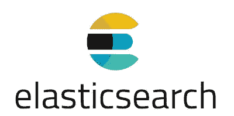](https://click.linksynergy.com/deeplink?id=JVFxdTr9V80&mid=39197&murl=https%3A%2F%2Fwww.udemy.com%2Fcourse%2Felasticsearch-complete-guide%2F)**

## **17.Java SE**

**我很惊讶地看到 Java SE 技能排在列表的第 16 位，因为它是任何 Java 开发人员最重要的技能之一。如果你不知道[集合](https://javarevisited.blogspot.com/2020/04/top-5-courses-to-learn-java-collections-and-streams.html)、[多线程](/javarevisited/8-best-multithreading-and-concurrency-courses-for-experienced-java-developers-8acfd3b25094)、[流](/javarevisited/8-best-lambdas-stream-and-functional-programming-courses-for-java-developers-3d1836a97a1d)等关键的 Java SE 库，你就是不会用 Java 编码。**

**对于任何 Java 开发人员来说，掌握这些基本类的知识都是非常重要的。因此，如果您是 Java 新手，请花些时间学习和提高您的核心 Java 技能。**

**如果你需要一门课程， [**完整的 Java 大师班**](http://bit.ly/2AHuthF) 是学习核心 Java 最好的课程之一。它也是最新的，最近针对 Java 12 进行了更新。**

****

## **18.朱尼特**

**我一直建议许多 Java 开发人员学习 JUnit。这也是我列出的 2023 年 Java 开发人员应该学习的 10 件事。JUnit 现在也有所发展，JUnit 5 引领潮流。它允许您更好更快地编写测试。**

**除了 [JUnit](https://www.java67.com/2018/02/5-free-eclipse-and-junit-online-courses-java-developers.html) ，你还应该学习 [Mockito](/javarevisited/top-10-courses-to-learn-eclipse-junit-and-mockito-for-java-developers-4de1e8d62b96) ，一个用于创建模拟对象的领先 Java 库。**

**由于 Java 应用程序严重依赖这个库，包括 JDK，所以总是需要像 Mockito 这样的模仿框架来编写可以独立运行的测试。**

**如果你想进一步学习，建议你查看一下 Udemy 和 Pluralsight 的这份 [**最佳 JUnit 和 Mockito 课程**](https://javarevisited.blogspot.com/2019/04/top-5-junit-and-unit-testing-courses-java-programmers.html#axzz6iYmMFnsA) 列表。**

****

## **19.TimeDivisionDuplex 时分双工**

**如果有一件事，我建议 Java 开发人员今天学习，那么它将是 TDD。尽管这对于 Java 开发人员来说是一项非常深奥的技能，但它是能够提高代码质量和增强对代码信心的唯一最有效的方法。TDD 的测试-代码-测试-重构循环在 Java 中运行得很快，非常好。**

**我强烈建议每一个 Java 开发者遵循 TDD，如果你需要学习 TDD 的资源，没有比阅读 [**测试驱动书**](https://javarevisited.blogspot.com/2014/08/top-5-books-to-learn-unit-testing-junit-tdd-Java-programmers.html) 更好的资源了。对我来说，这就像是 Java 中 TDD 的圣经。**

**[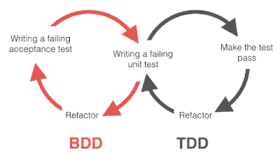](https://medium.com/javarevisited/5-courses-to-learn-junit-and-mockito-in-2019-best-of-lot-f217d8b93688)**

## **20.NoSQL**

**NoSQL 提供了另一种存储数据的方式，它可以更好地适应许多应用程序，主要是将一堆属性放在一起。它不同于存储数据的传统关系模型，传统关系模型试图通过规范化数据来消除冗余或重复。**

**市面上有很多[流行的 NoSQL 数据库](https://javarevisited.blogspot.com/2019/03/top-5-nosql-database-web-developers-should-learn.html#ixzz64aBvbXQ4)，比如 [MongoDB](/javarevisited/10-free-online-courses-to-learn-mongodb-and-nosql-942609611664) 和 [Cassandra](https://javarevisited.blogspot.com/2022/02/top-5-courses-to-learn-apache-cassandra.html) 。**

**由于现代应用程序有更多的数据，为了更快的检索和更高的可伸缩性，他们中的许多人正在转向 NoSQL，因此需要具有 NoSQL 技能的 Java 程序员。**

**如果你想学习一个像 MongoDB 这样的 NoSQL 数据库，那么看看这个为初学者准备的 [**最佳 Mongo DB 课程**](https://javarevisited.blogspot.com/2019/01/top-5-mongodb-online-training-courses.html) 列表。**

**[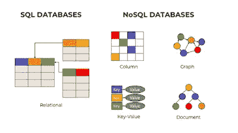](https://javarevisited.blogspot.com/2019/03/top-5-nosql-database-web-developers-should-learn.html)**

## **21.关系型数据库**

**[MySQL](/@javinpaul/top-5-courses-to-learn-mysql-in-2020-4ffada70656f) 是可访问的关系数据库之一，也在 Java 世界中被大量使用。由于数据库是任何 Java 应用程序不可或缺的一部分，所以对 MySQL 之类的关系数据库的良好了解对获得 Java 开发工作大有帮助。**

**我在 [MySQL](https://www.java67.com/2018/02/5-free-php-and-mysql-courses-for-web-developers.html) 、 [SQL Server](https://javarevisited.blogspot.com/2020/02/top-5-courses-to-learn-microsoft-sql-server-mssql.html) 、 [Oracle](/javarevisited/top-10-free-courses-to-learn-microsoft-sql-server-and-oracle-database-in-2020-6708afcf4ad7) 都工作过，但是如果你是刚开始做关系数据库，先学 MySQL。**

**如果你需要推荐，你可以先看看这个 [**最佳 MySQL 课程**](/@javinpaul/top-5-courses-to-learn-mysql-in-2020-4ffada70656f) 列表。**

****

## **22.[夸库西奥](https://quarkus.io/)**

**Quarkus 是另一个全栈的 Kubernetes-native Java 框架，专为 Java 虚拟机(JVM)和本机编译而设计，专门针对容器优化 Java，使其成为无服务器、云和 Kubernetes 环境的有效平台。**

**Quarkus 得到了 Redhat 的支持，它在创建高性能、可伸缩的 Java 应用程序方面正迅速取得进展。基于 Quarkus 的应用程序的关键特性之一是快速启动。**

**许多 Java 程序员希望尝试 Quarkus 的快速和反应式微服务，如果你也想在 2023 年学习 Quarkus，我强烈建议你从 Quarkus 先驱之一安东尼奥·冈萨尔维斯的 Quarkus 课程开始，学习这个 [**。这个 3.5 小时的课程对于任何愿意学习 Quarkus 的 Java 开发人员来说都是一个很好的起点。**](https://click.linksynergy.com/deeplink?id=CuIbQrBnhiw&mid=39197&murl=https%3A%2F%2Fwww.udemy.com%2Fcourse%2Fquarkus-starting-with-quarkus%2F)**

****

## **24.阿帕奇骆驼**

**这是 2023 年 Java 程序员可以学习的另一件事。[Apache come](https://javarevisited.blogspot.com/2022/02/top-5-courses-to-learn-apache-camel-in.html)l 是一个开源的集成框架，允许您快速集成几个生产和消费数据的系统。**

**由于数据是任何应用程序的支柱，并且大多数应用程序从多个系统获取数据并向下游提供丰富的数据，因此 Apache camel 在获取数据方面起着重要的作用。**

**如果您需要一个基于规则的路由和中介引擎的面向消息的中间件，那么 Apache Camel 是一个不错的选择。**

**并且，如果你想在 2023 年学习阿帕奇 Camel 并且需要资源，我强烈推荐你加入 Udemy 上 Ranga Karnam 的 [**学习阿帕奇 Camel 框架与 Spring Boot**](https://click.linksynergy.com/deeplink?id=CuIbQrBnhiw&mid=39197&murl=https%3A%2F%2Fwww.udemy.com%2Fcourse%2Fapache-camel-framework-with-spring-boot%2F) 课程。是 2023 年学习阿帕奇骆驼的动手课程之一。**

****

## **25.. [MicroNaut](https://micronaut.io/)**

**这是另一个现代的、基于 JVM 的全栈框架，用于构建模块化的、易于测试的微服务和无服务器应用程序。Micronaut 得到了 Java 社区的喜爱，随着 Oracle 和 JetBrains 等大公司的支持，MicroNaut 可能会在不久的将来成为 Spring Boot 和 Spring cloud 的有力竞争者。**

**说到技术，Micronaut 和 Spring 框架有一个关键的区别，Spring 完全依赖于运行时反射和代理，Micronaut 使用编译时数据来实现依赖注入。**

**如果你想在 2023 年学习 MicroNaut，并且需要一个资源，我也推荐你在 Udemy 上看看 Daniel Prinz 的[**Learn micro naut—cloud-native micro services with Java**](https://click.linksynergy.com/deeplink?id=CuIbQrBnhiw&mid=39197&murl=https%3A%2F%2Fwww.udemy.com%2Fcourse%2Flearn-micronaut%2F)课程。这个长达 6.5 小时的课程是从头开始学习 MicroNaut 的绝佳资源。**

****

## **25.库伯内特斯**

**我们部署 Java 应用程序的方式正在迅速改变。需要设置 Tomcat 实例并部署 WAR 文件来运行 Java 应用程序或创建 shell 脚本来运行核心 Java 应用程序的日子已经一去不复返了。**

**在云原生 Java 应用的时代， [Docker 和 Kubernetes](/javarevisited/top-15-online-courses-to-learn-docker-kubernetes-and-aws-for-fullstack-developers-and-devops-d8cc4f16e773) 是您部署和扩展 Java 微服务所需的主要工具。**

**作为一名 Java 开发人员，你不需要成为 Kubernetes 的专家，除非你想成为一名 [DevOps 工程师](/javarevisited/top-5-online-courses-to-become-a-devops-engineer-in-2020-764f5e60c2b)，但是你需要有 Kubernetes 的基础知识来理解和部署你在云中的 Java 应用。**

**我已经说过为什么 Java 开发人员需要在 2023 年运行 Docker 和 Kubernetes，这也可能是一项有用的技能，可以添加到你的简历中。**

**如果你想在 2023 年学习 Kubernetes 并需要一门课程，我强烈推荐你加入 Udemy 上 KodeCloud 的 Mumshad Mannambeth 为绝对初学者准备的[**Kubernetes-hand-on**](https://click.linksynergy.com/deeplink?id=CuIbQrBnhiw&mid=39197&murl=https%3A%2F%2Fwww.udemy.com%2Fcourse%2Flearn-kubernetes%2F)。这是一门很好的课程，可以帮助你理解 Kubernetes 的基本概念、`kubectl` 命令和其他关键的 Kubernetes 架构。**

**[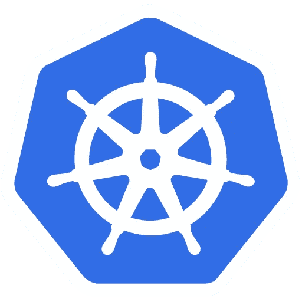](https://click.linksynergy.com/deeplink?id=CuIbQrBnhiw&mid=39197&murl=https%3A%2F%2Fwww.udemy.com%2Fcourse%2Flearn-kubernetes%2F)**

**这就是 Java 开发人员在 2023 年可以学习的 25 项最受欢迎的技术技能。这些是 Java 开发人员在 2023 年提升职业生涯所需的基本开发技能。最初，这可能听起来太多了，但你会发现你已经知道其中的大部分。此外，你不需要学习所有的技能，选择你感兴趣的技能，并且更接近你现在正在做的工作，或者将来想做的工作。**

**您可能喜欢的其他**编程和开发文章****

*   **[Java 程序员路线图](/javarevisited/the-java-programmer-roadmap-f9db163ef2c2)**
*   **[2023 年每个 Java 开发人员都要学习的 10 种工具](https://www.java67.com/2018/04/10-tools-java-developers-should-learn.html)**
*   **[2023 年学习 Spring Boot 的 5 大课程](https://www.java67.com/2018/06/5-best-courses-to-learn-spring-boot-in.html)**
*   **[2023 年要学的 10 种编程语言](http://www.java67.com/2017/12/10-programming-languages-to-learn-in.html)**
*   **[2023 年 Java 开发人员应该读的 10 本书](http://www.java67.com/2018/02/10-books-java-developers-should-read-in.html)**
*   **[2023 年面向 Java 和 Web 开发人员的 10 个框架](http://javarevisited.blogspot.sg/2018/01/10-frameworks-java-and-web-developers-should-learn.html)**
*   **【Java 开发人员应该知道的 20 个库**
*   **[我最喜欢的深入学习 Java 的免费课程](/javarevisited/10-free-courses-to-learn-java-in-2019-22d1f33a3915)**
*   **[深入学习 Spring 框架的前 5 门课程](https://javarevisited.blogspot.com/2018/06/top-6-spring-framework-online-courses-Java-programmers.html)**
*   **[学习 Maven、Jenkins 和 Docker 的 10 门免费课程](/javarevisited/top-10-free-courses-to-learn-maven-jenkins-and-docker-for-java-developers-51fa7a1e66f6)**
*   **[每位软件开发人员必备的 11 项技能](https://dev.to/javinpaul/11-essential-skills-software-developers-should-learn-in-2020-1bio)**
*   **[成为更好的 Java 开发人员的 10 个技巧](https://javarevisited.blogspot.com/2018/05/10-tips-to-become-better-java-developer.html)**
*   **[2023 年 Aim 将获得 10 项 AWS 和云认证](https://www.java67.com/2020/09/top-10-cloud-certification-you-can-aim.html)**

**感谢您阅读本文。如果你喜欢这篇 Java 文章，那么请分享给你的朋友和同事。如果您有任何问题或反馈，请留言。**

**如果你想在 2023 年成为一名前端和后端开发人员，那么你也可以查看 web 开发人员路线图，它包含了成为一名专业 Web 开发人员所需的所有技术和资源。**

** [## 2023 年 Fullstack Web 开发者路线图[更新]

### 2021 年成为网页开发者的图解指南，并附有相关课程的链接

medium.com](/javarevisited/the-2019-web-developer-roadmap-ab89ac3c380e) 

如果你想在 2023 年成为一名 DevOps 工程师，那么你应该看看这个棒极了的 [**完整的 DevOps 工程师路线图**](https://javarevisited.blogspot.com/2018/09/the-2018-devops-roadmap-your-guide-to-become-DevOps-Engineer.html) ，它也包含了成为一名专业 web 开发人员所需的所有技术和资源。

 [## 2023 年开发运维工程师和 SRE 路线图[更新]

### 2023 年成为 DevOps 工程师的图解指南及课程链接

medium.com](/javarevisited/the-2018-devops-roadmap-31588d8670cb)  [## 2023 年 Java 程序员路线图[更新]

### 2023 年成为 Java 开发人员的图解指南，包含相关课程的链接

medium.com](/javarevisited/the-java-programmer-roadmap-f9db163ef2c2) 

此外，我根据自己的经验以及对 Java 开发人员的重要性对这些技能进行了排名。*如果非要给他们排名，你会排到哪个顺序？一定要让我知道回应。***