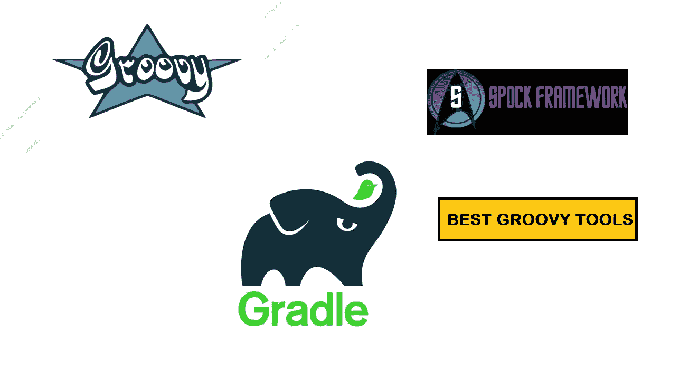
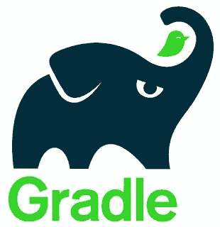
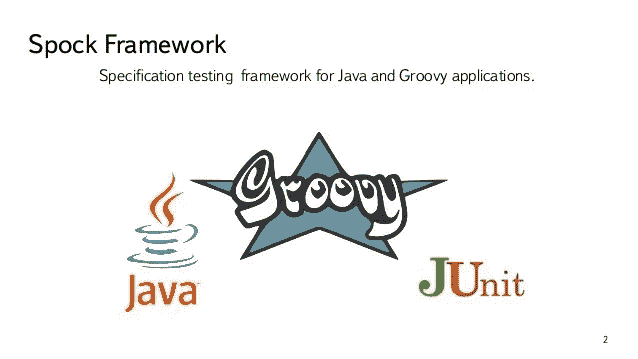

# 2022 年前三大 Groovy 框架和工具

> 原文：<https://medium.com/javarevisited/top-3-groovy-frameworks-and-tools-java-developers-should-learn-736da9731e16?source=collection_archive---------1----------------------->

## Gradle、Grails 和 Spock 是三个最好的 Groovy 框架和工具，值得 2022 年的 Java 开发人员学习。

大家好，如果你正在寻找 2022 年最好的 Groovy 框架，那么你来对地方了。在过去的几篇文章中，我已经分享了微服务的最佳 Java 框架****，[最佳 Java 库](/javarevisited/20-essential-java-libraries-and-apis-every-programmer-should-learn-5ccd41812fc7)以及 Java 开发人员可以学习的最佳 Scala 框架**，在这篇文章中，我将分享 Java 开发人员的最佳 Groovy 框架。******

******如果您不知道的话，Groovy 是另一种基于 JVM 的编程语言，它以其简洁明了的语法和编程的便利性补充了 Java。它是为 Java 开发人员创建脚本的最佳编程语言之一。******

******Groovy 最好的一点是它的代码被编译成 Java 字节码，这意味着它与 Java 完全兼容，你也可以在 Groovy 中使用任何 Java 库。******

******同时，还有优秀的 Groovy 框架和工具，如 Grails、Gradle 和 Spock，它们甚至值得 Java 开发人员学习，这也是我们在本文中要探讨的内容。******

******顺便说一下，如果你是 Groovy 新手，不知道如何用 Groovy 编码，那么我强烈推荐你学习。对于 Java 程序员来说，这是一个很好的第二语言，我可以从我们自己的经验中说出来。我用 Groovy 创建构建脚本和单元测试，然后是 Gradle。******

******并且，如果你需要学习 Groovy 的资源，我强烈推荐 Udemy 上的 [**完整的 Apache Groovy 开发者课程**](https://click.linksynergy.com/deeplink?id=CuIbQrBnhiw&mid=39197&murl=https%3A%2F%2Fwww.udemy.com%2Fcourse%2Fapache-groovy%2F) 课程。这个 13.5 小时，4.5 星级的课程是一个从零开始学习 Groovy 的 Dan Vega 的伟大课程。******

********

****并且，如果你喜欢看书，我也在这里分享了 [**我最喜欢的 Groovy 书籍**](/javarevisited/4-best-groovy-books-for-java-developers-dcfcc116168) ，你也可以看看，更快的学习 Groovy。****

# ****2022 年要学习的 3 个最佳 Groovy 框架和工具****

****不要再浪费你的时间了，这里有你在 2022 年可以学习的最好的 Groovy 框架，并为你的武器库添加更多的工具。****

## ****1.[格拉德](https://gradle.org/)****

****Gradle 可能是用 Groovy 编写的最流行的工具。它最初被吹捧为 [Maven](/javarevisited/6-best-maven-courses-for-beginners-in-2020-23ea3cba89) 的替代品，因为 c **risp 和简洁的构建文件**从 pom.xml 文件中删除了 XML 的样板文件，但现在它与 [Maven](/javarevisited/top-10-free-courses-to-learn-maven-jenkins-and-docker-for-java-developers-51fa7a1e66f6) 共存。

尽管越来越多的开发人员正在**转向 Gradle，以获得更简单、更易读的构建文件**，而且在未来，它可能真的会成为 Java 开发人员和 Java 应用程序的首选构建工具。

这是一个很好的学习工具，特别是如果你是一个动手的 Java 开发人员，如果你想学习 Gradle，那么你可以在 Udemy 上查看这个[**Gradle master class**](https://click.linksynergy.com/deeplink?id=JVFxdTr9V80&mid=39197&murl=https%3A%2F%2Fwww.udemy.com%2Fcourse%2Fgradle-masterclass%2F)课程。****

********

## ****2. [Grails](https://grails.org/)****

****Grails 是一个强大的基于 Groovy 的 JVM web 应用程序框架，它构建在另一个流行的 Java 开发框架 [Spring Boot](/javarevisited/10-best-java-microservices-courses-with-spring-boot-and-spring-cloud-6d04556bdfed) 之上。与 Ruby on Rails 一样，Grails 的目标是通过利用 Groovy 的简单性和表现力来简化 Java 开发。

[Grails](https://javarevisited.blogspot.com/2020/06/top-5-courses-to-learn-groovy-and-grails.html#axzz6vD2PZFID) 采用了流行的 Java 框架的最佳实践，比如它使用了约定胜于配置、合理的缺省值、自以为是的 API 和 Groovy 语言，使 Grails 易于 Java 开发人员学习。Grails 的另一个优点是它无缝、透明地与 Java、JVM 和现有的 Java EE 容器集成和互操作。如果你对 Java web 开发感兴趣，那么学习 Grails 会对你的技能有很大的帮助。如果你想学习 Grails 并且需要资源，那么我建议你在 Udemy 上查看这个 [**Grails 大师班**](https://click.linksynergy.com/deeplink?id=JVFxdTr9V80&mid=39197&murl=https%3A%2F%2Fwww.udemy.com%2Fcourse%2Fmastering-grails%2F) 。****

********

## ****3.Spock 测试框架****

****如果你对 Java 测试充满热情，那么你可能听说过 Spock，它是单元测试和规范的最佳 Groovy 框架之一。您可以使用 Spock 为 Groovy 应用程序和 Java 应用程序编写单元测试。****

****Spock 受到了 JUnit、RSpec、jMock、T2、Mockito、Groovy、T4、Scala 和其他流行的 Java 工具的启发。

让它脱颖而出的是其优美且极具表现力的规范语言。由于它的 JUnit runner，Spock 与大多数 ide、构建工具和持续集成服务器兼容。

在线学习 Spock 的资源并不多，但是从 Udemy 上的 [**与 Geb 和 Spock**](https://click.linksynergy.com/deeplink?id=JVFxdTr9V80&mid=39197&murl=https%3A%2F%2Fwww.udemy.com%2Fcourse%2Flearn-automation-with-geb-and-spock%2F) 一起学习自动化是最好的开始****

********

****如果你喜欢书，那么这本关于 Manning 的关于 Spock 的 Java 测试的书可能就是你开始学习 Spock 所需要的全部。****

**** [## 用 Spock 进行 Java 测试

### 与 Spock [Kapelonis，Konstantinos]在 Amazon.com 进行 Java 测试。*符合条件的优惠可享受免费*运输。Java 测试…

www.amazon.com](https://www.amazon.com/Java-Testing-Spock-Konstantinos-Kapelonis/dp/1617292532?tag=javamysqlanta-20) 

这就是 Java 开发人员在 2022 年可以学到的最好的 Groovy 框架和工具。很有可能你已经知道了其中的一些工具，因为它们在 Java 世界中非常流行，尤其是 Gradle，但是如果你不知道，2022 年是学习它们的最佳时机。Groovy 工具和框架简单易学，可以大大提高您的生产率。

你可能喜欢的其他**编程课程**和**文章**

*   [2022 年 Java 开发者路线图](https://javarevisited.blogspot.com/2019/10/the-java-developer-roadmap.html)
*   [3 Java 开发人员可以学习的编程语言](https://javarevisited.blogspot.com/2018/02/top-3-jvm-languages-java-programmer-learn.html)
*   [学习 Scala 编程的 10 个理由](https://javarevisited.blogspot.com/2018/01/10-reasons-to-learn-scala-programming.html)
*   [用 Scala 学习 Apache Spark 的 5 门免费课程](https://www.java67.com/2018/04/5-free-apache-spark-course-for-java-scala-python-developers.html)
*   [我最喜欢的学习软件架构的课程](/javarevisited/top-5-courses-to-learn-software-architecture-in-2020-best-of-lot-5d34ebc52e9)
*   [2022 年 Java 开发者应该学会的 10 件事](https://javarevisited.blogspot.com/2017/12/10-things-java-programmers-should-learn.html#axzz5atl0BngO)
*   [面向程序员的 2022 年 DevOps 路线图](https://javarevisited.blogspot.com/2018/09/the-2018-devops-roadmap-your-guide-to-become-DevOps-Engineer.html)
*   [2022 年学习 Spring Boot 的十大课程](/javarevisited/top-10-courses-to-learn-spring-boot-in-2020-best-of-lot-6ffce88a1b6e)
*   [面向程序员和工程师的 10 门 DevOps 课程](https://javarevisited.blogspot.com/2018/09/10-devops-courses-for-experienced-java-developers.html)
*   [Java 和 Web 开发人员应该学习的 10 个框架](https://javarevisited.blogspot.com/2018/01/10-frameworks-java-and-web-developers-should-learn.html)
*   [面向程序员的 5 大 Java 设计模式课程](https://javarevisited.blogspot.com/2018/02/top-5-java-design-pattern-courses-for-developers.html)
*   [学习芯泉和 Spring Boot 的 5 门免费课程](http://www.java67.com/2017/11/top-5-free-core-spring-mvc-courses-learn-online.html)

感谢您阅读本文。如果你喜欢这些用于 Java 开发的最好的 Groovy 工具和框架，那么请与你的朋友和同事分享。如果您有任何问题或反馈，请留言。

**P. S. —** 如果你真的想学习 Groovy 和 Gradle、Grails 之类的框架，并且正在寻找最好的 Groovy 课程，那么你也可以在 Udemy 上查看由 Dan Vega 撰写的完整的 Apache Groovy 开发人员 **课程**。这个 13 小时 30 分钟的在线课程是在线学习 Groovy 的最佳课程。

 [## 2022 年在线学习 Groovy 和 Grails 的 5 大课程——最好的

### 大家好，如果你想在 2022 年学习 Groovy 或 Grails，并寻找一些很棒的资源，如书籍、课程…

javarevisited.blogspot.com](https://javarevisited.blogspot.com/2020/06/top-5-courses-to-learn-groovy-and-grails.html#axzz6vD2PZFID)****