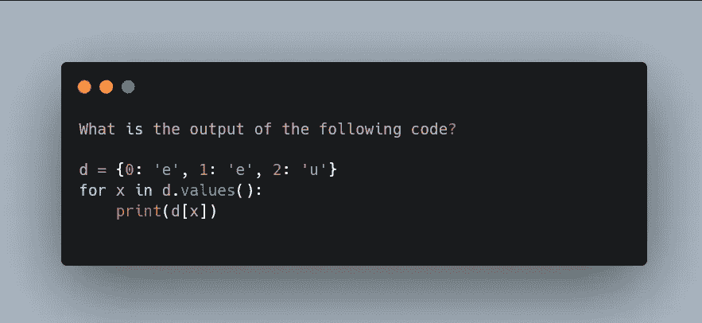
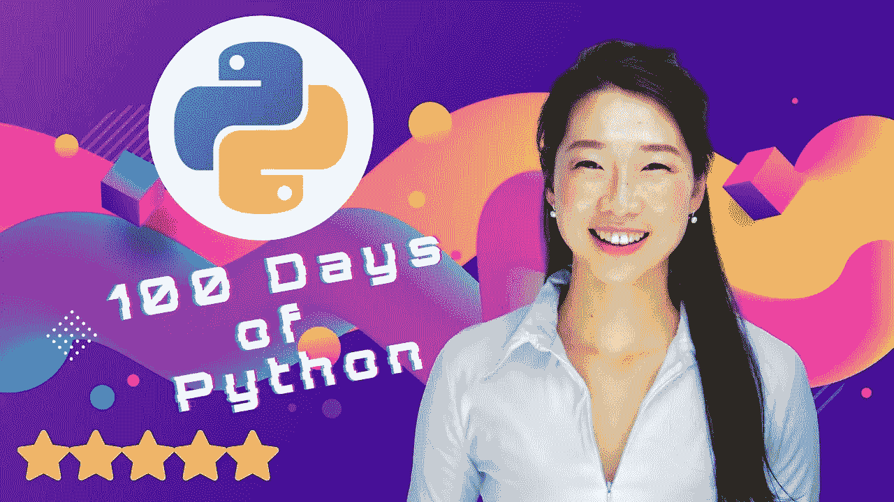
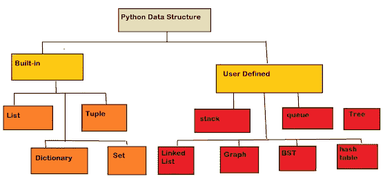
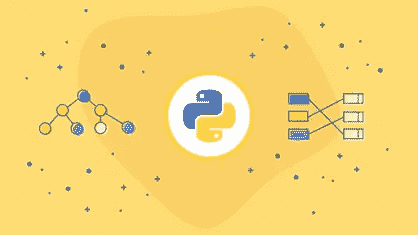

# 1 至 3 年经验的前 30 名 Python 面试问答

> 原文：<https://medium.com/javarevisited/top-30-python-interview-questions-and-answers-for-practice-8581c4440d98?source=collection_archive---------2----------------------->

[](https://click.linksynergy.com/deeplink?id=CuIbQrBnhiw&mid=39197&murl=https%3A%2F%2Fwww.udemy.com%2Fcourse%2F100-days-of-code%2F)

你好，伙计们，如果你正在准备一份 **Python 开发人员的工作**并且正在寻找一些常见的 Python 面试问题，那么你来对地方了。

早些时候，我已经分享了[完整的 Python 开发者路线图](https://javarevisited.blogspot.com/2022/05/the-python-developer-roadmap.html)、[最佳书籍](https://javarevisited.blogspot.com/2019/07/top-5-books-to-learn-python-in-2019.html) 和 [**学习 Python 的最佳课程**](https://javarevisited.blogspot.com/2018/03/top-5-courses-to-learn-python-in-2018.html) ，在本文中，我将分享 35 个 Python 问题，涵盖 Python 开发者面试的不同概念。

参加任何面试，尤其是科技面试，本身就是一项艰难的工作。没有适当的准备，你不能进去。即使你已经参加或接受了几十次面试，也总是建议你浏览一下快速准备笔记或概念。

假设你足够自信，因为你有很好的说服力和一流的沟通技巧，你会在没有准备的情况下震撼面试，那么让我告诉你，小组成员在测试候选人方面有专长。他们会从你身上挖掘每一个漏洞。因此，最好做好充分的准备，尽可能多的堵住漏洞。

通过这篇指南，我将分享大多数 [Python 开发者面试](https://www.java67.com/2022/06/python-interview-questions-with-answers.html)中反复被问到的**前 30 个 Python 面试问题**。这 30 个问题并不是突然出现在我们脑海中的。我们已经完成了部分研究，并请数百名学生与我们分享他们的面试经历。经过深入调查，我挑选了 Python 面试中最常问的 30 个问题。

我还列出了 *5 个高级 Python 面试问题*。因此，如果你申请的简介可能需要高级 python 知识，你可以看看。

除此之外，我们甚至咨询了各种各样的 [Python 专家](https://javarevisited.blogspot.com/2020/02/10-best-coursera-courses--for-python.html)，然后创建了这个列表。在寻找有关 Python 的常见问题时，我们发现，如果你想在未来几年成为一名 IT 专业人员，Python 编程是一项必须掌握的技能。

顺便说一下，如果你是 Python 编程的新手，那么我也建议你参加一个全面的 Python 课程，并在开始面试问题之前建立你的 Python 技能。如果你需要推荐，我建议你去 Udemy 上看看 Angela Yu 的《代码 100 天》—《Python Pro boot camp》。这是一个很好的实践课程，可以帮助您提高 python 技能。

[](https://click.linksynergy.com/deeplink?id=CuIbQrBnhiw&mid=39197&murl=https%3A%2F%2Fwww.udemy.com%2Fcourse%2F100-days-of-code%2F)

# 30 Python 开发者面试问答 1 到 2 年经验

为了不浪费你更多的时间，这里是我的面试问题列表。这个列表包含了常见的 Python 问题，适合有 1 到 2 年经验的 Python 程序员。它涵盖了许多重要的 Python 概念，如 Python 基础知识、Python 中的数据结构以及 Python 在机器学习中的应用。

您可以使用这个列表快速修改 Python 的基本概念，或者从访谈的角度探索 Python。

**#1。Python 是什么？**

**Ans。** Python 是一种现代编程语言，由 Guido Van Rossuim 于 20 世纪 80 年代构建，但它于 1991 年公开发布。休息是历史。

**#2。Python 相对于其他编程语言有什么好处？**

**Ans。** Python 比其他编程语言有数百项优势，下面提到了其中一些:

● Python 是一种非常容易使用的语言，

● Python 对外部库有全面的支持，

●庞大的社区，

●高级语言，

● GUI 支持的语言，

●便携语言，

●集成语言，

●免费开源语言，

●快速高效的编程语言。

**#3。提到 Python 中 List 和 Tuple 的关键区别。**

**Ans。**List 和 Tuple 的一个显著区别是 **list 是可变的数据结构，而 Tuple 是不可变的数据结构**。list 和 Tuple 的另一个很大的区别是 List 可以有可变的长度，但是 Tuple 只会有固定的长度。你也可以在 Udemy 上查看[**Python**](https://click.linksynergy.com/deeplink?id=JVFxdTr9V80&mid=39197&murl=https%3A%2F%2Fwww.udemy.com%2Fcourse%2Fdata-structures-and-algorithms-bootcamp-in-python%2F)的完整数据结构和算法课程，了解更多关于 Python 数据结构的知识。

[](https://click.linksynergy.com/deeplink?id=JVFxdTr9V80&mid=39197&murl=https%3A%2F%2Fwww.udemy.com%2Fcourse%2Fdata-structures-and-algorithms-bootcamp-in-python%2F)

**#4。IPython 和 Python 有什么不同？**

**Ans。** IPython 是一个使用 Python 创建的交互式 shell，但它比标准 Python 更强大，它提供了 REPL，即 Read Eval Print Loop。IPython 有一个使 Python 编程更有趣的接口，因为它具有语法高亮、代码完成等特性。

**#5。Python 为什么这么受欢迎？**

**Ans。Python 是最流行的语言之一，因为它被认为是最容易理解的语言之一。即使是非技术领域的人也发现 Python 超级容易阅读。**

**#6。突出 Python 中数组和列表的区别。**

**Ans。**这两个都是 Python 程序中的存储空间；数组和列表的显著区别在于，数组只能存储单一数据类型的值，而列表可以存储多种数据类型的值。

您还可以在 Python 中检查 [**数据结构以进行编码面试，这是 Educative 的一门基于文本的交互式课程，旨在使用 Python 进一步提高您的数据结构技能。**](https://www.educative.io/courses/data-structures-coding-interviews-python?affiliate_id=5073518643380224)

[](https://www.educative.io/courses/data-structures-coding-interviews-python?affiliate_id=5073518643380224)

你可以单独上这门课，也可以订阅 [**教育课程**](https://www.educative.io/subscription?affiliate_id=5073518643380224) 来学习他们的 250 多门课程，其中包括我最喜欢的课程，比如系统设计面试、面向对象编程，每月只需 14.99 美元。

**#7。如何在系统上安装 Python？**

**俺们。** Python 安装是一种快速、简单的方法，尤其是对于 Mac。要在 Mac 上安装 Python，首先要安装 Homebrew，然后使用 Homebrew 包管理器，只需一个命令就可以安装 Python。

对于自制软件安装，在终端窗口中写入以下命令:

`$ ruby -e “$(curl -fsSL`https://raw . githubusercontent . com/home brew/install/master/install)"

一旦安装了 Homebrew，编写以下命令在您的系统上安装 Python:

$ brew 安装 python3

仅此而已；您已经在 Mac 上成功安装了 Python。你也可以为 [Python 编程](https://javarevisited.blogspot.com/2020/05/top-10-udemy-courses-to-learn-python-programming.html)安装一个合适的 IDE (Pycharm 或 Anaconda)，Python 会自动安装。

对于 windows，你必须访问官方网站，根据你的系统寻找最合适的 Python 版本。下载正确的版本，并像安装传统软件一样安装它。

**#8。Python 赋予变量的默认数据类型是什么？**

**俺们。**Python 赋予新变量的默认数据类型是“字符串”

**#9。PEP 的完整形式是什么？**

**Ans。** PEP 代表 Python 增强提案。在这种情况下，发布了一套规则和指南，指导开发人员编写完美且可读的代码。

**#10。PEP8 是什么？解释一下。**

**Ans。** PEP8 是一个 Python 工具，被数百万 Python 开发者用来检查他们程序的可读性。

**#11。什么是 Python 模块？**

**Ans。**Python 模块是一个可执行的 Python 文件，其中写有一些程序，该程序可能包含各种全局变量和方法。

**#12。Python 中的类型转换/造型是什么概念**

**Ans。**类型转换是一种流行的实践，开发人员通常遵循这种实践将特定的数据类型转换为其他数据类型。

**#13。为什么 ML(机器学习)大量使用 Python？**

**答案。** Python 因为对库和包的全面支持，在机器学习行业大量使用。

对于机器学习专业人员来说，一个重要的缺点是无法获得不同的模块、包和库。Python 以一种超级简单的格式提供了一切。这就是 Python 如此受 ML 专家欢迎的原因。

如果你想探索机器学习，我强烈推荐你加入 Udemy 网站上基里尔·叶列缅科的 [**机器学习 A-Z:动手 Python&R In Data Science**](https://click.linksynergy.com/deeplink?id=CuIbQrBnhiw&mid=39197&murl=https%3A%2F%2Fwww.udemy.com%2Fcourse%2Fmachinelearning%2F)课程。用 Python 学习机器学习是很棒的课程。

[](https://click.linksynergy.com/deeplink?id=CuIbQrBnhiw&mid=39197&murl=https%3A%2F%2Fwww.udemy.com%2Fcourse%2Fmachinelearning%2F)

**#14。Python 是区分大小写的语言吗？**

**Ans。**是的，Python 是区分大小写的语言；一个字符错误会导致程序提前终止。

**#15。说出 Python 中不可变的数据结构。**

**Ans。**元组是不可变的数据结构之一，其值不能改变。

**#16。列出 Python 不同的内置数据结构。**

**Ans。Python 现在有四种内置的数据结构；所有这些问题如下:**

●列表

●元组

●字典

●设置。

**#17。你说的集合数据结构是什么意思？**

**答案。** Set 是一种特殊类型的数组，可以按照所需的顺序存储唯一的值。与**列表不同，Set 不是有序的数据结构**；因此，有时很难使用索引来访问特定的元素。

集合一般是可变的，但有一种特殊类型的集合，即冻结集合，一种不可变的数据结构。除此之外，Set 不能存储多个值。

**#18。字典里的 key()是什么意思？**

**Ans。**要查看字典中存储的所有键值，使用 key()方法。它返回一个视图，其中包含存储在特定字典中的所有键的信息。

**#19。用 Python 描述 Pip？**

**Ans。**因为 Python 支持数百个外部库，所以拥有一个可以找到所有 Python 库的包管理器是很重要的。Pip 就是 Python 的一个这样的包管理器。它包含关于大多数外部依赖项和库的信息，而我们可以通过 Pip 安装所需的库。

**#20。列举一些最流行的 Python ide。**

**Ans。**一些最流行的 Python are 如下:

● PyCharm

● Spyder

●日食

● Visual Studio 代码

● Jupyter 笔记本

**#21。用 Python 写“for”循环的语法。**

**Ans。**“for”循环在每一种编程语言中都起着重要的作用；每个开发人员每天至少使用一次。

以下是“for”循环的语法:

```
**for** **var** **in** **data** structure:
Statements;
```

在这里，var 是一个新的变量，数据结构充当所需交互的总数。除了数据结构，这里还可以使用 Python 的 range()方法定义一个特定的范围。

**#22。在什么条件下，While 循环可以迭代无限次。**

**答案。循环对于编程语言来说非常重要，但是也有可能因为一个循环而导致整个程序出现故障。如果循环的 stop 语句不正确，它可能是破坏性的。**

例如，如果 While 循环中的测试条件没有返回 false，那么循环将无限运行。参考下图:

这里“循环已退出”语句将永远不会被打印出来，因为控件不会因其无限迭代而退出 while 循环。

**#23。用 Python 描述 conda。**

**Ans。**在 Python 中，Conda 是环境管理器；它从 Anaconda 存储库和 Anaconda Cloud 安装 conda 包。在安装包的同时，conda 还为包安装了一个 python 解释器。

Conda 可以有用不同编程语言编写的包。因此，如果一些项目需要在一个单一的屋顶下的其他编程语言的外部库，conda 管理器很快使之成为可能。

**#24。Python 中的 Set 和 Array 有什么不同？**

**俺们。**数组和集合的主要区别在于数组可以存储重复值，而集合数据结构只接受唯一值。

**#25。描述 Python 的所有三个名称空间。**

**Ans。** Python 语言有以下命名空间:

**内置名称空间:**这是默认的名称空间，包含 Python 所有内置对象的名称。像 len()、range()这样的方法被称为内置对象。

**全局名称空间:**主程序中创建的所有名称都存储在“全局名称空间”下

**本地命名空间:**其他对象派生的对象存储在本地命名空间下。

**#26。Java 和 Python 中字符串到数字的转换比较？**

**Ans** 。Java 有两种不同的方法允许开发人员将特定的字符串转换成数字:

● parseInt()

● valueOf()

而 Python 有一些不同，可以实现“int()”方法将字符串值转换成整数。

**#27。range()函数的作用是什么？**

**答案。**每当需要迭代时，就使用 range()方法。它返回从 0 开始的整数。迭代依赖于开发者；他/她可以设置“停止”属性。

**#28。Python 支持开关情况吗？**

**Ans** 。与其他编程语言不同，Python 不支持开关情况。但是，如果开发人员愿意，他/她可以很容易地定义他们的开关函数，并相应地创建不同的 case 语句。

**#29。Python 中的切片是什么？**

**答案。在 Python 中，切片是为访问字符、字符串的子串或者列表或元组的项目而构建的特性。**

**#30。Python 中的 Flask 是什么？**

**Ans。** Flask 是用 Python 编程语言写的一个整体框架？它主要用于与 web 开发相关的项目。Flask 也被称为使用 Python 语言构建的微型 web 框架；这里使用术语 Micro 表示 Flask framework 不需要任何外部工具或库；它拥有基本 web 开发项目所需的一切。

如果想了解更多，还可以在 Udemy 上加入带 Flask 的[**REST API 和 Python**](https://click.linksynergy.com/deeplink?id=CuIbQrBnhiw&mid=39197&murl=https%3A%2F%2Fwww.udemy.com%2Fcourse%2Frest-api-flask-and-python%2F) 课程。对于初学者来说，学习 Flask 是一个非常好的实践课程。

[](https://click.linksynergy.com/deeplink?id=CuIbQrBnhiw&mid=39197&murl=https%3A%2F%2Fwww.udemy.com%2Fcourse%2Frest-api-flask-and-python%2F)

# 5 个常见的高级 Python 问题及答案

在这一节中，我选择了 5 个最常见的问题，最近还问了一些高级 Python 的面试问题。请注意，这些问题大多是在你的简历中列出了高级 Python 的情况下被问到的。

IT 面试官最感兴趣的是简历中提到的技能，在制作简历时要非常小心。不要只是增加技能来增加清单的长度，你可能会在面试中被拥抱。

在过去，我也分享过许多[编程面试问题](https://javarevisited.blogspot.com/2011/06/top-programming-interview-questions.html)、[数据结构和算法问题](https://www.java67.com/2018/06/data-structure-and-algorithm-interview-questions-programmers.html)、[软件设计问题](https://www.java67.com/2018/05/top-20-system-design-interview-questions-answers-programming.html)、 [OOP 问题](https://javarevisited.blogspot.com/2020/05/object-oriented-programming-questions-answers.html#axzz6uiUE2EEk)，以及一些 [SQL 和数据库问题](https://javarevisited.blogspot.com/2021/05/sql-and-database-phone-interview-questions.html#axzz6vIXZv0pN)，你可以将它们与这些 Python 问题一起用于面试的整体准备。

**#1。Python 中的 decorators 是什么？**

**Ans。**简单地说，装饰器是用于改变 python 程序中的方法或类的行为的工具。

每当我们想要扩展一个方法的功能而不实际修改它的定义时，我们可以使用 decorators。在 decorators 的帮助下，我们可以将一个特定的方法包装在另一个方法中。

**#2。Python 中的. pyc 文件是什么？**

**Ans。在 Java 中，我们得到一个. class 文件，其中包含我们想要执行的程序的字节码。同样，在 Python 中，。pyc 文件包含了我们想要执行的 python 程序的所有字节码。**

虽然 Python 是一种现代编程语言，但它仍然被认为是一种像 Java 一样的解释语言。

**#3。术语元类在 Python 中表示什么，什么时候使用？**

**答案。**这听起来可能令人困惑，但是元类是为类而类。当一个程序有多个行为几乎相同的类时，继承可能很难实现。

在这种情况下，可以使用元类来代替继承。它允许我们为程序中的许多类指定特定的行为。

一个非常流行的元类是 ABCMeta，它用于指定程序中的抽象类。

**#4。什么是发电机功能？**

**俺们。**生成器函数几乎类似于一个基本的 python 函数，但几乎并不意味着生成器函数与 python 函数完全相同。

与任何其他 Python 函数不同，生成器函数在 return 语句中没有 return 关键字，相反，它们在 return 语句中有 yield 关键字。

以下是生成器函数的语法:

*#普通 python 函数*

**def** basicfunc():

**返回**1；

*#基本产量函数*

**def** generatorfun():

**产量**1；

生成器函数没有特殊的定义，yield 关键字使它变得特殊。每当 python 在一个函数中检测到 yield，它会自动将其标记为生成器函数。

与 python 函数相比，使用生成器函数的好处在于，它会在返回值之前暂停执行；因此，每当控件返回到同一个生成器函数时，都会返回一个不同的值。

range()是最流行的生成器函数之一。如果需要，还可以通过用 yield 关键字替换 return 关键字来创建一个生成器函数。

**#5。Python 中的 GIL 是什么？**

**Ans。** GIL 代表全局解释器锁。Python 使用 GIL 实现并发。这种机制是 Python 的内置特性。尽管 GIL 是一个强大的工具，但大多数开发人员都想淘汰它，因为它不支持 Python 中的并发线程。然而，开发者无法避免 GIL，因为它是一个内置的特性。

**加分题:** **什么是 __init__？**

**Ans。** __init__ 是一个方法，或者我们称之为构造函数。每当创建类的对象或实例时，都会自动调用此方法。除非开发人员想给对象或实例添加一些附加属性，否则不需要声明这个函数。__init__ 方法将内存分配给该类新创建的实例和对象。

**快速提示:**如果你不擅长 Python 编程，建议你参加一些入门课程。互联网上有一些可信的学习平台；其中一些提到如下:

● Udemy — [**在 Python 中完成从零到英雄的 Python boot camp**](https://click.linksynergy.com/deeplink?id=CuIbQrBnhiw&mid=39197&murl=https%3A%2F%2Fwww.udemy.com%2Fcourse%2Fcomplete-python-bootcamp%2F)]

● ZTM 学院[ [**完全 Python 开发者:零到精通**](https://academy.zerotomastery.io/p/complete-python-developer-zero-to-mastery?affcode=441520_zytgk2dn)

● Coursera [ [**谷歌 IT 自动化带 Python 专业证书**](https://coursera.pxf.io/c/3294490/1164545/14726?u=https%3A%2F%2Fwww.coursera.org%2Fprofessional-certificates%2Fgoogle-it-automation) ]

这些平台上的大多数课程都是免费的，由全球的行业专业人士提供。所有这些课程将让你对 Python 行业有一个清晰的认识。你将学到成为一名成功的专业 Python 开发者所需要的一切。

如果您的准备时间有限，建议您多次浏览这 30 个 python 面试问题。除此之外，不要光看这些问题；试着理解这些术语。这样，如果你的面试官改变了提问的语言，你就可以自信地回答了。

如果你参加过多次面试，发现其中有几个共同的问题，并希望我将它们列在这个 **35 python 面试问题的**列表中，那么请留下你的评论。我们将进一步讨论它。除此之外，如果你最近参加了一个 Python 面试，并且遇到了一些棘手的问题，请在下面告诉我们；我们很乐意将它添加到我们的题库中。

其他**你可能想探究的面试问题文章**

*   [130+ Java 面试问题及答案](https://javarevisited.blogspot.com/2015/10/133-java-interview-questions-answers-from-last-5-years.html#axzz6uiUE2EEk)
*   [20+ Spring Boot 面试问题及答案](https://javarevisited.blogspot.com/2020/05/top-20-spring-boot-interview-questions-answers.html)
*   [10 个甲骨文面试问题及答案](https://javarevisited.blogspot.com/2012/12/top-10-oracle-interview-questions-and-answers-database-sql.html#axzz6uiUE2EEk)
*   [20 个 JUnit 面试问题及答案](https://javarevisited.blogspot.com/2021/04/junit-interview-questions-with-answers.html)
*   20 个 Kubernetes 面试问题及答案
*   [17 春季 AOP 面试问题及答案](https://javarevisited.blogspot.com/2021/03/spring-aop-interview-questions-answers.html)
*   [20 个 Docker 面试问题及答案](https://javarevisited.blogspot.com/2022/05/docker-interview-questions-answers-for.html)
*   [40+面向对象编程问题及答案](https://www.java67.com/2015/12/top-30-oops-concept-interview-questions-answers-java.html)
*   [25 个 DevOps 面试问题及答案](https://javarevisited.blogspot.com/2022/05/devops-interview-questions-and-answers.html)
*   [学习 SQL 和数据库的 10 门免费课程](/javarevisited/7-free-courses-to-learn-database-and-sql-for-programmers-and-data-scientist-e7ae19514ed2)
*   [来自面试的 20 个软件设计和模式问题](https://www.java67.com/2016/07/top-5-object-oriented-design-interview-questions.html)
*   [20 个 Maven 面试问题及答案](https://javarevisited.blogspot.com/2022/07/maven-interview-questions-with-answers.html)
*   [50+微软 SQL Server 电话面试问题](https://www.java67.com/2019/08/microsoft-sql-server-phone-interview-questions-answers.html)
*   [25+春季安全面试问题及答案](https://javarevisited.blogspot.com/2021/02/spring-security-interview-questions-answers-java.html#axzz6lIcZ8tnd)
*   [软件开发人员的 20 个算法面试问题](https://javarevisited.blogspot.com/2019/04/top-20-searching-and-sorting-algorithms-interview-questions.html#axzz6uiUE2EEk)

感谢您阅读本文。如果你喜欢这些 Python 面试问题，那么请与你的朋友和同事分享。如果您有任何反馈，请留言。

**p . s .**——如果你是 Python 编程的新手，并且正在寻找一门免费的 Python 课程，以一种更结构化和更实用的方式学习 Python，那么你也可以查看 Udemy 上的这门[**Python 编程简介【免费】**](http://bit.ly/2D5vvnV) 课程。这个课程是完全免费的，已经有超过 60 万人加入了这个课程。

</swlh/5-free-python-courses-for-beginners-to-learn-online-e1ca90687caf> 