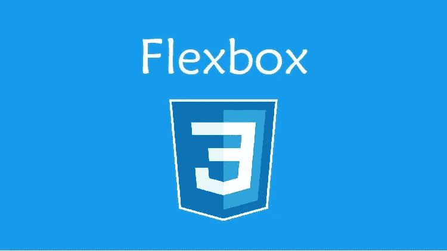
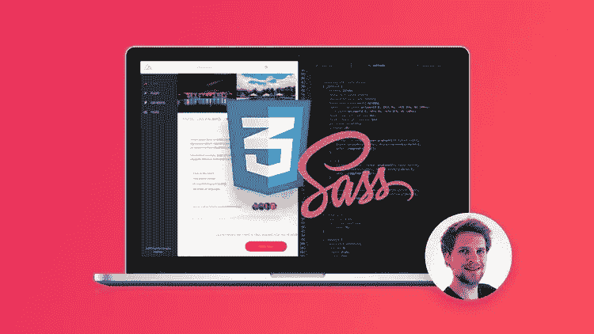
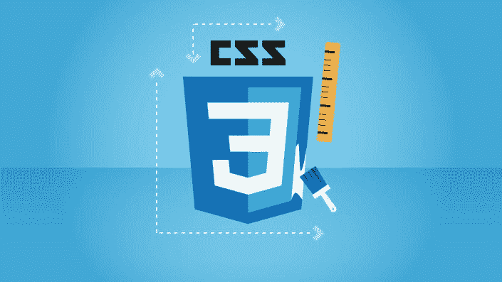
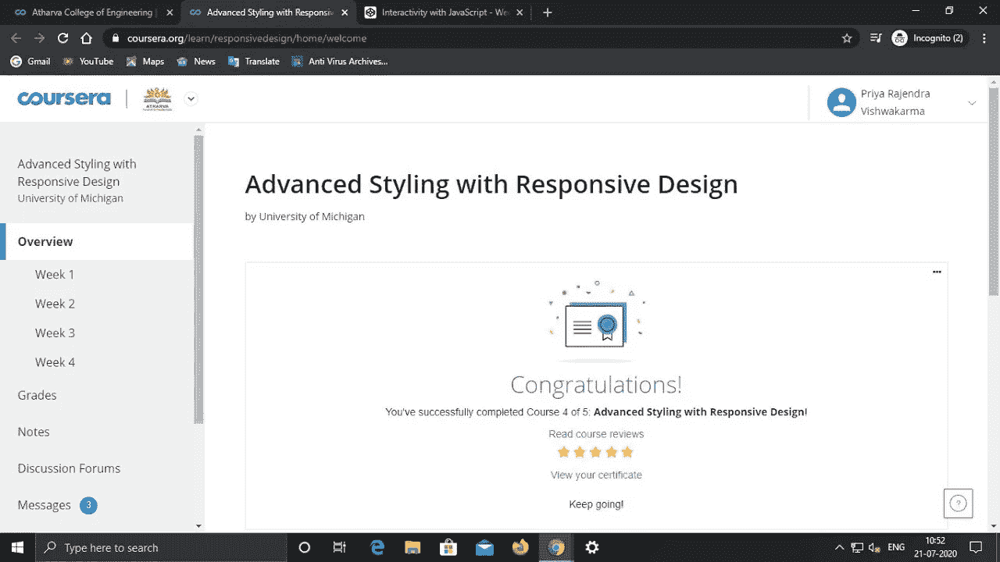
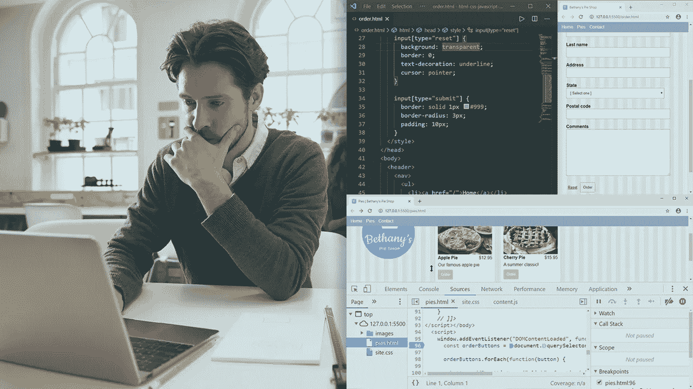

# 2023 年学习 Flexbox、Grid 和 Sass 的五大在线课程—最佳选择

> 原文：<https://medium.com/javarevisited/top-5-advanced-css-courses-to-learn-flexbox-grid-and-sass-da8e37b09b1d?source=collection_archive---------0----------------------->

## 这些是 2023 年学习高级 CSS、Flexbox、Grid 和 Saas 的最佳 Udemy 和 Coursera 课程

大家好，与 HTML 和 T2 JavaScript 一样，CSS 是万维网的核心技术之一，也是任何想在网页设计和网页开发领域开始职业生涯的人的关键技能。

如果你想在 2023 年学习 CSS 和高级 CSS 概念，如 Flexbox、Grid 和 Sass，那么你来对地方了。之前，我已经分享了 [**最佳 HTML 课程**](/javarevisited/10-best-html-and-css-courses-for-beginners-in-2021-6757eec00032)[**最佳 CSS 课程**](/javarevisited/10-best-css-online-courses-for-beginners-and-experienced-developers-54aa2e8c0253) ，以及 [**最佳网页开发课程**](/javarevisited/10-best-coursera-courses-for-web-development-and-web-design-9ec54ed92dd9) ，在这篇文章中，我将分享给网页设计师和开发人员的最佳-高级 CSS 课程。

没有 CSS，现代世界的网站是不完整的，可以肯定地说，没有 CSS，没有人能成为一个完整的 web 开发者。CSS 代表级联样式表。它用于定义网页的显示。它允许你创建有吸引力的和漂亮的网页。

这听起来可能有点生硬，但是如果你不理解 CSS，你就不可能成为一名 web 开发人员或全栈 web 开发人员。这是前端开发人员最重要的技能之一，但对全栈和后端开发人员也很有用。

一般来说， [CSS](/javarevisited/top-10-free-courses-to-learn-html-5-css-3-and-web-development-872d62d97a97) 不像 [JavaScript](https://javarevisited.blogspot.com/2018/06/top-10-courses-to-learn-javascript-in.html) 那么难，同时又像 HTML 那么容易。CSS 的基础很简单，不需要花时间去理解 CSS 是如何工作的。但是当你进入高级阶段，CSS 变得越来越复杂。

如今，你可以在台式机、笔记本电脑、平板电脑、智能手机等不同屏幕上访问网站。屏幕大小可以变化，网站也应该根据它来调整自己。这里出现了响应的概念。一个网站应该是有反应的。Bootstrap 是一个 CSS 框架，用于创建响应性 web 应用程序。所以和 CSS 一起，学习 Bootstrap 永远是个不错的选择。在这篇文章中，我将列出学习 CSS 的前 5 门课程，高级 [CSS](/javarevisited/top-10-free-courses-to-learn-html-5-css-3-and-web-development-872d62d97a97) ，Flexbox，Sass，Bootstrap 。

# 2023 年 Udemy 和 Coursera 的 5 门最佳 CSS (Grid、Flexbox 和 Sass)课程

在不浪费你更多时间的情况下，这里有最好的在线培训课程来学习高级 CSS 技能，如 Flexbox、Grid、Sass 和 Animations。

如果你想在网页设计和网页开发方面建立自己的职业生涯，那么学习这些技能可以促进你的职业生涯，让你的简历对未来的雇主和客户更有吸引力。

## 1.[高级 CSS 和 Sass: Flexbox、网格、动画— Udemy](https://click.linksynergy.com/deeplink?id=JVFxdTr9V80&mid=39197&murl=https%3A%2F%2Fwww.udemy.com%2Fcourse%2Fadvanced-css-and-sass%2F)

如果你熟悉 CSS 的基础，“高级 CSS 和 Sass: Flexbox，网格，动画和更多！”是最理想的课程之一。超过 97，000 名学生注册了这门课程。这门课程很大，因为它涵盖了二十多个小时。尽管篇幅很长，但选择这门课程是值得的，因为它拥有你学习高级 CSS 所需的一切。

要求

*   HTML 和 CSS 的基础知识。
*   这门课程不适合初学者。

它有大量用于特效和设计的 CSS 技术。它还涵盖了高级动画、flexbox 布局、网格布局和 Sass。此外，你还可以找到响应式网页设计的高级知识。

这里是加入本课程的链接— [高级 CSS 和 Sass: Flexbox、网格、动画](https://click.linksynergy.com/deeplink?id=JVFxdTr9V80&mid=39197&murl=https%3A%2F%2Fwww.udemy.com%2Fcourse%2Fadvanced-css-and-sass%2F)

## 2.[CSS—2023 年完整指南(包括 Flexbox、Grid & Sass)](https://click.linksynergy.com/deeplink?id=JVFxdTr9V80&mid=39197&murl=https%3A%2F%2Fwww.udemy.com%2Fcourse%2Fcss-the-complete-guide-incl-flexbox-grid-sass%2F)

Udemy 上的另一个畅销书“CSS-2023 年完整指南(包括 Flexbox、Grid 和 Sass)”是由最受欢迎的讲师之一 Maximilian Schwarzüller 创建的，他为前端开发人员创建了一些令人敬畏的课程，如[**React Complete Guid**e](https://click.linksynergy.com/deeplink?id=JVFxdTr9V80&mid=39197&murl=https%3A%2F%2Fwww.udemy.com%2Fcourse%2Freact-the-complete-guide-incl-redux%2F)和[**Angular Guide**](https://click.linksynergy.com/deeplink?id=JVFxdTr9V80&mid=39197&murl=https%3A%2F%2Fwww.udemy.com%2Fcourse%2Fthe-complete-guide-to-angular-2%2F)。

虽然这是一门初级课程，但它很好地涵盖了一些高级主题。如果你不是初学者，你可以跳过基础部分。

要求

*   HTML 基础知识。
*   不需要 CSS 知识。

本课程分为三个部分——基础、高级和专家。不管你的 CSS 水平如何，你都可以参加这个课程。它涵盖了从基础水平到专家水平的一切。

这里是参加本课程的链接—[CSS—2023 年完整指南(包括 Flexbox、Grid & Sass)](https://click.linksynergy.com/deeplink?id=JVFxdTr9V80&mid=39197&murl=https%3A%2F%2Fwww.udemy.com%2Fcourse%2Fcss-the-complete-guide-incl-flexbox-grid-sass%2F)

## 3.[采用响应式设计的高级造型——Coursera](https://coursera.pxf.io/c/3294490/1164545/14726?u=https%3A%2F%2Fwww.coursera.org%2Flearn%2Fresponsivedesign)

由密歇根大学的 Colleen van Lent 和 Colleen van Lent 创建的“响应设计的高级造型”是为那些想学习高级 CSS 和 bootstrap 的人开设的课程。

这门课程也是《面向所有人的 [**网页设计:网页开发基础知识&编码专业**](https://coursera.pxf.io/c/3294490/1164545/14726?u=https%3A%2F%2Fwww.coursera.org%2Fspecializations%2Fweb-design) 的一部分，是最受想学习网页设计的人欢迎的 Coursera 认证之一。

要求

*   HTML 和 CSS 知识。

它涵盖了 CSS3 的基础知识，然后是高级主题，如媒体查询、线框、流体设计以及现有样式范例(如 Bootstrap)的使用。响应设计是本课程的另一个主要目标。

这是一门付费课程，但如果你有经济问题，你可以随时选择 Coursera 提供的经济资助选项来免费注册。

**这是加入本课程的链接** — [高级造型与响应式设计](https://coursera.pxf.io/c/3294490/1164545/14726?u=https%3A%2F%2Fwww.coursera.org%2Flearn%2Fresponsivedesign)

顺便说一句，如果你觉得 Coursera 的课程有用，因为它们是由知名公司如**谷歌**、 **IBM** 、**亚马逊**和世界上最好的大学创建的，我建议你加入 Coursera 的年度订阅计划 [**Coursera Plus**](https://coursera.pxf.io/c/3294490/1164545/14726?u=https%3A%2F%2Fwww.coursera.org%2Fcourseraplus) 。

这种单次订阅可以让你无限制地访问他们最受欢迎的**课程**、**专业**、**专业证书**和**指导项目**。它每年花费大约 399 美元，但是它完全值得你的钱，因为你得到了无限的证书。

 [## Coursera Plus |无限制访问 7，000 多门在线课程

### 用 Coursera Plus 投资你的职业目标。无限制访问 90%以上的课程、项目…

coursera.pxf.io](https://coursera.pxf.io/c/3294490/1164545/14726?u=https%3A%2F%2Fwww.coursera.org%2Fcourseraplus) 

## 4.[使用 HTML 和 CSS 的响应式浏览器内网页设计](https://pluralsight.pxf.io/c/1193463/424552/7490?u=https%3A%2F%2Fwww.pluralsight.com%2Fcourses%2Fresponsive-browser-web-page-design-html-css-2262)

这是 Pluralsight 提供的高级 CSS 课程。在整个课程中，讲师将重点放在通过直接在浏览器中构建原型来从头开始构建网站。

要求

*   HTML 和 CSS 知识。

本课程的主要目标是在高级水平上提供对 CSS 和响应性的正确理解。本课程是 Pluralsight 评分最高的高级 CSS 课程之一。

**以下是加入本课程的链接—** [**使用 HTML 和 CSS 的响应式浏览器内网页设计**](https://pluralsight.pxf.io/c/1193463/424552/7490?u=https%3A%2F%2Fwww.pluralsight.com%2Fcourses%2Fresponsive-browser-web-page-design-html-css-2262)

顺便说一句，你需要一个 [**Pluralsight 会员**](https://pluralsight.pxf.io/c/1193463/424552/7490?u=https%3A%2F%2Fwww.pluralsight.com%2Fpricing) 才能加入这个课程，费用大约是每月 29 美元，每年 299 美元(14%的折扣)，但这完全值得。另类。你也可以使用他们的 [**10 天免费试用**](https://pluralsight.pxf.io/c/1193463/424552/7490?u=https%3A%2F%2Fwww.pluralsight.com%2Flearn) 免费观看本课程。

 [## 对个人来说

### Pluralsight 帮助个人学习者获得掌握最新软件开发所需的技术技能…

pluralsight.pxf.io](https://pluralsight.pxf.io/c/1193463/424552/7490?u=https%3A%2F%2Fwww.pluralsight.com%2Flearn) 

## 5.[用 HTML5 和 CSS3 构建反应灵敏的真实世界网站](https://click.linksynergy.com/deeplink?id=JVFxdTr9V80&mid=39197&murl=https%3A%2F%2Fwww.udemy.com%2Fcourse%2Fdesign-and-develop-a-killer-website-with-html5-and-css3%2F)

这个关于响应式网页设计的在线培训课程被认为是 Udemy 排名第一的 HTML5 和 CSS3 课程。近 18 万名学生注册了这门课程。

本课程面向所有人。不管你是一个初学者还是一个合格的设计师，这个课程对每个人都有概念。
要求

*   没有 HTML 或 CSS 的知识是必要的。

本课程的主要目标是指导人们如何使用 HTML5 和 CSS3 创建真实世界的网站。当然，它涵盖了基本概念，但是如果你已经熟悉了基本概念，就跳过它们，转到高级主题。

**这是加入本课程的链接—** [用 HTML5 和 CSS3 构建反应灵敏的真实世界网站](https://click.linksynergy.com/deeplink?id=JVFxdTr9V80&mid=39197&murl=https%3A%2F%2Fwww.udemy.com%2Fcourse%2Fdesign-and-develop-a-killer-website-with-html5-and-css3%2F)

以上就是 2023 年学习 Flexbox、Grid 和 Sass 的**最佳 CSS 课程。**正如开头提到的，CSS 是万维网的核心技术之一，正因为如此，你会在网上找到大量的课程。但这些课程大多只是涵盖了或多或少的中级概念的基础。你需要高级的 CSS 才能成为一名合格的设计师。

这篇文章为想学习高级 CSS 的人提供了五个精彩的课程。这些课程中的一些也涵盖了额外的概念，如 Sass 和 bootstrap，它们也是设计现代网站所必需的。

其他**你可能喜欢探索的 Web 开发文章**

*   [完整的 Web 开发者路线图](https://javarevisited.blogspot.com/2019/02/the-2019-web-developer-roadmap.html)
*   [学习 UI/UX 设计的前 5 门课程](https://javarevisited.blogspot.com/2020/06/top-5-courses-to-learn-ux-design-in.html)
*   [面向 Java 开发者的 5 门免费 Spring 框架课程](http://www.java67.com/2017/11/top-5-free-core-spring-mvc-courses-learn-online.html)
*   [面向 Web 开发者的 7 门免费 Node.js 课程](/javarevisited/7-free-courses-to-learn-node-js-in-2020-2f1dd6722b49)
*   [2023 年学习 Web 开发我最喜欢的课程](/better-programming/my-5-favorite-courses-to-learn-web-development-in-2019-a5e74167f8b2)
*   [2023 年学习 JavaScript 的 10 门课程](https://javarevisited.blogspot.com/2018/06/top-10-courses-to-learn-javascript-in.html)
*   [2023 年学习 HTML 和 CSS 的 5 大课程](https://javarevisited.blogspot.com/2019/05/top-5-html-5-and-css-3-courses-for-web-developers.html)
*   [10 本书和课程学习角](/javarevisited/top-10-angular-books-and-courses-for-beginners-and-experienced-web-developers-best-of-lot-9a2dae87f04c)
*   [2023 年学习 React 和 Redux 的 5 大课程](https://javarevisited.blogspot.com/2018/08/top-5-react-js-and-redux-courses-to-learn-online.html)
*   [2023 年 5 门免费学习 Bootstrap 的课程](https://www.java67.com/2019/01/5-free-bootstrap-course-to-learn-online.html)
*   [为什么学习 Web 开发永远都不晚](https://javarevisited.blogspot.com/2019/06/its-never-too-late-to-learn-web-development.html)
*   [2023 年学习 Angular 的前 5 门课程](https://javarevisited.blogspot.com/2018/06/5-best-courses-to-learn-angular.html)
*   [2023 年学习 Node.js 最佳课程之五](https://javarevisited.blogspot.com/2018/01/top-5-nodejs-and-express-js-online-courses-for-web-developers.html#axzz5VllnxgVT)
*   [如何在 2023 年成为一名现代 React JS 开发者](https://javarevisited.blogspot.com/2018/10/the-2018-react-developer-roadmap.html)

如果你是 CSS 初学者，正在寻找免费的网页设计入门课程，那么我强烈推荐 [**给网页开发者的网页设计:建立漂亮的网站！Jonas Schedtmann 教授的课程，最好的网页设计入门课程之一，在 Udemy 上也是免费的。你需要做的就是创建一个 Udemy 帐户来学习这门课程。**](https://click.linksynergy.com/deeplink?id=JVFxdTr9V80&mid=39197&murl=https%3A%2F%2Fwww.udemy.com%2Fcourse%2Fweb-design-secrets%2F)

 [## 免费网页设计教程-网页开发人员的网页设计:建立美丽的网站！

### 重要提示:这门课的内容也包含在我的另一门关于网页设计和开发的课程中

udemy.com](https://click.linksynergy.com/deeplink?id=JVFxdTr9V80&mid=39197&murl=https%3A%2F%2Fwww.udemy.com%2Fcourse%2Fweb-design-secrets%2F)