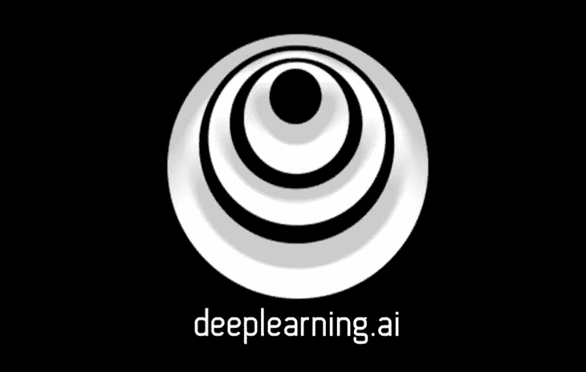
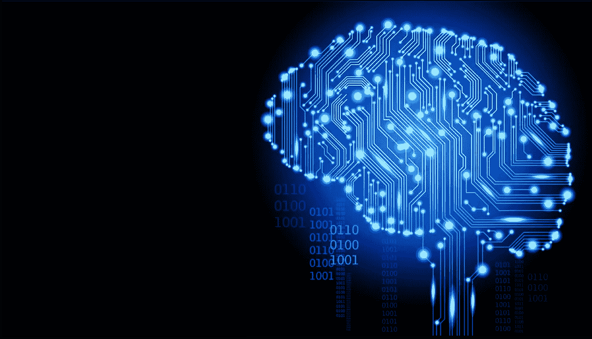
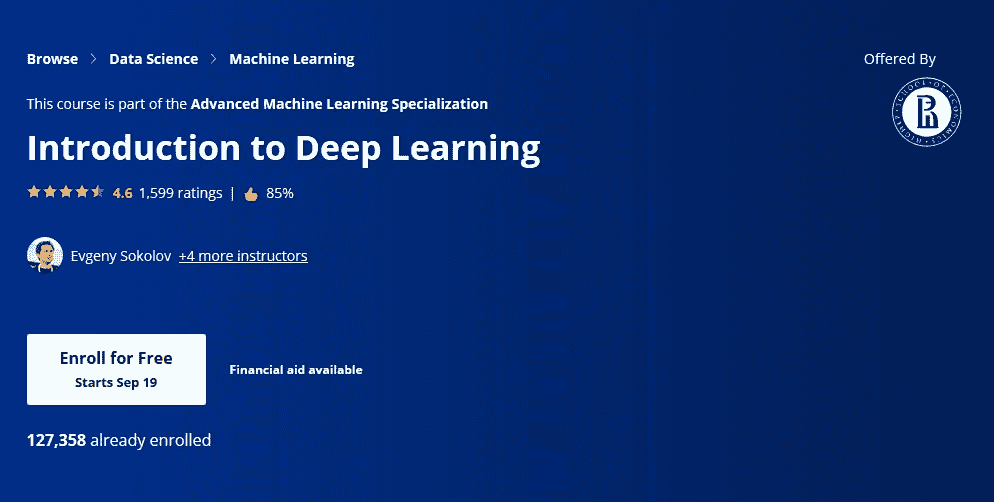
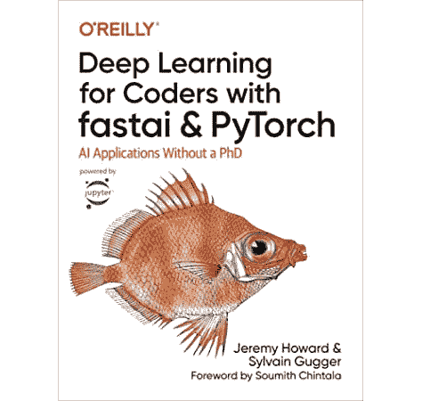
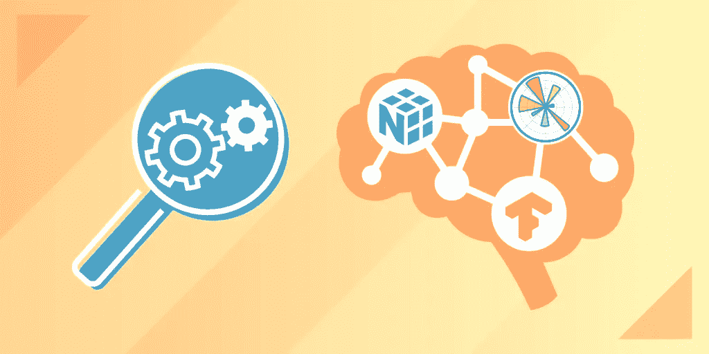
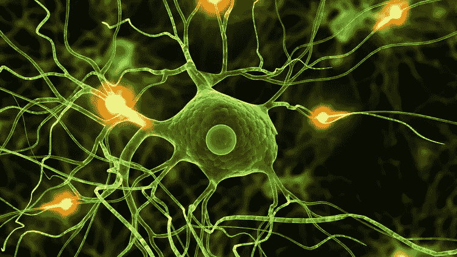

# 2023 年要学的 5 大深度学习和神经网络课程

> 原文：<https://medium.com/javarevisited/top-5-advanced-deep-learning-and-neural-network-courses-to-learn-in-2020-a273f5eddca5?source=collection_archive---------0----------------------->

Coursera 上的深度学习由[吴恩达](https://medium.com/u/592ce2a67248?source=post_page-----a273f5eddca5--------------------------------)

大家好，如果你想学习深度学习和神经网络，并寻找最好的在线课程，那么你来对地方了。早些时候，我已经分享了[最佳数据科学课程](/javarevisited/my-favorite-data-science-and-machine-learning-courses-from-coursera-udemy-and-pluralsight-eafc73acc73f)，今天，我将分享来自 Udemy 和 Coursera 的最佳深度学习在线课程。

学习深度学习深入？听起来递归？没有吗？的确如此。毫无疑问，机器学习是一门艰难的学科，特别是深入的知识，需要大量的数学和复杂的术语，很难掌握。

如果主题很难，那么你如何更好地学习它？好吧，选一门能用简单的话解释这个复杂话题的课程。我们其实很幸运，我们身边有很多优秀的导师，像吴恩达、@Jeremey Howard's、Udemy 上的基里尔·叶列缅科，他们不仅是[深度学习](https://javarevisited.blogspot.com/2018/10/data-science-and-machine-learning-courses-using-python-and-R-programming.html#axzz5gKfbWIIv)的专家，也是优秀的导师和老师。

我坚信每个程序员都应该了解[云计算](https://javarevisited.blogspot.com/2019/07/top-5-online-courses-to-learn-cloud-computing-aws.html)和[人工智能](/javarevisited/7-best-courses-to-learn-artificial-intelligence-in-2020-26d59d62f6fe)，因为这两者将在未来几年驱动世界。数据科学、机器学习和深度学习对于在许多方面理解和使用人工智能来说是必不可少的，这也是我花大量业余时间学习这些技术的原因。

我的机器学习之旅始于几年前，当时我在 Coursera 上偶然看到了吴恩达的优秀的 [**机器学习课程**](https://coursera.pxf.io/c/3294490/1164545/14726?u=https%3A%2F%2Fwww.coursera.org%2Flearn%2Fmachine-learning) ，这也恰好是 Coursera 的第一门课程，因为吴恩达也是 Coursera 和 DeepLearning.ai 的创始人之一，Deep Learning . ai 是 Coursera 最受欢迎的深度学习项目背后的公司。

<https://coursera.pxf.io/c/3294490/1164545/14726?u=https%3A%2F%2Fwww.coursera.org%2Fspecializations%2Fdeep-learning>  

除了课程之外，安德鲁还启发我学习机器学习和人工智能，从那以后，每当我阅读他在 Medium 上推出的深度学习课程时，我总是很兴奋地想了解更多关于这个领域的知识。另一个给我很大启发的故事是一个日本农民，他使用谷歌的 [TensorFlow](https://hackernoon.com/top-5-tensorflow-and-ml-courses-for-programmers-8b30111cad2c) 和[机器学习](https://dev.to/javinpaul/10-data-science-and-machine-learning-courses-for-programmers-looking-to-switch-career-57kd)在他的农场对黄瓜进行过滤和分类，显然只有他的母亲才能做到，因为她有多年的经验。

故事引人注目；他们不仅教学，而且启发，你会在这些优秀的课程中发现很多，我将与你分享关于深度学习的内容。

顺便说一句，如果你是机器学习新手那就不要从这些课程开始，最好的起点还是 Coursera 上的 [**吴恩达原创的机器学习**课程](https://coursera.pxf.io/c/3294490/1164545/14726?u=https%3A%2F%2Fwww.coursera.org%2Flearn%2Fmachine-learning)。只有你上了那门课之后，你才应该去查这些高级课程，深入学习神经网络和深度学习。

<https://coursera.pxf.io/c/3294490/1164545/14726?u=https%3A%2F%2Fwww.coursera.org%2Flearn%2Fmachine-learning>  

# 初学者学习深度学习和神经网络的 5 门最佳课程

在不浪费你更多时间的情况下，这里是我列出的深入学习深度学习的最佳课程。我选择的课程既适合初学者，也适合在机器学习和深度学习领域有一定经验的开发者。尽管数学是深度学习不可或缺的一部分，但我选择了一些不需要学习复杂数学概念的课程，只要需要，老师就会用简单的语言解释。

## 1.[吴恩达和团队的深度学习专业化](https://coursera.pxf.io/c/3294490/1164545/14726?u=https%3A%2F%2Fwww.coursera.org%2Fspecializations%2Fdeep-learning)

信不信由你，Coursera 可能是在线学习机器学习和深度学习的最好地方，其中一个很大的原因是吴恩达，他让机器学习在开发者中流行起来。

如果你不知道，他也是 Coursera 的创始人之一，他在斯坦福开设的经典机器学习课程很可能是 Coursera 上的第一门在线课程。除了那门经典课程，Andrew 还为每个人创造了更多的宝石，如[*AI*](https://coursera.pxf.io/c/3294490/1164545/14726?u=https%3A%2F%2Fwww.coursera.org%2Flearn%2Fai-for-everyone%3F)，这也是我向每个程序员和非技术人员推荐的。

AI 不只是针对程序员，而是针对所有人，这是所有非技术人员，如项目经理、业务分析师、运营和事件管理团队学习 AI 的最佳课程。

回到 Andrew 的深度学习专业化，这是一个以神经网络和深度学习为主的五门课程的集合，如下图:

1。神经网络和深度学习
2。改进深度神经网络:超参数调整、正则化和优化
3。构建机器学习项目
4。卷积神经网络
5。序列模型

Andrew 遵循自下而上的方法，这意味着您将从最小的组件开始，并朝着构建产品的方向前进。在这五门课程中，你将学习深度学习的基础，了解如何构建神经网络，并学习如何领导成功的机器学习项目。

**这里是加入本课程的链接** — [深度学习专业化](https://coursera.pxf.io/c/3294490/1164545/14726?u=https%3A%2F%2Fwww.coursera.org%2Fspecializations%2Fdeep-learning)

您还将了解卷积网络、RNNs、LSTM、Adam、Dropout、BatchNorm、Xavier/He 初始化等等。你将从事医疗保健、自动驾驶、手语阅读、音乐生成和自然语言处理的案例研究。课程不仅仅是枯燥的理论；动手性和互动性都很强。你将在 [Python](https://hackernoon.com/top-5-courses-to-learn-python-in-2018-best-of-lot-26644a99e7ec) 和 [TensorFlow](https://dev.to/javinpaul/10-of-the-best-tensorflow-courses-to-learn-machine-learning-from-coursera-and-udemy-37bf) 中实践想法，这些你将在课程中学到。

课程最精彩的部分是，你会听到很多深度学习领域的顶级领导者，他们会和你分享他们的个人故事，给你职业建议，非常鼓舞人心，令人耳目一新。

如果你对深度学习很认真，我强烈建议你加入这个专业化，完成全部五门课程。这可能需要 3 到 5 个月的时间，但它完全值得你花时间，已经有超过 50 万的学习者从这个专业中受益。

## 2.[深度学习 A-Z:动手人工神经网络](https://click.linksynergy.com/deeplink?id=JVFxdTr9V80&mid=39197&murl=https%3A%2F%2Fwww.udemy.com%2Fdeeplearning%2F)

如果你没有 3 到 5 个月的空闲时间，但是想详细学习深度学习，那么你应该加入这个课程。

在本课程中，你将从两位机器学习和数据科学专家那里学习如何用 Python 创建深度学习算法:基里尔·叶列缅科和哈德林·德·庞特斯。
它涵盖了从基本到高级深度学习概念(如 ANN 和 CNN 概念)的许多领域。

我非常喜欢 Kirill 展示模型直观部分的方式，Hadelin 为一些现实生活中的项目编写代码。

谈到社会证明，这门课程已经得到了超过 17 万名学生的信任，从接近 23K 的评分中平均获得了 4.5 的评分，这太令人惊讶了。

总之，这是一个激动人心的培训项目，包含直觉教程、实践练习和真实案例研究。我强烈向任何对数据科学和深度学习感兴趣的人推荐这门课程。

**这里是在线加入本课程的链接** e — [深度学习 A-Z:动手操作人工神经网络](https://click.linksynergy.com/deeplink?id=JVFxdTr9V80&mid=39197&murl=https%3A%2F%2Fwww.udemy.com%2Fdeeplearning%2F)

## 3.[深度学习入门](https://coursera.pxf.io/c/3294490/1164545/14726?u=https%3A%2F%2Fwww.coursera.org%2Flearn%2Fintroduction-to-deep-learning-boulder)【Coursera 最佳课程】

这是 Coursera 关于深度学习的又一个令人印象深刻的课程，我不是说过 Coursera 有互联网上最好的机器学习课程吗？嗯，是的，这个课程是他们[高级机器学习专业](https://coursera.pxf.io/c/3294490/1164545/14726?u=https%3A%2F%2Fwww.coursera.org%2Fspecializations%2Fmachine-learnin-theory-and-hands-on-practice-with-pythong-cu)的一部分。

本课程的目标是让学习者对现代神经网络及其在计算机视觉和自然语言理解中的应用有一个基本的了解。本课程首先回顾线性模型，并讨论对训练深度神经网络至关重要的随机优化方法。您将学习神经网络的基本构建模块，以及它如何一层一层地工作。

**这里是加入本课程**——[深度学习简介](https://coursera.pxf.io/c/3294490/1164545/14726?u=https%3A%2F%2Fwww.coursera.org%2Flearn%2Fintroduction-to-deep-learning-boulder)的链接

尽管如此，它期望你有很好的 Python 和数学知识。如果你还不熟悉 Python，我建议你参加我之前推荐的[顶级 Python 课程](https://dzone.com/articles/top-5-courses-to-learn-python-in-2018-best-of-lot)中的一门。

如果你觉得 Coursera 的课程、专业和认证有用，那么我建议你加入 [**Coursera Plus**](https://coursera.pxf.io/c/3294490/1164545/14726?u=https%3A%2F%2Fwww.coursera.org%2Fcourseraplus) ，这是 Coursera 的一个很棒的订阅计划，让你可以无限制地访问他们最受欢迎的课程、专业、专业证书和指导项目。它每年花费大约 399 美元，但是它完全值得你的钱，因为你得到了**无限证书**。

<https://coursera.pxf.io/c/3294490/1164545/14726?u=https%3A%2F%2Fwww.coursera.org%2Fcourseraplus>  

## 4.[fast . ai 面向编码人员的实用深度学习](https://course.fast.ai/)

这是杰瑞米·霍华德关于深度学习的经典课程。他是深度学习领域的另一位令人敬畏的导师，与 Coursera 的吴恩达和 Udemy 的基里尔·叶列缅科一起。

说起他的课程，正好和[吴恩达的深度学习课程](https://click.linksynergy.com/deeplink?id=JVFxdTr9V80&mid=40328&murl=https%3A%2F%2Fwww.coursera.org%2Fspecializations%2Fdeep-learning)相反。

前一门采用自下而上的方法，这门课采用自上而下的方法。我的意思是，你首先被介绍给产品，然后你深入到各个部分。

这门课程最棒的地方在于，它的结构非常好，循序渐进，有助于构建复杂的深度学习和神经网络概念。还有一本同名的书，你可以在亚马逊上买到。

这里是购买他的书的链接—[fastai 和 PyTorch 程序员的深度学习:没有博士学位的人工智能应用](https://www.amazon.com/Deep-Learning-Coders-fastai-PyTorch/dp/1492045527?tag=javamysqlanta-20)

## 5.[构建高级深度学习和 NLP 项目](https://www.educative.io/courses/building-advanced-deep-learning-nlp-projects?affiliate_id=5073518643380224)【教育性】

我一直非常相信边做边学。我认为把你所学的东西拼凑起来，然后建立一些东西是有真正价值的，这就是为什么我喜欢从互动课程中学习，比如这个基于文本的互动课程，来自 [Educative.io](https://www.educative.io/subscription?affiliate_id=5073518643380224) ，一个学习按需技术技能的新学习平台。

作为一名机器学习工程师，你需要知道一些事情，比如哪些模型用于某些任务，它们如何提高训练速度或模型准确性，以及最重要的是，如何对机器学习模型进行编码。

> 最后一点是我想重点说的:“机器学习模型如何编码”。

了解反向传播和梯度下降背后的微积分是一回事，但能够建立真实世界的机器学习模型是完全不同的技能。

雇主喜欢你表现出你曾参与过真正的项目。特别是在面试中，如果你能表现出你不仅知道自己在说什么，而且有经验来支持它，你会得到很多加分。

所以，本着构建 ML 模型和实践经验的精神，我想和大家分享一门非常精彩的课程: [**构建高级深度学习和 NLP 项目**](https://www.educative.io/courses/building-advanced-deep-learning-nlp-projects?affiliate_id=5073518643380224)

我真正喜欢这门课的原因是它是一门基于项目的课程。它将真正让你习惯于使用机器学习来构建真实世界的应用程序。你将使用所有行业工具，如 [NumPy](/javarevisited/6-best-online-courses-to-learn-numpy-for-beginners-60120f611e06) 、Matplotlib、 [sci-kit-learn](https://javarevisited.blogspot.com/2021/10/top-5-courses-to-learn-scikit-learn.html) 和 [Tensorflow](https://becominghuman.ai/top-10-courses-to-learn-tensorflow-for-machine-learning-in-2020-39a31e7cd84b) 。

如果你真的想获得一些深度学习和 NLP 的实践经验，那么我强烈推荐这门课。此外，你的投资组合中还会增加一些很棒的东西。

**这里是加入本课程的链接** — [构建高级深度学习和 NLP 项目](https://www.educative.io/courses/building-advanced-deep-learning-nlp-projects?affiliate_id=5073518643380224)

而且，如果你发现教育平台和他们的互动课程很有用，那么你还可以获得 [**教育订阅**](https://www.educative.io/subscription?affiliate_id=5073518643380224) ，它不仅提供这门课程，还提供他们的 210 多门课程，每月仅需 14.9 美元。它非常划算，非常适合准备编码面试

<https://www.educative.io/subscription?affiliate_id=5073518643380224>  

## 6.[数据科学:Python 中的深度学习](https://click.linksynergy.com/deeplink?id=JVFxdTr9V80&mid=39197&murl=https%3A%2F%2Fwww.udemy.com%2Fdata-science-deep-learning-in-python%2F)

这是另一个学习深度学习的很棒的在线培训课程。本课程最深入地介绍了神经网络理论，以及如何用纯 [Python](https://dev.to/javinpaul/9-projects-you-can-do-to-become-a-python-master-in-2020-1om) 和 [Tensorflow](https://javarevisited.blogspot.com/2018/08/top-5-tensorflow-and-machine-learning-courses-online-programmers.html) 编写一个神经网络。

如果你曾经想要一门课程，可以教你如何从零开始创建自己的神经网络，那么这是你应该加入的课程。本课程将让你开始使用深度学习技术构建你的第一个人工神经网络。你还可以找到对人工神经网络背后的数学的深入解释，这对数据科学家来说非常重要。

课程使用 [Python](https://dzone.com/articles/10-free-courses-to-learn-python-in-2019) 和 [NumPy](https://javarevisited.blogspot.com/2018/10/top-8-python-libraries-for-data-science-machine-learning.html) ，一个用于机器学习的 Python 库来构建完全非线性。它还会教你如何安装 TensorFlow，并使用它来训练你的深度学习模型。我强烈推荐这个课程给任何想知道深度学习真正是如何工作的人。

**这里是加入本课程** — [数据科学:Python 中的深度学习](https://click.linksynergy.com/deeplink?id=JVFxdTr9V80&mid=39197&murl=https%3A%2F%2Fwww.udemy.com%2Fdata-science-deep-learning-in-python%2F)的链接

以上就是掌握神经网络和其他深度学习概念的一些**最佳深度学习在线课程。我们还学习了有用的 Python 库，如 [TensorFlow](https://becominghuman.ai/top-10-courses-to-learn-tensorflow-for-machine-learning-in-2020-39a31e7cd84b) 、 [Pandas](https://becominghuman.ai/5-best-courses-to-learn-pythons-pandas-libary-for-data-analysis-and-data-science-34b62abb0e96) 和 [Numpy](https://becominghuman.ai/10-free-courses-to-learn-python-machine-learning-libraries-scikit-learn-numpy-pandas-keras-3c77ba1a6907) ，它们可以帮助你对深度学习模型进行数据清理、解析和分析。

你可以使用这些课程和在线培训中的任何一种来学习深度学习，但我强烈推荐你查看吴恩达及其团队在 Coursera** 上的 [**深度学习专业化。这是迄今为止最全面的深度学习资源。如果你喜欢这篇文章，你可能也会喜欢我的其他关于 Python、数据科学和机器学习的文章:**](https://click.linksynergy.com/deeplink?id=JVFxdTr9V80&mid=40328&murl=https%3A%2F%2Fwww.coursera.org%2Fspecializations%2Fdeep-learning)

*   [2023 年学习 Python 的 10 个理由](https://javarevisited.blogspot.com/2018/05/10-reasons-to-learn-python-programming.html)
*   [5 Python 中的数据科学与机器学习课程](https://javarevisited.blogspot.com/2018/03/top-5-data-science-and-machine-learning-online-courses-to-learn-online.html)
*   [2023 年学习数据科学的 10 种资源](https://dev.to/javinpaul/11-best-resources-to-learn-data-science-and-machine-learning-in-2020-2od)
*   [初学者学习 Python 的 5 大课程](https://hackernoon.com/top-5-courses-to-learn-python-in-2018-best-of-lot-26644a99e7ec)
*   [面向数据科学和机器学习的 8 大 Python 库](https://javarevisited.blogspot.com/2018/10/top-8-python-libraries-for-data-science-machine-learning.html)
*   [学习机器学习 Python 的前 5 本书](https://javarevisited.blogspot.com/2019/08/top-5-python-books-for-data-science-and-machine-learning.html)
*   [Python 和 JavaScript——从哪个开始比较好？](https://javarevisited.blogspot.com/2019/05/python-vs-javascript-which-programming-language-beginners-should-learn.html)
*   [深入学习 Python 的 10 门免费在线课程](https://javarevisited.blogspot.com/2018/12/10-free-python-courses-for-programmers.html)
*   [Python vs . Java——初学者应该学习哪种编程语言？](https://javarevisited.blogspot.com/2018/06/java-vs-python-which-programming-language-to-learn-first.html)
*   [面向程序员的 10 本免费 Python 编程书籍](http://www.java67.com/2017/05/top-7-free-python-programming-books-pdf-online-download.html)
*   [深入学习 Python 的 10 门免费课程](https://hackernoon.com/10-free-python-programming-courses-for-beginners-to-learn-online-38312f3b9912)
*   [面向初学者的 9 门数据科学和机器学习课程](https://becominghuman.ai/9-data-science-and-machine-learning-courses-by-harvard-ibm-udemy-and-others-12a0c7c23ec1)

感谢您阅读本文。如果你喜欢这些深度学习课程，那么请分享给你的朋友和同事。如果您有任何问题或反馈，请留言。

**P. S.** —如果你喜欢从免费资源中学习，那么你也可以看看这个 [**深度学习必备:Udemy 上 Python V2**](https://click.linksynergy.com/deeplink?id=JVFxdTr9V80&mid=39197&murl=https%3A%2F%2Fwww.udemy.com%2Fcourse%2Fnumpy-python%2F) 中的 Numpy 栈免费课程。超过 16K 名学生加入了本课程，您只需要一个 Udemy 帐户就可以注册本课程。

<https://click.linksynergy.com/deeplink?id=JVFxdTr9V80&mid=39197&murl=https%3A%2F%2Fwww.udemy.com%2Fcourse%2Fnumpy-python%2F> 