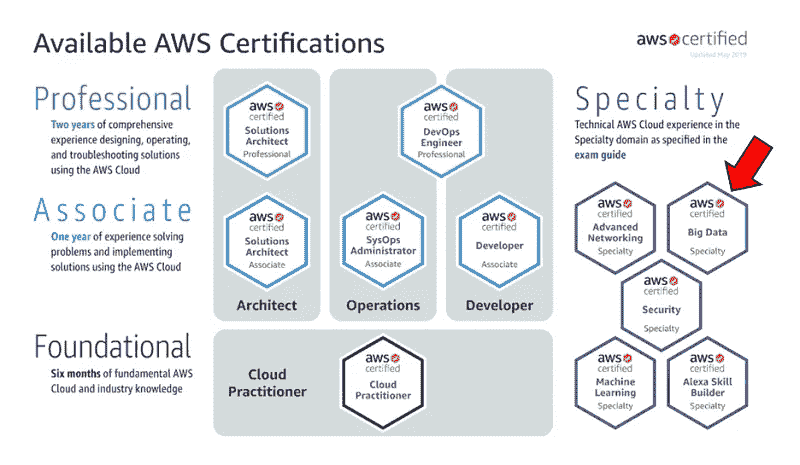
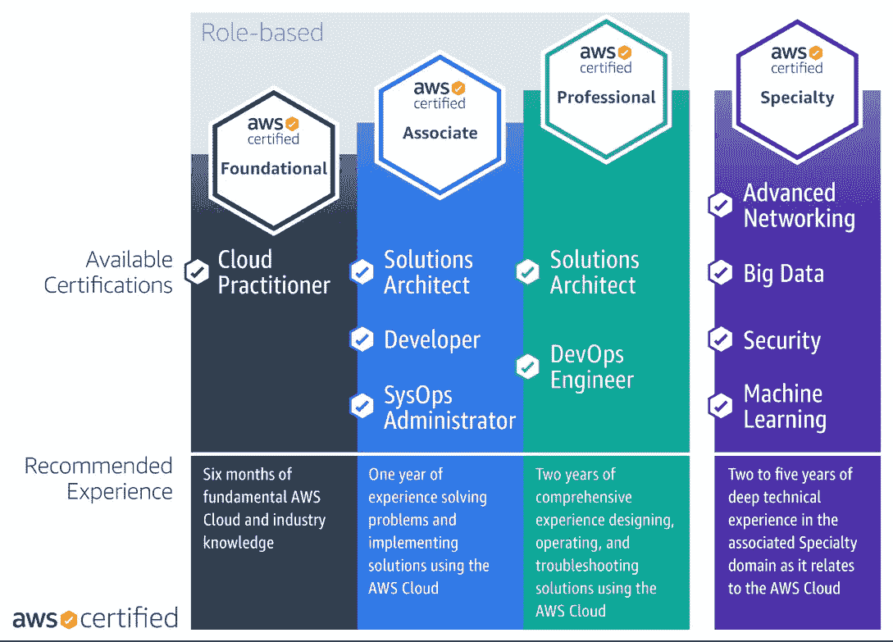
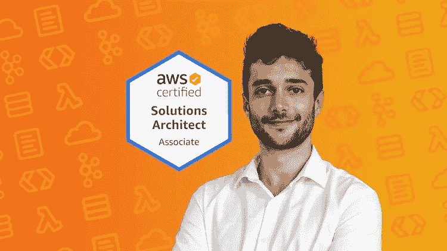
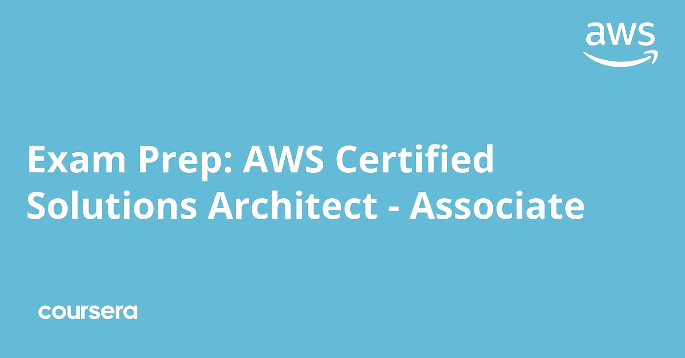
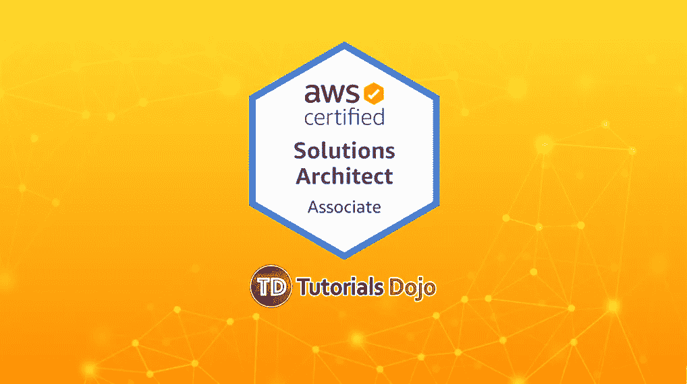
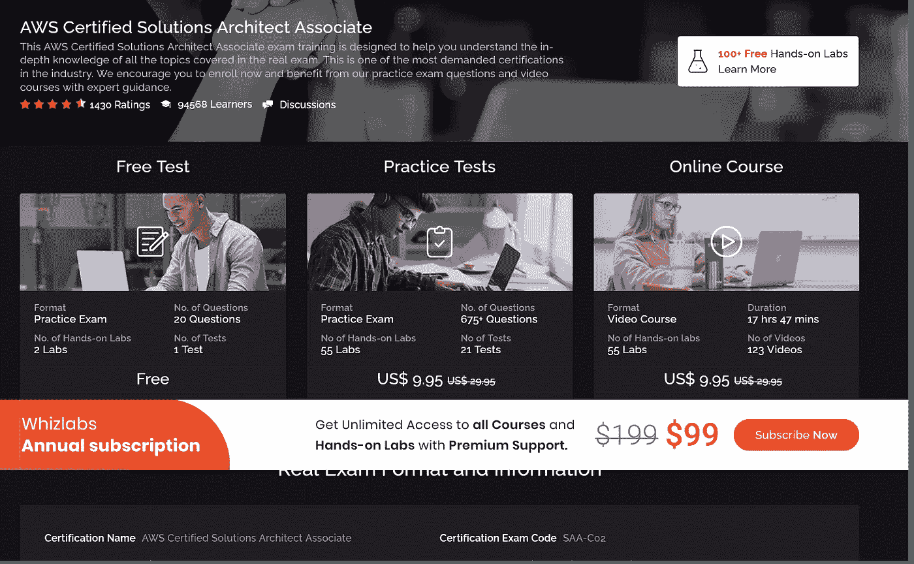

# 我最喜欢的 2023 年 AWS 解决方案架构师助理认证课程

> 原文：<https://medium.com/javarevisited/top-5-aws-training-courses-to-crack-amazon-web-service-solutions-architect-associate-certification-3f4affa8f660?source=collection_archive---------0----------------------->

大家好，你们在准备 **AWS 认证解决方案架构师助理考试吗？**或者你想成为亚马逊网络服务(AWS)认证的开发者来推动你的云计算事业？并且寻找一些有用的资源来为你的考试做好准备，那么你来对地方了。

过去，我曾分享过一些学习 AWS 的 [**免费课程，在这篇文章中，我将分享一些通过 AWS 解决方案架构师助理考试并成为亚马逊网络服务认证助理的*最佳在线课程，这一认证不仅会给你的简历增加价值，还会帮助你获得你一直想要的高薪工作。***](http://www.java67.com/2018/05/top-5-amazon-web-services-or-aws-courses-to-learn-online.html)

下一代 IT 将完全围绕云和[云计算](https://javarevisited.blogspot.com/2019/07/top-5-online-courses-to-learn-cloud-computing-aws.html)展开，随着越来越多的公司(无论大小)转向云，对云专家的需求也在不断增长。

虽然有许多受欢迎的云提供商，如谷歌云平台( [GCP](https://javarevisited.blogspot.com/2019/07/top-5-google-cloud-platform-gcp-courses-certifications-online.html) )和[微软 Azure](https://javarevisited.blogspot.com/2019/07/top-5-courses-to-crack-azure-architecture-technologies-certification-az-300-exam.html) ， [Amazone Web 服务](https://hackernoon.com/top-5-amazon-web-services-or-aws-courses-to-learn-online-free-and-best-of-lot-d94e192054b7)或 AWS 是领先的云平台提供商，获得 AWS 技能认证很有意义。

对 *AWS 认证解决方案架构师*助理和专业人员的需求也很大，因为亚马逊本身通过要求其合作伙伴雇用一定数量的认证 AWS 专业人员来推动这方面的价值。

谈到考试，它就像任何其他 It 认证一样，如 [Java](https://javarevisited.blogspot.com/2018/01/top-5-java-8-certifications-courses-training-online-OCAJP.html#axzz5gYSQ4RjO) 、[甲骨文](https://dev.to/javinpaul/how-to-become-an-oracle-certified-java-professional-169d)或 [Spring](http://www.java67.com/2017/08/3-free-spring-certification-mock-exams-practice-questions.html) 认证，但是时间管理是通过考试的关键。

你会得到 60+道需要在 130 分钟内解决的选择题，也就是说你大概有 2+分钟的时间来解决一道题。即使问题是多项选择，它们也不容易解决，因为它们是基于场景的问题，不像简单的问题，例如什么是 **S3** (简单存储服务)和 **IAM** (身份和访问管理)的完整形式。

> *你还需要取得几乎 72%的分数才能通过考试，我的意思是 1000 分中的 720 分，这是相当高的分数，如果你没有进行足够的练习，即使你对 AWS 了如指掌，也可能会通不过考试。*

这就是为什么选择一门好的课程、几道练习题和考试模拟器是非常重要的。我喜欢获得认证，我热衷于收集[有用的资源](https://javarevisited.blogspot.com/2019/08/how-to-crack-aws-certified-solution-architect-exam.html)，这就是你将在本文中找到的。

顺便说一句，如果你使用我在这篇文章上的链接购买任何课程，我会向你支付额外费用，但你应该只在观看预览后购买课程，无论你是否能连接到讲师。购买一门与教师没有联系的课程既浪费时间又浪费金钱。谢谢你的支持。

# AWS 认证的简要列表

如果你是 AWS 认证的新手，让我告诉你有很多认证，侧重于不同的技能。亚马逊还不断推出新的认证，以迎合不断增长和发展的市场需求。

以下是各种 AWS 认证考试的列表，按照难度从易到难的顺序排列:

1) [AWS 认证解决方案架构师助理](/javarevisited/how-to-prepare-for-aws-solution-architect-associate-certification-saa-c01-saa-c02-exam-in-2021-a6e7e7e771fc) (SAA-C03)
2) [AWS 认证云从业者](/javarevisited/10-best-aws-certified-cloud-practitioner-clf-c01-online-courses-and-practice-test-to-crack-ecc0f913091e) (CLF-C01)
3) [AWS 认证开发者助理](/javarevisited/6-best-aws-developer-associate-dva-c001-certification-practice-test-mock-exams-and-dumps-9e24573f509a) (DVA-C00，DVA-C01)
4) AWS 认证大数据专业(BDS-C00)
5) [AWS 认证解决方案架构师专业](/javarevisited/6-best-courses-for-aws-certified-solution-architect-professional-exam-in-2020-df5850a9279a) (SAP-C01)
6) AWS 认证 DevOps 工程师

# AWS 认证路线图

以下是 *AWS 认证路线图*，它也提供了获得所有这些认证并成为真正的 AWS 权威的认证途径:

# AWS 认证解决方案架构师前 5 名在线课程—助理考试

在本文中，我将分享一些最好的在线课程，供您学习并通过 AWS 认证解决方案架构师助理级考试，以及从头开始学习 AWS。

因为考试本身要花费 150 美元，所以你不能失败。您需要将时间和金钱投入到正确的资源中，以通过这次考试并获得您想要的 AWS 认证。

## 1.[2023 年终极 AWS 认证解决方案架构师助理](https://click.linksynergy.com/deeplink?id=CuIbQrBnhiw&mid=39197&murl=https%3A%2F%2Fwww.udemy.com%2Fcourse%2Faws-certified-solutions-architect-associate-saa-c02%2F)

这是为 Amazon-AWS 认证解决方案架构师助理考试准备的另一门 AWS 认证课程。这是为 AWS 认证解决方案架构师考试做准备的最新课程之一。

像以前的课程一样，它也涵盖了这次考试你需要知道的大多数考试主题，但这次考试最棒的一点是，讲师夏羽·马瑞克对如何在这次考试中取得好成绩有丰富的经验。

他自己以 984 分(满分 1000 分)的成绩通过了考试，这是非常了不起的，他肯定能帮助你在考试中取得好成绩。

这门课程相对较新，所以没有堆积的评级和学生，但内容真的很好。平均来说，这门课程有来自近 16500 名学生的 4.6 分的评分，这太棒了。

**以下是参加本课程的链接—**[2023 年 AWS 认证解决方案架构师终极助理](https://click.linksynergy.com/deeplink?id=CuIbQrBnhiw&mid=39197&murl=https%3A%2F%2Fwww.udemy.com%2Fcourse%2Faws-certified-solutions-architect-associate-saa-c02%2F)

## 2.[考试准备:AWS 认证解决方案架构师助理](https://coursera.pxf.io/c/3294490/1164545/14726?u=https%3A%2F%2Fwww.coursera.org%2Flearn%2Faws-certified-solutions-architect-associate)【Coursera】

这可能是为 2023 年 AWS 解决方案架构师助理级考试准备的最好的 Coursera 课程。它包含近 11 个小时的内容，涵盖了通过考试所需的一切知识。

关于[这门课程](https://coursera.pxf.io/c/3294490/1164545/14726?u=https%3A%2F%2Fwww.coursera.org%2Flearn%2Faws-certified-solutions-architect-associate)最好的一点是，它直接来自 AWS，并且与考试主题和目标紧密相关。这是一门中级课程，旨在帮助您评估自己对 AWS 认证解决方案架构师助理考试的准备情况。

在本课程中，您不仅将通过探索考试的主题领域以及它们如何映射到 AWS 架构来学习如何准备考试，还将复习每个领域的示例认证问题，通过动手练习练习技能，通过练习问题集测试您的知识，并学习通过解释基础概念来识别不正确答案的策略。

我真的很喜欢清晰简洁的信息流，以及你能出现参加考试之前急需的动手练习。

学完本课程 Coursera AWS 解决方案架构师课程后，您将拥有所有的知识和工具来帮助您确定在认证考试中测试的每个认证领域的优势和劣势。

**以下是参加本课程的链接** — [考试准备:AWS 认证解决方案架构师—助理](https://coursera.pxf.io/c/3294490/1164545/14726?u=https%3A%2F%2Fwww.coursera.org%2Flearn%2Faws-certified-solutions-architect-associate)

您还将了解关键的 AWS 服务，如 [EC2](/javarevisited/7-best-aws-ec2-amazon-elastic-compute-cloud-online-courses-for-beginners-in-2021-f7a1a55ea719) 、 [S3](/javarevisited/7-best-aws-s3-and-dynamodb-courses-for-beginners-in-2021-a8a44b6066da) 、Route53、Cloud Front、Autoscaling、负载平衡、RDS、RedShift、DynamoDB、EMR、VPC 等。他们还使课程保持最新，这是一件好事，因为 AWS 认证的有效期只有两年。

总的来说，如果你真的想通过 AWS 认证解决方案架构师(CSA)助理考试，就必须参加这门课程。

顺便说一句，你可以单独参加这个课程，也可以参加 [**Coursera Plus**](https://coursera.pxf.io/c/3294490/1164545/14726?u=https%3A%2F%2Fwww.coursera.org%2Fcourseraplus) ，这是一个订阅计划，允许无限制地访问来自 AWS 和谷歌等顶级大学和公司的 7000 多门课程，每月仅需 59 美元。Coursera 有许多 AWS 和云计算课程，所以加入 Coursera plus 可以更好地准备。

<https://coursera.pxf.io/c/3294490/1164545/14726?u=https%3A%2F%2Fwww.coursera.org%2Fcourseraplus>  

## 3. [AWS 认证解决方案架构师助理实践考试](https://click.linksynergy.com/deeplink?id=JVFxdTr9V80&mid=39197&murl=https%3A%2F%2Fwww.udemy.com%2Faws-certified-solutions-architect-associate-amazon-practice-exams%2F)

理想情况下，一旦您参加了之前的课程以准备 AWS 解决方案架构师助理考试，您就不需要任何其他课程，但本课程与之前的课程略有不同，它是关于练习问题和提高您在 130 分钟内解决 60 个问题的速度。

本课程有 390 个顶级问题，分为 6 组 AWS 练习测试，每组 65 个独特的问题，时间限制为 130 分钟。这将给你考试般的练习，并检查你的真实速度。

正如我之前告诉你的，如果你不及时集中注意力，即使你了解 AWS 的所有知识，你也可能通不过这次考试。

你大约有 2 分钟的时间来解决一个问题，这就是为什么在真正的考试前练习和进行时间管理可能是通过或失败考试的区别。

**以下是参加本课程的链接** — [AWS 认证解决方案架构师助理实践考试](https://click.linksynergy.com/deeplink?id=JVFxdTr9V80&mid=39197&murl=https%3A%2F%2Fwww.udemy.com%2Faws-certified-solutions-architect-associate-amazon-practice-exams%2F)

我喜欢这门课程的另一点是，它非常及时，他们有一个专门的团队，根据成千上万学生对实际考试内容的反馈，定期更新问题。

该课程还获得了近 1.2 万名学生的平均 4.5 分。非常感谢 Dojo 教程的讲师 [**Jon Bonso**](https://click.linksynergy.com/deeplink?id=CuIbQrBnhiw&mid=39197&murl=https%3A%2F%2Fwww.udemy.com%2Fuser%2Fjonjonbonso%2F) 你可以使用这个教程和云大师课程来更好地准备你的 AWS 考试。

## **4。** [**AWS 认证解决方案架构师—助理**](https://pluralsight.pxf.io/c/1193463/424552/7490?u=https%3A%2F%2Fwww.pluralsight.com%2Fcourses%2Faws-certified-solutions-architect-associate)**【plural sight】**

这是为 AWS 认证解决方案架构师助理级考试做准备的另一门精彩的在线课程。AWS 是世界上最受欢迎和使用最广泛的云平台，该认证非常受欢迎，尤其是对于希望成为云工程师和云架构师的人来说。

本课程将教授您设计原则，包括网络、存储、DNS、DBaaS、监控、负载平衡等方面的策略。

您将了解 VPC —虚拟私有云、弹性负载平衡器亚马逊存储服务、Route 53、直连等等。

作者 Elias Khnaser 是云和虚拟化领域的专家，专门研究微软、Citrix 和 VMware 虚拟化技术。总的来说，这是一门准备 AWS 认证解决方案架构师的好课程——将考试与代码 SAA-C03 相关联。

**这是参加本课程的链接** — [AWS 认证解决方案架构师—助理](https://pluralsight.pxf.io/c/1193463/424552/7490?u=https%3A%2F%2Fwww.pluralsight.com%2Fcourses%2Faws-certified-solutions-architect-associate)

顺便说一句，你需要一个 [**Pluralsight 会员**](https://pluralsight.pxf.io/c/1193463/424552/7490?u=https%3A%2F%2Fwww.pluralsight.com%2Flearn) 才能加入这个课程，费用大约是每月 29 美元或每年 299 美元(14%的折扣)。我向所有程序员强烈推荐这个订阅，因为它提供了超过 7000 个在线课程的即时访问，以学习任何技术技能。或者，你也可以使用他们的 [**10 天免费通行证**](https://pluralsight.pxf.io/c/1193463/424552/7490?u=https%3A%2F%2Fwww.pluralsight.com%2Flearn) 免费观看本课程。

<https://pluralsight.pxf.io/c/1193463/424552/7490?u=https%3A%2F%2Fwww.pluralsight.com%2Flearn>  

## **5。** [**Whizlab 的 AWS 解决方案架构师实践测试+课程**](http://shrsl.com/1l7zg)

Whizlab 是我最信任的认证练习题和培训材料的地方之一。过去，我曾使用 Whizlabs 的材料通过了几个 Java 认证，如 [OCAJP](http://www.java67.com/2017/03/top-10-ocajp-and-ocpjp-exam-simulators.html) 、 [OCPJP](http://www.java67.com/2017/10/difference-between-ocajp-and-ocpjp-certification-exam.html) 和 [OCEJP](https://javarevisited.blogspot.com/2017/01/5-free-ocejwcd-6-mock-exam-1z0-899.html#axzz5mwZJhPHT) ，并强烈推荐它的质量和合理的价格。

他们的 AWS 课程+练习捆绑包也具有相同的质量，并且是您获得高分的准备策略的重要补充。AWS 模拟模拟器包含 500 多个针对 AWS 解决方案架构师助理认证考试的独特练习问题，比任何其他 AWS 解决方案架构师练习考试都多。

他们目前还为其 AWS 解决方案架构师实践和培训课程材料提供 25%的折扣。只需使用 **AWSPACK** 优惠券代码即可享受 25%的折扣。

**以下是加入本课程的链接** — [Whizlab 的 AWS 解决方案架构师实践测试+课程](http://shrsl.com/1l7zg)

顺便说一句，如果你正在准备认证，可以考虑参加 [**Whizlabs 订阅**](https://shareasale.com/r.cfm?b=1551042&u=880419&m=43514&urllink=&afftrack=) ，它提供所有在线培训课程和不同认证的实践测试，如 AWS、Java、Cloud、Docker 和 Kubernetes，每年仅需<https://shareasale.com/r.cfm?b=1551042&u=880419&m=43514&urllink=&afftrack=>**99 美元(现在有 50%的折扣)。我强烈推荐这个订阅计划，因为 Whizlabs 有最好的材料来准备 IT 认证。**

## **6.[亚马逊 AWS-解决方案-架构师-助理:(SAA-C03)转储](https://www.certification-questions.com/buy-dumps-exams/aws-certified-solutions-architect-associate-dumps?affiliateCode=fcff36fd-557a-4713-abf6-973e9924770f&utm_source=Javin&utm_medium=affiliate&utm_campaign=affiliate)**

**这是准备亚马逊 AWS 解决方案架构师助理认证的另一个有用资源，代码为 SAA-C03。这个网站包含数百个 AWS 认证的考试转储。**

**考试转储是以前考试中的真题，由自学了 AWS 解决方案架构师考试的考生提供。它们只不过是考题的记忆库。**

**以下是您将在本课程中获得的内容:**

**-问题数量:407**

**-考试测试:9**

**-最后更新时间:2023 年 1 月 25 日**

**您可以使用考试转储来找出考试问题的格式和难度以及重要的主题。虽然我不建议完全依赖考试垃圾，因为许多人试图抢劫它们，但它们仍然是感受真正考试的一个很好的资源。**

**下面是加入这个测试的链接— [**亚马逊 AWS-Solutions-Architect-Associate:(SAA-C03)DUMPS**](https://www.certification-questions.com/practice-exam/amazon/aws-certified-solutions-architect-associate-saa-c03?affiliateCode=fcff36fd-557a-4713-abf6-973e9924770f&utm_source=Javin&utm_medium=affiliate&utm_campaign=affiliate)**

****

**他们还有一个 [**免费测试，有 10 个样题**](https://www.certification-questions.com/amazon-dumps/aws-solutions-architect-associate.html?affiliateCode=fcff36fd-557a-4713-abf6-973e9924770f&utm_source=Javin&utm_medium=affiliate&utm_campaign=affiliate) 为了在你购买之前检查一下测试的质量，我强烈建议你也检查一下那些问题。**

**以上是为亚马逊 AWS 解决方案架构师助理考试准备的一些**最佳课程。正如我所说，这是一个非常有用和有价值的考试，如果你是基础架构和云方面的，那么这个认证可以为你的职业生涯提供重要的推动。****

# **AWS 解决方案架构师认证适合您吗？**

**如果您想知道该认证是否适合您，那么有必要知道 AWS 认证解决方案架构师助理考试是针对解决方案架构师或软件架构师的。**

**该考试将验证您使用 AWS 技术设计安全可靠的解决方案的能力。该考试还将检查您是否能够通过使用适当的 AWS 服务并遵循基于需求的架构原则来设计解决方案。**

**它还检查您是否能够在整个工作负载生命周期中为组织提供基于最佳实践的实施指导。**

**如果您是一名解决方案架构师，或者希望成为一名解决方案架构师并设计基于 AWS 云的解决方案，那么这是适合您的认证。**

**我在云和系统管理员方面的许多朋友正在学习 AWS 并获得认证，特别是这个认证。这不仅提高了他们接到求职电话的数量，而且扩大了他们在当前组织中的作用，增加了晋升的机会。**

**针对 **IT 专业人员**和 Java 程序员的其他**认证资源****

*   **【Azure 基础认证的 5 门最佳课程**
*   **[如何破解甲骨文 2023 年 Java 认证](https://medium.freecodecamp.org/how-to-pass-oracles-java-certifications-a-practical-guide-for-developers-e9b607ba6173)**
*   **[Spring 认证对工作和事业有帮助吗？](https://javarevisited.blogspot.com/2017/07/does-spring-certification-help-in-job-and-career.html)**
*   **[如何通过 Spring Core Professional 5.0 认证](https://javarevisited.blogspot.com/2018/08/how-to-crack-spring-core-professional-certification-exam-java-latest.html)**
*   **[10 门免费学习数据结构和算法的课程](http://www.java67.com/2019/02/top-10-free-algorithms-and-data.html)**
*   **[2023 年网络开发者路线图](https://hackernoon.com/the-2019-web-developer-roadmap-ab89ac3c380e)**
*   **[如何在 2023 年成为 DevOps 工程师](https://javarevisited.blogspot.com/2018/09/the-2018-devops-roadmap-your-guide-to-become-DevOps-Engineer.html)**
*   **[每个软件开发人员都应该学习的 10 件事](https://dev.to/javinpaul/10-things-every-software-developer-should-know-39pe)**
*   **[学习 Linux 命令行的 5 门免费课程](https://hackernoon.com/top-5-free-linux-courses-for-programmers-4a433b4edade)**
*   **[程序员学习 Git 的五大免费课程](https://javarevisited.blogspot.com/2018/01/5-free-git-courses-for-programmers-to-learn-online.html)**
*   **[OCAJP 和 OCPJP 考试 10 道免费样题](http://www.java67.com/2017/05/10-free-java-8-certification-sample-questions-OCAJP8-OCPJP8-Mock-Exams.html)**

**感谢您阅读本文。如果您喜欢这篇文章以及这些准备 AWS 解决方案架构师助理考试的最佳在线课程和练习测试，请与您的朋友和同事分享。如果您有任何问题或反馈，请留言。**

****P. S.** —如果你是云计算和 AWS 领域的新手，正在寻找一些学习亚马逊 Web 服务的免费课程，那么你也可以在 Udemy 上查看这个 [**AWS 认证解决方案架构师助理介绍【免费】**](https://click.linksynergy.com/deeplink?id=CuIbQrBnhiw&mid=39197&murl=https%3A%2F%2Fwww.udemy.com%2Fcourse%2Faws-certified-solutions-architect-associate-in-30-days%2F) 课程。超过 100，000 名学生已经加入了这一免费课程。**

**<https://click.linksynergy.com/deeplink?id=CuIbQrBnhiw&mid=39197&murl=https%3A%2F%2Fwww.udemy.com%2Fcourse%2Faws-certified-solutions-architect-associate-in-30-days%2F> **