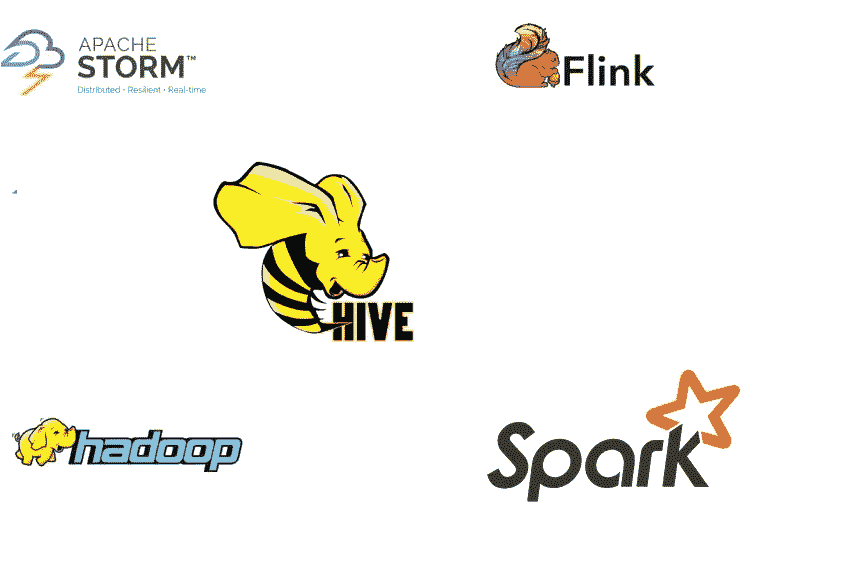
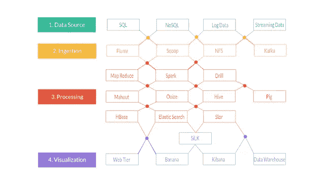
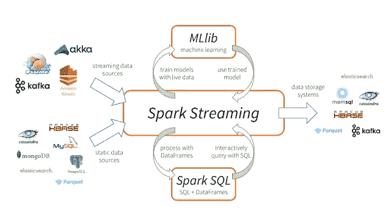
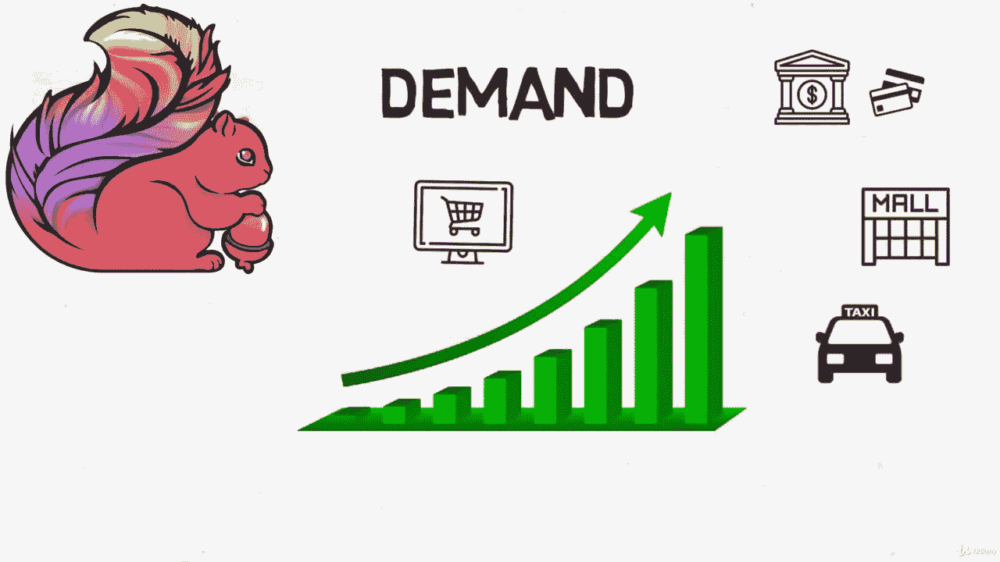

# 2023 年 Java 开发人员可以学习的 5 大数据框架

> 原文：<https://medium.com/javarevisited/top-5-big-data-frameworks-java-developers-can-learn-in-2021-9a3e20437c8c?source=collection_archive---------0----------------------->

## 2023 年值得学习的 5 大数据框架及相关资源链接。

大家好，如果你的目标之一是在 2023 年**学习大数据**，但你不确定从哪里开始以及学习哪个大数据框架，那么你来对地方了。之前我已经分享了[最佳大数据在线课程](/javarevisited/top-10-courses-to-learn-big-data-and-hadoop-best-of-lot-23ef8691633f)，今天我要分享的是*2023 年你可以学到的 5 个最佳大数据框架*。

鉴于数据日益丰富，大数据分析是当今非常热门和有价值的技能。

财富 500 强和小公司都在寻找有能力的人，他们可以从大量的数据中获得有用的见解，这就是像 [Apache Hadoop](https://hadoop.apache.org/) 、 [Apache Spark](https://spark.apache.org/) 、 [Flink](https://flink.apache.org/) 、 [Storm](https://storm.apache.org/) 和 [Hive](https://hive.apache.org/) 这样的大数据框架可以提供帮助的地方。

像亚马逊、易贝、网飞、美国宇航局 JPL 和雅虎这样的公司都使用 Spark 这样的大数据框架来快速从容错 Hadoop 集群的海量数据集中提取意义，学习这些框架和技术可以为您提供竞争优势。

# 2023 年 Java 开发人员的 5 个最佳大数据框架

这是 2023 年你可以学习的前 5 大数据框架列表。这些框架中的每一个都提供了不同的功能，了解它们的作用对于任何大数据程序员来说都是非常重要的。

## 1.Apache Hadoop

如果您听说过大数据，那么您可能也听说过 Hadoop 集群。对于许多人来说， [Apache Hadoop](/javarevisited/10-best-big-data-and-hadoop-tutorials-books-and-courses-to-learn-in-2020-aaca8cfccb80) 意味着大数据，为什么不呢，Apache Hadoop 可能是最受欢迎的大数据框架。

Apache Hadoop 是一个框架，它允许使用简单的编程模型跨计算机集群分布式处理大型数据集。

它旨在从单个服务器扩展到数千台机器，每台机器都提供本地计算和存储。它基于流行的 Map Reduce 模式，是开发可靠、可伸缩和分布式软件计算应用程序的关键。

如果你想在 2023 年开始学习大数据，我强烈建议你学习 Apache Hadoop，如果你需要资源，我建议你参加 Udemy 上 Frank Kane 开设的[**Hadoop 终极实践课程**](https://click.linksynergy.com/fs-bin/click?id=JVFxdTr9V80&subid=0&offerid=323058.1&type=10&tmpid=14538&RD_PARM1=https%3A%2F%2Fwww.udemy.com%2Fthe-ultimate-hands-on-hadoop-tame-your-big-data%2F) 。这是在线学习 Hadoop 的最全面、最新的课程之一。

## 2.阿帕奇火花

这是另一个相当流行且需求与日俱增的大数据框架。如果你想在大数据领域取得突破，在 2023 年学习 [Apache Spark](/javarevisited/5-free-courses-to-learn-apache-spark-in-2020-bdff2d60c800) 可以是一个很好的开始。

Apache Spark 是一个快速的内存数据处理引擎，具有优雅和丰富的开发 API，允许数据工作者高效地执行需要快速迭代访问数据集的流、机器学习或 SQL 工作负载。

您可以使用 Spark 进行内存计算，将 ETL、机器学习和数据科学工作负载转移到 Hadoop。如果你想在 2023 年学习 Apache Spark，并且需要一个资源，我强烈推荐你加入 Apache Spark 2.0 with Java——向 Udemy 上的一位大数据大师学习 Spark。

顺便说一句，如果你需要更多的选项来探索 Spark 与其他编程语言，如 Scala 和 Python，那么 [Frank Kane](https://medium.com/u/a34f6d8b7618?source=post_page-----9a3e20437c8c--------------------------------) 的 [**Apache Spark 与 Scala——动手处理大数据！**](https://click.linksynergy.com/deeplink?id=JVFxdTr9V80&mid=39197&murl=https%3A%2F%2Fwww.udemy.com%2Fcourse%2Fapache-spark-with-scala-hands-on-with-big-data%2F) 和 [**用 Apache Spark 和 Python 驯服大数据——动手！**](https://click.linksynergy.com/deeplink?id=JVFxdTr9V80&mid=39197&murl=https%3A%2F%2Fwww.udemy.com%2Fcourse%2Ftaming-big-data-with-apache-spark-hands-on%2F) 课程绝对值得一看。

<https://click.linksynergy.com/deeplink?id=JVFxdTr9V80&mid=39197&murl=https%3A%2F%2Fwww.udemy.com%2Fcourse%2Ftaming-big-data-with-apache-spark-hands-on%2F>  <https://click.linksynergy.com/deeplink?id=JVFxdTr9V80&mid=39197&murl=https%3A%2F%2Fwww.udemy.com%2Fcourse%2Fapache-spark-with-scala-hands-on-with-big-data%2F>  

## 3.[阿帕奇蜂巢](https://hive.apache.org/)

Apache Hive 是一个大数据分析框架，由脸书创建，结合了最流行的大数据框架之一的可扩展性。

你也可以把 Apache Hive 想象成 [Hadoop](/swlh/5-free-online-courses-to-learn-big-data-hadoop-and-spark-in-2019-a553e6ccfe30) 上的一个数据处理工具。它是 HDFS 的一个查询工具，它的查询语法几乎类似于我们旧的 [SQL](/hackernoon/top-5-sql-and-database-courses-to-learn-online-48424533ac61) 。

Hive 是一个开源软件，让程序员在 Hadoop 上分析大型数据集。它是一个将 SQL 请求转化为 MapReduce 任务链的引擎。

如果你正在学习 Hadoop，那么学习 Hive 也是有意义的，如果你需要资源，我强烈推荐 [**Hive 进阶 Hive(实时使用):J Garg 的 Hadoop 查询工具课程**](https://click.linksynergy.com/deeplink?id=JVFxdTr9V80&mid=39197&murl=https%3A%2F%2Fwww.udemy.com%2Fcourse%2Fhadoop-querying-tool-hive-to-advance-hivereal-time-usage%2F) 。学习蜂巢是一门高级课程，但对于一门非常好的课程来说。

## 4.[阿帕奇风暴](https://storm.apache.org/)

**Apache Storm** 是 2023 年另一个值得学习的大数据框架。该框架专注于处理大型实时数据流。Storm 的主要特点是可扩展性和停机后的快速恢复。

Apache Storm 对于**实时流处理**就像 Hadoop 对于**批处理**一样。

使用 Storm，您可以构建需要您高度响应最新数据并在几秒钟和几分钟内做出反应的应用程序，例如在 Twitter 上找到最新的趋势话题，或者监控支付网关故障的峰值。

从简单的数据转换到应用机器学习算法。您可以在 Java、Python、Ruby 和 Fancy 的帮助下使用这个解决方案。如果你想学习 Apache Storm，需要一个资源，我建议 [**举例学习:Udemy 上 Loony Corn 的 Apache Storm 课程**](https://click.linksynergy.com/deeplink?id=JVFxdTr9V80&mid=39197&murl=https%3A%2F%2Fwww.udemy.com%2Fcourse%2Flearn-by-example-apache-storm%2F) 。

## 5.阿帕奇·弗林克

**Apache Flink** 是 2023 年另一个值得学习的健壮的流和批处理大数据处理框架。它是 Hadoop 和 Spark 的继任者。它是用于流处理的下一代大数据引擎。

如果说 [Hadoop](https://dev.to/javinpaul/top-5-courses-to-learn-big-data-and-hadoop-for-beginners-6g8) 是 2G， [Spark](https://javarevisited.blogspot.com/2017/12/top-5-courses-to-learn-big-data-and.html#axzz6cRYpiwdu) 是 3G，那么 Apache Flink 就是大数据流处理框架中的 4G。

实际上，Spark 不是一个真正的流处理框架，它只是一个权宜之计，但 Apache Flink 是一个真正的流引擎，具有执行批处理、图形、表格处理以及运行机器学习算法的额外能力。

市场对 Flink 的需求已经在增加。许多知名公司，如 Capital One(银行)、阿里巴巴(电子商务)、优步(交通运输)已经开始使用 Apache Flink 来处理他们的实时大数据，成千上万的其他公司也在投入其中。

如果你想学习 Apache Flink，需要一个资源，我建议你从 Udemy 上 J Garg 的 [**Apache Flink |一个关于 Flink**](https://click.linksynergy.com/deeplink?id=JVFxdTr9V80&mid=39197&murl=https%3A%2F%2Fwww.udemy.com%2Fcourse%2Fapache-flink-a-real-time-hands-on-course-on-flink%2F) 的实时&动手课程开始。这是 2023 年学习 Apache Flink 的完整、深入的&动手实践课程。

以上就是 2023 年**你能学到的 5 个最好的大数据框架**。这些是非常强大和受欢迎的大数据框架，学习它们可以提高你的技能，促进你的简历和职业生涯。

如果您仍然渴望获得另一个值得关注的大数据框架，那么 Apache Heron 是另一个新的闪亮的大数据处理引擎。Twitter 将其开发为 Storm 的新一代替代品。

其他 **Java 和编程文章**你可能喜欢的
[Java 程序员可以学习的 10 个技能加速自己的职业生涯](https://dev.to/javinpaul/10-skills-java-programmer-can-learn-to-accelerate-their-career-3nlh?fbclid=IwAR19fdBhg3zriyqcZyo9CfvMSHW_xKmNggTndkN-fFFfMaWH6VHG5T_Z6Rc)
[Java 开发人员应该知道的 10 个测试工具和库](http://javarevisited.blogspot.sg/2018/01/10-unit-testing-and-integration-tools-for-java-programmers.html)
[5 本面向有经验开发人员的 Spring 框架书](http://javarevisited.blogspot.sg/2018/04/5-spring-framework-books-experienced-Java-developers-2018.html)
[成为软件架构师的 5 门课程](/javarevisited/top-5-courses-to-learn-software-architecture-in-2020-best-of-lot-5d34ebc52e9)
[20 个春季 MVC 面试问题及答案](/javarevisited/21-spring-mvc-rest-interview-questions-answers-for-beginners-and-experienced-developers-21ad3d4c9b82)
[2023 年 Java 开发人员应该阅读的 10 本书](http://www.java67.com/2018/02/10-books-java-developers-should-read-in.html)
开发者路线图
[2023 年你可以看的 21 本 Java 书](/javarevisited/10-books-java-developers-should-read-in-2020-e6222f25cc72)
[用 Spring Cloud](http://javarevisited.blogspot.sg/2018/02/top-5-spring-microservices-courses-with-spring-boot-and-spring-cloud.html)
[学习微服务的前 5 门课程 Java 开发者应该知道的前 20 个库](https://javarevisited.blogspot.com/2018/01/top-20-libraries-and-apis-for-java-programmers.html)
[用 Spring Boot](/javarevisited/10-best-java-microservices-courses-with-spring-boot-and-spring-cloud-6d04556bdfed)
[学习 Java 微服务的 10 门课程 2023 年 DevOps 路线图——如何更好地学习 devo PS](https://javarevisited.blogspot.com/2018/09/the-2018-devops-roadmap-your-guide-to-become-DevOps-Engineer.html)
[每个 Java 程序员必备的 5 个框架](/javarevisited/5-essential-frameworks-every-java-developer-should-learn-6ed83315f1fb?source=---------12----------------------------)

感谢您阅读本文。如果你喜欢这些大数据框架，那么请分享给你的朋友和同事。如果您有任何问题或反馈，请留言。

**P.S. —** 如果你想在 2023 年成为一名全栈开发人员，并且正在寻找全栈开发人员应该学习的最佳 Java 框架，那么我建议你参加 Udemy 网站上 Ranga Karnam 的 [**Go Java 全栈和 React**](https://click.linksynergy.com/deeplink?id=JVFxdTr9V80&mid=39197&murl=https%3A%2F%2Fwww.udemy.com%2Fcourse%2Ffull-stack-application-with-spring-boot-and-react%2F) 课程。2023 年成为全栈 Java 开发者是很棒的课程。

<https://click.linksynergy.com/deeplink?id=JVFxdTr9V80&mid=39197&murl=https%3A%2F%2Fwww.udemy.com%2Fcourse%2Ffull-stack-application-with-spring-boot-and-react%2F> 