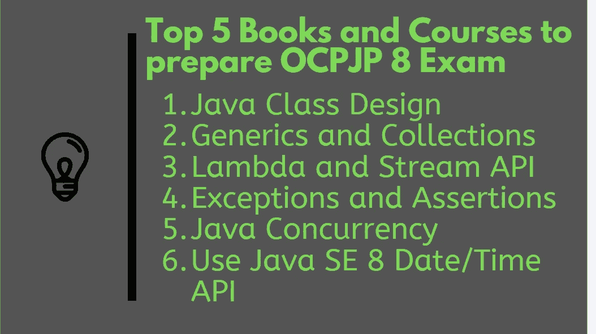
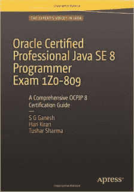
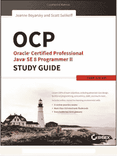
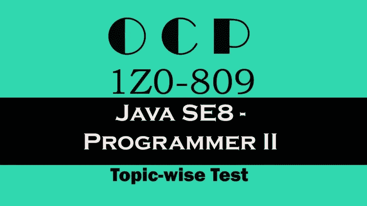

# 破解 OCPJP 8 认证的五大书籍和课程—Java 8 1z 0–809，810，813 考试

> 原文：<https://medium.com/javarevisited/top-5-books-and-courses-to-crack-ocpjp-8-certification-java-8-1z0-809-810-813-exam-c5236dde5f8a?source=collection_archive---------1----------------------->

这是 Java 8 认证最佳书籍的第二部分。由于你需要通过 OCAJP8 和 OCPJP8 两个考试才能成为 Java SE 8 认证开发者，所以我在上一篇文章中分享了一些[最好的 OCAJP8 书籍](http://javarevisited.blogspot.sg/2016/10/best-books-for-ocajp8-exam-1z0-808-java8.html)。在这篇文章中，我将告诉你更多关于第二次考试， **OCPJP8，**并建议最好的书籍和一些在线课程来准备 OCPJP8。

这种考试被称为专业水平考试，它比助理水平考试更严格*。OCPJP8 代表 Oracle 认证专业 Java 程序员。该认证的考试代码是 1z 0–809。

这是指如果你之前没有任何 Java 认证，但你仍然可以通过升级考试成为 [Java SE 8 认证开发人员](https://javarevisited.blogspot.com/2019/10/the-java-developer-roadmap.html)，比如 1z 0–810，如果你已经通过了 OCJPJP7 考试，1z 0–813，如果你已经通过了 OCPJP6 考试。

本文推荐的书籍主要针对 1z 0–809 考试，但也可用于**升级考试，**如 1z 0–810(从 Java SE 7 升级到 Java SE 8)和 1z 0–813(从 Java SE 6 升级到 Java SE 8)认证。
即使你有多年的 Java 工作经验，你也需要努力准备，因为考试真正关注的是微妙的细节，比如运算符优先级和一些你在日常编码中通常不会遇到的极端情况。

除了解决实践问题，我还建议你去参加一个像 [**完整的 Java 大师班**](https://click.linksynergy.com/fs-bin/click?id=JVFxdTr9V80&subid=0&offerid=323058.1&type=10&tmpid=14538&RD_PARM1=https%3A%2F%2Fwww.udemy.com%2Fjava-the-complete-java-developer-course%2F) 这样的综合性 Java 课程，深入学习 Java，填补你在理解上的任何空白。这帮助我的许多读者在第一次尝试中获得高分并通过考试，并为重考节省了 240 美元。*

 [## 完整的 Java 软件开发人员大师班(针对 Java 10)

### 你刚刚在网上偶然发现了最完整、最深入的 Java 编程课程。拥有超过 260，000 名学生…

udemy.com](https://click.linksynergy.com/fs-bin/click?id=JVFxdTr9V80&subid=0&offerid=323058.1&type=10&tmpid=14538&RD_PARM1=https%3A%2F%2Fwww.udemy.com%2Fjava-the-complete-java-developer-course%2F) 

# 通过 Java 程序员 OCPJP 8 认证(1Z0 -809)的 5 本最佳书籍、课程和实践测试

一旦你通过了 OCAJP8 考试，你就可以参加 OCPJP8。制备与 OCAJP8 非常相似；你需要的只是一本好书，一个练习用的 Java IDE，练习一些模拟考试，最后买 [Whizlabs](http://shrsl.com/?~abo5) 或者[大卫·梅尔的 Java 8 考试模拟器](https://www.certification-questions.com/practice-exam/java/1z0-808?affiliateCode=fcff36fd-557a-4713-abf6-973e9924770f&utm_source=Javin&utm_medium=affiliate&utm_campaign=affiliate)给你的准备画龙点睛。第一步是选择一本好书。

可惜你的选择不多，有好有坏。很好，因为你在市场上买到的关于 OCPJP8 的书是最好的，并且提供了 OCPJP8 考试目标的全面覆盖。错了，因为 OCAJP 和 OCPJP 8 还没有凯西·塞拉的书。

## 1.[甲骨文认证专业 Java SE 8 程序员考试 1z 0–809](https://www.amazon.com/Oracle-Certified-Professional-Programmer-1Z0-809/dp/1484218353/?tag=javamysqlanta-20)

这是准备 OCPJP8 认证的最新最潮的一本书。这是一个学习指南，旨在成为准备 OCPJP8 的一站式指南。作者是 S.G. Ganesh，Hari Kiran Kumar 和 Tushar Sharma。如果你还记得的话，Ganesh 和 Tushar 也有一本非常成功的 Java 7 认证书。

本书对 OCJP8 考试目标进行了深入和 100%的覆盖，并包含数百道练习题和全长模拟考试。这本书还包括一个有用的 Java 8 认证常见问题，为您提供关于 Java SE 8 认证的基本信息，如 [OCAJP 8](https://www.freecodecamp.org/news/how-to-pass-oracles-java-certifications-a-practical-guide-for-developers-e9b607ba6173/?source=extreme_sidebar---------2-16--------------------&gi=c23b65f0ed37) 和 [OCPJP 8](https://javarevisited.blogspot.com/2018/08/latest-OCPJP-exam-java-8-certification-oracle-java-se-8.html) 。

为了更好地准备，我还建议你将这本书与 Whizlab 的[在线课程](https://click.linksynergy.com/deeplink?id=JVFxdTr9V80&mid=39197&murl=https%3A%2F%2Fwww.udemy.com%2Fcourse%2Focpjp-8-1z0-809%2F)和[实践测试](http://OCPJP 8 full test)结合起来，如果你想在第一次尝试中通过这个困难的考试，那两个是非常重要的资源。它们不贵，你可以买 50 美元以下的任何东西，包括这本书。

## 2.[OCPJP 8[1z 0–809]预科](https://click.linksynergy.com/deeplink?id=JVFxdTr9V80&mid=39197&murl=https%3A%2F%2Fwww.udemy.com%2Fcourse%2Focpjp-8-1z0-809%2F)

这是准备 OCPJP 8 认证考试的最佳在线课程之一。在本课程中，您将学习 OCPJP 8 所需的高级 Java 主题。这个课程是由 Whizlabs 创建的，它以创建最好的 Java 认证材料而闻名。

本课程涵盖 Java SE 8 程序员 II 认证(也称为 OCPJP 8)的以下主题

1.  Java 类设计和高级 Java 类设计
2.  [仿制药和集合](https://javarevisited.blogspot.com/2011/09/generics-java-example-tutorial.html)
3.  [Lambda 内置函数接口和 Java Stream API](/javarevisited/7-best-java-tutorials-and-books-to-learn-lambda-expression-and-stream-api-and-other-features-3083e6038e14)
4.  例外和断言
5.  使用 Java SE 8 日期/时间 API
6.  Java I/O 基础和 Java 文件 I/O (NIO.2)
7.  [Java 并发](/javarevisited/8-best-multithreading-and-concurrency-courses-for-experienced-java-developers-8acfd3b25094)
8.  用 JDBC 构建数据库应用程序
9.  本地化

总的来说，如果你想第一次通过 OCPJP 八级考试，这是一门必修课。我向所有准备参加 OCPJP 八级考试的人强烈推荐这门课程，以便进行结构化和深入的学习。

**以下是加入本课程**的链接:[OCPJP 8[1z 0–809]预备课程](https://click.linksynergy.com/deeplink?id=JVFxdTr9V80&mid=39197&murl=https%3A%2F%2Fwww.udemy.com%2Fcourse%2Focpjp-8-1z0-809%2F)

## 2. [OCP:甲骨文认证专业 Java SE 8 程序员 II 学习指南](https://www.amazon.com/OCP-Certified-Professional-Programmer-1Z0-809/dp/1119067901?tag=javamysqlanta-20)

这是另一本准备 OCPJP8 考试 1z 0–809 的优秀书籍。这本书是由 Jeanne Boyarsky 和 Scott Selikoff 编写的，这是他们关于 Java 8 认证的第二本书。第一本书是关于 OCAJP8 的，也是一本很棒的书。如果你把这本书从头到尾读完，你就能很好地通过 OCPJP8 考试，这比 OCAJP8 难多了。这本书还包括 100%的考试目标，并包含相同难度的有用的练习题。

作者们在 Javaranch 论坛上也非常活跃，这是一个获得任何帮助的一站式平台。您不仅可以使用这本书准备 1z 0–809 考试，还可以升级考试 1z 0–810(Java 7 到 Java 8)和 1z 0–813(Java 6 到 Java 8)。

如果你愿意，还可以把这本书和乌德扬·卡特里的[**【OCP 8 道练习题】**](https://click.linksynergy.com/deeplink?id=JVFxdTr9V80&mid=39197&murl=https%3A%2F%2Fwww.udemy.com%2Fcourse%2Fjava-ocp%2F) 合起来，里面包含 540 道优质题。它也很实惠，你只需花 10 美元就可以在不时发生的各种 Udemy flash 销售上买到。

## 4. [Java 认证—OCP(1z 0–809)主题式考试【2021】](https://click.linksynergy.com/deeplink?id=JVFxdTr9V80&mid=39197&murl=https%3A%2F%2Fwww.udemy.com%2Fcourse%2Fjava-ocpjp%2F)

这不是一个在线课程或书籍，而是一个主题的实践测试，以检查你在主题层面的准备情况。你可以用这个测试来评估你对不同考试题目的理解程度，并探索更多。

以下是本次模拟考试的主要内容:

1.  课堂设计— 86 个问题
2.  仿制药和集合- 81 个问题
3.  内置功能接口和流 API — 109 个问题
4.  异常、断言和日期/时间 API — 90 个问题
5.  IO、NIO.2 和本地化- 93 个问题
6.  Java 并发性& JDBC 81 题

这门课程的好处在于它解释了每一个问题和答案，这样你就知道为什么某个特定的答案是正确的，为什么其他的答案是不正确的。非常有助于建立你的基础。

**以下是获取本模拟测试** — [Java 认证—OCP(1z 0–809)主题式测试【2021】](https://click.linksynergy.com/deeplink?id=JVFxdTr9V80&mid=39197&murl=https%3A%2F%2Fwww.udemy.com%2Fcourse%2Fjava-ocpjp%2F)的链接

## OCPJP8 考试的其他有用资源

除了这两本书，你还可以从以下有用的资源中获得帮助。记住，模拟考试对取得更好的成绩至关重要。你应该尽可能多地练习模拟考试。我在列表中包含了两个最好的 Java 8 考试模拟器，但是如果你愿意，你也可以试试其他的。

1.  [甲骨文 Java 认证课程](https://click.linksynergy.com/fs-bin/click?id=JVFxdTr9V80&subid=0&offerid=323058.1&type=10&tmpid=14538&RD_PARM1=https%3A%2F%2Fwww.udemy.com%2Foracle-java-associate-certification-exam-course-1z0-808%2F)
2.  由 Udyan Khatri 进行的 OCP 8 号模拟测试
3.  [7 免费 OCPJP 8 模拟考试](http://javarevisited.blogspot.com/2015/11/5-free-ocajp8-ocpjp8-mock-exams-and-practice-questions.html)
4.  [Whizlabs OCPJP8 考试模拟器](http://shrsl.com/?~abo5)
5.  [David Mayer 的 Java8 认证问题](https://www.certification-questions.com/practice-exam/java/1z0-808?affiliateCode=fcff36fd-557a-4713-abf6-973e9924770f&utm_source=Javin&utm_medium=affiliate&utm_campaign=affiliate)
6.  [OCPJP8 考试目标](https://education.oracle.com/pls/web_prod-plq-dad/db_pages.getpage?page_id=5001&get_params=p_exam_id:1Z0-809)
7.  [进一步阅读的最佳 Java 8 书籍](http://javarevisited.blogspot.sg/2016/10/best-books-to-learn-java-8.html)

以上就是为 OCPJP8 考试准备的一些**最好的书籍。你可以购买 Ganesh 和 Tushar 或 Jeanne 和 Scott 的 OCPJP 8 学习指南；两个都很棒。图沙尔的书是最新的，也是市场上最新的。更重要的是阅读整本书，如果可能的话，多读几遍，以获得充分的益处。

OCPJP 八中成功的口头禅绝对是读一本好书，写程序，然后解决模拟考试。请记住， **OCPJP 8 比 OCAJP 8 要难很多，**如果你想达到 100%的目标，最好多读几本书，包括一些核心的 Java 8 书籍，以便更好地理解 Java 8 中引入的新概念。

其他 **Java 认证文章**你可能喜欢**

*   准备 Java SE 8 考试的前 5 门课程([课程](https://javarevisited.blogspot.com/2018/01/top-5-java-8-certifications-courses-training-online-OCAJP.html))
*   准备 OCAJP 11 认证考试的 5 本书([本书](https://javarevisited.blogspot.com/2019/10/top-5-books-courses-to-crack-oracles-java-se-11-certification-OCAJP11.html))
*   Java 11 认证(1z 0–815)考试的 10 次模拟测试([模拟测试](https://javarevisited.blogspot.com/2019/07/top-4-java-11-certification-free-mock-exams-practice-tests-ocajp11-ocpjp11-1z0-815-16-questions.html))
*   像 OCAJP 这样的 Java 认证对工作和事业有帮助吗？([阅读更多](http://javarevisited.blogspot.sg/2014/01/does-java-certifications-like-scjp-ocjp-ocpjp-helps-carrer-job-interviews.html))
*   OCAJP7 和 OCAJP8，应该考哪个认证？([看这里](http://www.java67.com/2015/07/ocajp-7-or-ocajp-8-which-java-certification-should-I-take.html))
*   3 本 OCAJP7 认证最佳书籍([列表](http://www.java67.com/2016/07/3-best-books-to-prepare-ocajp-7-1z0-803.html))
*   Java 8 资源和教程[(见此处](http://javarevisited.blogspot.com/2013/11/java-8-tutorials-resources-and-examples-lambda-expression-stream-api-functional-interfaces.html))
*   如何通过 Spring v5 认证？([导轨](https://javarevisited.blogspot.com/2018/08/how-to-crack-spring-core-professional-certification-exam-java-latest.html#axzz5j90KOik7))
*   Java SE 8 程序员 II 官方指南([看这里](https://education.oracle.com/pls/web_prod-plq-dad/db_pages.getpage?page_id=5001&get_params=p_exam_id:1Z0-809))
*   参加 OCPJP 考试前需要通过 OCAJP 考试吗？([条](http://javarevisited.blogspot.com/2013/11/do-you-need-to-pass-ocajp-before-taking-OCPJP-Java-SE-7.html))
*   如何准备 Java 8 认证？([改为](http://javarevisited.blogspot.com/2014/09/latest-OCPJP-exam-java-8-certification-oracle-java-se-8.html))
*   2 准备 OCEJWCD (Java EE 6 Web 组件开发人员)考试的书籍？([见此处](http://javarevisited.blogspot.com/2016/06/2-books-to-prepare-java-ee-6-web-component-exam-1z0-899-OCEJWCD.html))
*   1z 0–805 考试前五 OCPJP7 书籍([列表](http://www.java67.com/2016/07/top-5-ocpjp7-books-for-1z0-804-and-1z0-certification.html))
*   为什么成为 Java 认证？认证的专业人士收入更高吗？([阅读更多](http://javarevisited.blogspot.com/2014/01/why-java-certifications-are-good-for.html))

感谢您阅读本文。如果你喜欢这些最好的 OCPJP 8 书，那么请与你的朋友和同事分享。如果您有任何问题或反馈，请留言。如果你准备的时候用了其他的书，也可以和我们分享。

**附:**如果你只是想现在开始，我建议你从[**OCPJP 8【1z 0–809】Udemy 上的 Whizlabs 提供的备考课程**](https://click.linksynergy.com/deeplink?id=JVFxdTr9V80&mid=39197&murl=https%3A%2F%2Fwww.udemy.com%2Fcourse%2Focpjp-8-1z0-809%2F) 开始准备是合适的地方。它解释了 OCAJP 8 考试所需的 Java 8 的新特性

 [## OCPJP 8 [1Z0-809]预科

### 课程评级是根据单个学生的评级和各种其他信号计算的，如评级年龄和…

udemy.com](https://click.linksynergy.com/deeplink?id=JVFxdTr9V80&mid=39197&murl=https%3A%2F%2Fwww.udemy.com%2Fcourse%2Focpjp-8-1z0-809%2F) 

**P. S. S. —** 如果你想获得最新的 Java 认证，即 Java SE 17 认证，那么你也可以查看 [**我的 Udemy 课程**](https://www.udemy.com/course/1z0-819-certification-oracle-java-17-exam-practice-test/?couponCode=LAUNCH5DAYS) 我在那里分享了 250 多个 5 倍长度测试中的问题，你可以使用它们来增加你在第一次尝试中通过这个预先设定的 Java 认证的机会。

 [## 1Z0-829 的 10 大 Java SE 17 认证练习题和模拟测试-免考试

### 大家好，如果你正在准备 1Z0-829 认证考试，以成为 Oracle 认证的 Java SE 17 开发人员…

javarevisited.blogspot.com](https://javarevisited.blogspot.com/2023/02/250-java-se-17-certification-practice.html)