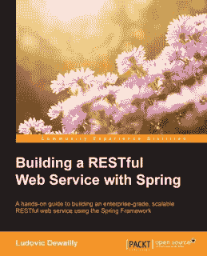
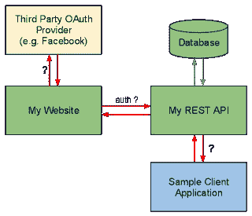
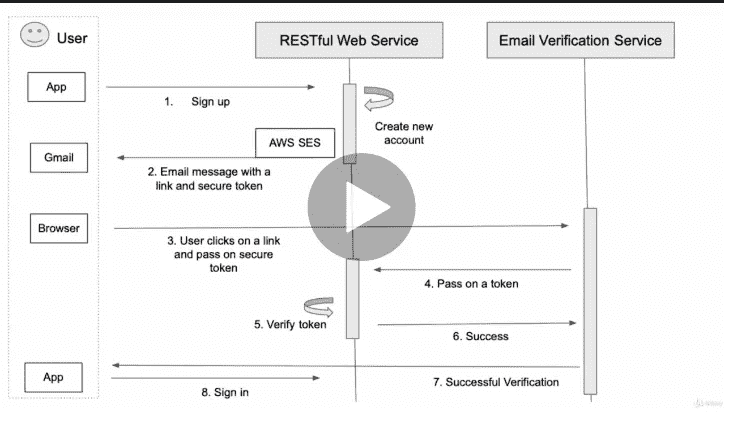

# 2023 年学习使用 Spring MVC 和 Spring Boot 的 Learn RESTful Web 服务的前 5 本书和课程

> 原文：<https://medium.com/javarevisited/top-5-books-and-courses-to-learn-restful-web-services-in-java-using-spring-mvc-and-spring-boot-79ec4b351d12?source=collection_archive---------0----------------------->

大家好，如果你对 web 开发感兴趣，那么你应该知道架构正在向微服务发展，RESTful web 服务是开发能够经受时间考验的微服务的第一步。Spring Boot 与 Spring Web MVC(也称为 Spring REST)相结合，使得开发 RESTful web 服务变得更加容易。

我曾经说过 [Spring MVC 是用 Java 开发 RESTful web 服务的最佳工具](/javarevisited/why-spring-is-the-best-framework-for-developing-rest-apis-in-java-784590e484a4)，但是从哪里开始呢？不要担心，如果你想学习 Spring 框架和 REST 完整的 web 服务并寻找资源，那么你来对地方了。

在这篇文章中，我将分享最好的[书籍](/hackernoon/top-5-spring-boot-and-spring-cloud-books-for-java-developers-75df155dcedc)和[课程](/javarevisited/top-10-courses-to-learn-spring-boot-in-2020-best-of-lot-6ffce88a1b6e)，你可以阅读并加入，学习如何使用 Spring MVC 和 Spring Boot 构建一个生产质量的 RESTFul web 服务。

如果你了解 Spring 框架，那么你很有可能听说过 Craig Walls 的经典 [**Spring in Action**](https://www.amazon.com/Spring-Action-Craig-Walls/dp/1617294942?tag=javamysqlanta-20) 一书。这是学习 Spring 的最佳书籍之一，包括我在内的许多 Java 开发人员都是从这本书中学习 Spring 的。

但是，即使 [Spring in Action 第五版](https://www.amazon.com/Spring-Action-Craig-Walls/dp/1617294942?tag=javamysqlanta-20)是学习 Spring 框架的最佳书籍之一，它也不足以学习使用 [Spring 框架](http://www.java67.com/2018/11/top-10-spring-framework-annotations-for-java-developers.html)开发一个现代的、全功能 RESTful Web 服务的复杂性。

它有一章是关于开发 RESTful Web 服务的。它很好地解释了诸如 [@RestController](http://javarevisited.blogspot.sg/2017/08/difference-between-restcontroller-and-controller-annotations-spring-mvc-rest.html) 、 [@ResponseBody](https://javarevisited.blogspot.com/2018/02/top-20-spring-rest-interview-questions-answers-java.html#axzz5fewgN3Md) 、 [@ResponseStatus](https://www.java67.com/2019/04/top-10-spring-mvc-and-rest-annotations-examples-java.html) 、HTTP 消息转换器、内容协商等概念，但这几乎没有触及开发产品级 RESTFul Web 服务的表面。

我不是说它不好；事实上，它是 REST with Spring framework 的最佳入门材料，但是要使用 Spring framework 开发一个真实的 REST API 或 RESTful 客户端，您需要学习的不仅仅是基础知识。

还有很多其他的东西，比如**过滤**、**分页**、**错误处理**、**版本控制**，以及使用 Spring 的 RESTful Web 服务的安全性和 Spring 安全性，这些都没有涉及到。这就是这些书籍和课程出现的原因。他们已经关注了使用 Spring 开发 RESTful Web 服务的并且相当详细地讨论了这个主题，这是使用 Spring 创建 RESTful Web 服务所必需的。

# 2023 年在 Java 中使用 Spring 学习 RESTFul Web 服务的 5 本最佳书籍和课程

你也可以把这些书和一些在线课程结合起来，比如尤金·帕拉斯基夫和让·饶·卡南在 Udemy 上的 REST with Spring 。Eugen 在真实世界中构建和保护基于 REST 的 web 服务方面有着丰富的经验，他在自己的热门课程中慷慨地分享了这些经验。事实上，在你从他的网站上购买课程之前，你可以在这里看到一些免费的章节。不管怎样，我们先来看看书:

## 1.使用 Spring 构建 RESTful Web 服务

这是 Ludovic Dewailly 关于这个主题的最新最好的书之一，它涵盖了使用 Spring 在 Java 中开发 RESTful Web 服务所需要学习的大部分内容。

正如我之前说过的，尽管[Spring in Action 5 第五版](https://www.amazon.com/Spring-Action-Craig-Walls/dp/1617294942?tag=javamysqlanta-20)是学习 Spring 的最佳书籍，但对于学习 RESTful Web 服务来说，它根本不够好。

它确实涵盖了像@RestController、@ResponseBody、@ResponseStatus 这样的基础知识，但是没有提供在现实世界中运行 RESTful web 服务所需的所有信息。许多高级概念，如过滤、分页和安全性，都没有在那本书里涉及到；这就是 Ludovic Dewailly 的书的帮助所在。它深入探讨了 REST 背后的原理，并教你如何使用 Spring 框架通过 RESTful 端点公开 CRUD 操作。它还向您展示了保护您的 web 服务、版本控制、维护向后兼容性等的技术。

你也可以将本书与 Udemy 上 Ranga Karnam 的[**Master Java Web Services and RESTful API 与 Spring Boot**](https://click.linksynergy.com/deeplink?id=JVFxdTr9V80&mid=39197&murl=https%3A%2F%2Fwww.udemy.com%2Fcourse%2Fspring-web-services-tutorial%2F) 课程结合起来，获得一些实践经验。这本书和课程的结合将帮助你更好地学习 Spring Boot 的 REST API。

您还将学习测试 RESTful web 服务的最佳方法，包括负载测试的技巧。最后，它很好地概述了一些高级概念，如使用缓存和集群等技术优化和扩展 web 服务。

简而言之，使用 Spring 开发 RESTful Web 服务的最完整的[书籍](/javarevisited/my-favorite-books-to-learn-java-in-depth-must-read-9c4468aeec99)和[课程](/javarevisited/top-5-courses-to-learn-software-architecture-in-2020-best-of-lot-5d34ebc52e9)之一。这本书是为那些想学习用 Spring 框架构建 RESTful web 服务的人准备的。

为了充分利用书中包含的代码示例，你应该具备 Java 语言的基础知识。以前使用 Spring 框架的经验也可以帮助您快速启动并运行。

## 2.欧根·帕拉斯基夫的《安息吧，春天》

这是目前最好的在线培训之一，教你使用 Java 和 Spring 开发 RESTful web 服务。作者尤金·帕拉斯基夫在现实世界中拥有丰富的 RESTful web 服务开发经验，他在本课程中慷慨地分享了他的经验。

你不仅会学到 REST 和 Spring 对 RESTful web 服务支持的基础知识，还会学到一些高级概念，比如过滤、分页、错误处理和使用 Spring 的 RESTful Web 服务的安全性。

**这里是加入本课程的链接——尤金·帕拉斯基夫的** [与春天共眠](http://courses.baeldung.com/p/rest-with-spring-the-certification-class?affcode=22136_bkwjs9xa)

强烈推荐休息加春训的[大师班](http://courses.baeldung.com/p/rest-with-spring-the-master-class?affcode=22136_bkwjs9xa)，获取生产工作所需的完整知识。他的课程中也有一些免费的课程，你可以在购买课程之前获取。那会让你对加入他的大师班能得到什么有一个很好的想法。

<http://courses.baeldung.com/p/rest-with-spring-the-master-class?affcode=22136_bkwjs9xa>  

## 3.[弹簧微服务在行动](https://www.amazon.com/Spring-Microservices-Action-John-Carnell/dp/1617293989?tag=javamysqlanta-20)

Spring 微服务实践教你如何使用 Java 和 Spring 平台构建基于微服务的应用。微服务将你的代码分解成小的、分布式的、独立的服务，这些服务需要仔细的考虑和设计。

幸运的是， [Spring Boot](http://www.java67.com/2018/06/5-best-courses-to-learn-spring-boot-in.html) 和 [Spring Cloud](https://javarevisited.blogspot.com/2018/04/top-5-spring-cloud-courses-for-java.html) 简化了你的微服务应用，就像 Spring 框架简化企业 Java 开发一样。Spring Boot 删除了编写基于 REST 的服务所涉及的样板代码。Spring Cloud 提供了一套工具，用于向企业和云发现、路由和部署微服务。当你购买这本书的印刷版本时，你还会从 Manning Publications 获得一份 PDF、Kindle 和 ePub 格式的免费电子书。

**这里是购买这本书的链接—** [春天微服务在行动](https://www.amazon.com/Spring-Microservices-Action-John-Carnell/dp/1617293989?tag=javamysqlanta-20)

还有，说到学习 Java 和 Spring 内部的微服务，我强烈推荐 Udemy 的[**Spring Boot 主微服务和 Spring Cloud**](https://click.linksynergy.com/deeplink?id=JVFxdTr9V80&mid=39197&murl=https%3A%2F%2Fwww.udemy.com%2Fcourse%2Fmicroservices-with-spring-boot-and-spring-cloud%2F) 课程。这是一门学习 Java 微服务开发的绝佳课程，超过 77，000 名学生信赖这门课程。

</javarevisited/10-best-java-microservices-courses-with-spring-boot-and-spring-cloud-6d04556bdfed>  

## 4.[与 Spring Boot 一起掌握 Java Web 服务和 RESTful API](https://click.linksynergy.com/deeplink?id=JVFxdTr9V80&mid=39197&murl=https%3A%2F%2Fwww.udemy.com%2Fcourse%2Fspring-web-services-tutorial%2F)

这是另一个基于实践和项目的课程，学习 Java Web 服务，包括 REST 和 SOAP。这是一个由 Java 开发人员和博客作者在 28 分钟内创建的官方课程，分为两部分，向您介绍 RESTful web 服务和 SOAP Web 服务。

在第一部分中，您将学习 RESTful web 服务为社交媒体应用程序开发资源的基础知识。您将学习使用多种特性来实现这些资源——版本控制、异常处理、文档(Swagger)、基本认证(Spring Security)、过滤和 HATEOAS。

> **以下是加入本课程的链接—**[**Spring Boot 掌握 Java Web 服务和 RESTful API**](https://click.linksynergy.com/deeplink?id=JVFxdTr9V80&mid=39197&murl=https%3A%2F%2Fwww.udemy.com%2Fcourse%2Fspring-web-services-tutorial%2F)

您还将学习设计 RESTful web 服务的最佳实践。在这个过程中，您将学习如何使用 Spring、 [Spring MVC](/javarevisited/5-advanced-spring-framework-books-experienced-java-developers-should-read-in-2020-best-of-lot-2a786fc5ad31?source=collection_home---4------0-----------------------) 、 [Spring Boot](/javarevisited/10-free-spring-boot-tutorials-and-courses-for-java-developers-53dfe084587e?source=collection_home---4------7-----------------------) 、 [Spring Security](/javarevisited/top-10-courses-to-learn-spring-security-and-oauth2-with-spring-boot-for-java-developers-8f0222d6066d) 、【Spring Boot 执行器】、 [Swagger](https://javarevisited.blogspot.com/2022/01/top-5-courses-to-learn-swagger-or-open.html) (文档)、 [Maven](/javarevisited/top-10-free-courses-to-learn-maven-jenkins-and-docker-for-java-developers-51fa7a1e66f6?source=collection_home---4------3-----------------------) 、 [Eclipse](/javarevisited/top-10-courses-to-learn-eclipse-junit-and-mockito-for-java-developers-4de1e8d62b96) 、 [Postman](https://javarevisited.blogspot.com/2020/02/top-5-postman-tutorials-and-courses-for-web-developers.html) (REST 服务客户端)以及 Tomcat 嵌入式 Web 服务器。总之，用 Spring 学习 Java 中 RESTFul web 服务的完整课程

## 5. [RESTful Web 服务、Java、Spring Boot、Spring MVC 和 JPA](https://click.linksynergy.com/deeplink?id=JVFxdTr9V80&mid=39197&murl=https%3A%2F%2Fwww.udemy.com%2Fcourse%2Frestful-web-service-with-spring-boot-jpa-and-mysql%2F)

这是用 Java 和 Spring 学习 RESTFul WebService 最好的课程之一。本课程由 Sergey Kargopolov 创建，面向初学 Java 的开发人员，帮助他们用 **Java、** **Spring MVC** 、**、**和 **Spring Data JPA** 构建他们的第一个 **RESTful Web Service** 应用程序，具有如下特性:

*   用户注册和用户登录，
*   电子邮件验证和密码重置，
*   使用 API 检索用户详细信息
*   获取用户 API 调用的列表并实现分页，
*   更新用户详细信息和删除用户详细信息 API 调用，
*   学习使用 Spring Security 保护 Web 服务端点，
*   学会使用亚马逊 AWS 简单邮件服务( **SES** )发送和请求确认用户邮箱地址，
*   并学习在 HTTP 请求中生成和包含 JSON Web 令牌。

您还将学习如何使用 Postman HTTP 客户端软件发送:HTTP POST、GET、DELETE 和 PUT 请求，以及如何设置所需的 HTTP 头。

> **这里是加入本课程的链接—** [RESTful Web 服务、Java、Spring Boot、Spring MVC 和 JPA](https://click.linksynergy.com/deeplink?id=JVFxdTr9V80&mid=39197&murl=https%3A%2F%2Fwww.udemy.com%2Fcourse%2Frestful-web-service-with-spring-boot-jpa-and-mysql%2F)

以上是关于使用 Spring 和 Java 学习 RESTful Web 服务的一些**最佳书籍和在线培训课程。正如我所说的，尽管大多数 Java 和 Spring 开发人员都拥有的《Spring in Action》是一本好书，但对于开发产品质量的 RESTful Web 服务来说，这还不够。

这些书，以及 Udemy 的[**RESTful Web Services in Java**](https://click.linksynergy.com/deeplink?id=JVFxdTr9V80&mid=39197&murl=https%3A%2F%2Fwww.udemy.com%2Fcourse%2Frestful-web-service-with-spring-boot-jpa-and-mysql%2F)课程和 Eugen Paraschive 的[**REST with Spring**](https://javarevisited.blogspot.com/2018/06/top-6-spring-framework-online-courses-Java-programmers.html)**课程，足以让你掌握使用 Spring 和 Spring Boot 在 Java 中开发 RESTful Web 服务。

顺便说一句，不要被书籍的数量或内容所淹没；首先，你可以只选择一本书和一门课程。随着你的进步和基础知识的学习，你可以参考其他书籍，巩固你对关键概念的理解。

其他 **Spring 和 Java 资源**面向开发者****

*   **[成为全栈 Java 开发人员的前 5 门课程](https://javarevisited.blogspot.com/2020/04/top-5-courses-to-become-full-stack-java-developer-with-Angular-and-Reactjs.html)**
*   **[2023 年 Java 开发者路线图](https://javarevisited.blogspot.com/2019/10/the-java-developer-roadmap.html#123)**
*   **[Java 开发人员的 20 个春季 MVC 面试问题](https://javarevisited.blogspot.com/2018/11/top-20-spring-mvc-interview-questions-answers-for-java-developers.html#axzz5aKI6DjLZ)**
*   **[Java 中 Restlet，Jersey，RESTEasy 的区别？](http://javarevisited.blogspot.sg/2017/02/difference-between-jax-rs-restlet-jersey-apache-cfx-RESTEasy.html)**
*   **[面向 Java 程序员的 10 门高级 Spring Boot 课程](/javarevisited/10-advanced-spring-boot-courses-for-experienced-java-developers-5e57606816bd)**
*   **[如何在 Java web 应用程序中启用 Spring 安全性？](http://javarevisited.blogspot.sg/2017/05/how-to-enable-spring-security-in-java-web-application.html)**
*   **[学习 Spring Core 和 Spring MVC 的 5 门免费课程](http://www.java67.com/2017/11/top-5-free-core-spring-mvc-courses-learn-online.html)**
*   **[Spring MVC 在 Java 内部是如何工作的？](http://javarevisited.blogspot.sg/2017/06/how-spring-mvc-framework-works-web-flow.html)**
*   **[dispatcher servlet 在 Spring MVC 中的作用是什么？](http://www.java67.com/2017/06/what-is-use-of-dispatcherservlet-in-spring-mvc.html)**
*   **[2023 年 Java 程序员应该学会的 10 件事](http://javarevisited.blogspot.sg/2017/12/10-things-java-programmers-should-learn.html#axzz53JaDYLsP)**
*   **[Java 和 Web 开发人员应该学习的 10 个框架](http://javarevisited.blogspot.sg/2018/01/10-frameworks-java-and-web-developers-should-learn.html)**
*   **[面向有经验的 Java 开发人员的 Spring 和 Hibernate 培训课程](http://javarevisited.blogspot.sg/2016/12/top-5-spring-and-hibernate-training-courses-java-jee-programmers.html)**
*   **[面向开发者的 10 门高级 Spring Boot 课程](/javarevisited/10-advanced-spring-boot-courses-for-experienced-java-developers-5e57606816bd)**
*   **[跟 Spring Boot 学微服务的 10 门课程](https://dev.to/javinpaul/top-10-courses-to-learn-spring-boot-and-microservices-for-java-programmers-3hjg)**

**感谢阅读这篇文章。如果你喜欢这些书和课程，那么请与你的朋友和同事分享。如果您有任何问题或反馈，请留言。

**p . s .**——如果你是 Spring 和 Spring Boot 的新手，并且想以专注于代码和有指导的方式学习它们，你还可以看看尤金·帕拉斯基夫的新的 [**Learn Spring:认证类**](https://courses.baeldung.com/p/ls-certification-class?utm_source=javarevisited&utm_medium=web&utm_campaign=lss&affcode=22136_bkwjs9xa) ，它以有指导的、专注于代码的方式从头开始教授 Spring 5 和 Spring Boot 2。**

**<https://courses.baeldung.com/p/ls-certification-class?utm_source=javarevisited&utm_medium=web&utm_campaign=lss&affcode=22136_bkwjs9xa> **