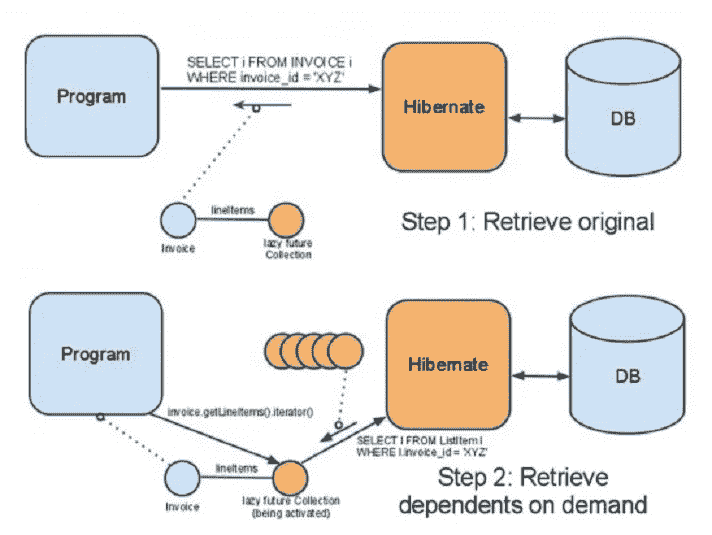
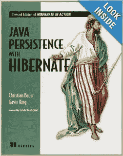
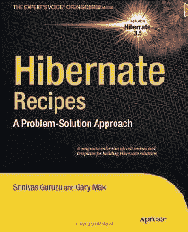

# 2023 年学习 Hibernate 和 JPA 的 5 本最佳书籍

> 原文：<https://medium.com/javarevisited/top-5-books-to-learn-hibernate-for-java-developers-b2cb4b16ccd6?source=collection_archive---------0----------------------->

## 这些是 2023 年 Java 开发者学习 Hibernate 的最佳 Hibernate 和 JPA 书籍

你好，Java 开发者，如果你想在 2023 年学习 Hibernate，并寻找最好的 Hibernate 书籍，那么你来对地方了。之前我已经分享了 [**最好的 Hibernate 和 JPA 课程**](/javarevisited/top-5-hibernate-online-training-courses-for-beginners-and-advance-java-programmers-469460596b2b) 今天我要分享的是 2023 年学习 Hibernate 和 JPA 的*最好的书。*

Hibernate 是最受欢迎的开源 ORM(对象关系映射)框架之一，它现在已经和 [JPA](https://javarevisited.blogspot.com/2018/01/top-5-hibernate-and-jpa-courses-for-java-programmers-learn-online.html) (Java Persistence API)一起成为在 Java 企业应用程序上开发持久层的标准。

经常收到请求，建议学习 Hibernate 或者 [Spring 和 Hibernate](https://javarevisited.blogspot.com/2016/12/top-5-spring-and-hibernate-training-courses-java-jee-programmers.html) 哪个书或者培训课程最好。

这促使我写了这篇关于市面上学习 Hibernate 的最佳书籍的文章。早些时候，我已经分享了 Java 开发人员必读的关于 Spring 框架的书籍和最好的 Spring 和 hibernate 培训课程的信息，这对在 Spring 中选择一本书和课程很有帮助。

类似于 Spring 框架，Hibernate 的经验是 Java JEE 开发角色中最抢手的东西。

如果你查看 Java 对开发角色的描述，你会经常看到 [Spring](http://www.java67.com/2017/11/top-5-free-core-spring-mvc-courses-learn-online.html) 和 [Hibernate](https://javarevisited.blogspot.com/2016/12/top-5-spring-and-hibernate-training-courses-java-jee-programmers.html#axzz56WXxxAC0) 。这意味着你必须具备使用 Hibernate 的知识，并且在简历上要有一些经验。

因为大多数招聘人员使用的关键词是 Spring Boot、微服务、全栈开发、Spring、Hibernate 等。，把它们放在简历上会让你更引人注目。在简历中添加正确的关键词绝对是每个程序员都应该注意的五大简历制作技巧之一。

由于大多数 Java 开发人员熟悉 [JDBC](/javarevisited/top-5-courses-to-learn-jdbc-and-database-connectivity-for-java-developers-free-and-best-of-lot-7945156fcc3) ，他们经常倾向于使用它——他们错过的是 Hibernate 的关键产品，比如[惰性加载](https://javarevisited.blogspot.com/2012/07/hibernate-get-and-load-difference-interview-question.html)、[缓存](http://www.java67.com/2017/10/difference-between-first-level-and-second-level-cache-in-Hibernate.html)，以及管理对象之间的关联。

这些书将帮助您学习 Hibernate，增长您现有的 Hibernate 知识，并学习 Hibernate 和 ORM 领域的一些最佳实践。

你也可以将本指南与 Udemy 上的 [**Spring 和 Hibernate for 初学者**](https://click.linksynergy.com/link?id=JVFxdTr9V80&offerid=323058.647428&type=2&murl=https%3A%2F%2Fwww.udemy.com%2Fspring-hibernate-tutorial%2) 课程结合使用，这是学习 Java 开发人员必备的两个框架的最佳课程之一。这是一门很好的课程，也是我将要提到的 Hibernate 书籍的配套课程，而且它的价格还不到这些书籍的一半。

 [## 学习 Hibernate 和 Spring(作为初学者)教程

### UDEMY 上最畅销的 1 门春季冬眠课程-超过 38000 条评论- 5 颗星！

udemy.com](https://click.linksynergy.com/deeplink?id=JVFxdTr9V80&mid=39197&murl=https%3A%2F%2Fwww.udemy.com%2Fcourse%2Fspring-hibernate-tutorial%2F) 

# Java 程序员必读 Hibernate 书籍

根据我的经验，一本书永远不足以学习新技术，但同时，你必须从一本开始。一旦你对 Hibernate 有了一些了解，你可以参考更全面的关于 Hibernate 的书籍。

正因为如此，我根据初学者的偏好对这些书进行了排序，从第一本书开始，我认为这本书最适合任何学习 Hibernate 框架的 Hibernate 初学者或 Java 开发人员。

## 1.[使用 Hibernate 的 Java 持久性](https://www.amazon.com/Java-Persistence-Hibernate-Christian-Bauer/dp/1617290459?tag=javamysqlanta-20)

现在，这是任何 Hibernate 开发人员的必读书籍之一。Java*Persistence with Hibernate*由克里斯蒂安·鲍埃尔和加文·金编写，加文·金是 Hibernate 开发团队的一员，参与了 EJB 3.0 和 JBoss。

他还与加文·金合著了曼宁最畅销的*冬眠行动*一书，这是这本书之前的名字。

到目前为止，这是关于 Hibernate 的最全面的书；它不仅教你对象关系映射和 Hibernate 框架的基础知识，还介绍了与 Hibernate 一起使用的最常见的设计模式，比如[数据访问对象(DAO)模式](http://javarevisited.blogspot.com/2013/01/data-access-object-dao-design-pattern-java-tutorial-example.html)。

> 我向所有使用 Hibernate 的 Java 开发人员强烈推荐这本书。你至少应该看一遍，才能对 Hibernate 有一个完整的了解。这本书有 800 多页，不好读，但绝对值得一看。

这本书教授了很多关于抓取策略、缓存、事务以及数据库设计和 ORM 技术的最佳实践，如果你愿意，你也可以将这本书与 [**Java 持久性:Hibernate 和 JPA 基础知识**](https://click.linksynergy.com/fs-bin/click?id=JVFxdTr9V80&subid=0&offerid=562016.1&type=10&tmpid=14538&RD_PARM1=https%3A%2F%2Fwww.udemy.com%2Fhibernate-and-jpa-fundamentals%2F) 课程结合起来，以便更好地学习。

 [## Java 持久性:Hibernate 和 JPA 基础

### 如果您是一名 Java 程序员，想学习 Java 持久性的基础知识和一些高级主题…

udemy.com](https://click.linksynergy.com/fs-bin/click?id=JVFxdTr9V80&subid=0&offerid=562016.1&type=10&tmpid=14538&RD_PARM1=https%3A%2F%2Fwww.udemy.com%2Fhibernate-and-jpa-fundamentals%2F) 

## 2.[高性能 Java 持久性](https://vladmihalcea.teachable.com/p/high-performance-java-persistence-ebook?coupon_code=JAVINPAULDISCOUNT&affcode=172599_kuoszt8s)作者 Vlad Mihalcea

这是另一本关于掌握 Hibernate 和 JPA 的精彩书籍，作者是另一位博客作者、Java 冠军和 Hibernate 权威 Vlad Mihalcea。顾名思义，这是一本可以让你的 Hibernate 知识更上一层楼的进阶书。

在编写数据库层时，性能非常重要，因为这里所犯的错误可能会降低应用程序的速度并影响其可伸缩性，但同时，很难找到创建高性能数据访问层所需的所有实用知识。

这本书提供了微调 Java 数据访问性能的所有技巧。从连接管理到批量更新、获取大小和并发控制机制，它揭示了最常见的 Java 数据访问框架的内部工作原理。

如果你喜欢更多的互动学习，弗拉德还创建了一个同名的在线课程， [**高性能 Java 持久性和 Hibernate——Mach 1**](https://vladmihalcea.teachable.com/p/high-performance-java-persistence-mach-1?utm_source=javarevisited&utm_medium=web&utm_campaign=hpjpmach1&affcode=172599_kuoszt8s)，这很好地补充了他的书。如果你真的想掌握 Hibernate 的性能，我强烈建议你参加这个课程。

Vlad Mihalcea 是一名 Java 拥护者，也是 Hibernate ORM 项目的顶级成员之一，他了解数据库和框架的内部工作原理，以提高企业应用程序的性能，这意味着您将向正确的人学习，而不会浪费时间参加任何琐碎或平庸的课程。

Vlad 还定期举办在线直播研讨会，深入教授您 Hibernate。你可以在这里查看下一期 [**高性能 Java 持久性培训**](https://vladmihalcea.teachable.com/p/high-performance-java-persistence-online-workshop?coupon_code=JAVINPAULDISCOUNT&affcode=172599_kuoszt8s) 的时间表。

 [## 高性能 Java 持久性-在线研讨会

### Vlad Mihalcea 是 Java 的拥护者，也是 Hibernate ORM 项目的主要成员之一。他创造了超持续性…

vladmihalcea.teachable.com](https://vladmihalcea.teachable.com/p/high-performance-java-persistence-online-workshop?coupon_code=JAVINPAULDISCOUNT&affcode=172599_kuoszt8s) 

这个在线研讨会旨在关注 Java 开发人员和数据库编程之间的差距，培训费用**是每张 750 美元。**

这是来自 Hibernate 培训师和 Java 冠军的高级培训，它进行了 4 次培训，每次 4 小时，成本是完全值得的，因为您不会发现 Vlad 将在本课程中分享的技巧，并且您将有机会向 Java 冠军学习。

该培训包括无限制访问[高性能 Java 持久性书籍](https://vladmihalcea.teachable.com/p/high-performance-java-persistence-ebook?coupon_code=JAVINPAULDISCOUNT&affcode=172599_kuoszt8s)和 [Mach 3 视频课程。](https://vladmihalcea.teachable.com/p/high-performance-java-persistence-mach-3-online?coupon_code=JAVINPAULDISCOUNT&affcode=172599_kuoszt8s)培训结束后，将通过 100%折扣券授予视频课程访问权。

 [## 高性能 Java 持久性-电子书

### Vlad Mihalcea 是 Java 的拥护者，也是 Hibernate ORM 项目的主要成员之一。他创造了超持续性…

vladmihalcea.teachable.com](https://vladmihalcea.teachable.com/p/high-performance-java-persistence-ebook?coupon_code=JAVINPAULDISCOUNT&affcode=172599_kuoszt8s) 

## 3.[休眠提示:70 多种常见休眠问题的解决方案](https://www.amazon.com/Hibernate-Tips-solutions-common-problems-ebook/dp/B06XXGYZHS?tag=javamysqlanta-20)

我很高兴地宣布，我的博客同事索本·让桑已经写了这本关于冬眠的伟大著作。

这本书用超过 **70 种方法**向你展示了如何用 Hibernate 的基本和高级特性有效地实现你的持久层。

每个 Hibernate 技巧都由一个或多个代码示例和一个易于理解的分步解释组成。您还可以下载一个示例项目，其中包含每个 Hibernate 技巧的可执行测试用例

这本书的核心优势之一就是简单、明了、简洁——不是重量级的巨著。它提供了很多实用的技巧和建议，帮助您解决日常使用 Hibernate 编码时会遇到的问题。

如果你喜欢像 [Effective Java](http://javarevisited.blogspot.sg/2017/10/effective-java-3rd-edition-coming-soon.html) 这样的书，那么我相信你也会欣赏这本书，因为它的内容容易理解，而且很有帮助。

## 4.[开始冬眠](http://www.amazon.com/Beginning-Hibernate-Dave-Minter/dp/1430265175?tag=javamysqlanta-20)

Jeff Linwood 和 Dave Minter 的《Hibernate 入门第二版》是针对 Hibernate 初学者的第三本书。和前面两个没有太大区别，而且如果你看过前面的标题，那么你很可能不需要这个。

但是，如果你对以前的书有困难，那么你可以试试这本。这本 [Hibernate 书籍](https://www.java67.com/2017/02/2-best-books-to-learn-hibernate-for-Java-Developers.html)的一个优点是案例研究，它解释了关键的关系概念，包括从上到下的一对多和多对多关系。

总的来说，只有当你不能阅读清单上的第一本书时，才使用这本书；不然你从初级水平就够了。

这本书是关于 JPA 的，JPA 是 Hibernate 遵循的现代标准，所以如果你想学习 JPA，我建议你把这本书和 Pluralsight 上 Antonio Gonç alves 的 Java Persistence API 2.2 结合起来

 [## Java 持久性 API 2.2

### 课程概述大家好。我叫安东尼奥·冈萨尔维斯。欢迎来到我的课程，Java 持久性 API 2.2。我是一个…

pluralsight.pxf.io](https://pluralsight.pxf.io/c/1193463/424552/7490?u=https%3A%2F%2Fwww.pluralsight.com%2Fcourses%2Fjava-persistence-api-21) 

顺便说一句，你需要一个 [**Pluralsight 会员**](https://pluralsight.pxf.io/c/1193463/424552/7490?u=https%3A%2F%2Fwww.pluralsight.com%2Flearn) 才能进入这个课程，费用大约是每月 29 美元或每年 299 美元(14%的折扣)。

如果你没有 Pluralsight 会员资格，我鼓励你申请一个，因为它可以让你访问他们的 [5000+在线课程](/javarevisited/7000-free-pluralsight-courses-to-build-in-demand-tech-skills-without-leaving-your-house-40edb50a8cf2)，这些课程涉及前端和后端开发、机器学习等所有最新主题。它还包括交互式测验、练习和最新的认证材料。

这更像是软件开发人员的网飞，因为学习是我们工作的一个重要部分，Pluralsight 会员资格是在竞争中保持领先的一个很好的方式。

他们还提供一个 [**10 天的免费试用**](https://pluralsight.pxf.io/c/1193463/424552/7490?u=https%3A%2F%2Fwww.pluralsight.com%2Flearn) ，无需任何承诺，这是一个很好的方式，不仅可以免费学习这门课程，还可以在加入 Pluralsight 之前检查课程的质量。

 [## 个人技术技能|多视角

### 借助 Pluralsight，在开发运维、机器学习、云、安全基础设施等领域构建所需技能…

pluralsight.pxf.io](https://pluralsight.pxf.io/c/1193463/424552/7490?u=https%3A%2F%2Fwww.pluralsight.com%2Flearn) 

## 5. [Hibernate Recipes:一种解决问题的方法](http://www.amazon.com/Hibernate-Recipes-Problem-Solution-Approach-Experts/dp/1430227966?tag=javamysqlanta-20)作者 Gary Mak，Srinivas Guruzu

我选择这本书是因为它的风格——一种解决问题的方法。这是一种促进主动学习的方式，也是一种很好的“如何做”的指导。这本书是由 Gary Mak 和 Srinivas Guruzu 创作的

类似于 [Spring Recipes:一种解决问题的方法](http://www.java67.com/2018/02/10-books-java-developers-should-read-in.html)，这本书通过引入一个问题然后解决它来教你 Hibernate。

这种方法适用于许多开发人员，如果您喜欢本系列的前几本书，您也会喜欢这本书。每一个食谱都有适当的代码示例和合理的解释。

一个好处，我个人在看这本书的时候感受到的，就是比较学习。例如，它解释了如果你正在 JDBC 做这件事，Hibernate 如何帮助你，它还能提供什么，等等。

虽然有时，这种书读起来让人不知所措，可能不会继续基于主题的阅读，但它确实有助于改变。

这是我为 Java 程序员列出的**顶级 Hibernate 书籍**中的全部内容。尽管如此，我还是强烈推荐这些 Hibernate 文档；它们是最新的信息来源。

对于中级 Java 开发人员，我建议，*Java Persistence With Hibernate，*连同 *Hibernate Tips* 或*High-Performance Java Persistence*，是了解 Hibernate 框架最多的书籍。

在阅读完这些 Hibernate 书籍并查看了这些[培训课程](https://javarevisited.blogspot.com/2018/01/top-5-hibernate-and-jpa-courses-for-java-programmers-learn-online.html#axzz5Jxzt0Q1H)之后，你也将能够回答大多数针对 Java 开发人员的 [Hibernate 面试问题](http://javarevisited.blogspot.com/2013/05/10-hibernate-interview-questions-answers-java-j2ee-senior.html)。

其他**有用资源**面向 Java 开发者
[10 门高级 Spring Boot 课程面向 Java 开发者](/javarevisited/10-advanced-spring-boot-courses-for-experienced-java-developers-5e57606816bd)
[10 门免费课程 2023 年学习 Spring Boot](/javarevisited/10-free-spring-boot-tutorials-and-courses-for-java-developers-53dfe084587e)
[7 门课程学习 Java 中的微服务与 Spring Boot](/javarevisited/top-5-courses-to-learn-microservices-in-java-and-spring-framework-e9fed1ba804d?source=collection_home---4------2-----------------------)
[我最喜欢的课程学习 Spring Boot](/javarevisited/top-10-courses-to-learn-spring-boot-in-2020-best-of-lot-6ffce88a1b6e)
[10 门课程学习 Spring Security 与 OAuth 2](/javarevisited/top-10-courses-to-learn-spring-security-and-oauth2-with-spring-boot-for-java-developers-8f0222d6066d)
[10 门课程学习核心 Java 2023 年](/javarevisited/top-5-java-online-courses-for-beginners-best-of-lot-1e1e240a758) 全栈 Java 开发者要学的
[10 门课程学习 Docker、Kubernetes、2023 年 AWS](/javarevisited/top-15-online-courses-to-learn-docker-kubernetes-and-aws-for-fullstack-developers-and-devops-d8cc4f16e773)
[我最喜欢的课程学习软件架构](/javarevisited/top-5-courses-to-learn-software-architecture-in-2020-best-of-lot-5d34ebc52e9)
[25 个面向 Java 开发者的系统设计问题](/javarevisited/25-software-design-interview-questions-to-crack-any-programming-and-technical-interviews-4b8237942db0?source=collection_home---4------0-----------------------)

感谢你阅读这篇文章，如果你喜欢这些课程，请与你的朋友和同事分享。如果您有任何问题或反馈，请留言。

**P. S. —** 由于一本书并不总是足以掌握任何新的框架或技术，所以我大多使用两三本书。你也可以从像 [Java Persistence: Hibernate 和 JPA Fundamentals](https://click.linksynergy.com/fs-bin/click?id=JVFxdTr9V80&subid=0&offerid=323058.1&type=10&tmpid=14538&RD_PARM1=https%3A%2F%2Fwww.udemy.com%2Fhibernate-and-jpa-fundamentals%2F) 这样的在线课程中获得帮助，进行更主动的学习。

 [## Java 持久性:Hibernate 和 JPA 基础

### 如果您是一名 Java 程序员，想学习 Java 持久性的基础知识和一些高级主题…

udemy.com](https://click.linksynergy.com/fs-bin/click?id=JVFxdTr9V80&subid=0&offerid=323058.1&type=10&tmpid=14538&RD_PARM1=https%3A%2F%2Fwww.udemy.com%2Fhibernate-and-jpa-fundamentals%2F)