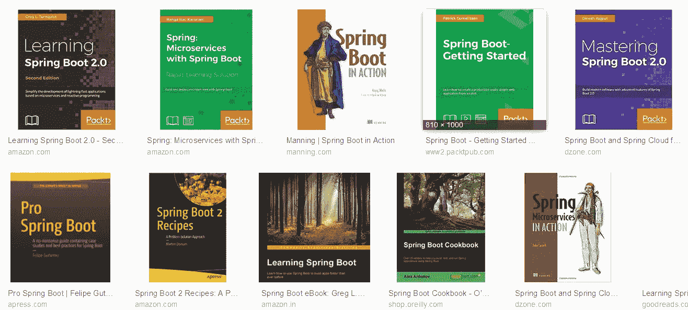
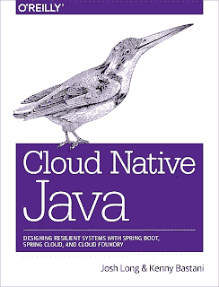
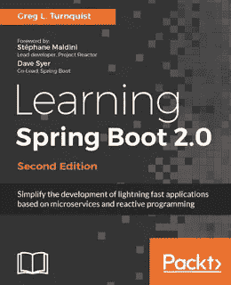
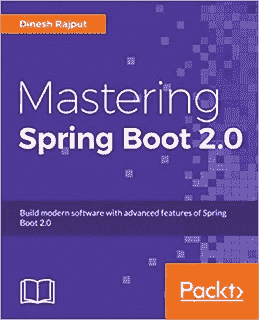

# 2023 年有经验的 Java 开发者学习 Spring Boot 和微服务的前 5 本书

> 原文：<https://medium.com/javarevisited/top-5-books-to-learn-spring-boot-and-microservices-for-experienced-java-developers-499a9d921d18?source=collection_archive---------0----------------------->

## 这些是你在 2023 年学习 Spring Boot、微服务和春云的最佳书籍

如果您是一名 Java 开发人员，并且想了解更多关于 Spring Boot 和 Spring Cloud 框架的知识，那么您来对地方了。在过去，我已经分享了一些最好的 [Spring Boot](https://javarevisited.blogspot.com/2018/05/top-5-courses-to-learn-spring-boot-in.html) 和[春云](http://javarevisited.blogspot.sg/2018/04/top-5-spring-cloud-courses-for-java.html#axzz5DbV6r2Ll)在线培训课程，今天，我将谈论一些学习 Spring Boot 和春云的最佳书籍。

但是，在此之前，我们先来试着了解一下*什么是微服务？*以及 Spring Boot 和 Spring Cloud 如何帮助 Java 开发微服务。

微服务只不过是 RESTful web 服务的扩展，其主要目标是将你的代码分解成小的、分布式的、独立的服务，以便更好地开发、部署和管理。

[**微服务架构**](/javarevisited/10-microservices-design-principles-every-developer-should-know-44f2f69e960f) 非常适合公共云，其重点是利用按需资源进行弹性扩展。然而，它确实需要深思熟虑的设计和大量的准备工作。

幸运的是， [Spring Boot](/javarevisited/10-advanced-spring-boot-courses-for-experienced-java-developers-5e57606816bd?source=collection_home---4------0-----------------------) 和 [Spring Cloud](https://javarevisited.blogspot.com/2018/02/top-5-spring-microservices-courses-with-spring-boot-and-spring-cloud.html) 通过提供通用功能简化了您的微服务应用，并允许您通过抽象出基于云的开发所需的细节来专注于业务逻辑。

就像 Spring 框架简化了 Java 开发一样，Spring Boot 消除了开发基于 REST 的服务所涉及的摩擦和样板代码。

同样， [**Spring Cloud**](https://www.java67.com/2018/12/top-5-spring-cloud-annotations-for-java.html) 提供了一套工具，用于微服务到企业和云的发现、路由和部署。这样，您就不需要关注与云相关的细节，可以像现在一样继续编写 Java 应用程序。

由于 Java 开发现在正在走向一个[云和微服务](https://javarevisited.blogspot.com/2018/02/top-5-spring-microservices-courses-with-spring-boot-and-spring-cloud.html#axzz5Cz1R4cHw)的世界，所以这可能是学习 Spring Boot 和 Spring Cloud 的最好时机，这样你就可以为不久的将来的巨大机遇做好准备。

# Java 程序员的 5 本最佳 Spring Boot 和 Spring Cloud 书籍

不幸的是，关于这些框架的好书并不多，所以我们没有太多的选择。同时，一些可用的书真的很棒。

随着越来越多的 Java 开发人员正在学习 [Spring Boot](https://www.java67.com/2019/01/top-5-spring-boot-annotations-java-programmers-should-know.html) 和 [Spring Cloud](https://dzone.com/articles/5-courses-to-learn-spring-cloud-in-2019) 来开发基于云的 Java 应用程序，你可以期待更多关于这些主题的书籍被撰写和发行。

目前，这里有一些学习 Spring Boot 和 Spring Cloud 的最佳资源。

## 1. [Spring Boot 在行动](https://www.amazon.com/Spring-Boot-Action-Craig-Walls/dp/1617292540?tag=javamysqlanta-20)

这是向 Craig Walls 学习 Spring Boot 的最佳书籍，Craig Walls 通过他的经典著作[*Spring in Action*](https://www.amazon.com/Spring-Action-Craig-Walls/dp/1617294942?tag=javamysqlanta-20)教授了大多数 Java 开发人员的 Spring 框架。

克雷格有一种奇妙的能力，用简单的语言和漂亮的类比解释复杂而乏味的概念。除此之外，你还会在这本书里找到许多美丽的例子。

这本书涵盖了 Spring Boot 几乎所有的基本主题，从自动配置开始，对 Spring Boot 如何简化 Java 开发有了一个大致的了解。

这本书进一步探索了高级概念，如 Spring Boot 致动器，以了解 Spring Boot 应用程序内部发生了什么。它还着眼于 Spring Boot CLI，用 [Groovy](http://javarevisited.blogspot.sg/2018/02/top-3-jvm-languages-java-programmer-learn.html#axzz56WXxxAC0) 进行更简单的 Java Spring 开发。

总之， [*Spring Boot 在行动*](https://www.amazon.com/Spring-Boot-Action-Craig-Walls/dp/1617292540?tag=javamysqlanta-20) 是学习 Spring Boot 最好的书籍之一，也是任何想要掌握 Spring Boot 框架的 Java 开发者的必读之作。

## 2.[弹簧微服务在行动](https://www.amazon.com/Spring-Microservices-Action-John-Carnell/dp/1617293989?tag=javamysqlanta-20)

这是另一本关于基于云的 Java 开发的伟大著作，但它侧重于微服务。实际上，这是我从[云原生 Java](https://www.amazon.com/Cloud-Native-Java-Designing-Resilient/dp/1449374646?tag=javamysqlanta-20) 开始之前看的第一本关于这个话题的书。

作者 John Carnell 是一名高级云工程师，拥有 20 年的 Java 经验，这一点在本书中有所体现。他出色地解释了关键的微服务概念和模式，如配置、路由、扩展和用真实的例子部署您的服务。

这本书还将教你如何使用 Java 和 Spring 平台构建基于微服务的应用。您不仅会学到这些概念，还会在构建和部署您的第一个 Spring 云应用程序时获得微服务设计的实践经验。

总的来说，对于有 Spring 经验，想用 Java 开发微服务应用的 Java 开发者来说，这是一本理想的书。为了更好的效果，你也可以把这本书和 28 分钟官方的 [**大师微服带 Spring Boot 和春云**](https://click.linksynergy.com/fs-bin/click?id=JVFxdTr9V80&subid=0&offerid=323058.1&type=10&tmpid=14538&RD_PARM1=https%3A%2F%2Fwww.udemy.com%2Fmicroservices-with-spring-boot-and-spring-cloud%2F) 课程结合起来，更好的学习 Spring Boot 和春云。

 [## 借助 Spring Boot 和春云掌握微服务

### 你想学习用 Spring Boot 构建一个惊人的 REST API 吗？你想了解微服务的宣传吗…

udemy.com](https://click.linksynergy.com/fs-bin/click?id=JVFxdTr9V80&subid=0&offerid=323058.1&type=10&tmpid=14538&RD_PARM1=https%3A%2F%2Fwww.udemy.com%2Fmicroservices-with-spring-boot-and-spring-cloud%2F) 

## 3.[云原生 Java](https://www.amazon.com/Cloud-Native-Java-Designing-Resilient/dp/1449374646?tag=javamysqlanta-20)

这是本书中关于基于云的 Java 开发的精华。我不认为有任何其他的书成功地涵盖了*基于云的 Java 开发*和使用 Spring 构建一个有弹性的分布式应用，比如这本书。

两位作者，Josh Long 和 Kenny Bastani 是 T4 Spring 框架的权威，这在本书中有所体现。Spring 不同方面的介绍，像 MVC，配置，云，都很好。他们尽最大努力让这个复杂的话题尽可能简单。

一开始，云术语和服务可能看起来势不可挡，但是如果你坚持读完这本书，你将不得不为使用 [Spring Boot](https://javarevisited.blogspot.com/2018/05/the-springbootapplication-annotation-example-java-spring-boot.html) 、 [Spring Cloud](https://javarevisited.blogspot.com/2018/04/top-5-java-frameworks-to-learn-in-2018_27.html#axzz5DmwFLA1K) 和 Cloud Foundry 构建基于云的 Java 应用打下坚实的基础。

本书分为四个主要部分，涵盖基础知识、开发分布式 web 服务和微服务、将基于云的应用程序集成和部署到生产环境中，以及一些关于持续集成和交付的指南。

简而言之，这是开发基于云的 Java 应用程序最全面的指南之一

如果你需要一些实例，那么参加 Chad Darby 的在线课程，如 [**将 Java Spring Apps 在线部署到亚马逊云(AWS)**](https://click.linksynergy.com/deeplink?id=JVFxdTr9V80&mid=39197&murl=https%3A%2F%2Fwww.udemy.com%2Fcourse%2Fdeploy-java-spring-apps-online%2F) 真的可以帮到你。在本课程中，您不仅将学习最受欢迎的云平台之一 AWS 的基本知识，还将学习如何将 Spring Boot REST API 部署到 AWS，这将让您充满信心。

 [## 将 Java Spring 应用在线部署到亚马逊云(AWS)

### 部署您的 Java Spring 应用程序，实现实时互联网访问！没有更多的“本地主机”:-)包括部署一个 MySQL 数据库在…

udemy.com](https://click.linksynergy.com/deeplink?id=JVFxdTr9V80&mid=39197&murl=https%3A%2F%2Fwww.udemy.com%2Fcourse%2Fdeploy-java-spring-apps-online%2F) 

## 4.[学习 Spring Boot 2.0](https://www.amazon.com/Learning-Spring-Boot-2-0-microservices-ebook/dp/B01LPRN0Z8?tag=javamysqlanta-20)

这是另一本学习 Spring Boot 2.0 的好书。这是流行的 Spring Boot 框架的最新版本。作者 Greg Turnquist 是 Spring 方面的权威，在 Spring 框架背后的 Pivotal(现在的 Vmware)工作。

他是 [Spring Data](/javarevisited/5-best-spring-data-jpa-courses-for-java-developers-45e6438be3c9) 团队的成员，也是 MongoDB 春季会议的负责人。他还参与了 Spring Boot、Spring HATEOAS 和 [Spring Data REST](https://javarevisited.blogspot.com/2021/08/top-5-spring-data-jpa-courses-for-java.html) 的开发，同时还担任 Spring 入门指南的自由编辑。

所有这些经历在本书中都很明显。我特别喜欢他对细节的解释。例如，在第一个 Spring Boot 的例子中，他解释了一个[@ Spring boot application](http://www.java67.com/2018/05/difference-between-springbootapplication-vs-EnableAutoConfiguration-annotations-Spring-Boot.html)在递归扫描 Spring 组件、启用自动配置和声明类本身可以是 Spring beans 的来源方面做了什么。

然后他出去解释日志并证明他的观点，这确实巩固了信息。这本书不仅涵盖了 Spring Boot，还非常丰富地测试了 Spring 应用程序。作者有点像测试迷，写过 [**Python 测试指南**](https://www.amazon.com/Python-Testing-Cookbook-Greg-Turnquist/dp/1849514666?tag=javamysqlanta-20) 。

*学习 Spring Boot 2.0* 探索与 Spring Boot 合作开发微服务以及将 Spring Boot 应用部署到生产中的前景。简而言之，这是一本适合 Java 开发人员学习 Spring Boot 的完美书籍。

## 5.[掌握 Spring Boot 2.0](https://www.amazon.com/Mastering-Spring-Boot-2-0-cloud-native/dp/1787127567/?tag=javamysqlanta-20)

这是迪内什·拉吉普特关于 Spring Boot 的另一本相对较新的书。他也是一名 Java 博客作者和 Spring 爱好者。他也是 Pivotal 认证的 Spring 专家，也是《T2》Spring 5 Design Patterns 的作者，这是另一本关于 Spring 框架的精彩书籍。

这本书的全称是[***掌握 Spring Boot 2.0:使用 Spring Boot 构建现代、云原生和分布式系统。***](https://www.amazon.com/Mastering-Spring-Boot-2-0-cloud-native/dp/1787127567/?tag=javamysqlanta-20)****正如扩展标题所解释的，它还涵盖了 Spring 云和基于云的 Java 开发。****

****在本书中，你将从 Spring Boot 2.0 开始，这是 Spring 框架的最新版本，然后学习一些基本特性，比如自动配置、启动器依赖、执行器、Spring Boot CLI 等。****

********

****一旦您熟悉了基础知识，您将探索高级的东西，如定制自动配置以满足您的期望。之后，该书通过介绍关键的 Spring Boot 工具和服务，探索了[微服务](http://javarevisited.blogspot.sg/2017/12/10-things-java-programmers-should-learn.html#axzz53ENLS1RB)和[云](http://www.java67.com/2018/02/10-books-java-developers-should-read-in.html)的前景。****

****简而言之，这本书涵盖了开发基于 Spring 的 Java 微服务应用程序所需要知道的一切，从开发到测试和部署。****

****关于**学习 Spring Boot 和春云的最佳书籍**到此为止。这是开发基于云的 Java 应用程序的两个领先的 Java 框架。这些书不仅会帮助你学习基础知识，还会给你提供在云上创建和部署自己的 Java 应用程序所需的实践经验。****

****这几本书学习基于云的 Java 开发应该足够了，但是如果需要更多的辅助，也可以参考 [*大师微服务开发搭配 Spring Boot*](https://click.linksynergy.com/fs-bin/click?id=JVFxdTr9V80&subid=0&offerid=323058.1&type=10&tmpid=14538&RD_PARM1=https%3A%2F%2Fwww.udemy.com%2Fmicroservices-with-spring-boot-and-spring-cloud%2F) 进行更多的导师指导学习。****

****其他 **Java 和 Spring 文章**你可能喜欢:
[Java 开发人员的 10 门高级 Spring Boot 课程](/javarevisited/10-advanced-spring-boot-courses-for-experienced-java-developers-5e57606816bd)
[完整的 Java 开发人员路线图](https://javarevisited.blogspot.com/2019/10/the-java-developer-roadmap.html#123)
[用 Spring 学习 Java 中微服务的 5 门课程](/javarevisited/top-5-courses-to-learn-microservices-in-java-and-spring-framework-e9fed1ba804d)
[我最喜欢的学习软件架构的课程](/javarevisited/top-5-courses-to-learn-software-architecture-in-2020-best-of-lot-5d34ebc52e9)
[3 种 Java 开发人员可以向 Spring 学习的最佳实践](https://javarevisited.blogspot.com/2018/06/3-best-practices-java-programmers-can-learn-from-spring-framework.html)
[Spring MVC 在 Java 内部是如何工作的？](https://javarevisited.blogspot.com/2017/06/how-spring-mvc-framework-works-web-flow.html)
[2023 年 Java 开发者应该学会的 10 件事](https://javarevisited.blogspot.sg/2017/12/10-things-java-programmers-should-learn.html#axzz53ENLS1RB)
[Java 和 Web 开发者应该学会的 10 个框架](https://javarevisited.blogspot.com/2018/01/10-frameworks-java-and-web-developers-should-learn.html)
[Java 开发者春季微服务课程前 5 名](https://javarevisited.blogspot.com/2018/02/top-5-spring-microservices-courses-with-spring-boot-and-spring-cloud.html#axzz5Cz1R4cHw)
[15 Java 开发者 Spring Boot 面试问题](http://www.java67.com/2018/06/top-15-spring-boot-interview-questions-answers-java-jee-programmers.html)
[2023 年成为更优秀 Java 程序员的 10 个小技巧](http://javarevisited.blogspot.sg/2018/05/10-tips-to-become-better-java-developer.html)****

****感谢阅读这篇文章！如果你喜欢这些最好的 Spring Boot 和春云书籍，请与你的朋友和同事分享。如果您有任何问题或反馈，请在下面的评论中留言。****

******P. S. —** 如果你更喜欢在线课程而不是书本，那么我也建议你去看看由 28 分钟官方推出的 [**大师微服务与 Spring Boot 和春云**](https://click.linksynergy.com/fs-bin/click?id=JVFxdTr9V80&subid=0&offerid=323058.1&type=10&tmpid=14538&RD_PARM1=https%3A%2F%2Fwww.udemy.com%2Fmicroservices-with-spring-boot-and-spring-cloud%2F) 课程，更好地了解 Spring Boot 和春云。****

**** [## 面向有经验的 Java 开发人员的 10 门高级 Spring Boot 课程

### 高级 Spring Boot 课程为有经验的 Java 开发人员学习 Spring Boot 测试，云和容器…

medium.com](/javarevisited/10-advanced-spring-boot-courses-for-experienced-java-developers-5e57606816bd)****