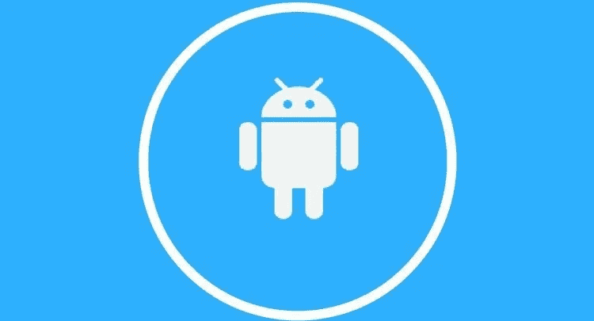
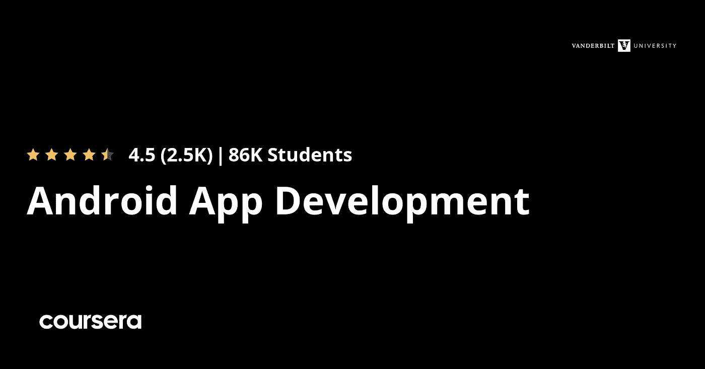

# 2023 年初学者在线学习 Android 应用开发的 7 门最佳课程

> 原文：<https://medium.com/javarevisited/top-5-courses-to-learn-android-for-java-programmers-667e03d995b4?source=collection_archive---------0----------------------->

## 以上是我最喜欢的从 Udemy，Coursera，Pluralsight 等网络平台学习 2023 年 Android app 开发的在线课程。

丁昆在 [Unsplash](https://unsplash.com?utm_source=medium&utm_medium=referral) 上拍摄的照片

大家好，如果你想成为一名 Android 应用开发者，想在 2023 年学习 Android，并寻找最好的 Android 在线课程，那么你来对地方了。

之前，我已经分享了 [**免费的 Android 初学者课程**](/javarevisited/5-free-courses-to-become-an-android-developer-d4d207f53675) ，和[最好的 Kotlin 课程](/javarevisited/top-5-courses-to-learn-kotlin-in-2020-dfc3fa7706d8)，今天，我将分享 2023 年从 Udemy，Pluralsight 和其他流行的在线学习门户网站学习 Android 的绝对最好的课程。

Java 非常幸运，Android 把它作为编程语言。这为 Android 应用程序开发中的 Java 开发者打开了一扇机会之门。很多人问我为什么 Java 开发者要学 Android？

我的简单回答是，对 Android 操作系统的良好了解增加了你获得工作和改变人们生活的机会，因为 Android 应用是连接数十亿人的直接方式。

毫无疑问，Android 是世界上最大的移动平台，拥有超过 80%的市场份额和超过数十亿台运行 Android 的设备。

> 通过为这样一个大平台开发应用，你有一个很好的机会去改变和影响数百万人的生活。

你也可以在 Windows、Mac 或 Linux 上为 Android 开发，这意味着你现有的 Java 开发经验不会浪费。

同样，如果你是第一次接触 [Java](https://javarevisited.blogspot.com/2018/05/top-5-java-courses-for-beginners-to-learn-online.html) ，它会打开另一扇机会之门，因为 Java 是最流行的编程语言，很多公司，无论大小，都使用 Java 进行服务器端开发。

> 所以，最大的问题是，你如何学习 Android？如何为 Android 平台开发简单和真实的应用程序？

嗯，像许多其他技术一样，[书籍](http://javarevisited.blogspot.sg/2017/06/top-5-java-and-android-game-programming-books.html)，和[在线课程](https://javarevisited.blogspot.com/2018/01/5-free-git-courses-for-programmers-to-learn-online.html)是学习 Android 的最佳途径。书籍为你提供全面的知识，课程是最好的开始。当熟悉一项新技术的人解释它时，我们会更好地与它联系起来。在线课程提供了一个互动学习的机会。

你也可以按照自己的节奏学习，你不需要参加一个班或者长途通勤来获得课堂培训。相反，你可以在舒适的办公室和家里学习 Android。

# 2023 年新手学习的 7 门最佳安卓在线课程

在这篇文章中，我列出了一些关于 Android 平台和 Android 应用开发的最好的课程。这些课程非常全面，但不贵。

你花不到 15 美元就可以获得大多数课程，其中一些课程是 10 天免费的，这对于学习 Android 来说是足够好的时间，尤其是如果你之前有一些 Java 经验的话。

## **1。** [**完整的 Android N 开发者教程**](https://click.linksynergy.com/fs-bin/click?id=JVFxdTr9V80&subid=0&offerid=323058.1&type=10&tmpid=14538&RD_PARM1=https%3A%2F%2Fwww.udemy.com%2Fcomplete-android-n-developer-course%2F)

这是通过构建真实世界的应用程序(如优步、WhatsApp 和 Instagram)来学习使用 Android 7 牛轧糖进行 Android 应用程序开发的最佳课程之一。

这门课程由[罗布·珀西瓦尔](https://click.linksynergy.com/deeplink?id=CuIbQrBnhiw&mid=39197&murl=https%3A%2F%2Fwww.udemy.com%2Fuser%2Frobpercival%2F)、[马克·斯托克](https://click.linksynergy.com/deeplink?id=CuIbQrBnhiw&mid=39197&murl=https%3A%2F%2Fwww.udemy.com%2Fuser%2Fmarcweinstock2%2F)创建，在最大的在线培训平台之一 Udemy 平台上受到超过 5.8 万名学员的信任。

这门课程最棒的地方在于，你需要零编程知识。在本课程中，你将学到你需要知道的一切，因此，如果你刚刚开始编程，并把 Android 作为一个首选平台，这是最适合你的课程。

这也是最全面的关于实用 Android 开发的课程之一。你可以学习开发任何你喜欢的 Android 应用程序。

作为课程的一部分，你还将构建一个 WhatsApp 的克隆版，并学习如何营销和赚钱。所以，如果你正在寻找一种新的赚钱方式，这是你应该加入的课程。

**这里是加入本课程的链接** — [完整的 Android N 开发者课程](https://click.linksynergy.com/fs-bin/click?id=JVFxdTr9V80&subid=0&offerid=323058.1&type=10&tmpid=14538&RD_PARM1=https%3A%2F%2Fwww.udemy.com%2Fcomplete-android-n-developer-course%2F)

涵盖了大量的技术，包括开源解析服务器、 [Firebase](https://dev.to/javinpaul/top-12-frameworks-programmers-can-learn-in-2019-web-development-mobile-development-2if5) 、Admob、 [LibGDX](https://javarevisited.blogspot.com/2019/03/5-free-game-development-courses-unity-corona-libgdx-java.html) (游戏开发)、蓝牙等等。这门课程还教会我们如何利用你的 Android 应用赚钱，以及如何利用 AdMob 和谷歌广告赚钱。

## 2.[完整的 Android Oreo 开发者课程——构建 23 款应用！](https://click.linksynergy.com/deeplink?id=CuIbQrBnhiw&mid=39197&murl=https%3A%2F%2Fwww.udemy.com%2Fcourse%2Fthe-complete-android-oreo-developer-course%2F)

如果你正在寻找一个基于项目的实践课程来学习 Android，那么你会喜欢 Udemy 的这个 Android 课程。在本课程中，您将通过构建包括超级马里奥 Run、WhatsApp 和 Instagram 在内的真实应用程序，学习使用 Java 和 Kotlin 开发 Android O 应用程序！

由罗布·珀西瓦尔和 T2·尼克·沃尔特创建的这门 Android 实践课程受到了超过 74，000 人的信任，如果你真的想成为一名专业的 Android 应用开发者，我强烈推荐你。

这门课程最棒的地方在于，它不仅教你如何使用 [Java](/javarevisited/top-5-java-online-courses-for-beginners-best-of-lot-1e1e240a758) 开发安卓应用，还教你如何使用安卓应用开发的官方语言 [Kotlin](/javarevisited/7-free-courses-to-learn-kotlin-in-2020-327c3872c1e1) 。

Android 开发是软件工程中需求最大的领域之一。随着 Android 占据全球智能手机市场份额的 85%以上，我们只会在这一领域看到更多的机会，这意味着全球对 Android 开发者有巨大的需求。

向雇主展示你已经准备好接受这份工作的最好方式之一就是提供一份你做过的工作的作品集。这可能很有挑战性，也很耗时，尤其是如果你是编程新手，这正是本课程可以真正帮助你的地方，因为你将创建真正的应用程序，包括超级马里奥 Run、WhatsApp 和 Instagram！

**这里是加入本课程的链接** — [完整的 Android Oreo 开发者课程—构建 23 个应用！](https://click.linksynergy.com/deeplink?id=CuIbQrBnhiw&mid=39197&murl=https%3A%2F%2Fwww.udemy.com%2Fcourse%2Fthe-complete-android-oreo-developer-course%2F)

## **3。** [**完整的 Android 开发者课程:初级到高级**](https://click.linksynergy.com/fs-bin/click?id=JVFxdTr9V80&subid=0&offerid=323058.1&type=10&tmpid=14538&RD_PARM1=https%3A%2F%2Fwww.udemy.com%2Fandroidcourse%2F)

这是一个更受欢迎的从 Udemy 学习 Android 的课程，由于他们经常进行各种 flash 销售，在 90%的折扣后，通常只需 15 美元。在本课程中，您将学习如何为智能手机及其他设备构建和开发 Android 应用程序。

这可能是 [Udemy](https://click.linksynergy.com/deeplink?id=CuIbQrBnhiw&mid=39197&murl=https%3A%2F%2Fwww.udemy.com%2F) 上最受欢迎的 Android 课程，有超过 96140 名学生注册。这充分证明了该课程的可信度，97000 人不可能错。

在本课程中，您不仅将了解创建应用程序时使用的概念和技术，还将从头开始开发 Android 应用程序。

你将学习如何使用[数据库](https://dzone.com/articles/top-5-sql-and-database-courses-to-learn-online-bes)存储来自安卓应用的数据，并在安卓设备上部署自主开发的应用。

您还将学习如何使用 [LibGdx](https://javarevisited.blogspot.com/2019/03/5-free-game-development-courses-unity-corona-libgdx-java.html) 为 Android 设备创建游戏，这是用 Java 创建游戏的流行框架之一，最重要的是，您将学习如何为 Android 应用程序创建用户界面，这是创建现实世界应用程序的重要方面之一。

**这里是加入本课程的链接** — [完整的 Android 开发者课程:初级到高级](https://click.linksynergy.com/fs-bin/click?id=JVFxdTr9V80&subid=0&offerid=323058.1&type=10&tmpid=14538&RD_PARM1=https%3A%2F%2Fwww.udemy.com%2Fandroidcourse%2F)

## **4。** [安卓应用开发专业化](https://coursera.pxf.io/c/3294490/1164545/14726?u=https%3A%2F%2Fwww.coursera.org%2Fspecializations%2Fandroid-app-development)【Courser 最佳课程】

这是初学者从 [Coursera](https://coursera.pxf.io/c/3294490/1164545/14726?u=https%3A%2F%2Fwww.coursera.org%2Fcourseraplus) 在线学习的最好的 Android 课程之一，Coursera【】是一个受欢迎的在线学习平台，提供来自一流大学和公司如谷歌、AWS 和 IBM 的学习材料。

该 Android 专业由范德比尔特大学提供，它将教您如何应用核心 Java 编程语言功能和软件模式来开发由核心 Android 组件组成的可维护移动应用程序，以及基本的 Java I/O 和持久性机制

在本课程中，您将学习创建一个简单的多屏幕 Android 应用程序，该应用程序可以利用菜单和首选项，并学习将该应用程序部署到 Android marketplace。

在这个过程中，你还将学习像 [Android Studio](https://javarevisited.blogspot.com/2018/09/top-5-courses-to-learn-intellij-idea-java-and-android-development.html) 这样的工具、Android 活动组件、材料设计、文件 I/O 和数据持久化、单元测试和软件模式。

如果你正在寻找一个有证书的综合课程，那么 Coursera 的这个 Android 课程是最好的选择。完成本课程、评估和项目后，您将获得一份证书。此外，超过 46%的人在完成这一专业后开始了新的职业生涯，25%的人获得了晋升或加薪，这令人惊讶。

**这里是加入本课程的链接—** [安卓应用开发专业化](https://coursera.pxf.io/c/3294490/1164545/14726?u=https%3A%2F%2Fwww.coursera.org%2Fspecializations%2Fandroid-app-development)

顺便说一句，如果你觉得 Coursera 的课程有用，那么我建议你加入 Coursera Plus 的订阅计划，这是 Coursera 的一个订阅计划，可以让你无限制地访问他们最受欢迎的课程、专业、专业证书和指导项目。

 [## Coursera Plus |无限制访问 7，000 多门在线课程

### 用 Coursera Plus 投资你的职业目标。无限制访问 90%以上的课程、项目…

coursera.pxf.io](https://coursera.pxf.io/c/3294490/1164545/14726?u=https%3A%2F%2Fwww.coursera.org%2Fcourseraplus) 

## **5。** [**Android 初学者系列:刚好够用 Java**](https://pluralsight.pxf.io/c/1193463/424552/7490?u=https%3A%2F%2Fwww.pluralsight.com%2Fcourses%2Fandroid-beginner-java-introduction)**【plural sight 课程】**

这是 John Sonmez 专门为 Pluralsight 平台上的 Java 开发人员编写的另一个 Android 课程。在本课程中，您将学习如何使用 Java 和 Eclipse(Java 开发人员中最流行的 ide 之一)创建一个真正的 Android 应用程序。

这门课会同时教你 [Java](/javarevisited/10-free-courses-to-learn-java-in-2019-22d1f33a3915) 和 [Android](https://dzone.com/articles/top-5-intellij-idea-and-android-studio-courses-for) 。您将在创建现实生活中的工作 Android 应用程序时学习 Java 和 Android 的基础知识。

顺便说一句，本课程是关于开始 [Android 开发](https://javarevisited.blogspot.com/2017/12/top-5-android-online-training-courses-for-Java-developers.html)的 4 部分系列中的第三部分，但是你不需要观看其他课程来理解本课程。

只要你有一些基本的编程知识，你就应该能够跟随本课程，使用 [Java](http://www.java67.com/2018/08/top-10-free-java-courses-for-beginners-experienced-developers.html) 和 [Eclipse](http://www.java67.com/2018/02/5-free-eclipse-and-junit-online-courses-java-developers.html) 构建你的第一个 Android 应用。

这些课程首先涵盖了你需要知道的关于使用 [Eclipse](https://www.java67.com/2018/02/5-free-eclipse-and-junit-online-courses-java-developers.html) 用 Java 开发 Android 应用程序的一切。然后，您将一步一步地创建一个记事本应用程序，并在此过程中学习 Java 概念。

**这里是加入本课程的链接**——[安卓初学者系列:Java 刚刚好](https://pluralsight.pxf.io/c/1193463/424552/7490?u=https%3A%2F%2Fwww.pluralsight.com%2Fcourses%2Fandroid-beginner-java-introduction)

如果你正在寻找一种新的有趣的方法来学习 Java，同时构建一个 Android 应用程序，或者你只是想通过同时学习两个主题来最大限度地利用你的时间，这个课程可能正是你正在寻找的。

这个课程最棒的地方在于，如果你注册了一个 [**10 天免费试用**](http://pluralsight.pxf.io/c/1193463/424552/7490?u=https%3A%2F%2Fwww.pluralsight.com%2Flearn) ，就可以免费获得，这足以完成这个课程，从 Android 开始。

 [## 对个人来说

### Pluralsight 的使命一直是公平的技术竞争环境。不管你想学什么，或者…

pluralsight.pxf.io](http://pluralsight.pxf.io/c/1193463/424552/7490?u=https%3A%2F%2Fwww.pluralsight.com%2Flearn) 

## 6.[用 Java 开发现代安卓应用](https://www.educative.io/courses/modern-android-app-development?affiliate_id=5073518643380224)【教育性】

如果你喜欢边做边学，并寻找一个交互式课程来学习用 Java 开发 Android 应用程序，那么你会喜欢 Educative 的这个基于文本的交互式课程，这是一个新的在线学习平台，允许你在浏览器中运行代码。

在本课程中，您将采用基于项目的实践方法来开发 Android 应用程序。您将使用 Android 开发人员日常使用的最常用工具，包括 Java、Groovy 和 XML。

随着您的学习，您将构建一个功能齐全的旅游博客应用程序，这将是您作品集的一大亮点。

本课程使用 Educative 的 Android Widget，它提供了一个功能齐全的环境，可以在您的浏览器中构建和启动 Android 应用程序。

简而言之，这是 Java 开发人员开始学习 Android 的绝佳课程，尤其是对于那些努力下载软件和建立自己的开发环境的初学者。

**这里是加入本课程的链接** — [用 Java 开发现代 Android 应用](https://www.educative.io/courses/modern-android-app-development?affiliate_id=5073518643380224)

而且，如果你发现教育平台和他们的搜索课程，如搜索系统设计面试，那么考虑获得 [**教育订阅**](https://www.educative.io/subscription?affiliate_id=5073518643380224) ，每月只需 14.9 美元即可访问他们的 100 多门课程。非常划算，非常适合准备编码面试。

 [## 教育无限:保持领先

### 我们听到了您的反馈。你现在只需支付一次费用，就可以获得 Educative 上的所有课程。

www.educative.io](https://www.educative.io/subscription?affiliate_id=5073518643380224) 

## **7。**[Android Java master class——成为应用开发者](https://click.linksynergy.com/deeplink?id=CuIbQrBnhiw&mid=39197&murl=https%3A%2F%2Fwww.udemy.com%2Fcourse%2Fmaster-android-7-nougat-java-app-development-step-by-step%2F)【Udemy】

Android 的一个重要方面是变化很快。每年你都会看到一个新版本的 Android，它有更好的功能、安全性和更好的集成。因此，[的 Java 开发人员](https://javarevisited.blogspot.com/2018/05/10-tips-to-become-better-java-developer.html#axzz5jwmmAbXI)不仅要学习 Android，还要随时了解 Android 世界的最新发展。

Android 7 牛轧糖和 Android 8 被像 Twitter 和优步这样的顶级公司使用，使用 [Java](https://javarevisited.blogspot.com/2018/08/top-5-java-8-courses-to-learn-online.html) 的 Android Nought (Android 7)和 Android Oreo (Android 8)应用大师班就是这么做的。已经有超过 26，086 名学生注册了这门课程，我发现它非常适合那些想要提升 Android 技能的人。如果你是新手，你也可以参加这个课程。

无论何时开始学习 Android，从最新的 Android 版本开始总是更好。

**以下是加入本安卓课程**——[安卓 Java 大师班——成为应用开发者](https://click.linksynergy.com/deeplink?id=CuIbQrBnhiw&mid=39197&murl=https%3A%2F%2Fwww.udemy.com%2Fcourse%2Fmaster-android-7-nougat-java-app-development-step-by-step%2F)的链接

以上是 Java 开发人员学习 Android 的一些最佳课程。Android 操作系统是最受欢迎的智能手机操作系统，对有开发 Android 应用程序经验的 Java 开发人员有很多需求，唯一的问题是 Android 发展如此之快，每年都有新版本发布。因此，对于每个 Java 或 Android 程序员来说，像 Android 12 版本一样保持更新是非常重要的。这些课程不仅会帮助你从零开始学习 Android，还会更新你的技能以适应新的 Android 版本。

其他**对 Java 开发者有用的资源**
[针对 Java 开发者的前 5 名 Spring 和 Hibernate 课程？](http://javarevisited.blogspot.sg/2016/12/top-5-spring-and-hibernate-training-courses-java-jee-programmers.html)
[5 个面向 Java Web 开发人员的春季安全在线课程](http://www.java67.com/2017/12/top-5-spring-security-online-training-courses.html)
[5 个面向 Java 开发人员的 Apache Spark 课程](http://javarevisited.blogspot.com/2017/12/top-5-courses-to-learn-big-data-and.html)
[5 个面向初学者的免费 Java 课程](http://javarevisited.blogspot.sg/2017/11/top-5-free-java-courses-for-beginners.html)
[5 个网站免费学习 Java 编码](http://javarevisited.blogspot.sg/2015/06/2-websites-to-learn-coding-in-java-online-free.html)
[5 个免费学习 JavaScript 的地方](http://www.java67.com/2015/12/best-websites-to-learn-javascript-online.html)
[5 个面向程序员的免费数据结构与算法课程](https://javarevisited.blogspot.com/2018/01/top-5-free-data-structure-and-algorithm-courses-java--c-programmers.html)
[10 个面向程序员的免费 Python 课程](https://javarevisited.blogspot.com/2018/12/10-free-python-courses-for-programmers.html)[如果你喜欢这些*最好的 Android 在线课程和培训课程*，请分享这篇文章，如果你有任何问题或反馈，请发表评论。](https://javarevisited.blogspot.com/2018/12/10-free-python-courses-for-programmers.html)

**P.S.** —如果你正在寻找最好的免费课程来启动你的移动开发之旅，那么你也可以看看这个为初学者提供的 [**免费 Android 在线课程列表**](https://www.java67.com/2019/01/top-5-free-android-app-development-courses-for-programmers.html) 。它包含了一些对想要学习 Android 操作系统和为 Android 平台开发的人来说最有用的免费资源。

 [## 2023 年成为安卓开发者的 5 门免费课程

### 这些是免费学习 Android 与 Java 和 Kotlin 的最佳免费课程

medium.com](/javarevisited/5-free-courses-to-become-an-android-developer-d4d207f53675)