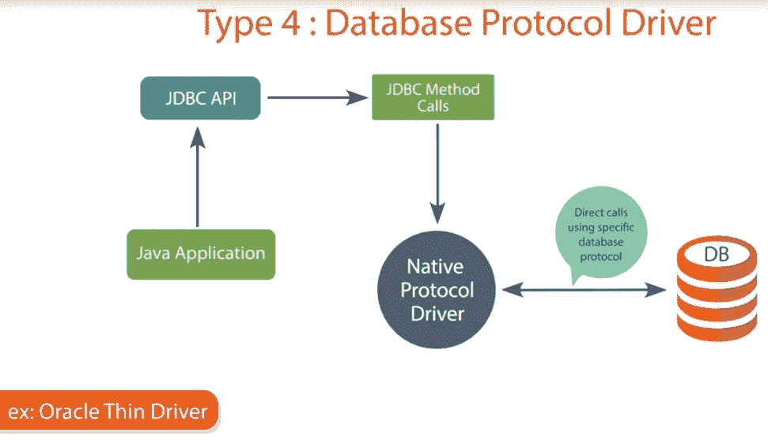
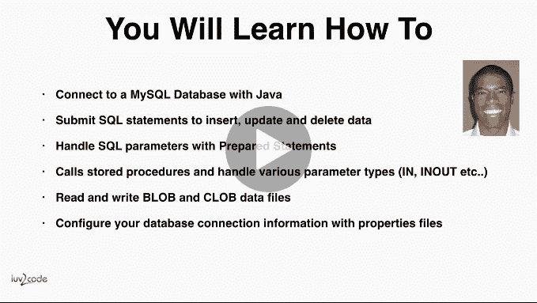
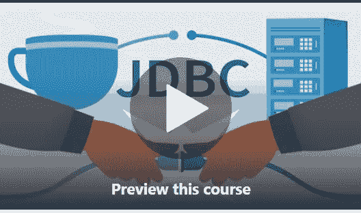
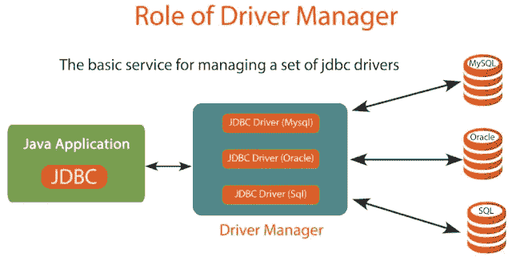

# 2023 年学习 Java 数据库连接的 5 门最佳免费 JDBC 课程

> 原文：<https://medium.com/javarevisited/top-5-courses-to-learn-jdbc-and-database-connectivity-for-java-developers-free-and-best-of-lot-7945156fcc3?source=collection_archive---------0----------------------->

## 我最喜欢的学习和掌握 Java 程序员 JDBC 的在线课程。这包括 Udemy、Pluralsight 和其他网站的免费和最好的在线 JDBC 课程。

大家好，如果你是一名 Java 程序员，并且正在寻找一些免费的 JDBC 课程开始学习 Java 数据库访问，那么你来对地方了。

在本文中，我将分享一些来自热门网站的免费和最好的在线 JDBC (Java 数据库连接)课程，如 [Udemy](https://click.linksynergy.com/fs-bin/click?id=JVFxdTr9V80&offerid=323058.9410&type=3&subid=0) 和 [Pluralsight](https://pluralsight.pxf.io/c/1193463/424552/7490?u=https%3A%2F%2Fwww.pluralsight.com%2Flearn) ，让您在编写与数据库交互的真实世界 Java 应用程序的漫长旅程中有一个良好的开端。

因为数据是任何 Java 应用程序最重要的部分，所以必须很好地了解如何从 Java 应用程序中与数据库交互，而 JDBC 是这个方向的第一步。

JDBC 代表 Java 数据库连接，提供一个基本的 API 来连接数据库和读/写数据。可以执行 [SQL 查询](http://www.java67.com/2018/02/5-free-database-and-sql-query-courses-programmers.html)，调用[存储过程](http://javarevisited.blogspot.sg/2013/04/spring-framework-tutorial-call-stored-procedures-from-java.html)，解析 [ResultSet](http://javarevisited.blogspot.sg/2016/10/how-to-check-if-resultset-is-empty-in-Java-JDBC.html) 来创建 Java 对象。

JDBC API 提供了几个类，如 Connection、DataSource、Statement、`PreparedStatement`、`CallableStatement`、`ResultSet`、`RowSet`等，来处理您在编写数据访问代码方面的任何需要。尽管如此，编写 JDBC 代码并不容易。你不仅需要知道这些 JDBC 课程将教给你的基础知识，还需要知道正确使用 API 的方法。

你必须遵循一些[久经考验的 JDBC 最佳实践](http://javarevisited.blogspot.sg/2012/08/top-10-jdbc-best-practices-for-java.html)来充分利用 JDBC API，并编写一个健壮的数据访问层来处理大量数据。

我在这个博客里分享了很多 JDBC 的小技巧和教程，你可以通过这些 JDBC 的课程来学习基础知识。

你可以通过学习 [Spring](http://javarevisited.blogspot.sg/2018/02/top-5-spring-microservices-courses-with-spring-boot-and-spring-cloud.html) 和 [Hibernate](http://javarevisited.blogspot.sg/2018/01/top-5-hibernate-and-jpa-courses-for-java-programmers-learn-online.html) 来进一步增强你的 JDBC 和数据访问技能，而前者通过消除创建连接和处理 [SQLException](http://javarevisited.blogspot.sg/2016/09/javasqlsqlexception-no-suitable-driver-mysql-jdbc-localhost.html) 方面的所有麻烦来简化使用普通 JDBC 的工作，后者是一个 ORM 或对象关系框架，它允许你在处理与数据库交互时使用唯一的对象。

# 学习 Java JDBC 的 5 个最佳免费在线课程

以下是我在 Udemy 和 Pluralsight 上列出的一些学习 JDBC 的免费课程。我学习了简单的 JDBC 和 Spring JDBC，这是在现实应用中有效使用 JDBC API 所必需的，消除了处理连接和错误相关的样板代码的所有痛苦，这些最好留给像 Spring T3 这样的框架。

总之，事不宜迟，下面是 Udemy 和 Pluralsight 为 Java 程序员提供的免费 JDBC 课程列表。

## 1. [**Java 数据库连接:JDBC 与 MySQL**](https://click.linksynergy.com/fs-bin/click?id=JVFxdTr9V80&subid=0&offerid=323058.1&type=10&tmpid=14538&RD_PARM1=https%3A%2F%2Fwww.udemy.com%2Fhow-to-connect-java-jdbc-to-mysql%2F) **【免费课程】**

这是 Udemy 上的一个免费课程，用 MySQL 来学习 JDBC，MySQL 是我最喜欢的数据库之一。这也很有帮助，因为 MySQL 是免费的，你可以下载并安装在你的机器上，在课程中练习。

在本课程中，Chat Darby 将教您如何连接到 [MySQL](/@javinpaul/top-5-courses-to-learn-mysql-in-2020-4ffada70656f) 数据库，如何执行 SQL 查询，包括使用 [PreparedStatement](http://javarevisited.blogspot.sg/2012/03/why-use-preparedstatement-in-java-jdbc.html#axzz53n9YK0Mb) 的简单查询和绑定查询，读写 blob 和 club 数据文件，以及执行插入、选择、更新和删除等所有基本操作。本课程还涉及到一些高级概念，如如何调用存储过程，如何处理输入、输出和输入输出 T21 参数。总的来说，一个很好的免费学习 JDBC 的短期课程。

**这里是加入课程的链接—** [**Java 数据库连接:JDBC 与 MySQL**](https://click.linksynergy.com/fs-bin/click?id=JVFxdTr9V80&subid=0&offerid=323058.1&type=10&tmpid=14538&RD_PARM1=https%3A%2F%2Fwww.udemy.com%2Fhow-to-connect-java-jdbc-to-mysql%2F)

## **2。** [Java 数据库连接(JDBC)](https://click.linksynergy.com/deeplink?id=JVFxdTr9V80&mid=39197&murl=https%3A%2F%2Fwww.udemy.com%2Fcourse%2Fjava-database-connectivity-jdbc%2F) 【付费课程】

这是另一个来自 Udemy 的很好的课程，你将从 web 应用的角度学习 JDBC 的基础知识。由于 JDBC 主要用于带有 Servlet 和 JSP 的 Java web 应用程序中，因此本课程对于不了解 JDBC 的 Java web 开发人员来说非常有用。与之前的课程不同，它不是免费的，但这个课程会教你 JDBC 的基本知识，比如连接到数据库、执行 SQL 查询、解析结果集和处理错误。

本课程最棒的地方在于，它是一种直接的课堂录音，与通过幻灯片进行截屏略有不同。总的来说，课堂授课比截屏更具互动性和趣味性。

**这里是加入课程的链接—** [Java 数据库连接(JDBC)](https://click.linksynergy.com/deeplink?id=JVFxdTr9V80&mid=39197&murl=https%3A%2F%2Fwww.udemy.com%2Fcourse%2Fjava-database-connectivity-jdbc%2F)

## [3。完成 JDBC 编程第 1 部分和第 2 部分](https://click.linksynergy.com/deeplink?id=JVFxdTr9V80&mid=39197&murl=https%3A%2F%2Fwww.udemy.com%2Fcourse%2Fcomplete-jdbc-programming-part-1%2F)

这是一门不同类型的课程，只有在你了解 JDBC 的基础知识时才有用。在本课程中，您将看到有关本课程的整个课堂培训。这门课程将教会你许多重要的 JDBC 概念，这些概念类似于我在[基本](http://www.java67.com/2012/12/jdbc-interview-questions-answers-in-Java-2-4-years-experienced.html)和[高级](http://javarevisited.blogspot.sg/2012/12/top-10-jdbc-interview-questions-answers.html) JDBC 问题列表中分享的内容。通过学习这门课程，我学到了很多东西，我发现他的方法鼓励你通过阅读博客和文章来研究和学习，但只有当你知道一些东西时，这种方法才有效。这就是为什么我建议你在参加这个课程之前，先通过前两个课程学习 JDBC 的基础知识。

**这里是加入课程的链接—** [完成 JDBC 编程第一部分和第二部分](https://click.linksynergy.com/deeplink?id=JVFxdTr9V80&mid=39197&murl=https%3A%2F%2Fwww.udemy.com%2Fcourse%2Fcomplete-jdbc-programming-part-1%2F)

## [**4。Java 平台:使用 JDBC 操作数据库**](http://pluralsight.pxf.io/c/1193463/424552/7490?u=https%3A%2F%2Fwww.pluralsight.com%2Fcourses%2Fjdbc-java-platform-working-with-databases)

这是一门来自 Pluralsight 的 JDBC 课程，它将教你如何使用数据库。作者 Sekhar Srinivasan 是 LSSolutions Pvt. Ltd.

的企业培训师兼高级架构师。这是一门关于使用数据库的综合课程，您将学到很多东西，例如

*   如何从关系数据库中读取和管理数据，
*   调用存储过程，
*   使用准备好的语句，
*   交易管理，
*   读取和存储 CLOB 数据，
*   连接池，
*   使用元数据等

简而言之，这是所有想使用 JDBC API 的 Java 开发人员的好课程。

**这里是参加课程的链接—** [Java 平台:使用 JDBC 使用数据库](http://pluralsight.pxf.io/c/1193463/424552/7490?u=https%3A%2F%2Fwww.pluralsight.com%2Fcourses%2Fjdbc-java-platform-working-with-databases)

## [**5。使用 Spring JDBC** 构建应用](http://pluralsight.pxf.io/c/1193463/424552/7490?u=https%3A%2F%2Fwww.pluralsight.com%2Fcourses%2Fbuilding-applications-spring-jdbc)

如果您使用过 JDBC，那么您会知道，尽管它功能强大、灵活且易于控制，但它也带来了管理资源和处理 SQLException 的样板代码负担。虽然像 Hibernate 和 iBatis 这样的框架使得在 Java 应用程序中使用数据库变得更加容易，但是不可能在任何地方都使用它们。由于你不能在任何需要从 Java 程序访问数据库的地方使用 Hibernate 或任何 ORM 框架，我更喜欢使用 Spring JDBC，它不仅解决了与创建和管理连接相关的问题，还处理了错误。

在本课程中，Pluralsight 上的[**Spring Fundamentals**](https://pluralsight.pxf.io/c/1193463/424552/7490?u=https%3A%2F%2Fwww.pluralsight.com%2Fcourses%2Fspring-framework-spring-fundamentals)和[**Spring Security Fundamentals**](https://pluralsight.pxf.io/c/1193463/424552/7490?u=https%3A%2F%2Fwww.pluralsight.com%2Fcourses%2Fspring-security-fundamentals)**课程的作者 Bryan Hassen 解释了如何有效地使用 Spring JDBC 与数据库表单 Java 应用程序进行交互。**

**您将了解设置和配置、`PreparedStatements`、`RowMapper`、`NamedParameter`，以及它们利用`JdbcTemplate` 和`JdbcOperation` 接口处理基于 Spring 的 Java 应用程序的数据库的各种方法。**

****这里是参加课程的链接—** [使用 Spring JDBC 构建应用](http://pluralsight.pxf.io/c/1193463/424552/7490?u=https%3A%2F%2Fwww.pluralsight.com%2Fcourses%2Fbuilding-applications-spring-jdbc)**

****

**顺便说一句，我在本文中分享的两个 Pluralsight 课程都不是完全免费的。你需要一个 [**Pluralsight 会员**](https://pluralsight.pxf.io/c/1193463/424552/7490?u=https%3A%2F%2Fwww.pluralsight.com%2Flearn) 才能进入这些课程，每个月大约花费 29 美元，但这是值得的。因为您可以充分利用他们的 5000 多门高质量课程来提高您的知识和技能。我有一份年度订阅，是在他们的 33%折扣促销活动中花 199 美元买的，我的大部分学习都依赖于此。你也可以利用这个机会。

如果你错过了这个机会，你也可以通过注册 [**10 天免费试用**](http://pluralsight.pxf.io/c/1193463/424552/7490?u=https%3A%2F%2Fwww.pluralsight.com%2Flearn) 来免费学习这些课程，这足以让你参加这个课程，也可以让你大致了解加入 Pluralsight 能得到什么。**

** [## Pluralsight 订阅计划和定价:按月和按年

### 多重视野要多少钱？点击此处了解月度和年度订购计划的价格。不要把你的技术技能放在…

pluralsight.pxf.io](https://pluralsight.pxf.io/c/1193463/424552/7490?u=https%3A%2F%2Fwww.pluralsight.com%2Fpricing) 

以上是为 Java 程序员提供的一些免费 JDBC 课程。这些都是从 JDBC 开始的很好的资源，它是编写真实世界的 Java 应用程序的关键。因为数据是任何应用程序中最重要的部分，而 JDBC 是 Java 应用程序中处理数据的最基本的方式，所以对 JDBC 的良好了解对成为一名优秀的 Java 开发人员大有帮助。

其他**你可能喜欢探索的免费在线课程**

1.  [我最喜欢的免费 JavaScript 初学者教程](/javarevisited/my-favorite-free-tutorials-and-courses-to-learn-javascript-8f4d0a71faf2)
2.  [面向 Web 开发人员的 15 门 Docker、Kubernetes 和 AWS 课程](/javarevisited/top-15-online-courses-to-learn-docker-kubernetes-and-aws-for-fullstack-developers-and-devops-d8cc4f16e773)
3.  [网络开发者可以学习的 10 个 JavaScript 框架](/javarevisited/10-of-the-most-popular-javascript-frameworks-libraries-for-web-development-in-2019-a2c8cea68094)
4.  [初学者学习 SQL 和数据库的 7 门免费课程](/javarevisited/7-free-courses-to-learn-database-and-sql-for-programmers-and-data-scientist-e7ae19514ed2)
5.  [完整的 React.js 开发者路线图](/javarevisited/the-2019-react-js-developer-roadmap-9a8e290b8a56)
6.  [2023 年学棱角的 10 本书和课程](/javarevisited/top-10-angular-books-and-courses-for-beginners-and-experienced-web-developers-best-of-lot-9a2dae87f04c)
7.  [学习 Web 开发的五大课程](/better-programming/my-5-favorite-courses-to-learn-web-development-in-2019-a5e74167f8b2)
8.  [我最喜欢的学习 HTML 和 CSS 的免费课程](/javarevisited/5-free-html-and-css-courses-to-learn-front-end-web-development-online-8b04517c6ecb?source=collection_home---4------0-----------------------)
9.  [面向前端开发者的 5 门免费 Docker 课程](/javarevisited/top-5-free-courses-to-learn-docker-for-beginners-best-of-lot-b2b1ad2b98ad)
10.  [完整的 Web 开发者路线图](/hackernoon/the-2019-web-developer-roadmap-ab89ac3c380e)

感谢您阅读本文。如果你喜欢这些免费的 JDBC 课程，请与你的朋友和同事分享。如果您有任何问题或反馈，请留言。

## 你可能喜欢的其他媒体文章

 [## 2023 年学习 Java 的 10 大课程

### 如果你是计算机科学专业的毕业生，或者想学习 Java 并且正在寻找一些很棒的资源，比如…

medium.com](/javarevisited/top-5-java-online-courses-for-beginners-best-of-lot-1e1e240a758)  [## 学习 Java 和 Spring 框架中微服务的 9 大课程

### 微服务是软件开发领域的新术语，尤其是在 Java 方面，但它已经在实践中…

medium.com](/javarevisited/top-5-courses-to-learn-microservices-in-java-and-spring-framework-e9fed1ba804d)  [## 我最喜欢的 2023 年学习软件架构的课程——最好的

### 这些是 2023 年学习软件架构并成为解决方案架构师的最佳课程

medium.com](/javarevisited/top-5-courses-to-learn-software-architecture-in-2020-best-of-lot-5d34ebc52e9)**