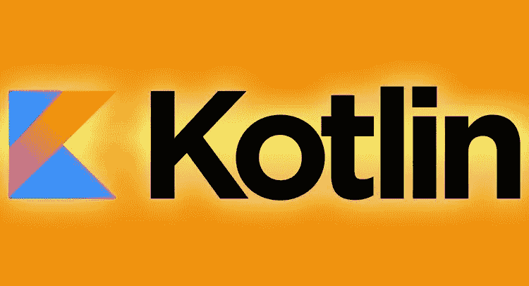
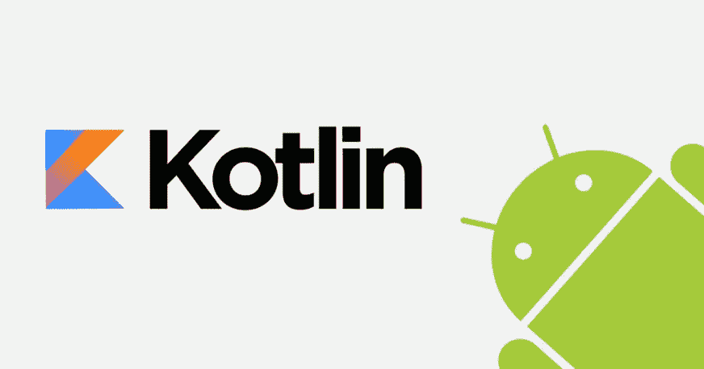
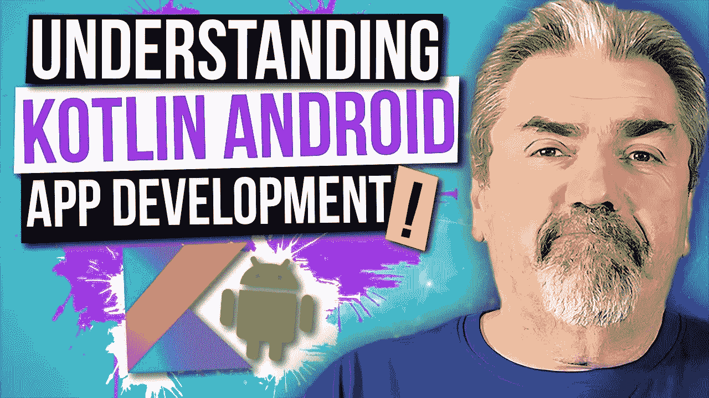

# 2023 年 Java 和 Android 开发者学习 Kotlin 的 6 门最佳 Kotlin 课程

> 原文：<https://medium.com/javarevisited/top-5-courses-to-learn-kotlin-in-2020-dfc3fa7706d8?source=collection_archive---------0----------------------->

## 如果你想在 2023 年学习用于 Android 或 Java 开发的 Kotlin，这些是最好的在线课程

大家好，如果你想学习 Kotlin 并寻找最好的在线课程资源，那么你来对地方了。早些时候，我已经分享了 [**最佳免费 Kotlin 课程**](/javarevisited/7-free-courses-to-learn-kotlin-in-2020-327c3872c1e1) 和 [**Android 开发课程**](/javarevisited/top-5-courses-to-learn-android-for-java-programmers-667e03d995b4) ，在这篇文章中，我将为 Java 和 Android 开发人员分享最佳 Kotlin 课程。

如果你不知道 Kotlin，这是一种相对较新的编程语言，它使得在 Android 和 Java 上编程变得很容易。它是 Android 的官方应用程序开发语言，与 Java 100%兼容，消除了 Java 的一些痛点。

自从 Google 宣布 Kotlin 作为 Android 开发的官方语言后，我收到了很多读者的询问，关于 Java 开发人员现在是否应该学习 Kotlin？或者说，从 Android 开发入手，——[Kotlin 和 Java](http://javarevisited.blogspot.sg/2018/02/kotlin-vs-java-which-language-android.html#axzz56FOC13f8) 哪个更好？

我在我的[上一篇文章](https://dzone.com/articles/java-vs-kotlin-which-language-android-developer-sh)中已经回答了这个问题，但是我仍然收到许多关于学习 Kotlin 的询问，以及 Java 开发人员是否应该学习 Kotlin？

好吧，老实说，成为一名**通晓多种语言的程序员，**也就是说，一名懂不止一种编程语言的程序员，是一项重要而卓越的技能。

它不仅拓宽了你的思路，还让你成为一名更好的开发人员——这就是为什么我建议每个 Java 开发人员至少再学习一门 JVM 语言，Kotlin 是一个起点。

Kotlin 现在是 Android 应用程序开发的官方语言。因此，如果你是一名热衷于编写 Android 应用程序的 Java 开发人员，或者想要接触大众以推广你的下一个创业想法，你应该[学习 Kotlin](https://pluralsight.pxf.io/c/1193463/424552/7490?u=https%3A%2F%2Fwww.pluralsight.com%2Fcourses%2Fkotlin-fundamentals) 。

但是，即使你对移动开发不感兴趣，你也可以学习 Kotlin，因为它可以提高你的生产力，同时保持与 Java 100%兼容。

用 Java 用 100 行代码就能完成的事情，用 Kotlin 只用几行就能完成。可以自动生成`getter`、`setter`、`equals`、`hashCode`、`toString`等常用方法；你不需要自己写。

Kotlin 是由 [JetBrains](https://www.jetbrains.com/) ，IntelliJ IDEA 背后的公司创建的，他们创建 Kotlin 是为了减少 Java 样板代码，同时保留函数式编程范式的特性。

但是，他们不可能从头开始用 Kotlin 重写他们所有的 ide，所以他们确保它仍然 100%兼容 Java。如果您不知道这一点，Kotlin 会生成可以在 [JVM](https://pluralsight.pxf.io/c/1193463/424552/7490?u=https%3A%2F%2Fwww.pluralsight.com%2Fcourses%2Funderstanding-java-vm-memory-management) 中运行的字节码。

直到去年，我一直建议 Java 开发人员学习 Scala，因为它有一系列令人印象深刻的函数式编程特性，但是 2023 年不同了。

这是一年来 l **赚科特林**！我预计 Kotlin 将在几年内超越 Java 进行 Android 开发，因为它是 Android 开发的官方语言。

# 2023 年初学者学习 Kotlin 的 5 个最佳 Kolin 课程

在这篇文章中，我将分享一些从零开始学习 Kotlin 的最佳在线课程。

课程分为两类——第一类教授使用 Kotlin 的 Android 开发，第二类教授 Kotlin 编程语言本身。你可以选择最符合你要求的课程。

## [1。面向 Java 开发人员的 kot Lin](https://click.linksynergy.com/fs-bin/click?id=JVFxdTr9V80&subid=0&offerid=562016.1&type=10&tmpid=14538&RD_PARM1=https%3A%2F%2Fwww.udemy.com%2Fkotlin-for-java-developers%2F)

如果你是一名想学习 Kotlin 并提升职业前景的 Java 开发人员，那么这是最适合你的课程。它允许你使用你的 [Java 技能](https://javarevisited.blogspot.com/2017/12/10-things-java-programmers-should-learn.html#axzz53ENLS1RB)来更快地学习 Kotlin。

我强烈建议 Java 开发人员学习 Kotlin，不仅仅是为了 Android 应用程序开发，也是为了他们在不久的将来会用到的一项技能。

*由于 Kotlin 可以在任何 Java 可以工作的地方工作，甚至可以从 Java 代码中调用(反之亦然)，这给* [*Java 开发人员*](https://hackernoon.com/10-tips-to-become-a-rockstar-java-developer-in-2018-d4b13eb27176) *带来了巨大的机会。能够同时使用 Java 和 Kotlin 将给你带来超越其他程序员的巨大优势。*

这是一门有意义的课程，对于有经验的 Java 程序员来说，它有合适的速度和深度。它是专门用来在最短的时间内教会 Java 开发者如何使用 Kotlin 的。

**这里是加入 Kotlin 课程**的链接——面向 Java 开发人员的[kot Lin](https://click.linksynergy.com/fs-bin/click?id=JVFxdTr9V80&subid=0&offerid=562016.1&type=10&tmpid=14538&RD_PARM1=https%3A%2F%2Fwww.udemy.com%2Fkotlin-for-java-developers%2F)

本课程的讲师 Sarah Eldritch 是一名经验丰富的 Java 和 Kotlin 开发人员，这使她有资格在短时间内教你这种强大而令人兴奋的语言。

简而言之，这是 Java 开发人员学习 Kotlin 以及了解 Kotlin 和 Java 之间关键差异的 [**完美课程。我最近在 Udemy 的闪购上花了 9.99 美元买了这个课程，真的很划算。**](https://click.linksynergy.com/fs-bin/click?id=JVFxdTr9V80&subid=0&offerid=562016.1&type=10&tmpid=14538&RD_PARM1=https%3A%2F%2Fwww.udemy.com%2Fkotlin-for-java-developers%2F)

## 2.Kotlin 编程终极指南

这是另一个学习 Koltin 编程语言的很棒的课程，Koltin 编程语言是 2023 年最热门的编程语言之一。根据某些标准，超过 50%的 Android 开发是在科特林进行的，而且是大规模的(在像优步这样的公司)。

在我们的下一门课程[Kotlin 编程终极指南](https://www.educative.io/courses/ultimate-guide-programming-in-kotlin?affiliate_id=5073518643380224)中，您将使用文卡特·苏布拉马年提供的知识、提示和指南，深入研究 kot Lin 这种现代 JVM 语言。这也是基于实用程序员 Kotlin 书的课程之一。

虽然这个基于文本的交互式 Kotlin 课程对于想要学习新技能的 Java 开发人员来说是一个很好的学习选择，但它也适用于任何首席开发人员、架构师或技术经理。它涵盖了所有的基础。

那么你从科特林课程中学到了什么？您将从理解 Java 和 Kotlin 的不同之处开始，更具体地说，Kotlin 是如何从 Java 编程任务中去除大量仪式的。然后，您将学习如何使用函数，以及如何利用集合，这是您在 Kotlin 中将广泛使用的内容。

**这是加入本课程的链接**——[科特林编程终极指南](https://www.educative.io/courses/ultimate-guide-programming-in-kotlin?affiliate_id=5073518643380224)

在这个令人敬畏的交互式 Kotlin 课程的末尾，您将开始学习一些重要的概念，如 lambdas、递归和记忆化(非常适合优化程序)以及异步编程。

在最后一节中，您将学习所有知识并构建一个 Android 应用程序。这将是一个伟大的除了你的投资组合和东西，你可以炫耀给你的朋友。

顺便说一下，你可以单独参加这个课程，或者你可以参加 [**教育订阅**](https://www.educative.io/subscription?affiliate_id=5073518643380224) (推荐)来获得他们的 250 多个高质量、基于文本的交互式课程，以学习编码面试、软件开发和技术的关键技能。

<https://www.educative.io/subscription?affiliate_id=5073518643380224>  

## [3。完整的 Kotlin 开发者课程](https://click.linksynergy.com/fs-bin/click?id=JVFxdTr9V80&subid=0&offerid=562016.1&type=10&tmpid=14538&RD_PARM1=https%3A%2F%2Fwww.udemy.com%2Fthe-complete-kotlin-developer-course-java%2F)

这个课程是两全其美的。它不仅会教你 Kotlin 编程语言，还会教你如何使用 Kotlin 开发 Android 应用程序。

您将学习 Kotlin 中的变量、字符串和其他数据类型，以及基本的编程结构，如条件、for 循环、[映射](http://www.java67.com/2015/01/how-to-sort-hashmap-in-java-based-on.html)、[函数](https://javarevisited.blogspot.sg/2018/01/what-is-functional-interface-in-java-8.html)、类、空值等。

这个 Koltin 开发课程是由 Udemy 上最好的两位讲师 Rob Percival 和 Nick Walter 创建的。您还将学习*kot Lin 和 Java 如何相互关联*。

简而言之，这是一门学习 Kotlin 基础知识及其在开发 Android 应用程序中的实际应用的好课程。接下来，您应该使用 Kotlin 而不是 Java，并从 Kotlin 创建 [JavaScript](https://javarevisited.blogspot.com/2018/04/top-5-java-frameworks-to-learn-in-2018_27.html#axzz5DmwFLA1K) 代码。

**这里是加入这个 Kotlin 课程的链接**——[完整的 Kotlin 开发者课程](https://click.linksynergy.com/fs-bin/click?id=JVFxdTr9V80&subid=0&offerid=562016.1&type=10&tmpid=14538&RD_PARM1=https%3A%2F%2Fwww.udemy.com%2Fthe-complete-kotlin-developer-course-java%2F)

## [4。Kotlin 初学者:用 Kotlin 学习编程](https://click.linksynergy.com/fs-bin/click?id=JVFxdTr9V80&subid=0&offerid=562016.1&type=10&tmpid=14538&RD_PARM1=https%3A%2F%2Fwww.udemy.com%2Fkotlin-course%2F)

这是从头开始学习 Kotlin 并理解面向对象和 Android 应用程序开发的惯用 Kotlin 的理想课程。

本课程将教你用 Kotlin right 编程，从基础开始，这使得本课程非常适合初学者。

> *您将在几个编码挑战中把学到的东西付诸实践。因此，最终，您将能够在 Kotlin 中创建自己的应用程序。*

如果你是一个 Android 开发者，你可以通过这个课程来快速掌握这种令人敬畏的语言。 [Kotlin](https://kotlinlang.org/) 将允许你维护一个更干净、更有表现力的代码库，使用甚至超越 [Java 8](https://javarevisited.blogspot.com/2018/08/top-5-free-java-8-and-9-courses-for-programmers.html) 的概念，并为 [Android](http://javarevisited.blogspot.sg/2017/12/top-5-android-online-training-courses-for-Java-developers.html) 编写更健壮的应用。

**这里是加入 Kotlin 课程的链接**——[kot Lin 初级课程](https://click.linksynergy.com/fs-bin/click?id=JVFxdTr9V80&subid=0&offerid=562016.1&type=10&tmpid=14538&RD_PARM1=https%3A%2F%2Fwww.udemy.com%2Fkotlin-course%2F)

## [5。Android 版科特林:从初级到高级](https://click.linksynergy.com/fs-bin/click?id=JVFxdTr9V80&subid=0&offerid=562016.1&type=10&tmpid=14538&RD_PARM1=https%3A%2F%2Fwww.udemy.com%2Fdevslopes-android-kotlin%2F)

这是 Kotlin 上最全面的 Android 应用程序开发课程之一。包含超过 100 个讲座，你将通过 Kotlin 学习几乎所有关于 Android 开发的知识。

无论你是一名 Java 开发人员还是没有 Android 经验，这门课程都会教你如何使用 Kotlin 开发应用程序。

该课程最棒的部分是，它不仅教你 Kotlin 编程语言的理论和基础，还教你关于使用 Kotlin 开发、使用 interface builder、所有 SDK 以及构建应用程序实际需要的工具的一切。

**这里是加入 kotlin 课程的链接**——[kot Lin for Android:初级到高级](https://click.linksynergy.com/fs-bin/click?id=JVFxdTr9V80&subid=0&offerid=562016.1&type=10&tmpid=14538&RD_PARM1=https%3A%2F%2Fwww.udemy.com%2Fdevslopes-android-kotlin%2F)

你将开发现实生活中的项目，这是学习新的编程语言或技术的最好方式。

<http://www.java67.com/2017/12/10-ways-to-learn-new-technology-programming-language-or-framework.html>  

## [6。使用 Android Oreo 的 Android Kotlin 开发大师班](https://click.linksynergy.com/fs-bin/click?id=JVFxdTr9V80&subid=0&offerid=562016.1&type=10&tmpid=14538&RD_PARM1=https%3A%2F%2Fwww.udemy.com%2Fandroid-oreo-kotlin-app-masterclass%2F)

Kotlin 是一种用于 Android 开发的表达性强、简洁、功能强大的开发语言，它很有可能在 Android 上超越 Java，这对于所有想做应用程序开发的程序员来说都很重要。

这是一个关于使用 Kotlin 进行 Android 开发的 [**完整的大师课程**](https://click.linksynergy.com/fs-bin/click?id=JVFxdTr9V80&subid=0&offerid=562016.1&type=10&tmpid=14538&RD_PARM1=https%3A%2F%2Fwww.udemy.com%2Fandroid-oreo-kotlin-app-masterclass%2F) ，教你使用这种强大的编程语言有效编写 [Android 代码](http://javarevisited.blogspot.sg/2013/06/introduction-of-how-android-works-Java-programmers.html#axzz56FOC13f8)所需的一切。

> *如果你想在 Android 应用开发领域做出一番事业，那么 Kotlin 对你来说是必不可少的。*

你必须尽快学习科特林，这门课是个很好的开始。

**这里是加入这个最好的 kotlin 课程的链接**——[使用 Android Oreo 的 Android Kotlin 开发大师班](https://click.linksynergy.com/fs-bin/click?id=JVFxdTr9V80&subid=0&offerid=562016.1&type=10&tmpid=14538&RD_PARM1=https%3A%2F%2Fwww.udemy.com%2Fandroid-oreo-kotlin-app-masterclass%2F)

以上是 2023 年学习科特林的一些最好的课程。我已经说过，在谷歌宣布 Kotlin 作为 [Android 开发](http://bit.ly/2zM7EIR)的官方语言之后，对 Kotlin 开发者的需求肯定会上升，而这正是学习 Kotlin 和挖掘需求的恰当时机。

对于 Java 开发人员来说，这是一个双赢的局面，因为 Kotlin 简洁而强大的语法不仅让您有机会参与 Android 开发，还提高了您的工作效率。

其他 **Java 文章**你可能喜欢探讨:
[2023 年 Java 开发者路线图](https://javarevisited.blogspot.com/2019/10/the-java-developer-roadmap.html)
[10 种工具每个 Java 开发者都要深入学习](https://www.java67.com/2018/04/10-tools-java-developers-should-learn.html)
[深入学习 Spring Boot 的 5 大课程](https://www.java67.com/2018/06/5-best-courses-to-learn-spring-boot-in.html)
[2023 年要学习的 10 种编程语言](http://www.java67.com/2017/12/10-programming-languages-to-learn-in.html)
[2023 年 Java 开发者应该阅读的 10 本书](http://www.java67.com/2018/02/10-books-java-developers-should-read-in.html)
[Java 和 Web 开发者应该学习的 10 种框架【T19](http://javarevisited.blogspot.sg/2018/01/10-frameworks-java-and-web-developers-should-learn.html)
[我最喜欢的深入学习 Java 的免费课程](/javarevisited/10-free-courses-to-learn-java-in-2019-22d1f33a3915)
[深入学习 Spring 框架的前 5 门课程](https://javarevisited.blogspot.com/2018/06/top-6-spring-framework-online-courses-Java-programmers.html)
[Java 开发人员学习 Maven、Jenkins 和 Docker 的 10 门免费课程](/javarevisited/top-10-free-courses-to-learn-maven-jenkins-and-docker-for-java-developers-51fa7a1e66f6)
[Java 程序员学习 Kotlin 官方文档](https://kotlinlang.org/)

## 结束语

谢谢，你坚持到了文章的结尾…祝你的科特林之旅好运！这当然不会很容易，但通过学习这些课程，你离成为一名 [**Kotlin 开发者**](https://javarevisited.blogspot.com/2018/02/5-courses-to-learn-kotlin-programming-java-android.html) **更近了一步。**

如果你喜欢这篇文章，那么请分享给你的朋友和同事，别忘了在 Twitter 上关注 [javinpaul](https://twitter.com/javinpaul) ！和培养基上的 [javinpaul](https://medium.com/u/bb36d8439904?source=post_page-----49e842b8af1a----------------------) 。

**p . s .**——如果你需要一些 Android 开发课程，可以看看这份 [Android 培训课程清单](https://javarevisited.blogspot.com/2017/12/top-5-android-online-training-courses-for-Java-developers.html)开始你的旅程。

</javarevisited/5-free-courses-to-become-an-android-developer-d4d207f53675> 