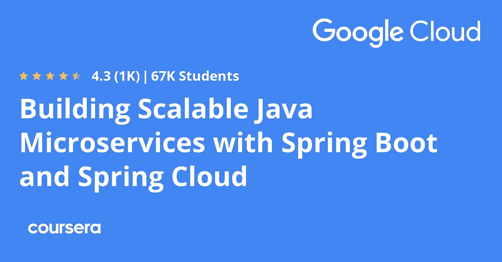
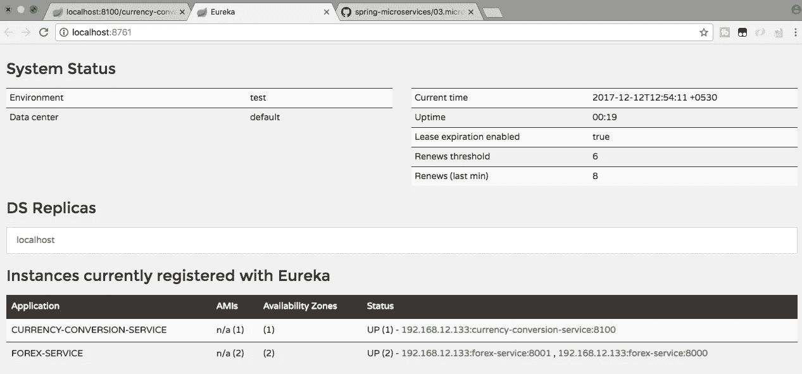
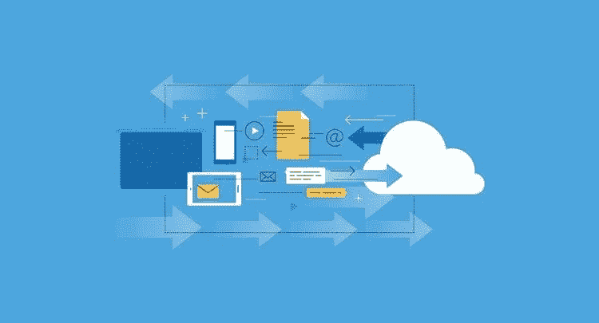
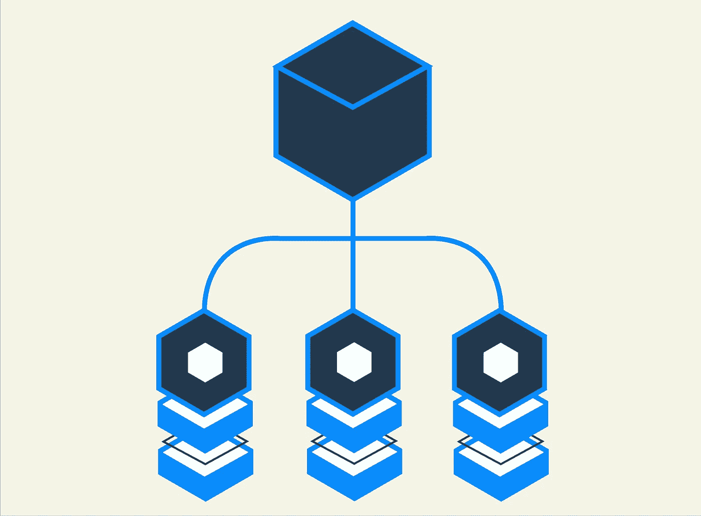

# 2023 年学习 Java 和 Spring 框架微服务的 10 大课程

> 原文：<https://medium.com/javarevisited/top-5-courses-to-learn-microservices-in-java-and-spring-framework-e9fed1ba804d?source=collection_archive---------0----------------------->

微服务是软件开发领域的新术语，尤其是在 Java 方面，但它已经被实践了很长时间，尤其是以 RESTful web 服务的形式**。**

**微服务的想法很简单，将一个包含从 UI 到服务层到数据库所有内容的大型整体应用程序分解成松散耦合且可以独立工作的小块应用程序。**

**例如，在像[优步](https://medium.com/u/b97b1b381b5a?source=post_page-----ff601a57d69----------------------)这样的公司，你可以有几个应用程序提供不同的服务，例如发现司机何时在线或乘客何时搜索出租车、查找路线、交通和处理支付。这些小应用被称为 [**微服务**](https://javarevisited.blogspot.com/2021/07/top-java-frameworks-for-Microservice-development.html) 。**

**在 Java 世界中， [Spring Framework](http://www.java67.com/2017/11/top-5-free-core-spring-mvc-courses-learn-online.html) 提供了几个开发微服务的工具和框架，例如 Spring Boot 和 Spring Cloud，在本文中，我将分享几个很好的课程，你可以用它们来学习如何使用 Spring Framework 开发微服务。**

**这些课程不仅教你微服务架构的基础和使用微服务的利弊，还教你如何使用 [Spring Boot](http://www.java67.com/2017/11/top-5-free-core-spring-mvc-courses-learn-online.html) 和 [Spring Cloud](http://javarevisited.blogspot.sg/2018/04/top-5-spring-cloud-courses-for-java.html#axzz5DbV6r2Ll) 来实现它们。**

**您还将了解整体是如何协同工作的，以及在现实世界中您将面临哪些挑战。**

**希望你对 Java 和 Spring 有很好的了解，但是如果你不知道 Spring Boot 和 Spring Cloud 也没关系，这些课程中的大部分都提供了对 Spring Boot 和 Spring Cloud 的概述，你可以自己去探索。**

# **学习 Spring Boot 和 Spring Cloud 微服务的 9 门最佳在线课程**

**这里是我列出的一些学习如何使用 Spring Boot 和 Spring 云框架开发微服务的最佳课程。**

**如果你不知道，Spring Boot 采用了原始 Spring 框架的思想，例如[依赖注入](http://javarevisited.blogspot.sg/2015/06/difference-between-dependency-injection.html)和[控制反转](http://javarevisited.blogspot.sg/2012/12/inversion-of-control-dependency-injection-design-pattern-spring-example-tutorial.html)，但是通过嵌入必要的库和做出聪明的假设，消除了初始设置的障碍。它使得用 Spring 框架开发 Java 就像用 [main()方法](http://www.java67.com/2014/02/can-you-run-java-program-without-main-method.html)编写 Java 类一样简单。**

**Spring Cloud 构建于 Spring Boot 之上，提供了几个开箱即用的特性来开发微服务。**

**它还提供工具来快速构建分布式系统中的一些常见模式，如配置管理、服务发现、断路器、智能路由、一次性令牌、微代理、控制总线、全局锁、分布式会话和集群状态。**

**通过使用 [Spring Cloud](https://javarevisited.blogspot.com/2018/01/how-to-learn-spring-core-spring-mvc-boot-security-framework.html) ，开发者可以快速建立实现这些模式的服务和应用。反正下面是我列出的**学习使用 Spring 框架进行微服务开发的前五门课程** (Spring Boot 和 Spring Cloud):**

## **1.[采用 Spring Cloud 的微服务](https://click.linksynergy.com/fs-bin/click?id=JVFxdTr9V80&subid=0&offerid=323058.1&type=10&tmpid=14538&RD_PARM1=https%3A%2F%2Fwww.udemy.com%2Fmicroservices-with-spring-cloud%2F)**

**这是用春云学习微服务的绝佳课程。它深入探讨了微服务架构风格，以及如何用 Spring 技术实现它，主要是 [Spring Cloud](https://javarevisited.blogspot.com/2018/04/top-5-spring-cloud-courses-for-java.html) 。**

**本课程对微服务架构风格这一主题进行了很好的、扎实的介绍，并将其与通过 Spring Cloud 练习获得的实践经验相结合。**

**一路上，本课程提供了对 [Spring Boot](http://www.java67.com/2018/02/3-books-and-courses-to-learn-restful-web-services-with-spring.html) 和 [Spring Data](http://bit.ly/2lgghCc) 的简要介绍，如果你还没有沉浸在这些技术中的话，足以让你熟悉它们。**

**本课程还提供了练习，让学生亲身体验如何使用 Spring Cloud 的各种组件。**

**简而言之，这是一个利用不同的 Spring 云技术(如 Config Server 和 Bus、Eureka、Ribbon、Feign 和 Hystrix)构建微服务应用程序的绝佳课程。**

**以下是加入本课程的链接— [***微服务与春云***](https://click.linksynergy.com/fs-bin/click?id=JVFxdTr9V80&subid=0&offerid=323058.1&type=10&tmpid=14538&RD_PARM1=https%3A%2F%2Fwww.udemy.com%2Fmicroservices-with-spring-cloud%2F)**

****

## **[2。掌握 Spring Boot 和春云的微服务](https://click.linksynergy.com/fs-bin/click?id=JVFxdTr9V80&subid=0&offerid=323058.1&type=10&tmpid=14538&RD_PARM1=https%3A%2F%2Fwww.udemy.com%2Fmicroservices-with-spring-boot-and-spring-cloud%2F)**

**这是用 Spring 框架学习微服务的又一个牛逼课程。课程从解释如何使用 Spring 构建 RESTful web 服务开始，这是构建基于微服务的应用的正确的第一步。**

**在课程的前半部分，您将学习如何使用 Spring Boot 开发和设计 RESTful web 服务，并探索一些高级的 REST web 服务概念，如版本控制、错误处理、验证、HATEOAS 和过滤。在课程的后半部分，你将学习如何用 [Spring Boot](http://www.java67.com/2018/06/top-15-spring-boot-interview-questions-answers-java-jee-programmers.html) 和[春云](https://javarevisited.blogspot.com/2018/02/top-5-spring-microservices-courses-with-spring-boot-and-spring-cloud.html)开发微服务。**

**以下是加入本课程的链接— [***大师微服务与 Spring Boot 和春云***](https://click.linksynergy.com/fs-bin/click?id=JVFxdTr9V80&subid=0&offerid=323058.1&type=10&tmpid=14538&RD_PARM1=https%3A%2F%2Fwww.udemy.com%2Fmicroservices-with-spring-boot-and-spring-cloud%2F)**

****

**您将首先使用 Spring Cloud Config Server 设置一个集中的微服务配置，然后学习实现客户端负载平衡(Ribbon)、动态伸缩(Eureka Naming Server)和 API 网关(Zuul)。您还将学习如何使用 Spring Cloud Sleuth 和 Zipkin 实现微服务的分布式跟踪。**

**简而言之，这是一门很棒的课程，教你如何用 Spring Boot 和 Spring Cloud 构建 Restful Web 服务和微服务。**

## **3.[带弹簧课程的完整微服务](https://click.linksynergy.com/fs-bin/click?id=JVFxdTr9V80&subid=0&offerid=323058.1&type=10&tmpid=14538&RD_PARM1=https%3A%2F%2Fwww.udemy.com%2Fmicroservices-spring-course%2F)**

**这是 Udemy 最新推出的用 Spring 学习微服务的课程之一。本课程首先解释什么是微服务架构及其优势。**

**然后深入探讨如何使用 Spring Boot 和 Spring 云框架开发微服务的细节。**

**然后，它继续探索微服务的一些更实际的方面，例如，使用 [Spring Security](http://www.java67.com/2017/12/top-5-spring-security-online-training-courses.html) 保护微服务，处理微服务的日志记录和监控，如何使它们更具弹性和可扩展性，以及最后，如何部署和测试微服务。**

**在学习使用 Spring 的微服务时，您还将深入了解 Spring 5 中最新包含的[反应流，并学习如何在组件间混合数据管理策略。](http://bit.ly/2ylC68g)**

**简而言之，这是一门非常棒的课程，它将教你如何从零开始轻松构建和实现可扩展的微服务。**

****

## **4.[用 Spring Boot 和 Spring Cloud 构建可扩展的 Java 微服务](https://coursera.pxf.io/c/3294490/1164545/14726?u=https%3A%2F%2Fwww.coursera.org%2Flearn%2Fgoogle-cloud-java-spring)【Coursera】**

**这是 Coursera 上的另一个很好的课程，学习在云平台如 GCP 或谷歌云平台中构建和部署微服务。**

**如果你知道，微服务架构是公共云的理想选择，其重点是利用按需资源进行弹性扩展，这就是越来越多的公司转向[云](https://javarevisited.blogspot.com/2019/07/top-5-online-courses-to-learn-cloud-computing-aws.html)和[微服务](https://javarevisited.blogspot.com/2018/02/top-5-spring-microservices-courses-with-spring-boot-and-spring-cloud.html)的原因。**

**本课程由 Google Cloud Training 提供，在本课程中，您将学习如何在 Google Cloud 平台上使用 Spring Boot 和 Spring Cloud 构建 Java 应用程序。**

**您将使用云运行时配置和 Spring 云配置来管理应用程序的配置，通过云发布/订阅和 Spring 集成来发送和接收消息。**

**如果你需要学习微服务的免费课程，那么我建议你查看 Coursera 上的这个 [**使用 Spring Boot 和 Spring Cloud 构建可扩展的 Java 微服务**](https://coursera.pxf.io/c/3294490/1164545/14726?u=https%3A%2F%2Fwww.coursera.org%2Flearn%2Fgoogle-cloud-java-spring) 课程，它由 Google Cloud 提供，你可以免费访问，这意味着学习是免费的，但你需要支付认证、测验和评估费用。**

****

**而且，如果你觉得 Coursera 课程有用，那么，你也可以加入 Coursera Plus**，这是 Coursera 的一个订阅计划，让你无限制地访问他们最受欢迎的课程、专业、专业证书和指导项目。它每年花费大约 399 美元，但是它完全物有所值，因为你可以获得无限的证书。****

**** [## Coursera Plus |无限制访问 7，000 多门在线课程

### 用 Coursera Plus 投资你的职业目标。无限制访问 90%以上的课程、项目…

coursera.pxf.io](https://coursera.pxf.io/c/3294490/1164545/14726?u=https%3A%2F%2Fwww.coursera.org%2Fcourseraplus)**** 

## ****5.[微服务原理和概念介绍](https://www.educative.io/courses/introduction-microservice-principles-concepts?affiliate_id=5073518643380224)****

****这是 Eberhard Wolff 关于微服务架构、原则和概念的另一个很好的入门课程，它为包括亚马逊、网飞、Spotify 和优步在内的许多公司奠定了基础。****

****在本课程中，您将深入了解微服务，并理解支持和反对微服务的理由。除此之外，您还将了解微观和宏观架构、迁移旧系统的策略、 [Docker](/javarevisited/top-15-online-courses-to-learn-docker-kubernetes-and-aws-for-fullstack-developers-and-devops-d8cc4f16e773) 在该架构中的角色，以及实现微服务的技术。****

****完成本课程后，您将更好地掌握在贵公司实施微服务所需的信息。****

****以下是加入本课程的链接— [**微服务原理和概念介绍**](https://www.educative.io/courses/introduction-microservice-principles-concepts?affiliate_id=5073518643380224)****

********

## ****6.[Spring Boot 和春云的微服务](https://click.linksynergy.com/fs-bin/click?id=JVFxdTr9V80&subid=0&offerid=323058.1&type=10&tmpid=14538&RD_PARM1=https%3A%2F%2Fwww.udemy.com%2Fexploring-spring-boot-and-spring-cloud-microservices%2F)【Udemy】****

****这是另一个通过 Spring Boot 和 Spring cloud 学习微服务开发的实用课程，非常适合任何想要学习基于 Spring Boot 和 Spring cloud 的微服务开发的人。****

****本课程涵盖了几个主题，包括 [Spring 框架依赖注入](http://bit.ly/2yi8E2Z)、面向方面编程、基于 Spring Boot 的微服务开发，这将帮助你了解 Spring 框架和 Spring Boot，如果你以前不熟悉它们的话。****

****对于知道 [Spring](http://javarevisited.blogspot.sg/2018/04/5-spring-framework-books-experienced-Java-developers-2018.html) 但很久没有使用它的开发人员来说，这也是一个很好的复习。****

********

****本课程还提供了 Spring Cloud 网飞库堆栈的扎实介绍和知识，包括****

****1.Spring 云服务发现****

****2.使用 GitHub 的 Spring 云配置服务****

****3.Spring 云配置客户端****

****4.春云恶化客户端假装****

****5.弹簧云断路器 Hystrix****

****该课程使用一个定制贷款应用领域作为探索微服务开发的领域，你们中的许多人很容易与之相关。这使得学习更加容易和实用。****

**** [## Spring Boot 和 Spring Cloud 的微服务

### 使用 Eureka、Feign、配置报告、配置服务、Hystrix Plus 依赖注入和 AOP 深潜的微服务

udemy.com](https://click.linksynergy.com/fs-bin/click?id=JVFxdTr9V80&subid=0&offerid=323058.1&type=10&tmpid=14538&RD_PARM1=https%3A%2F%2Fwww.udemy.com%2Fexploring-spring-boot-and-spring-cloud-microservices%2F)**** 

## ****7.[跟 Spring Boot 和春云学微服务](https://click.linksynergy.com/fs-bin/click?id=JVFxdTr9V80&subid=0&offerid=323058.1&type=10&tmpid=14538&RD_PARM1=https%3A%2F%2Fwww.udemy.com%2Flearn-microservices-with-spring-boot-and-spring-cloud%2F) [Udemy]****

****这是另一个使用 Spring 框架学习微服务的综合课程。它为 Spring 和微服务开发提供了实践指南。****

****本课程分为 9 章。在前两章中，您将学习一般理论，以及如何使用和 [Spring 框架](http://www.java67.com/2018/02/10-books-java-developers-should-read-in.html)进行一般开发。****

****第 3 章到第 8 章解释了基本的微服务模式，并为解决基于微服务的架构中出现的挑战提供了指导。每章包含理论和编码，这使得它更容易理解和遵循。****

****最后，你将在最后一章学习 [Docker](http://www.java67.com/2018/02/5-free-docker-courses-for-java-and-DevOps-engineers.html) 和 [AWS](http://www.java67.com/2018/05/top-5-amazon-web-services-or-aws-courses-to-learn-online.html) 。您将学习如何为每个服务构建映像，在 AWS 中设置一个实例，并将一些映像推送到 AWS。****

******以下是加入本课程的链接**——[和 Spring Boot、春云一起学习微服务](https://click.linksynergy.com/fs-bin/click?id=JVFxdTr9V80&subid=0&offerid=323058.1&type=10&tmpid=14538&RD_PARM1=https%3A%2F%2Fwww.udemy.com%2Flearn-microservices-with-spring-boot-and-spring-cloud%2F)****

********

## ****8.[微服务软件架构:模式和技术](https://click.linksynergy.com/deeplink?id=JVFxdTr9V80&mid=39197&murl=https%3A%2F%2Fwww.udemy.com%2Fcourse%2Fmicroservices-software-architecture-patterns-and-techniques%2F)****

****这是少有的学习和了解微服务背后的解决方案架构的课程之一。在[这门课](https://click.linksynergy.com/deeplink?id=JVFxdTr9V80&mid=39197&murl=https%3A%2F%2Fwww.udemy.com%2Fcourse%2Fmicroservices-software-architecture-patterns-and-techniques%2F)中，你将详细学习软件架构模式和技术，以开发健壮且可扩展的微服务****

****我们将介绍企业架构中所需的技术和设计模式，包括:****

*   ****事件来源模式****
*   ****传奇模式****
*   ****微服务注册****
*   ****断路器模式****
*   ****API 成分****
*   ****两阶段提交****
*   ****微服务发现****

****本课程围绕解释不同技术和架构模式的视频教程和(可选)帮助确保您理解我们所学内容的作业进行组织****

****以下是加入本课程的链接— [**微服务软件架构:模式和技术**](https://click.linksynergy.com/deeplink?id=JVFxdTr9V80&mid=39197&murl=https%3A%2F%2Fwww.udemy.com%2Fcourse%2Fmicroservices-software-architecture-patterns-and-techniques%2F)****

********

## ****9.[微服务架构:实际实现](https://www.educative.io/courses/microservice-architecture-practical-implementation?affiliate_id=5073518643380224)【教育性】****

****这是 Eberhard Wolff 在 Educative 上的另一个关于微服务的精彩课程。这是一门关于微服务的高级课程，将教你实施微服务应用所需的一切知识。****

****它侧重于现实世界实现的本质细节。您将了解可用于实施微服务的技术堆栈的配方，以及每种技术的优缺点。****

****以下是加入本课程的链接— [**微服务软件架构:模式和技术**](https://click.linksynergy.com/deeplink?id=JVFxdTr9V80&mid=39197&murl=https%3A%2F%2Fwww.udemy.com%2Fcourse%2Fmicroservices-software-architecture-patterns-and-techniques%2F)****

********

****顺便说一句，如果你发现教育平台和他们的搜索课程，如搜索系统设计面试，那么考虑获得 [**教育无限**](https://www.educative.io/subscription?affiliate_id=5073518643380224) 订阅，每月只需 14.9 美元即可访问他们的 300 多门课程。非常划算，非常适合准备编码面试。****

**** [## 教育无限:保持领先

### 我们听到了您的反馈。你现在只需支付一次费用，就可以获得 Educative 上的所有课程。

www.educative.io](https://www.educative.io/subscription?affiliate_id=5073518643380224) 

以上是 Spring Boot 和 Spring Cloud 学习微服务的一些**最佳课程。微服务架构是软件开发的未来，每个程序员都应该学习它。**

随着越来越多的公司转向微服务架构，这是一项需要掌握的重要技能，可以帮助你找到下一份薪水和福利更高的工作。

您可能想探索的其他**编程资源文章**

[2023 年 Java 开发者路线图](https://javarevisited.blogspot.com/2019/10/the-java-developer-roadmap.html#123)
[面向 Java 开发者的 10 门高级 Spring Boot 课程](/javarevisited/10-advanced-spring-boot-courses-for-experienced-java-developers-5e57606816bd)
[2023 年 Java 程序员应该学习的 10 门框架](https://javarevisited.blogspot.com/2018/04/top-5-java-frameworks-to-learn-in-2018_27.html)
[面向 Java 开发者的 5 门免费 Spring 框架课程](http://www.java67.com/2017/11/top-5-free-core-spring-mvc-courses-learn-online.html)
[2023 年学习 Web 开发的 5 门课程](http://javarevisited.blogspot.sg/2018/02/top-5-online-courses-to-learn-web-development.html#axzz57wed1PWd)
[面向资深开发者的 10 门高级 Spring Boot 课程
s](/javarevisited/10-advanced-spring-boot-courses-for-experienced-java-developers-5e57606816bd?source=collection_home---4------0-----------------------)[2023 年学习 React Native 的 5 门课程](http://javarevisited.blogspot.sg/2018/02/5-react-native-courses-to-learn-mobile-development-using-JavaScript.html) [面试](http://javarevisited.blogspot.sg/2018/02/5-react-native-courses-to-learn-mobile-development-using-JavaScript.html)
[前 5 名 Selenium with Java Web Driver 课程](http://javarevisited.blogspot.sg/2018/02/top-5-selenium-webdriver-with-java-courses-for-testers.html)
[学习 Linux 中 Shell 脚本的 5 门课程](http://javarevisited.blogspot.sg/2018/02/5-courses-to-learn-shell-scripting-in-linux.html)
[面向全栈开发者的 10 门高级 Java 课程](https://dev.to/javinpaul/top-10-advanced-courses-for-full-stack-java-developers-kop)

感谢您阅读本文。如果你喜欢 Coursera、Udemy、Educative 和 Pluralsight 的这些最佳春季微服务课程，请与你的朋友和同事分享。如果您有任何问题或反馈，请留言。

如果你更喜欢书本而不是网络课程，那么你应该看看我列出的学习 Spring Boot 和春云的最佳书籍。

 [## 2023 年 Java 程序员该学什么？

### 2023 年 Java 程序员可以学习的有用工具、技术、框架和库

medium.com](/javarevisited/what-java-programmers-should-learn-in-2020-648050533c83) 

## 您可能喜欢的其他媒体文章:

 [## 面向 Java 开发人员的 10 个免费 Spring Boot 课程和教程

### 大家好，作为一个 Java 博客的作者和 Java 开发人员，很多人问我关于课程和书籍的问题…

medium.com](/javarevisited/10-free-spring-boot-tutorials-and-courses-for-java-developers-53dfe084587e)  [## 面向有经验的 Java 开发人员的 10 门高级 Spring Boot 课程

### 高级 Spring Boot 课程为有经验的 Java 开发人员学习 Spring Boot 测试，云和容器…

medium.com](/javarevisited/10-advanced-spring-boot-courses-for-experienced-java-developers-5e57606816bd)  [## 我最喜欢的 2023 年学习软件架构的课程——最好的

### 这些是 2023 年学习软件架构并成为解决方案架构师的最佳课程

medium.com](/javarevisited/top-5-courses-to-learn-software-architecture-in-2020-best-of-lot-5d34ebc52e9)****