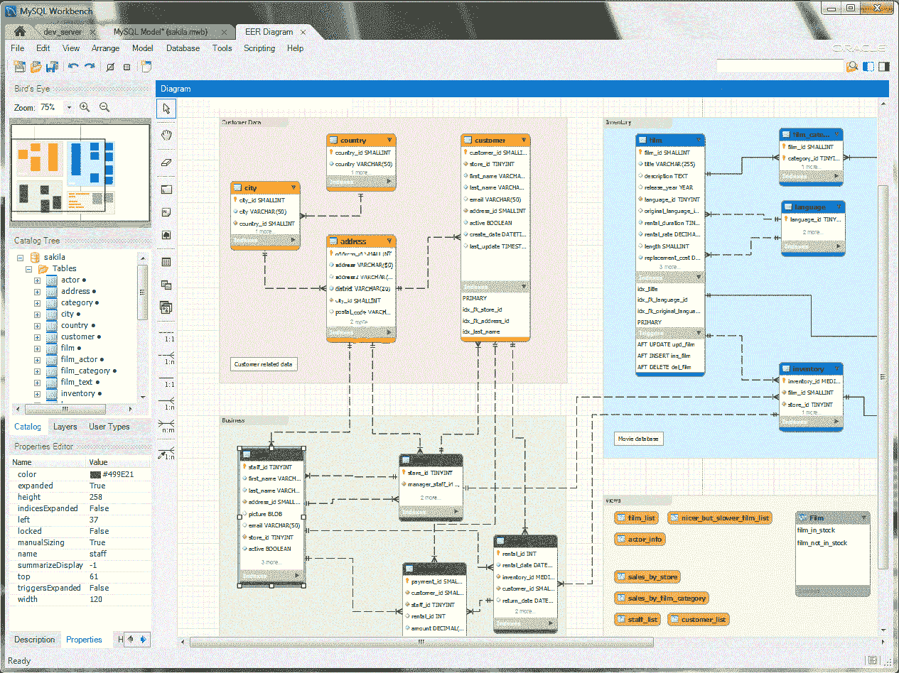
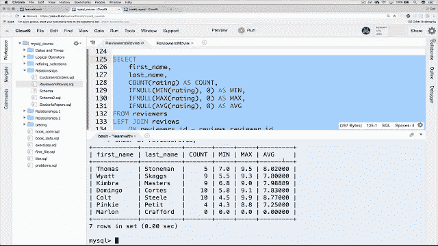
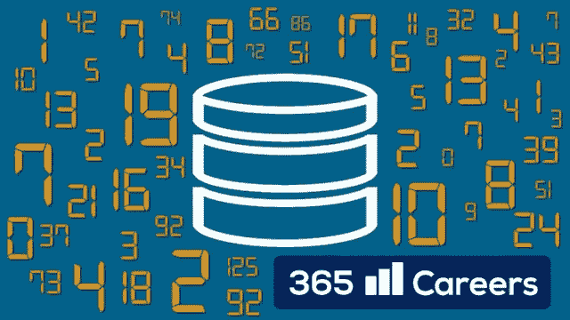
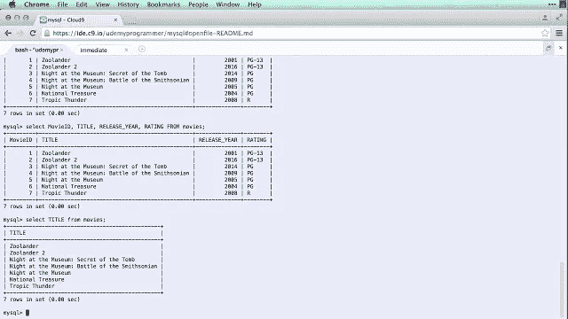

# 2023 年学习 MySQL 数据库的 6 个最佳在线培训课程[更新]

> 原文：<https://medium.com/javarevisited/top-5-courses-to-learn-mysql-in-2020-4ffada70656f?source=collection_archive---------0----------------------->

大家好，如果你对使用 MySQL 数据库学习 SQL 感兴趣，并且在寻找一些很棒的资源，比如书籍、教程和在线课程，那么你来对地方了。

在过去，我已经分享了一些有用的[书籍](http://www.java67.com/2016/09/sql-5-best-books-to-learn-and-master.html)和[教程](https://javarevisited.blogspot.sg/2013/05/difference-between-left-and-right-outer-join-sql-mysql.html)，在这篇文章中，我将谈论一些来自 [Udemy](https://click.linksynergy.com/fs-bin/click?id=JVFxdTr9V80&offerid=323058.9409&type=3&subid=0) 和 [Pluralsight](http://pluralsight.pxf.io/c/1193463/424552/7490?u=https%3A%2F%2Fwww.pluralsight.com%2Flearn) 的**最佳 MySQL 在线课程**，你可以加入这些课程，在你舒适的办公室或家中学习 SQL 和 MySQL。

在过去的几年里，你可能听说过这样的说法:每个人都应该学习编码。编码现在就像阅读、写作和口语技能一样，在当今以信息技术为中心的世界中，它是必备的技能，没有比学习最流行的编程语言 SQL 更好的开始编码的方法了。

SQL 是与数据库对话的语言，从数据库中获得你的答案和见解，你会惊讶地发现，它比像 Python 和 Java 这样的编程语言更受欢迎。

这对于你的技能肯定是一个很好的补充，因为每个应用程序都有一些数据，通过[学习 SQL](https://hackernoon.com/top-5-sql-and-database-courses-to-learn-online-48424533ac61) ，你将自己获得数据相关问题的答案，而不是依赖 DBA、支持人员和其他人。

既然我们知道了**为什么 SQL 如此重要**，那我们就来谈谈 [MySQL](https://www.mysql.com/) 。这是一个流行的免费开源数据库，被成千上万的公司使用，如谷歌、优步、美国宇航局，以及你每天访问的大多数网站。

与甲骨文和 T2 的微软 SQL 服务器一起，MySQL 是第三大最受欢迎的数据库，但与前两者不同的是，它是免费和开源的。学习 MySQL 将极大地提高你的技能，并对你的职业发展大有帮助。

# 6 个最适合初学者的 MySQL 课程和教程

在本文中，我将为初学者和中级开发人员分享一些最棒、最全面、最棒的 MySQL 课程。这些课程受到成千上万学生的信任，可能是 MySQL 市场上最好的课程。

如果你能花几美元( [Udemy 课程](http://javarevisited.blogspot.sg/2018/01/top-10-udemy-courses-for-java-and-web-developers.html)通常花费 10 美元左右)，那么这些可能是开始使用 MySQL 的最佳资源。

## [**1。终极 MySQL 训练营:从 SQL 初学者到专家**](https://click.linksynergy.com/fs-bin/click?id=JVFxdTr9V80&subid=0&offerid=323058.1&type=10&tmpid=14538&RD_PARM1=https%3A%2F%2Fwww.udemy.com%2Fthe-ultimate-mysql-bootcamp-go-from-sql-beginner-to-expert%2F)

这是一门很棒的训练营风格的 MySQL 课程，它将教你关于 SQL、MySQL 和数据库的一切。指导老师是训练营的老师，对教学有极大的热情。

这门课程非常全面，包含了 320 多节课，但别担心，它并不枯燥。教师知道如何教导和吸引学生。

在本课程中，您将了解有关 MySQL 的一切，从安装开始，创建数据库、表格，然后运行 [SQL 查询](http://javarevisited.blogspot.sg/2017/01/running-sql-queries-on-productionlive-databse-tips.html)来检索这些数据，并通过使用聚合函数、字符串函数等来询问复杂的问题。

该课程还专门有一个部分涵盖了复杂的主题，如[连接](https://javarevisited.blogspot.sg/2016/03/how-to-delete-from-table-using-join-in-SQL-Server.html)，并包含数百个 [SQL 查询练习](https://javarevisited.blogspot.sg/2017/02/top-6-sql-query-interview-questions-and-answers.html)，让您能够应用您的知识，真正掌握所学的概念。

**这里是加入本课程的链接**—[MySQL 终极训练营:从 SQL 初学者到专家](https://click.linksynergy.com/fs-bin/click?id=JVFxdTr9V80&subid=0&offerid=323058.1&type=10&tmpid=14538&RD_PARM1=https%3A%2F%2Fwww.udemy.com%2Fthe-ultimate-mysql-bootcamp-go-from-sql-beginner-to-expert%2F)

这门课程的另一个好处是，你可以使用 Instagram 克隆数据模型，它没有真正的 Instagram 复杂，但可以让你处理有趣的事情，如照片、朋友、关注者、喜欢、分享、标签等。

由于我们大多数人都使用 Instagram 和脸书，并熟悉这些概念，当你使用 SQL 查询这些东西时，你会爱上它。这确实有助于理解你之前学到的概念。

这门课我怎么说都不为过。我最近在 Udemy 的一次闪购中买了这个课程。这是一门非常棒的课程，有很棒的老师，很棒的内容，很棒的画面和声音质量。

这是真正专业的在线课程之一，为如何组织和记录在线课程树立了榜样。

## [**2。MySQL、SQL 和存储过程从初级到高级**](https://click.linksynergy.com/fs-bin/click?id=JVFxdTr9V80&subid=0&offerid=323058.1&type=10&tmpid=14538&RD_PARM1=https%3A%2F%2Fwww.udemy.com%2Fmysql-and-sql-from-beginner-to-advanced%2F)

这个 MySQL 课程是初级和高级概念的完美结合。如果你有一些 SQL 经验，它不会太基础，不会让你厌烦，但也用简单的单词解释高级概念。

课程也很动手。讲师使用实时编码来演示和教授概念。你会经常发现他[编写 SQL 查询](http://javarevisited.blogspot.sg/2017/01/a-better-way-to-write-sql-queries.html)，然后向他们解释它的作用，这是一个很好的教学方法。

就教学大纲而言，该课程也非常全面，涵盖了从数据库创建、读取和更新数据等内容，还包括触发器、视图和存储过程。

**这里是加入本课程的链接**——[从初级到高级的 MySQL、SQL 和存储过程](https://click.linksynergy.com/fs-bin/click?id=JVFxdTr9V80&subid=0&offerid=323058.1&type=10&tmpid=14538&RD_PARM1=https%3A%2F%2Fwww.udemy.com%2Fmysql-and-sql-from-beginner-to-advanced%2F)

它还解释了事务和隔离级别，以及数据库用户和安全性。

我强烈推荐本课程给任何完全不熟悉 SQL 的人，或者对 SQL 有一点了解并希望将他们的知识提升到一个新水平的人。

## [**3。SQL —用于数据分析和商业智能的 MySQL**](https://click.linksynergy.com/fs-bin/click?id=JVFxdTr9V80&subid=0&offerid=323058.1&type=10&tmpid=14538&RD_PARM1=https%3A%2F%2Fwww.udemy.com%2Fsql-mysql-for-data-analytics-and-business-intelligence%2F)

这是一门不同类型的 MySQL 课程，而大多数 MySQL 在线课程侧重于 web 开发模型，这门课程侧重于数据分析和商业智能，这是一个非常重要的主题。

我们大多数人使用 SQL 来查询数据，我的意思是，找到问题的答案并获得一些洞察力，这正是本课程的帮助所在。

在本课程中，您将全程使用复杂的真实数据库，并了解数据分析工具和 MySQL WorkBench。

**以下是参加本课程的链接** — [SQL — MySQL 数据分析和商业智能](https://click.linksynergy.com/fs-bin/click?id=JVFxdTr9V80&subid=0&offerid=323058.1&type=10&tmpid=14538&RD_PARM1=https%3A%2F%2Fwww.udemy.com%2Fsql-mysql-for-data-analytics-and-business-intelligence%2F)

顺便说一句，这个课程不像前两个课程那么全面，但是正如我所说的，它完全侧重于使用 MySQL 的数据分析和商业智能。

如果您想[提高您的 SQL 查询技能](http://www.java67.com/2013/04/10-frequently-asked-sql-query-interview-questions-answers-database.html)并想在利用大数据解决任务的同时发展业务直觉，那么本课程适合您。

## [**4。皮纳尔·戴夫的 MySQL 基础**](https://pluralsight.pxf.io/c/1193463/424552/7490?u=https%3A%2F%2Fwww.pluralsight.com%2Fcourses%2Fmysql-fundamentals-part1)

这是 [Pluralsight](http://pluralsight.pxf.io/c/1193463/424552/7490?u=https%3A%2F%2Fwww.pluralsight.com%2Flearn) 上最受欢迎的 MySQL 课程之一，由一位受欢迎的讲师 [Pinal Dave](https://medium.com/u/ecab27a505d1?source=post_page-----4ffada70656f--------------------------------) 授课，他也是一位著名的 SQL 博客作者，经常撰写 SQL 相关的文章。

本课程涵盖了 MySQL 数据库的基础知识，包括如何安装 MySQL 数据库以及如何编写基本的数据检索和数据修改查询。

这个课程的好处在于它教你基本的 MySQL 工具，比如使用 MySQL 命令行工具和 MySQL Workbench。它还涉及到关系数据库和数据库设计的基本原理。总的来说，这是一门学习 MySQL 的好课程。

**这是加入本课程的链接** — [皮纳尔·戴夫的 MySQL 基础](https://pluralsight.pxf.io/c/1193463/424552/7490?u=https%3A%2F%2Fwww.pluralsight.com%2Fcourses%2Fmysql-fundamentals-part1)

顺便说一句，你需要一个 [Pluralsight 会员](http://pluralsight.pxf.io/c/1193463/424552/7490?u=https%3A%2F%2Fwww.pluralsight.com%2Flearn)才能观看这个课程，这个课程每月花费大约 29 美元，但是也可以访问 [Pluralsight](https://medium.com/u/50a6c7ef7431?source=post_page-----4ffada70656f--------------------------------) 上的 5000 多个课程。

你也可以通过注册一个 [**的 10 天免费试听来免费观看这个课程，它允许你免费观看 200 分钟。**](https://pluralsight.pxf.io/c/1193463/424552/7490?u=https%3A%2F%2Fwww.pluralsight.com)

## [5。完整的 MySQL 开发人员课程](https://click.linksynergy.com/fs-bin/click?id=JVFxdTr9V80&subid=0&offerid=323058.1&type=10&tmpid=14538&RD_PARM1=https%3A%2F%2Fwww.udemy.com%2Fthe-complete-mysql-developer-course%2F)

从 web 开发的角度来看，这是另一个非常好的初学者课程，从 SQL 和 T2 数据库开始。

本课程从创建数据库和表等基础开始，然后转向更高级的主题，如使用多个数据库和[复杂连接](https://javarevisited.blogspot.com/2012/11/how-to-join-three-tables-in-sql-query-mysql-sqlserver.html)。

本课程还教你如何使用 MySQL 和 PHP 构建一个 web 应用程序。简而言之，从零开始学习 MySQL 的好课程。它不像这个列表中的前两个 MySQL 课程那么全面，但是如果你和老师有共鸣，你可以选择这个。

**这里是加入本课程的链接** — [完整的 MySQL 开发人员课程](https://click.linksynergy.com/fs-bin/click?id=JVFxdTr9V80&subid=0&offerid=323058.1&type=10&tmpid=14538&RD_PARM1=https%3A%2F%2Fwww.udemy.com%2Fthe-complete-mysql-developer-course%2F)

## 6.[完整的 MySQL 训练营:从 SQL 初学者到专家](https://click.linksynergy.com/deeplink?id=JVFxdTr9V80&mid=39197&murl=https%3A%2F%2Fwww.udemy.com%2Fcourse%2Fthe-complete-mysql-bootcamp-from-sql-beginner-to-expert%2F)

这是一个非常适合初学者的 SQL 课程，有非常清晰的信息介绍。每个概念都以最直接的方式解释，并由动画幻灯片和大量练习支持。

本课程涵盖所有主要概念，包括连接、子查询、存储过程、触发器、索引、视图和数据库规范化。本课程与其他课程的不同之处在于，教师可以非常迅速地回答学生的问题，而且本课程有大量的视觉效果和练习。

这是一个学生对这门课的评价:“教学风格是无与伦比的。首先清楚地解释概念，然后是实现…如果你想真正掌握概念，并确切地知道你在键入什么，那么本课程符合要求…”Feraud Hamid，完整的 MySQL Bootcamp:从初学者到专家学生。

更重要的是，通过购买这个 SQL 课程，您可以获得终身访问权限，在课程结束时，您将获得一个可以添加到 LinkedIn 的证书。

**这里是加入这个 MySQL 课程的链接**——[完整的 MySQL 训练营:从 SQL 初学者到专家](https://click.linksynergy.com/deeplink?id=JVFxdTr9V80&mid=39197&murl=https%3A%2F%2Fwww.udemy.com%2Fcourse%2Fthe-complete-mysql-bootcamp-from-sql-beginner-to-expert%2F)

以上是关于你自己学习 SQL 和 MySQL 数据库的一些**最佳课程。正如我所说的，在当今世界，精通 SQL 是必须的。这甚至比学习像 Java 或 Python 这样的编程语言更重要，因为它让你独立地获得问题的答案和见解。**

由于 MySQL 也是最受欢迎的免费和开源数据库，因此对 MySQL 开发人员有巨大的需求，学习 MySQL 也可以帮助你找到工作。

其他**有用的编程资源**你可能喜欢:
[5 门免费课程初学 Docker](/javarevisited/top-5-free-courses-to-learn-docker-for-beginners-best-of-lot-b2b1ad2b98ad)
[10 门免费课程 2023 年学习 AWS](/javarevisited/top-10-courses-to-learn-amazon-web-services-aws-cloud-in-2020-best-and-free-317f10d7c21d)
[7 门免费课程初学 SQL 和数据库](/javarevisited/7-free-courses-to-learn-database-and-sql-for-programmers-and-data-scientist-e7ae19514ed2?source=collection_home---4------0-----------------------)
[15 门免费课程初学 Python 编程](/swlh/5-free-python-courses-for-beginners-to-learn-online-e1ca90687caf)
[10 门免费课程学习 Java 编程](/javarevisited/10-free-courses-to-learn-java-in-2019-22d1f33a3915)
[10 本书籍和课程学习 Angular for Web 我最喜欢的免费课程学习数据结构和算法](/javarevisited/top-10-angular-books-and-courses-for-beginners-and-experienced-web-developers-best-of-lot-9a2dae87f04c)
[我最喜欢的免费 JavaScript 初学者教程](/javarevisited/my-favorite-free-tutorials-and-courses-to-learn-javascript-8f4d0a71faf2)
[微软和谷歌的 10 个免费 Python 教程](/swlh/5-free-python-courses-for-beginners-to-learn-online-e1ca90687caf)
[100+ Udemy 免费课程学习编程](/javarevisited/100-free-programming-and-web-development-courses-on-udemy-free-resource-center-3f8415eb5e6f)
[我最喜欢的免费课程学习 Jenkins、Maven 和 Docker](/javarevisited/top-10-free-courses-to-learn-maven-jenkins-and-docker-for-java-developers-51fa7a1e66f6?source=collection_home---4------3-----------------------)

感谢您阅读本文。如果你喜欢这些 MySQL 课程，请与你的朋友和同事分享。如果您有任何问题或反馈，请留言。

顺便说一句，如果你喜欢从一些免费的东西开始，你也可以看看这个[免费 MySQL 课程](http://www.java67.com/2018/02/5-free-php-and-mysql-courses-for-web-developers.html)的列表。

 [## 学习 PHP 和 MySQL 进行 Web 开发的 10 大免费课程

### Udemy、Coursera、Pluralsight 和 Educative 的最佳 PHP 和 MySQL 课程

medium.com](/javarevisited/top-10-free-courses-to-learn-php-and-mysql-for-web-development-e96e69982675)