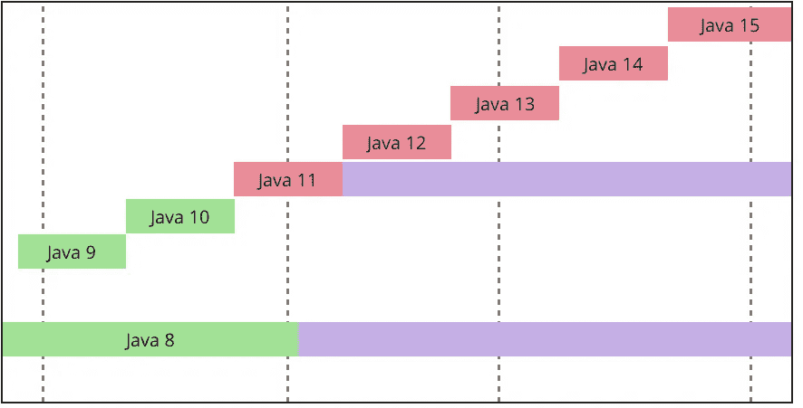

# 2023 年学习 Java 8 到 Java 17 新特性的 7 大课程

> 原文：<https://medium.com/javarevisited/top-5-courses-to-learn-new-features-of-java-8-to-java-13-107eb51d2a13?source=collection_archive---------0----------------------->

## 这些是我最喜欢的在线课程，学习从 Java 8 到 Java 17(2023 年 Java 编程语言的最新版本)引入的新功能

[**Java 新特性(Java 12、Java 11、Java 10、Java 9&Java 8)**](https://click.linksynergy.com/deeplink?id=JVFxdTr9V80&mid=39197&murl=https%3A%2F%2Fwww.udemy.com%2Fjava-new-features%2F)

从 Java 8 到 Java 17 引入了许多有用的功能，如 lambda 表达式、流 API、新的日期和时间 API、[创建不可变列表](/javarevisited/how-to-create-an-immutable-list-list-and-map-in-java-5ac1254c128)、[记录](https://www.java67.com/2021/08/how-to-use-record-in-java-example.html)、[密封类](https://javarevisited.blogspot.com/2022/02/how-to-use-sealed-classes-and-interfaces.html)、用于存储无类型局部变量的 var、switch case 中的字符串、文本块等等。

跟上 Java 的速度对任何 Java 开发人员来说都是困难的，因为 Java 的新版本仅在六个月后发布，但是如果您想学习这些新特性并寻找一些资源，那么下面的课程将会帮助您。

总结自实施可预测的六个月发布节奏以来过去两年的发布内容:
Java 10(2018 年 3 月):12 个特性
Java 11(2018 年 9 月):17 个特性
Java 12(2019 年 3 月):8 个特性
Java 13(2019 年 9 月):5 个特性
Java 14(2020 年 3 月):16 个特性

Btw，如果你是初学者，2021 年学习 Java，我建议你加入由 Tim Buchalaka 在 Udemy 上开设的 [**Java 编程大师班**](https://click.linksynergy.com/fs-bin/click?id=JVFxdTr9V80&subid=0&offerid=323058.1&type=10&tmpid=14538&RD_PARM1=https%3A%2F%2Fwww.udemy.com%2Fjava-the-complete-java-developer-course%2F) 课程，这是深入学习 Java 的最佳课程之一，他还针对 Java 11 和 Java 17 进行了更新。

 [## 完整的 Java Masterclass(针对 Java 17 进行了更新)

### 你刚刚在网上偶然发现了最完整、最深入的 Java 编程课程。拥有超过 260，000 名学生…

udem.com](https://click.linksynergy.com/fs-bin/click?id=JVFxdTr9V80&subid=0&offerid=323058.1&type=10&tmpid=14538&RD_PARM1=https%3A%2F%2Fwww.udemy.com%2Fjava-the-complete-java-developer-course%2F) 

# 从 Java 8 到 Java 17 学习 Java 新特性的 10 个最佳在线课程

无论如何，为了不浪费你更多的时间，这里有一些学习 Java 新特性的短期课程，从 JDK 8 到 JDK 17。

## 1.[超越 Java 8 的思考](https://click.linksynergy.com/deeplink?id=CuIbQrBnhiw&mid=39197&murl=https%3A%2F%2Fwww.udemy.com%2Fcourse%2Fthinking-beyond-java-8%2F) (Java 9 到 Java 17:逐步导航)

如果你想快速学习从 Java 9 到 Java 17 的所有新特性，那么这个 Udemy 课程非常适合你。在本课程中，讲师 Ajay Iyenger 将向您传授从 Java 9 到 Java 17 的所有重要的 Java 新特性。

下面是这个列表中包含的 Java 特性列表:

*   文本块开关表达式、记录、实例的模式匹配、开关的模式匹配、密封类
*   垃圾收集者——G1、艾司隆、ZGC、谢南多厄
*   模块化，jdeps，jlink，jdeprscan
*   改进的码头集装箱检测
*   工具/工具包— J 包，JShell，JDK 飞行记录器
*   集合中的工厂方法
*   紧凑字符串
*   了解字符串串联在幕后是如何工作的
*   Stream API 中的一些变化
*   局部变量类型推断以及用法建议
*   应用程序类数据共享
*   新的 HTTP 客户端 API
*   方便的字符串 API 更改
*   使用 Java 编程语言编写脚本
*   发球收集器
*   JMH (Java 微基准测试工具)
*   封装的 JDK 内部构件
*   迁移技巧(JAXB、Hibernate 和 Spring Boot 的例子)。还有更多！

总的来说，这是掌握 Java 新特性的最佳课程之一。这门课程将极大地有利于那些对不断发展的 Java 语言感兴趣的 Java 开发人员。

**这里是加入本课程的链接**——[超越 Java 的思考 8](https://click.linksynergy.com/deeplink?id=CuIbQrBnhiw&mid=39197&murl=https%3A%2F%2Fwww.udemy.com%2Fcourse%2Fthinking-beyond-java-8%2F)

## 2.José Paumard 的《Java 8 的新特性》

这门[课程](https://pluralsight.pxf.io/c/1193463/424552/7490?u=https%3A%2F%2Fwww.pluralsight.com%2Fcourses%2Fjava-9-whats-new)涵盖了 Java 8 中最有用的部分。Java 平台的这次更新是最大的一次。它甚至比引入了泛型的 Java 5 还要大。我们将从 lambda 表达式和流 API 开始，它们为 Java 平台带来了新的基本模式。

用迭代器模式解决的许多问题，现在用 Stream API 带来的模式解决起来要有效得多。但是 Java 8 不仅仅是关于 lambdas、streams 和 collectors，还有一个新的 Java 日期和时间 API，本课程将对此进行介绍。

 [## Java 8 的新特性

### Java 8 大部分新特性的快速概述。本课程涵盖了 lambda 表达式和流 API，但是…

pluralsight.pxf.io](https://pluralsight.pxf.io/c/1193463/424552/7490?u=https%3A%2F%2Fwww.pluralsight.com%2Fcourses%2Fjava-8-whats-new) 

## 3.Java 9 的新特性

Java 9 包含了许多新特性。在本课程中，[**Java 9 的新特性**](https://pluralsight.pxf.io/c/1193463/424552/7490?u=https%3A%2F%2Fwww.pluralsight.com%2Fcourses%2Fjava-9-whats-new) ，您将大致了解该语言和库的最重要变化。首先，您将深入研究模块系统，将模块引入 Java 语言。

然后，您将发现`jshell`，这是一个交互式试验 Java 代码的新工具。最后，您将探索更小的和增量的变化，比如对 Stream 和 Optional 等 API 的改进，添加集合工厂方法，以及新引入的 API，比如`ProcessHandle` 和`HttpClient`。

完成本课程后，您就可以在自己的项目中充分利用 Java 9 了。

 [## Java 9 的新特性

### 是时候跟上 Java 9 的发布及其发展了。在本课程中，您将了解…

pluralsight.pxf.io](https://pluralsight.pxf.io/c/1193463/424552/7490?u=https%3A%2F%2Fwww.pluralsight.com%2Fcourses%2Fjava-9-whats-new) 

## 4.Java 10 的新特性:局部变量类型推理

Java 10 仅比 Java 9 晚发布 6 个月。在本课程[**Java 10 的新特性:局部变量类型推理**](https://pluralsight.pxf.io/c/1193463/424552/7490?u=https%3A%2F%2Fwww.pluralsight.com%2Fcourses%2Fwhats-new-java-10-local-variable-type-inference) 中，您将了解 Java 的加速发布时间表及其对您的意义。

首先，您将了解发布时间表中的转折点以及即将推出的新特性。接下来，您将深入了解 Java 10 中最引人注目的特性:局部变量类型推理的引入。

最后，您将发现其他新功能，如 G1 垃圾收集器的性能改进、应用程序类数据共享的引入以及 JDK 10 的 Docker 意识的提高。完成本课程后，您就可以在自己的项目中充分利用 Java 10 了。

 [## Java 10 的新特性:局部变量类型推理

### 课程概述大家好，我是 Sander Mak，欢迎来到我的课程“Java 10 的新特性”。我是一名研究员…

pluralsight.pxf.io](https://pluralsight.pxf.io/c/1193463/424552/7490?u=https%3A%2F%2Fwww.pluralsight.com%2Fcourses%2Fwhats-new-java-10-local-variable-type-inference) 

## 5.Sander Mak 的 Java 11 新特性

在本课程中，[**Java 11 的新特性:长期支持**](https://pluralsight.pxf.io/c/1193463/424552/7490?u=https%3A%2F%2Fwww.pluralsight.com%2Fcourses%2Fjava-11-whats-new) ，您将了解 Java 11 中最重要的新特性。

首先，您将了解加速发布时间表以及 Java 11 有何不同。接下来，您将深入了解 Java 11 中发生的许多可能影响您的代码库的弃用和删除。

还有新的库和语言特性可以探索，比如全新的`HttpClient` API。最后，您将了解此版本中的性能和安全性增强。完成本课程后，您就可以在自己的项目中充分利用 Java 11 了。

 [## Java 11 的新特性:长期支持

### 本课程概述了 Java 11 中最重要的特性，例如新的库和语言…

pluralsight.pxf.io](https://pluralsight.pxf.io/c/1193463/424552/7490?u=https%3A%2F%2Fwww.pluralsight.com%2Fcourses%2Fjava-11-whats-new) 

## 6.Sander Mak 的《Java 12 的新特性》

跟上 Java 可能是一项具有挑战性的任务。Java 11 发布仅 6 个月，Java 12 就来了。

在本课程中，[**Java 12 新特性**](https://pluralsight.pxf.io/c/1193463/424552/7490?u=https%3A%2F%2Fwww.pluralsight.com%2Fcourses%2Fjava-12-whats-new) ，您将了解 Java 12 中所有重要的新特性。首先，您将了解 API 的变化，比如`CompactNumberFormat` API 和 String 类上的新方法。

接下来，您将发现一个名为 Switch Expressions 的预览 Java 语言特性。最后，您将探索如何使用 JMH，这是一个 Java 代码的微型基准测试工具，在 JDK 12 中被大量使用。完成本课程后，您就可以在自己的项目中充分利用 Java 12 了。

 [## Java 12 的新特性

### 本课程概述了 Java 12 中最重要的特性，例如预览语言特性，如…

pluralsight.pxf.io](https://pluralsight.pxf.io/c/1193463/424552/7490?u=https%3A%2F%2Fwww.pluralsight.com%2Fcourses%2Fjava-12-whats-new) 

## 7.Sander Mak 的《Java 13 的新特性》

Java 13 是 2019 年 Java 的第二个版本，没错就在 Java 12 发布 6 个月后。

在本课程中，[**Java 13 的新特性**](https://pluralsight.pxf.io/c/1193463/424552/7490?u=https%3A%2F%2Fwww.pluralsight.com%2Fcourses%2Fwhats-new-in-java-13) ，您将对 Java 13 中的所有重要特性进行概述。首先，您将了解 API 的变化，比如对`ByteBuffer` API 的更新。

接下来，您将发现一个名为文本块的预览 Java 语言特性。最后，您将了解平台的变化，了解 JDK 如何重新实现 Socket API 并改进应用程序类数据共享特性。

完成本课程后，您将可以在自己的项目中充分利用 Java 13。

 [## Java 13 的新特性

### 本课程概述了 Java 13 中最重要的特性，如文本等预览语言特性…

pluralsight.pxf.io](https://pluralsight.pxf.io/c/1193463/424552/7490?u=https%3A%2F%2Fwww.pluralsight.com%2Fcourses%2Fwhats-new-in-java-13) 

你可以看到所有这些课程都来自 Pluralsight，你只需要一个会员就可以访问它们，你不需要购买单独的课程。顺便说一句，如果你没有 Pluralsight 会员，那么这可能是获得一个会员来促进你学习的最佳时机。

他们现在对他们的年度和高级会员提供 33%的折扣**，这是非常罕见的。如果您已经拥有 [Pluralsight 会员资格](http://pluralsight.pxf.io/c/1193463/424552/7490?u=https%3A%2F%2Fwww.pluralsight.com%2Flearn)，现在也是以折扣价续订的好时机。**

****

# **抱歉，我只需要一道菜，不是 7 道**

**对于那些喜欢购买课程而不是会员资格的人，我仍然可以推荐一门课程，它包含了 JDK 从 Java 8 到 Java 12 的所有变化，它是 Udemy 上的 [**Java 新特性(Java 12，Java 11，Java 10，Java9 & Java8)**](https://click.linksynergy.com/deeplink?id=JVFxdTr9V80&mid=39197&murl=https%3A%2F%2Fwww.udemy.com%2Fjava-new-features%2F) 课程。它并没有涵盖 Java 13，但仍然是学习其他特性的好材料。你可以在每个月举行的几次 Udemy 闪购中以不到 10 美元的价格买到它。**

** [## Java 新特性(Java 12、Java 11、Java 10、Java9 和 Java8)

### 您是否正在寻找一个单一的平台来学习 Java 7、Java 8、Java 9、Java……

udemy.com](https://click.linksynergy.com/deeplink?id=JVFxdTr9V80&mid=39197&murl=https%3A%2F%2Fwww.udemy.com%2Fjava-new-features%2F) 

以上是一些**最好的课程，让你了解从 JDK 8 到 JDK 17 引入的 Java 新特性。**这些课程规模小且切题，这意味着你可以在短时间内完成它们，并且只学习有意义和必要的功能，而不是学习所有内容。

顺便说一句，如果你刚刚开始学习 Java 编程语言，我不推荐这些课程，因为它们是为那些已经精通 Java 并且只想学习新特性的有经验的 Java 程序员准备的。

对于初学者，我推荐何塞·波尔蒂利亚和 Udemy 团队的课程，如 [**完整的 Java 开发训练营**](https://click.linksynergy.com/deeplink?id=JVFxdTr9V80&mid=39197&murl=https%3A%2F%2Fwww.udemy.com%2Fcourse%2Fthe-complete-java-development-bootcamp%2F) 。它是为初学者设计的，不仅教你 Java，还教你编程。

 [## 完整的 Java 开发训练营

### Java 是最常用的编程语言之一。它简单易学，可以在任何机器上运行。您可以将 Java 用于…

udemy.com](https://click.linksynergy.com/deeplink?id=JVFxdTr9V80&mid=39197&murl=https%3A%2F%2Fwww.udemy.com%2Fcourse%2Fthe-complete-java-development-bootcamp%2F) 

您可能喜欢的其他**编程文章**

[2023 年 Web 开发者路线图](https://hackernoon.com/the-2019-web-developer-roadmap-ab89ac3c380e)
[2021 年学习 Python 的 10 个理由](https://javarevisited.blogspot.com/2018/05/10-reasons-to-learn-python-programming.html)
[2023 年你可以学习的 10 种编程语言](http://www.java67.com/2017/12/10-programming-languages-to-learn-in.html)
[每个 Java 开发者都应该知道的 10 个工具](http://www.java67.com/2018/04/10-tools-java-developers-should-learn.html)
[学习 Java 编程语言的 10 个理由](http://javarevisited.blogspot.sg/2013/04/10-reasons-to-learn-java-programming.html)
[10 个框架 Java 和 Web 开发者应该学习的 10 个技巧](http://javarevisited.blogspot.sg/2018/01/10-frameworks-java-and-web-developers-should-learn.html)
[成为 2023 年更优秀的 Java 开发者](http://javarevisited.blogspot.sg/2018/05/10-tips-to-become-better-java-developer.html)

**P. S. —** 如果你是初学者，2023 年开始学习 Java，我建议你加入 Tim Buchalaka 在 [Udemy](https://medium.com/u/b32aa0132f1b?source=post_page-----3f0b2207dfc4----------------------) 开设的 [**Java 编程大师班**](https://click.linksynergy.com/fs-bin/click?id=JVFxdTr9V80&subid=0&offerid=323058.1&type=10&tmpid=14538&RD_PARM1=https%3A%2F%2Fwww.udemy.com%2Fjava-the-complete-java-developer-course%2F) 课程，这是深入学习 Java 的最佳课程之一。

 [## 完整的 Java Masterclass(针对 Java 17 进行了更新)

### 你刚刚在网上偶然发现了最完整、最深入的 Java 编程课程。拥有超过 260，000 名学生…

udemy.com](https://click.linksynergy.com/fs-bin/click?id=JVFxdTr9V80&subid=0&offerid=323058.1&type=10&tmpid=14538&RD_PARM1=https%3A%2F%2Fwww.udemy.com%2Fjava-the-complete-java-developer-course%2F)**