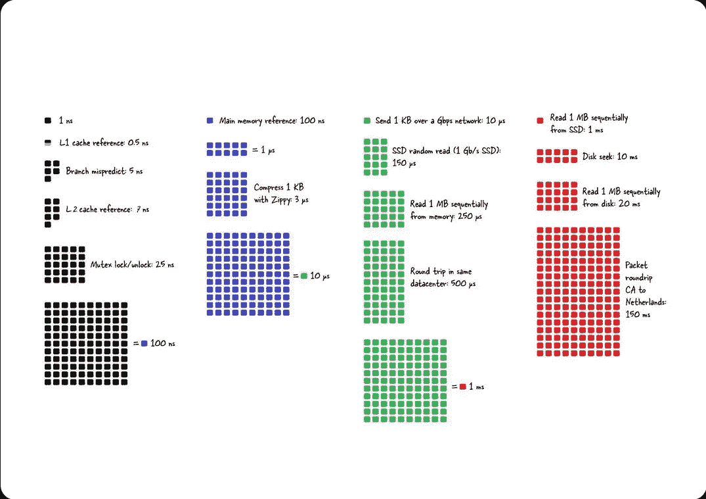
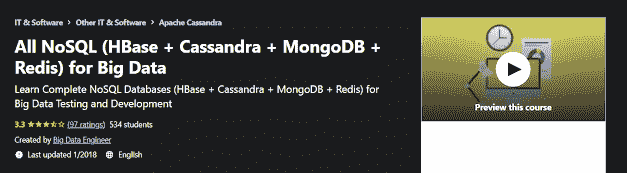
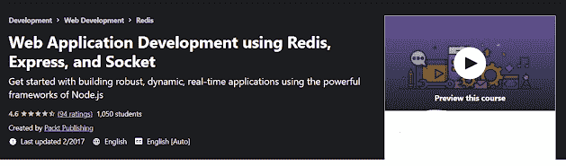
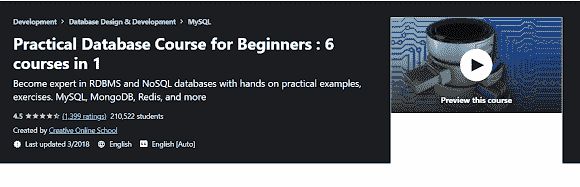

# 2023 年初学者学习 Redis 的 5 大课程——最佳选择

> 原文：<https://medium.com/javarevisited/top-5-courses-to-learn-redis-for-beginners-best-of-lot-720b8b381fc8?source=collection_archive---------2----------------------->

## 想学习 2023 年流行的开源键值数据库服务器之一 Redis？以下是 2023 年学习 Redis Cache 的最佳在线课程

图片 _ 信用—[https://architecturenotes.co/redis/](https://architecturenotes.co/redis/)

大家好，如果你想学习 Redis，一个流行的键值 NoSQL 数据库，经常被用作缓存，并寻找最好的在线课程来深入学习 Redis，那么你来对地方了。

早些时候，我已经分享了学习 MongoDB ， [*Cassandra*](/javarevisited/5-best-apache-cassandra-courses-for-beginners-and-experienced-ca37195b2fc4) 的 [*最佳课程，另一个受欢迎的 NoSQL 数据库，在这篇文章中，我将分享 2023 年学习 Redis 的最佳*在线课程*，但在我们看它们之前，让我们看看什么是 Redis 以及它如何帮助您的项目。*](/javarevisited/5-best-mongodb-courses-to-learn-nosql-for-beginners-in-2020-42df5af5496c)

[Redis](https://redis.io/) 是一个内存中的数据结构存储，可以用作数据库、缓存和消息代理。它是开源的(BSD 许可)。Redis 中提供了字符串、散列、列表、集合、范围搜索的排序集合、位图、超级日志、地理索引和流。

Redis 利用了内存的速度，并减轻了中央应用程序数据库的负载，用于:

*   不常更改但经常被请求的数据
*   任务不太重要且经常变化的数据。

上述数据的示例包括会话或数据缓存、排行榜或仪表板汇总分析。Redis 也是 NoSQL 五大数据库之一，我想每个开发者都应该很熟悉。

# 2023 年最适合初学者的 5 门 Redis 在线课程

在不浪费你更多时间的情况下，这里列出了 2023 年学习 Redis 数据库的最佳在线课程。

## 1.[从零开始学习 Redis](https://click.linksynergy.com/deeplink?id=JVFxdTr9V80&mid=39197&murl=https%3A%2F%2Fwww.udemy.com%2Fcourse%2Flearn-redis-from-scratch%2F)【Udemy】

理解和使用 Redis 数据结构存储的分步介绍。如果您想从头开始学习如何使用 Redis，这篇 Redis 教程是理想的起点。从对 Redis 一无所知到能够利用这个强大的数据库构建一个应用程序，本课程将教会你所有你需要知道的东西。

这个 Redis 课程是为 Redis 新手和以前从未接触过它的人设计的。您将了解 Redis 的所有知识，包括它是什么、它的最佳用途以及如何在您的机器上设置它。

**评分:4.1 分，满分 5 分**

**时长:3 小时**

**指导老师:Eduonix tech**

**价格:36 美元**

您将了解 Redis 基础的所有知识，包括各种数据结构、Redis 客户机、键-值对命令(scan、config、commands 和 client)、如何将数据保存到光盘，甚至许多持久化数据的方法。

学习完基础知识后，您将在老师的帮助下开发一个功能性的任务管理器，老师将向您展示如何在现实世界中使用 Redis。使用 NodeJS 和 Redis，您将创建一个任务管理器。您还将学习如何使用 Twitter Bootstrap 进行经理设计。

**这里是加入本课程的链接**——[从零开始学习 Redis】](https://click.linksynergy.com/deeplink?id=JVFxdTr9V80&mid=39197&murl=https%3A%2F%2Fwww.udemy.com%2Fcourse%2Flearn-redis-from-scratch%2F)

## 2.【Redis 入门【UDEMY】

本教程将引导您开始使用 Redis，并向您介绍一些中级主题，如集群、安全性和 sentinel。

Redis 是一个强大的 NoSQL 数据库，正逐渐成为最受欢迎和广泛使用的 NoSQL 数据库的替代品之一。Redis 有一个简单的界面、优秀的文档和大量的客户端来集成到您的应用程序中。

**评分:3.4 分(满分 5 分)**

**时长:1.5 小时**

**讲师:伊森·巴林杰**

价格:16 美元

《入门指南》重新发现了 Redis 的基础知识，包括安装以及如何设置 Redis 集群并使您的 Redis 设置高度可用的演示。

无论您是应用程序开发的新手还是经验丰富的老手，几乎总是需要数据库。Redis 入门将向您展示为什么 Redis 是这项工作的最佳选择。

以下是加入本课程的链接—[Redis 入门](https://click.linksynergy.com/deeplink?id=JVFxdTr9V80&mid=39197&murl=https%3A%2F%2Fwww.udemy.com%2Fcourse%2Fgetting-started-with-redis%2F)

## 3.[面向大数据的全 NoSQL(h base+Cassandra+MongoDB+Redis)](https://click.linksynergy.com/deeplink?id=JVFxdTr9V80&mid=39197&murl=https%3A%2F%2Fwww.udemy.com%2Fcourse%2Flearn-complete-nosql-dbs-hbasecassandramongodbredis%2F)【UDEMY】

了解如何使用完整的 NoSQL 数据库(HBase + Cassandra + MongoDB + Redis)测试和开发大数据。

本课程面向各种背景的学生，如开发人员和测试人员，他们希望在现实世界的大数据领域发展事业。开发本课程是为了让您可以在一个全面的大数据环境中开始使用所有 NoSQL 数据库，如 HBase、CASSANDRA、MongoDB 和 REDIS。

所有在大数据领域工作或寻找工作并希望进入测试领域的用户都应该参加本课程，并完成所有教程，从初级到高级不等。

**评分:3.3 分(满分 5 分)**

**时长:7.5 小时**

**讲师:大数据工程师**

**价格:45 美元**

它将为 NoSQL 数据库应用程序的开发和测试中使用的各种命令和查询提供全面的信息，测试人员需要将这些信息转移到更大的范围，即大数据生态系统环境中。

本课程结构严谨，涵盖了 HBASE + CASSANDRA + MongoDB + REDIS 等几个 NoSQL 数据库的各个方面，在综合大数据集内，高级命令按科目划分。本课程面向希望从头开始学习大数据端到端 NoSQL 数据库的学生。

## 4.[使用 Redis、Express 和 Socket 的 Web 应用开发](https://click.linksynergy.com/deeplink?id=JVFxdTr9V80&mid=39197&murl=https%3A%2F%2Fwww.udemy.com%2Fcourse%2Fweb-application-development-using-redis-express-and-socket%2F)【UDEMY】

了解如何使用 Node.js 的强大框架来创建健壮、动态、实时的应用程序。

这是 Packt 的视频学习路径之一，它是以逻辑和顺序方式组织的单个视频产品的集合，每个视频都建立在前一个视频教授的技能上。

在这条学习路径中，您将学习如何使用 SocketIO、Express 和 Redis 在网站上构建实时应用程序。

因为 SocketIO 具有强大的实时引擎，所以它已经被用来创建一些实时聊天和博客应用程序。是的，插座。IO 拥有目前最强大、最可靠的实时引擎之一。因此，它对于实时分析、即时聊天以及浏览器和 web 应用程序之间的双向通信来说几乎是理想的。

**评分:4.6 分(满分 5 分)**

**时长:6 小时**

**讲师:PacktPublishing**

**价格:45 美元**

Redis 通过使数据检索快速而简单打开了大门。最后，Express 使创建全功能在线应用程序变得简单。

本质上，这个学习路径是一步一步地结合 Redis 和 NodeJS，以及用 Node.js 和 SocketIO 构建一个实时网站。

学习结束后，您将成为一名优秀的 SocketIO 开发人员，能够设计快速、可伸缩的动态实时程序。

## 5.[初学者实用数据库课程:1 门 6 门](https://click.linksynergy.com/deeplink?id=JVFxdTr9V80&mid=39197&murl=https%3A%2F%2Fwww.udemy.com%2Fcourse%2Fdatabase-course%2F)【UDEMY】

通过动手实践示例和练习，成为 RDBMS 和 NoSQL 数据库方面的专家。MySQL，MongoDB，Redis，还有更多数据库可用。

完成本课程后，您将能够理解并在 RDBMS 和 NoSQL 数据库中创建简单和复杂的查询。本课程将为您提供世界上最流行的 RDBMS 数据库(如 MySQL)以及 NoSQL 数据库(如 MongoDB、Redis 等)的实践经验。

**评分:4.3 分(满分 5 分)**

**时长:3 小时**

**指导老师:创意网校**

**价格:45 美元**

这些知识可以用于任何 RDMBS 数据库(如 Oracle、MS SQL Server、SQLite 等)以及 NoSQL 数据库(CouchDB、Amazon Dynamo DB 等)。

提升职业的最快方法之一是同时学习 SQL 和 NoSQL。我希望这次培训对你未来的工作有用。如需更多信息，请观看免费的预览视频。

这些是我在 Udemy 等网站上找到的一些最好的在线课程，可以深入了解 Redis，但我也建议您查看这个图表，以便更好地了解 Redis，我非常喜欢这个图表中提到的细节，您也可以阅读 [*文章*](https://architecturenotes.co/redis/) 以更好地了解 Redis。

以上就是 2023 年**学习 Redis 的最佳在线课程**。如果你想学习 Redis，你可以在 Udemy 上查看这些课程。因为我们已经根据不同的要求完成了更精确、更先进和更完善的课程。选择一个或更多你所选择的。