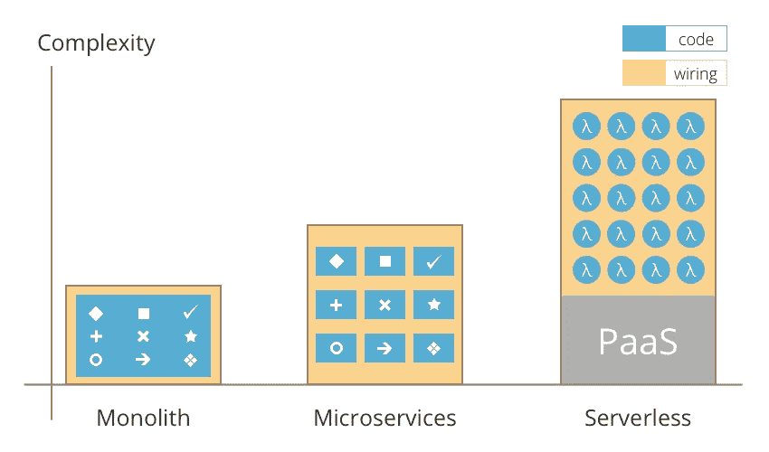
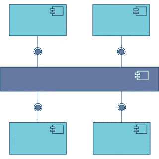
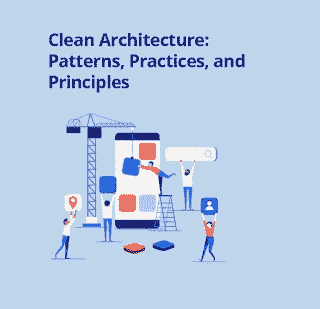
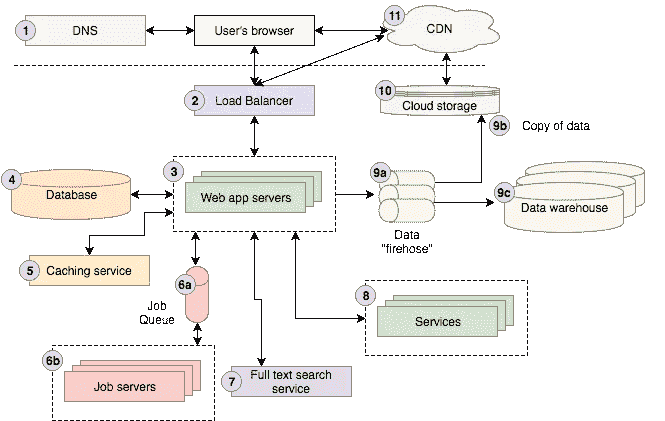

# 我最喜欢的 2023 年学习软件架构的课程——最好的

> 原文：<https://medium.com/javarevisited/top-5-courses-to-learn-software-architecture-in-2020-best-of-lot-5d34ebc52e9?source=collection_archive---------0----------------------->

## 这些是 2023 年学习软件架构并成为解决方案架构师的最佳课程

每个程序员都想在职业生涯中成长，但这并不容易，而且如果你不关注自己的工作，你很可能会在同一个职位上呆很多年。最初几年的增长一般都很快。尽管如此，一旦你到达 5 年的关口，你需要决定你想朝哪个方向前进——人员管理、产品管理或软件架构。对于不想从事人员和产品管理的技术人员来说，软件架构或解决方案架构是最后的职位，这并不奇怪。

如果你想接近编码和技术讨论，喜欢尝试新技术，想在你的组织中使用它们来解决一个具有挑战性的问题，软件架构是一个很好的位置。

我见过或接触过的大多数 [Java 开发人员](http://www.java67.com/2018/08/top-10-free-java-courses-for-beginners-experienced-developers.html)都想成为软件架构师，尽管只有少数人成功了，他们中的大多数仍然是技术主管或高级软件开发人员。但是，一个大问题是，一个高级开发人员如何成为一个软件架构师？在学习软件或解决方案架构师应该具备的技能方面，你可以期待哪些书籍或课程？除了如何准备 Java 面试之外，这也是我从读者那里收到的最常见的问题之一。为了帮助你解决这个问题，并回答我的读者提出的许多类似的问题，我将分享一些在线课程，你可以参加这些课程来学习更多关于软件架构以及如何成为一名软件架构师。

过去，我曾分享过几本[书](https://javarevisited.blogspot.com/2018/02/5-must-read-books-to-become-software-architect-solution.html)你可以通过阅读来学习一些软件架构技能，这些课程会补充你从中学到的任何东西。你也可以利用这些课程和那些书来两全其美。

# 2023 年成为软件架构师的前 7 门课程

正如我所说的，软件架构师的职位不是一个舒适的职位。架构师负责项目中的所有技术决策，同时也是一个重要的角色。

你需要了解很多东西，不仅仅是技术，还有业务。您不仅应该熟悉通用软件架构、[设计](http://www.java67.com/2018/05/top-20-system-design-interview-questions-answers-programming.html)、[编码](http://javarevisited.blogspot.sg/2015/06/2-websites-to-learn-coding-in-java-online-free.html)和[编程最佳实践](http://javarevisited.blogspot.sg/2014/10/10-java-best-practices-to-name-variables-methods-classes-packages.html#axzz5Bwn8nSNW)，还应该熟悉最新的技术、库和框架，并了解它们在为您的解决方案选择正确技术时的优缺点。

在这几门课程中，我已经尝试将你需要学习的大部分东西都包含在软件架构中，但是这个列表绝不是完整的，我渴望得到一些偶然看到这篇文章的有经验的软件架构师的一些建议。

总之，事不宜迟，这里是我列出的一些学习软件架构，成为解决方案架构师或软件架构师的最佳在线课程。

## 1.[Coursera 上的软件架构](https://coursera.pxf.io/c/3294490/1164545/14726?u=https%3A%2F%2Fwww.coursera.org%2Flearn%2Fsoftware-architecture)

说到在线学习，Coursera 是著名的网站之一，也是我最喜欢的网站之一，还有 Udemy 和 Pluralsight。它有一些关于机器学习、算法和软件架构的最好的课程，这是其中之一。在本课程中，你将学习如何使用可视化工具如 [UML](https://javarevisited.blogspot.com/2017/07/top-5-books-to-learn-uml-unified-modelling-language-java.html) 来描述一个软件架构，这对于与股东以及将要实现它的开发人员交流架构是非常重要的。

您还将学习一些标准架构、它们的品质以及它们的权衡。该课程还讨论了如何评估设计，什么是好的架构，以及架构可以改进。

本课程最精彩的部分是，在最后一个模块中，您将通过 UML 图记录一个基于 Java 的 [Android 应用程序](http://www.java67.com/2019/01/top-5-free-android-app-development-courses-for-programmers.html)(顶点项目)，并使用架构权衡分析法(ATAM)分析评估应用程序的架构，从而进行一些实际操作。

而且，如果你觉得 Coursera 的课程很有用，因为它们是由世界各地知名的公司和大学创建的，我建议你加入 Coursera Plus 的订阅计划，这是 Coursera 的一个订阅计划，让你可以无限制地访问他们最受欢迎的课程，专业课程，职业证书，T21 项目，每年大约花费 399 美元，但是物有所值

<https://coursera.pxf.io/c/3294490/1164545/14726?u=https%3A%2F%2Fwww.coursera.org%2Fcourseraplus>  

## 2.[如何成为一名优秀的解决方案架构师](https://click.linksynergy.com/deeplink?id=JVFxdTr9V80&mid=39197&murl=https%3A%2F%2Fwww.udemy.com%2Fhow-to-become-an-outstanding-solution-architect%2F)

对于所有渴望成为软件架构师的程序员来说，这是另一门优秀的必修课。在本课程中，讲师 Mark Farragher 将教您成为一名杰出的解决方案架构师所需的所有技能。他不仅会教你如何创建一个优秀的建筑设计，还会向你展示你在这个角色中真正发光并给你的同行留下印象所需的所有软技能。这是非常重要的，因为你需要做大量的交谈，可能需要与组织中的大多数人互动，包括首席执行官和首席技术官。

本课程还涵盖了软件架构师或解决方案架构师如何在 IT 团队中运作，成为一名优秀的架构师需要具备哪些软技能，以及你可以承担哪些额外的责任来真正给同行留下印象。

<https://click.linksynergy.com/deeplink?id=JVFxdTr9V80&mid=39197&murl=https%3A%2F%2Fwww.udemy.com%2Fhow-to-become-an-outstanding-solution-architect%2F>  

谈到技术技能，本课程将教你如何创建高层架构，解释常见的架构设计模式，并展示如何用 UML 设计这些模式。

它还涵盖了如何看待架构，无论是高层还是低层，比如[缓存](https://javarevisited.blogspot.com/2017/03/difference-between-first-and-second-level-cache-in-Hibernate.html#axzz4sTPAluX7)、[异常管理](http://javarevisited.blogspot.sg/2013/03/0-exception-handling-best-practices-in-Java-Programming.html#axzz5DmwFLA1K)，以及部署场景。简而言之，这是一门面向所有想成为解决方案架构师的程序员和高级开发人员的优秀课程。

## 3.[软件架构基础&Java 设计模式](https://click.linksynergy.com/deeplink?id=JVFxdTr9V80&mid=39197&murl=https%3A%2F%2Fwww.udemy.com%2Fbasics-of-software-architecture-design-in-java%2F)

本课程是一个比前两个课程更低层次的课程，讲述软件架构和设计模式，比抽象设计更具体。

课程使用 Java 编程语言解决问题，对于 Java 开发者来说非常棒。尽管如此，理论背景是独立于语言的，对所有程序员都有用，不管他们的编程语言是什么。

我强烈建议自己多次编写实现代码，以便很好地掌握它们。

它还涵盖了像[坚实的原则](https://pluralsight.pxf.io/c/1193463/424552/7490?u=https%3A%2F%2Fwww.pluralsight.com%2Fcourses%2Fprinciples-oo-design)和[设计模式](https://pluralsight.pxf.io/c/1193463/424552/7490?u=https%3A%2F%2Fwww.pluralsight.com%2Fcourses%2Fpatterns-library)这样的东西，这些对于任何好的架构和健壮的应用程序都是至关重要的。

## 4.[开发商到建筑师](https://pluralsight.pxf.io/c/1193463/424552/7490?u=https%3A%2F%2Fwww.pluralsight.com%2Fcourses%2Fdeveloper-to-architect)【最佳多元化课程】

对于所有想成为软件架构师的程序员来说，这是另一个很棒的课程。在本课程中，您将学习软件架构师在团队和组织中的角色，以及为什么它如此重要。

您将了解成为一名合格的软件架构师所需的技能和知识，以及在软件开发和项目生命周期的每个阶段的责任。

最后，您将学习成为解决方案架构师最重要的一个方面:如何设计解决方案，并与技术和非技术利益相关者沟通。

简而言之，这门课程是你成为一名有能力的成功软件架构师的路线图。即使你是一个软件架构师，你也可以参加这个课程来进一步磨练你的软技能。如果你需要更多的资源，你也可以看看这个[书籍列表，来提高你作为程序员和开发者的软技能](https://javarevisited.blogspot.com/2017/12/5-career-development-and-soft-skill-books-for-programmers.html)。

<https://pluralsight.pxf.io/c/1193463/424552/7490?u=https%3A%2F%2Fwww.pluralsight.com%2Fcourses%2Fdeveloper-to-architect>  

## 5.干净的架构:模式、实践和原则

这是关于软件架构的另一门优秀的 Pluralsight 课程。在本课程中，您将学习干净的架构，如果您认为什么是干净的架构，它只不过是一套现代模式、实践和原则，用于创建简单、可理解、灵活、可测试和可维护的软件架构。

对于一个组织来说，写[干净的代码](http://javarevisited.blogspot.sg/2017/10/clean-code-by-uncle-bob-book-review.html)和创建干净的架构有很多关注点，本课程将在那个方向上帮助你。

这是一门入门课程，也就是说这门课程没有先决条件。然而，拥有至少一种 C 语言(如编程语言)的基本经验和软件架构的基本知识是有益的。

和 Bob 大叔的 [Clean Architecture](https://javarevisited.blogspot.com/2017/09/clean-architecture-by-uncle-bob-martin.html) 书完全不同，这也是一本值得想成为软件架构师的程序员阅读的书。

顺便说一下，你需要一个 [**Pluralsight 会员**](https://pluralsight.pxf.io/c/1193463/424552/7490?u=https%3A%2F%2Fwww.pluralsight.com%2Fpricing) 才能加入这个课程，费用大约是每月 29 美元或每年 299 美元(14%的折扣)。如果你没有这个计划，我强烈推荐你加入，因为它能促进你的学习，而且作为一名程序员，你总是需要学习新的东西。

或者，你也可以使用他们的 **1** [**0 天免费试用**](https://pluralsight.pxf.io/c/1193463/424552/7490?u=https%3A%2F%2Fwww.pluralsight.com%2Flearn) 免费观看本课程。

<https://pluralsight.pxf.io/c/1193463/424552/7490?u=https%3A%2F%2Fwww.pluralsight.com%2Flearn>  

## 6.[钻研系统设计面试](https://www.educative.io/collection/5668639101419520/5649050225344512?affiliate_id=5073518643380224)

这是我学习软件设计或系统设计时最喜欢的课程之一。它是为你准备系统设计面试而创建的，但是你也可以用它来学习一般的系统设计方法。

[钻研系统设计面试](https://www.educative.io/collection/5668639101419520/5649050225344512?affiliate_id=5073518643380224)，是详细描述大规模分布式系统设计问题的首批课程(或书籍)之一。即使您以前从事过分布式系统的工作，您也可以从本课程中学到很多东西。

以下是加入本课程的链接— [**系统设计面试**](https://www.educative.io/collection/5668639101419520/5649050225344512?affiliate_id=5073518643380224)

作者创建了本课程，为您提供设计选择(包括利弊)，以便您能够理解需求，比较方法，并为手头的问题提出最佳解决方案。

他们还注意不要提供适合 45 分钟讨论的解决方案。这使得课程非常有趣。

即使你没有准备[编码面试](https://hackernoon.com/10-data-structure-algorithms-and-programming-courses-to-crack-any-coding-interview-e1c50b30b927)，我也建议你参加这个课程来提高你的系统设计技能。非常感谢教育团队和法希姆·哈克创造了这个令人敬畏的课程。

## 7.[网络应用&软件架构 101](https://www.educative.io/courses/web-application-software-architecture-101?affiliate_id=5073518643380224)

这是 Educative 的又一门学习 Web 应用架构的优秀课程。在本课程中，您将了解不同的架构风格，如整体架构、微服务、客户端-服务器、三层架构、分散式对等架构，以及请求和数据如何在 web 应用程序中移动。

您还将了解如何从大处着眼，从层次、性能、可伸缩性和高可用性方面进行思考，这是当今应用程序的必备条件。

本课程不仅介绍了不同的体系结构模式，还解释了每种方法的优缺点，并带您经历一个不同的场景，其中某个特定的体系结构比其他的更适合。

以下是加入课程的链接— [**Web 应用&软件架构 101**](https://www.educative.io/courses/web-application-software-architecture-101?affiliate_id=5073518643380224)

老实说，这不仅是高级开发人员的最佳课程，也是每个软件开发人员的最佳课程，因为它将拓展你的思维过程，让你成为一个更自信的 web 开发人员。现在的课程有很大的折扣，只需 44 美元，原价 79 美元，对他们来说有点贵，但是值得。

另一方面，如果你喜欢 Educative 作为一个平台，你也可以购买订阅，每月只需 17 美元 **(** [**五折**](https://www.educative.io/subscription?affiliate_id=5073518643380224) **)** ，我有一个，我强烈推荐你去买一个。

这就是学习软件架构并成为软件架构师或解决方案架构师的一些最好的在线课程。正如我所说的，软件架构师的角色是非常重要的，他还需要做大量的交谈，因此不仅仅是主题和技术，他还需要擅长软技能。

这是一份令人满意的职业，无论是从薪酬还是工作方面来说，因为你得到了很多关注，可以与组织中从首席执行官到开发人员的高层和低层交谈，并了解关于你的应用和解决方案的大部分事情。

其他**文章你可能喜欢**探讨
[2023 年 Java 和 Web 开发者应该学会的 10 件事](http://javarevisited.blogspot.sg/2017/12/10-things-java-programmers-should-learn.html#axzz53ENLS1RB)
[2023 年要看的 10 种编程语言](http://www.java67.com/2017/12/10-programming-languages-to-learn-in.html)
[Java 开发者应该知道的 10 种测试工具](http://javarevisited.blogspot.sg/2018/01/10-unit-testing-and-integration-tools-for-java-programmers.html)
[5 种框架 Java 开发者应该学会的 2023 年](http://javarevisited.blogspot.sg/2018/04/top-5-java-frameworks-to-learn-in-2018_27.html)
[每个 Java 开发者都应该知道的 10 种工具](https://javarevisited.blogspot.com/2019/02/10-tools-advanced-java-developers-should-know.html)
[最后，Java 有 var 来声明局部变量](http://javarevisited.blogspot.sg/2017/12/top-5-courses-to-learn-big-data-and.html)
[2023 年每个 Java 程序员都应该读的 10 本书](http://www.java67.com/2018/02/10-books-java-developers-should-read-in.html)
[Java 开发人员在日常工作中使用的 10 个工具](http://javarevisited.blogspot.sg/2017/03/10-tools-used-by-java-programming-Developers.html#axzz55lrMRnNC)
[成为更好的 Java 程序员的 10 个技巧](https://javarevisited.blogspot.com/2018/05/10-tips-to-become-better-java-developer.html)

感谢您阅读本文。如果您发现这些课程对成为软件架构师或学习软件架构有用，请与您的朋友和同事分享。如果您有任何问题或反馈，请留言。cc

**P.S.** —如果你正在寻找学习 Java 设计模式的免费课程，这对于软件架构师来说也是至关重要的，那么你也可以查看 Udemy 上的 [**Java 设计模式和架构**](http://bit.ly/java-design-patterns-tutorial) 课程。它是完全免费的，并且有大量关于 Java 程序员使用设计模式的有用信息。

<http://bit.ly/java-design-patterns-tutorial>  

## 你可能喜欢的其他媒体文章

</javarevisited/top-5-courses-to-learn-microservices-in-java-and-spring-framework-e9fed1ba804d>  </javarevisited/10-free-spring-boot-tutorials-and-courses-for-java-developers-53dfe084587e>  </javarevisited/25-software-design-interview-questions-to-crack-any-programming-and-technical-interviews-4b8237942db0> 