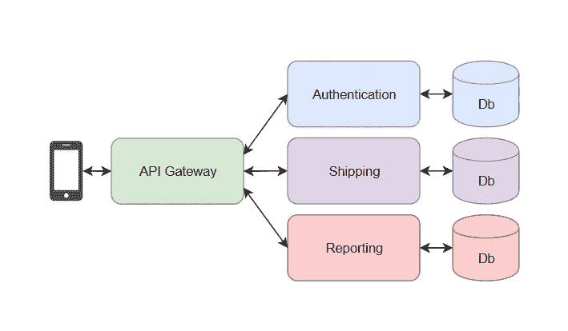
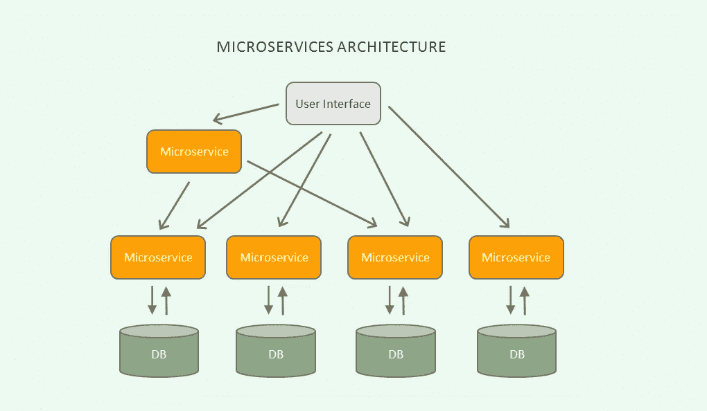
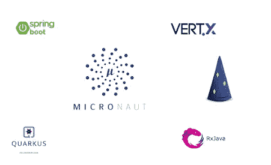
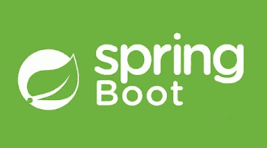
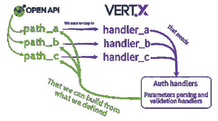

# 2023 年要学习的 5 大 Java 微服务框架

> 原文：<https://medium.com/javarevisited/top-5-frameworks-java-developers-can-learn-for-microservices-development-in-2022-848da66d6651?source=collection_archive---------0----------------------->

## Spring Boot、Quarkus、MicroNaut、Vert.x 和 DropWizard 是 Java 中微服务开发的顶级框架，但是哪一个最好呢？

Java 程序员们好，2023 年新年快乐。如果你正在考虑用 Java 开发微服务，并在 2023 年寻找微服务开发的最佳框架和库，那么你来对地方了。

之前我已经分享了学习微服务 和 [**软件架构**](/javarevisited/top-5-courses-to-learn-software-architecture-in-2020-best-of-lot-5d34ebc52e9) 的 [**最佳课程，在他的文章中，我将和大家讨论 Java 开发者可以用来创建微服务的 5 个现代框架。**](/javarevisited/10-best-java-microservices-courses-with-spring-boot-and-spring-cloud-6d04556bdfed?source=rss-bb36d8439904------2&utm_source=dlvr.it&utm_medium=linkedin)

虽然你可能知道 [Spring Boot](https://javarevisited.blogspot.com/2018/05/top-5-courses-to-learn-spring-boot-in.html) 和 [Spring Cloud](https://javarevisited.blogspot.com/2018/04/top-5-spring-cloud-courses-for-java.html#axzz6jsdEHyTp) 是在 Java 中开发微服务应用的领先框架，但是还有几个选项，比如 [MicroNaut](https://micronaut.io/) 、[、 *DropWizard*](https://www.dropwizard.io/en/latest/) 和 [*Quarkus I* 、T21 o](https://quarkus.io/)

在这篇文章中，我将分享你可以用 Java 开发微服务的 6 大框架。

虽然这些框架中的大多数都是新的，并且除了文档和一些教程之外，没有太多关于如何使用这些框架在 Java 中开发生产质量的微服务的资源，但我也会分享一些有用的资源，如在线课程和书籍，以学习这些框架，如在线课程和教程。

顺便说一句，我也更新了我们的[**2023**](/javarevisited/the-java-programmer-roadmap-f9db163ef2c2)Java 开发者路线图，如果你还没有查看，现在就可以查看

 [## 2023 年 Java 开发者路线图[更新]

### 大家好，首先祝大家 2023 新年快乐。我已经分享了很多成为网络的路线图…

javarevisited.blogspot.com](https://javarevisited.blogspot.com/2019/10/the-java-developer-roadmap.html) 

## 什么是微服务？

当你在网上搜索微服务时，你会发现很多不同的定义，有些太专业，有些太容易描述什么是微服务。

我将根据自己的经验来解释这一点，这可能不是微服务的完美或最准确的定义，但这是您在处理微服务架构或应用时将构建或看到的内容。

在去微服务之前，我们先退一步，试着了解一下应用架构的演变，以及是什么导致了软件开发世界中微服务的发展。

很久以前有一段时间，我们只是维护一个应用程序，一个基于代码的应用程序，并且它们也被部署到每台机器上。比如像微软 Word 等 PC 游戏的 Windows 软件。

当我们需要更多的功能时，我们只是不断地将它们添加到源代码中。这意味着几年后，您的代码库相当大，添加或更改单个功能需要大量的回归测试，影响交付时间表和工作。

人们意识到了这一点，他们创造了将代码分成不同模块的最佳实践。其思想是每个模块应该相互独立，这样你就可以分别开发、测试和部署它们，Web 应用就诞生了。

在[网络应用](https://javarevisited.blogspot.com/2020/06/top-5-courses-to-learn-python-full-stack-web-development.html)的例子中，你不需要将整个应用部署到客户端机器上，你所需要的只是一个浏览器，它可以连接到服务器以获得任何它需要的功能。现在，您不需要在同一台机器上部署客户机和服务器。

这种演变在服务器端也在继续，人们开始将一个大的整体应用程序分解成多个独立的较小的应用程序，或者我应该说是微型应用程序。

这些微应用提供一种服务，完全专注于授权、认证、服务发现、负载平衡等，它们被称为微服务。

我们将提供不同服务的多个微应用程序相互连接并作为一个应用程序执行的架构称为微服务架构。

现在，你可能会想它的好处是什么？嗯，这些微服务与单片应用相比非常小，这意味着您可以快速、独立地开发、测试和部署它们。这确实改善了交付和发布周期。

它还构建了一个分布式架构，您可以在不同的主机或相同的主机上部署[微服务](https://javarevisited.blogspot.com/2018/02/top-5-spring-microservices-courses-with-spring-boot-and-spring-cloud.html)，这意味着更好地利用存储、内存和 CPU 等服务器资源。最后，它还有助于提高可伸缩性，因为您可以快速生成需求不断增长的新服务实例。

例如，让我们考虑一下亚马逊 Prime Day，当许多人购物并且亚马逊网站的流量增加时，此时您需要更多的流程来处理这些结账，因此您将创建这些流程的新实例，但是您不需要扩展与 Prime 无关的其他服务，例如索引亚马逊产品的服务。

您可以进一步查看 Udemy 上的 [**微服务架构—完整指南课程**](https://click.linksynergy.com/deeplink?id=CuIbQrBnhiw&mid=39197&murl=https%3A%2F%2Fwww.udemy.com%2Fcourse%2Fmicroservices-architecture-the-complete-guide%2F) ，了解更多关于这种与云计算世界齐头并进的流行软件设计模式的信息。

# 2023 年微服务设计和开发的 5 个最佳 Java 框架

这就是我对微服务的总体解释。正如我所说的，这可能不准确或技术上不正确，但这是您将在大多数实际实施微服务架构的地方看到的。

现在我们知道了什么是微服务，它有什么好处，让我们探索几个 [Java 框架](/javarevisited/5-essential-frameworks-every-java-developer-should-learn-6ed83315f1fb)，它们可以帮助你用 Java 开发微服务。

## 1.Spring Boot +春云

毫无疑问，Spring Boot 和 Spring Cloud 是用 Java 开发微服务的最佳选择。这是最成熟和经过测试的框架，当你陷入困境时，你会找到一个更大的社区来支持你。

除了最新和深入的文档，还有很多关于学习 Spring Boot 和 Spring Cloud 的在线资源，如 Udemy 上的 Spring Boot 微服务课程，可以让你立即开始学习。当你从零开始时，这些是非常重要的一点，因为你需要快速学习和快速交付。

现在来看特性，Spring Cloud 提供了许多开箱即用的特性，这些特性是微服务架构所需要的，比如服务发现和负载平衡。它遵循网飞微服务架构，这也是最常见的实施。

如果你想学习 Java 微服务开发的 Spring Boot 和春云，需要资源，我强烈推荐 28 分钟的 Ranga Karnam 的 [**大师微服务与 Spring Boot 和春云**](https://click.linksynergy.com/deeplink?id=CuIbQrBnhiw&mid=39197&murl=https%3A%2F%2Fwww.udemy.com%2Fcourse%2Fmicroservices-with-spring-boot-and-spring-cloud%2F) 课程。这门 19.5 小时的课程是初学者和中级 Java 开发人员学习 Spring Boot 微服务的绝佳资源。

因为社区、资源、特性，我个人认为 Spring Boot + Spring Cloud 是微服务开发最好的 Java 框架。顺便说一句，我并不孤单，Java 冠军 Marcus Biel 和他的 Twitterati 同事让他的读者在不同的微服务框架之间进行选择，Spring Boot 是最受欢迎的选择。

## 2.夸库西奥

Quarkus 是另一个全栈的 Kubernetes-native Java 框架，专为 Java 虚拟机(JVM)和本机编译而设计，专门针对容器优化 Java，使其成为无服务器、云和 Kubernetes 环境的有效平台。

[Quarkus](https://javarevisited.blogspot.com/2020/09/top-5-courses-to-learn-dropwizard-Micronaut-Quarkus-Java-Microservices.html) 得到了 Redhat 的支持，它在创建高性能、可伸缩的 Java 应用程序方面正迅速取得进展。基于 Quarkus 的应用程序的关键特性之一是快速启动。

许多 Java 程序员希望尝试 Quarkus 的快速和反应性微服务，如果你也想在 2023 年学习 Quarkus，我强烈建议你从 Udemy 上 Quarkus 的先驱之一安东尼奥·冈萨尔维斯的 Quarkus 课程开始，看看这个 [**。这个 3.5 小时的课程对于任何愿意学习 Quarkus 的 Java 开发人员来说都是一个很好的起点。**](https://click.linksynergy.com/deeplink?id=CuIbQrBnhiw&mid=39197&murl=https%3A%2F%2Fwww.udemy.com%2Fcourse%2Fquarkus-starting-with-quarkus%2F)

## 3.微型机器人

这是另一个现代的、基于 JVM 的全栈框架，用于构建模块化的、易于测试的微服务和无服务器应用程序。Micronaut 得到了 Java 社区的喜爱，随着 Oracle 和 JetBrains 等大公司的支持，MicroNaut 在不久的将来可能会成为 Spring Boot 和 Spring cloud 的有力竞争者。

说到技术方面的东西，Micronaut 和 [Spring 框架](https://javarevisited.blogspot.com/2018/06/top-6-spring-framework-online-courses-Java-programmers.html)有一个关键的区别，Spring 完全依赖于运行时反射和代理，Micronaut 使用编译时数据来实现依赖注入。

这并不是一种新方法，但谷歌 Dagger 等工具已经采用了这种方法，该工具主要是为 Android 设计的。

关于 MicroNaut，另一件有趣的事情是它是由 OCI 创建的，这家公司也创建了 Grails，这是一个面向 Groovy 开发人员的流行 web 开发框架。

MicroNaut 的当前版本是 MicroNaut 2.5，它支持 Gradle 6.5 和增量编译，并为微服务提供了更好的反应库。

如果你想在 2023 年学习 MicroNaut，并且需要一个资源，我也推荐你去 Udemy 上看看 Daniel Prinz 的[**Learn micro naut—cloud-native micro services with Java**](https://click.linksynergy.com/deeplink?id=CuIbQrBnhiw&mid=39197&murl=https%3A%2F%2Fwww.udemy.com%2Fcourse%2Flearn-micronaut%2F)课程。这个长达 6.5 小时的课程是从头开始学习 MicroNaut 的绝佳资源。

## 4.下拉向导

DropWizard 是另一个用于创建 RESTful web 服务和微服务的强大框架。它使用 Jetty、Jackson 和 Jersey 等流行的 Java 库来更快更容易地创建高性能的 Java 应用程序。

DropWizard 的好处在于它提供了对配置、监控、指标和许多其他操作任务的内置支持。说到学习 DropWizard，可用的资源并不多。

你可以查阅文档，但如果你在寻找书籍和在线课程，那么就没有多少了，我只在 Udemy 上找到了[**drowizard**](https://click.linksynergy.com/deeplink?id=CuIbQrBnhiw&mid=39197&murl=https%3A%2F%2Fwww.udemy.com%2Fcourse%2Fgetting-started-with-dropwizard%2F)入门课程，这还不错，不是最好的，但你仍然可以通过学习这门课程开始学习 drowizard。

## 5.微断面

Eclipse MicroProfile 是一个为微服务架构优化 Java EE 的计划。它旨在提供一个厂商中立的规范，通过利用 Java EE 来创建[微服务架构](https://javarevisited.blogspot.com/2019/03/5-courses-programmers-can-join-to-learn.html)。

该规范由专家创建，并得到 IBM、RedHat 和 Oracle 等组织的支持，这使得它非常适合用于微服务开发和部署。

如果你需要资源，数量不多，但你可以查看 Udemy 上的 Java EE 8: 2-in-1 微服务开发课程，该课程将教你如何使用微服务构建 Java EE 项目，并将其部署在 AWS 和 Azure 上。

在这个过程中，您还将学习如何使用 MicroProfile 和 Payara Micro 来构建独立的 REST 服务

## 6.Eclipse 垂直 x

来自 Eclipse 的 Vert.x 是一个开发[反应式微服务](https://javarevisited.blogspot.com/2021/04/best-reactive-spring-and-webflux-courses-for-java-developers.html)的轻量级框架。它支持非阻塞和异步的开发模型，并允许你在 Java 虚拟机上运行你的分布式应用程序。

与提供单一解决方案的 Spring Boot 不同，Vert.x 不提供一体化解决方案，而是提供一个工具包和构建块来构建您自己的组件。因为它是一个工具包，所以它提供了灵活性，可以独立使用它，也可以将其嵌入 Spring 本身。

事实上，许多像 QuarkusIO 这样的微服务框架使用 Vert.x 来满足他们像 TCP 和 HTTP 这样的底层需求。如果你想在 2023 年学习 Vertx 并寻找资源，那么我也建议你在 Udemy 上查看 Daniel Prinz 的[**Learn vert . x——使用 Java 的反应式微服务**](https://click.linksynergy.com/deeplink?id=CuIbQrBnhiw&mid=39197&murl=https%3A%2F%2Fwww.udemy.com%2Fcourse%2Freactive-web-applications-with-vertx-and-vuejs%2F) 课程。这个 9.5 小时的课程是 2023 年从 Vert.x 开始进行反应式微服务开发的绝佳资源。

这就是微服务开发的一些**最佳 Java 框架。**虽然大多数组织使用 Spring Boot 和 Spring Cloud 来创建他们的 RESTful web 服务和微服务，但是您也可以学习更多现代的替代产品，如 [QuarkusIO](https://www.java67.com/2022/02/top-5-courses-to-learn-quarkus.html) 和 Micronaut。我还试图推荐一些有用的资源，你可以在那里学习这些框架。如果您有任何其他框架要添加到这个列表中，请随意评论。

你可能喜欢的其他 **Java 和** **编程文章**

*   [2023 年 Java 开发者路线图](https://javarevisited.blogspot.com/2019/10/the-java-developer-roadmap.html)
*   [每个 Java 开发人员都应该学习的 21 项技术技能](https://javarevisited.blogspot.com/2020/03/top-20-skills-java-developers-can-learn.html#axzz6k4XBgTw4)
*   【Java 开发者应该知道的 20 个库
*   [我最喜欢的深入学习 Java 的免费课程](/javarevisited/10-free-courses-to-learn-java-in-2019-22d1f33a3915)
*   [2023 年每个 Java 开发人员都要学习的 10 种工具](https://www.java67.com/2018/04/10-tools-java-developers-should-learn.html)
*   [2023 年学习 Spring Boot 的 5 大课程](https://www.java67.com/2018/06/5-best-courses-to-learn-spring-boot-in.html)
*   [2023 年面向 Java 和 Web 开发人员的 10 个框架](http://javarevisited.blogspot.sg/2018/01/10-frameworks-java-and-web-developers-should-learn.html)
*   [2023 年要学的 10 种编程语言](http://www.java67.com/2017/12/10-programming-languages-to-learn-in.html)
*   [深入学习 Spring 框架的前 5 门课程](https://javarevisited.blogspot.com/2018/06/top-6-spring-framework-online-courses-Java-programmers.html)
*   [学习 Maven、Jenkins 和 Docker 的 10 门免费课程](/javarevisited/top-10-free-courses-to-learn-maven-jenkins-and-docker-for-java-developers-51fa7a1e66f6)
*   2023 年 Java 开发人员应该阅读的 10 本书
*   每个软件开发人员必备的 11 项技能
*   成为更好的 Java 开发人员的 10 个技巧
*   [2023 年将获得 10 项 AWS 和云认证](https://www.java67.com/2020/09/top-10-cloud-certification-you-can-aim.html)

感谢您阅读这篇文章。如果你喜欢这些 Java 微服务框架，请与你的朋友和同事分享。如果您有任何问题或反馈，请留言。

**P. S. —** 如果你热衷于将微服务技能添加到你的简历中，但正在寻找一门初级课程来了解微服务架构、模式以及微服务的利弊，那么我强烈推荐你参加这个关于教育的交互式 [**微服务原则和概念介绍**](https://www.educative.io/courses/introduction-microservice-principles-concepts?affiliate_id=5073518643380224) 课程。尽管我从事过微服务项目，但我从这个课程中学到了很多，你也可以。

 [## 微服务原理和概念介绍——互动学习

### 微服务是最重要和最流行的软件架构趋势之一。这种架构构成了基础…

www.educative.io](https://www.educative.io/courses/introduction-microservice-principles-concepts?affiliate_id=5073518643380224)