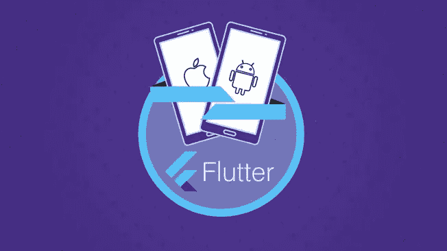
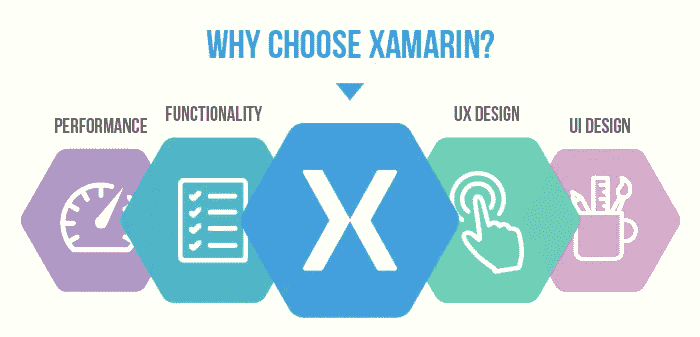
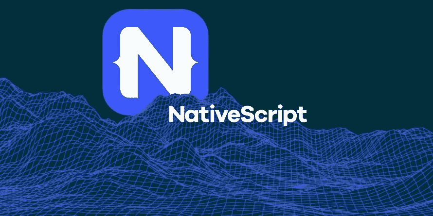
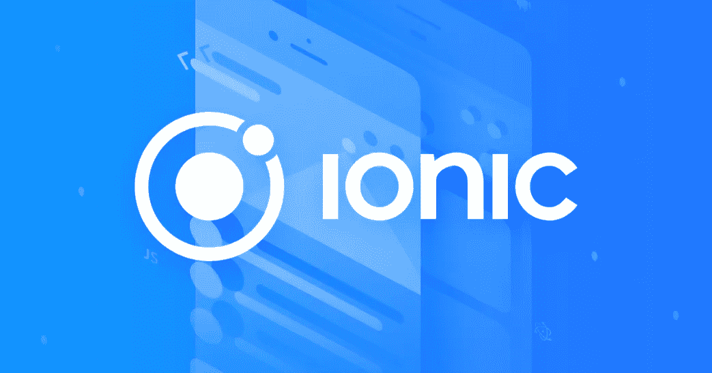

# 2023 年跨平台 Android 和 iOS 应用的 7 个最佳框架和库

> 原文：<https://medium.com/javarevisited/top-5-frameworks-to-create-cross-platform-android-and-ios-apps-in-2020-d02edf3d01f1?source=collection_archive---------1----------------------->

## 提供相关在线课程和教程的链接

大家好，现在非常需要具备跨平台移动应用开发框架知识的开发者，如 [Flutter](/javarevisited/my-favorite-flutter-and-dart-programming-courses-for-beginners-9e8355710d78) 和 [React Native](/@javinpaul/top-5-react-native-courses-for-mobile-application-developers-b82febdf8a46) 。这是显而易见的，因为没有人想为他们的 Android 和 iOS 移动应用程序维护一个单独的代码库。

> 拥有一个单独的代码库是一个维护的噩梦，因为你必须做两次工作来将一个 bug 修复或特性放入你的每个代码库中。

谢天谢地， [Flutter](https://www.java67.com/2020/06/5-free-courses-to-learn-flutter-in-2020.html) 和 [React Native](https://www.java67.com/2020/07/5-free-courses-to-learn-react-native-in.html) 解决了这个问题，它允许你使用相同的代码为安卓[和 iOS 设备创建一个看起来像本地的移动应用。](/hackernoon/top-5-courses-to-learn-android-for-java-programmers-667e03d995b4)

虽然 Flutter 和 React Native 肯定是领先的跨平台移动应用程序开发框架，但它们并不是唯一的框架，因为您还可以使用 Ionic、Xamarin 和 Native Script 等框架，您将在本文中学习这些框架。

# 构建跨平台移动应用的 7 个最佳框架

不再浪费你的时间，让我们深入到构建跨平台移动应用的最佳框架中。我们还将看看每个框架的优缺点，以及您可以根据自己的优势使用哪些框架。我还会提到沿途的相关课程，以便进一步学习。

## 1.摆动

这是 2023 年开发跨平台原生移动应用的绝佳框架。与 [Golang](https://www.java67.com/2019/12/top-5-courses-to-learn-go-or-golang.html) 、 [TensorFlow](https://javarevisited.blogspot.com/2018/08/top-5-tensorflow-and-machine-learning-courses-online-programmers.html) 、 [Angular](https://javarevisited.blogspot.com/2019/04/10-free-angular-and-react-courses-for.html) 一样，Flutter 也来自谷歌，它使用 Dart(谷歌的另一种编程语言)，并提供开发跨平台原生移动应用的 SDK。

将你的应用发布到不同的平台上一直是一个挑战，比如 [Android](/hackernoon/top-5-courses-to-learn-android-for-java-programmers-667e03d995b4) 、 [iOS](/javarevisited/my-favorite-free-courses-to-learn-ios-app-development-f172e7d3ba5d) 和 Windows Mobile，因为你需要维护一个单独的代码库。Flutter 解决了这个问题，它允许你使用相同的代码库为 iOS 和 Android 设备创建移动应用。

Flutter 在过去的两年里有了很大的发展，现在它是开发本地移动应用的头号框架。

如果你已经决定要学习 Flutter 和寻找资源，那么我建议你去看看 Udemy 上的这本[**Flutter&Dart——acad mind 的 Maximilian 的《完全指南【2023 版】**](https://click.linksynergy.com/deeplink?id=JVFxdTr9V80&mid=39197&murl=https%3A%2F%2Fwww.udemy.com%2Fcourse%2Flearn-flutter-dart-to-build-ios-android-apps%2F) 》，这是我 2023 年学习 Flutter 最喜欢的课程之一。

## 2.反应自然

除了 Flutter 之外，如果你能找到另一个开发原生跨平台移动应用的框架，那么就用 React Native 吧。它使用 [React](https://javarevisited.blogspot.com/2018/08/top-5-react-js-and-redux-courses-to-learn-online.html) 和 [JavaScript](https://javarevisited.blogspot.com/2018/06/top-10-courses-to-learn-javascript-in.html) 来制作高质量的本地移动应用。

对于所有想要成为移动应用开发者并且已经熟悉像 [JavaScript](/javarevisited/10-best-online-courses-to-learn-javascript-in-2020-af5ed0801645) 和 [React](/@javinpaul/top-5-courses-to-learn-react-js-in-2019-best-of-lot-fa02cd96cdf0) 这样的技术的 web 开发者来说，这是一个正确的选择。如果你是其中之一，那么我建议你在 2023 年学习 React Native。

另外，有很多学习 React Native 的资源，有免费的也有付费的，但是如果你问我的推荐，我强烈推荐你去看看 Stephen Grider 的 [**完整的 React Native + Hooks**](https://click.linksynergy.com/deeplink?id=JVFxdTr9V80&mid=39197&murl=https%3A%2F%2Fwww.udemy.com%2Fcourse%2Fthe-complete-react-native-and-redux-course%2F) 课程，这是我最喜欢的在线学习 React Native 的资源之一。斯蒂芬是 Udemy 最好的老师之一，他的教学风格非常棒

## 3.科尔多瓦

Apache Cordova 是另一个移动应用程序开发框架，最初由 Nitobi 创建。Adobe Systems 在 2011 年收购了 Nitobi，将其更名为 PhoneGap，后来发布了该软件的开源版本，名为 Apache Cordova。

它允许您使用标准的 web 技术— [HTML5](/javarevisited/5-free-html-and-css-courses-to-learn-front-end-web-development-online-8b04517c6ecb?source=collection_home---4------0-----------------------) 、 [CSS3](/javarevisited/top-10-free-courses-to-learn-html-5-css-3-and-web-development-872d62d97a97) 和 [JavaScript](/javarevisited/10-best-online-courses-to-learn-javascript-in-2020-af5ed0801645) 进行跨平台开发，其中一项是 2023 年要学习的热门技术。

如果你想在 2023 年学习科尔多瓦，那么请查看[用 Angular 和 Cordova](https://click.linksynergy.com/fs-bin/click?id=JVFxdTr9V80&subid=0&offerid=323058.1&type=10&tmpid=14538&RD_PARM1=https%3A%2F%2Fwww.udemy.com%2Fionic-2-the-practical-guide-to-building-ios-android-apps%2F) 构建 iOS & Android 应用程序，这是学习科尔多瓦的激动人心的课程之一。

## 4.Xamarin

Xamarin 是一种通过单一的共享 C#代码库快速为所有平台制作移动应用的方法，为每个平台构建自定义的原生用户界面，或使用`Xamarin.Forms`编写跨平台的单一共享用户界面。

它归微软所有，并因为 C、 [C++](/javarevisited/top-10-courses-to-learn-c-for-beginners-best-and-free-4afc262a544e) 和 [C#](/@javinpaul?source=follow_footer--------------------------follow_footer-) 开发人员创建移动应用程序而迅速走红。

如果你已经知道 C 语言中的一种，并且正在寻找移动应用程序开发的职业生涯，那么我强烈建议你在 2023 年学习 Xamarin，以及 [**完整的 Xamarin 开发者课程:iOS 和 Android！**](http://bit.ly/2DxBRt4) 是一个很好的开始课程。

## 5.重火力点

Firebase 并不完全是一个开发移动应用的跨平台框架，而是一个构建后端的有用框架。它实际上是谷歌的移动平台，帮助您快速开发高质量的移动应用程序，并发展您的业务。你可以选择 Firebase 作为你的 [Android](/javarevisited/5-free-courses-to-become-an-android-developer-d4d207f53675) 或 [iOS](/javarevisited/top-5-online-courses-to-learn-ios-12-swift-in-2019-a35ae1be7b2b?source=---------22------------------) 应用的后端。

如果你希望在 2023 年进入利润丰厚的移动应用程序开发行业，那么学习 Firebase 是一个非常好的主意，而 [**高级 iOS 和 Firebase:Rideshare**](https://click.linksynergy.com/fs-bin/click?id=JVFxdTr9V80&subid=0&offerid=323058.1&type=10&tmpid=14538&RD_PARM1=https%3A%2F%2Fwww.udemy.com%2Fadvanced-ios-firebae-build-an-uber-clone-app%2F)**是一个很好的起点。**

****

## **6.原生脚本**

**如果你不喜欢 [React Native](https://javarevisited.blogspot.com/2018/02/5-react-native-courses-to-learn-mobile-development-using-JavaScript.html) 和 [Flutter](https://javarevisited.blogspot.com/2019/07/top-5-online-training-courses-to-learn-flutter.html) 并寻找替代方案，那么你也可以看看 Native Script。NativeScript 是一个免费的开源框架，用于开发苹果 iOS 和谷歌 Android 平台的移动应用程序。

它允许你用[类型脚本](https://javarevisited.blogspot.com/2018/07/top-5-courses-to-learn-typescript.html)和 [JavaScript](https://hackernoon.com/10-websites-to-learn-javascript-for-beginners-31e13bbdbb5c) 以及使用 [Angular](/javarevisited/10-courses-to-learn-angular-for-web-development-6da1bd2856dc) 和 [Vuejs](https://javarevisited.blogspot.com/2019/08/top-5-online-courses-to-learn-vue.js-best.html) 构建原生移动应用。如果你是一名前端开发人员，并且已经了解 Angular 或 Vuejs 等框架，那么原生脚本可能是你的正确选择。NativeScript 具有与 Angular 和 Vuejs 深度集成的特性，并允许您在任何语言上编写代码，这些代码可以转换为类似 TypeScript 或 CoffeeScript 的 JavaScript。**

**如果你需要资源，建议你去看看 Udemy 上 Maximilian Schwarzmuller 的这个 [**原生脚本+ Angular:构建原生 iOS 和 Android 应用**](https://click.linksynergy.com/deeplink?id=JVFxdTr9V80&mid=39197&murl=https%3A%2F%2Fwww.udemy.com%2Fcourse%2Fnativescript-angular-build-native-ios-android-web-apps%2F) 课程。**

****

## **7.离子的**

**这是使用 JavaScript 开发混合移动应用程序的另一个框架。Ionic 还允许你构建跨平台的移动应用，这意味着你可以使用一个代码库为任何平台创建一个应用。

Ionic Framework 是免费和开源的，它提供了一个可移植的 UI 工具包，用于为本地 [iOS](/javarevisited/top-5-online-courses-to-learn-ios-12-swift-in-2019-a35ae1be7b2b?source=---------5------------------) 、 [Android](https://www.java67.com/2019/01/top-5-free-android-app-development-courses-for-programmers.html) 和 web 开发高质量的跨平台应用程序——所有这些都来自单一代码库。它还有一个 Ionic React，利用 React 构建混合移动应用。

如果你想在 2023 年学习爱奥尼亚，那么我建议你去 Udemy 上看看这个 [**爱奥尼亚 4 大师班**](https://click.linksynergy.com/deeplink?id=JVFxdTr9V80&mid=39197&murl=https%3A%2F%2Fwww.udemy.com%2Fcourse%2Fionic-2-the-practical-guide-to-building-ios-android-apps%2F) 课程。它是由 Maximilian Schwarzmuller 创建的，他是 Udemy 和 Youtube 上最好的讲师之一。**

****

**这就是你可以学习的跨平台移动应用开发的一些最佳框架。你不需要全部都学，选一个适合你需要的。**

**例如，如果你已经知道了 [JavaScript](/javarevisited/10-of-the-most-popular-javascript-frameworks-libraries-for-web-development-in-2019-a2c8cea68094) 和 [React.js](/@javinpaul?source=post_page-----fa02cd96cdf0----------------------) ，那么 React Native 是最适合你的框架，但是如果你有 Dart 背景或者不介意学习一门像 Dart 这样的新编程语言，那么 Flutter 是一个很好的选择。**

**同样，具有 C、C#和 C++背景的开发人员可以使用 Xamarin 框架来构建跨平台的移动应用程序。

其他**编程和科技文章**你可能喜欢
[2023 年 Java 开发者路线图](https://javarevisited.blogspot.com/2019/10/the-java-developer-roadmap.html)
[2023 年 Java 程序员应该学习的 10 件事](https://javarevisited.blogspot.com/2017/12/10-things-java-programmers-should-learn.html#axzz5atl0BngO)
[2023 年前端和后端开发者路线图](https://javarevisited.blogspot.com/2019/02/the-2019-web-developer-roadmap.html)
[2023 年你可以学习的 10 种编程语言](http://www.java67.com/2017/12/10-programming-languages-to-learn-in.html)
[2023 年 DevOps 工程师路线图](https://javarevisited.blogspot.com/2018/09/the-2018-devops-roadmap-your-guide-to-become-DevOps-Engineer.html#axzz61d5FPRru)
[10](http://javarevisited.blogspot.sg/2018/01/10-frameworks-java-and-web-developers-should-learn.html)
[2023 年学习 Python 的 10 个理由](https://javarevisited.blogspot.com/2018/05/10-reasons-to-learn-python-programming.html)
[2023 年学习 iOS 和 Swift 的 5 大课程](/swlh/top-5-course-to-learn-ios-12-and-swift-4-in-depth-5a7351785f8d)
[10 个 JavaScript 框架和库学习](https://www.java67.com/2019/01/top-10-javascript-frameworks-and-libraries-for-web-developers.html)
[10 个技能每个程序员都应该学习的](/javarevisited/11-essential-skills-to-become-software-developer-in-2020-c617e293e90e?source=extreme_sidebar---------0-2----------------------)
[5 个必备技能破解你下一次编码面试](https://javarevisited.blogspot.com/2020/04/5-essential-skills-to-crack-coding-interviews.html)**

**感谢您阅读本文。如果你觉得这篇文章有用，并且发现这些技术值得移动应用开发学习，那么请分享给你的朋友和同事。如果您有任何问题或反馈，请留言。**

****P.S. —** 如果你对这么多技术、编程语言和框架感到困惑，那么我建议你从 Flutter 开始，如果你需要免费的在线课程，你也可以在 Udemy 上查看[**Flutter**](https://click.linksynergy.com/deeplink?id=JVFxdTr9V80&mid=39197&murl=https%3A%2F%2Fwww.udemy.com%2Fcourse%2Fintroduction-to-flutter%2F)简介——由 [Google 开发者](https://medium.com/u/991272e72e68?source=post_page-----e0b91391cade----------------------)提供的免费课程。你只需要一个免费的 Udemy 帐户就可以参加这个课程。**

**<https://click.linksynergy.com/deeplink?id=JVFxdTr9V80&mid=39197&murl=https%3A%2F%2Fwww.udemy.com%2Fcourse%2Fintroduction-to-flutter%2F> **