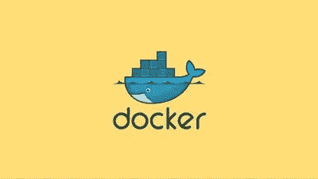
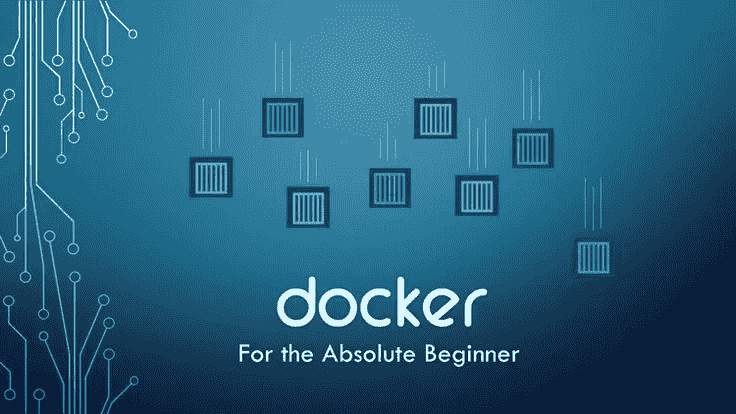
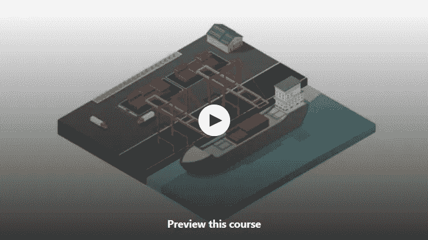

# 2023 年学习 Docker 的五大免费课程——最佳选择

> 原文：<https://medium.com/javarevisited/top-5-free-courses-to-learn-docker-for-beginners-best-of-lot-b2b1ad2b98ad?source=collection_archive---------0----------------------->

## 为什么要学 Docker？因为 Docker 允许您在云中以标准的容器方式部署任何类型的应用程序。

面向初学者的 Docker 开发人员学习的最佳工具

如果你是一名使用 [Java](https://javarevisited.blogspot.com/2018/08/5-programming-language-every-programmer-learn.html) 或 [C#](http://www.java67.com/2019/03/5-free-c-net-courses-to-learn-online.html) 或任何其他语言的应用程序开发人员，并且想成为一名 DevOps 工程师或想学习 Docker 的人，那么你来对地方了。

在过去，我已经分享了[最好的 Docker 书籍](/javarevisited/5-best-docker-books-for-beginners-and-experienced-developers-5c0cc4da9230)和[课程](/javarevisited/5-best-docker-courses-for-java-and-spring-boot-developers-bbf01c5e6542)，在这篇文章中，我将分享一些**免费 Docker 课程**，你可以使用它们在线自学 Docker。

这些课程对于对 Docker[有基本概念的初学者和中级开发人员来说都很棒。如果你不知道什么是 Docker，也不知道它是如何工作的，那么我来给你简单介绍一下。](http://hackernoon.com/tagged/docker)

在开始看码头工人的标志之前，这是一个装鲸鱼的容器，有什么印象吗？嗯，如果你把这张图片加上 Docker 这个名字，你可能会想到船运公司，他们把集装箱从世界的一个地方运到另一个地方。

> 很久以前没有集装箱的时候，所有需要运输的东西都是单独装上船的，这使得货物的装卸变得很困难。
> 
> 然后航运公司想出了不同尺寸的集装箱的主意，这种集装箱可以用起重机快速装卸。这有助于他们更容易地运输货物。

Docker 的工作原理是一样的，但它携带的不是商品，而是软件。如果你知道软件不是一个整体，而是许多不同技术的集合，比如数据库、web 服务器、配置文件、外壳脚本等等。

建立一个复杂的真实世界的 Java 应用程序的实例并不容易，因为你需要许多不同的东西，Docker 通过将你需要的所有东西放入一个容器并部署在你想要的任何地方来解决这个问题，比如在 Linux、Mac 或 Windows 上。

这对所有试图自动化和简化软件开发每一步的 DevOps 人员都有很大的帮助。所以，如果你想提高你的生产力或者想进入 DevOps 领域，对 Docker 的良好了解是必不可少的。

顺便说一下，如果你是一名 Java 开发人员，可以花 9.99 美元，那么 Stephen Grider 的 [**Docker 和 Kubernetes:The Complete Guide**](https://click.linksynergy.com/deeplink?id=JVFxdTr9V80&mid=39197&murl=https%3A%2F%2Fwww.udemy.com%2Fdocker-and-kubernetes-the-complete-guide%2F)是一门很好的入门课程。它是专门为 Java 开发人员编写的。

 [## Docker 和 Kubernetes:完全指南

### 如果你厌倦了学习如何部署 web 应用程序，那么这就是适合你的课程。CI+CD…

udemy.com](https://click.linksynergy.com/deeplink?id=JVFxdTr9V80&mid=39197&murl=https%3A%2F%2Fwww.udemy.com%2Fdocker-and-kubernetes-the-complete-guide%2F) 

# 2023 年在线学习 Docker 的 5 门最佳免费课程

在这篇文章中，我将分享 5 个免费的在线学习 Docker 和集装箱化的课程。这些课程将从容器化的开始教你，Docker，在容器中部署你的应用程序的好处，以及 Docker 如何帮助实现这一点。

在这些课程中，您将学习什么是 Docker，它是如何工作的，以及它提供了什么好处。您还将学习如何使用 Docker 和其他自动化工具(如 [Selenium](http://javarevisited.blogspot.sg/2018/02/top-5-selenium-webdriver-with-java-courses-for-testers.html) )来自动化您的软件开发和部署过程。

有些课程还通过讨论先进的 Docker 概念和工具来深入解释 Docker，这些概念和工具可以帮助 web 开发人员和 [DevOps 工程师](https://hackernoon.com/the-2018-devops-roadmap-31588d8670cb?gi=8829080e6d7d)例如，如何使用 Docker 为新开发人员或设计师、BAs 和 QAs 等人员快速设置开发环境。您可以使用 Docker 映像在他们的机器上运行整个应用程序。

## 1.[面向 JAVA 开发人员的实用 DOCKER](https://click.linksynergy.com/deeplink?id=JVFxdTr9V80&mid=39197&murl=https%3A%2F%2Fwww.udemy.com%2Fcourse%2Fintroduction-to-docker-for-java-developers%2F)

这是学习 Docker 的最佳课程之一，尤其是对开发人员而言。不管你是一名 [Java](https://dev.to/javinpaul/10-things-java-developer-should-learn-1nil) 还是 [Web 开发人员](https://hackernoon.com/the-2019-web-developer-roadmap-ab89ac3c380e)，你都会在这门课中学到很多关于 Docker 的知识。

我开始这个课程完全是一个初学者，只是听到周围的码头工人和集装箱化的嗡嗡声。这个课程不仅向我解释了什么是 Docker 以及它是如何工作的，还澄清了我的许多误解。

你不仅会学到 docker 的基础知识，比如什么是 Docker，为什么使用 Docker，还会学到很多实用的东西，比如本课程会教你如何在 Windows 和 Mac 上安装 Docker，以及如何建立自己的开发环境。

**这里是免费加入本课程的链接:** [**面向 JAVA 开发者的实用 DOCKER**](https://click.linksynergy.com/deeplink?id=JVFxdTr9V80&mid=39197&murl=https%3A%2F%2Fwww.udemy.com%2Fcourse%2Fintroduction-to-docker-for-java-developers%2F)

它还将解释 Docker Machine 和 Docker client，以及如何将源代码添加到容器中，如何使用 Dockerfile 构建自定义映像，如何在 Docker 容器之间进行通信，以及如何使用 Docker Compose 管理容器。

总的来说，从 Docker 开始的[伟大历程。顺便说一句，这是 Udemy 上的付费课程，它的作者在有限的时间内免费提供，所以你应该在课程再次付费之前加入并学习 Docker。](https://click.linksynergy.com/fs-bin/click?id=JVFxdTr9V80&subid=0&offerid=562016.1&type=10&tmpid=14538&RD_PARM1=https%3A%2F%2Fwww.udemy.com%2Fdocker-for-developers%2F)

## 2.[码头工人必备](https://click.linksynergy.com/deeplink?id=JVFxdTr9V80&mid=39197&murl=https%3A%2F%2Fwww.udemy.com%2Fcourse%2Fdocker-essentials%2F)

这是 Docker 上的另一个初级课程。如果你想学习容器化和 Docker 的一些基本概念，如图像和容器，以及它们如何帮助软件部署过程，那么这是适合你的课程。

您不仅将学习应用程序的容器化，还将学习如何在您的本地环境中安装 Docker。本课程还解释了一些基本的 Docker 命令来帮助您。

> 以下是免费加入本课程的链接:[码头工人必备](https://click.linksynergy.com/deeplink?id=JVFxdTr9V80&mid=39197&murl=https%3A%2F%2Fwww.udemy.com%2Fcourse%2Fdocker-essentials%2F)

简而言之，对于软件工程师、程序员、 [DevOps guys](/javarevisited/top-10-courses-to-learn-devops-for-experienced-programmers-d93b666db151) 以及一般的 it 专业人士来说，这是一门关于 Docker 和软件容器化的很好的入门课程。

## 3.[初学者 Docker](https://click.linksynergy.com/deeplink?id=JVFxdTr9V80&mid=39197&murl=https%3A%2F%2Fwww.udemy.com%2Fcourse%2Fdocker-for-beginners%2F)

如果你听说过 Docker 和 containers，并且想知道它们是什么以及如何开始使用它们，那么这个课程就是为你准备的。

在本课程中，您将学习如何安装 Docker，将其配置为在您的本地系统上使用，克隆和使用 Docker 映像，实例化容器，装载主机卷，重定向端口，并了解如何管理映像和容器。

完成本课程后，您将顺利地在您的环境中实现容器，同时对它们的用例有一个牢固的理解，包括支持和反对。

这里是免费加入这个课程的链接: [Docker for 初学者](https://click.linksynergy.com/deeplink?id=JVFxdTr9V80&mid=39197&murl=https%3A%2F%2Fwww.udemy.com%2Fcourse%2Fdocker-for-beginners%2F)

简而言之，对于任何想学习 Docker 容器是什么以及如何在他们的环境中使用它们的人来说，这是一门很棒的课程。

## 4.[了解 Docker 并将其用于 Selenium 自动化](https://click.linksynergy.com/fs-bin/click?id=JVFxdTr9V80&subid=0&offerid=562016.1&type=10&tmpid=14538&RD_PARM1=https%3A%2F%2Fwww.udemy.com%2Funderstanding-docker-performing-selenium-automation%2F)

这是 Docker 上的一门有点不同的课程。本课程重点介绍如何使用 Docker 测试自动化。

在[这门课程](https://click.linksynergy.com/fs-bin/click?id=JVFxdTr9V80&subid=0&offerid=562016.1&type=10&tmpid=14538&RD_PARM1=https%3A%2F%2Fwww.udemy.com%2Funderstanding-docker-performing-selenium-automation%2F)中，您不仅将了解 Docker，如什么是 Docker 以及如何在您的本地环境中设置 Docker 实例，还将了解如何将 Selenium 与 Docker 集成以进行自动化测试。

本课程分为三个部分
1。了解 Docker 基础知识
2。码头工人作曲
3。带有 Docker 的硒网格

所有这三个部分都是内在的，这意味着它们相互依赖，因此有时你可能需要来回寻找一些相关的概念。

> 以下是免费加入本课程的链接:[了解 Docker 并将其用于 Selenium automation](https://click.linksynergy.com/fs-bin/click?id=JVFxdTr9V80&subid=0&offerid=562016.1&type=10&tmpid=14538&RD_PARM1=https%3A%2F%2Fwww.udemy.com%2Funderstanding-docker-performing-selenium-automation%2F)

前两部分处理 Docker 及其相关命令，而在第三部分中，我们将了解如何使用 [C#](https://javarevisited.blogspot.com/2019/03/top-5-online-courses-to-learn-to-code.html) 在 visual studio 上编写代码，以便在多个容器和多个浏览器上并行运行测试。

总的来说，这是开发人员和测试人员学习 Docker 基础知识的一个很好的课程。甚至 [*DevOps 工程师*](https://dev.to/javinpaul/the-2019-devops-engineering-roadmap-2klc) 也能从这门课程中受益，因为它讲的是基础设施和自动化。

## 5.[部署容器化应用技术概述](https://click.linksynergy.com/fs-bin/click?id=JVFxdTr9V80&subid=0&offerid=562016.1&type=10&tmpid=14538&RD_PARM1=https%3A%2F%2Fwww.udemy.com%2Fdeploying-containerized-applications-technical-overview%2F)

这是红帽官方的码头工人培训课程。在本课程中，Red Hat Training 的课程架构师 Jim Rigsbee 将使用运行在 Red Hat Enterprise Linux 上的 Docker 向您介绍容器技术。

在[本课程](https://click.linksynergy.com/fs-bin/click?id=JVFxdTr9V80&subid=0&offerid=562016.1&type=10&tmpid=14538&RD_PARM1=https%3A%2F%2Fwww.udemy.com%2Fdeploying-containerized-applications-technical-overview%2F)中，您将学习容器技术，并使用多个基于容器的平台部署一个三层 Java EE 应用程序，包括 Docker、Kubernetes 和 OpenShift Enterprise by Red Hat

免费报名参加本课程:[部署容器化应用技术概述](https://click.linksynergy.com/fs-bin/click?id=JVFxdTr9V80&subid=0&offerid=562016.1&type=10&tmpid=14538&RD_PARM1=https%3A%2F%2Fwww.udemy.com%2Fdeploying-containerized-applications-technical-overview%2F)

在过去几年中， [Docker](/javarevisited/top-10-free-courses-to-learn-maven-jenkins-and-docker-for-java-developers-51fa7a1e66f6?source=collection_home---4------3-----------------------) 已经成为在 [Linux 操作系统](https://dev.to/javinpaul/5-free-courses-to-learn-linux-for-beginners-367f)中定义和运行容器的事实上的标准，而 Kubernetes 是 Red Hat 的容器编排选择。

[OpenShift](/javarevisited/6-best-openshift-courses-for-beginners-and-experienced-developers-d124edd2baff) ，构建于 Docker、Kubernetes 和其他开源软件项目之上，为在容器内部署应用程序提供了平台即服务(PaaS)。

简而言之，这是一个面向系统管理员、应用软件开发人员以及任何想要了解 Docker、 *Kubernetes* 、OpenShift 和平台即服务功能基础的人的绝佳课程。

以上是 DevOps、Java 和 Web 开发人员学习 Docker 的一些**免费在线课程**。Docker 已经成为部署 web 应用程序的重要部分，这种基于容器的部署模型越来越受欢迎。

Docker 是你简历上的一个很好的工具，特别是如果你想在 DevOps 领域发展，因为对拥有自动化技能的开发人员有很多需求，如 [Docker](https://dzone.com/articles/top-10-docker-course-for-java-developers) 、 [Jenkins](https://javarevisited.blogspot.com/2018/09/top-5-jenkins-courses-for-java-and-DevOps-Programmers.html) 、 [Kubernetes](https://javarevisited.blogspot.com/2019/01/top-5-free-kubernetes-courses-for-DevOps-Engineer.html) 和 [Selenium](https://javarevisited.blogspot.com/2018/02/top-5-selenium-webdriver-with-java-courses-for-testers.html) 。

## 结束语

感谢您阅读本文。你可能会想，有这么多东西要学，有这么多课程要参加，但你不需要担心。

很有可能你已经知道了大部分内容，也有很多有用的免费资源可供你使用，我还在这里和那里链接了它们以及最好的资源，这些资源当然不是免费的，但很值钱。

其他**免费在线课程**你可能喜欢探索
[2023 devo PS 路线图](https://hackernoon.com/the-2018-devops-roadmap-31588d8670cb)
[5 门免费课程学习 Maven 和 Jenkins](http://www.java67.com/2018/02/6-free-maven-and-jenkins-online-courses-for-java-developers.html)
[5 门免费课程学习 Git 和 Github](http://javarevisited.blogspot.sg/2018/01/5-free-git-courses-for-programmers-to-learn-online.html#axzz568Oo1Jao)
[5 门课程学习大数据和 Apache Spark](http://javarevisited.blogspot.com/2017/12/top-5-courses-to-learn-big-data-and.html)
[5 门免费课程从头开始学习 Python](http://www.java67.com/2018/02/5-free-python-online-courses-for-beginners.html)
[5 门免费课程学习数据结构和算法](http://javarevisited.blogspot.sg/2018/01/top-5-free-data-structure-and-algorithm-courses-java--c-programmers.html#axzz55lOcYrUM)

[5 门面向 Java 开发者的免费 Spring 框架课程](http://www.java67.com/2017/11/top-5-free-core-spring-mvc-courses-learn-online.html)
[5 门免费学习 Angular 的在线培训课程](http://www.java67.com/2018/01/top-5-free-angular-js-online-courses-for-web-developers.html)
[5 门面向应用开发者和系统管理员的免费 Linux 课程](http://www.java67.com/2018/02/5-free-linux-unix-courses-for-programmers-learn-online.html)
[Udemy](http://javarevisited.blogspot.sg/2018/01/top-10-udemy-courses-for-java-and-web-developers.html#axzz56TUKbQgM)
[10 门课程学习 Docker 和 Kubernetes](https://dev.to/javinpaul/top-10-courses-to-learn-docker-and-kubernetes-for-programmers-4lg0)

说到底，你应该对这里提到的事情有足够的知识和经验。

祝你的码头之旅好运！当然**不会很容易**，但是通过遵循这个路线图和指南，你离成为你一直想成为的 DevOps 工程师更近了一步

如果你喜欢这篇文章，那么请考虑在 medium 上关注我( [javinpaul](https://medium.com/u/bb36d8439904?source=post_page-----492cfc488ecb----------------------) )。如果你想在每篇新帖子上得到通知，别忘了在 Twitter 上关注**[**Java 访问过的**](https://twitter.com/javarevisited) ！**

****P.S. —** 如果你只想从一门课程开始学习 DevOps，我觉得[用管道和 Docker](https://click.linksynergy.com/fs-bin/click?id=JVFxdTr9V80&subid=0&offerid=634352.1&type=10&tmpid=14538&RD_PARM1=https%3A%2F%2Fwww.udemy.com%2Flearn-devops-ci-cd-with-jenkins-using-pipelines-and-docker%2F) 与 Jenkins 一起学习 DevOps: CI/CD 是最好的开始。**

** [## 使用管道和 Docker 与 Jenkins 一起学习 DevOps: CI/CD

### 用 DevOps 的方式利用 Jenkins。通过使用 Jenkins Pipelines、Docker 和 Jenkins 作业 DSL 来自动化您的 Jenkins 作业

udemy.com](https://click.linksynergy.com/fs-bin/click?id=JVFxdTr9V80&subid=0&offerid=634352.1&type=10&tmpid=14538&RD_PARM1=https%3A%2F%2Fwww.udemy.com%2Flearn-devops-ci-cd-with-jenkins-using-pipelines-and-docker%2F) 

# 您可能喜欢的关于 DevOps 的其他媒体文章:

 [## 为 Fullstack 开发人员和 DevOps 学习 Docker、Kubernetes 和 AWS 的 15 大在线课程…

### 大家好，你可能听说过 Docker 和 Kubernetes 周围的嗡嗡声。他们从根本上改变了发展…

medium.com](/javarevisited/top-15-online-courses-to-learn-docker-kubernetes-and-aws-for-fullstack-developers-and-devops-d8cc4f16e773)  [## 完整的 DevOps 路线图

### 成为前端或后端开发人员的图解指南，提供课程链接

medium.com](/hackernoon/the-2018-devops-roadmap-31588d8670cb)  [## 高级技术开发人员的下一步是什么？项目经理、技术架构师或开发人员工程师

### 是时候考虑职业生涯的下一个层次了。

medium.com](/javarevisited/what-next-for-senior-developers-in-tech-project-manager-technical-architect-or-a-devops-engineer-b532a80c9ba1)**