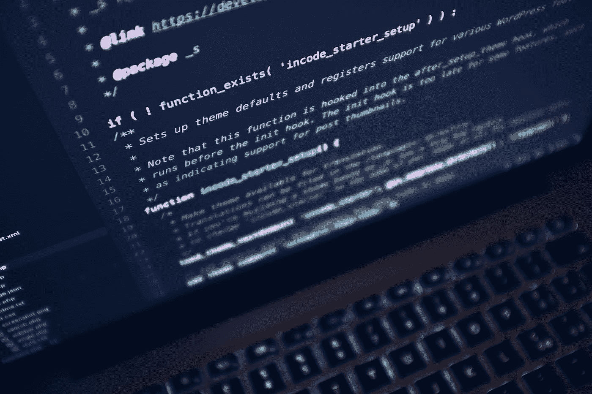
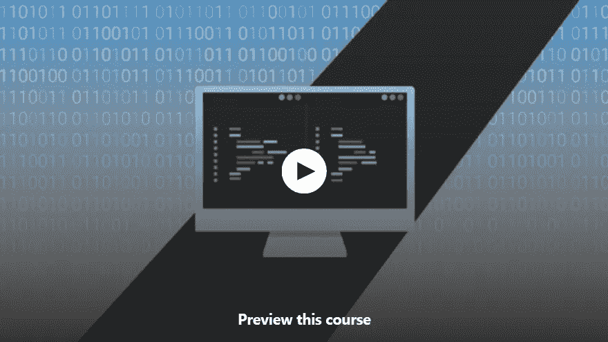
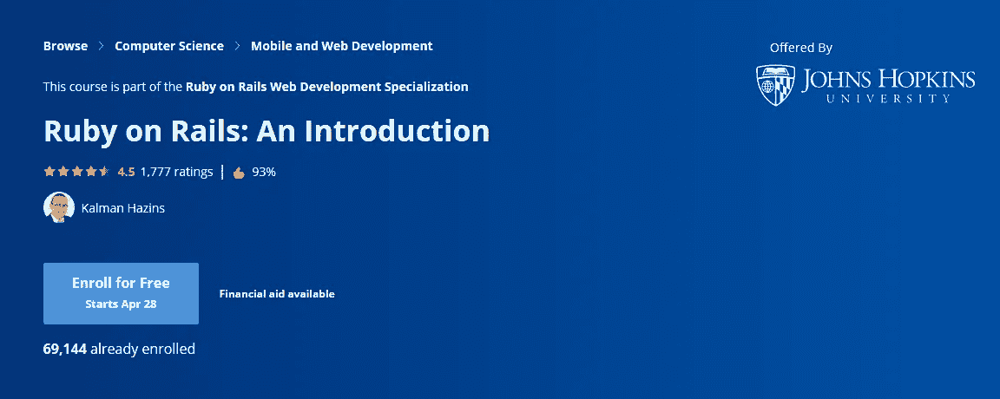
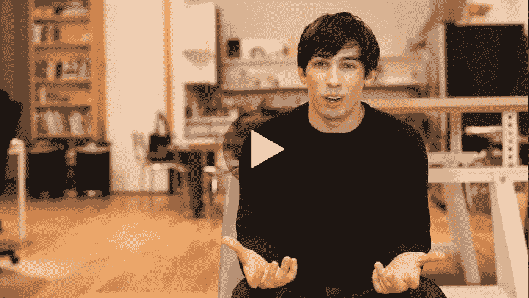
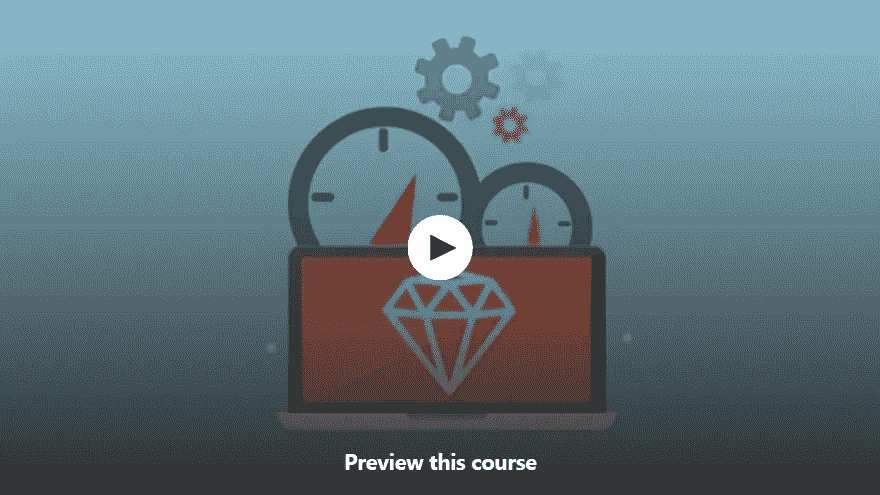
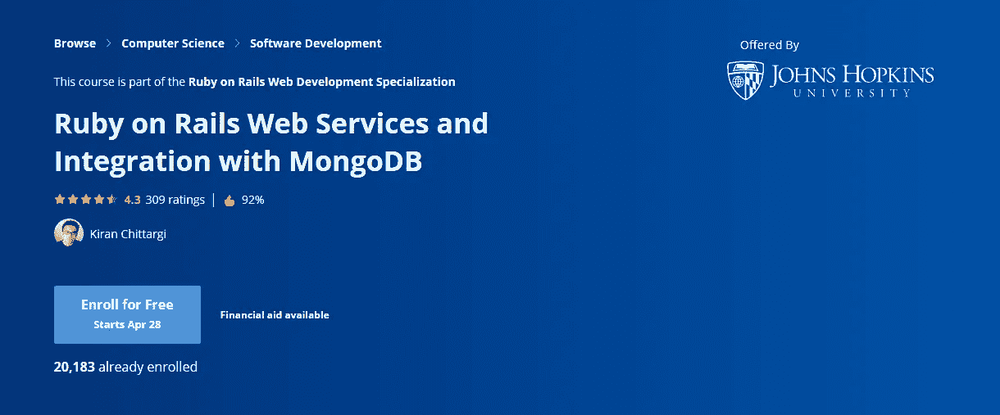
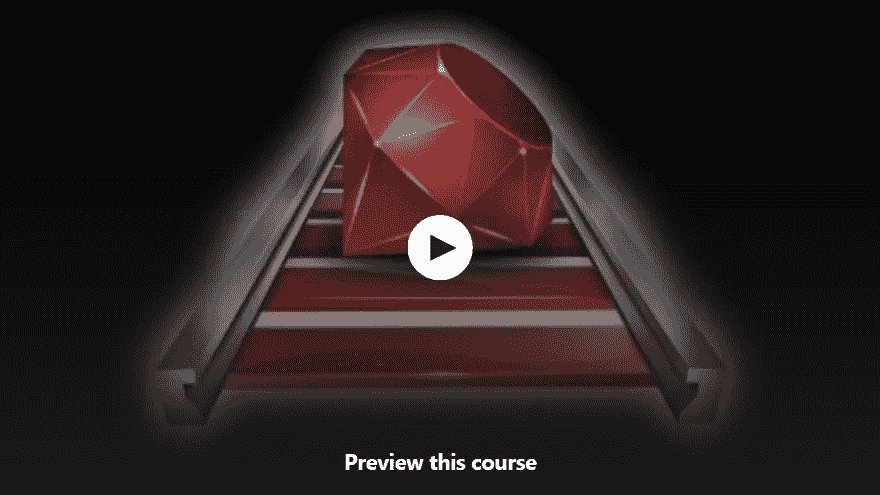

# 2023 年学习 Ruby 和 Rails 的 6 大免费课程——最好的

> 原文：<https://medium.com/javarevisited/top-5-free-courses-to-learn-ruby-and-rails-for-beginners-best-of-lot-e149fe03c964?source=collection_archive---------0----------------------->

卢卡·布拉沃在 [Unsplash](https://unsplash.com?utm_source=medium&utm_medium=referral) 上的照片

大家好，欢迎来到这个帖子，如果你想成为一名 Ruby web 开发人员，或者只是想学习 Ruby 编程语言和 web 开发的 Rails 框架，并寻找最好的免费 Ruby 课程，那么你来对地方了。

早些时候，我已经分享了 [**最好的 Ruby on Rails 课程**](/javarevisited/10-best-ruby-on-rails-courses-for-beginners-dca4d66e9f7b) ，在这里你会发现 2023 年在线学习 Ruby 编程语言和 Ruby on Rails 框架的一些最好的免费课程。

如果你不知道什么是 Ruby，什么是 Rails 框架，那么让我告诉你，它是最简单的编程语言之一，几乎没有语法。

如果你是编程新手或者以前从未编写过代码，那么开发一个 Ruby 应用程序将比选择任何其他编程语言如 Python 或 Java 要容易得多。

在开发 web 开发时，Ruby on Rails 还通过基于惯例做出一些有用的假设，使您的工作变得简单，这意味着您可以通过编写更少的代码来做更多的事情。它也是 web 开发最强大的框架之一，许多流行的网站如 Twitter、Groupon、Shopify、Github、LivingSocial 和 Yellowpages 都是使用 Ruby on Rails 构建的。

在这篇文章中，我将分享一些免费的在线课程，首先学习 [Ruby 编程语言](http://javarevisited.blogspot.sg/2015/03/top-10-popular-programming-languages-and-creators.html#axzz56u14w2sC)，然后从头开始学习 Ruby on Rails。顺便说一句，大多数 Rails 课程也会教你 Ruby，因为许多程序员都是从 Rails 本身开始学习编程的。我还选择了一些实践课程，这些课程不仅会告诉你理论，还会告诉你如何现场操作。这些课程中的大部分不仅教你 Ruby 的语法和规则以及如何运行 Ruby 程序，还会帮助你在 Windows 和 Linux 以及 Virtual Box 上安装 Ruby。

大部分课程也是基于项目的，教你如何使用 Ruby 和 Rails 开发 web 应用，从头开始创建 web 应用，如 TODO List、Twitter、Blogger、Wikipedia 等。

这实际上是学习新技术最有效的方法。通过看你的老师做事情，而不仅仅是看幻灯片，你会学到很多东西。

顺便说一句，如果你能花点钱并且不介意从付费资源中学习，那么你也可以在 Udemy 上查看 Rob Percival 的完整 Ruby on Rails 开发课程。

<https://click.linksynergy.com/deeplink?id=JVFxdTr9V80&mid=39197&murl=https%3A%2F%2Fwww.udemy.com%2Fcourse%2Fthe-complete-ruby-on-rails-developer-course%2F>  

# 2023 年 6 门最佳免费 Ruby 和 Rails 初学者课程

这里是我列出的一些免费学习 Ruby 编程语言和 Ruby on Rails 框架的最佳在线课程。尽管这个课程是没有报酬的，但是他们的质量非常好，尤其是 Coursera 中学习 Ruby 的课程，你应该参加这个课程，这样你就可以从中受益，并在今天学习一项新的技能。

我也在这个博客上分享了很多免费的编程资源，如果你是第一次来这里，你可能想通过搜索框找到关于 [Java](http://javarevisited.blogspot.sg/2017/11/top-5-free-java-courses-for-beginners.html#axzz4zuIICRs9) 、 [Spring](http://www.java67.com/2017/11/top-5-free-core-spring-mvc-courses-learn-online.html) 、 [Kotlin](http://javarevisited.blogspot.sg/2018/02/5-courses-to-learn-kotlin-programming-java-android.html#axzz56R4AatoQ) 、 [DevOps](http://www.java67.com/2018/02/6-free-maven-and-jenkins-online-courses-for-java-developers.html) 、 [JavaScript](/javarevisited/my-favorite-free-tutorials-and-courses-to-learn-javascript-8f4d0a71faf2) 、 [iOS](/javarevisited/my-favorite-free-courses-to-learn-ios-app-development-f172e7d3ba5d) 、 [Python](/javarevisited/10-free-python-tutorials-and-courses-from-google-microsoft-and-coursera-for-beginners-96b9ad20b4e6?source=collection_home---4------0-----------------------) 和[数据结构和算法](http://javarevisited.blogspot.sg/2018/01/top-5-free-data-structure-and-algorithm-courses-java--c-programmers.html)的免费在线课程

无论如何，让我们看看一些免费的 Ruby 和 Rails 课程，用 Ruby 和 Rails 开始你的 web 开发的美丽世界之旅，Ruby 和 Rails 是许多经验丰富的 web 开发人员的宠儿框架之一。

## 1. [**Ruby 适合绝对初学者！**](http://bit.ly/2EkAouW)

这是 Udemy 提供的一门初级免费课程，学习 Ruby 编程语言的基础知识。如果你对 Ruby 和编程本身都不熟悉，那么这是一门理想的入门课程。在学习开发 web 应用程序的 Ruby 框架 Rails 之前，学习 Ruby 编程本身是很重要的。因为 Ruby 几乎没有语法，所以它是最容易学习的编程语言。

**这里是免费报名本课程的链接—** [**Ruby 绝对初学者！**](http://bit.ly/2EkAouW)

如果你是编程新手或者之前没有编程知识，那么不要去任何地方，加入这个课程。课程的结构也很好，涵盖了 Ruby 的所有关键概念。它还会亲自动手，教你**如何在 Mac 和 Windows 上安装 Ruby**并设置你的开发环境。

## 2. [Ruby on Rails:简介](https://coursera.pxf.io/c/3294490/1164545/14726?u=https%3A%2F%2Fwww.coursera.org%2Fprojects%2Fgooglecloud-deploy-a-ruby-on-rails-app-to-app-engine-flexible-environment-lbcee)【Coursera 免费课程】

这是另一个从零开始学习 Ruby 和 Rails 的神奇课程。该课程将向您传授令人惊叹的强大的 Ruby on Rails 框架，它构成了令人惊叹的新网站和 Web 应用程序(如 Twitter、Github、Groupon 和 Yellowpages)的后端。该课程不需要任何 Ruby 知识，最适合初学者和中级 web 开发人员。到本系列结束时，您将能够开发有趣和令人兴奋的 web 应用程序和 web 解决方案。

您不仅会学到 Ruby on Rails，还会学到使用 web 应用程序所需的其他有用工具，比如从 Github 和 Heroku 下载代码来部署 web 应用程序的 [Git](http://javarevisited.blogspot.sg/2018/01/5-free-git-courses-for-programmers-to-learn-online.html) 。

**这里是免费报名本课程的链接—** [**Ruby on Rails:简介**](https://coursera.pxf.io/c/3294490/1164545/14726?u=https%3A%2F%2Fwww.coursera.org%2Fprojects%2Fgooglecloud-deploy-a-ruby-on-rails-app-to-app-engine-flexible-environment-lbcee)

在进入 web 开发和 Ruby on Rails 之前，该课程还会教你 Ruby 编程语言的基础知识。您将学习控制器视图、路线、使用模型和数据库、搭建和主动管理、布局、演示和测试。

总体来说，从零开始学习 Ruby 和 Ruby on Rails 最全的课程之一。

顺便说一句，如果你觉得 Coursera 的课程有用，因为它们是由知名公司如**谷歌**、 **IBM** 、**亚马逊**和世界上最好的大学创建的，我建议你加入 Coursera 的年度订阅计划<https://coursera.pxf.io/c/3294490/1164545/14726?u=https%3A%2F%2Fwww.coursera.org%2Fcourseraplus>**。**

**这种单次订阅可以让你无限制地访问他们最受欢迎的**课程**、**专业**、**专业证书**和**指导项目**。它每年花费大约 399 美元，但是它完全值得你的钱，因为你得到了无限的证书。**

****

## **[3。用一个月 Rails 构建 Web 应用程序](https://click.linksynergy.com/fs-bin/click?id=JVFxdTr9V80&subid=0&offerid=323058.1&type=10&tmpid=14538&RD_PARM1=https%3A%2F%2Fwww.udemy.com%2Fone-month-rails%2F)**

**这是免费在线学习 Ruby 的最好和最新的课程之一。作者 Mattan Griffel 是 One Month 的创始人，这是一家初创公司，承诺在一个月内教你一项新技术。在这个为期一个月的 Rails 课程中，您将学习如何使用最强大和用户友好的 web 开发框架 Ruby on Rails 编写自己的 web 应用程序。本课程不仅会教你如何使用 Ruby on Rails，还会向你展示如何使用 Bootstrap 来设计你的 web 应用，以及如何使用 Heroku 来部署和上线。**

> **这里是免费注册这个课程的链接 **—** [用一个月 Rails 构建网络应用](https://click.linksynergy.com/fs-bin/click?id=JVFxdTr9V80&subid=0&offerid=323058.1&type=10&tmpid=14538&RD_PARM1=https%3A%2F%2Fwww.udemy.com%2Fone-month-rails%2F)**

****

**在本课程中，作者还向您展示了如何构建像 Twitter 这样的 Ruby web 应用程序，您可以在其中添加推文和上传图片。简而言之，一个月内学习 Ruby on Rails 最好的免费在线课程之一。**

## **[**4。学习 Rails:快速编码、设计和启动 4 个 Web 应用**](https://click.linksynergy.com/fs-bin/click?id=JVFxdTr9V80&subid=0&offerid=323058.1&type=10&tmpid=14538&RD_PARM1=https%3A%2F%2Fwww.udemy.com%2Flearn-rails%2F)**

**这是另一个来自 Udemy 的免费课程，用来快速学习 Ruby on Rails。这个课程将为你提供足够的 Ruby on Rails 知识，让你从初级到中级。本课程将通过制作 4 个项目来快速教你如何使用 Rails 创建 web 应用程序:个人博客、用户消息应用程序、待办事项列表和维基百科克隆。**

> **这里是免费报名这个课程的链接 **—** [**学习 Rails:快速编码、样式化、启动 4 个 Web 应用**](https://click.linksynergy.com/fs-bin/click?id=JVFxdTr9V80&subid=0&offerid=323058.1&type=10&tmpid=14538&RD_PARM1=https%3A%2F%2Fwww.udemy.com%2Flearn-rails%2F)**

****

**该课程不仅教你 Ruby 和 Rails，还教你开发 web 所需的其他工具，如 Git、Heroku、Bootstrap、Active Admin、 [MVC 架构](http://javarevisited.blogspot.sg/2017/06/how-spring-mvc-framework-works-web-flow.html#axzz55vF5ugU8)等。该课程也是一门端到端的课程，这意味着你将从安装到部署学习 Ruby。学完本课程后，您应该能够创建自己的具有 CRUD(创建、读取、更新和删除)功能的 web 应用程序。**

## **5. [Ruby on Rails Web 服务以及与 MongoDB 的集成](https://coursera.pxf.io/c/3294490/1164545/14726?u=https%3A%2F%2Fwww.coursera.org%2Fprojects%2Fgooglecloud-deploy-a-ruby-on-rails-app-to-app-engine-flexible-environment-lbcee)**

**这是 Coursera 的另一个免费课程，学习 Ruby on Rails。在本课程中，您将学习如何使用 Rails 和 MongoDB 作为后端来创建 web 服务。**

**该课程提供了从安装到 CRUD 操作、聚合、索引、GridFS 和各种其他主题的深入知识，在这些主题中，我们不断地将 [MongoDB](https://javarevisited.blogspot.com/2019/01/top-5-mongodb-online-training-courses.html) 与 Ruby on Rails 相集成。**

**本课程还涵盖了 Web 服务，重点是 REST、其架构风格以及 Web 服务与 Rails 的集成。web 服务的核心概念，如请求/响应、过滤器、数据表示(XML/JSON)、Web 链接和最佳实践也将深入讨论。**

**这里是免费注册本课程的链接**—**[**Ruby on Rails Web Services 以及与 MongoDB 的集成**](https://coursera.pxf.io/c/3294490/1164545/14726?u=https%3A%2F%2Fwww.coursera.org%2Fprojects%2Fgooglecloud-deploy-a-ruby-on-rails-app-to-app-engine-flexible-environment-lbcee)**

****

**像其他 [Coursera 课程和认证](/javarevisited/top-10-coursera-certificates-to-start-your-career-in-cloud-data-science-ai-mainframe-and-it-558690c83587?source=extreme_sidebar---------0-2----------------------)一样，这也是免费审核的，这意味着你可以免费访问这个课程，但如果你需要证书显示在你的 LinkedIn 个人资料中，你需要付费。**

## **[**6。Ruby on Rails 初学者指南**](https://click.linksynergy.com/fs-bin/click?id=JVFxdTr9V80&subid=0&offerid=323058.1&type=10&tmpid=14538&RD_PARM1=https%3A%2F%2Fwww.udemy.com%2Fruby-on-rails-a-beginners-guide-free%2F)**

**这是 Udemy 的另一个免费的 Ruby on Rails 课程，专门针对初学者和新开发人员。本课程首先教你一个 web 应用程序是如何工作的，以及 web 应用程序的一些基本部分，如前端、后端、数据库等。

它还解释了像 [Git 版本控制](http://javarevisited.blogspot.sg/2018/01/10-tools-every-software-developer-know.html)这样的基本工具，比如如何将你的 IDE 与 GitHub 链接，如何用 SSH 访问更新你的 IDE，以及如何从 GitHub 下载 Ruby 项目。在设计 web 应用程序时，它会教你如何使用 Gems 和 Bootstrap 来完成。它还向您展示了在哪里可以找到很酷的引导布局，您可以简单地将它们放入您的应用程序中。**

**这里是免费报名本课程的链接—**[**Ruby on Rails 初学者指南**](https://click.linksynergy.com/fs-bin/click?id=JVFxdTr9V80&subid=0&offerid=323058.1&type=10&tmpid=14538&RD_PARM1=https%3A%2F%2Fwww.udemy.com%2Fruby-on-rails-a-beginners-guide-free%2F)****

********

****以上是关于学习 Ruby 编程语言和 Ruby on Rails web 开发框架的一些免费课程。Ruby on Rails 是开发 web 应用程序的最简单也是最强大的框架之一，许多流行的网站如 Twitter、Shopify、Github、LivingSocial、Groupon 和 Yellowpages 都是使用它构建的。

如果你对 web 开发有热情，或者你只是想给你的简历添一点点书，学习 Ruby 和 Rails 将会对你大有帮助。

其他**免费在线课程** **和文章**你可能喜欢探索
[完整的 Web 开发者路线图](/hackernoon/the-2019-web-developer-roadmap-ab89ac3c380e)
[学习 Python 编程的 15 大免费课程](/swlh/5-free-python-courses-for-beginners-to-learn-online-e1ca90687caf)
[成为 Python 高手你可以做的 8 个项目](/javarevisited/8-projects-you-can-buil-to-learn-python-in-2020-251dd5350d56)
[10 个角度课程学习前端开发](/javarevisited/10-courses-to-learn-angular-for-web-development-6da1bd2856dc)
[10 本书深入学习角度框架](/javarevisited/top-10-angular-books-and-courses-for-beginners-and-experienced-web-developers-best-of-lot-9a2dae87f04c)
 <http://javarevisited.blogspot.sg/2018/01/5-free-git-courses-for-programmers-to-learn-online.html#axzz568Oo1Jao> [5 门面向 Java 和 DevOps 工程师的免费 Docker 课程](http://www.java67.com/2018/02/5-free-docker-courses-for-java-and-DevOps-engineers.html)
[5 门免费学习 Angular 的在线培训课程](http://www.java67.com/2018/01/top-5-free-angular-js-online-courses-for-web-developers.html)
[5 门面向应用程序开发人员和系统管理员的免费 Linux 课程](http://www.java67.com/2018/02/5-free-linux-unix-courses-for-programmers-learn-online.html)
[Udemy](http://javarevisited.blogspot.sg/2018/01/top-10-udemy-courses-for-java-and-web-developers.html#axzz56TUKbQgM)
[10 门 Java 和 Web 开发课程中的 10 门 Java 和 Web 开发课程](http://javarevisited.blogspot.sg/2017/12/top-10-pluralsight-courses-java-and-web-developers.html)
[3 本书和课程学习 Java 的 RESTful Web 服务](http://www.java67.com/2018/02/3-books-and-courses-to-learn-restful-web-services-with-spring.html)****

****感谢您阅读本文。如果你喜欢这些免费的 Ruby 和 Rails 课程，请与你的朋友和同事分享。如果您有任何问题或反馈，请留言。****

****如果你能花几块钱并且不介意从付费资源中学习，那么你也可以在 Udemy 上查看由 Rob Percival 编写的完整的 Ruby on Rails 开发者课程<https://click.linksynergy.com/deeplink?id=JVFxdTr9V80&mid=39197&murl=https%3A%2F%2Fwww.udemy.com%2Fcourse%2Fthe-complete-ruby-on-rails-developer-course%2F>**。******

## ******你可能喜欢的其他媒体文章******

******</free-code-camp/these-are-the-best-free-courses-to-learn-data-structures-and-algorithms-in-depth-4d52f0d6b35a>  </javarevisited/100-free-programming-and-web-development-courses-on-udemy-free-resource-center-3f8415eb5e6f>  </javarevisited/7000-free-pluralsight-courses-to-build-in-demand-tech-skills-without-leaving-your-house-40edb50a8cf2> ******