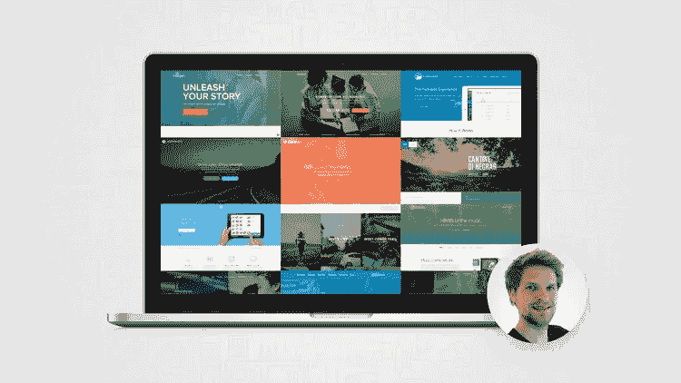
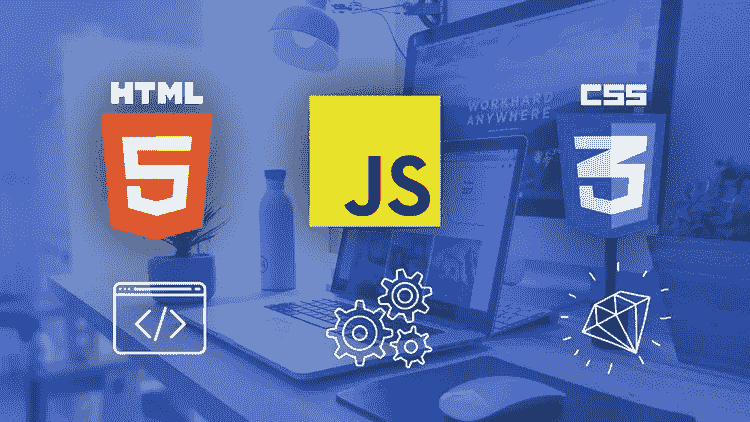
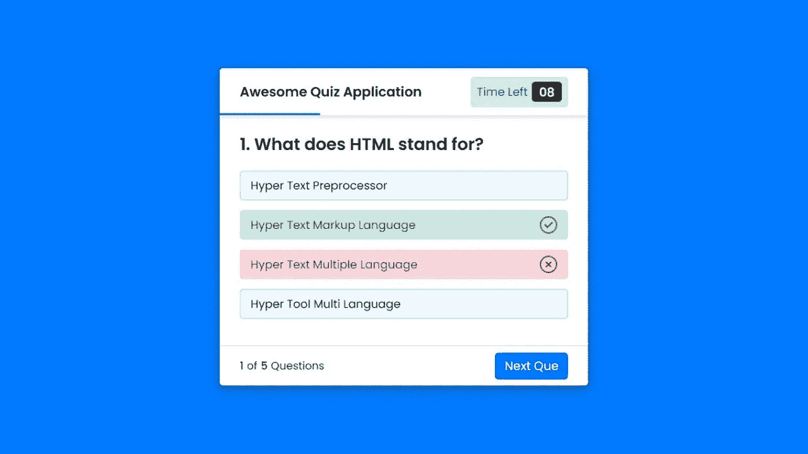

# 2023 年学习网页设计的 6 大免费课程——最好的

> 原文：<https://medium.com/javarevisited/top-5-free-courses-to-learn-web-design-in-2021-27beb817944f?source=collection_archive---------0----------------------->

## 这些是 Udemy、Pluralsight 和 Coursera 为初学者在 2023 年加入的最好的免费网页设计在线课程。

大家好，如果你想成为一名网页设计师，并在 2023 年寻找学习网页设计的免费在线课程，那么你来对地方了。以前我分享过学习网页设计关键技能的最好的免费在线资源像 [HTML](https://www.java67.com/2018/02/5-free-html-and-css-courses-to-learn-web-development.html) 、 [CSS](https://javarevisited.blogspot.com/2019/05/top-5-html-5-and-css-3-courses-for-web-developers.html) 、 [JavaScript](https://www.java67.com/2019/01/best-websites-to-learn-javascript-online.html) 、 [Bootstrap](/javarevisited/7-free-courses-to-learn-bootstrap-for-web-designers-and-developers-5135215648f1) ，今天我要分享 2023 年学习网页设计的*最好的免费资源*。

这些免费课程是由像 Jonas Schmedtmann 这样的专家导师创建的，它们来自像<https://click.linksynergy.com/fs-bin/click?id=JVFxdTr9V80&offerid=323058.9410&type=3&subid=0>****[**Coursera**](https://coursera.pxf.io/c/3294490/1164545/14726?u=https%3A%2F%2Fwww.coursera.org%2F)**[**plural sight**](https://pluralsight.pxf.io/c/1193463/424552/7490?u=https%3A%2F%2Fwww.pluralsight.com%2Flearn)和 [**Educative**](https://www.educative.io/subscription?affiliate_id=5073518643380224) 这样的网站。你可以使用这些*免费在线课程*来学习这些有价值的技能，成为一名网页设计师和开发者。在这个数字时代，几乎没有人能够离开网络而生存。网络已经成为我们的生活方式，在疫情的情况下，拥有良好的互联网连接是必要的。在这个时候，拥有一个网站对于任何企业的生存都是非常重要的，因此对网页设计师和网页开发人员的需求非常高。网页设计和开发是获得软件开发工作和自由职业者工作的关键技能。如果你一直想学习网页设计和开发，并寻找一些免费的在线培训课程，那么你来对地方了。

回到网络和对[网页设计师的需求](/javarevisited/7-free-online-courses-to-become-a-web-designer-and-frontend-developer-in-2020-dca73bc7fdc4)，从购买食物到预订出租车，一切都需要互联网，有些特定的操作只能通过互联网进行。由于互联网如此重要，每个企业都试图在互联网上扩张。现在互联网上有超过 10 亿个网站。

互联网的发展为网站开发者和程序员打开了一系列的机会。几年前，网页开发和图形设计被认为是兼职工作。但是现在，这两个职业被认为是最好的。如果你期待在网络开发领域有一个光明和成功的职业生涯，那么你来对地方了。今天，你将了解到 **5 个最好的免费网页设计和开发课程**，这些课程可以帮助你在你梦想的公司里找到你梦想的工作，成为一名网页开发员。所有这些课程都是免费的，受到全球数百名学生的信任。******

****顺便说一句，如果你不介意花几块钱学习网页设计这样的关键技术，那么你也可以看看我最喜欢的 Udemy 网站导师之一 Jonas Schmedtmann 教授的 [**用 HTML5 和 CSS3**](https://click.linksynergy.com/deeplink?id=JVFxdTr9V80&mid=39197&murl=https%3A%2F%2Fwww.udemy.com%2Fcourse%2Fthe-complete-javascript-course%2F) 构建响应性真实世界网站课程。你可以在 Udemy 销售网站上花 10 美元买到这个价值 200 美元的课程。****

****<https://click.linksynergy.com/deeplink?id=JVFxdTr9V80&mid=39197&murl=https%3A%2F%2Fwww.udemy.com%2Fcourse%2Fthe-complete-javascript-course%2F>  

# 2023 年 6 门适合初学者在线学习的最佳免费网页设计课程

下面是使用 [HTML](https://www.java67.com/2020/08/5-best-online-courses-to-learn-html-5.html) 、 [CSS](https://javarevisited.blogspot.com/2020/09/top-5-css-cascading-style-sheet-courses-for-beginners.html) 、 [JavaScript](/javarevisited/top-6-javascript-frameworks-you-can-learn-to-become-a-truly-fullstack-developer-27561a8cf2e0) 、 [Bootstrap](https://javarevisited.blogspot.com/2020/07/top-5-courses-to-learn-bootstrap-in.html) 以及其他[框架](/javarevisited/top-10-free-courses-to-learn-react-js-c14edbd3b35f?source=extreme_main_feed----d3a191ac6ed-----5-1--------------------561c2dc6_a2b4_41e0_b7be_1d97edbf631c--8)和库学习网页设计和开发的最佳免费在线培训课程列表。

这些课程在法律上是免费的，由他们的讲师和作者出于教育和营销目的免费提供，一旦你加入，它们将在课程的一生中保持免费。

这意味着即使你现在没有学，以后想学，你也应该参加课程，至少你的账户里有课程供以后参考。

## 1.[网页开发人员的网页设计:创建漂亮的网站](https://click.linksynergy.com/deeplink?id=JVFxdTr9V80&mid=39197&murl=https%3A%2F%2Fwww.udemy.com%2Fcourse%2Fweb-design-secrets%2F)

这可能是在线学习网页设计的最好的免费速成课程，在短短 1 个小时内，你将学会 25 个以上简单易用的规则和指南。

本课程由 Jonas Schmedtmann 创建，他是我最喜欢的 Udemy 导师之一，也是 Udemy 上最好的 JavaScript 和 HTML5 课程的创建者，也是 Udemy 上 [*用 HTML 5 和 CSS3*](http://bit.ly/2AHSpl6) 课程构建响应式真实世界网站的作者。

以下是你将在本课程中学到的关键技能:

*   如何让文字看起来设计专业
*   如何正确运用色彩的力量
*   如何免费获得和使用令人惊叹的图像、字体和图标，让你的网站大放异彩。
*   如何使用空白和视觉层次创建布局
*   如何激励自己学习更多关于网页设计的知识
*   如何使用 8 种简单易用的技术让你的网站转换得更好

我真的很喜欢他的教学风格和他在课程中提供的动手实践。虽然这个课程很短，但它充满了内容和惊人的网页设计资源。例如，当你加入本课程时，你将免费获得电子书《HTML5 & CSS3 网页设计和开发的最佳资源》。

**这里是加入这个免费网页设计课程的链接**——[网页开发人员的网页设计:创建漂亮的网站](https://click.linksynergy.com/deeplink?id=JVFxdTr9V80&mid=39197&murl=https%3A%2F%2Fwww.udemy.com%2Fcourse%2Fweb-design-secrets%2F)

****

## ****2.[Web 开发人员入门](https://click.linksynergy.com/deeplink?id=JVFxdTr9V80&mid=39197&murl=https%3A%2F%2Fwww.udemy.com%2Fcourse%2Frefactoru-getting-started-as-a-web-developer%2F)(免费 Udemy 课程)****

****这个免费的在线 web 开发课程将帮助你理解 web 开发中使用的基本元素。在本课程中，讲师将指导您完成以下工作:****

*   ****崇高文本 3****
*   ****[Github](/javarevisited/7-best-courses-to-master-git-and-github-for-programmers-d671859a68b2)****
*   ****命令行****
*   ****谷歌 Chrome 开发者工具。****

****基本上，这个课程将会介绍网页开发的每一个重要元素。除此之外，你还将学习如何使用 chrome 开发者工具，帮助你调试内置在谷歌 chrome 浏览器中的应用程序。这是一个 60 分钟的视频课程，评分为 4 分(满分为 5 分)，到目前为止，已有 5 万名学生报名参加。****

****以下是加入本课程的链接—[Web 开发人员入门](https://click.linksynergy.com/deeplink?id=JVFxdTr9V80&mid=39197&murl=https%3A%2F%2Fwww.udemy.com%2Fcourse%2Frefactoru-getting-started-as-a-web-developer%2F)****

********

****这门课程非常适合那些想要简单了解专业网站开发的人。****

## ****3.[网页开发者课程 HTML CSS JavaScript 学习网页设计](https://click.linksynergy.com/deeplink?id=JVFxdTr9V80&mid=39197&murl=https%3A%2F%2Fwww.udemy.com%2Fcourse%2Fweb-developer-course-on-creating-a-business-website%2F)****

****如果你正在寻找一个免费的在线课程，可以帮助你学习所有与 web 开发相关的编程语言，那么这个课程就是为你准备的。在本课程中，讲师将向您传授以下语言的所有知识:****

*   ****[HTML](/javarevisited/top-10-free-courses-to-learn-html-5-css-3-and-web-development-872d62d97a97)****
*   ****[CSS](https://www.java67.com/2020/06/top-5-courses-to-learn-advanced-css.html)****
*   ****[JavaScript](/javarevisited/10-best-online-courses-to-learn-javascript-in-2020-af5ed0801645)****

****在本课程的后面，你将学习如何使用这三种语言创建网站，最后，你将被分配一个任务来完成。在这个任务中，你必须用你在这个课程中学到的知识创建一个完整的网站。

这是一个 5 小时长的视频课程，有 82 节课。这是一个关于网站开发的详细魔咒，如果你想从头开始，可以加入其他四万名学生的这个课程。****

****这是加入免费 HTML/CSS 课程的链接— [学习网页设计](https://click.linksynergy.com/deeplink?id=JVFxdTr9V80&mid=39197&murl=https%3A%2F%2Fwww.udemy.com%2Fcourse%2Fweb-developer-course-on-creating-a-business-website%2F)****

********

## ****4.[通过创建社交网络学习网络开发](https://click.linksynergy.com/deeplink?id=JVFxdTr9V80&mid=39197&murl=https%3A%2F%2Fwww.udemy.com%2Fcourse%2Fmeteor-tutorial%2F)****

****如果你的理想目标是创建一个像脸书或 Instagram 这样的社交媒体平台，那么这个免费的在线培训课程特别适合你。这是一门以项目为基础的课程，你将按照分步指南创建一个社交网络项目。****

****本课程非常详细，关注于网络开发的每一个小细节。它有 81 个 7 小时的视频讲座，超过 2 万名学生注册了这门课程，它的评分为 4.3 分(满分 5 分)。

在本课程中，讲师将教授以下内容:****

*   ****[HTML](/javarevisited/10-best-html-and-css-courses-for-beginners-in-2021-6757eec00032)****
*   ****[CSS](/javarevisited/top-5-advanced-css-courses-to-learn-flexbox-grid-and-sass-da8e37b09b1d?source=---------8------------------)****
*   ****[JavaScript](/javarevisited/10-best-online-courses-to-learn-javascript-in-2020-af5ed0801645)****
*   ****[Meteor.js](/javarevisited/10-of-the-most-popular-javascript-frameworks-libraries-for-web-development-in-2019-a2c8cea68094) 和 [MongoDB](https://javarevisited.blogspot.com/2019/01/top-5-mongodb-online-training-courses.html) 框架****

****除此之外，你还将学习如何创建一个用户注册网页，任何用户都可以注册或登录。为了创建一个成熟的社交媒体网站，教师会给你所有你需要的信息。****

****这里是加入这个网络开发课程的链接。[通过创建社交网络学习网络开发](https://click.linksynergy.com/deeplink?id=JVFxdTr9V80&mid=39197&murl=https%3A%2F%2Fwww.udemy.com%2Fcourse%2Fmeteor-tutorial%2F)****

********

## ****5.用 HTML、CSS 和 JavaScript 构建一个测验应用程序****

****如果你正在寻找一个特定的在线课程来学习网页设计的核心技术，如 HTML、CSS 和 JavaScript，那么这个课程就是为你准备的。在本课程中，讲师詹姆斯·奎克将教你如何创建一个测验网站。****

****这个测验网站将从零开始建立，它将具有高端网站包含的所有功能。****

****这是一个 2 小时长的视频课程，已有超过 48，000 名学生注册。如果你正在寻找一个简单的课程，那么这是你的最佳选择。但是请注意，你需要对 [HTML](/javarevisited/5-free-html-and-css-courses-to-learn-front-end-web-development-online-8b04517c6ecb?source=---------85------------------) 和 [CSS](https://javarevisited.blogspot.com/2020/09/top-5-css-cascading-style-sheet-courses-for-beginners.html) 有基本的了解。

在这个过程中，您将学习使用 CSS 语言的几种复杂转换。除此之外，您将只使用 CSS 语言创建网站中使用的所有元素。****

******这是加入这个项目课程的链接**——[用 HTML、CSS 和 JavaScript 构建一个测验应用](https://click.linksynergy.com/deeplink?id=JVFxdTr9V80&mid=39197&murl=https%3A%2F%2Fwww.udemy.com%2Fcourse%2Fbuild-a-quiz-app-with-html-css-and-javascript%2F)****

********

## ****6.[面向所有人的网页设计:网页开发基础&编码](https://coursera.pxf.io/c/3294490/1164545/14726?u=https%3A%2F%2Fwww.coursera.org%2Fspecializations%2Fweb-design)****

****这门课程是专门为初学者设计的。一切都将从零开始教授，这就是为什么它有超过 100 小时的视频讲座。基本上， [Coursera specialization](https://javarevisited.blogspot.com/2020/08/top-10-coursera-courses-specilizations-and-certifications.html) 是一个小组，当然，它有 5 个不同的子课程，每个子课程涵盖一个特定的 web 开发主题。一旦你完成了这门课程，你将不再需要任何其他的教程或讲座来继续你的 web 开发职业。网站开发的每一个方面都有详细的解释，在几堂课之后，会准备适当的作业，让学生测试他们的技能。迄今为止，已有 120 万名学生注册了这门课程，每个学生都对这门课程所传授的知识感到满意。如果你正在寻找一个一站式解决方案，看看这个吧。****

******这里是加入这个网页设计课程**——[为大家设计网页](https://coursera.pxf.io/c/3294490/1164545/14726?u=https%3A%2F%2Fwww.coursera.org%2Fspecializations%2Fweb-design)的链接****

********

****顺便说一句，如果你计划参加多个 Coursera 课程或专业，那么考虑参加[**Coursera Plus**](https://coursera.pxf.io/c/3294490/1164545/14726?u=https%3A%2F%2Fwww.coursera.org%2Fcourseraplus)**，它将为你提供无限制的访问他们最受欢迎的课程、专业、专业证书和指导项目的机会。它每年花费大约 399 美元，但它完全值得你的钱，因为你可以获得无限的证书。******

******<https://coursera.pxf.io/c/3294490/1164545/14726?u=https%3A%2F%2Fwww.coursera.org%2Fcourseraplus>  

以上就是 2023 年学习网页设计的**最佳免费在线培训课程。Web 开发不是一门学科，是一门技能。你可以在生活的任何阶段发展这种技能，如果你有规律，每天花几个小时学习，需要几周的时间。

以上列出的所有课程都是精选的，都是班上最好的，最重要的是它们是免费的。你可以依靠这些免费课程。完成这些课程后，你会感到自信，但建议至少参加 2-3 门课程，以便对 web 开发有一个清晰的了解。

其他**你可能喜欢探索的网页设计和网页开发文章****

*   [2023 年要学的 10 个必备前端技能](https://www.java67.com/2020/10/best-frontend-skills-web-developer.html)
*   [学习响应式网页设计的 5 门最佳课程](https://www.java67.com/2020/08/top-5-courses-to-learn-responsive-web-design-best.html)
*   [成为全栈式 Web 开发人员的 10 大在线课程](/@javinpaul/top-10-online-courses-to-become-a-fullstack-web-developer-in-2020-d608a6b63232)
*   [Java 和 Web 开发人员应该学习的 10 个框架](http://javarevisited.blogspot.sg/2018/01/10-frameworks-java-and-web-developers-should-learn.html)
*   [Web 开发人员学习 Angular 的 10 门免费课程](https://javarevisited.blogspot.com/2019/04/10-free-angular-and-react-courses-for.html)
*   [10 JavaScript 教程 Web 开发人员应该查看](https://javarevisited.blogspot.com/2018/06/top-10-courses-to-learn-javascript-in.html)
*   [在线学习 React.js 的五大课程](https://javarevisited.blogspot.com/2018/08/top-5-react-js-and-redux-courses-to-learn-online.html)
*   [学习使用 Python 进行全栈 web 开发的 5 门课程](https://javarevisited.blogspot.com/2020/06/top-5-courses-to-learn-python-full-stack-web-development.html)
*   [2023 年学习 Web 开发的十大课程](https://dev.to/javinpaul/top-6-courses-to-learn-web-development-best-of-lot-2fae)
*   [2023 年前端开发者路线图](https://javarevisited.blogspot.com/2019/02/the-2019-web-developer-roadmap.html)
*   [2023 年学习 JavaScript 的 12 门免费课程](/javarevisited/12-free-courses-to-learn-javascript-and-es6-for-beginners-and-experienced-developers-aa35874c9a32)
*   [学习 Node.js 和 Express.js 框架的前 5 门课程](http://javarevisited.blogspot.sg/2018/01/top-5-nodejs-and-express-js-online-courses-for-web-developers.html)
*   [2023 react . js 开发者路线图](https://javarevisited.blogspot.com/2018/10/the-2018-react-developer-roadmap.html)
*   [学习网页开发打字稿的 10 门免费课程](/javarevisited/top-10-free-typescript-courses-to-learn-online-best-of-lot-44bce9da41d1)
*   [每个 Fullstack 开发者都应该知道的 10 个框架](https://javarevisited.blogspot.com/2019/01/10-web-development-frameworks-fullstack-developer-should-learn.html)
*   [Web 开发的五大 Python 框架](https://javarevisited.blogspot.com/2019/04/top-5-python-web-development-frameworks.html)
*   [2023 年学习 WordPress 的 5 门最佳在线课程](https://javarevisited.blogspot.com/2020/08/top-5-courses-to-learn-wordpress-in.html)
*   [2023 年学习渐进式网络应用的 5 门课程](https://javarevisited.blogspot.com/2020/08/top-5-courses-to-learn-progressive-web-app-development.html)
*   [成为全栈 Java 开发者的 10 门免费课程](/javarevisited/10-free-full-stack-java-development-courses-for-beginners-and-experienced-programmers-8473390bec03)

感谢您阅读本文。如果你喜欢这些*最好的免费网页设计课程，*那么请与你的朋友和同事分享。如果您有任何问题或反馈，请留言。

如果你不介意花几块钱去学习像网页设计这样有价值的东西，并且需要一门全面的网页设计课程，那么我强烈推荐你去看看由布拉德·希夫教授的[**初学者网页设计**](https://click.linksynergy.com/deeplink?id=JVFxdTr9V80&mid=39197&murl=https%3A%2F%2Fwww.udemy.com%2Fcourse%2Fweb-design-for-beginners-real-world-coding-in-html-css%2F) 课程，Udemy 上最好的网页设计课程之一。

<https://click.linksynergy.com/deeplink?id=JVFxdTr9V80&mid=39197&murl=https%3A%2F%2Fwww.udemy.com%2Fcourse%2Fweb-design-for-beginners-real-world-coding-in-html-css%2F> ******