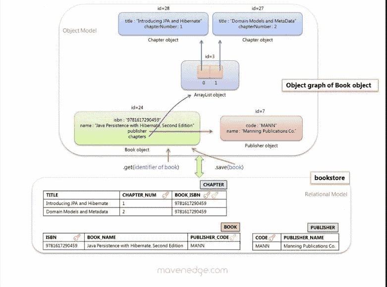
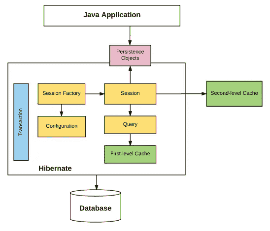
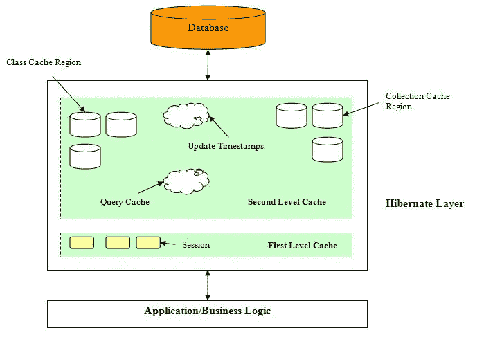

# 2023 年面向 Java 开发者的 6 门最佳 Hibernate 和 JPA 在线课程

> 原文：<https://medium.com/javarevisited/top-5-hibernate-online-training-courses-for-beginners-and-advance-java-programmers-469460596b2b?source=collection_archive---------0----------------------->

## Hibernate 是 Java 开发人员的一项关键技能，这些是在线学习 Hibernate 的最佳课程。

大家好，如果你想在 2023 年学习 Hibernate，并寻找最好的 Hibernate 和 JPA 在线课程，那么你来对地方了。前面我已经分享了 [**最佳 Spring 框架课程**](/javarevisited/10-best-online-courses-to-learn-spring-framework-in-2020-f7f73599c2fd) 和 [**最佳 Hibernate 和 JPA 书**](/javarevisited/top-5-books-to-learn-hibernate-for-java-developers-b2cb4b16ccd6?source=---------14------------------) **s** ，今天我要分享的是 2023 年加入的最佳 Hibernate 在线课程。

Hibernate 是 Java 和 Java EE 或 JEE 程序员的基本框架之一，尤其是当你在 Java web 开发项目的服务器端工作时。

它是一个 ORM 工具或框架，允许你只处理对象，而 Hibernate 代表你处理数据。例如，您可以在项目中简单地使用 Hibernate 框架，而不是使用 SQL 编写类来使用 [DAO 设计模式](http://javarevisited.blogspot.sg/2013/01/data-access-object-dao-design-pattern-java-tutorial-example.html)加载、保存和更新数据。

它将允许您只处理对象，而它将在后台处理`load`、`save`和`update` 数据。Hibernate 只是给你一个现成的对象，并在对象状态改变时负责更新数据，而不是将数据加载到数据库或从数据库保存数据，然后填充对象。

这只是使用 Hibernate 的一个好处，另一个好处是它提供了内置的**缓存**。Hibernate 维护了几个缓存，比如第一级缓存、[第二级缓存](http://javarevisited.blogspot.sg/2017/03/difference-between-first-and-second-level-cache-in-Hibernate.html)和[查询缓存](http://www.java67.com/2016/02/top-20-hibernate-interview-questions.html#ixzz518nkBdHI)，它们可以保存经常使用的数据，以提高 Java 应用程序的性能。

你不需要担心数据变大或者缓存变得越来越大，Hibernate 可以管理**缓存回收**以及如何保持它最新。如果你只使用 Hibernate 来接触你的数据，那么它总是最新的。

Hibernate 的使用也让你的应用程序更具有可移植性，比如明天，如果你的公司决定从[微软 SQL Server](http://www.java67.com/2018/02/5-free-oracle-and-microsoft-sql-server-online-courses.html) 切换到 Oracle，或者从 [MySQL](https://javarevisited.blogspot.com/2018/05/top-5-mysql-courses-to-learn-online.html) 切换到 [PostgreSQL](https://javarevisited.blogspot.com/2020/02/top-5-courses-to-learn-postgresql-in.html) ，你不需要重新编写任何 SQL 查询。您所需要做的就是在 Hibernate 配置文件中更改 SQL 方言，这样就完成了。

如果您选择编写数据访问对象和 SQL，您将不得不重写大部分的 [SQL](/javarevisited/7-free-courses-to-learn-database-and-sql-for-programmers-and-data-scientist-e7ae19514ed2) 来将您的应用程序从一个数据库移植到另一个数据库。

我过去有过这样的经历，当我们从 [Oracle 迁移到 SQL Server](/javarevisited/top-10-free-courses-to-learn-microsoft-sql-server-and-oracle-database-in-2020-6708afcf4ad7) 时，不得不花费大量时间重新编写我不想要的东西。顺便说一句，如果您必须做同样的移动，请参见这里的[了解我如何将一些 SQL 查询从 Oracle 移植到 SQL server。

类似地，你不需要将代码与 Hibernate 紧密耦合，你可以使用 JPA(](http://javarevisited.blogspot.sg/2013/05/migrating-sql-query-from-oracle-to-sql-server-2008.html)[Java Persistence API](https://javarevisited.blogspot.com/2018/01/top-5-hibernate-and-jpa-courses-for-java-programmers-learn-online.html))，这是 Java 应用程序持久层的标准 API。Hibernate 只是 JPA 的一种实现，如果你的公司转而使用另一种实现，比如 MyBatis 和 TopLink，那么如果你使用 JPA APIs，你可以很容易地转而使用它。

# 2023 年 Java 开发者学习的 6 大 Hibernate 和 JPA 在线课程

我一直在为 Java 开发人员分享一些有用的资源，这是 Java 开发人员学习基本框架系列的第二篇文章。

过去，我曾分享过学习 Spring 框架的[在线课程，今天我将分享一些对 Java 开发者有用的 Hibernate 和 JPA 课程。您可以在舒适的家中或办公室参加这些培训课程，按照自己的节奏学习这些重要的技术。鉴于 Hibernate 和 JPA 的重要性，Java 开发人员学习这些 API 和框架是很有用的。这不仅会让你的简历更有吸引力，还会让你有资格获得几份需要有 Spring 和 Hibernate 经验的 Java 开发人员的工作。](http://javarevisited.blogspot.sg/2016/12/top-5-spring-and-hibernate-training-courses-java-jee-programmers.html)

## **1。** [**Java 持久性:Hibernate 和 JPA 基础**](https://click.linksynergy.com/fs-bin/click?id=JVFxdTr9V80&subid=0&offerid=562016.1&type=10&tmpid=14538&RD_PARM1=https%3A%2F%2Fwww.udemy.com%2Fhibernate-and-jpa-fundamentals%2F)

如果您是一名 Java 程序员，想要学习 Hibernate 和 JPA 的基础知识，以及 Hibernate 的 Java 持久性的一些高级主题，那么这是适合您的课程。

在本[课程](https://click.linksynergy.com/fs-bin/click?id=JVFxdTr9V80&subid=0&offerid=562016.1&type=10&tmpid=14538&RD_PARM1=https%3A%2F%2Fwww.udemy.com%2Fhibernate-and-jpa-fundamentals%2F)中，你将学习 Hibernate 4.3.5。Final(以及 Hibernate 5.0 的适用更新)，并了解如何将 Hibernate 用作 JPA 提供者。

您还将学习对象/关系映射、查询、缓存性能和并发性的基础知识和一些高级 JPA 特性。

**这里是加入本课程的链接—** [Java 持久性:Hibernate 和 JPA 基础](https://click.linksynergy.com/fs-bin/click?id=JVFxdTr9V80&subid=0&offerid=562016.1&type=10&tmpid=14538&RD_PARM1=https%3A%2F%2Fwww.udemy.com%2Fhibernate-and-jpa-fundamentals%2F)

## 6.[高性能 Java 持久化和休眠](https://vladmihalcea.teachable.com/p/high-performance-java-persistence-mach-1?utm_source=javarevisited&utm_medium=web&utm_campaign=hpjpmach1&affcode=172599_kuoszt8s)【高级】

如果你已经知道 Hibernate 和 JPA，并且正在寻找一门高级课程来让你的 Hibernate 和 JPA 知识更上一层楼，那么我建议你看看@Vlad Mihalcea 的《高性能 Java 持久性和 Hibernat **e**

Vlad 是 Java 的拥护者，也是 Hibernate ORM 项目的高级成员之一，他了解数据库和框架的内部工作原理，以提高企业应用程序的性能。

以下是您将在本课程中学到的内容:

*   日志记录、测试、模式管理最佳实践
*   数据建模(类型、标识符、实体映射、继承)
*   批处理(持久性上下文管理、批量更新、批量更新)
*   获取最佳实践
*   事务和并发控制
*   缓存最佳实践

最后，您将学习更高级的特性，如缓存和拦截器，这对有经验的 Java 开发人员来说很重要。我向有经验的 Java 开发人员强烈推荐这个高级 Hibernate 课程。

我还为我的读者争取到了高性能 Java 持久性和 Hibernate 课程 10%的折扣，使用 JAVINPAULDISCOUNT 可以获得 10%的折扣。它已经包含在下面的链接中，所以你只需要用我的链接加入课程，你就会得到折扣。

**这里是加入本课程的链接—** [高性能 Java 持久性和 Hibernate](https://vladmihalcea.teachable.com/p/high-performance-java-persistence-mach-3-online?coupon_code=JAVINPAULDISCOUNT&affcode=172599_kuoszt8s)

Vlad Mihalcea 的《高性能 Java 持久性和休眠》

Vlad 还定期举办在线直播研讨会，深入教授您 Hibernate。你可以在这里查看下一期 [**高性能 Java 持久性培训**](https://vladmihalcea.teachable.com/p/high-performance-java-persistence-online-workshop?coupon_code=JAVINPAULDISCOUNT&affcode=172599_kuoszt8s) 的时间安排。

这个在线研讨会旨在了解 Java 开发人员和数据库编程之间的差距，培训费用为每张 750 美元。如果您想参加本次培训，请使用我的优惠券 JAVINPAULDISCOUNT 获得 10%的折扣(嵌入在下面的链接中)

<https://vladmihalcea.teachable.com/p/high-performance-java-persistence-online-workshop?coupon_code=JAVINPAULDISCOUNT&affcode=172599_kuoszt8s>  

这是一个由资深 Hibernate 培训师和 Java champion 提供的高级 Hibernate 培训，它分 4 次进行，每次 4 小时，成本是完全值得的，因为您不会发现 Vlad 将在本课程中分享的技巧，并且您将有机会向 Java champion 学习。

该培训包括无限制地访问[高性能 Java 持久性书籍](https://vladmihalcea.teachable.com/p/high-performance-java-persistence-ebook?coupon_code=JAVINPAULDISCOUNT&affcode=172599_kuoszt8s)和 [Mach 3 视频课程。](https://vladmihalcea.teachable.com/p/high-performance-java-persistence-mach-3-online?coupon_code=JAVINPAULDISCOUNT&affcode=172599_kuoszt8s)视频课程将在培训结束后通过 **100%折扣券授予。**

<https://vladmihalcea.teachable.com/p/high-performance-java-persistence-mach-3-online?coupon_code=JAVINPAULDISCOUNT&affcode=172599_kuoszt8s>  

## [**3。Hibernate 和 Java 持久性 API (JPA)基础知识**](https://click.linksynergy.com/fs-bin/click?id=JVFxdTr9V80&subid=0&offerid=562016.1&type=10&tmpid=14538&RD_PARM1=https%3A%2F%2Fwww.udemy.com%2Fhibernate-and-java-persistence-api-jpa-fundamentals%2F)

这是学习 Hibernate 和 JPA 基础知识的又一个很好的课程。这个在线培训课程将教你对象关系映射和 Hibernate 基础知识。

之后，您将学习基本的映射注释、映射复合和集合类型以及实体关联。本视频教程还涵盖了 Hibernate API、JPA API、高级映射和配置以及标准 API。本课程还将涵盖 Hibernate 查询语言和 Java 持久性查询语言，它们允许您以独立于数据库供应商的方式指定 SQL。

**以下是加入本课程的链接—** [Hibernate 和 Java Persistence API (JPA)基础知识](https://click.linksynergy.com/fs-bin/click?id=JVFxdTr9V80&subid=0&offerid=562016.1&type=10&tmpid=14538&RD_PARM1=https%3A%2F%2Fwww.udemy.com%2Fhibernate-and-java-persistence-api-jpa-fundamentals%2F)

## [**4。100 步掌握 Hibernate 和 JPA 与 Spring Boot**](https://click.linksynergy.com/fs-bin/click?id=JVFxdTr9V80&subid=0&offerid=562016.1&type=10&tmpid=14538&RD_PARM1=https%3A%2F%2Fwww.udemy.com%2Fhibernate-jpa-tutorial-for-beginners-in-100-steps%2F)

这是使用 Spring 和 Spring Boot 学习 Java 持久性 API (JPA)和 Hibernate 框架基础的实践课程之一。您将学习 JPA 和 Hibernate 的基础知识——实体、关系、继承映射和注释。

它还深入介绍了 JPA 和 Hibernate 关系——一对一、多对一和多对多以及使用 JPA 和 Hibernate 查询数据的不同方法——JPQL、Criteria API 和原生查询。

您还将了解缓存以及使用 Hibernate 优化 JPA 应用程序性能的基础——解决 N+1 查询问题。

**这里是加入本课程的链接—** [用 Spring Boot 的 100 个步骤掌握 Hibernate 和 JPA](https://click.linksynergy.com/fs-bin/click?id=JVFxdTr9V80&subid=0&offerid=562016.1&type=10&tmpid=14538&RD_PARM1=https%3A%2F%2Fwww.udemy.com%2Fhibernate-jpa-tutorial-for-beginners-in-100-steps%2F)

## [**5。Hibernate 基础:Java EE 和 JPA 实用入门**](https://click.linksynergy.com/fs-bin/click?id=JVFxdTr9V80&subid=0&offerid=562016.1&type=10&tmpid=14538&RD_PARM1=https%3A%2F%2Fwww.udemy.com%2Fhibernate-fundamentals%2F)

这是另一个很好的在线 Hibernate 培训课程，提供了 Hibernate 和对象关系映射(ORM)概念的完整介绍。您还将学习如何使用 Hibernate 编写连接到关系数据库的 Java 应用程序。

[课程](https://click.linksynergy.com/fs-bin/click?id=JVFxdTr9V80&subid=0&offerid=562016.1&type=10&tmpid=14538&RD_PARM1=https%3A%2F%2Fwww.udemy.com%2Fhibernate-fundamentals%2F)还解释了基本的 JPA 注释，让您将类映射到关系模型。简而言之，您将学习如何在 Hibernate 环境中安装、配置和构建 Java 程序

**这里是加入本课程的链接—** [Hibernate 基础知识:Java EE 和 JPA 实用入门](https://click.linksynergy.com/fs-bin/click?id=JVFxdTr9V80&subid=0&offerid=562016.1&type=10&tmpid=14538&RD_PARM1=https%3A%2F%2Fwww.udemy.com%2Fhibernate-fundamentals%2F)

## 6.安东尼奥·冈萨尔维斯的 Java 持久性 API 2.2

对于初学者来说，学习 Java 持久性 API 有时会很困难，因为它是一个广泛的框架，要在实际项目中有效地使用它，需要理解许多重要的概念。

这门 Pluralsight JPA 课程旨在让 Java 持久性 API (JPA)入门变得尽可能简单，并专注于您需要首先了解的最重要的事情。在本课程中，您将学习对象关系映射(ORM)的原理，并使用 Java 持久性 API (JPA)将您的 Java 对象映射到关系数据库。

本课程从 JPA 2.2 的基本介绍及其工作原理开始，然后解释如何使用 Hibernate 管理基本实体。之后，您将学习使用 JPA 的 CRUD 操作，将简单的对象或条目映射到数据库列，查询对象，以及更高级的特性，如实体生命周期、回调和侦听器。

**这里是加入本课程的链接——**[安东尼奥·冈萨尔维斯的 Java 持久性 API 2.2](https://pluralsight.pxf.io/c/1193463/424552/7490?u=https%3A%2F%2Fwww.pluralsight.com%2Fcourses%2Fjava-persistence-api-21)

它不仅涵盖基本的一对一映射，还包括一些复杂的映射情况，如映射集合和不同的关系映射，如一对多和多对一。

最后，您将了解更多高级特性以及如何在 Java EE 中使用 JPA 2.2，这对有经验的 Java 开发人员来说是必不可少的。

顺便说一句，你需要一个 [Pluralsight 会员](https://pluralsight.pxf.io/c/1193463/424552/7490?u=https%3A%2F%2Fwww.pluralsight.com%2Flearn)才能进入这个课程，费用大约是每月 29 美元或每年 299 美元(14%的折扣)。

如果你没有 Pluralsight 会员资格，我鼓励你申请一个，因为它允许你访问他们的 [5000+在线课程](/javarevisited/7000-free-pluralsight-courses-to-build-in-demand-tech-skills-without-leaving-your-house-40edb50a8cf2)，这些课程涉及前端和后端开发、机器学习等所有最新主题。它还包括交互式测验、练习和最新的认证材料。

这更像是软件开发人员的网飞，因为学习是我们工作的一个重要部分，Pluralsight 会员资格是在竞争中保持领先的一个很好的方式。

他们还提供一个 [**10 天的免费试用**](https://pluralsight.pxf.io/c/1193463/424552/7490?u=https%3A%2F%2Fwww.pluralsight.com%2Fpricing) 没有任何承诺，这是一个很好的方式，不仅可以免费访问这门课程，还可以在加入 Pluralsight 之前检查课程的质量。

<https://pluralsight.pxf.io/c/1193463/424552/7490?u=https%3A%2F%2Fwww.pluralsight.com%2Fpricing>  

以上是关于学习 Hibernate 和 JPA online 的一些**最佳课程。Java 和 JEE 开发人员可以通过这些课程来掌握 Java 应用程序的这两种持久性技术。**

在你的简历中加入 Hibernate 和 JPA 会让你有资格申请很多 Java Web Developer 的职位，在这些职位上公司会寻找 Spring 和 Hibernate 的经验。

顺便说一下，如果你还没有学习 Spring 框架，你可能想看看下面的课程列表，以便在 Hibernate 之后学习 Spring:

[5 门针对 Java 开发者的免费 Spring 框架课程](http://www.java67.com/2017/11/top-5-free-core-spring-mvc-courses-learn-online.html)
[5 门免费学习核心 Java 的在线课程](http://javarevisited.blogspot.sg/2017/11/top-5-free-java-courses-for-beginners.html#axzz4zuIICRs9)
[5 门免费学习 Angular 的在线培训课程](http://www.java67.com/2018/01/top-5-free-angular-js-online-courses-for-web-developers.html)
[5 门针对 Java 和 Web 开发者的 Node JS 课程](http://javarevisited.blogspot.sg/2018/01/top-5-nodejs-and-express-js-online-courses-for-web-developers.html)
[5 门学习大数据和 Apache Spark 的课程](http://javarevisited.blogspot.com/2017/12/top-5-courses-to-learn-big-data-and.html)
[2 本针对 Java 开发者学习 Hibernate 的最佳书籍](http://www.java67.com/2017/02/2-best-books-to-learn-hibernate-for-Java-Developers.html)
[5 门免费学习 Spring 和 Spring Boot 的课程](http://www.java67.com/2017/11/top-5-free-core-spring-mvc-courses-learn-online.html)
[面向 Java 开发者学习 Spring 安全的 5 门免费课程](http://www.java67.com/2017/12/top-5-spring-security-online-training-courses.html)
[学习 RESTful Web Services 的 5 本书籍和课程](/javarevisited/top-5-books-and-courses-to-learn-restful-web-services-in-java-using-spring-mvc-and-spring-boot-79ec4b351d12)
[学习 Spring 云和微服务的 5 门课程](/javarevisited/5-best-courses-to-learn-spring-cloud-and-microservices-1ddea1af7012)
[10 框架全栈 Java 开发者可以学习的](https://javarevisited.blogspot.com/2019/01/10-web-development-frameworks-fullstack-developer-should-learn.html)
[10 面向 Java 开发者的进阶 Spring Boot 课程](/javarevisited/10-advanced-spring-boot-courses-for-experienced-java-developers-5e57606816bd?source=collection_home---4------0-----------------------)

感谢您阅读本文。如果你喜欢 Hibernate，并且发现这些课程很有用，那么请在脸书和社交网络上与你的朋友和同事分享。如果您有任何问题或反馈，请留言。

如果你正在寻找一个可以和《Spring Boot 2》一起学习春天和冬眠的课程，那么你也可以从 Udemy 上的 Chad Darby 开设的 [**【春天和冬眠】初学者课程(包括 Spring Boot)**](https://click.linksynergy.com/deeplink?id=JVFxdTr9V80&mid=39197&murl=https%3A%2F%2Fwww.udemy.com%2Fcourse%2Fspring-hibernate-tutorial%2F) 开始。这是一门很好的课程，在 Udemy 网站上你只需花 9.9 美元就能买到。

<https://click.linksynergy.com/deeplink?id=JVFxdTr9V80&mid=39197&murl=https%3A%2F%2Fwww.udemy.com%2Fcourse%2Fspring-hibernate-tutorial%2F> 