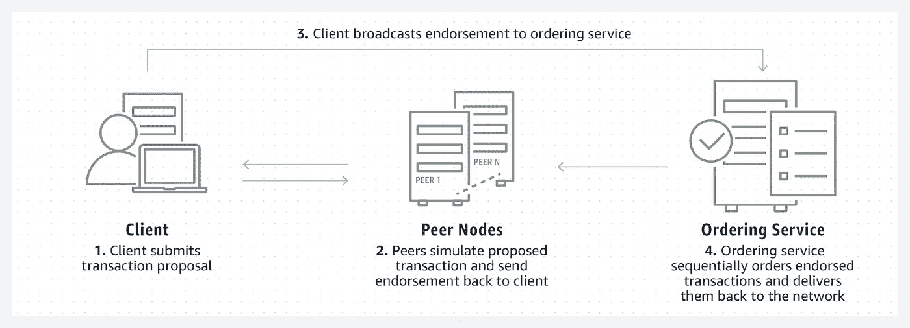
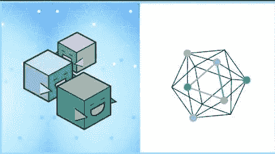
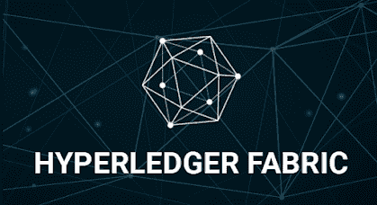
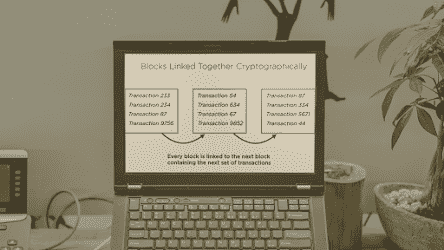
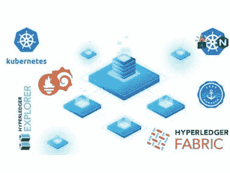

# 2023 年面向区块链开发人员的 5 大 Hyperledger Fabric 在线课程—最佳选择

> 原文：<https://medium.com/javarevisited/top-5-hyperledger-fabric-online-courses-for-blockchain-developers-best-of-lot-9bd3bcaf1e20?source=collection_archive---------3----------------------->

## 2023 年想学 Hyperledger Fabric 区块链？以下是深入学习 Hyperledger Fabric 的最佳在线课程

image _[https://blog . clairvoyantsoft . com/hyperledger-fabric-components-and-architecture-b 874 b 36 C4 af 5](https://blog.clairvoyantsoft.com/hyperledger-fabric-components-and-architecture-b874b36c4af5)

大家好，如果你没有生活在岩石下，你可能在过去几年中听说过区块链和加密货币，尽管即将结束的这一年因加密崩溃而闻名，但区块链技术仍然非常强大。

如果你想在 2022 年学习 Blcokchain，那么如果你正在寻求区块链培训和认证，你就来对了地方。我以前提供过免费的区块链课程，今天，在这篇文章中，我将展示最好的区块链认证和在线课程，以从 Udemy，Coursera，Pluralsight 等网站学习区块链编程。

Hyperledger 是一个开源项目，它支持基于区块链技术构建分布式分类帐。Hyperledger 是一个团队，他们共同开发构建区块链和相关应用程序所需的框架、协议、工具和库。

这些是学习 HyperLedger 的最棒的在线培训课程，它们不仅教授理论，还向您展示如何使用真实世界的代码从零开始构建区块链项目。

# 2023 年初学者学习区块链的 5 门最佳 Hyperledger 在线课程

事不宜迟，这里列出了 2023 年成为区块链工程师可以参加的最好的在线课程和认证。

## 1.[使用 Composer 在 Hyperledger Fabric 上开发区块链](https://click.linksynergy.com/deeplink?id=JVFxdTr9V80&mid=39197&murl=https%3A%2F%2Fwww.udemy.com%2Fcourse%2Fhyperledger%2F)

近年来，区块链及其相关技术的飞速发展是不可低估的。本课程旨在教您如何使用 composer 框架创建 Hyperledger 区块链应用程序。

评估分布式分类帐技术的使用是否会给企业带来好处，并使用 composer REST 服务器创建基于 web 的解决方案。要注册本课程，您必须有 Java、JS 或 NodeJS 以及 web 应用程序的经验。

**先决条件:无
等级:初级
评分:4.4
时长:8.5 小时
导师——拉吉夫·萨胡贾**

以下是加入本课程的链接— [使用 Composer 在 Hyperledger Fabric 上开发区块链](https://click.linksynergy.com/deeplink?id=JVFxdTr9V80&mid=39197&murl=https%3A%2F%2Fwww.udemy.com%2Fcourse%2Fhyperledger%2F)

## 2. [Hyperledger Fabric 2.x —首个实用区块链](https://click.linksynergy.com/deeplink?id=JVFxdTr9V80&mid=39197&murl=https%3A%2F%2Fwww.udemy.com%2Fcourse%2Fhyperledger-fabric-composer-first-practical-blockchain%2F) [Udemy]

同一个主题有这么多的节目和课程，获得确切的事实并打下坚实的基础可能会很困难。这个系列讲座旨在帮助你克服这个绊脚石。在继续学习 Hyperledger Fabric 和 Composer 之前，先从技术角度了解一下区块链的基础知识。

本课不需要任何先验知识。您将使用案例研究方法，并在整个过程中边做边学。在这一领域世界知名专家的帮助下，你将能够自信地将所学应用于现实世界的问题。

**先决条件:无
等级:初级
评分:4.4
时长:2.5 小时
导师——莫哈马德·瑙曼**

了解 hash 的基本原理，以及它们如何支持该技术的设计。使用最简单的方法，安装和配置必要的工具和应用程序。为了充分利用这些功能，请熟悉该工具的界面。

利用一个使用 PHP 的 REST API 测试应用程序来获取数据。17 次讲座+ 1 篇文章+ 4 个可下载的资料+终身无限制的低成本访问，您可以获得认证。

以下是加入本课程的链接— [Hyperledger Fabric 2.x —第一个实用的区块链](https://click.linksynergy.com/deeplink?id=JVFxdTr9V80&mid=39197&murl=https%3A%2F%2Fwww.udemy.com%2Fcourse%2Fhyperledger-fabric-composer-first-practical-blockchain%2F)

## 3.[成为使用 HyperLedger 的区块链开发者](https://www.educative.io/courses/hands-on-blockchain-hyperledger-fabric?affiliate_id=5073518643380224)

这是学习 HyperLedger 区块链的互动课程之一。在本课程中，我们将从头开始构建区块链概念。我们将从基本的加密构造开始，如散列函数和 PKI 加密，首先为理解区块链和理解它的价值打下坚实的基础。

然后，我们将在您的浏览器中使用动手开发环境探索 IBM 的 Hyperledger Fabric 技术。对于希望通过 Hyperledger 面料专业发展区块链技术专业知识的工程师来说，本课程是一个很好的起点。

在本课程中，您将部署自己的区块链网络，在该网络上部署 chaincode，并创建一个应用程序来调用在结构网络中运行的 chaincode。您还将学习在您的应用程序中使用钱包管理 fabric 用户身份。

调查加密货币立法及其对匿名的影响。理解分布式账本技术的效果和可能性，以及其他相关技术。使用 Hyperledger 锯齿、Hyperledger Fabric 和 Truffle 框架开发程序。

**以下是加入本课程的链接**——[成为使用 HyperLedger 的区块链开发者](https://www.educative.io/courses/hands-on-blockchain-hyperledger-fabric?affiliate_id=5073518643380224)

此外，如果你觉得教育平台和他们的互动课程很有用，那么你还可以获得 [**教育订阅**](https://www.educative.io/subscription?affiliate_id=5073518643380224) ，每月只需 14.9 美元，不仅可以访问这门课程，还可以访问他们的 210 多门课程。它非常划算，非常适合准备编码面试

## 4.[用 Hyperledger 构建区块链](https://pluralsight.pxf.io/c/1193463/424552/7490?u=https%3A%2F%2Fwww.pluralsight.com%2Fcourses%2Fhyperledger-blockchains-building) [Pluralsight]

在这些会议中，您将了解几种企业级区块链的工作原理、它们的优缺点以及每个框架的特定用例。了解用于创建有用应用的框架和技术。

密切关注企业的安全方面，以及事务的生命周期和其他关键主题。学完本课后，你将会很好地掌握如何以及何时利用这套框架来构建应用程序。

**先决条件:**无
**等级:**初学者
**评分:** 4.5
**时长:**自定进度
**导师—** 贾纳尼·拉维

**这里是加入本课程的链接—** [用 Hyperledger 构建区块链](https://pluralsight.pxf.io/c/1193463/424552/7490?u=https%3A%2F%2Fwww.pluralsight.com%2Fcourses%2Fhyperledger-blockchains-building)

不过，你需要一个 [Pluralsight 会员](https://pluralsight.pxf.io/c/1193463/424552/7490?u=https%3A%2F%2Fwww.pluralsight.com%2Fpricing%2Fskills)才能加入这个课程，费用大约是每月 29 美元或每年 299 美元(14%的折扣)。我向所有程序员强烈推荐这个订阅，因为它提供了超过 7000 个在线课程的即时访问，以学习任何技术技能。或者，你也可以使用他们的 [**10 天免费通行证**](https://pluralsight.pxf.io/c/1193463/424552/7490?u=https%3A%2F%2Fwww.pluralsight.com%2Fpricing%2Ffree-trial) 免费观看这个课程。

 [## Pluralsight |个人免费试用

### 立即开始免费试用 Pluralsight！查看我们为个人和团队提供的服务，如果您不确定…

pluralsight.pxf.io](https://pluralsight.pxf.io/c/1193463/424552/7490?u=https%3A%2F%2Fwww.pluralsight.com%2Fpricing%2Ffree-trial) 

## 5.[Kubernetes 上 Hyperledger Fabric v2.x 的完整指南](https://click.linksynergy.com/deeplink?id=CuIbQrBnhiw&mid=39197&murl=https%3A%2F%2Fwww.udemy.com%2Fcourse%2Fhyperledger-fabric-on-kubernetes-complete-guide%2F)

毫无疑问，区块链是当今应用最广泛的技术之一。如果你想在这个领域开始职业生涯，但不知道从哪里开始，这个基础课程将会帮助你。从核心概念和术语开始，然后继续学习利用该技术开发有用的业务网络的高级组件和技术。

除了获得建模和项目的实践经验，您还将有机会构建您的第一个区块链应用程序。

**先决条件:无
等级:初级
评分:4.3
时长:自定进度**

从一开始，我们就讨论了所有主题，包括基本实验工具的配置。各种各样的任务和项目来帮助你巩固你的知识，澄清任何挥之不去的问题。每个主题都被彻底地处理，有适当的示范。

了解在各种计划中进行协作和建立安全企业网络的最佳实践。通过多次测验和最终测试后，您可以获得计划完成徽章。

**以下是参加本课程的链接—**[Kubernetes 上的 Hyperledger Fabric v2.x 完整指南](https://click.linksynergy.com/deeplink?id=CuIbQrBnhiw&mid=39197&murl=https%3A%2F%2Fwww.udemy.com%2Fcourse%2Fhyperledger-fabric-on-kubernetes-complete-guide%2F)

以上就是 2023 年学习 Hyperledger 区块链的**最佳在线课程。这些是 Udemy、Educative 和 Coursera 等网站上学习 HyperLedger 和 2023 年学习这项热门技术的最佳在线课程。你可以参加这个列表中的一个或多个课程，了解 HyperLedger，开始你的区块链开发生涯。**

其他**区块链文章和教程**你可能喜欢:

*   [2023 年十大区块链认证](https://javarevisited.blogspot.com/2020/07/top-5-online-courses-to-learn-blockchain.html)
*   [如何从零开始学习 2023 年的元宇宙？](https://javarevisited.blogspot.com/2022/07/how-to-learn-metaverse-from-scratch-is.html)
*   [深度学习区块链的 6 大网站](https://dev.to/javinpaul/6-best-websites-to-become-a-blockchain-developer-in-2022-3han)
*   [我最喜欢的学习以太坊的在线课程](https://javarevisited.blogspot.com/2021/11/top-5-courses-to-learn-ethereum-for.html)
*   [面向开发者的 10 门最佳区块链课程](/javarevisited/best-blockchain-courses-and-certification-in-2020-63729f8f04d0)
*   [2023 年免费学习区块链的 5 个最佳地点](https://javarevisited.blogspot.com/2022/06/top-5-websites-to-learn-blockchain-in.html)
*   [认证 NFT 专业认证值得吗？](https://javarevisited.blogspot.com/2022/06/review-is-certified-nft-certification-worth-it.html)
*   [2023 年 10 门元宇宙在线初学者课程](https://javarevisited.blogspot.com/2022/06/best-courses-to-learn-metaverse-online.html)
*   [101 区块链认证区块链开发者值得吗？](https://javarevisited.blogspot.com/2022/05/review-is-certified-enterprise-blockchain-professional-certification-worth.html)
*   [我最喜欢的学习不可替换代币的课程](https://javarevisited.blogspot.com/2021/12/top-5-courses-to-learn-about-nfts-non.html)
*   [用区块链学习 HyperLedger Fabric 的 5 门课程](https://javarevisited.blogspot.com/2022/02/top-5-courses-to-learn-hyperledger-blockchain.html)
*   [2023 年区块链 5 门最佳 Coursera 课程](https://javarevisited.blogspot.com/2022/01/5-best-blockchain-certifications-and.html)
*   [20 大区块链面试问题及答案](https://javarevisited.blogspot.com/2022/07/blockchain-interview-questions-answers.html)
*   [2023 年学习区块链的前 5 本书](https://javarevisited.blogspot.com/2022/06/top-5-books-to-learn-blockchain-for.html)
*   [3 门 Coursera 课程让你在 2023 年成为区块链开发者](https://javarevisited.blogspot.com/2022/06/best-coursera-courses-for-blockchain.html)
*   [2023 年 10 门免费 NFT 初学者课程](https://javarevisited.blogspot.com/2022/07/free-nft-non-fungible-tokens-courses.html)

感谢您阅读本文。这些*2023 年最佳 Hyperledger 区块链新手在线课程及认证*如果你觉得有用，请分享给你的朋友和同事。如果您有任何问题或反馈，请留言。

**P. S. —** 如果你正在寻找一个免费的课程来开始你的区块链职业生涯，那么你也可以查看 [**企业区块链基础**](http://shrsl.com/34mvm) ，这是一个来自 101 Blockchain 的免费区块链课程，是一个很好的开始。我向想要开始区块链职业生涯的初学者和有经验的开发者强烈推荐这门课程。如果你需要更多的选择，你也可以看看这些 [**最好的免费区块链课程**](/javarevisited/7-free-courses-to-learn-blockchain-in-2020-764e66b47ebe) 。

 [## 2023 年要学习的 5 门免费区块链开发人员课程和认证-最好的

### 大家好，如果你想学习区块链开发，并且正在寻找一些免费的区块链课程，你来了…

www.java67.com](https://www.java67.com/2018/02/5-free-blockchain-technology-courses.html)