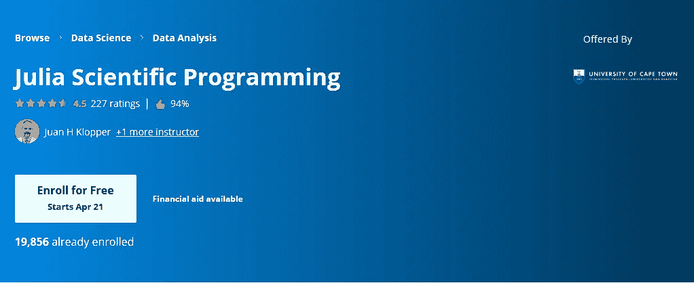
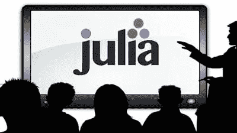
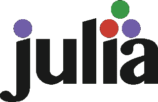
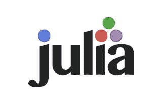

# 2023 年初学者学习的 5 本最佳 Julia 编程书籍和在线课程

> 原文：<https://medium.com/javarevisited/top-5-julia-programming-books-courses-and-tutorials-for-beginners-e5b4bd7067ec?source=collection_archive---------1----------------------->

## 如果你对编程有热情，那么学习 Julia，你不会失望的。

大家好，如果你正在寻找一种新的、现代的编程语言来学习，那么让我向你介绍 Julia 编程语言。Julia 是一种高级、高性能的动态编程语言，专门为科学计算开发，但它也用于[大数据](https://javarevisited.blogspot.com/2019/04/top-10-hadoop-tutorials-for-big-data-developers.html)、[数据科学](https://javarevisited.blogspot.com/2018/10/data-science-and-machine-learning-courses-using-python-and-R-programming.html)和其他计算密集型行业。

**Julia** 编程语言实际上是为解决高性能数值和科学计算的需求而设计的，同时也适用于通用编程。

Julia 也是最受欢迎的编程语言之一，其创建理念是从其他流行的主流编程语言中吸取精华。

它的使命声明说，Julia 应该像 [R](https://hackernoon.com/5-free-r-programming-courses-for-data-scientists-and-ml-programmers-5732cb9e10) 一样正确地进行统计计算，像 Perl 一样流畅地进行字符串处理，并将与 [Matlab](https://javarevisited.blogspot.com/2022/02/top-5-courses-to-learn-matlab-for.html) 相匹配地进行线性代数之类的数学计算。不过，与此同时，它应该更容易学习和工作。

Julia 在现实世界的编程中有很多用途；你也可以将 Julia 用于数据科学。凭借其惊人的快速代码编译和高性能并行执行，Julia 继续吸引新的开发人员来扩展其领域。

此外，由于其广泛的数学库和对云计算的支持，这种语言在数据科学家中越来越受欢迎，并越来越多地用于大数据项目。

如果你想在 2023 年学习朱莉娅，并寻找一些有用的资源，如书籍、课程和免费教程，那么你来对地方了。在这篇文章中，我将分享一些 2023 年学习 Julia 编程语言的最佳课程。

# 2023 年学习朱莉娅的 5 大书籍和课程

正如我告诉你的，Julia 是一种新的编程语言，由麻省理工学院开发，在斯坦福大学、康奈尔大学、普渡大学等主要大学教授。

它集合了解释型语言的最佳实践，如 [Python](https://javarevisited.blogspot.com/2018/03/top-5-courses-to-learn-python-in-2018.html) 、 [Ruby](https://www.java67.com/2018/02/5-free-ruby-and-rails-courses-to-learn-online.html) 、 [Javascript](https://javarevisited.blogspot.com/2018/06/top-10-courses-to-learn-javascript-in.html) ，以及编译型语言的最佳实践，如 [C/C++](/@javinpaul/top-10-courses-to-learn-c-for-beginners-best-and-free-4afc262a544e) 和 FORTRAN。它很容易学习，但是对于真正的开发工作来说非常实用。

## 1.[朱莉娅科学编程(Coursera)](https://coursera.pxf.io/c/3294490/1164545/14726?u=https%3A%2F%2Fwww.coursera.org%2Flearn%2Fjulia-programming)

这是另一个从零开始学习茱莉亚的有趣且有启发性的课程。这四个模块的课程向你介绍作为第一语言的朱莉娅。在本课程中，您将学习

*   如何从头开始编写自己的简单 Julia 程序
*   理解 Julia 作为计算语言的优势和能力
*   使用 Julia 语言在 Jupyter 笔记本上工作
*   使用各种 Julia 软件包，如 Plots、DataFrames 和 Stats

本课程通过视频讲座、屏幕演示、测验和旨在让您使用软件包的实践性同行评审项目来讲授。

和其他 [Coursera 课程](https://coursera.pxf.io/c/3294490/1164545/14726?u=https%3A%2F%2Fwww.coursera.org%2F)一样，这个也是免费审核的。尽管如此，如果你想访问作业，测验，和其他你需要参加课程的课程材料，我强烈建议你这样做。做这些作业会提高你的编码技能，也会帮助你更好地理解 Julia。

你还将获得完成本课程的证书，你可以在 LinkedIn 和你自己的简历中添加证明你的 Julia 专业知识。非常感谢 Juan H Klopper 和 Henri Laurie 讲师，他们都是博士，创建了这个学习 Julia 的有趣课程。

**这里是加入这个茱莉亚课程**——[茱莉亚科学编程](https://coursera.pxf.io/c/3294490/1164545/14726?u=https%3A%2F%2Fwww.coursera.org%2Flearn%2Fjulia-programming)的链接

除此之外，Coursera 还有针对数据科学初学者的[**Julia**](https://coursera.pxf.io/c/3294490/1164545/14726?u=https%3A%2F%2Fwww.coursera.org%2Fprojects%2Fjulia-beginners-data-science)，这是一个 2 小时长的项目，在这里你将通过在基于云的工作空间中进行数据清理和探索性分析的实践来学习 Julia。

<https://coursera.pxf.io/c/3294490/1164545/14726?u=https%3A%2F%2Fwww.coursera.org%2Fprojects%2Fjulia-beginners-data-science>  

这意味着不需要安装软件和工具，只需要开始编码，你的老师会在分屏窗口中指导你，我真的很喜欢这个，如果你也喜欢边做边学，那么你会喜欢这个 Julia 课程的。

顺便说一句，如果你觉得 Coursera 课程有用，因为它们是由知名公司如**谷歌**、 **IBM** 、**亚马逊**和世界上最好的大学创建的，并且想加入多个 Coursera 课程，那么我建议你参加 Coursera 的年度订阅计划 [**Coursera Plus**](https://coursera.pxf.io/c/3294490/1164545/14726?u=https%3A%2F%2Fwww.coursera.org%2Fcourseraplus) 。

这种单次订阅可以让你无限制地访问他们最受欢迎的**课程**、**专业**、**专业证书**和**指导项目**。它每年花费大约 399 美元，但是它完全物有所值，因为你可以获得无限制的证书。

## 2.[掌握 Julia 1.0 (Packt)](https://www.amazon.com/Mastering-Julia-1-0-processing-problems/dp/1788298136?tag=javamysqlanta-20)

学习 Julia 的书并不多，但不管有什么，我发现《掌握 Julia 1.0》是从头开始学习 Julia 的最佳书籍之一。

这本书从基础开始，然后继续探索 1.0 版本的最新改进和特性。它将逐步向您展示如何使用 Julia 执行简单的统计和分析，这将帮助您理解 **Julia 的速度和性能能力，**以及它在高度密集计算中的应用。

这本书也有单独的详细章节来解释 Julia 类型系统和多重分派的原理，帮助你更有效地编程。

此外，在本书中，您将了解如何使用 Julia 来增强图形和数据可视化。您还将学习在 Julia 中执行[机器学习](https://dev.to/javinpaul/11-best-resources-to-learn-data-science-and-machine-learning-in-2020-2od)任务时使用图形处理单元(GPU)支持。它还涉及了 Julia 的网络和分布式计算，以及学习 Julia 编程语言的其他原因。

## 3.[茱莉亚入门(Udemy)](https://click.linksynergy.com/deeplink?id=JVFxdTr9V80&mid=39197&murl=https%3A%2F%2Fwww.udemy.com%2Fcourse%2Fgetting-started-with-julia%2F)

Udemy 上学习 Julia 编程语言的课程不多，但无论我发现了什么，这似乎是 Udemy 上学习 Julia 最好的课程。

在本课程中，您将学习如何下载和安装朱莉娅，建立自己的开发环境、设置和编辑器，并使用朱莉娅·REPL 进行开发。

它有一个非常结构化的课程，你将学习你需要知道的关于 Julia 编程语言的一切，比如基础知识、使用类型、I/O、模块和包、[面向对象编程](/javarevisited/my-favorite-courses-to-learn-object-oriented-programming-and-design-in-2019-197bab351733)和[使用 Julia 的函数式编程](https://javarevisited.blogspot.com/2019/01/5-free-scala-programming-courses-for-java-programmers-learn-online.html)。

本课程由[**Packt Publishing**](https://click.linksynergy.com/deeplink?id=JVFxdTr9V80&mid=45060&murl=https%3A%2F%2Fwww.packtpub.com%2F)与导师 Erik Engheim 共同创建。这是一门综合课程，包含 10 个小时的内容，这意味着如果你只需要一门课来深入了解 Julia，你可以使用这门课。

## 4.[茱莉亚简介(JuliaAcademy)](https://juliaacademy.com/)

这是一个学习 Julia 编程语言的极好网站。它包含了许多免费的课程来学习 Julia 基础知识、机器学习基础、并行计算以及其他与 Julia 相关的材料。

这是一门由 10 部分组成的课程，它的课程设置是为了让初级程序员能够快速掌握 Julia。这个课程最好的一点是，它是由核心的 Julia 开发者与 Julia Computing 合作编写的，这意味着你将从最权威的来源中学习。

如果你正在寻找学习 Julia 的免费资源，我建议你查看 JuliaAcademy 的课程。大部分也是免费的，2023 年你现在就可以不花钱开始学习朱莉娅。

## 5.[在 Julia 中为非程序员编码](https://click.linksynergy.com/deeplink?id=JVFxdTr9V80&mid=39197&murl=https%3A%2F%2Fwww.udemy.com%2Fcourse%2Fcoding-for-non-programmers-in-julia%2F)

这个 Julia 初学者编程课程是专门为编程初学者设计的。在这门课程中，你不仅会学到麻省理工学院和斯坦福大学教授的强大的[编程语言](/hackernoon/10-best-programming-languages-to-learn-in-2019-e5b05af4a972)，还会内化实用的编程技术和习惯。

这将帮助你成为一名优秀的程序员和问题解决者，帮助你学习其他语言。本课程结束时，您将具备 Julia 的基础知识，并有能力和信心继续自学编程。

不需要朱莉娅的先验知识，因为我们将从基础开始。我们的目标是，在本教程结束时，您将有信心在自己的工作中开始使用 Julia！

以上就是关于**学习 Julia 编程语言的最佳课程。**它很现代，是最受欢迎的编程语言之一，有着美好的未来。Julia 在[数据科学](https://dev.to/javinpaul/top-online-courses-to-learn-data-science-and-machine-learning-for-beginners-best-of-lot-37k8)、[机器学习](https://hackernoon.com/10-machine-learning-data-science-and-deep-learning-courses-for-programmers-7edc56078cde)和科学编程中有很多用途。

它还包含了不同编程语言[的最佳实践，从开发者的角度来看，这使它成为一种高效的语言。事实上，所有的趋势都表明 Julia 正在成长，如果你想学习第二种编程语言，Julia 可以是一个很好的选择。](https://dev.to/javinpaul/top-5-programming-languages-to-learn-to-get-a-job-at-google-facebook-microsoft-or-work-as-a-freelance-developer-3ma5)

其他**编程资源**你可能会发现有用的
[2023 年 Java 开发者路线图](https://javarevisited.blogspot.com/2019/10/the-java-developer-roadmap.html)
[2023 年学习 Python 的 10 大课程](/better-programming/top-5-courses-to-learn-python-in-2018-best-of-lot-26644a99e7ec)
[初学者学习 Rust 编程的 5 大课程](https://javarevisited.blogspot.com/2020/01/top-5-courses-and-books-to-learn-rust-programming-language.html)
[2023 年学习的 10 种编程语言](http://www.java67.com/2017/12/10-programming-languages-to-learn-in.html)
[5 门 Java 和 DevOps 工程师的免费 Docker 课程](http://www.java67.com/2018/02/5-free-docker-courses-for-java-and-DevOps-engineers.html)
[2023 年学习 Spring Boot 的 10 门课程 Jenkins、Docker、Maven](/javarevisited/top-10-courses-to-learn-spring-boot-in-2020-best-of-lot-6ffce88a1b6e)
[5 门面向 Web 开发者的免费 JavaScript 课程](http://www.java67.com/2018/04/top-5-free-javascript-courses-to-learn.html)
[5 门学习 Java 编程的免费课程](https://javarevisited.blogspot.com/2018/05/top-5-java-courses-for-beginners-to-learn-online.html)
[2023 年学习 JavaScript 的前 10 门课程](https://javarevisited.blogspot.com/2018/06/top-10-courses-to-learn-javascript-in.html)
[2023 年学习 C 编程的前 5 门课程](https://javarevisited.blogspot.com/2019/11/top-5-courses-to-learn-c-programming-in.html)

非常感谢您阅读这篇文章。如果你喜欢 Julia 编程语言和这些课程，那么请在你最喜欢的平台(脸书、Twitter 或 LinkedIn)上分享。如果您有任何问题或反馈，请留言。

# 你可能喜欢的其他媒体文章

</javarevisited/top-10-programming-languages-you-can-learn-for-jobs-and-career-in-technology-491e611c22bc>    </hackernoon/10-data-structure-algorithms-and-programming-courses-to-crack-any-coding-interview-e1c50b30b927> 