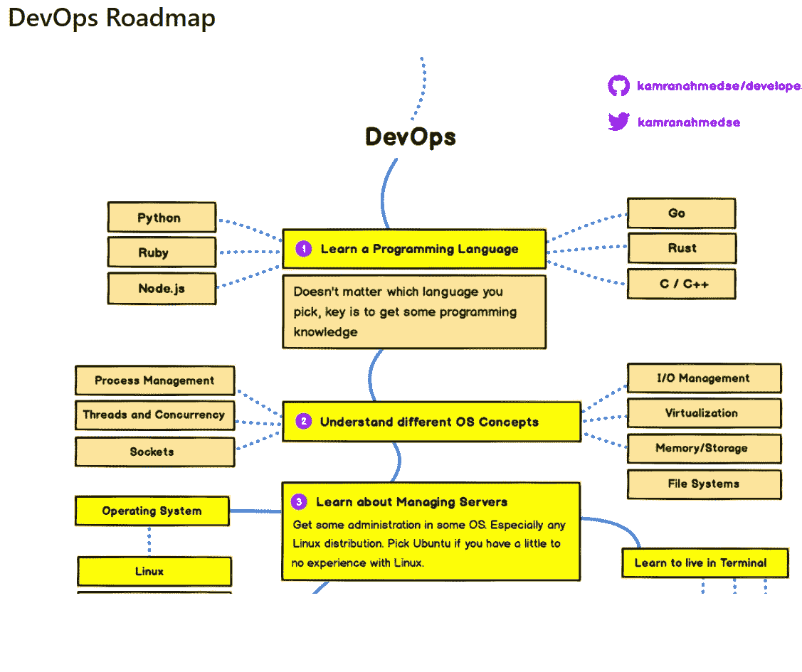
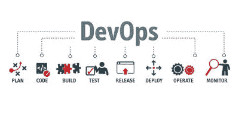
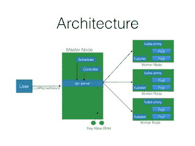
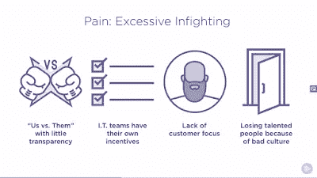

# 2023 年 DevOps 工程师五大在线课程

> 原文：<https://medium.com/javarevisited/top-5-online-courses-to-become-a-devops-engineer-in-2020-764f5e60c2b?source=collection_archive---------0----------------------->

DevOps 路线图

大家好，如果你正在学习 DevOps 或者想成为一名专业的 DevOps 工程师，并且正在寻找最好的在线课程，那么你来对地方了。以前我分享过 [**免费 DevOps 课程**](/javarevisited/10-free-courses-to-learn-docker-and-devops-for-frontend-developers-691ac7652cee?source=---------94------------------) ，今天我要分享的是你成为 DevOps 工程师可以加入的最好的课程。

您可能知道 DevOps 是大型和小型组织最需要的技能之一。因此，[开发工程师](/javarevisited/what-next-for-senior-developers-in-tech-project-manager-technical-architect-or-a-devops-engineer-b532a80c9ba1)对于那些不想从事人事管理或项目管理等普通工作的人来说，也是薪酬最高的技术工作之一。

如果你是一名高级开发人员、技术负责人或 scrum 高手，并且正在寻求提升或想让你的职业生涯更上一层楼，那么学习 [DevOps](/javarevisited/10-free-courses-to-learn-docker-and-devops-for-frontend-developers-691ac7652cee) 和像 [Docker](https://www.java67.com/2019/03/5-free-devops-courses-to-learn-jenkins.html) 、 [Kubernetes](/hackernoon/the-2018-devops-roadmap-31588d8670cb) 、 [Jenkins](https://javarevisited.blogspot.com/2018/09/top-5-jenkins-courses-for-java-and-DevOps-Programmers.html) 和 [Maven](https://javarevisited.blogspot.com/2019/03/top-5-course-to-learn-apache-maven-for.html#axzz645Kt2tH8) 这样的工具可能是一个不错的选择。

这些工具不仅改善了团队中的软件开发和部署过程，还提升了您的形象和职业生涯。DevOps 提出了两个词 Development 和 Operations 的缩写，大多数人认为它是一种编程语言的软件，但事实并非如此。它是一种概念或哲学，使开发团队与运营团队在同一个 It 部门或组织内顺利地协同工作。

学习 [DevOps](https://javarevisited.blogspot.com/2018/09/10-devops-courses-for-experienced-java-developers.html) 帮助你了解组织是如何工作的，让你对产品生命周期的工作方式感到舒适，如果你想在世界上最大的组织和财富 500 强科技公司获得 DevOps 工程师的工作，并通过学习如何在同一组织内合作来促进你的职业发展，这就是公司对你的要求。

在这篇文章中，我们将看到一些最好的课程，教你如何成为一名 [DevOps 工程师](/hackernoon/the-2018-devops-roadmap-31588d8670cb)，并向你展示公司开发团队的心态，他们如何合作，产品开发的生命周期如何运行，以及公司用来保持其 web 应用程序效率的一些实用工具。

# 初学者和有经验的开发人员学习 DevOps 的 5 个最佳在线课程

在不浪费你更多时间的情况下，这里有最好的 DevOps 在线培训课程，Scrum masters、高级开发人员和技术领导可以参加，在 2002 年成为一名 DevOps 工程师。

这些课程不仅涵盖 DevOps 实践和文化，如对自动化的兴趣，还会教你基本的 DevOps 工具，如 [Maven](/javarevisited/6-best-maven-courses-for-beginners-in-2020-23ea3cba89) 、 [Jenkins](/javarevisited/7-best-courses-to-learn-jenkins-and-ci-cd-for-devops-engineers-and-software-developers-df2de8fe38f3) 、 [Docker](/javarevisited/top-5-free-courses-to-learn-docker-for-beginners-best-of-lot-b2b1ad2b98ad?source=collection_home---4------2-----------------------) 和 [Kubernetes](/javarevisited/7-free-online-courses-to-learn-kubernetes-in-2020-3b8a68ec7abc) 。

## 1.DevOps 文化和心态

这是 2023 年学习 DevOps 最好的在线课程之一。本培训课程将带您了解 DevOps 的基本原则，重点关注 DevOps 工程师的思维模式和文化，并向您展示开发和运营团队如何在同一环境中协同工作。

在整个课程中，您将看到许多公司案例研究的一些例子，因此您将有 DevOps 在现实世界中如何工作的实际例子，并且您可以立即开始在您工作的地方实施这些概念。

这些是您将在本课程中学到的关键技能:

*   什么是 DevOps 的介绍。
*   DevOps 工程师的心态。
*   加快开发和运营团队的时间。

完成本 [DevOps 课程](https://javarevisited.blogspot.com/2018/09/10-devops-courses-for-experienced-java-developers.html)后，您将对 DevOps 的各个阶段有很好的了解，并准备好在您的团队和项目中实施 DevOps 解决方案。

**以下是加入本课程的链接—** [**DevOps 文化与心态**](https://coursera.pxf.io/c/3294490/1164545/14726?u=https%3A%2F%2Fwww.coursera.org%2Flearn%2Fdevops-culture-and-mindset)

顺便说一句，当谈到参加这个课程时，你有两个选择，你可以单独参加这个课程，每月花费大约 39 美元进行专业化，你也可以参加 [**Coursera Plus**](https://coursera.pxf.io/c/3294490/1164545/14726?u=https%3A%2F%2Fwww.coursera.org%2Fcourseraplus) 课程，让你无限制地访问他们最受欢迎的课程、专业化、专业证书和指导项目。

<https://coursera.pxf.io/c/3294490/1164545/14726?u=https%3A%2F%2Fwww.coursera.org%2Fcourseraplus>  

## 2.[在 Udemy 上学习 DevOps:完整的 Kubernetes 课程](https://click.linksynergy.com/deeplink?id=JVFxdTr9V80&mid=39197&murl=https%3A%2F%2Fwww.udemy.com%2Fcourse%2Flearn-devops-the-complete-kubernetes-course%2F)

这是 Udemy 的另一个精彩的在线课程，通过 Kubernetes 学习 DevOps。如果你想控制和管理你的容器，你可以看看这个课程，学习如何使用 Kubernetes 来构建和部署你的 web 应用程序，以及如何像 Google 一样实现基础设施的灵活性和效率。在 Udemy 上的 DevOps 课程中，您将学到以下内容:

*   使用 [Docker](/javarevisited/top-15-online-courses-to-learn-docker-kubernetes-and-aws-for-fullstack-developers-and-devops-d8cc4f16e773) 在容器中构建应用程序，并使用 Kubernetes 集群部署它们。
*   在您的桌面机器上，或者在 Amazon AWS 之类的云上设置您的集群环境。
*   如何用[詹金斯](/javarevisited/top-10-free-courses-to-learn-maven-jenkins-and-docker-for-java-developers-51fa7a1e66f6?source=collection_home---4------3-----------------------)自动创建和部署自己的舵图。

这门关于 DevOps 的课程向您展示了如何安装和使用这款开源软件来自动化部署、扩展容器化的应用程序，以及在本地主机或亚马逊 [AWS](https://javarevisited.blogspot.com/2020/05/top-5-amazon-web-services-aws-courses-for-beginners-and-experienced-programmers.html) 上管理它们。

**以下是加入本课程的链接—** [学习 Kubernetes 完整课程](https://click.linksynergy.com/deeplink?id=JVFxdTr9V80&mid=39197&murl=https%3A%2F%2Fwww.udemy.com%2Fcourse%2Flearn-devops-the-complete-kubernetes-course%2F)

## 3. [DevOps 教程:完整的初学者培训— 5 合 1 套装](https://click.linksynergy.com/deeplink?id=JVFxdTr9V80&mid=39197&murl=https%3A%2F%2Fwww.udemy.com%2Fcourse%2Fdevops-docker-complete-guide-hands-on-with-practical%2F)

这可能是 DevOps 工程师最全面的 Udemy 课程。本课程向您展示了传统和新时代开发理念的概念，以及 DevOps 方法的基础知识，它是如何工作的，以及团队是如何合作来维护应用程序开发的。

它还向您展示了如何使用不同技术的概念，如 [Docker](https://www.java67.com/2018/02/5-free-docker-courses-for-java-and-DevOps-engineers.html) 、 [Jenkins](https://dev.to/javinpaul/10-free-devops-courses-to-learn-jenkins-docker-and-maven-for-programmers-ohp) 、 [GIT](https://www.blogger.com/) 、 [Maven](https://www.java67.com/2018/02/6-free-maven-and-jenkins-online-courses-for-java-developers.html) 使用亚马逊 AWS 在云上创建容器和部署您的 web 应用程序。此外，您将看到如何在现实世界中使用这些技术的实践练习。在本 Udemy 课程中，您将了解到:

*   DevOps 技术的概念。
*   使用自动化工具维护和管理基础设施。
*   如何使用不同的 DevOps 技术如 [Docker](/javarevisited/10-free-courses-to-learn-docker-and-devops-for-frontend-developers-691ac7652cee?source=---------94------------------) 和 [Jenkins](/javarevisited/7-best-courses-to-learn-jenkins-and-ci-cd-for-devops-engineers-and-software-developers-df2de8fe38f3) 。

如果你是一名 Scrum 大师、技术负责人或者有经验的程序员，并且想学习 DevOps，那么这是一门非常适合你的课程。

**这里是加入本课程的链接—** [DevOps 教程:完整的初学者培训— 5 合 1 套装](https://click.linksynergy.com/deeplink?id=JVFxdTr9V80&mid=39197&murl=https%3A%2F%2Fwww.udemy.com%2Fcourse%2Fdevops-docker-complete-guide-hands-on-with-practical%2F)

## 4.[关于 edX 的 DevOps 实践和原则](https://www.awin1.com/cread.php?awinmid=6798&awinaffid=631878&clickref=&p=%5B%5Bhttps%3A%2F%2Fwww.edx.org%2Fcourse%2Fdevops-practices-and-principles)

这是有经验的开发者学习 DevOps 最好的 edX 课程之一。本课程将深入探讨更高级的概念和核心价值观，介绍如何在现实世界的组织中实际实施 DevOps。以下是您将在本课程中学到的关键技能:

*   部署、配置和扩展您的产品。
*   扩展您的业务成果并加以改进。
*   监控应用或产品性能。

该课程重点关注使用各种技术部署和配置您的产品或 web 应用程序基础架构，以及如何扩展您的业务成果，面向开发和运营团队。

**以下是参加本课程的链接—** [DevOps 实践和原则](https://www.awin1.com/cread.php?awinmid=6798&awinaffid=631878&clickref=&p=%5B%5Bhttps%3A%2F%2Fwww.edx.org%2Fcourse%2Fdevops-practices-and-principles)

## 5.[devo PS:plural sight 上的大图](https://pluralsight.pxf.io/c/1193463/424552/7490?u=https%3A%2F%2Fwww.pluralsight.com%2Fcourses%2Fdevops-big-picture)

Pluralsight 上的这门课程向您展示了 DevOps 术语背后的方法论，如什么是 DevOps，以及您的组织如何转变其开发和运营团队的工作流程，以便在产品构建和部署中协同工作。

本课程重点关注[开发人员](/javarevisited/10-free-courses-to-learn-docker-and-devops-for-frontend-developers-691ac7652cee?source=---------94------------------)能够解决的问题，以及在这些工作流条款下，以及用于转变开发和运营团队内部工作的不同技术和工具下，转变整个组织的工作。

在这个课程中你会看到:

*   满足您组织需求的最佳 DevOps 技术。
*   开发运维中使用的技术和工具。
*   DevOps 重点解决的问题。

**以下是参加本课程的链接—** [DevOps 实践和原则](https://www.awin1.com/cread.php?awinmid=6798&awinaffid=631878&clickref=&p=%5B%5Bhttps%3A%2F%2Fwww.edx.org%2Fcourse%2Fdevops-practices-and-principles)

顺便说一下，你需要一个 Pluralsight 会员资格才能参加这个课程，费用大约是每月 29 美元或每年 299 美元。虽然我向所有程序员和开发人员强烈推荐该会员资格，因为他们总是需要学习和提升自己，但您也可以通过使用他们的 [**10 天免费试用**](https://pluralsight.pxf.io/c/1193463/424552/7490?u=https%3A%2F%2Fwww.pluralsight.com%2Flearn) 免费查看该课程，该课程提供 200 分钟的免费在线培训课程。

<https://pluralsight.pxf.io/c/1193463/424552/7490?u=https%3A%2F%2Fwww.pluralsight.com%2Flearn>  

以上是关于 2023 年**学习 DevOps 并成为 DevOps 工程师的最佳课程**，devo PS 工程师是开发者薪酬最高的技术工作之一。正如我所说的，DevOps 不仅可以改进一个组织的软件开发和交付过程，还可以提高软件的质量。

它还帮助开发人员保持工作与生活的平衡，并防止那些午夜支持电话。这是一个学习这种抢手技能的好时机，可以为你已经丰富多彩的简历添砖加瓦。

您可能喜欢的其他 **DevOps 工具和课程**

*   [2023 年 DevOps 开发者路线图](/hackernoon/the-2018-devops-roadmap-31588d8670cb)
*   面向 Java 和 DevOps 专业人员的 10 门免费 Docker 课程
*   [学习 Jenkins 自动化和开发运维的 5 大课程](https://javarevisited.blogspot.com/2018/09/top-5-jenkins-courses-for-java-and-DevOps-Programmers.html)
*   [2023 年学习 Kubernetes 的 7 门免费在线课程](/javarevisited/7-free-online-courses-to-learn-kubernetes-in-2020-3b8a68ec7abc)
*   [学习亚马逊网络服务我最喜欢的课程](https://javarevisited.blogspot.com/2020/05/top-5-amazon-web-services-aws-courses-for-beginners-and-experienced-programmers.html)
*   [5 门免费 Selenium 课程学习自动化测试](https://javarevisited.blogspot.sg/2018/02/top-5-selenium-webdriver-with-java-courses-for-testers.html)
*   [面向程序员的 10 门 Docker 和 Kubernetes 课程](https://dev.to/javinpaul/top-10-courses-to-learn-docker-and-kubernetes-for-programmers-4lg0)
*   [面向 Java 开发人员的 6 门 Maven 课程](http://www.java67.com/2018/02/6-free-maven-and-jenkins-online-courses-for-java-developers.html)
*   [2023 年 Java 开发人员应该学会的 10 件事](http://javarevisited.blogspot.sg/2017/12/10-things-java-programmers-should-learn.html#axzz53ENLS1RB)
*   [我最喜欢为有经验的人学习 DevOps 的课程](/javarevisited/top-10-courses-to-learn-devops-for-experienced-programmers-d93b666db151)
*   [程序员学习 AWS 和云的 10 门免费课程](/javarevisited/top-10-courses-to-learn-amazon-web-services-aws-cloud-in-2020-best-and-free-317f10d7c21d)
*   [7 门免费课程为 DevOps 学习硒](/javarevisited/top-7-courses-to-learn-selenium-for-java-and-c-developers-to-learn-automation-testing-free-and-e91637cd9622)
*   [2023 年学习 DevOps 的前 5 本书](https://javarevisited.blogspot.com/2020/04/top-5-books-to-learn-devops-for-developers.html)
*   [学习 Docker、Kubernetes 和 AWS 的 15 门在线课程](/javarevisited/top-15-online-courses-to-learn-docker-kubernetes-and-aws-for-fullstack-developers-and-devops-d8cc4f16e773)

感谢您阅读本文。如果你觉得这些 [DevOps 在线培训课程](/javarevisited/top-10-courses-to-learn-devops-for-experienced-programmers-d93b666db151)有用，请与你的朋友和同事分享。如果您有任何问题或反馈，请留言。

**附言——**如果你热衷于学习 DevOps，但负担不起参加本课程的费用，并且正在寻找免费的 DevOps 在线培训课程，那么你也可以在 Udemy 上查看本 [**DevOps 基础知识**](https://click.linksynergy.com/deeplink?id=JVFxdTr9V80&mid=39197&murl=https%3A%2F%2Fwww.udemy.com%2Fcourse%2Flinux-academy-devops-essentials%2F) 课程。这是完全免费的，你只需要一个免费的 Udemy 帐户就可以参加这个课程。

<https://click.linksynergy.com/deeplink?id=JVFxdTr9V80&mid=39197&murl=https%3A%2F%2Fwww.udemy.com%2Fcourse%2Flinux-academy-devops-essentials%2F> 