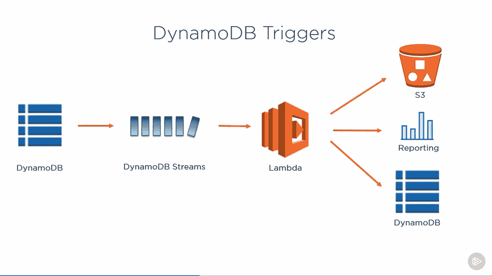
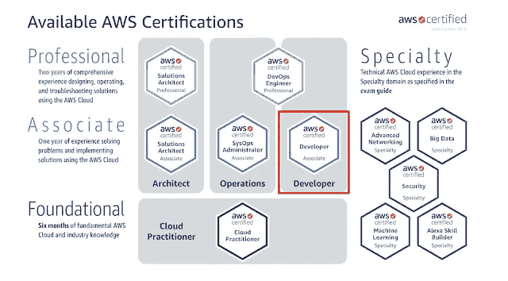
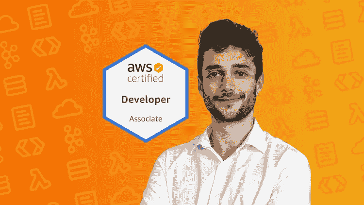
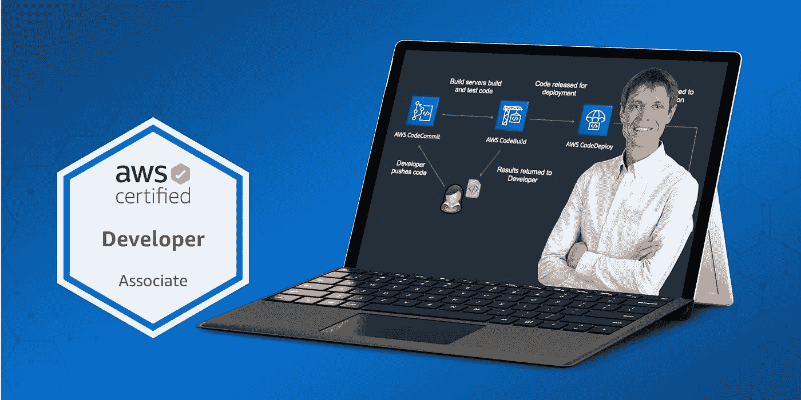
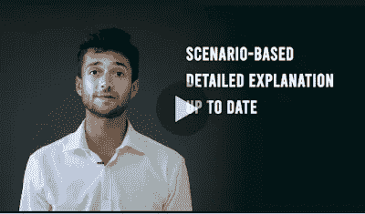
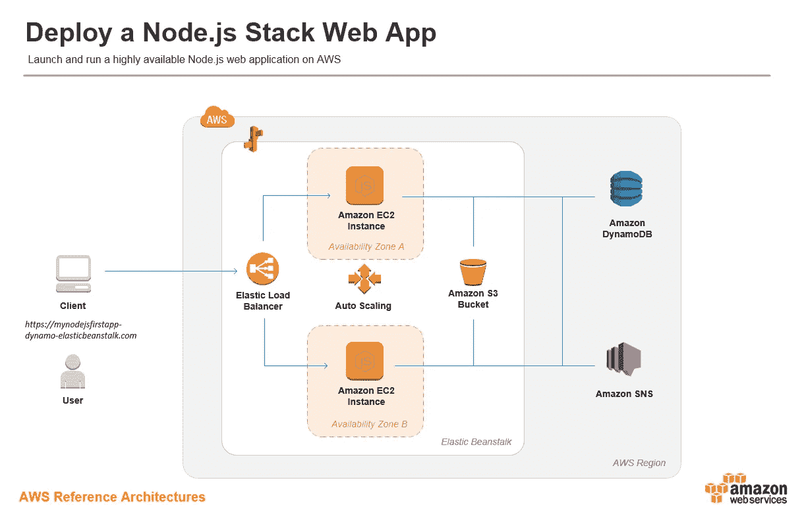
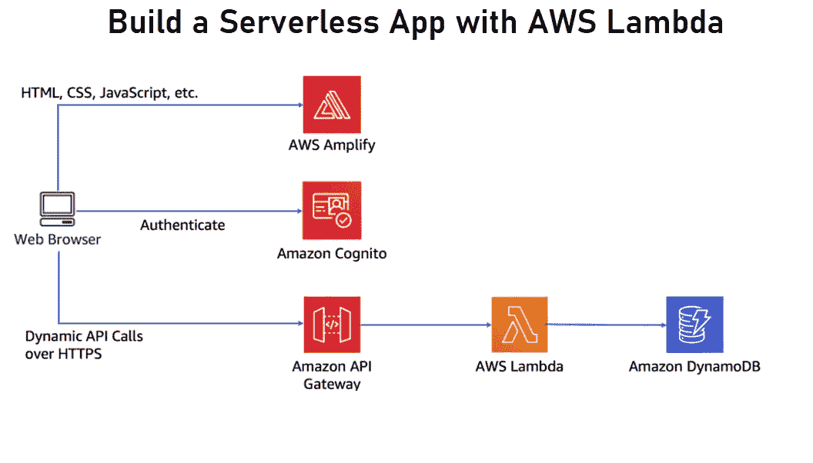

# 2023 年 DVA 001/02 考试的 5 门最佳 AWS 认证开发人员助理在线课程和练习测试

> 原文：<https://medium.com/javarevisited/top-5-online-courses-to-become-aws-certified-developer-associate-in-2020-best-of-lot-9b22baf84ca8?source=collection_archive---------0----------------------->

大家好，你可能听说过 AWS 认证，如果你，作为一名[程序员](https://javarevisited.blogspot.com/2017/12/10-things-java-programmers-should-learn.html#axzz5atl0BngO)、[软件开发人员](https://javarevisited.blogspot.com/2019/01/10-things-every-programmer-and-software-engineer-should-know.html)或 [DevOps 工程师](https://javarevisited.blogspot.com/2018/09/the-2018-devops-roadmap-your-guide-to-become-DevOps-Engineer.html)，想知道在 2023 年追求哪种认证，我会建议去亚马逊网络服务的 **AWS 开发人员助理认证**。

AWS Certified Developer-Associate 考试面向拥有一年或一年以上开发和维护基于 AWS 的应用程序实践经验的软件开发人员和程序员。

由于软件开发的未来在云中，软件开发人员获得云开发技能认证是有意义的，鉴于 AWS 是最受欢迎和最大的云平台，获得 AWS 开发人员助理认证是有意义的。

你可能想知道为什么不参加 [AWS 解决方案架构师助理](https://javarevisited.blogspot.com/2019/08/how-to-crack-aws-certified-solution-architect-exam.html)考试，这个考试可能比这个考试更受欢迎，但这个考试更适合需要深入了解不同 AWS 服务以实际实施架构的开发人员。

这也是最具实践动手知识的 [AWS 认证](/javarevisited/top-5-aws-training-courses-to-crack-amazon-web-service-solutions-architect-associate-certification-3f4affa8f660?source=collection_home---4------0-----------------------)。你不仅要了解基本的 AWS 服务，比如参加 [AWS 云从业者考试](https://javarevisited.blogspot.com/2020/03/top-5-aws-certified-cloud-practitioner-mock-test-practice-questions.html)，还要对它们有深入的实践知识。作为一名开发人员，你不仅应该知道何时使用这些服务，还应该知道如何有效地使用它们，以及如何根据不同的需求配置它们。

如果你正在准备 **AWS 开发人员助理考试**并寻找一些很棒的资源，如书籍、教程、模拟测试和在线 AWS 培训课程，那么你来对地方了。

在这篇文章中，我将分享最好的 **AWS 培训课程**来破解 AWS 开发人员助理考试和一些练习测试，以提高你的技能，在考试中取得高分。

# 什么是 AWS 认证开发人员助理考试-DVA-C01？

**AWS 认证开发人员助理认证**专注于执行初级开发任务的个人。你可以在这里找到考试蓝图。概括地说，认证分为四个不同的领域:

*   **AWS 基本面(10%)**
*   **设计和开发(40%)**
*   **部署和安全性(30%)**
*   **调试(百分之二十)**

您总共有 80 分钟的时间来完成考试。一次模拟考试的费用是 20 美元，而主考试的费用是 150 美元。作为一名 [AWS 认证开发人员助理](https://javarevisited.blogspot.com/2020/05/top-5-courses-to-crack-aws-certified-developer-associate-certification-exam.html)，您应该了解如何使用 AWS 开发、部署和调试基于云的应用程序。

你还应该知道如何开发、部署、使用[数据库](/hackernoon/top-5-sql-and-database-courses-to-learn-online-48424533ac61)、[无服务器架构](https://javarevisited.blogspot.com/2020/07/top-6-courses-to-learn-aws-lambda-and-serverless.html)，并使用 AWS API 作为准备这次考试的一部分，尤其是如果你想在这项享有盛誉的认证中取得成功的话。

# 2023 年通过 AWS 认证开发人员考试的 5 门最佳在线课程

为了通过这次考试，你必须学习各种各样的基本 AWS 服务，如虚拟私有云、 [EC2 实例](https://javarevisited.blogspot.com/2020/08/top-5-courses-to-learn-amazon-aws-ec-2.html)、 [DynamoDB](https://www.java67.com/2020/08/top-5-courses-to-learn-aws-s3-and-dynamoDB-in-depth.html) 和 RDS 数据库。你还应该知道如何用 Route 53 设置域名，用 Kinesis 和 SQS 发送消息，以及自动扩展 EC2 应用程序。这些[在线 AWS 培训课程](https://javarevisited.blogspot.com/2020/05/top-5-amazon-web-services-aws-courses-for-beginners-and-experienced-programmers.html)将帮助你。我精心挑选了这些课程，让你有一个全方位的准备。

该列表包括全面和最新的课程，以学习通过考试所需的所有基本 AWS 服务，以及一些在真正考试前提高速度和准确性技能的练习测试。如果你诚实地遵循这个列表中的一门课程和一个[模拟测试](https://javarevisited.blogspot.com/2020/07/top-5-aws-certified-developer-associate-practice-tests-mock-exams.html)，那么你将会为解决真实例子中的问题做好充分的准备。

无论如何，不浪费你更多的时间，这里是我列出的通过 *AWS 认证开发者考试*的一些最好的课程:

## 1.【2023 年终极 AWS 认证开发人员助理—全新！

为了成功通过 AWS 认证，你需要一门好的课程和一次好的实践测试，谢天谢地 Stpehance Maarek 在 Udemy 上提供了这两样东西。

如果你不知道，Stéphane Maarek 是 AWS 认证的解决方案架构师和开发人员，也是在 Udemy 上学习 AWS 和 Apache Kafka 的最佳讲师之一。他最近还被公认为 AWS 英雄，这证明了他的 AWS 专业知识。

上过他的 [**AWS 解决方案架构师课程**](https://click.linksynergy.com/deeplink?id=JVFxdTr9V80&mid=39197&murl=https%3A%2F%2Fwww.udemy.com%2Fcourse%2Faws-certified-solutions-architect-associate-saa-c02%2F) ，看得出他的课程非常详细，涵盖了整个教学大纲。就质量而言，它们与之前 CloudGurus 的课程非常相似，你可以选择加入这门课程，这完全取决于你是否与讲师有联系。

这是成为 AWS 认证开发人员的完整而详细的课程。它涵盖了所有 AWS 认证开发人员助理主题，还包含测验和练习，以记住您在每次讲座中学到的 AWS 概念。

**以下是参加本课程的链接**—[2023 年 AWS 认证开发人员终极助理—新！](https://click.linksynergy.com/deeplink?id=JVFxdTr9V80&mid=39197&murl=https%3A%2F%2Fwww.udemy.com%2Fcourse%2Faws-certified-developer-associate-dva-c01%2F)

谈社交证明这门课是通过 Udemy 上 AWS 认证开发者助理考试评分最高的课程之一。

超过 **131，152 名学生**注册了本课程，近 24，500 名参与者对本课程的平均评分为 4.7，这是一个巨大的数字，充分说明了本课程的质量。我向所有准备参加 2023 年 AWS 开发者助理考试的人强烈推荐这门课程。

## 2. [AWS 认证开发者助理考试培训 DVA-C01](https://click.linksynergy.com/deeplink?id=JVFxdTr9V80&mid=39197&murl=https%3A%2F%2Fwww.udemy.com%2Fcourse%2Faws-certified-developer-associate-exam-training%2F)

如果您没有在 AWS 控制台工作过，通过 AWS 认证并不容易，特别是 AWS 认证开发人员，因为它需要大量的实践知识来回答基于场景的问题，但这正是本课程的帮助所在。这是一门完整的实践课程，旨在帮助您为 AWS 开发人员助理认证做好准备。毫无疑问，考试很难，所有的问题都是基于场景的。无论你是否熟悉云，这个课程都会给你一个很好的起点，但是对于认证，你需要超越。多多练习。

本课程由 AWS 专家 Neal Davis 创建，他也是 AWS 认证开发人员和解决方案架构师。除了夏羽·马拉克，尼尔是另一位讲师，他的云课程非常好。

**以下是参加本课程的链接** — [AWS 认证开发人员助理考试培训 DVA-C01](https://click.linksynergy.com/deeplink?id=JVFxdTr9V80&mid=39197&murl=https%3A%2F%2Fwww.udemy.com%2Fcourse%2Faws-certified-developer-associate-exam-training%2F)

谈到社会证明，这门课程从近 35，647 个评分中平均获得 4.4 个评分，超过 186，772 名学生注册了这门课程，这充分说明了这门课程的质量。

如果您是 AWS 初学者或有一些 AWS 经验，但希望通过 AWS 开发人员助理认证，那么本 AWS 在线课程适合您

## 3.[【实践考试】AWS 认证开发者助理 2023](https://click.linksynergy.com/deeplink?id=JVFxdTr9V80&mid=39197&murl=https%3A%2F%2Fwww.udemy.com%2Fcourse%2Faws-certified-developer-associate-practice-tests-dva-c01%2F)

实践测试对于通过任何技术认证都至关重要，云认证也不例外。如果你想通过 AWS 认证开发人员助理考试(DVA-C01 )，那么你必须在正式考试前练习一些模拟测试。这对于考试前检查自己的速度和准确性很重要。

模拟考试也有助于找到你的强项和弱项，以便你可以在考试前改进你的弱项，但这一切只有在你拥有高质量的 **AWS 认证开发人员考试模拟器**的情况下才有可能，在模拟考试中，问题的质量达到或超过你将在真实示例中看到的问题的质量。这正是本课程的帮助所在。它包含 **293 个练习题**，这些练习题是详细的、基于场景的，并且是最新的，与 AWS 认证开发人员考试的最新大纲相匹配。这些练习题由 AWS 认证解决方案架构师和开发人员、专家培训师夏羽·马瑞克设计，必须作为考试计划的一部分。

它包含四个完整的高质量模拟测试，每个 65 个问题，还有一个 33 个问题的附加模拟测试，将帮助您掌握 AWS 认证开发人员助理考试(DVA-C01)。正如我所说，这些模拟考试将帮助你评估并确保你为期末考试做好充分准备。

**以下是参加本课程的链接** — [实践考试】AWS 认证开发人员助理 2023](https://click.linksynergy.com/deeplink?id=JVFxdTr9V80&mid=39197&murl=https%3A%2F%2Fwww.udemy.com%2Fcourse%2Faws-certified-developer-associate-practice-tests-dva-c01%2F)

谈到社会证明，这些模拟测试已经得到了大约 20，000 名学生的信任，并且在近 2，279 名参与者中平均获得了 4.5 分，这充分说明了这种模拟测试的质量。

如果您不能回答任何问题，您可以查看解释并点击 AWS 文档链接。我还建议您通过主课程再次学习您不太有信心的 AWS 服务。而且，如果你需要更多的练习，你也可以看看大卫·梅尔的这些 [AWS 开发者助理转储](https://www.certification-questions.com/practice-exam/amazon/aws-certified-developer-associate?affiliateCode=fcff36fd-557a-4713-abf6-973e9924770f&utm_source=Javin&utm_medium=affiliate&utm_campaign=affiliate)。

<https://www.certification-questions.com/practice-exam/amazon/aws-certified-developer-associate?affiliateCode=fcff36fd-557a-4713-abf6-973e9924770f&utm_source=Javin&utm_medium=affiliate&utm_campaign=affiliate>  

转储是在真实考试中问的真实问题，由必须参加考试的考生提供。这些是众包的问题，让你对真正考试的难度水平和题型有一个大致的了解。

## 4. [AWS 开发者:瑞恩·刘易斯入门](https://pluralsight.pxf.io/c/1193463/424552/7490?u=https%3A%2F%2Fwww.pluralsight.com%2Fcourses%2Faws-developer-getting-started)

对于准备参加 Pluralsight 上的 AWS 开发人员认证助理考试的人来说，这是另一门精彩的课程。它是 Pluralsight 上的 AWS 认证途径的几个课程的一部分，可以通过单一成员访问。

在本课程中，您将学习如何使用 Elastic Beanstalk 将应用程序部署到 EC2，在 RDS 和 Dynamo DB 中存储和检索数据，以及使用 CloudFormation 构建基础架构。

学完本课程后，您将拥有使用 AWS 服务的真实经验，这些服务将在您开发自己的应用程序时为您提供帮助。

如果您拥有 [Pluralsight 会员资格](https://javarevisited.blogspot.com/2017/12/top-10-pluralsight-courses-java-and-web-developers.html)，那么您应该通过本课程对准备参加 AWS 开发人员助理考试的人员有一个大致的了解。

**以下是参加本课程的链接** — [AWS 开发者:瑞恩·刘易斯入门](https://pluralsight.pxf.io/c/1193463/424552/7490?u=https%3A%2F%2Fwww.pluralsight.com%2Fcourses%2Faws-developer-getting-started)

## 5. [AWS 开发者:无服务器架构和监控](https://pluralsight.pxf.io/c/1193463/424552/7490?u=https%3A%2F%2Fwww.pluralsight.com%2Fcourses%2Faws-developer-serverless-architecture-monitoring)

亚马逊网络服务(AWS)是网络上一些最具创新性的云技术的家园，其中之一就是无服务器架构。本课程将教你如何构建无服务器应用程序，以及如何用 AWS 监控任何类型的 web 应用程序。

由瑞恩·刘易斯创建，在本课程中，您将学习 AWS 中的一些现代创新，如无服务器应用程序和应用程序监控。

首先，您将了解如何使用 Lambda、API Gateway 和 Kinesis 等技术正确构建应用程序，以创建真正的无服务器应用程序。

之后，你会发现 AWS X-Ray 中创造的一种新的监控技术，可以让你在 [AWS](/javarevisited/top-10-courses-to-learn-amazon-web-services-aws-cloud-in-2020-best-and-free-317f10d7c21d) 中监控所有类型的应用。最后，您将了解如何在 AWS 中使用 X 射线和 CloudWatch 警报来配置对应用程序的监控。

完成本课程后，您将掌握如何在 AWS 中创建无服务器应用程序的知识，并能够使用 X 射线监控任何类型的应用程序。

**这是参加本课程的链接** — [AWS 开发人员:无服务器架构和监控](https://pluralsight.pxf.io/c/1193463/424552/7490?u=https%3A%2F%2Fwww.pluralsight.com%2Fcourses%2Faws-developer-serverless-architecture-monitoring)

顺便说一句，你需要一个 [**Pluralsight 会员**](https://pluralsight.pxf.io/c/1193463/424552/7490?u=https%3A%2F%2Fwww.pluralsight.com%2Fpricing) 才能加入这个课程，这个课程的费用大约是每月 29 美元，每年 299 美元(14%的折扣)，但是完全值得。另类。你也可以使用他们的 [**10 天免费试用**](https://pluralsight.pxf.io/c/1193463/424552/7490?u=https%3A%2F%2Fwww.pluralsight.com%2Flearn) 来观看这个课程。

它包含一些**最佳质量的 AWS 培训材料，**不仅仅是针对该考试，还包括其他 AWS 认证，如云从业者和解决方案架构师。如果你渴望今年获得这些认证，那么这个会员资格会非常有用。

<https://pluralsight.pxf.io/c/1193463/424552/7490?u=https%3A%2F%2Fwww.pluralsight.com%2Flearn>  

以上是关于通过 AWS 认证开发人员考试的一些**最佳课程。正如我所说的，这是最具实践经验的 AWS 认证，你需要做大量的准备来破解它。**

作为一名开发人员，您不仅要熟悉基本的 AWS 服务，还要具备回答基于场景的问题所需的实践知识。你也可以在真正考试之前，解决一些像我在这个列表中提到的练习测试，以测试你的知识。

您可能喜欢的其他 **IT 和云认证文章**:

*   [破解 AWS DevOps 工程师考试的前 5 门课程](https://javarevisited.blogspot.com/2020/04/top-5-course-to-crack-aws-certified-devops-engineer-professional-exam-certification.html)
*   [如何成为 DevOps 工程师？](https://hackernoon.com/the-2018-devops-roadmap-31588d8670cb?gi=8829080e6d7d)
*   [如何成为 Azure 认证管理员助理？](https://javarevisited.blogspot.com/2020/04/how-to-crack-microsoft-az-103-azure-administrator-associate-exam-certification.html)
*   [破解 AWS 解决方案架构师专业考试的前 5 门课程](https://javarevisited.blogspot.com/2020/04/top-5-course-to-crack-aws-solution-architect-professional-sap-c01-certification-exam.html)
*   [如何通过 Spring Core Professional 5.0 认证](https://javarevisited.blogspot.com/2018/08/how-to-crack-spring-core-professional-certification-exam-java-latest.html)
*   [10 门免费学习数据结构和算法的课程](http://www.java67.com/2019/02/top-10-free-algorithms-and-data.html)
*   [如何破解 Azure Fundamentals (AZ-900)认证](https://javarevisited.blogspot.com/2020/04/how-to-crack-microsoft-azure-fundamentals-certification-az-900-exam.html)
*   [学习 Docker 和 Kubernetes 的十大课程](https://dev.to/javinpaul/top-10-courses-to-learn-docker-and-kubernetes-for-programmers-4lg0)
*   [程序员前 5 名 AZ-900 模拟测试](https://javarevisited.blogspot.com/2020/02/top-5-AZ-900-exam-Azure-Fundamentals-certification-practice-tests-and-mock-exams-to.html)
*   [如何破解甲骨文 2023 年 Java 认证？](https://medium.freecodecamp.org/how-to-pass-oracles-java-certifications-a-practical-guide-for-developers-e9b607ba6173)
*   [Pivotal 的春季认证对工作和职业生涯有帮助吗？](https://javarevisited.blogspot.com/2017/07/does-spring-certification-help-in-job-and-career.html)
*   [如何通过 AZ-300 Azure 解决方案架构师考试？](https://javarevisited.blogspot.com/2020/04/how-to-crack-microsoft-azure-solution-architect-exam-az-300.html)
*   [通过谷歌助理云工程师认证的前 5 门课程](https://javarevisited.blogspot.com/2019/07/top-5-google-cloud-platform-gcp-courses-certifications-online.html)
*   [破解 Azure 云架构师(AZ-300)考试的前 5 门课程](https://javarevisited.blogspot.com/2019/07/top-5-courses-to-crack-azure-architecture-technologies-certification-az-300-exam.html#axzz6E6VuRMsx)
*   [OCAJP 和 OCPJP 考试 10 道免费样题](http://www.java67.com/2017/05/10-free-java-8-certification-sample-questions-OCAJP8-OCPJP8-Mock-Exams.html)
*   [通过 AWS 云从业者认证的前 5 门课程](https://javarevisited.blogspot.com/2020/02/top-5-courses-to-crack-aws-certified-cloud-practitioner-exam-certification-clf-c01.html)

感谢您阅读本文。如果您发现这些课程对通过 AWS 认证开发人员考试很有用，请与您的朋友和同事分享。如果您有任何问题或反馈，请留言。

**P. S. —** 如果你是 AWS 新手，正在寻找免费的在线培训课程来学习亚马逊网络服务(AWS)的核心服务，如 IAM、EC2、S3、VPC、RDS、SNS etch，那么[**AWS Essentials**](https://click.linksynergy.com/deeplink?id=JVFxdTr9V80&mid=39197&murl=https%3A%2F%2Fwww.udemy.com%2Fcourse%2Flinux-academy-aws-essentials-2019%2F)—Linux academy 的一门*免费课程*是一个很好的开始。这是完全免费的，你需要做的就是创建一个免费的 Udemy 帐户来学习这门课程。

<https://click.linksynergy.com/deeplink?id=JVFxdTr9V80&mid=39197&murl=https%3A%2F%2Fwww.udemy.com%2Fcourse%2Flinux-academy-aws-essentials-2019%2F> 