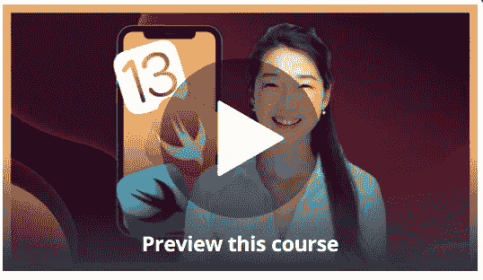
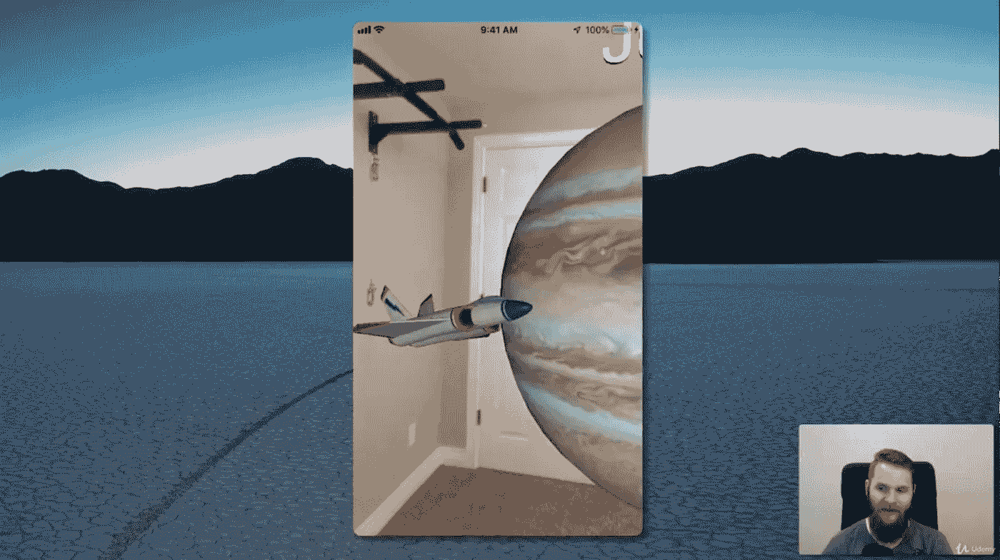
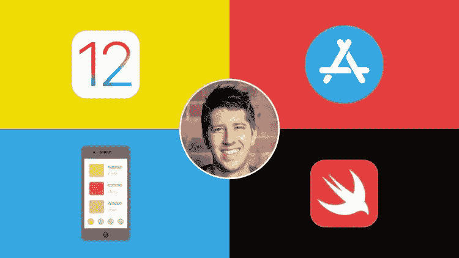
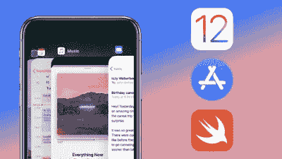

# 2023 年新手学习的 5 门最佳 iOS & Swift 课程

> 原文：<https://medium.com/javarevisited/top-5-online-courses-to-learn-ios-12-swift-in-2019-a35ae1be7b2b?source=collection_archive---------0----------------------->

## 2023 年学习 iOS 和 Swift 5 并成为你一直想成为的 iOS 应用开发者的一些最强大的在线课程列表。

由 [Unsplash](https://unsplash.com?utm_source=medium&utm_medium=referral) 上的[procylink 访客管理系统](https://unsplash.com/@proxyclick?utm_source=medium&utm_medium=referral)拍摄

伙计们，你们好吗？你是否在考虑学习 iOS 和 Swift，成为一名 iOS 应用开发者，并创造下一个震撼世界的应用或游戏？如果这是真的，那么你来对地方了。

在这篇文章中，我将分享一些非常好的在线课程，以在 2023 年学习 iOS 15 和 Swift，并成为你一直想成为的 start iOS 应用程序开发者。

去年，我主要专注于 [Web 开发](https://javarevisited.blogspot.com/2018/02/top-5-online-courses-to-learn-web-development.html)方面，并花时间学习 [React](http://www.java67.com/2018/02/5-free-react-courses-for-web-developers.html) 、 [Angular](http://www.java67.com/2018/01/top-5-free-angular-js-online-courses-for-web-developers.html) 和 [Node JS](http://javarevisited.blogspot.sg/2018/01/top-5-nodejs-and-express-js-online-courses-for-web-developers.html) ，但今年我的目标之一是探索移动世界，尤其是 iOS 和 Android。

至少现在这是一个想法，我不确定我能坚持多久，因为我只有有限的时间来提升自己，但我会尽力而为。

顺便说一句，如果你也有同样的目标，并希望成为一名深度的 iOS 开发者，那么你应该从学习 iOS 15 开始你的旅程，这是苹果在 iPhone 和 iPad 上运行的最新版本的操作系统，以及苹果用于创建 iOS 应用程序的编程语言 Swift 4。实现目标的重要一点是制定计划并拥有实现目标的合适资源。所以，我开始研究学习 [iOS 15](https://javarevisited.blogspot.com/2019/01/top-5-ios-developer-course-to-learn-ios.html) 的最佳方法，发现没有比加入一个好的在线课程更好的方法了。

我首先想到的是面对面的新兵训练营，但成本和时间投入很高，我不知道我能不能做到。在线课程解决了这两个问题，首先，它们比课堂培训或面对面的训练营课程更实惠(相比 1000 美元到 10 美元，是的，它们很便宜)，其次，没有时间承诺。你不需要在任何特定的时间去参加任何课程。你什么时候有时间都可以学。如果你有智能手机和良好的互联网连接，你甚至可以在通勤时观看这些[课程](https://javarevisited.blogspot.com/2019/01/top-5-ios-developer-course-to-learn-ios.html)，这就是我所做的，对我来说非常有用。

你也可以在办公室和家里舒适地学习，这就是为什么我认为在线课程不仅是学习 iOS 15 或 Swift 5 的最佳方式，也是学习任何新技术的最佳方式。

> 然而，在线课程最大的挑战是选择正确的课程。

互联网上充斥着免费和付费的在线课程，但并不是所有的课程质量都很好。

> 如果你最终注册了一个平庸的课程，那么你会浪费很多时间，有时甚至会感到厌倦，对学习失去信心。

这就是为什么在这篇文章中，我将分享一些学习 iOS 15 和 Swift 5 的最佳在线课程。你可以选择这些课程中的任何一门，我个人最喜欢的是 [**iOS Bootcamp**](https://click.linksynergy.com/fs-bin/click?id=JVFxdTr9V80&subid=0&offerid=634352.1&type=10&tmpid=14538&RD_PARM1=https%3A%2F%2Fwww.udemy.com%2Fios-12-app-development-bootcamp%2F) 来启动你的旅程。

# 面向初学者的五大 iOS 和 Swift 在线课程

在我分享学习 iOS 15 和 Swift 5 的在线课程之前，先说一下 iOS 15 本身。iOS 15 是苹果公司开发的 iOS 移动操作系统的最新主要版本，可以在他们的 iPad 和 iPhone 上运行。

最棒的是，它配备了一些真正前沿的技术和 API，允许你创建一些真正令人印象深刻和令人敬畏的应用程序，如 Pokemon Go。我说的技术包括 Core ML 2 和 ARKit 2，苹果的[机器学习](https://javarevisited.blogspot.com/2018/10/data-science-and-machine-learning-courses-using-python-and-R-programming.html)和增强现实 API。选择详细解释这两个关键 API 的课程很重要，尤其是如果你想创建一个令人敬畏的现代应用程序。

# **1。iOS 15 & Swift 5 —完整的 iOS 应用程序开发训练营，作者 Angela Yu**

一句话，这可能是世界上最好的 iOS 开发者课程。它太棒了，甚至激励我去创建一门课程，这是另一个故事，但这是一门非常好的课程。

导师[安吉拉于](https://medium.com/u/5a5584f78d27?source=post_page-----a35ae1be7b2b--------------------------------)很有经验，也很热情。她在 Bootcamp 上教授 iOS 开发，这个课程是这些 boto camp 的在线版本，价格在 8000 美元到 12000 美元之间。

本课程结构严谨，讲解清楚，讲授到位。内容非常棒，动画和图形的出色使用使人们很容易理解新的 iOS 概念，如 Core ML 2 和 ARKit 2。

以下是加入链接:——[**完整的 iOS 15 App 开发训练营**](https://click.linksynergy.com/deeplink?id=JVFxdTr9V80&mid=39197&murl=https%3A%2F%2Fwww.udemy.com%2Fcourse%2Fios-13-app-development-bootcamp%2F)

[课程](https://click.linksynergy.com/fs-bin/click?id=JVFxdTr9V80&subid=0&offerid=634352.1&type=10&tmpid=14538&RD_PARM1=https%3A%2F%2Fwww.udemy.com%2Fios-12-app-development-bootcamp%2F)也非常全面，有 524 个讲座和超过 55.5 小时的材料，但不要担心你不会感到无聊。它也非常实用，你将开发近 25 个应用程序，是的，你没看错这 25 个应用程序包括你自己的 Pokemon go，一个哈利波特风格的报纸应用程序，等等。

他们还提供免费的图形和其他价值 5000 美元的材料，你需要创建一些专业的应用程序，我只用了 13 美元就得到这些，你相信吗？

嗯，这就是我喜欢《我的世界》的原因。你只需花 10 美元就能获得在线版的训练营课程，价格约为 12000 美元，而且终生受益。

谈到社会证明，这门课程在近 41000 名学生中获得了 4.7 分的评分，令人印象深刻。简而言之，深入学习 iOS 15 和 Swift 5 的最佳课程，如果你完成了这个，你可能就不再需要任何课程了。她的网页开发课程[**“2023 年网页开发训练营”**](https://click.linksynergy.com/fs-bin/click?id=JVFxdTr9V80&subid=0&offerid=634352.1&type=10&tmpid=14538&RD_PARM1=https%3A%2F%2Fwww.udemy.com%2Fthe-complete-web-development-bootcamp%2F) 也同样不错，如果你的重点是网页开发，你也会喜欢的。

以下是参加课程的链接:

<https://click.linksynergy.com/deeplink?id=JVFxdTr9V80&mid=39197&murl=https%3A%2F%2Fwww.udemy.com%2Fcourse%2Fios-13-app-development-bootcamp%2F>  

# **2。iOS 15 & Swift 5:从初学者到付费专业**

如果由于某种原因你无法连接到 Angela Yu，那么这是 Udemy 上的另一个全面的 iOS 开发者课程。这门课程包含超过 88 小时的高质量材料。

和 [Angela Yu](https://medium.com/u/5a5584f78d27?source=post_page-----a35ae1be7b2b--------------------------------) 一样，这门课程的讲师[马克·普莱斯](https://medium.com/u/8d2e0353ec39?source=post_page-----a35ae1be7b2b--------------------------------)也是一位经验丰富的 iOS 开发人员和培训师，已经在在线和面对面的新兵训练营培训了 3000 多名学生。

类似于之前的课程这个也会教你 iOS 15 的所有功能像 ARKit，Core ML，App Design，但是也会教你如何在 Swift 4 中编码，以及包括[算法](https://javarevisited.blogspot.com/2018/11/top-5-data-structures-and-algorithm-online-courses.html#axzz5YFaOvjsh)在内的高级编程技术。

下面是加入的链接— [**iOS 15 &雨燕 5:初学者到专家**](https://click.linksynergy.com/fs-bin/click?id=JVFxdTr9V80&subid=0&offerid=634352.1&type=10&tmpid=14538&RD_PARM1=https%3A%2F%2Fwww.udemy.com%2Fdevslopes-ios12%2F)

这门[课程](https://click.linksynergy.com/fs-bin/click?id=JVFxdTr9V80&subid=0&offerid=634352.1&type=10&tmpid=14538&RD_PARM1=https%3A%2F%2Fwww.udemy.com%2Fdevslopes-ios12%2F)非常适合任何想成为 iOS 开发者但没有编程经验的人。你不仅会学到 iOS 12 和 Swift 4，还会学到一般的[编程](https://javarevisited.blogspot.sg/2018/05/10-reasons-to-learn-python-programming.html)。该课程不仅能帮助你找到一份 iOS 开发人员的工作，还能帮助你创建自己的 iPhone 和 iPad 应用程序，成为一名应用程序企业家或其他什么人。这门[课程](https://click.linksynergy.com/fs-bin/click?id=JVFxdTr9V80&subid=0&offerid=634352.1&type=10&tmpid=14538&RD_PARM1=https%3A%2F%2Fwww.udemy.com%2Fdevslopes-ios12%2F)也得到了大约 4000 名学生的平均 4.5 分，这很棒。

# **3。完整的 iOS 12 & Swift 开发者课程—构建 28 个应用**

这是学习 iOS 的另一门[伟大课程](https://click.linksynergy.com/fs-bin/click?id=JVFxdTr9V80&subid=0&offerid=634352.1&type=10&tmpid=14538&RD_PARM1=https%3A%2F%2Fwww.udemy.com%2Fios-12-developer-course%2F)。它也很全面，涵盖了超过 44.5 小时的材料，由像 [Rob Percival](https://medium.com/u/479f328b80ac?source=post_page-----a35ae1be7b2b--------------------------------) 这样的教师设计和交付。

和前两个课程一样，你也将学习 iOS 12 的功能，Xcode 10 & Swift 4 来制作像优步和 Instagram 一样的真正的 iOS 12 应用，使用 Core ML & ARKit，苹果的[机器学习](http://www.java67.com/2019/01/5-free-courses-to-learn-machine-and-deep-learning-in-2019.html)和增强现实 API。

它还包括 [AWS](http://www.java67.com/2018/05/top-5-amazon-web-services-or-aws-courses-to-learn-online.html) 积分和一些图形和应用材料，用于创建自己的专业 iOS 12 应用并在 AppStore 上发布。

以下是加入的链接: [**完整 iOS 12 & Swift 开发者课程**](https://click.linksynergy.com/fs-bin/click?id=JVFxdTr9V80&subid=0&offerid=634352.1&type=10&tmpid=14538&RD_PARM1=https%3A%2F%2Fwww.udemy.com%2Fios-12-developer-course%2F)

简而言之，这是一门学习 iOS 12 的[课程，但大多数课程都来自他们的 iOS 11 版本，你可能会在各处找到它们。谈到社会证明，这门课程也得到了近 9000 名学生的平均 4.5 分，非常优秀。](https://click.linksynergy.com/fs-bin/click?id=JVFxdTr9V80&subid=0&offerid=634352.1&type=10&tmpid=14538&RD_PARM1=https%3A%2F%2Fwww.udemy.com%2Fios-12-developer-course%2F)

# **4。为期 10 天的 iPhone 应用 boot camp——新的 iOS 12 和 Xcode 10**

这个也是学习 iOS 12 和 Swift 4 成为 iOS 开发者的 [nice 课程。讲师](https://click.linksynergy.com/fs-bin/click?id=JVFxdTr9V80&subid=0&offerid=634352.1&type=10&tmpid=14538&RD_PARM1=https%3A%2F%2Fwww.udemy.com%2Fthe-10-day-iphone-app-bootcamp-new-ios-12-and-xcode-10%2F)[尼克·沃尔特](https://medium.com/u/7695369d7431?source=post_page-----a35ae1be7b2b--------------------------------)在短短 10 天内，从零开始解释 iOS 概念到更高级的主题，如[机器学习](http://www.java67.com/2019/01/5-free-courses-to-learn-machine-and-deep-learning-in-2019.html)，做得非常好。

时间条件使得这门课程非常有趣，你每天只需要花 2 到 3 个小时来学习这门课程，10 天后你就可以在苹果的应用商店里拥有自己的 iOS 应用了。

以下是参加课程的链接— [**为期 10 天的 iPhone 应用训练营**](https://click.linksynergy.com/fs-bin/click?id=JVFxdTr9V80&subid=0&offerid=634352.1&type=10&tmpid=14538&RD_PARM1=https%3A%2F%2Fwww.udemy.com%2Fthe-10-day-iphone-app-bootcamp-new-ios-12-and-xcode-10%2F)

它不像以前的课程那样全面，只包含 12 个小时的材料，但仍然教你从零经验开始学习 iOS 和[编程](https://javarevisited.blogspot.com/2019/01/5-free-scala-programming-courses-for-java-programmers-learn-online.html)。

如果你能与 Nick 取得联系，那么你将会喜欢这门课程以及你成为一名深度 iOS 开发人员的旅程。近 3000 名学生对[课程](https://click.linksynergy.com/fs-bin/click?id=JVFxdTr9V80&subid=0&offerid=634352.1&type=10&tmpid=14538&RD_PARM1=https%3A%2F%2Fwww.udemy.com%2Fthe-10-day-iphone-app-bootcamp-new-ios-12-and-xcode-10%2F)的平均评分为 4.7 分，令人印象深刻。

# **5。iOS 12:学习编码&在 Swift 中构建真正的 iOS 应用**

这是另一个在 Udemy 上学习 iOS 的课程。像这个列表中的所有课程一样，这个课程也教授 Swift 4、XCode 10 和 iOS 12。它开始解释 Swift 4 编程的基础，然后转向如何为 iOS 创建应用程序的基础。

但是，它不仅涵盖了基础知识，还涵盖了高级技术，如使用 Core ML2 的[机器学习](https://javarevisited.blogspot.com/2018/10/data-science-and-machine-learning-courses-using-python-and-R-programming.html)和使用 ARkit 2 的增强现实，这些都是 iOS 12 的一些很酷的功能。

链接加入课程— [**iOS 12:学习编码和构建真正的 app**](https://click.linksynergy.com/fs-bin/click?id=JVFxdTr9V80&subid=0&offerid=634352.1&type=10&tmpid=14538&RD_PARM1=https%3A%2F%2Fwww.udemy.com%2Fios-12-learn-to-code%2F)

本课程由讲师 Caleb Stultz 和 Jonathan Burgoyne 合著。两位导师都很热情，也很明确。它也很专业，你不会觉得无聊或看着课睡着了。

最后，这门课程还得到了近 2000 名学生的平均 4.6 分，鉴于安吉拉·于的 iOS 训练营课程的受欢迎程度，这还算不错。

以上是关于 iPhone 和 iPad 应用程序开发学习 iOS 12 和 Swift 4 的一些**最佳课程。通过学习这些课程，您可以创建 iOS 应用程序、游戏、工具等等。你也可以加入许多寻找可靠的 iOS 开发者的公司，与他们一起工作

你可能喜欢的其他**在线编程资源****

1.  [devo PS 程序员路线图](https://javarevisited.blogspot.com/2018/09/the-2018-devops-roadmap-your-guide-to-become-DevOps-Engineer.html)
2.  【Java 和 Web 开发者应该学习的 10 个框架
3.  [为有经验的开发者提供的 10 门免费 Java 课程](http://www.java67.com/2018/08/top-10-free-java-courses-for-beginners-experienced-developers.html)
4.  [深入学习 Docker 的 10 门免费课程](http://www.java67.com/2018/02/5-free-docker-courses-for-java-and-DevOps-engineers.html)
5.  [面向初学者的 10 门数据科学和机器学习课程](https://dev.to/javinpaul/10-data-science-and-machine-learning-courses-for-programmers-looking-to-switch-career-57kd)
6.  [2023 年 React JS 开发者路线图](https://javarevisited.blogspot.com/2018/10/the-2018-react-developer-roadmap.html)
7.  [10 门免费学习数据结构和算法的课程](https://hackernoon.com/10-free-data-structure-and-algorithm-courses-junior-developers-should-explore-978b72871af5)
8.  [深入学习 Node JS 的前 5 门课程](http://javarevisited.blogspot.sg/2018/01/top-5-nodejs-and-express-js-online-courses-for-web-developers.html)
9.  [深入学习 React JS 的 5 大课程](https://javarevisited.blogspot.com/2018/08/top-5-react-js-and-redux-courses-to-learn-online.html)
10.  [面向 Java 开发人员的 5 门 Android 在线培训课程](https://javarevisited.blogspot.com/2017/12/top-5-android-online-training-courses-for-Java-developers.html)

# 结束语

感谢您阅读本文。你可能会想，有这么多东西要学，有这么多课程要参加，但你不需要担心。

很有可能你已经知道了大部分内容，也有很多有用的免费资源供你使用，我也在这里和那里链接了它们以及最好的资源，这些资源当然不是免费的，但是很值钱。

我是 Udemy 课程的特别粉丝，因为这些课程非常实惠，并且以很少的金额提供很多价值，但是你可以自由选择你想要的课程。

说到底，你应该对这里提到的事情有足够的知识和经验。

祝您的 iOS 应用程序开发之旅好运！当然**不会很容易**，但是通过遵循这个路线图和指南，你离成为你一直想成为的 iOS 应用开发者又近了一步

如果你喜欢这篇文章，那么请考虑在 medium ( [javinpaul](https://medium.com/u/bb36d8439904?source=post_page-----a35ae1be7b2b--------------------------------) )上关注我。如果你想在每篇新文章上得到通知，别忘了在 Twitter 上关注**[**javarevited**](https://twitter.com/javarevisited)！**

**再出这 5 个，如果要选一个，就加入第一个[**完整的 iOS App 开发 Bootcamp**](https://click.linksynergy.com/deeplink?id=JVFxdTr9V80&mid=39197&murl=https%3A%2F%2Fwww.udemy.com%2Fcourse%2Fios-13-app-development-bootcamp%2F) 简直是 2023 年最好的 iOS 开发者课程。**

**<https://click.linksynergy.com/fs-bin/click?id=JVFxdTr9V80&subid=0&offerid=634352.1&type=10&tmpid=14538&RD_PARM1=https%3A%2F%2Fwww.udemy.com%2Fios-12-app-development-bootcamp%2F>  

> **p . s .**——如果你正在寻找免费的在线课程来学习 iOS 和 Swift 编程语言，那么你也可以看看我为程序员准备的免费 iOS 和 Swift 课程清单<https://javarevisited.blogspot.com/2018/11/5-free-ios-app-development-courses-for.html>

## **您可能喜欢的其他媒体文章:**

**</javarevisited/my-favorite-flutter-and-dart-programming-courses-for-beginners-9e8355710d78>  </hackernoon/top-5-courses-to-learn-android-for-java-programmers-667e03d995b4>  </hackernoon/top-5-react-native-courses-for-mobile-application-developers-b82febdf8a46> ****