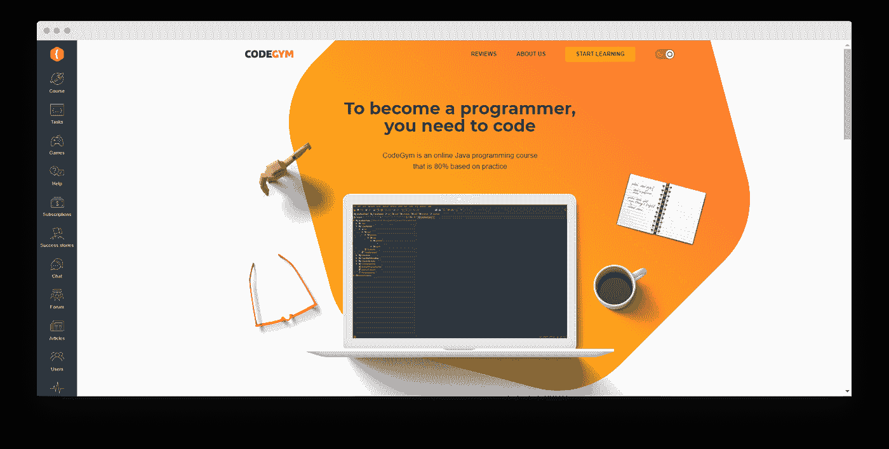
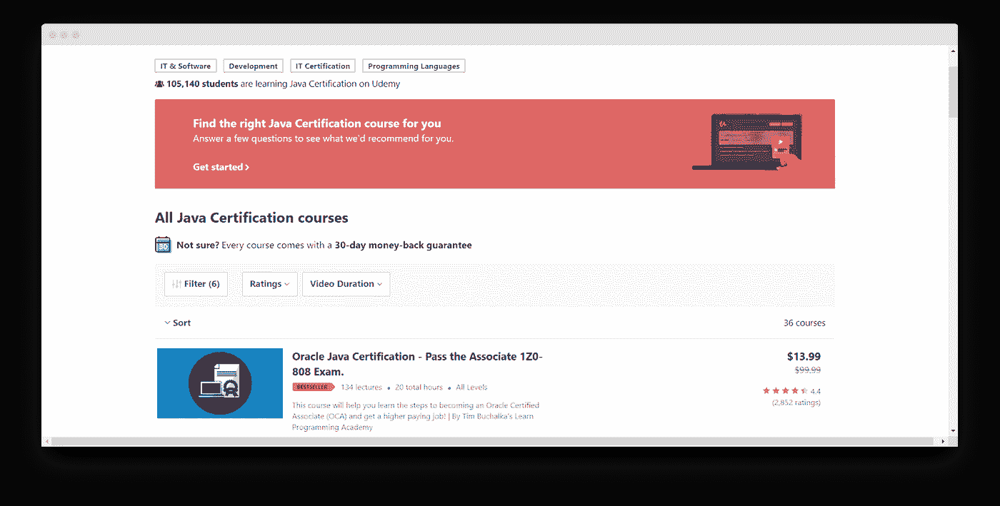
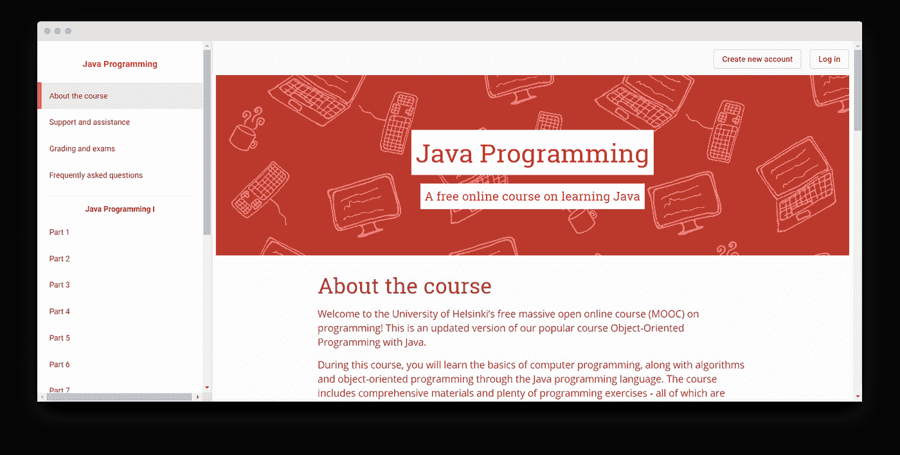

# 2020 年学习 Java 编程的 5 大在线课程

> 原文：<https://medium.com/javarevisited/top-5-online-courses-to-learn-java-programming-in-2020-50aac50bb324?source=collection_archive---------2----------------------->

照片由[米切尔罗](https://unsplash.com/@mitchel3uo?utm_source=unsplash&utm_medium=referral&utm_content=creditCopyText)在 [Unsplash](https://unsplash.com/?utm_source=unsplash&utm_medium=referral&utm_content=creditCopyText)

如果你想在现代就业市场上保持领先，编程是最需要学习的技能之一。[根据统计数据](https://focus.kornferry.com/wp-content/uploads/2015/02/The-Global-Talent-Crunch.pdf)，对技术专家的需求正在飙升——到 2030 年，我们将缺少超过 8500 万专业人员来满足该领域的需求。

如果您决定开始一段软件开发之旅，您可能会被数百个教程、课程和资源吓跑。举例来说，Java 提供了如此多的学习材料——然而，学生们经常难以区分它们的优先次序，最终因为他们在太短的时间内承担了太多的内容而筋疲力尽。

在这篇文章中，我将看看我为 Java 学习者开设的 y 课程——你会发现它们需要花多少时间来完成，它们的优缺点是什么，以及如何将它们融入一个系统的课程中。

# 在我们开始之前:为什么你应该学习 Java

当一个学生掌握了 HTML 和 CSS 的基本窍门时，编程社区正在进行一场关于他应该学习哪种语言的辩论。从 [C++](/@javinpaul/top-10-courses-to-learn-c-for-beginners-best-and-free-4afc262a544e) 到 [Python](/swlh/5-free-python-courses-for-beginners-to-learn-online-e1ca90687caf) 和 [Golang](/javarevisited/7-online-courses-to-learn-golang-or-go-programming-languages-in-2020-f599a25cf14a) ，开发者给编程学生建议的起点各不相同。

就个人而言，我一直是 Java 作为第一语言的一份子，原因如下:

*   **Java 流行**。在 TIOBE 指数上排名第二，并为开发人员提供了超过 28，000 个职位空缺(根据 Indeed)，一旦你学会了这种语言，你肯定会最终使用它。Java 开发职位的薪水也很高——一名软件工程师的平均年薪超过 79，000 美元。
*   **Java 通用**。如果你想学习一门语言来发展自己的事业，Java 是合适的选择。就其本身而言，它能够处理广泛的任务 web 和移动应用程序、大数据项目、服务器、GUI 和许多其他任务。虽然 JS、库和框架是 Java 开发人员旅程的逻辑延续，但是理解该语言的基本语法可以让您走得更远。
*   **Java 是根本**。作为面向对象语言的典型案例之一和最早发布的编程语言之一，Java 启发了其他多种技术的创造者。例如，C#重新利用了 Java 的语法——一旦你知道了其中一种，学习另一种就容易多了。为什么这对 Java 学习者很重要？简而言之，在学习 Java 之后，你将会更容易破解其他 OOP 语言——C、C++、C#、JavaScript 等等。
*   Java 有丰富的工具集。从 ide 到 API 和库，这门语言有足够的空间来增加功能。学习这种语言可以让您在管理接口方面有更多的自由，更不用说从库中复制代码片段的能力，从而减少开发时间。根据我的经验，Java 的工具集使这种语言变得极其方便和高效。

# 每个 Java 学习者都应该学习的 5 大课程

既然我已经介绍了学习 Java 的主要好处，并且您对致力于掌握这门语言充满信心，那么是时候谈谈学习资源了。就我个人而言，我喜欢使用在线课程学习——我已经发现了很多结构良好的交互式课程。

这里是我最喜欢的学习资源，Java 开发人员和高级学习者都可以从中获益匪浅。

# 1.Codegym

**支持的平台** : [桌面](https://codegym.cc/)，[安卓](https://play.google.com/store/apps/details?id=com.hitechrush.codegym&hl=en)

**优点**:

*   基于实际的编码任务
*   涵盖初级和高级 Java 主题
*   用户友好的移动应用程序，适合在旅途中学习
*   虚拟导师
*   活跃的 Java 学习者社区
*   结构良好的课程

**缺点**:

*   没有 iOS 应用程序
*   不支持除 Java 之外的其他语言
*   数量有限的课程是免费的

Codegym 是一个 Java 学习平台，它提供了对编程语言的深入了解。学习编程可能看起来很无聊——然而，除了实践，没有其他方法来处理语言的概念。

如果你和我一样——在全职工作和其他承诺之间周旋，只留出时间写代码听起来好得不像真的。这就是为什么能够在内置 IDE 的智能手机上编写代码会很方便。

除此之外，Codegym 是游戏化的——所有的课程都按级别分组。尽快提升的愿望是一个强大的动力，让你经历 Java 学习的高潮和低谷。

**主要特点:**

*   访问 1200 多场精彩讲座
*   立即获得任务等级
*   尽可能多花时间学习小型讲座
*   根据你的技能选择内容——初级和高级 Java 学习者都有广泛的选择
*   免费完成基础 Java 语法课程。

# 2.Udemy 上的 Java 认证培训

**支持的平台** : [桌面](https://www.udemy.com/topic/java-certification/)， [iOS](https://apps.apple.com/us/app/udemy-online-video-courses/id562413829) ， [Android](https://play.google.com/store/apps/details?id=com.udemy.android&hl=en)

**优点**:

*   针对不同熟练程度的开发人员的 10 多门课程
*   适用于智能手机
*   所有程序都很详细

**缺点**:

*   没有系统的语言学习方法
*   并非所有的课程都处于相同的质量水平
*   有限的师生联系

作为最大的在线教育平台之一，Udemy 有大量的 Java 课程可供选择。以下是我最喜欢的平台认证项目:

*   [**OCA 考试模拟**](https://click.linksynergy.com/deeplink?id=JVFxdTr9V80&mid=39197&murl=https%3A%2F%2Fwww.udemy.com%2Fcourse%2Fjava-oca%2F) 。如果您正在考虑参加 Oracle 认证助理考试，这是一个值得尝试的计划。在这里，你会发现几十个测验和练习题，涵盖了基本的 Java 语法概念、API 处理、OOP 和其他你可能会在考试中遇到的问题。有四次模拟测验，每一次有 70 个问题。完成这些肯定会让你对自己的技能有更多的认识。
*   [**Java 编程循序渐进**](https://click.linksynergy.com/deeplink?id=JVFxdTr9V80&mid=39197&murl=https%3A%2F%2Fwww.udemy.com%2Fcourse%2Fjava-programming-step-by-step-from-a-to-z%2F) 。这是一个更通用的程序——尽管它不能让你对 Java 有深入的理解，但它在为编程学生设计课程方面做得很好。该课程提供 20 个模块，平均每个部分有 6-8 堂课。
*   [**JUnit 测试——面向初学者的 Java 单元测试**](https://click.linksynergy.com/deeplink?id=JVFxdTr9V80&mid=39197&murl=https%3A%2F%2Fwww.udemy.com%2Ftopic%2Fjunit%2F) 。这个项目向编程学生介绍 Java 测试——广泛使用的工具、最佳实践和不同类型的案例。该课程涵盖了初级和高级编程概念(如参数化、重复测试或假设)。

**主要特点:**

*   广泛的课程
*   结构化程序，由 Java 专家出版
*   学习材料的费用从 10 美元到 100 美元不等
*   适用于移动平台

# 3.Java 基础知识

**支持的平台** : [桌面](https://pluralsight.pxf.io/c/1193463/424552/7490?u=https%3A%2F%2Fwww.pluralsight.com%2Fcourses%2Fjava-fundamentals-object-oriented-design)， [iOS](https://apps.apple.com/us/app/pluralsight/id431748264) ， [Android](https://play.google.com/store/apps/details?id=com.pluralsight&hl=en)

**优点**:

*   固体概念的基础介绍
*   实践驱动的任务
*   讲座数量少，几天内就能轻松完成

**缺点**:

*   不包括面向对象的设计
*   对高级学习者来说信息量不大

对于许多学生来说，理解 Java 仅限于掌握 API 和语法。这就是为什么许多人错过了这门语言的一个重要概念——理解设计模式。

我相信掌握设计模式会极大地提高开发人员的日常效率，减少完成项目并在发布后保持项目运行所需的时间。这就是为什么我多年来一直在寻找关于设计模式的合适资源，并最终找到了这个 Pluralsight 课程。

首先，它将揭穿你的 OOP 和设计的误解。如果你不知道拥有最多数据的对象应该做最多的工作，或者你不应该从一开始就请求数据的帮助，那么这两个观点已经在你组织工作的方式上产生了影响。还有更多，但你可能想自己去看看。

**主要特点:**

*   互动视频和测验
*   简明扼要的课程
*   所有概念都有真实的例子
*   涵盖语法和设计模式

# 4.Java 编程:用软件解决问题(在 Coursera 上)

**支持的平台** : [桌面](https://www.coursera.org/learn/java-programming)，[安卓](https://play.google.com/store/apps/details?id=org.coursera.android&hl=en_US)， [iOS](https://apps.apple.com/us/app/coursera-learn-new-skills/id736535961)

**优点:**

*   教授 Java 理论的深入方法
*   课程完成证书
*   涵盖网站管理和 CSV 分析，不包括 Java 语法基础知识

**缺点**:

*   不提供系统的课程
*   所有编译器示例都以 BlueJ 为特色，而不是 Eclipse 或 IntelliJIDEA
*   有些测验是重复的

如果你正在学习 Java 来改善你的商业运作方式和解决实际问题，那就看看这个 Coursera 项目吧。除了教你语言的基础，这门课程还鼓励编程学生像开发者一样思考。它的特点是大量的测验，要求解决问题和找到正确的工具来实现既定目标的能力。

看看该计划涵盖的主要主题:

*   Java 的语义和语法
*   处理字符串
*   编辑 CSV 文件
*   从头开始完成一个实用的编码项目

**主要特点**:

*   课程是免费的
*   不同语言的字幕
*   学生在完成课程后获得证书
*   本课程为每个模块提供了视频讲座和测验

# 5.赫尔辛基 Java MOOC 封面

**支持的平台:** [桌面](https://mooc.helsinki.fi/)

**优点**:

*   更深入地介绍了 OOP 和 Java 的基础知识，大多数程序
*   提供现实生活中的应用程序来支持每个概念
*   给学生许多类似的练习题，提高知识记忆

**缺点**:

*   完成 10 个以上的模块需要一些时间
*   对初学者的挑战
*   讲座以理论为基础，阅读量很大

Helsinki MOOC on Java 受到了全世界成千上万开发者的称赞。如果你是一名编程学生，你会喜欢这本书，因为它紧跟学术课程。

除了学习 Java 理论，您还可以通过在内置 IDE 中完成项目来测试自己的技能。因为任务是即时验证的，所以写代码和评分就像玩游戏一样。我只希望这门课程能帮助学生运用他们解决问题的技能，而不仅仅是获得 Java 的“肌肉记忆”——但是，就目前而言，我不得不接受 MOOC 的现状。

**主要特点**:

*   1000 多个实用 Java 小测验
*   基础语法解释
*   分为 14 个部分，完成每个部分平均需要 20 个小时

# 结论

虽然你可以在网上找到的数量惊人的课程和 Java 学习平台可能是一把双刃剑，但归根结底，现代学生很幸运有这么多资源可以依赖。在选择合适的学习资源时，确保课程与您的 Java 熟练程度相匹配。

花点时间试试上面列出的平台，并在评论中分享你最喜欢的。