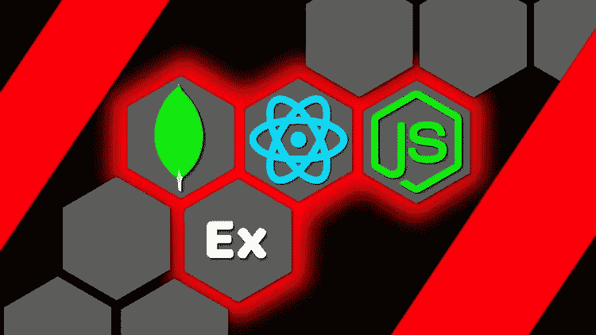
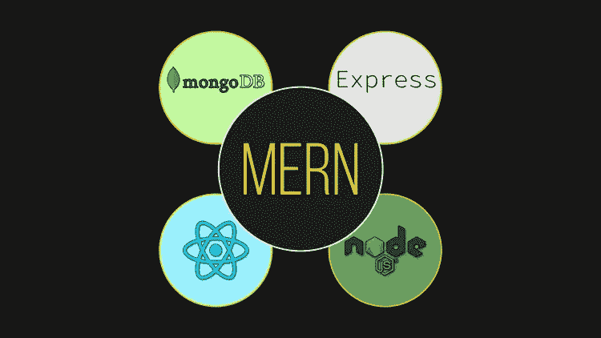
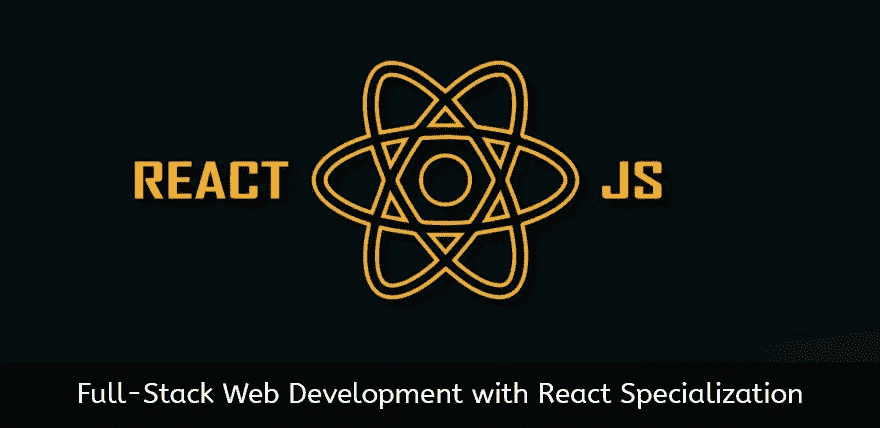
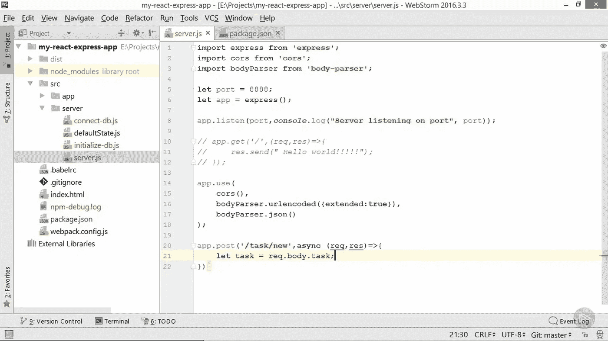

# 2023 年初学者学习的 6 门最佳 MERN 栈在线课程

> 原文：<https://medium.com/javarevisited/top-5-online-courses-to-learn-mern-stack-in-depth-9947230f194?source=collection_archive---------0----------------------->

## 这些是从 Udemy，Coursera，Pluralsight 在线学习 MERN (Mongo，Express，React，Node)的最好的在线培训课程

近年来，MERN 堆栈开发越来越受欢迎。MERN 堆栈是两个流行的 JavaScript 堆栈之一，另一个是平均堆栈，用于开发单页面动态 web 应用程序。

**分别代表 MongoDB、Express.js、React.js、Node.js**

*   **MongoDB :一个流行的 NoSQL 数据库。它以 JSON 格式存储数据。**
*   **[express . js](https://javarevisited.blogspot.com/2018/01/top-5-nodejs-and-express-js-online-courses-for-web-developers.html):node . js 的灵活极简 web 框架。**
*   **[React.js](/@javinpaul/top-5-courses-to-learn-react-js-in-2019-best-of-lot-fa02cd96cdf0?source=---------16------------------) :用于创建用户界面的 JavaScript 库。**
*   **[Node.js](/javarevisited/top-10-online-courses-to-learn-node-js-in-depth-8ef0e31ca139) :用于在浏览器外执行 JavaScript 的运行时环境。**

**MERN 堆栈包含涵盖客户端和服务器端的技术。JavaScript 是主要语言，所以你不需要学习多种编程语言来开发一个端到端的网络应用。

[React.js](https://javarevisited.blogspot.com/2018/08/top-5-react-js-and-redux-courses-to-learn-online.html#axzz5r06B3egD) 被认为是开发用户界面的最佳库之一，而 [Express.js](https://javarevisited.blogspot.com/2018/01/top-5-nodejs-and-express-js-online-courses-for-web-developers.html) 是速度增强的完美选择。有了 React，您就拥有了 UI 渲染的灵活性和卓越性能。

MongoDB 是无模式的，不像 SQL 数据库那么复杂。使用 [MongoDB](https://javarevisited.blogspot.com/2019/01/top-5-mongodb-online-training-courses.html) 很容易理解和工作。没有复杂的连接和查询。这篇文章列举了五门在线课程。这三个网站——Udemy、Coursera 和 Pluralsight 都很受寻求在线学习的人的欢迎。**

# **2023 年初学者学习 MERN 堆栈的 6 个最佳课程**

**有几个学习 MERN 堆栈的在线培训课程，但不是每个课程都是好的，如果你坚持一个坏的课程，那么你会失去你的时间和金钱。**

**正如你所看到的，MERN 堆栈中有不同的技术(Mongo、 [ExpressJS](https://www.java67.com/2022/02/top-5-courses-to-learn-expressjs-in.html) 、 [React](/javarevisited/top-10-free-courses-to-learn-react-js-c14edbd3b35f?source=extreme_main_feed----d3a191ac6ed-----5-1--------------------561c2dc6_a2b4_41e0_b7be_1d97edbf631c--8) 和 [Node](/javarevisited/7-free-courses-to-learn-node-js-in-2020-2f1dd6722b49) )，你需要适当的指导来学习每一种技术。正确理解它们之后，你需要知道如何实现它们来创建一个 MERN 堆栈应用程序。因此，在这篇文章中，我将提供一个在线的前五名 MERN 堆栈课程的列表。**

## **1. [MERN 栈从前到后:全栈 React，Redux & Node.js](https://click.linksynergy.com/deeplink?id=JVFxdTr9V80&mid=39197&murl=https%3A%2F%2Fwww.udemy.com%2Fcourse%2Fmern-stack-front-to-back%2F)**

**“MERN 堆栈从前到后:全堆栈 React，Redux & Node.js”被评为 9000 多次，是 udemy.com 最畅销的 MERN 堆栈课程。**

**它是由 Brad Travers**[**创建的，他在 Udemy 上有令人印象深刻的 4.7 分的讲师评分和超过 7 万条评论，自从我在 Udemy 上看了他的**](https://click.linksynergy.com/deeplink?id=CuIbQrBnhiw&mid=39197&murl=https%3A%2F%2Fwww.udemy.com%2Fuser%2Fbrad-traversy%2F) **[JavaScript 课程](https://click.linksynergy.com/deeplink?id=JVFxdTr9V80&mid=39197&murl=https%3A%2F%2Fwww.udemy.com%2Fcourse%2Fmodern-javascript-from-the-beginning%2F)后，我真的很喜欢他的教学风格。******

****他的声音平静而清晰，这使得学习非常有效，他的课程非常实用，他会向你展示一些东西。我经常用手机和电视连接观看他的课程，这是最好的学习体验。

本课程也涵盖了包括 redux 在内的 MERN 堆栈应用所需的一切。该课程长达 12 个小时，讲师已确保以简洁明了的方式对所有内容进行了适当的解释。****

******要求******

*   ****[节点](/javarevisited/7-free-courses-to-learn-node-js-in-2020-2f1dd6722b49)的基础知识。****
*   ****[反应](https://javarevisited.blogspot.com/2020/04/top-5-courses-to-become-full-stack-java-developer-with-Angular-and-Reactjs.html#axzz6Nq9yk7Sc)的基础知识。****

****最近，该课程进行了更新，增加了更多高级功能，如 [React hooks](/javarevisited/top-10-free-courses-to-learn-react-js-c14edbd3b35f) 和 Async/await。这也是一个 Udemy 课程，所以你有一个体面的价格终身访问。此外，您还将在结束时获得结业证书。****

******这里是加入本课程的链接**——[MERN 栈从前到后:全栈 React，Redux & Node.js](https://click.linksynergy.com/deeplink?id=JVFxdTr9V80&mid=39197&murl=https%3A%2F%2Fwww.udemy.com%2Fcourse%2Fmern-stack-front-to-back%2F)****

********

## ****2. [React，NodeJS，Express&MongoDB——MERN 全栈指南](https://click.linksynergy.com/deeplink?id=JVFxdTr9V80&mid=39197&murl=https%3A%2F%2Fwww.udemy.com%2Fcourse%2Freact-nodejs-express-mongodb-the-mern-fullstack-guide%2F)****

****这是我最喜欢的在 Udemy 上学习 MERN 堆栈的课程。由 Udemy 最受欢迎的讲师之一创建的“React、NodeJS、Express 和 MongoDB——MERN 完整堆栈指南”是另一个优秀的 MERN 堆栈课程。****

****maximilian Schwarzüller 是这门课程的创始人，他在 Udemy 有超过一百万的学生。像布拉德，马克斯是另一个教练，我评价很高。他知识渊博，有用非常简单的方式解释事情的诀窍。施瓦茨米勒还以描述一切细节而闻名，所以课程有点长，超过 18 个小时，但如果你正在寻找一个解释清楚的 MERN 堆栈课程，这是值得购买的。****

****很有可能你已经参加过他的 [React 16 完全指南](https://click.linksynergy.com/fs-bin/click?id=JVFxdTr9V80&subid=0&offerid=323058.1&type=10&tmpid=14538&RD_PARM1=https%3A%2F%2Fwww.udemy.com%2Freact-the-complete-guide-incl-redux%2F)或 [Angular 完全指南](http://bit.ly/2AGzgzN)课程学习 React.js 和 Angular，我其实是在 Udemy 特卖上一起买的这三门课程。****

******要求******

*   ****React 的基础知识。****
*   ****推荐使用[反应钩](/javarevisited/top-10-free-courses-to-learn-react-js-c14edbd3b35f?source=---------10------------------)的基础知识。****
*   ****推荐使用 MongoDB、Express 和 Node 的基础知识，但不是强制性的。****

******以下是加入本课程的链接** — [React，NodeJS，Express&MongoDB—MERN 全栈指南](https://click.linksynergy.com/deeplink?id=JVFxdTr9V80&mid=39197&murl=https%3A%2F%2Fwww.udemy.com%2Fcourse%2Freact-nodejs-express-mongodb-the-mern-fullstack-guide%2F)****

********

## ****3.【React 专业化的全栈 Web 开发— Coursera****

****该课程在 coursera.com 大学开设，由香港科技大学教授 Jogesh K. Muppala 授课。本课程分为四个部分，每个部分针对一种特定的技术。它有 4.7 的优秀评分。

它不仅涵盖了 [React](/@javinpaul/top-5-courses-to-learn-react-js-in-2019-best-of-lot-fa02cd96cdf0) 、MongoDB、 [Node](https://www.java67.com/2019/07/top-5-free-nodejs-courses-for-web-development.html) 和用于 web 开发的 Express，它还有一个使用 React Native 创建跨平台移动应用的课程。****

******要求******

*   ****[*HTML*](/javarevisited/5-free-html-and-css-courses-to-learn-front-end-web-development-online-8b04517c6ecb?source=collection_home---4------0-----------------------) ， [*CSS*](/javarevisited/top-5-advanced-css-courses-to-learn-flexbox-grid-and-sass-da8e37b09b1d) ， [*JavaScript*](/javarevisited/10-best-online-courses-to-learn-javascript-in-2020-af5ed0801645) 的知识。****

****这是一门付费课程，但如果你有经济问题，你可以随时选择 Coursera 提供的经济资助选项来免费注册。不需要证书也可以免费考。****

******这是参加本课程的链接**—[React 专业化的全栈 Web 开发](https://coursera.pxf.io/c/3294490/1164545/14726?u=https%3A%2F%2Fwww.coursera.org%2Fspecializations%2Ffull-stack-react)****

********

****顺便说一句，如果你发现 Coursera 课程有用，因为它们是由世界各地知名的公司和大学创建的，我建议你加入**[**Coursera Plus**](https://coursera.pxf.io/c/3294490/1164545/14726?u=https%3A%2F%2Fwww.coursera.org%2Fcourseraplus)，这是一个课程订阅计划，可以访问他们最受欢迎的课程、专业、专业证书和指导项目。它每年花费大约 399 美元，但是它完全物有所值，因为你可以获得无限的证书。******

**** [## Coursera Plus |无限制访问 7，000 多门在线课程

### 用 Coursera Plus 投资你的职业目标。无限制访问 90%以上的课程、项目…

coursera.pxf.io](https://coursera.pxf.io/c/3294490/1164545/14726?u=https%3A%2F%2Fwww.coursera.org%2Fcourseraplus)**** 

## ****4.[使用 React 和 Express 构建全栈应用——plural sight](https://pluralsight.pxf.io/c/1193463/424552/7490?u=https%3A%2F%2Fwww.pluralsight.com%2Fcourses%2Freact-express-full-stack-app-building)****

****如果你想学习高级的全栈开发，那么这个课程是一个完美的选择。“用 React 和 Express 构建全栈应用”在 pluralsight.com 公开，面向希望学习如何使用 MERN 栈开发高级 web 应用的观众。

除了 [React](https://hackernoon.com/the-2020-reactjs-developer-roadmap-8q143yan) 、Node、Express、MongoDB，这个课程还涵盖了 Webpack、Babel、Redux saga。所以如果你正在选择这门课程，请准备好一些高级概念。这门课只有三个多小时。

**要求******

*   ****React、Node、Express 和 MongoDB 的知识。****
*   ****[Git](/@javinpaul/top-10-free-courses-to-learn-git-and-github-best-of-lot-967aa314ea) 的知识。****

******以下是参加本课程的链接** — [使用 React 和 Express 构建全栈应用](https://pluralsight.pxf.io/c/1193463/424552/7490?u=https%3A%2F%2Fwww.pluralsight.com%2Fcourses%2Freact-express-full-stack-app-building)****

********

****顺便说一句，你需要一个 Pluralsight 会员资格才能参加这个课程。如果你没有 Pluralsight 会员资格，我建议你申请一个。它的价格大约是每月 29 美元或每年 299 美元(14%的折扣)。

或者，您也可以利用他们的 [**10 天免费试用期**](https://pluralsight.pxf.io/c/1193463/424552/7490?u=https%3A%2F%2Fwww.pluralsight.com%2Flearn) 来免费访问此课程，因为它提供了他们所有 6000+在线培训课程中的 200 分钟。****

**** [## 对个人来说

### Pluralsight 帮助个人学习者获得掌握最新软件开发所需的技术技能…

pluralsight.pxf.io](https://pluralsight.pxf.io/c/1193463/424552/7490?u=https%3A%2F%2Fwww.pluralsight.com%2Flearn)**** 

## ****5. [MERN Stack 大师课程——打造自己的 Instagram](https://click.linksynergy.com/deeplink?id=JVFxdTr9V80&mid=39197&murl=https%3A%2F%2Fwww.udemy.com%2Fcourse%2Fmern-stack-master-course-building-your-own-instagram%2F)****

****udemy 上另一门受欢迎的 MERN stack 课程“MERN Stack Master Course——构建你自己的 Instagram”相对来说比列表中提到的其他课程都要短。它仍然有十个小时长，并且对每个概念都提供了很好的解释。它解释了从 API 开发到在 Heroku 上部署应用程序的方方面面。这个课程非常有趣，因为最终产品是你自己的 Instagram。此外，它还涵盖了 react 钩子、 [JWT](/javarevisited/top-10-courses-to-learn-spring-security-and-oauth2-with-spring-boot-for-java-developers-8f0222d6066d?source=---------5-----------------------) 认证、使用[邮递员](https://javarevisited.blogspot.com/2020/02/top-5-postman-tutorials-and-courses-for-web-developers.html)测试 API 等等。

要求:****

*   ****React 的基础知识。****
*   ****节点基础知识。****

****简而言之，在 Udemy 上学习 learn 斯塔克的实用和最新课程之一。你也可以在每月疯狂的 Udemy 销售上花 10 美元购买这门课程。****

******以下是加入本课程的链接** — [MERN Stack 大师课程——打造你自己的 Instagram](https://click.linksynergy.com/deeplink?id=JVFxdTr9V80&mid=39197&murl=https%3A%2F%2Fwww.udemy.com%2Fcourse%2Fmern-stack-master-course-building-your-own-instagram%2F)****

********

## ****6. [MERN 电子商务从无到有](https://click.linksynergy.com/deeplink?id=JVFxdTr9V80&mid=39197&murl=https%3A%2F%2Fwww.udemy.com%2Fcourse%2Fmern-ecommerce%2F)****

****到目前为止，我们已经看到了一些课程，在这些课程中，你会得到多个项目来练习，但这些都是一些小项目。这是一个真实的东西，一个完整项目的一门课程，这不是一个小课程，它包含超过 15 个小时的内容，你将使用 MERN 栈建立一个成熟的电子商务网站，我的意思是与 React，Redux，Express & MongoDB****

****这不是一门文档类型的课程。这是一个让你的手脏起来的过程，最终，你会有一个实际的真实世界的项目来使用并放在你的投资组合中。本课程的独特之处在于布拉德的教学风格，这种风格完美无瑕，让人很容易理解课程内容。

通过做这个项目，你会学到几个关键技能，比如:****

*   ****与功能组件和挂钩反应****
*   ****反应路由器****
*   ****React-Bootstrap UI 库****
*   ****如何构建组件****
*   ****组件级状态和属性****
*   ****使用 Express 创建一个庞大的后端****
*   ****使用 MongoDB 数据库和 Mongoose ODM****
*   ****JWT 身份验证(JSON web 令牌)****
*   ****创建自定义身份验证中间件****
*   ****自定义错误处理程序****
*   ****集成 PayPal API****
*   ****项目部署等等！****

****如果你是一名 web 开发人员，或者想成为一名使用 [MERN 栈](https://www.java67.com/2020/06/top-5-courses-to-learn-mern-stack-for-web-development.html)的全栈 web 开发人员，那么我强烈推荐这门基于项目的课程。再说一次，你可以在 Udemy 上花 9.9 美元买到这个综合课程。****

******这里是加入这个项目课程**——[MERN 电子商务从零开始](https://click.linksynergy.com/deeplink?id=JVFxdTr9V80&mid=39197&murl=https%3A%2F%2Fwww.udemy.com%2Fcourse%2Fmern-ecommerce%2F)的链接****

********

****以上就是 2023 年学习 MERN 堆栈的**最佳课程**。web 开发社区对 MERN 堆栈开发人员有很高的需求。谷歌上有很多 MERN 大学的课程，但其中只有少数值得一去，这个列表将帮助你节省时间和金钱。****

****如果你想成为 MERN 堆栈网站开发人员，那么我强烈建议你参加这些课程之一，以启动你的旅程。

其他**你可能喜欢探索的 Web 开发文章******

*   ****[2023 年网络开发者路线图](https://javarevisited.blogspot.com/2019/02/the-2019-web-developer-roadmap.html)****
*   ****[2023 年学角的 10 本书和课程](/javarevisited/top-10-angular-books-and-courses-for-beginners-and-experienced-web-developers-best-of-lot-9a2dae87f04c)****
*   ****[2023 年学习 JavaScript 的 10 门课程](https://javarevisited.blogspot.com/2018/06/top-10-courses-to-learn-javascript-in.html)****
*   ****[2023 年学习 HTML 和 CSS 的 5 大免费课程](http://www.java67.com/2018/02/5-free-html-and-css-courses-to-learn-web-development.html)****
*   ****[我最喜欢的 2023 年学习 Web 开发的课程](/better-programming/my-5-favorite-courses-to-learn-web-development-in-2019-a5e74167f8b2)****
*   ****[2023 年 5 门免费学习 Bootstrap 的课程](https://www.java67.com/2019/01/5-free-bootstrap-course-to-learn-online.html)****
*   ****[初学者学习打字稿的 10 门免费课程](/javarevisited/top-10-free-typescript-courses-to-learn-online-best-of-lot-44bce9da41d1)****
*   ****[为什么学习 Web 开发永远都不晚](https://javarevisited.blogspot.com/2019/06/its-never-too-late-to-learn-web-development.html)****
*   ****[2023 年学习 React 和 Redux 的 5 大课程](/@javinpaul/top-5-courses-to-learn-react-js-in-2019-best-of-lot-fa02cd96cdf0)****
*   ****[2023 年学习 Angular 的前 5 门课程](https://javarevisited.blogspot.com/2018/06/5-best-courses-to-learn-angular.html)****
*   ****[面向 Java 开发者的 5 门免费 Spring 框架课程](http://www.java67.com/2017/11/top-5-free-core-spring-mvc-courses-learn-online.html)****
*   ****[2023 年学习 Node.js 最佳课程之五](https://javarevisited.blogspot.com/2018/01/top-5-nodejs-and-express-js-online-courses-for-web-developers.html#axzz5VllnxgVT)****
*   ****[如何在 2023 年成为 Moder React JS 开发者](https://javarevisited.blogspot.com/2018/10/the-2018-react-developer-roadmap.html)****

****感谢您阅读本文。如果你觉得这些 MERN 堆栈课程有用，那么请与你的朋友和同事分享。如果您有任何问题或反馈，请留言。

**【p . s .】**—如果你不介意从免费的资源中学习，比如免费的在线课程、书籍和教程，那么你也可以看看这个 [**5 种学习 web 开发的免费资源的列表**](http://www.java67.com/2018/03/top-5-free-courses-to-learn-web-development.html) ，其中我分享了一些对 web 开发人员有用的免费资源。****

**** [## 学习 HTML 5、CSS 3 和 Web 开发的 10 大免费课程

### 大家好，我已经分享了很多关于各种技术和编程语言的免费在线课程和书籍…

medium.com](/javarevisited/top-10-free-courses-to-learn-html-5-css-3-and-web-development-872d62d97a97)****